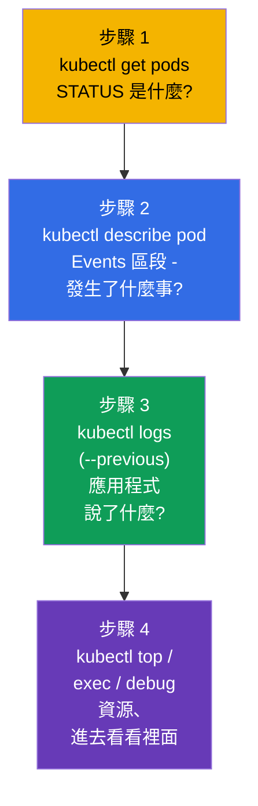
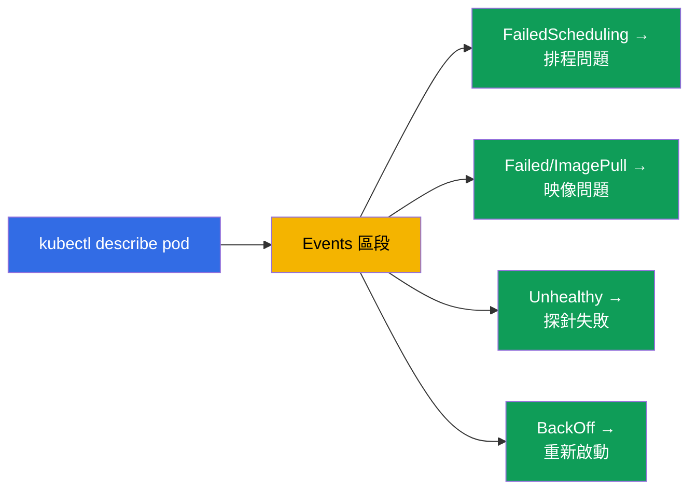
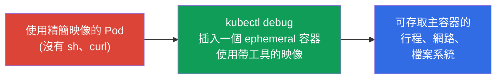
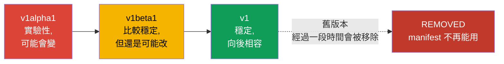
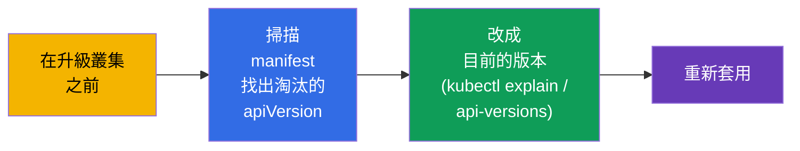
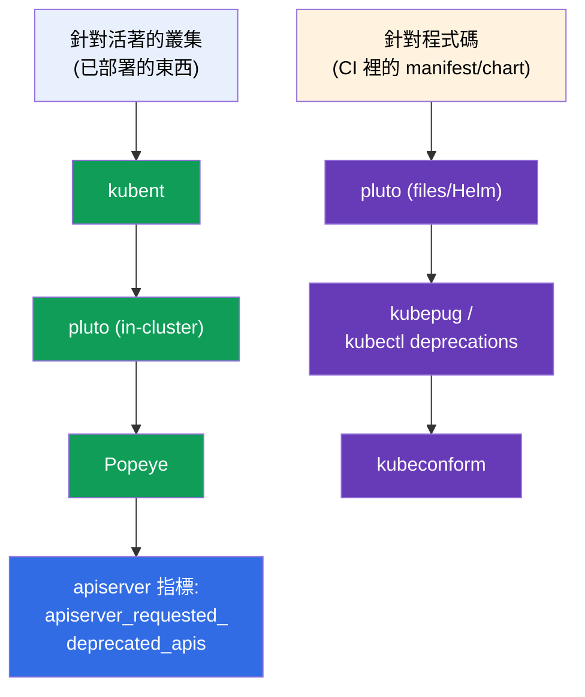

[Русская версия](ru.md) · [Eng version](README.md) · [Versión en español](es.md) · [Version française](fr.md) · [Deutsche Version](de.md) · [ქართული ვერსია](ge.md) · [日本語版](jp.md)

# 第 29 章。應用程式除錯與 API 淘汰

> **接下來是什麼。** 我們要結束第 6 部分。把應用層級的除錯技能整合起來(本章屬於
> CKAD 的 Observability 與 CKA 的 troubleshooting),並單獨談一個主題 -
> **API 淘汰 (API deprecations)**,CKAD 特別把它列出來。叢集層面的除錯(control
> plane、節點、網路)會在第 9 部分詳細討論;這裡的重點是 Pod 與應用程式,以及在升級
> Kubernetes 版本時怎麼不出事。

## 29.1. 系統化的 Pod 除錯方法

在計時器下亂戳是除錯的大敵。有一條明確的路線:從狀態走到原因。



STATUS(第 4 章)會直接指引診斷方向:

| STATUS | 第一個動作 |
|--------|-----------------|
| `Pending` | `describe` → Events:沒有資源?taint?nodeSelector?PVC 沒綁定? |
| `ImagePullBackOff` | `describe`:映像名稱/標籤、registry 存取權、imagePullSecret |
| `CrashLoopBackOff` | `logs --previous`:為什麼啟動時就崩潰 |
| `CreateContainerConfigError` | Pod 引用的 ConfigMap/Secret 不存在 |
| `Running`,但不能用 | `logs`、`exec`,檢查 readiness 與 Endpoints |
| `OOMKilled` | `describe`(Last State)+ `top`:記憶體 limit 太小 |

## 29.2. describe 與 Events - 找原因的主要來源

`kubectl describe` 是最被低估的工具。它輸出的最下方就是 **Events** 區段,裡面是時間
順序的記錄:排程器、kubelet 與各控制器對這個物件做了什麼,以及卡在哪裡。

```bash
kubectl describe pod <pod>
# ... 在最下方:
# Events:
#   Warning  FailedScheduling  ...  0/3 nodes are available: insufficient memory
#   Warning  Failed            ...  Error: ImagePullBackOff
```



事件只保存有限的時間。要看某個 namespace 的所有事件,並依時間排序:

```bash
kubectl get events --sort-by='.lastTimestamp'
kubectl get events --field-selector type=Warning
```

## 29.3. 進去看看裡面:exec 與 port-forward

當日誌給不出答案時,就得鑽進去。

```bash
# 在容器內開一個 shell
kubectl exec -it <pod> -- sh
kubectl exec -it <pod> -c <container> -- sh    # 特定容器

# 執行單一命令
kubectl exec <pod> -- env                       # 環境變數
kubectl exec <pod> -- cat /etc/config/app.conf  # 檢查掛載進來的設定
kubectl exec <pod> -- nslookup backend          # 從裡面檢查 DNS

# 把埠轉送到本機 — 直接檢查應用程式
kubectl port-forward pod/<pod> 8080:80
kubectl port-forward svc/<service> 8080:80
```

`port-forward` 的用處在於繞過 Ingress 直接連到 Pod/Service,確認應用程式本身有沒有在
運作(這能縮小問題範圍 - 是在應用程式,還是在路由上)。

## 29.4. kubectl debug 與 ephemeral 容器

問題來了:最精簡的映像(distroless/scratch - 第 23 章)裡沒有 `sh`、`curl`、`ps` -
根本沒東西可以用 `exec` 進去。解法是透過 `kubectl debug` 使用 **ephemeral 容器**:把一
個臨時的除錯容器插進 **正在運行** 的 Pod,共用它的 process namespace 與網路,但用自己
的映像(裡面有工具)。



```bash
# 把除錯容器插進正在運行的 Pod
kubectl debug -it <pod> --image=busybox --target=<container>

# 複製一個 Pod 來除錯 (不動原本那個)
kubectl debug <pod> -it --image=busybox --copy-to=<pod>-debug

# 節點除錯 — 一個可存取節點檔案系統的 Pod
kubectl debug node/<node> -it --image=busybox
```

ephemeral 容器不能事先寫進 manifest - 只能透過 `kubectl debug` 加到活著的 Pod 上。
它們不會重新啟動。這是除錯那些「安靜的」精簡映像的正確方式,不需要重新建置它們。

> **已經插進去的 ephemeral 容器要怎麼「關掉」?** **沒有** 單獨的命令可以刪掉它:
> API 不允許從 `spec.ephemeralContainers` 移除項目,而像 `kubectl delete container`
> 這樣的命令並不存在。可以做的是:
>
> - **結束裡面的行程** - 離開 shell(`exit`)或把行程殺掉。ephemeral 容器會進入
>   `Terminated`,而且因為它不會重新啟動,就不會再運作。但它 **仍然留在 Pod 的描述
>   裡** - 在 `kubectl describe pod`(`Ephemeral Containers` 區段)以及
>   `kubectl get pod -o yaml` 裡依然看得到。
> - **完全移除** 它只能靠 **重建 Pod**:`kubectl delete pod <pod>`(如果 Pod 由控制器
>   管理 - Deployment/StatefulSet - 它會重新起來,而且不帶除錯容器)。所以如果希望除錯
>   完能「乾淨丟掉」,`--copy-to` 這個選項很方便:你操作的是一個複製出來的 Pod,之後
>   直接刪掉它,原本的完全不受影響。
>
> 實務結論:ephemeral 容器是「一次性」的。人們不會去關掉或重複使用它,而是跟它共存到
> Pod 被重建為止。

## 29.5. API 淘汰 (API deprecations)

這是 CKAD 的獨立主題。Kubernetes 一直在演進,API 群組的版本會變:`alpha` → `beta`
→ 穩定版(`v1`)。舊版本經過一段時間會被 **移除**。使用舊 `apiVersion` 的 manifest 在
叢集升級之後就直接無法套用了。



被移除版本的歷史範例(大家很愛拿來舉例):

| 原本 (淘汰/已移除) | 變成 |
|-------------------------|-------|
| `extensions/v1beta1` Deployment/Ingress | `apps/v1`、`networking.k8s.io/v1` |
| `networking.k8s.io/v1beta1` Ingress | `networking.k8s.io/v1` |
| `policy/v1beta1` PodDisruptionBudget | `policy/v1` |
| `batch/v1beta1` CronJob | `batch/v1` |

## 29.6. 如何找出並修好淘汰的 API

```bash
# 查某個資源目前該用哪個 API 版本
kubectl explain deployment            # 會顯示目前的 apiVersion
kubectl api-versions                  # 叢集中所有可用的 API 版本
kubectl api-resources                 # 資源及其所屬群組

# 在 manifest 中偵測淘汰 API 的工具 (生產環境用)
# kubectl deprecations / pluto / kubent — 掃描 manifest 與叢集
```

作業順序:在升級叢集之前,先檢查 manifest 裡有沒有淘汰的 `apiVersion`,改成目前的版本
(`kubectl explain` 會告訴你現在該用哪個),再重新套用。當你存取淘汰的 API 時,
Kubernetes 通常會在 `kubectl` 的輸出裡印出警告 - 這值得留意。



## 29.7. 分析淘汰 API 的開源工具

要手動檢查幾十個 manifest 與 Helm release 並不現實 - 這件事已經有現成的開源工具。它們
在兩個地方運作:針對 **活著的叢集**(已經部署的東西)與針對 **程式碼**(repository 裡
的 manifest/chart,在 CI 裡於部署前檢查)。



| 工具 | 掃描什麼 | 特點 |
|-----------|---------------|-------------|
| **kubent** (kube-no-trouble) | 活著的叢集 + Helm release | 單一執行檔、簡單,適合升級前快速檢查 |
| **pluto** (Fairwinds) | 叢集、**manifest 檔案**、Helm chart/release | 目標是特定的 K8s 版本;有給 CI 用的回傳碼 |
| **kubepug** (Deprecated APIs) | 叢集與檔案,對照 **目標** 版本 | 用目標版本的 OpenAPI 比對;也有 `kubectl deprecations` 形式 |
| **kubeconform** | 檔案對照目標版本的 JSON schema | CI 裡的快速驗證器;能抓到被移除的 kind/版本 |
| **Popeye** | 活著的叢集(sanitizer) | 除了 API,也會找出其他衛生問題 |

```bash
# --- 針對叢集 ---
kubent                                   # 哪些已部署的東西用了 deprecated/removed API
pluto detect-all-in-cluster
popeye

# --- 針對程式碼 / 在 CI 裡 (瞄準目標版本) ---
pluto detect-files -d ./manifests/ --target-versions k8s=v1.32.0
kubepug --input-file ./manifests/ --k8s-version v1.32.0
kubectl deprecations --k8s-version v1.32.0     # kubepug 作為 kubectl 外掛
kubeconform -kubernetes-version 1.32.0 ./manifests/
```

好的實務做法是 **兩邊都做** - 升級前用 `kubent`/`pluto` 掃叢集,並在 CI pipeline 裡用
`pluto`/`kubepug`/`kubeconform`,讓淘汰的 `apiVersion` 不會一路開到生產環境。另外
apiserver 會提供 `apiserver_requested_deprecated_apis` 這個指標 - 可以在 Prometheus
(第 28 章)上為它掛告警,提早看到對淘汰 API 的存取。

## 29.8. 這在生產環境中如何應用

- **除錯路線是一樣的。** 在生產環境裡,值班人員走的是同一條路:STATUS →
  describe/Events → logs → exec/debug。差別只在規模(數百個 Pod),以及日誌/指標是從
  集中式系統(第 28 章)取得,而不只是靠 `kubectl`。
- **精簡映像就用 kubectl debug。** 既然生產環境的映像都很精簡(為了安全),
  ephemeral 容器就是不用重新建置、也不用降低映像安全性的主要即時除錯手段。
- **每次升級前都檢查 deprecations。** 升級叢集版本是有計畫的操作,之前一定要掃描
  manifest 有沒有用到被移除的 API(pluto/kubent),否則升級後會有一部分資源無法套用
  (CI/CD、GitOps 就壞了)。
- **CI 提早抓出淘汰的 API。** 成熟的團隊會直接在 pipeline 裡檢查 manifest 有沒有
  deprecated API,而不是等到升級生產環境時才發現。
- **不要忽略警告。** `kubectl` 輸出或 CI 裡出現的淘汰 API warning - 是提早更新
  manifest 的訊號,而不是等版本已經被移除才處理。

## 29.9. 小詞彙表

- **Events** - `describe`/`get events` 輸出裡對某個物件的操作時間順序記錄。
- **exec** - 在容器內執行命令/開 shell。
- **port-forward** - 把 Pod/Service 的埠轉送到本機。
- **ephemeral 容器** - 插進活著的 Pod 裡的臨時除錯容器(`kubectl debug`)。
- **kubectl debug** - 插入除錯容器 / 複製 Pod / 除錯節點。
- **API deprecation** - 宣告某個 API 版本淘汰,之後將被移除。
- **apiVersion** - 物件所屬 API 群組的版本(alpha/beta/穩定版)。
- **pluto / kubent** - 在 manifest/叢集中尋找淘汰 API 的工具。
- **kubepug (kubectl deprecations)** - 對照目標 K8s 版本檢查 API(叢集與檔案)。
- **kubeconform** - 依目標版本的 schema 驗證 manifest(CI)。
- **Popeye** - 叢集 sanitizer,其中也會找出淘汰的 API。
- **apiserver_requested_deprecated_apis** - 對淘汰 API 的存取次數指標(在 Prometheus 掛告警)。

## 29.10. 本章總結

- Pod 除錯照著這條路線走:STATUS(`get`)→ Events(`describe`)→ 日誌(`logs
  --previous`)→ 資源/進到裡面(`top`、`exec`、`debug`)。
- `describe` 以及它的 Events 區段是找原因的主要來源(排程、映像、探針、重新啟動);
  `get events --sort-by` 能給出完整全貌。
- `exec` 與 `port-forward` 讓你能進去看裡面,並直接檢查應用程式。
- `kubectl debug` 加上 ephemeral 容器,是除錯精簡映像(沒有 sh)、活著的 Pod 或節點的
  方式,而且不必重新建置映像。
- API 會走過 alpha → beta → 穩定版;舊版本會被移除,用到它們的 manifest 在升級後就不
  能用了。
- 升級叢集之前要檢查 manifest 裡淘汰的 `apiVersion`(kubectl explain / api-versions、
  pluto/kubent),並改成目前的版本。
- 開源工具:針對叢集 - kubent、pluto、Popeye;針對 CI 裡的程式碼 - pluto、
  kubepug(`kubectl deprecations`)、kubeconform;再加上 apiserver 指標用來告警。

## 29.11. 這些知識用在哪:考試與實際工作

**在考試上。** 「修好壞掉的 Pod/應用程式」是 troubleshooting(CKA 的 30%)與
Observability(CKAD)的核心。get→describe→logs→exec 這條路線能解掉大部分這類題目。
`kubectl debug` 與更新淘汰的 `apiVersion` 是會被直接考的具體能力(CKAD 尤其會考
deprecations)。

**在實際工作中。** 系統化的除錯能在事故時省下時間,而 ephemeral 容器讓你可以把映像
保持精簡卻依然能除錯。升級叢集前檢查 deprecations 是必要步驟,少了它,升級 Kubernetes
版本就會弄壞正在運作的 manifest 與交付流水線。

## 29.12. 自我檢查問題

1. 描述系統化的 Pod 除錯路線。要從哪裡開始?
2. `describe` 在哪裡顯示問題原因,遇到 Pending 時該在那裡找什麼?
3. `port-forward` 什麼時候能幫你定位問題?
4. 為什麼需要 `kubectl debug`,它在精簡映像的情況下怎麼救場?
5. 一個 API 版本會走過什麼樣的路徑,舊版本會發生什麼事?
6. 怎麼找出某個資源目前該用的 `apiVersion`,並檢查叢集有沒有用到淘汰的 API?
7. 為什麼在升級叢集之前檢查 deprecations 很重要?
8. 哪些開源工具掃描叢集,哪些掃描 CI 裡的程式碼/manifest?各舉兩個,並說明它們的差別。

## 實踐

到這裡第 6 部分(可觀測性與維運)就結束了。接下來是第 7 部分:服務與網路,從 Kubernetes
的網路模型與 CNI 開始(第 30 章)。除錯以及 ephemeral 容器的操作,會在可觀測性與
troubleshooting 的實驗中練習。

🧪 實驗 109(除錯與 API 淘汰):[tasks/cka/labs/109](../../labs/109/README_TW.MD)

🎮 Killercoda（在瀏覽器中，無需安裝）：[Ephemeral Debug Container](https://killercoda.com/chadmcrowell/course/ckad/kubectl-debug) · [Logs from CrashLoop Pod](https://killercoda.com/chadmcrowell/course/ckad/logs-crashloop) · [Port Forward to Pod](https://killercoda.com/chadmcrowell/course/ckad/port-forward-pod) · [Debug a Go App in Kubernetes](https://killercoda.com/chadmcrowell/course/cka/debug-go-app)

---
[目錄](../README_TW.md) · [第 28 章](../28/tw.md) · [第 30 章](../30/tw.md)
