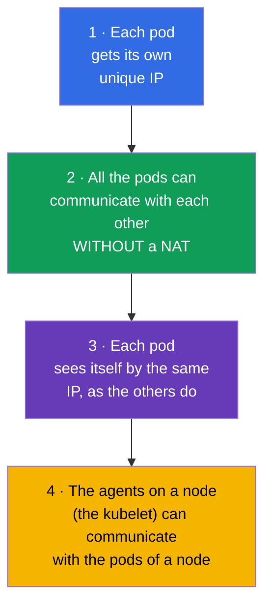
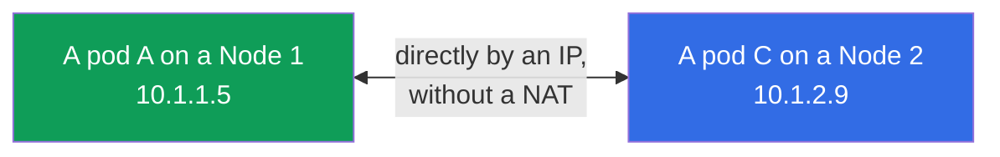
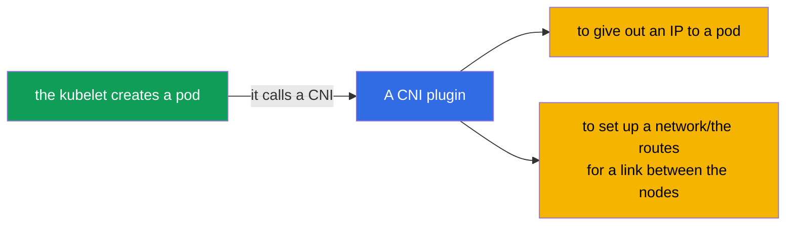
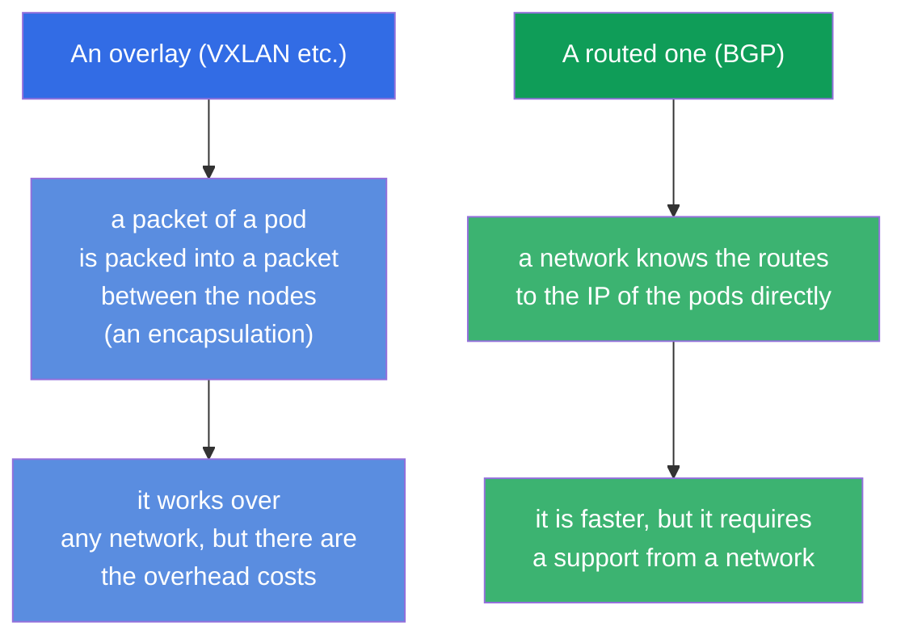
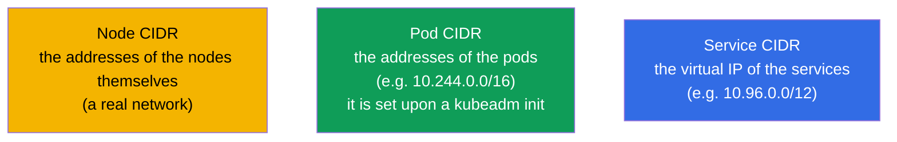
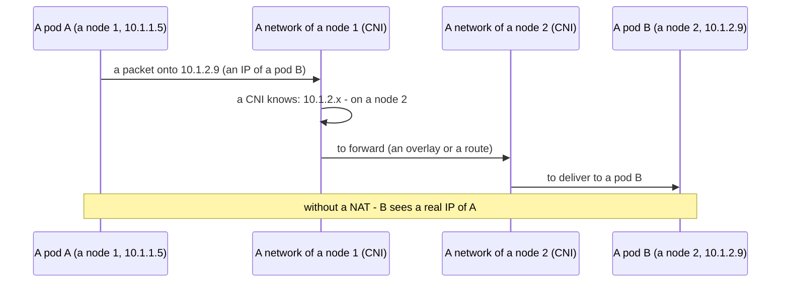
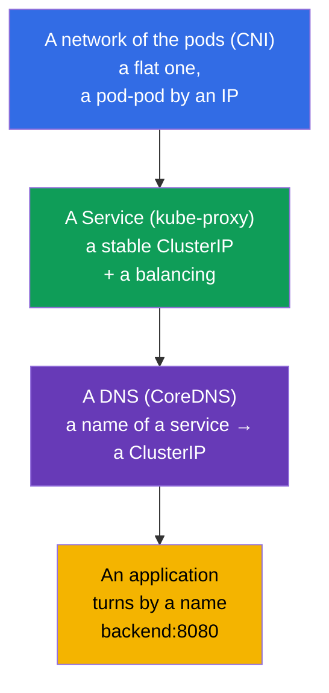

[Русская версия](ru.md) · [Versión en español](es.md) · [Version française](fr.md) · [Deutsche Version](de.md) · [ქართული ვერსია](ge.md) · [繁體中文版](tw.md) · [日本語版](jp.md)

# Chapter 30. A network model of Kubernetes, a network of the pods and a CNI

> **What comes next.** We begin the part 7 - the networks. We have already used a Service and a DNS (the chapter 7), but
> we did not consider, how a network in a cluster is arranged at all: how the pods get the IP, how they communicate
> between the nodes, who provides this. This is a foundation of the domain Services & Networking of the both
> exams and, what is more important, - a basis of a network troubleshooting (the chapter 46). We will consider
> the four rules of a network model of Kubernetes, a role of a CNI and how everything folds together.

## 30.1. The four rules of a network model of Kubernetes

Kubernetes does not implement a network itself - it sets the **requirements (a model)**, which any
implementation has to satisfy. A model is simple and it holds on the four rules:

A main consequence is a **flat network**. Any pod can turn to any other pod by
its IP directly, without a NAT, independently of that, on which node they are located. From a point of a view
of the pods a whole network of a cluster is one flat space of the addresses.

## 30.2. Who implements a model: a CNI

Since Kubernetes only sets the requirements, somebody has to fulfil them. This is done by a
**CNI plugin (Container Network Interface)** - a plugin of a network, which upon a creation of a pod
gives out an IP to it and sets up a routing, so that the pods see each other through the nodes.

The popular CNI plugins (one has to know them by the names):

| CNI | A peculiarity |
|-----|-------------|
| **Calico** | a popular one, it supports a NetworkPolicy, it can work without an overlay (BGP) |
| **Cilium** | on an eBPF, a high performance, the rich policies, it can replace a kube-proxy |
| **Flannel** | a simple one, an overlay network (VXLAN), without the developed policies |
| **Weave Net** | a simple one, with an encryption (it is less actual) |
| **AWS VPC CNI** | the pods get the real IP from a VPC (through an ENI), without an overlay; by default in an EKS |
| **Azure CNI** | the pods get the IP from a network of a VNet, a native integration with a network of an Azure |
| **GKE (Dataplane V2)** | a managed CNI of a Google on a base of a Cilium/an eBPF |

> **The cloud (managed) CNI.** In the managed clusters (EKS, AKS, GKE) a provider usually
> puts its own CNI. A demonstrative example is an **AWS VPC CNI** (`amazon-vpc-cni-k8s`),
> used in an EKS by default: it does not make an overlay, but it gives out to the pods the **real
> IP addresses from a subnet of a VPC**, assigning them onto the network interfaces (ENI) of the instances. The pluses are -
> a pod is seen in a VPC as an ordinary host, it works without an encapsulation (it is faster) and it directly gets on with the
> Security Groups, a VPC routing and the flow logs. A payment for this is:
>
> - **the pods spend the addresses of a VPC** - upon the big clusters it is real to run into a shortage of the IP in a
>   subnet (one needs to plan a CIDR beforehand);
> - **a density of the pods on a node is limited** by a number of the ENI and of the IP per an instance (it depends on a type
>   of an EC2); a mode of a prefix delegation weakens this, giving out the blocks /28 onto an ENI.
>
> For an exam (CKA/CKS) it is not obligatory to know this, but in a real work with an EKS a choice and
> a setting up of a CNI are one of the first architectural decisions. The NetworkPolicy for a long time were not
> supported by the VPC CNI itself, therefore it is often supplemented with a Calico or a built-in
> support of the network policies is switched on.

Without an installed CNI the nodes remain `NotReady`, and the pods - `Pending`/`ContainerCreating`:
a network of the pods is not set up. This is a frequent reason of a "cluster does not rise after a kubeadm init"
(the chapter 35).

## 30.3. The overlay and the routed networks (briefly)

The CNI implement a link between the nodes by the two main approaches:

- An **overlay** (a Flannel VXLAN, a Calico in a mode of an overlay): the packets of the pods are encapsulated into
  the packets between the nodes. It works over any network, but it adds the overhead costs.
- A **routed one** (a Calico BGP, a Cilium): a network itself knows the routes to the pod IP, without an
  encapsulation - it is faster, but a support from a side of a network infrastructure is needed.

For an exam we do not go deeply into this - it is enough to understand, that the both approaches
exist and why.

## 30.4. The ranges of the addresses: the pods, the services, the nodes

In a cluster there are several independent address spaces - one must not confuse them:

| A range | What it addresses | An example |
|----------|--------------|--------|
| **Node CIDR** | the IP of the nodes themselves (a real network/a VPC) | 192.168.0.0/24 |
| **Pod CIDR** (`podSubnet`) | the IP of the pods | 10.244.0.0/16 |
| **Service CIDR** (`serviceSubnet`) | the virtual ClusterIP of the services | 10.96.0.0/12 |

A Pod CIDR is set upon an initialization of a cluster (`kubeadm init --pod-network-cidr`, the chapter 35)
and it has to be coordinated with a config of a CNI. A Service CIDR is a virtual one: these IP do not
belong to any interface, behind them there stands a kube-proxy (the chapter 7).

## 30.5. How a packet reaches from a pod to a pod

Let us assemble a model together on an example of a request pod-pod between the nodes:

Exactly a CNI provides the steps "a CNI knows, where a pod is" and "to forward between the nodes". To an application
this is invisible - it simply turns by an IP, as in a flat network.

## 30.6. A Service and a DNS over a network of the pods (a link with the chapter 7)

A network of the pods is a foundation, but one cannot turn by the "raw" IP of the pods (they change). Over
a flat network there work the already familiar layers:

The layers fold up: a CNI gives a connectivity of the pods → a kube-proxy gives the stable addresses of the services
→ a CoreDNS gives the names. An application works on an upper level (by a name), and under it there is
a network of the pods considered here. A DNS/a CoreDNS and a Service in a detail are in the chapter 31.

## 30.7. How this is applied in the production

- **A choice of a CNI is an architectural decision.** In a prod a CNI is chosen by the needs: the
  network policies and a performance are needed - a Cilium (eBPF) or a Calico; a simplicity is needed -
  a Flannel. In the managed clusters a CNI is often preinstalled (a VPC CNI in an EKS, where the pods
  get the real IP from a VPC).
- **A planning of a CIDR.** A Pod/Service CIDR are planned beforehand and they are coordinated with a corporate
  network/a VPC, so that they do not intersect with the other networks (otherwise - the conflicts of a routing).
  A too small Pod CIDR limits a number of the pods - a frequent mistake upon a growth of a cluster.
- **An eBPF and a refusal from a kube-proxy.** The modern clusters more and more often put a Cilium in a mode of a
  replacement of a kube-proxy: a balancing of the services goes through an eBPF in a kernel - it is faster and better
  scaled, than the iptables.
- **A NetworkPolicy requires a support of a CNI.** The network policies (the chapter 34) work only
  if a CNI supports them (a Calico, a Cilium - yes; a bare Flannel - no). This is taken into an account upon a
  choice of a CNI, if a segmentation of a traffic is needed.
- **The network problems = the frequent incidents.** A "pod does not see another pod/service" in a prod often
  runs into a CNI (it is not installed/it is broken), a conflict of a CIDR or the nodes NotReady because of a network.
  An understanding of a model is a basis of their analysis.

## 30.8. A mini glossary

- **A network model of Kubernetes** - the requirements to a network: its own IP at a pod, a link without a NAT,
  a flat network.
- **A flat network** - any pod sees any one by an IP directly, without a NAT.
- **A CNI (Container Network Interface)** - a plugin, implementing a network of the pods (an IP + the routes).
- **A Calico / a Cilium / a Flannel** - the popular CNI plugins.
- **An overlay** - a network with an encapsulation of the packets between the nodes (VXLAN).
- **A routed network** - a network, knowing the routes to the pods directly (BGP).
- **A Pod CIDR / a Service CIDR** - the ranges of the addresses of the pods / of the virtual IP of the services.
- **An eBPF** - a technology in a kernel of a Linux, on which a Cilium is built.

## 30.9. The summary of the chapter

- Kubernetes sets a network model (its own IP at each pod, a link without a NAT, a flat
  network), but it does not implement it itself.
- A model is implemented by a CNI plugin: it gives out the IP to the pods and it sets up a link between the nodes; without a CNI
  the nodes are NotReady, the pods do not start.
- The popular CNI: a Calico, a Cilium (eBPF), a Flannel; they differ by the policies,
  a performance, a complexity.
- A link between the nodes is an overlay (an encapsulation, VXLAN) or a routing (BGP/eBPF).
- The three address spaces: a Node CIDR (the nodes), a Pod CIDR (the pods), a Service CIDR (the virtual
  IP of the services) - not to confuse them.
- Over a flat network of the pods there work a Service (a kube-proxy, the stable IP) and a DNS (a CoreDNS,
  the names) - the chapter 31.

## 30.10. How this will come in handy: on the exam and in the real work

**On the exam.** There are not many direct tasks "set up a CNI", but an understanding of a model is critical for a
troubleshooting (30% of the CKA): "the pods are Pending / a node is NotReady" often = there is no CNI; "a pod does not see
another one" = a network problem. Upon an installation of a cluster (the chapter 35) a correct `--pod-network-
cidr` and an installation of a CNI are an obligatory step.

**In the real work.** A choice and a setting up of a CNI are a fundamental decision for a cluster
(the policies, a performance, an integration with a VPC). A planning of a CIDR prevents the
conflicts and a shortage of the addresses upon a growth. An understanding of a flat network and of a role of a CNI is a basis of an analysis of
any network incidents.

## 30.11. Self-check questions

1. Formulate the key rules of a network model of Kubernetes. What is a "flat network"?
2. Who implements a network model and what does a CNI do upon a creation of a pod?
3. What will happen with the nodes and the pods, if a CNI is not installed?
4. By what does an overlay network differ from a routed one?
5. Name the three address spaces of a cluster and what each one addresses.
6. How do the layers fold up: a network of the pods, a Service, a DNS?
7. Why can a NetworkPolicy not work upon some CNI?

## Practice

We have considered a network of the pods - a foundation. In the chapter 31 we will rise onto a level of a Service and of a DNS:
we will consider a CoreDNS and that, how the names turn into the addresses. The network themes are drilled in
the labs on a network and a troubleshooting.

🧪 Lab 123 (an installation of a CNI from a scratch + a low-level network): [tasks/cka/labs/123](../../labs/123/README.MD)

---
[Contents](../README.md) · [Chapter 29](../29/README.md) · [Chapter 31](../31/README.md)
