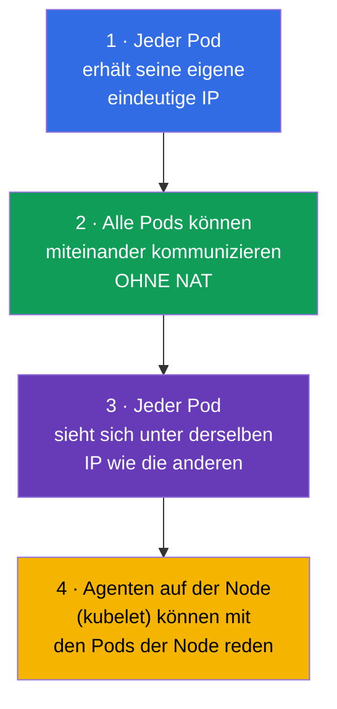
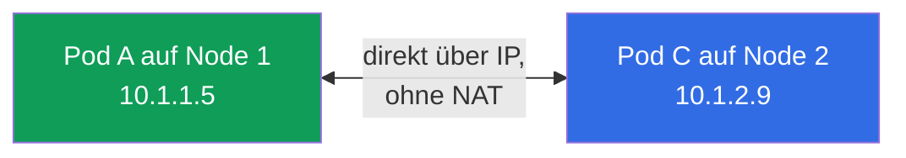
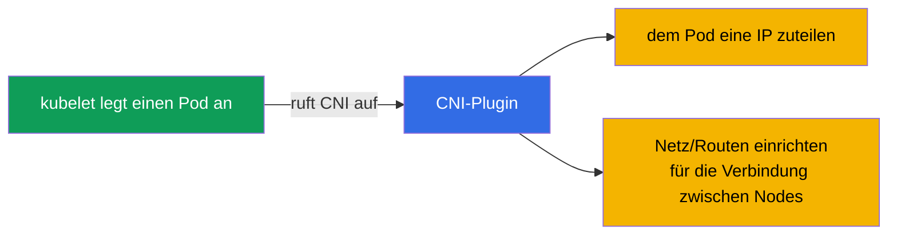
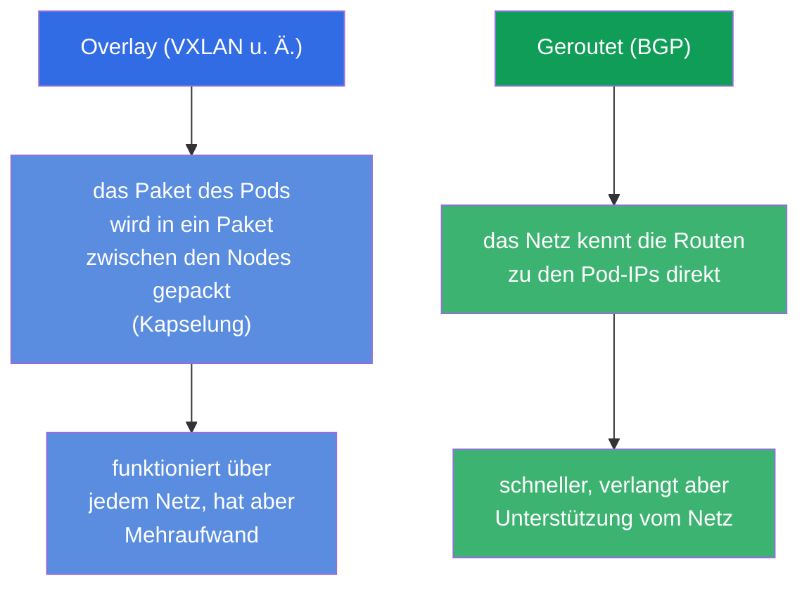
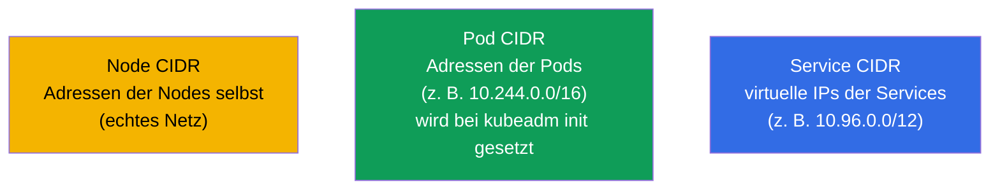
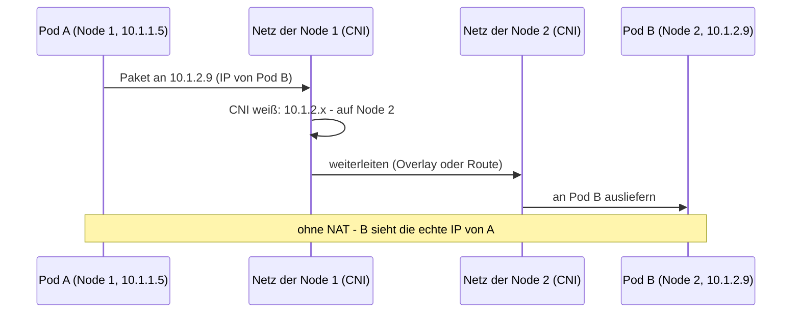
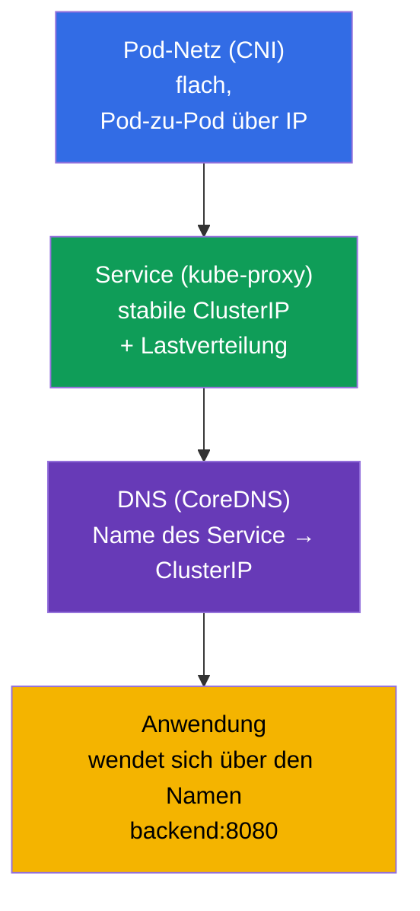

[Русская версия](ru.md) · [Eng version](README.md) · [Versión en español](es.md) · [Version française](fr.md) · [ქართული ვერსია](ge.md)

# Kapitel 30. Das Netzwerkmodell von Kubernetes, Pod-Netz und CNI

> **Was kommt.** Wir beginnen Teil 7 - Netze. Wir haben Service und DNS schon benutzt
> (Kapitel 7), aber nicht behandelt, wie das Netz im Cluster überhaupt aufgebaut ist: wie Pods
> IPs bekommen, wie sie über Nodes hinweg kommunizieren, wer das bereitstellt. Das ist das
> Fundament der Domäne Services & Networking beider Prüfungen und, was wichtiger ist, die
> Grundlage des Netzwerk-Troubleshootings (Kapitel 46). Wir behandeln die vier Regeln des
> Netzwerkmodells von Kubernetes, die Rolle von CNI und wie sich alles zusammensetzt.

## 30.1. Die vier Regeln des Netzwerkmodells von Kubernetes

Kubernetes implementiert das Netz nicht selbst - es legt **Anforderungen (ein Modell)** fest,
die jede Implementierung erfüllen muss. Das Modell ist einfach und ruht auf vier Regeln:

Die wichtigste Folge: ein **flaches Netz**. Jeder Pod kann jeden anderen Pod direkt über
dessen IP erreichen, ohne NAT, unabhängig davon, auf welcher Node sie sich befinden. Aus Sicht
der Pods ist das gesamte Clusternetz ein flacher Adressraum.

## 30.2. Wer das Modell implementiert: CNI

Da Kubernetes nur Anforderungen festlegt, muss sie jemand erfüllen. Das tut das
**CNI-Plugin (Container Network Interface)** - das Netz-Plugin, das dem Pod beim Anlegen eine
IP zuteilt und das Routing so einrichtet, dass die Pods sich über die Nodes hinweg sehen.

Populäre CNI-Plugins (die man namentlich kennen sollte):

| CNI | Besonderheit |
|-----|-------------|
| **Calico** | populär, unterstützt NetworkPolicy, kann ohne Overlay (BGP) |
| **Cilium** | auf eBPF, hohe Performance, reiche Policies, kann kube-proxy ersetzen |
| **Flannel** | einfach, Overlay-Netz (VXLAN), ohne ausgebaute Policies |
| **Weave Net** | einfach, mit Verschlüsselung (weniger aktuell) |
| **AWS VPC CNI** | Pods erhalten echte IPs aus der VPC (über ENI), ohne Overlay; Standard in EKS |
| **Azure CNI** | Pods erhalten IPs aus dem VNet, native Integration mit dem Netz von Azure |
| **GKE (Dataplane V2)** | verwaltetes CNI von Google auf Basis von Cilium/eBPF |

> **Cloud-CNI (verwaltet).** In managed Clustern (EKS, AKS, GKE) installiert der Provider
> üblicherweise sein eigenes CNI. Ein anschauliches Beispiel ist **AWS VPC CNI**
> (`amazon-vpc-cni-k8s`), das in EKS standardmäßig verwendet wird: es macht kein Overlay,
> sondern teilt den Pods **echte IP-Adressen aus dem VPC-Subnetz** zu und weist sie den
> Netzwerkschnittstellen (ENI) der Instanzen zu. Vorteile - der Pod ist in der VPC wie ein
> normaler Host sichtbar, arbeitet ohne Kapselung (schneller) und versteht sich direkt mit
> Security Groups, VPC-Routing und Flow Logs. Der Preis dafür:
>
> - **Pods verbrauchen VPC-Adressen** - bei großen Clustern läuft man real in einen IP-Mangel
>   im Subnetz (das CIDR muss vorab geplant werden);
> - **die Pod-Dichte pro Node ist begrenzt** durch die Zahl der ENI und der IPs pro Instanz
>   (abhängig vom EC2-Typ); der Modus prefix delegation schwächt das ab, indem er den ENI
>   Blöcke /28 zuteilt.
>
> Für die Prüfung (CKA/CKS) muss man das nicht wissen, aber in der echten Arbeit mit EKS sind
> Auswahl und Konfiguration des CNI eine der ersten Architekturentscheidungen. NetworkPolicy
> wurde lange nicht vom VPC CNI selbst unterstützt, deshalb ergänzt man es oft um Calico oder
> schaltet die eingebaute Unterstützung für Netzwerk-Policies ein.

Ohne installiertes CNI bleiben die Nodes `NotReady` und die Pods
`Pending`/`ContainerCreating`: das Pod-Netz ist nicht eingerichtet. Das ist eine häufige
Ursache für „der Cluster kommt nach kubeadm init nicht hoch“ (Kapitel 35).

## 30.3. Overlay- und geroutete Netze (kurz)

CNI realisieren die Verbindung zwischen den Nodes über zwei Hauptansätze:

- **Overlay** (Flannel VXLAN, Calico im Overlay-Modus): die Pakete der Pods werden in Pakete
  zwischen den Nodes gekapselt. Funktioniert über jedem Netz, fügt aber Mehraufwand hinzu.
- **Geroutet** (Calico BGP, Cilium): das Netz selbst kennt die Routen zu den Pod-IPs, ohne
  Kapselung - schneller, aber es braucht Unterstützung seitens der Netzwerkinfrastruktur.

Für die Prüfung gehen wir hier nicht in die Tiefe - es genügt zu verstehen, dass beide Ansätze
existieren und warum.

## 30.4. Adressbereiche: Pods, Services, Nodes

Im Cluster gibt es mehrere unabhängige Adressräume - man darf sie nicht verwechseln:

| Bereich | Was er adressiert | Beispiel |
|----------|--------------|--------|
| **Node CIDR** | IPs der Nodes selbst (echtes Netz/VPC) | 192.168.0.0/24 |
| **Pod CIDR** (`podSubnet`) | IPs der Pods | 10.244.0.0/16 |
| **Service CIDR** (`serviceSubnet`) | virtuelle ClusterIP der Services | 10.96.0.0/12 |

Das Pod CIDR wird bei der Initialisierung des Clusters gesetzt (`kubeadm init
--pod-network-cidr`, Kapitel 35) und muss mit der Konfiguration des CNI übereinstimmen. Das
Service CIDR ist virtuell: diese IPs gehören keiner Schnittstelle, hinter ihnen steht
kube-proxy (Kapitel 7).

## 30.5. Wie ein Paket von Pod zu Pod gelangt

Fügen wir das Modell am Beispiel einer Pod-zu-Pod-Anfrage zwischen Nodes zusammen:

Genau das CNI stellt die Schritte „CNI weiß, wo der Pod ist“ und „zwischen den Nodes
weiterleiten“ bereit. Für die Anwendung ist das unsichtbar - sie wendet sich einfach über die
IP, wie in einem flachen Netz.

## 30.6. Service und DNS über dem Pod-Netz (Bezug zu Kapitel 7)

Das Pod-Netz ist das Fundament, aber man darf sich nicht an die „rohen“ IPs der Pods wenden
(sie ändern sich). Über dem flachen Netz arbeiten die schon bekannten Schichten:

Die Schichten setzen sich zusammen: CNI gibt die Konnektivität der Pods → kube-proxy gibt
stabile Adressen der Services → CoreDNS gibt Namen. Die Anwendung arbeitet auf der obersten
Ebene (über den Namen), und darunter liegt das hier behandelte Pod-Netz. DNS/CoreDNS und
Service ausführlich - in Kapitel 31.

## 30.7. Wie man das in der Produktion anwendet

- **Die Wahl des CNI ist eine Architekturentscheidung.** In der Produktion wählt man das CNI
  nach den Bedürfnissen: braucht man Netzwerk-Policies und Performance - Cilium (eBPF) oder
  Calico; braucht man Einfachheit - Flannel. In verwalteten Clustern ist das CNI oft schon
  vorinstalliert (VPC CNI in EKS, wo die Pods echte IPs aus der VPC erhalten).
- **Planung der CIDR.** Pod/Service CIDR plant man vorab und stimmt sie mit dem
  Unternehmensnetz/der VPC ab, damit sie sich nicht mit anderen Netzen überschneiden (sonst -
  Routing-Konflikte). Ein zu kleines Pod CIDR begrenzt die Zahl der Pods - ein häufiger Fehler
  beim Wachstum des Clusters.
- **eBPF und Verzicht auf kube-proxy.** Moderne Cluster setzen immer häufiger Cilium im Modus
  als Ersatz für kube-proxy ein: die Lastverteilung der Services läuft über eBPF im Kernel -
  schneller und besser skalierbar als iptables.
- **NetworkPolicy verlangt Unterstützung durch das CNI.** Netzwerk-Policies (Kapitel 34)
  funktionieren nur, wenn das CNI sie unterstützt (Calico, Cilium - ja; nacktes Flannel -
  nein). Das berücksichtigt man bei der Wahl des CNI, wenn man Segmentierung des Traffics
  braucht.
- **Netzwerkprobleme = häufige Incidents.** „Der Pod sieht einen anderen Pod/Service nicht“
  hängt in der Produktion oft am CNI (nicht installiert/kaputt), an einem CIDR-Konflikt oder an
  Nodes im Zustand NotReady wegen des Netzes. Das Verständnis des Modells ist die Grundlage
  ihrer Analyse.

## 30.8. Mini-Glossar

- **Netzwerkmodell von Kubernetes** - Anforderungen an das Netz: eigene IP beim Pod,
  Verbindung ohne NAT, flaches Netz.
- **Flaches Netz** - jeder Pod sieht jeden anderen direkt über die IP, ohne NAT.
- **CNI (Container Network Interface)** - Plugin, das das Pod-Netz umsetzt (IP + Routen).
- **Calico / Cilium / Flannel** - populäre CNI-Plugins.
- **Overlay** - Netz mit Kapselung der Pakete zwischen den Nodes (VXLAN).
- **Geroutetes Netz** - Netz, das die Routen zu den Pods direkt kennt (BGP).
- **Pod CIDR / Service CIDR** - Adressbereiche der Pods / der virtuellen IPs der Services.
- **eBPF** - Technologie im Linux-Kernel, auf der Cilium aufgebaut ist.

## 30.9. Zusammenfassung des Kapitels

- Kubernetes legt das Netzwerkmodell fest (eigene IP bei jedem Pod, Verbindung ohne NAT,
  flaches Netz), implementiert es aber nicht selbst.
- Das Modell implementiert das CNI-Plugin: es teilt den Pods IPs zu und richtet die Verbindung
  zwischen den Nodes ein; ohne CNI sind die Nodes NotReady und die Pods starten nicht.
- Populäre CNI: Calico, Cilium (eBPF), Flannel; sie unterscheiden sich in Policies,
  Performance, Komplexität.
- Die Verbindung zwischen den Nodes - Overlay (Kapselung, VXLAN) oder Routing (BGP/eBPF).
- Drei Adressräume: Node CIDR (Nodes), Pod CIDR (Pods), Service CIDR (virtuelle IPs der
  Services) - nicht verwechseln.
- Über dem flachen Pod-Netz arbeiten Service (kube-proxy, stabile IPs) und DNS (CoreDNS,
  Namen) - Kapitel 31.

## 30.10. Wofür das nützlich ist: in der Prüfung und in der echten Arbeit

**In der Prüfung.** Direkte Aufgaben „richte CNI ein“ gibt es nicht viele, aber das
Verständnis des Modells ist kritisch für Troubleshooting (30 % CKA): „Pods Pending / Node
NotReady“ heißt oft = kein CNI; „der Pod sieht einen anderen nicht“ = Netzwerkproblem. Bei der
Installation des Clusters (Kapitel 35) sind ein korrektes `--pod-network-cidr` und die
Installation des CNI ein zwingender Schritt.

**In der echten Arbeit.** Auswahl und Konfiguration des CNI sind eine fundamentale
Entscheidung für den Cluster (Policies, Performance, Integration mit der VPC). Die Planung der
CIDR verhindert Konflikte und Adressmangel beim Wachstum. Das Verständnis des flachen Netzes
und der Rolle des CNI ist die Grundlage der Analyse beliebiger Netzwerk-Incidents.

## 30.11. Fragen zur Selbstüberprüfung

1. Formulieren Sie die Schlüsselregeln des Netzwerkmodells von Kubernetes. Was ist ein „flaches
   Netz“?
2. Wer implementiert das Netzwerkmodell und was macht das CNI beim Anlegen eines Pods?
3. Was passiert mit den Nodes und den Pods, wenn kein CNI installiert ist?
4. Wodurch unterscheidet sich ein Overlay-Netz von einem gerouteten?
5. Nennen Sie die drei Adressräume des Clusters und was jeder davon adressiert.
6. Wie setzen sich die Schichten zusammen: Pod-Netz, Service, DNS?
7. Warum kann NetworkPolicy bei manchen CNI nicht funktionieren?

## Praxis

Wir haben das Pod-Netz behandelt - das Fundament. In Kapitel 31 steigen wir auf die Ebene von
Service und DNS: wir behandeln CoreDNS und wie Namen zu Adressen werden. Netzwerkthemen werden
in den Labs zu Netz und Troubleshooting geübt.

🧪 Lab 123 (Installation des CNI von Null + Netz auf tiefer Ebene): [tasks/cka/labs/123](../../labs/123/README_DE.MD)

---
[Inhalt](../README_DE.md) · [Kapitel 29](../29/de.md) · [Kapitel 31](../31/de.md)
