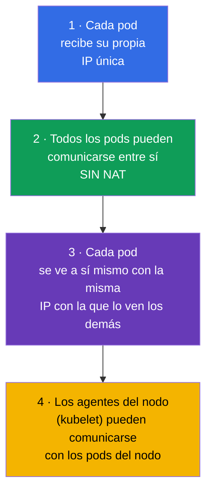
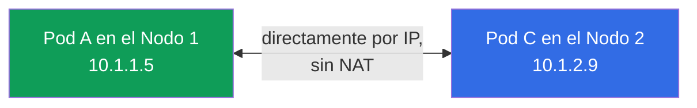
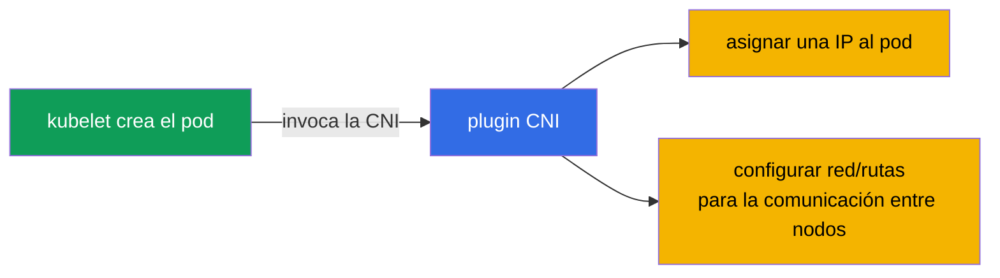
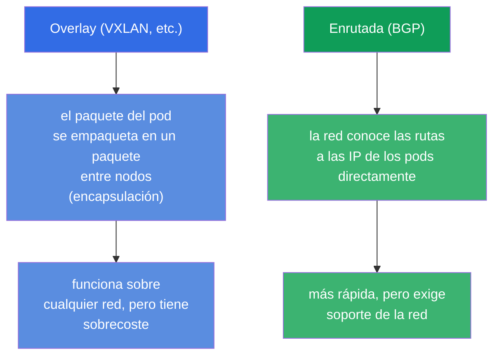
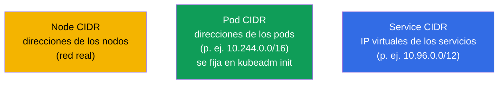
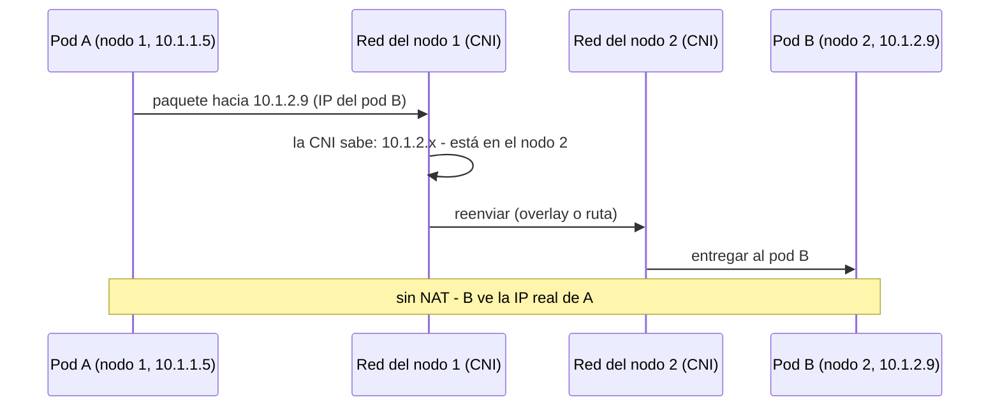
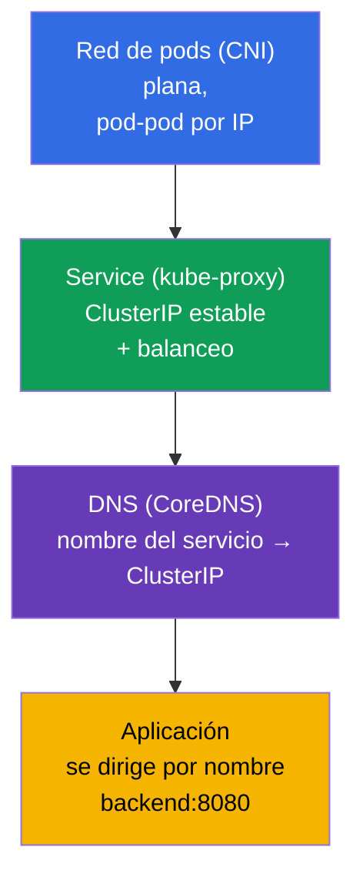

[Русская версия](ru.md) · [Eng version](README.md) · [Version française](fr.md) · [Deutsche Version](de.md) · [ქართული ვერსია](ge.md) · [繁體中文版](tw.md) · [日本語版](jp.md)

# Capítulo 30. El modelo de red de Kubernetes, la red de pods y la CNI

> **Qué viene ahora.** Empezamos la parte 7 - la red. Ya hemos usado Service y DNS (capítulo 7),
> pero no hemos visto cómo está montada la red del clúster: cómo obtienen los pods su IP, cómo
> se comunican entre nodos y quién se encarga de ello. Es el cimiento del dominio Services &
> Networking de ambos exámenes y, más importante aún, la base del troubleshooting de red
> (capítulo 46). Repasaremos las cuatro reglas del modelo de red de Kubernetes, el papel de la
> CNI y cómo encaja todo.

## 30.1. Las cuatro reglas del modelo de red de Kubernetes

Kubernetes no implementa la red por sí mismo - define unos **requisitos (un modelo)** que debe
cumplir cualquier implementación. El modelo es sencillo y se apoya en cuatro reglas:

La consecuencia principal: una **red plana**. Cualquier pod puede dirigirse a cualquier otro pod
por su IP directamente, sin NAT, con independencia del nodo en el que estén. Desde el punto de
vista de los pods, toda la red del clúster es un único espacio de direcciones plano.

## 30.2. Quién implementa el modelo: la CNI

Si Kubernetes solo define los requisitos, alguien tiene que cumplirlos. De eso se encarga el
**plugin CNI (Container Network Interface)** - el plugin de red que, al crear un pod, le asigna
una IP y configura el enrutado para que los pods se vean entre nodos.

Plugins CNI populares (hay que conocerlos por su nombre):

| CNI | Particularidad |
|-----|-------------|
| **Calico** | popular, soporta NetworkPolicy, puede funcionar sin overlay (BGP) |
| **Cilium** | sobre eBPF, alto rendimiento, políticas potentes, puede sustituir a kube-proxy |
| **Flannel** | simple, red overlay (VXLAN), sin políticas avanzadas |
| **Weave Net** | simple, con cifrado (menos vigente) |
| **AWS VPC CNI** | los pods reciben IP reales de la VPC (mediante ENI), sin overlay; por defecto en EKS |
| **Azure CNI** | los pods reciben IP de la red VNet, integración nativa con la red de Azure |
| **GKE (Dataplane V2)** | CNI gestionada de Google basada en Cilium/eBPF |

> **CNI de nube (gestionadas).** En los clústeres managed (EKS, AKS, GKE) el proveedor suele
> instalar su propia CNI. Un ejemplo representativo es la **AWS VPC CNI**
> (`amazon-vpc-cni-k8s`), usada por defecto en EKS: no hace overlay, sino que entrega a los pods
> **direcciones IP reales de la subred de la VPC**, asignándolas a las interfaces de red (ENI)
> de las instancias. Ventajas: el pod se ve en la VPC como un host normal, funciona sin
> encapsulación (más rápido) y se lleva bien directamente con los Security Groups, el enrutado
> de la VPC y los flow logs. El precio a pagar:
>
> - **los pods consumen direcciones de la VPC** - en clústeres grandes es fácil chocar con la
>   falta de IP en la subred (hay que planificar el CIDR de antemano);
> - **la densidad de pods por nodo está limitada** por el número de ENI e IP por instancia
>   (depende del tipo de EC2); el modo prefix delegation lo suaviza, entregando bloques /28 por
>   ENI.
>
> Para el examen (CKA/CKS) no es obligatorio saberlo, pero en el trabajo real con EKS la
> elección y configuración de la CNI es una de las primeras decisiones de arquitectura. Las
> NetworkPolicy no estuvieron soportadas durante mucho tiempo por la propia VPC CNI, por eso a
> menudo se complementa con Calico o se activa el soporte integrado de políticas de red.

Sin una CNI instalada, los nodos se quedan en `NotReady` y los pods en
`Pending`/`ContainerCreating`: la red de pods no está configurada. Es una causa frecuente de «el
clúster no arranca después de kubeadm init» (capítulo 35).

## 30.3. Redes overlay y enrutadas (en breve)

Las CNI implementan la comunicación entre nodos con dos enfoques principales:

- **Overlay** (Flannel VXLAN, Calico en modo overlay): los paquetes de los pods se encapsulan en
  paquetes entre nodos. Funciona sobre cualquier red, pero añade sobrecoste.
- **Enrutada** (Calico BGP, Cilium): la propia red conoce las rutas a las IP de los pods, sin
  encapsulación - más rápida, pero hace falta soporte por parte de la infraestructura de red.

Para el examen no profundizamos mucho en esto - basta con entender que ambos enfoques existen y
por qué.

## 30.4. Rangos de direcciones: pods, servicios, nodos

En el clúster hay varios espacios de direcciones independientes - no hay que confundirlos:

| Rango | Qué direcciona | Ejemplo |
|----------|--------------|--------|
| **Node CIDR** | IP de los propios nodos (red real/VPC) | 192.168.0.0/24 |
| **Pod CIDR** (`podSubnet`) | IP de los pods | 10.244.0.0/16 |
| **Service CIDR** (`serviceSubnet`) | ClusterIP virtuales de los servicios | 10.96.0.0/12 |

El Pod CIDR se fija al inicializar el clúster (`kubeadm init --pod-network-cidr`, capítulo 35) y
debe concordar con la configuración de la CNI. El Service CIDR es virtual: esas IP no pertenecen
a ninguna interfaz, detrás de ellas está kube-proxy (capítulo 7).

## 30.5. Cómo llega un paquete de un pod a otro

Reunamos el modelo con el ejemplo de una petición pod-pod entre nodos:

Es precisamente la CNI la que garantiza los pasos «la CNI sabe dónde está el pod» y «reenviar
entre nodos». Para la aplicación esto es invisible - simplemente se dirige a una IP, como en una
red plana.

## 30.6. Service y DNS sobre la red de pods (relación con el capítulo 7)

La red de pods es el cimiento, pero no se puede trabajar con las IP «crudas» de los pods (porque
cambian). Sobre la red plana funcionan capas que ya conocemos:

Las capas se apilan: la CNI da conectividad entre pods → kube-proxy da direcciones estables de
servicios → CoreDNS da nombres. La aplicación trabaja en el nivel superior (por nombre) y debajo
está la red de pods que hemos visto aquí. DNS/CoreDNS y Service en detalle - en el capítulo 31.

## 30.7. Cómo se aplica esto en producción

- **Elegir la CNI es una decisión de arquitectura.** En producción la CNI se elige según las
  necesidades: si hacen falta políticas de red y rendimiento - Cilium (eBPF) o Calico; si hace
  falta simplicidad - Flannel. En los clústeres gestionados la CNI suele venir preinstalada (VPC
  CNI en EKS, donde los pods reciben IP reales de la VPC).
- **Planificación del CIDR.** Los CIDR de pods y servicios se planifican de antemano y se
  acuerdan con la red corporativa/VPC para que no se solapen con otras redes (si no, hay
  conflictos de enrutado). Un Pod CIDR demasiado pequeño limita el número de pods - error
  frecuente cuando el clúster crece.
- **eBPF y prescindir de kube-proxy.** Los clústeres modernos instalan cada vez más Cilium en
  modo de sustitución de kube-proxy: el balanceo de servicios va por eBPF en el kernel - más
  rápido y con mejor escalado que iptables.
- **NetworkPolicy requiere soporte de la CNI.** Las políticas de red (capítulo 34) funcionan
  solo si la CNI las soporta (Calico, Cilium - sí; Flannel a secas - no). Esto se tiene en
  cuenta al elegir la CNI, si se necesita segmentación del tráfico.
- **Los problemas de red = incidentes frecuentes.** «Un pod no ve a otro pod/servicio» en
  producción suele acabar en la CNI (no instalada/rota), un conflicto de CIDR o nodos NotReady
  por la red. Entender el modelo es la base para analizarlos.

## 30.8. Mini-glosario

- **Modelo de red de Kubernetes** - requisitos de la red: IP propia para el pod, comunicación
  sin NAT, red plana.
- **Red plana** - cualquier pod ve a cualquier otro por IP directamente, sin NAT.
- **CNI (Container Network Interface)** - plugin que implementa la red de pods (IP + rutas).
- **Calico / Cilium / Flannel** - plugins CNI populares.
- **Overlay** - red con encapsulación de paquetes entre nodos (VXLAN).
- **Red enrutada** - red que conoce las rutas hacia los pods directamente (BGP).
- **Pod CIDR / Service CIDR** - rangos de direcciones de los pods / de las IP virtuales de los servicios.
- **eBPF** - tecnología del kernel de Linux sobre la que está construido Cilium.

## 30.9. Resumen del capítulo

- Kubernetes define el modelo de red (IP propia para cada pod, comunicación sin NAT, red plana),
  pero no lo implementa él mismo.
- El modelo lo implementa el plugin CNI: asigna IP a los pods y configura la comunicación entre
  nodos; sin CNI los nodos están NotReady y los pods no arrancan.
- CNI populares: Calico, Cilium (eBPF), Flannel; se diferencian en políticas, rendimiento y
  complejidad.
- La comunicación entre nodos es overlay (encapsulación, VXLAN) o enrutado (BGP/eBPF).
- Tres espacios de direcciones: Node CIDR (nodos), Pod CIDR (pods), Service CIDR (IP virtuales
  de los servicios) - no confundirlos.
- Sobre la red plana de pods funcionan Service (kube-proxy, IP estables) y DNS (CoreDNS,
  nombres) - capítulo 31.

## 30.10. Para qué te servirá: en el examen y en el trabajo real

**En el examen.** Tareas directas del tipo «configura la CNI» hay pocas, pero entender el modelo
es crítico para el troubleshooting (30% del CKA): «pods Pending / nodo NotReady» a menudo = no
hay CNI; «un pod no ve a otro» = problema de red. Al instalar el clúster (capítulo 35), un
`--pod-network-cidr` correcto y la instalación de la CNI son un paso obligatorio.

**En el trabajo real.** La elección y configuración de la CNI es una decisión fundamental para
el clúster (políticas, rendimiento, integración con la VPC). Planificar el CIDR evita conflictos
y falta de direcciones cuando se crece. Entender la red plana y el papel de la CNI es la base
para analizar cualquier incidente de red.

## 30.11. Preguntas de autoevaluación

1. Formula las reglas clave del modelo de red de Kubernetes. ¿Qué es una «red plana»?
2. ¿Quién implementa el modelo de red y qué hace la CNI al crear un pod?
3. ¿Qué ocurrirá con los nodos y los pods si no hay CNI instalada?
4. ¿En qué se diferencia una red overlay de una enrutada?
5. Nombra los tres espacios de direcciones del clúster y qué direcciona cada uno.
6. ¿Cómo se apilan las capas: red de pods, Service, DNS?
7. ¿Por qué NetworkPolicy puede no funcionar con algunas CNI?

## Práctica

Hemos visto la red de pods - el cimiento. En el capítulo 31 subiremos al nivel de Service y DNS:
veremos CoreDNS y cómo los nombres se convierten en direcciones. Los temas de red se practican
en los laboratorios de red y troubleshooting.

🧪 Laboratorio 123 (instalación de la CNI desde cero + red de bajo nivel): [tasks/cka/labs/123](../../labs/123/README_ES.MD)

---
[Índice](../README_ES.md) · [Capítulo 29](../29/es.md) · [Capítulo 31](../31/es.md)
