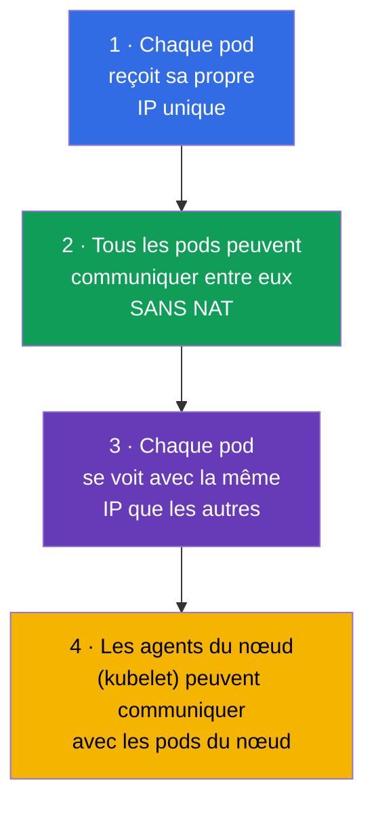
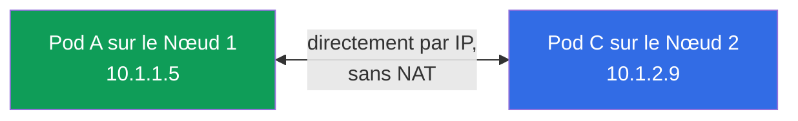
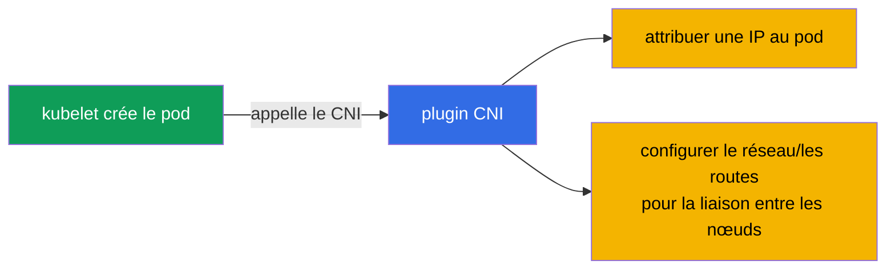
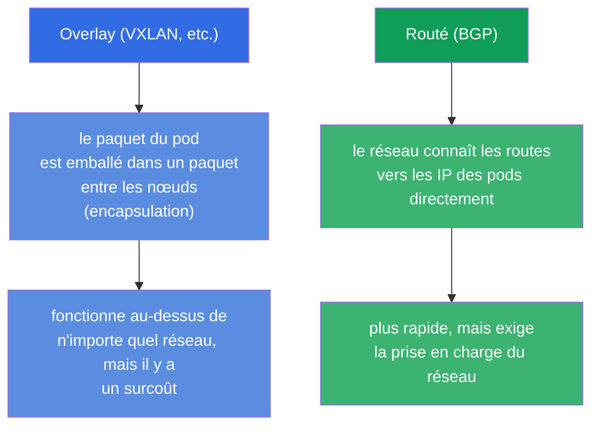
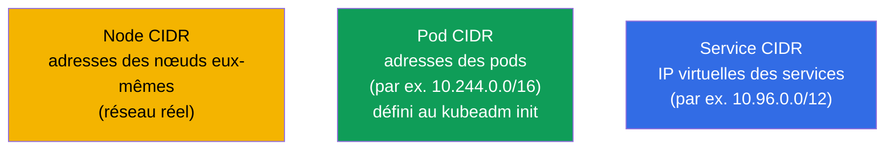
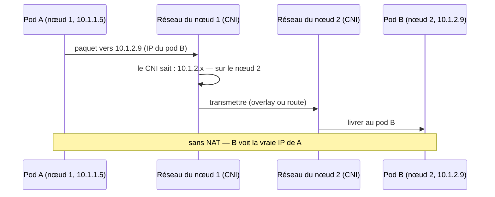
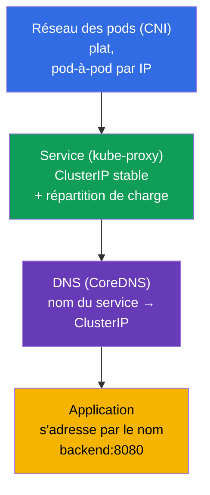

[Русская версия](ru.md) · [Eng version](README.md) · [Versión en español](es.md) · [Deutsche Version](de.md) · [ქართული ვერსია](ge.md) · [繁體中文版](tw.md) · [日本語版](jp.md)

# Chapitre 30. Le modèle réseau de Kubernetes, le réseau des pods et le CNI

> **Ce qui suit.** Nous commençons la partie 7 - le réseau. Nous avons déjà utilisé les Service et le
> DNS (chapitre 7), mais nous n'avons pas examiné comment le réseau est réellement organisé dans un
> cluster : comment les pods reçoivent une IP, comment ils communiquent entre les nœuds, qui assure
> tout cela. C'est le socle du domaine Services & Networking des deux examens et, plus important
> encore, la base du troubleshooting réseau (chapitre 46). Nous allons voir les quatre règles du
> modèle réseau de Kubernetes, le rôle du CNI et comment tout s'assemble.

## 30.1. Les quatre règles du modèle réseau de Kubernetes

Kubernetes n'implémente pas le réseau lui-même - il définit des **exigences (un modèle)** auxquelles
toute implémentation doit satisfaire. Le modèle est simple et tient sur quatre règles :

La conséquence principale : un **réseau plat**. N'importe quel pod peut joindre n'importe quel autre
pod par son IP directement, sans NAT, quel que soit le nœud sur lequel ils se trouvent. Du point de
vue des pods, tout le réseau du cluster est un espace d'adresses plat et unique.

## 30.2. Qui implémente le modèle : le CNI

Puisque Kubernetes ne fait que définir des exigences, quelqu'un doit les satisfaire. C'est le rôle du
**plugin CNI (Container Network Interface)** - le plugin réseau qui, à la création d'un pod, lui
attribue une IP et configure le routage pour que les pods se voient à travers les nœuds.

Les plugins CNI populaires (il faut les connaître par leur nom) :

| CNI | Particularité |
|-----|-------------|
| **Calico** | populaire, prend en charge les NetworkPolicy, peut fonctionner sans overlay (BGP) |
| **Cilium** | basé sur eBPF, hautes performances, politiques riches, peut remplacer kube-proxy |
| **Flannel** | simple, réseau overlay (VXLAN), sans politiques évoluées |
| **Weave Net** | simple, avec chiffrement (moins d'actualité) |
| **AWS VPC CNI** | les pods reçoivent de vraies IP du VPC (via ENI), sans overlay ; par défaut dans EKS |
| **Azure CNI** | les pods reçoivent une IP du réseau VNet, intégration native au réseau Azure |
| **GKE (Dataplane V2)** | CNI managé de Google, basé sur Cilium/eBPF |

> **Les CNI cloud (managés).** Dans les clusters managés (EKS, AKS, GKE), le fournisseur installe
> généralement son propre CNI. L'exemple parlant est **AWS VPC CNI** (`amazon-vpc-cni-k8s`), utilisé
> par défaut dans EKS : il ne fait pas d'overlay, mais attribue aux pods de **vraies adresses IP du
> sous-réseau du VPC**, en les affectant aux interfaces réseau (ENI) des instances. Avantages - le
> pod est visible dans le VPC comme un hôte ordinaire, tout fonctionne sans encapsulation (plus
> rapide) et s'entend directement avec les Security Groups, le routage VPC et les flow logs. Le prix
> à payer :
>
> - **les pods consomment des adresses du VPC** - sur de gros clusters, on peut réellement se heurter
>   à une pénurie d'IP dans le sous-réseau (il faut planifier le CIDR à l'avance) ;
> - **la densité de pods par nœud est limitée** par le nombre d'ENI et d'IP par instance (cela dépend
>   du type d'EC2) ; le mode prefix delegation atténue cela en attribuant des blocs /28 aux ENI.
>
> Pour l'examen (CKA/CKS), ce n'est pas indispensable à savoir, mais dans le travail réel avec EKS le
> choix et la configuration du CNI sont l'une des premières décisions d'architecture. Les
> NetworkPolicy n'ont longtemps pas été prises en charge par le VPC CNI lui-même, c'est pourquoi on
> le complète souvent avec Calico ou on active la prise en charge intégrée des politiques réseau.

Sans CNI installé, les nœuds restent `NotReady` et les pods `Pending`/`ContainerCreating` : le réseau
des pods n'est pas configuré. C'est une cause fréquente du « le cluster ne démarre pas après kubeadm
init » (chapitre 35).

## 30.3. Réseaux overlay et réseaux routés (en bref)

Les CNI réalisent la liaison entre les nœuds selon deux approches principales :

- **Overlay** (Flannel VXLAN, Calico en mode overlay) : les paquets des pods sont encapsulés dans des
  paquets entre les nœuds. Cela fonctionne au-dessus de n'importe quel réseau, mais ajoute un
  surcoût.
- **Routé** (Calico BGP, Cilium) : le réseau connaît lui-même les routes vers les IP des pods, sans
  encapsulation - plus rapide, mais il faut une prise en charge du côté de l'infrastructure réseau.

Pour l'examen, nous n'allons pas plus loin dans le détail - il suffit de comprendre que les deux
approches existent et pourquoi.

## 30.4. Les plages d'adresses : pods, services, nœuds

Un cluster comporte plusieurs espaces d'adressage indépendants - il ne faut pas les confondre :

| Plage | Ce qu'elle adresse | Exemple |
|----------|--------------|--------|
| **Node CIDR** | les IP des nœuds eux-mêmes (réseau réel/VPC) | 192.168.0.0/24 |
| **Pod CIDR** (`podSubnet`) | les IP des pods | 10.244.0.0/16 |
| **Service CIDR** (`serviceSubnet`) | les ClusterIP virtuelles des services | 10.96.0.0/12 |

Le Pod CIDR est défini à l'initialisation du cluster (`kubeadm init --pod-network-cidr`, chapitre 35)
et doit être cohérent avec la configuration du CNI. Le Service CIDR est virtuel : ces IP
n'appartiennent à aucune interface, c'est kube-proxy qui se trouve derrière (chapitre 7).

## 30.5. Comment un paquet va d'un pod à un autre

Rassemblons le modèle sur l'exemple d'une requête pod-à-pod entre deux nœuds :

C'est bien le CNI qui assure les étapes « le CNI sait où est le pod » et « transmettre entre les
nœuds ». L'application ne voit rien de tout cela - elle s'adresse simplement à une IP, comme dans un
réseau plat.

## 30.6. Service et DNS au-dessus du réseau des pods (lien avec le chapitre 7)

Le réseau des pods est le socle, mais on ne peut pas s'adresser aux IP « brutes » des pods (elles
changent). Au-dessus du réseau plat travaillent des couches déjà familières :

Les couches s'empilent : le CNI donne la connectivité des pods → kube-proxy donne des adresses
stables aux services → CoreDNS donne des noms. L'application travaille au niveau supérieur (par le
nom), et en dessous se trouve le réseau des pods détaillé ici. Le DNS/CoreDNS et les Service en
détail - au chapitre 31.

## 30.7. Comment cela s'applique en production

- **Le choix du CNI est une décision d'architecture.** En prod, on choisit le CNI selon les besoins :
  besoin de politiques réseau et de performances - Cilium (eBPF) ou Calico ; besoin de simplicité -
  Flannel. Dans les clusters managés, le CNI est souvent préinstallé (VPC CNI dans EKS, où les pods
  reçoivent de vraies IP du VPC).
- **Planification du CIDR.** Les Pod/Service CIDR sont planifiés à l'avance et alignés avec le réseau
  d'entreprise/le VPC, pour ne pas se chevaucher avec d'autres réseaux (sinon - conflits de routage).
  Un Pod CIDR trop petit limite le nombre de pods - une erreur fréquente quand le cluster grandit.
- **eBPF et abandon de kube-proxy.** Les clusters modernes installent de plus en plus Cilium en mode
  remplacement de kube-proxy : la répartition de charge des services passe par eBPF dans le noyau -
  plus rapide et mieux scalable qu'iptables.
- **Les NetworkPolicy exigent la prise en charge du CNI.** Les politiques réseau (chapitre 34) ne
  fonctionnent que si le CNI les prend en charge (Calico, Cilium - oui ; Flannel nu - non). On en
  tient compte au moment de choisir le CNI, si une segmentation du trafic est nécessaire.
- **Les problèmes réseau = des incidents fréquents.** « Le pod ne voit pas l'autre pod/service » en
  prod se ramène souvent au CNI (pas installé/cassé), à un conflit de CIDR ou à des nœuds NotReady à
  cause du réseau. La compréhension du modèle est la base de leur analyse.

## 30.8. Mini-glossaire

- **Modèle réseau de Kubernetes** - les exigences pour le réseau : une IP propre par pod, une liaison
  sans NAT, un réseau plat.
- **Réseau plat** - n'importe quel pod voit n'importe quel autre par IP directement, sans NAT.
- **CNI (Container Network Interface)** - le plugin qui implémente le réseau des pods (IP + routes).
- **Calico / Cilium / Flannel** - des plugins CNI populaires.
- **Overlay** - un réseau avec encapsulation des paquets entre les nœuds (VXLAN).
- **Réseau routé** - un réseau qui connaît les routes vers les pods directement (BGP).
- **Pod CIDR / Service CIDR** - les plages d'adresses des pods / des IP virtuelles des services.
- **eBPF** - la technologie du noyau Linux sur laquelle Cilium est construit.

## 30.9. Bilan du chapitre

- Kubernetes définit un modèle réseau (une IP propre pour chaque pod, une liaison sans NAT, un réseau
  plat), mais ne l'implémente pas lui-même.
- Le modèle est implémenté par le plugin CNI : il attribue les IP aux pods et configure la liaison
  entre les nœuds ; sans CNI, les nœuds sont NotReady et les pods ne démarrent pas.
- CNI populaires : Calico, Cilium (eBPF), Flannel ; ils diffèrent par les politiques, les
  performances, la complexité.
- La liaison entre les nœuds - overlay (encapsulation, VXLAN) ou routage (BGP/eBPF).
- Trois espaces d'adressage : Node CIDR (les nœuds), Pod CIDR (les pods), Service CIDR (les IP
  virtuelles des services) - à ne pas confondre.
- Au-dessus du réseau plat des pods travaillent les Service (kube-proxy, IP stables) et le DNS
  (CoreDNS, les noms) - chapitre 31.

## 30.10. À quoi cela sert : à l'examen et dans le travail réel

**À l'examen.** Les exercices directs « configure le CNI » sont rares, mais la compréhension du
modèle est critique pour le troubleshooting (30 % du CKA) : « pods Pending / nœud NotReady » = souvent
pas de CNI ; « le pod ne voit pas l'autre » = problème réseau. À l'installation du cluster (chapitre
35), un `--pod-network-cidr` correct et l'installation du CNI sont une étape obligatoire.

**Dans le travail réel.** Le choix et la configuration du CNI sont une décision fondamentale pour le
cluster (politiques, performances, intégration au VPC). La planification du CIDR évite les conflits et
la pénurie d'adresses quand le cluster grandit. Comprendre le réseau plat et le rôle du CNI est la
base de l'analyse de tout incident réseau.

## 30.11. Questions d'auto-évaluation

1. Formulez les règles clés du modèle réseau de Kubernetes. Qu'est-ce qu'un « réseau plat » ?
2. Qui implémente le modèle réseau et que fait le CNI à la création d'un pod ?
3. Qu'arrive-t-il aux nœuds et aux pods si le CNI n'est pas installé ?
4. En quoi un réseau overlay diffère-t-il d'un réseau routé ?
5. Citez les trois espaces d'adressage du cluster et ce que chacun adresse.
6. Comment les couches s'empilent-elles : réseau des pods, Service, DNS ?
7. Pourquoi une NetworkPolicy peut-elle ne pas fonctionner avec certains CNI ?

## Pratique

Nous avons vu le réseau des pods - le socle. Au chapitre 31, nous monterons au niveau des Service et
du DNS : nous verrons CoreDNS et comment les noms se transforment en adresses. Les sujets réseau se
travaillent dans les TP sur le réseau et le troubleshooting.

🧪 TP 123 (installation du CNI à partir de zéro + réseau bas niveau) : [tasks/cka/labs/123](../../labs/123/README_FR.MD)

---
[Sommaire](../README_FR.md) · [Chapitre 29](../29/fr.md) · [Chapitre 31](../31/fr.md)
