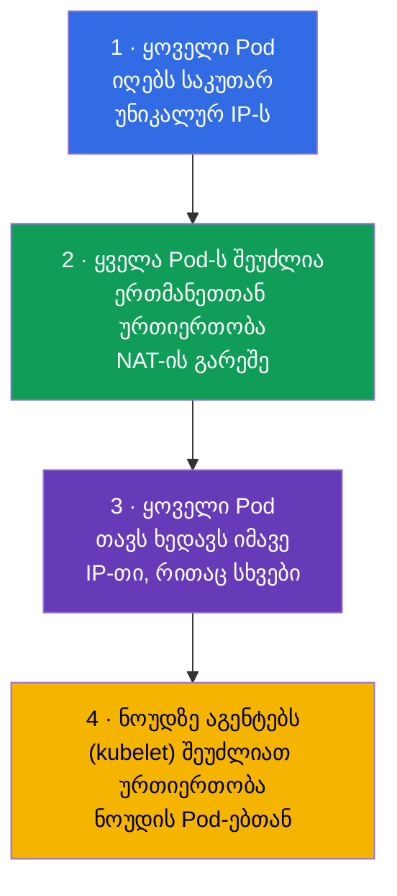
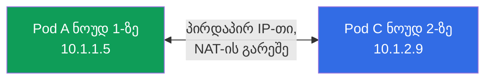
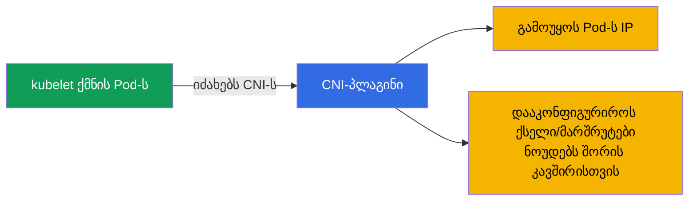
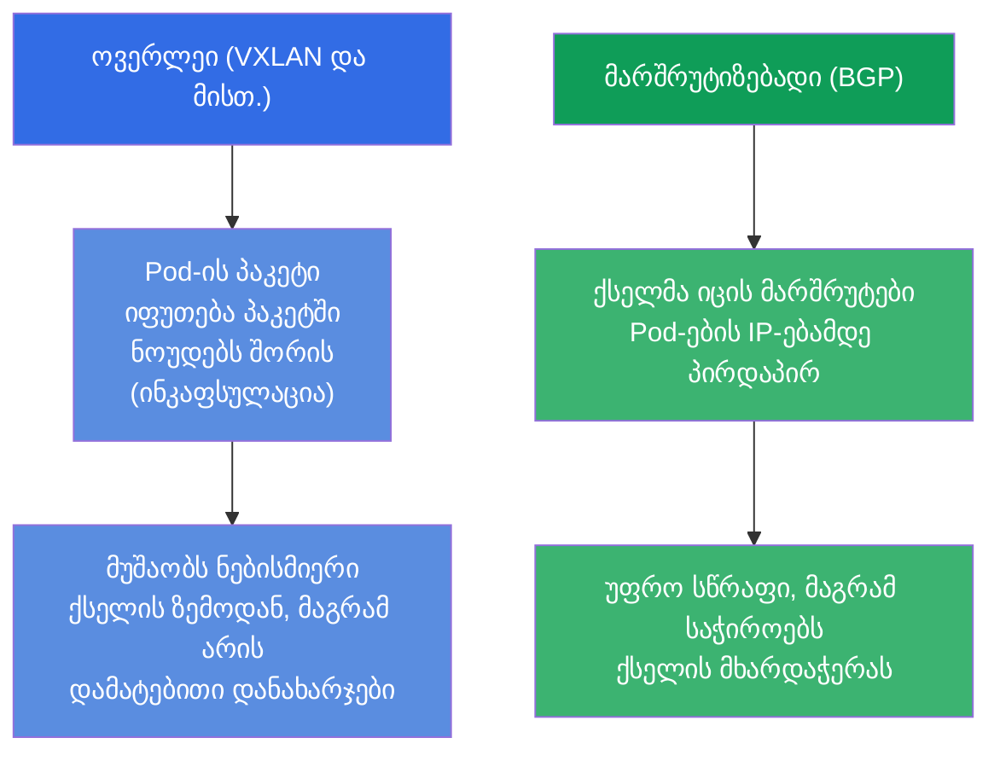
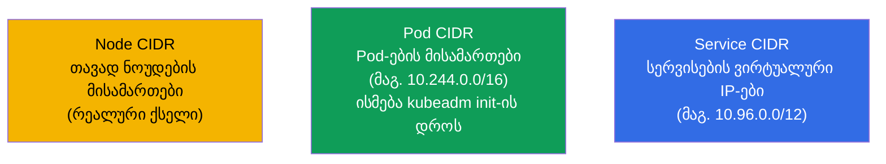
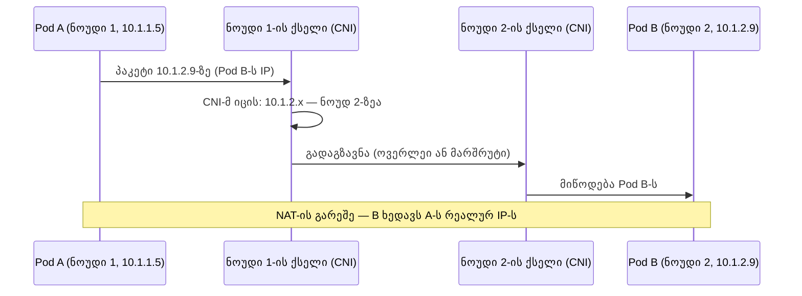
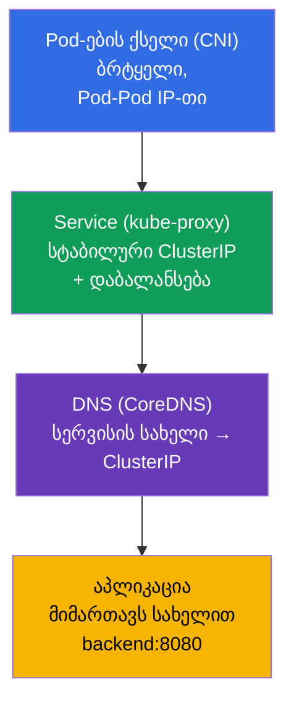

[Русская версия](ru.md) · [Eng version](README.md) · [Versión en español](es.md) · [Version française](fr.md) · [Deutsche Version](de.md) · [繁體中文版](tw.md) · [日本語版](jp.md)

# თავი 30. Kubernetes-ის ქსელური მოდელი, Pod-ების ქსელი და CNI

> **რა იქნება შემდეგ.** ვიწყებთ ნაწილ 7-ს - ქსელებს. Service-სა და DNS-ს უკვე ვიყენებდით (თავი 7),
> მაგრამ არ გავარჩიეთ, როგორ არის საერთოდ მოწყობილი ქსელი კლასტერში: როგორ იღებენ Pod-ები IP-ს,
> როგორ ურთიერთობენ ნოუდებს შორის, ვინ უზრუნველყოფს ამას. ეს ორივე გამოცდის დომენის
> Services & Networking საფუძველია და, რაც უფრო მნიშვნელოვანია, - ქსელური troubleshooting-ის
> (თავი 46) საფუძველი. გავარჩევთ Kubernetes-ის ქსელური მოდელის ოთხ წესს, CNI-ს როლს და როგორ ეწყობა ყველაფერი ერთად.

## 30.1. Kubernetes-ის ქსელური მოდელის ოთხი წესი

Kubernetes ქსელს თავად არ ახორციელებს - ის განსაზღვრავს **მოთხოვნებს (მოდელს)**, რომლებსაც უნდა
აკმაყოფილებდეს ნებისმიერი რეალიზაცია. მოდელი მარტივია და ოთხ წესზე დგას:

მთავარი შედეგი: **ბრტყელი ქსელი**. ნებისმიერ Pod-ს შეუძლია მიმართოს ნებისმიერ სხვა Pod-ს მისი
IP-თი პირდაპირ, NAT-ის გარეშე, იმის მიუხედავად, რომელ ნოუდზე იმყოფებიან. Pod-ების
თვალსაზრისით კლასტერის მთელი ქსელი - ერთი ბრტყელი მისამართების სივრცეა.

## 30.2. ვინ ახორციელებს მოდელს: CNI

რაკი Kubernetes მხოლოდ მოთხოვნებს განსაზღვრავს, ვინმემ უნდა შეასრულოს ისინი. ამას აკეთებს
**CNI-პლაგინი (Container Network Interface)** - ქსელის პლაგინი, რომელიც Pod-ის შექმნისას
გამოუყოფს მას IP-ს და აკონფიგურირებს მარშრუტიზაციას, რომ Pod-ები ერთმანეთს ნოუდების გავლით ხედავდნენ.

პოპულარული CNI-პლაგინები (მათი სახელები უნდა იცოდეთ):

| CNI | თავისებურება |
|-----|-------------|
| **Calico** | პოპულარული, აქვს NetworkPolicy-ს მხარდაჭერა, შეუძლია ოვერლეის გარეშე (BGP) |
| **Cilium** | eBPF-ზე, მაღალი წარმადობა, მდიდარი პოლიტიკები, შეუძლია kube-proxy-ს ჩანაცვლება |
| **Flannel** | მარტივი, ოვერლეი ქსელი (VXLAN), განვითარებული პოლიტიკების გარეშე |
| **Weave Net** | მარტივი, დაშიფვრით (ნაკლებად აქტუალური) |
| **AWS VPC CNI** | Pod-ები იღებენ რეალურ IP-ებს VPC-დან (ENI-ს გავლით), ოვერლეის გარეშე; ნაგულისხმევად EKS-ში |
| **Azure CNI** | Pod-ები იღებენ IP-ს VNet ქსელიდან, ნატიური ინტეგრაცია Azure-ის ქსელთან |
| **GKE (Dataplane V2)** | Google-ის მართული CNI Cilium/eBPF-ის ბაზაზე |

> **საკლაუდო (მართული) CNI.** managed-კლასტერებში (EKS, AKS, GKE) პროვაიდერი ჩვეულებრივ
> აყენებს საკუთარ CNI-ს. საჩვენებელი მაგალითია **AWS VPC CNI** (`amazon-vpc-cni-k8s`),
> რომელიც EKS-ში ნაგულისხმევად გამოიყენება: ის ოვერლეის არ აკეთებს, არამედ Pod-ებს გამოუყოფს
> **ნამდვილ IP-მისამართებს VPC-ის ქვექსელიდან**, ანიჭებს მათ ინსტანსების ქსელურ ინტერფეისებზე (ENI).
> პლიუსები - Pod ჩანს VPC-ში ჩვეულებრივი ჰოსტივით, მუშაობს ინკაფსულაციის გარეშე (უფრო სწრაფად) და
> პირდაპირ ეგუება Security Groups-ს, VPC-მარშრუტიზაციასა და flow logs-ს. ამის საზღაური:
>
> - **Pod-ები ხარჯავენ VPC-ის მისამართებს** - დიდ კლასტერებში რეალურად შეიძლება ქვექსელში IP-ების
>   უკმარისობას შეეჯახოთ (CIDR წინასწარ უნდა დაიგეგმოს);
> - **Pod-ების სიმკვრივე ნოუდზე შეზღუდულია** ENI-ების და ინსტანსზე IP-ების რაოდენობით (დამოკიდებულია
>   EC2-ის ტიპზე); prefix delegation რეჟიმი ამას ამსუბუქებს, ENI-ზე /28 ბლოკების გამოყოფით.
>
> გამოცდისთვის (CKA/CKS) ამის ცოდნა სავალდებულო არ არის, მაგრამ EKS-თან რეალურ მუშაობაში CNI-ს
> არჩევა და კონფიგურაცია - ერთ-ერთი პირველი არქიტექტურული გადაწყვეტილებაა. NetworkPolicy EKS-ში
> დიდი ხნის განმავლობაში თავად VPC CNI-ს მიერ არ იყო მხარდაჭერილი, ამიტომ მას ხშირად ავსებენ Calico-თი ან
> რთავენ ქსელური პოლიტიკების ჩაშენებულ მხარდაჭერას.

დაყენებული CNI-ს გარეშე ნოუდები რჩება `NotReady`, ხოლო Pod-ები - `Pending`/`ContainerCreating`:
Pod-ების ქსელი არ არის დაკონფიგურირებული. ეს არის ხშირი მიზეზი იმისა, რომ „კლასტერი არ იწევა kubeadm init-ის შემდეგ“
(თავი 35).

## 30.3. ოვერლეი და მარშრუტიზებადი ქსელები (მოკლედ)

CNI ნოუდებს შორის კავშირს ორი ძირითადი მიდგომით ახორციელებს:

- **ოვერლეი** (Flannel VXLAN, Calico ოვერლეი რეჟიმში): Pod-ების პაკეტები ინკაფსულირდება
  ნოუდებს შორის პაკეტებში. მუშაობს ნებისმიერი ქსელის ზემოდან, მაგრამ ამატებს დამატებით დანახარჯებს.
- **მარშრუტიზებადი** (Calico BGP, Cilium): ქსელმა თავად იცის მარშრუტები Pod-ების IP-ებამდე,
  ინკაფსულაციის გარეშე - უფრო სწრაფია, მაგრამ საჭიროა მხარდაჭერა ქსელური ინფრასტრუქტურის მხრიდან.

გამოცდისთვის ამაში ღრმად არ ვიხედებით - საკმარისია გვესმოდეს, რომ ორივე მიდგომა
არსებობს და რატომ.

## 30.4. მისამართების დიაპაზონები: Pod-ები, სერვისები, ნოუდები

კლასტერში არის რამდენიმე დამოუკიდებელი მისამართული სივრცე - მათი არევა არ შეიძლება:

| დიაპაზონი | რას ამისამართებს | მაგალითი |
|----------|--------------|--------|
| **Node CIDR** | თავად ნოუდების IP (რეალური ქსელი/VPC) | 192.168.0.0/24 |
| **Pod CIDR** (`podSubnet`) | Pod-ების IP | 10.244.0.0/16 |
| **Service CIDR** (`serviceSubnet`) | სერვისების ვირტუალური ClusterIP | 10.96.0.0/12 |

Pod CIDR ისმება კლასტერის ინიციალიზაციისას (`kubeadm init --pod-network-cidr`, თავი 35)
და უნდა შეესაბამებოდეს CNI-ს კონფიგს. Service CIDR - ვირტუალურია: ეს IP-ები არ
ეკუთვნის არცერთ ინტერფეისს, მათ უკან kube-proxy დგას (თავი 7).

## 30.5. როგორ აღწევს პაკეტი Pod-იდან Pod-მდე

მოდელს ერთად შევკრიბავთ ნოუდებს შორის Pod-Pod მოთხოვნის მაგალითზე:

სწორედ CNI უზრუნველყოფს ნაბიჯებს „CNI-მ იცის, სად არის Pod“ და „გადაგზავნა ნოუდებს შორის“. აპლიკაციისთვის
ეს უხილავია - ის უბრალოდ მიმართავს IP-თი, როგორც ბრტყელ ქსელში.

## 30.6. Service და DNS Pod-ების ქსელის ზემოდან (კავშირი თავ 7-თან)

Pod-ების ქსელი - საფუძველია, მაგრამ Pod-ების „ნედლი“ IP-ებით მიმართვა არ შეიძლება (ისინი იცვლება). ბრტყელი
ქსელის ზემოდან მუშაობს უკვე ნაცნობი შრეები:

შრეები ერთმანეთს ეწყობა: CNI იძლევა Pod-ების დაკავშირებადობას → kube-proxy იძლევა სერვისების სტაბილურ მისამართებს
→ CoreDNS იძლევა სახელებს. აპლიკაცია მუშაობს ზედა დონეზე (სახელით), ხოლო მის ქვემოთ -
აქ გარჩეული Pod-ების ქსელი. DNS/CoreDNS და Service დეტალურად - თავ 31-ში.

## 30.7. როგორ იყენებენ ამას პროდაქშენში

- **CNI-ს არჩევა - არქიტექტურული გადაწყვეტილებაა.** პროდში CNI-ს ირჩევენ საჭიროებების მიხედვით: თუ საჭიროა
  ქსელური პოლიტიკები და წარმადობა - Cilium (eBPF) ან Calico; თუ საჭიროა სიმარტივე -
  Flannel. მართულ კლასტერებში CNI ხშირად წინასწარ დაყენებულია (VPC CNI EKS-ში, სადაც Pod-ები
  იღებენ რეალურ IP-ებს VPC-დან).
- **CIDR-ის დაგეგმვა.** Pod/Service CIDR წინასწარ იგეგმება და შეთანხმდება კორპორაციულ
  ქსელთან/VPC-სთან, რომ სხვა ქსელებს არ გადაეფაროს (თორემ - მარშრუტიზაციის კონფლიქტები).
  ძალიან მცირე Pod CIDR ზღუდავს Pod-ების რაოდენობას - ხშირი შეცდომა კლასტერის ზრდისას.
- **eBPF და kube-proxy-ზე უარის თქმა.** თანამედროვე კლასტერები სულ უფრო ხშირად აყენებენ Cilium-ს
  kube-proxy-ს ჩანაცვლების რეჟიმში: სერვისების დაბალანსება მიდის eBPF-ით ბირთვში - უფრო სწრაფად და უკეთ
  მასშტაბირდება, ვიდრე iptables.
- **NetworkPolicy საჭიროებს CNI-ს მხარდაჭერას.** ქსელური პოლიტიკები (თავი 34) მუშაობს მხოლოდ
  მაშინ, თუ CNI მათ მხარს უჭერს (Calico, Cilium - კი; შიშველი Flannel - არა). ამას ითვალისწინებენ CNI-ს
  არჩევისას, თუ საჭიროა ტრაფიკის სეგმენტაცია.
- **ქსელური პრობლემები = ხშირი ინციდენტები.** „Pod არ ხედავს სხვა Pod-ს/სერვისს“ პროდში ხშირად
  CNI-ზე მიდის (არ არის დაყენებული/გატეხილია), CIDR-ის კონფლიქტზე ან ნოუდების NotReady-ზე ქსელის გამო.
  მოდელის გაგება - მათი გარჩევის საფუძველია.

## 30.8. მინი-ლექსიკონი

- **Kubernetes-ის ქსელური მოდელი** - ქსელისადმი მოთხოვნები: Pod-ს საკუთარი IP, კავშირი NAT-ის გარეშე,
  ბრტყელი ქსელი.
- **ბრტყელი ქსელი** - ნებისმიერი Pod ხედავს ნებისმიერს IP-თი პირდაპირ, NAT-ის გარეშე.
- **CNI (Container Network Interface)** - პლაგინი, რომელიც ახორციელებს Pod-ების ქსელს (IP + მარშრუტები).
- **Calico / Cilium / Flannel** - პოპულარული CNI-პლაგინები.
- **ოვერლეი** - ქსელი პაკეტების ინკაფსულაციით ნოუდებს შორის (VXLAN).
- **მარშრუტიზებადი ქსელი** - ქსელი, რომელმაც იცის მარშრუტები Pod-ებამდე პირდაპირ (BGP).
- **Pod CIDR / Service CIDR** - Pod-ების მისამართების / სერვისების ვირტუალური IP-ების დიაპაზონები.
- **eBPF** - ტექნოლოგია Linux-ის ბირთვში, რომელზეც Cilium არის აშენებული.

## 30.9. თავის შეჯამება

- Kubernetes განსაზღვრავს ქსელურ მოდელს (თითოეულ Pod-ს საკუთარი IP, კავშირი NAT-ის გარეშე, ბრტყელი
  ქსელი), მაგრამ თავად არ ახორციელებს მას.
- მოდელს ახორციელებს CNI-პლაგინი: გამოუყოფს Pod-ებს IP-ს და აკონფიგურირებს კავშირს ნოუდებს შორის; CNI-ს გარეშე
  ნოუდები NotReady, Pod-ები არ იწყებს მუშაობას.
- პოპულარული CNI: Calico, Cilium (eBPF), Flannel; განსხვავდებიან პოლიტიკებით,
  წარმადობით, სირთულით.
- კავშირი ნოუდებს შორის - ოვერლეი (ინკაფსულაცია, VXLAN) ან მარშრუტიზაცია (BGP/eBPF).
- სამი მისამართული სივრცე: Node CIDR (ნოუდები), Pod CIDR (Pod-ები), Service CIDR (სერვისების
  ვირტუალური IP) - არ აირიოს.
- Pod-ების ბრტყელი ქსელის ზემოდან მუშაობს Service (kube-proxy, სტაბილური IP) და DNS (CoreDNS,
  სახელები) - თავი 31.

## 30.10. როგორ გამოგადგებათ: გამოცდაზე და რეალურ სამუშაოში

**გამოცდაზე.** პირდაპირი დავალებები „დააკონფიგურირე CNI“ ბევრი არ არის, მაგრამ მოდელის გაგება კრიტიკულია
troubleshooting-ისთვის (CKA-ს 30%): „Pod-ები Pending / ნოუდი NotReady“ ხშირად = არ არის CNI; „Pod არ ხედავს
სხვას“ = ქსელური პრობლემა. კლასტერის დაყენებისას (თავი 35) სწორი `--pod-network-
cidr` და CNI-ს ინსტალაცია - სავალდებულო ნაბიჯია.

**რეალურ სამუშაოში.** CNI-ს არჩევა და კონფიგურაცია - ფუნდამენტური გადაწყვეტილებაა კლასტერისთვის
(პოლიტიკები, წარმადობა, ინტეგრაცია VPC-სთან). CIDR-ის დაგეგმვა თავიდან იცილებს
კონფლიქტებსა და მისამართების უკმარისობას ზრდისას. ბრტყელი ქსელისა და CNI-ს როლის გაგება - ნებისმიერი
ქსელური ინციდენტის გარჩევის საფუძველია.

## 30.11. თვითშემოწმების კითხვები

1. ჩამოაყალიბეთ Kubernetes-ის ქსელური მოდელის ძირითადი წესები. რა არის „ბრტყელი ქსელი“?
2. ვინ ახორციელებს ქსელურ მოდელს და რას აკეთებს CNI Pod-ის შექმნისას?
3. რა მოხდება ნოუდებთან და Pod-ებთან, თუ CNI არ არის დაყენებული?
4. რით განსხვავდება ოვერლეი ქსელი მარშრუტიზებადისგან?
5. დაასახელეთ კლასტერის სამი მისამართული სივრცე და რას ამისამართებს თითოეული.
6. როგორ ეწყობა შრეები: Pod-ების ქსელი, Service, DNS?
7. რატომ შეიძლება NetworkPolicy არ იმუშაოს ზოგიერთ CNI-სთან?

## პრაქტიკა

გავარჩიეთ Pod-ების ქსელი - საფუძველი. თავ 31-ში ავიწევთ Service-სა და DNS-ის დონეზე:
გავარჩევთ CoreDNS-ს და იმას, როგორ იქცევა სახელები მისამართებად. ქსელური თემები მუშავდება
ქსელისა და troubleshooting-ის ლაბებში.

🧪 ლაბი 123 (CNI-ს ნულიდან ინსტალაცია + დაბალი დონის ქსელი): [tasks/cka/labs/123](../../labs/123/README_GE.MD)

---
[სარჩევი](../README_GE.md) · [თავი 29](../29/ge.md) · [თავი 31](../31/ge.md)
