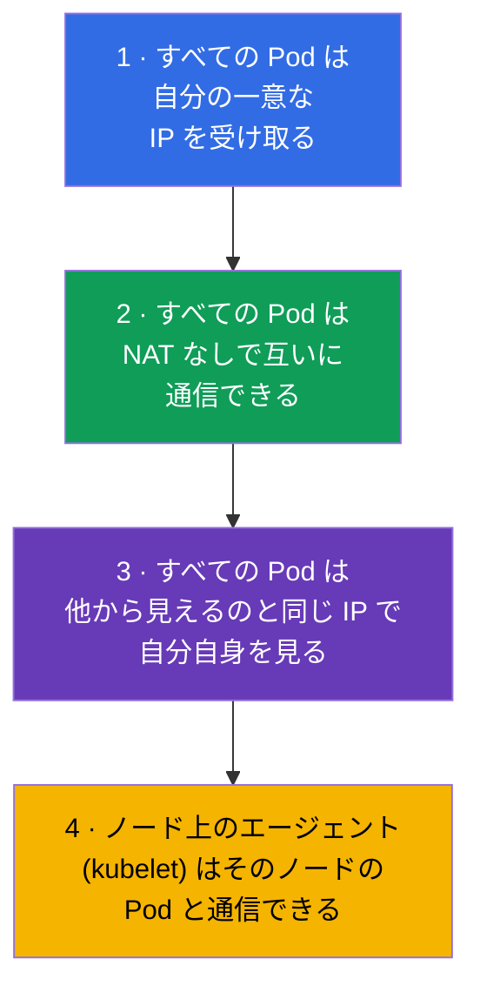
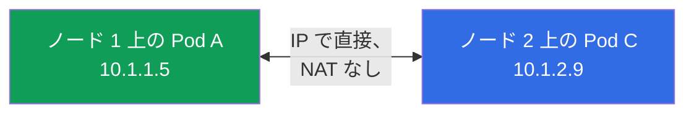
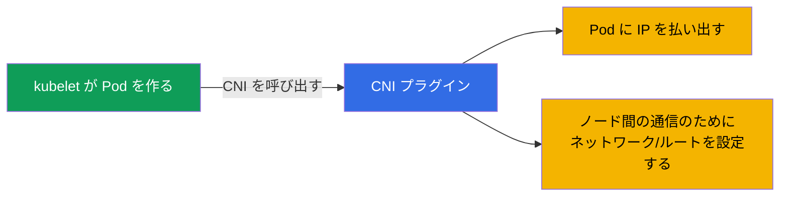
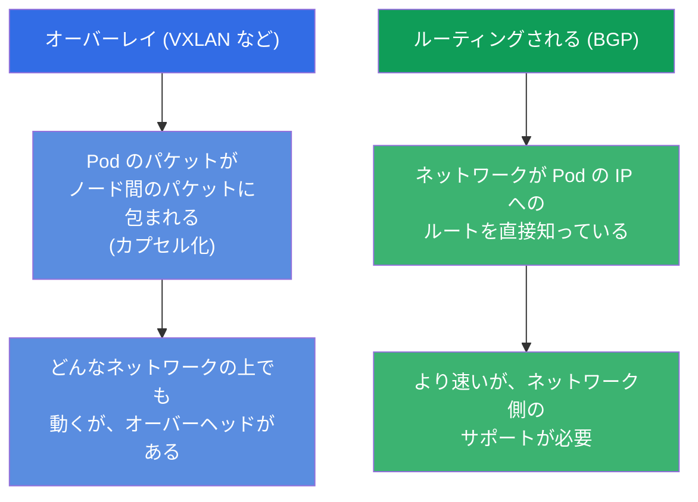
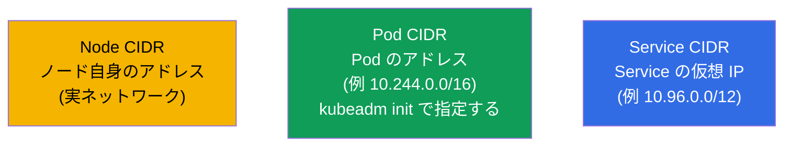
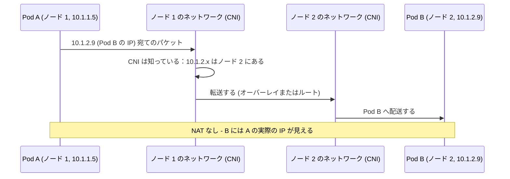
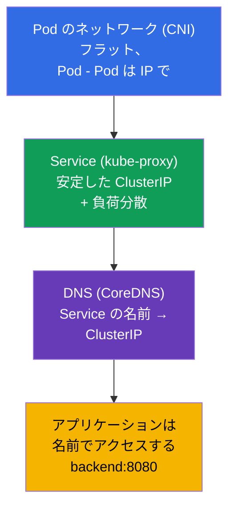

[Русская версия](ru.md) · [Eng version](README.md) · [Versión en español](es.md) · [Version française](fr.md) · [Deutsche Version](de.md) · [ქართული ვერსია](ge.md) · [繁體中文版](tw.md)

# 第 30 章。Kubernetes のネットワークモデル、Pod のネットワーク、CNI

> **次は何か。** パート 7 - ネットワーク - を始めます。Service と DNS はすでに使って
> きましたが（第 7 章）、クラスタのネットワークがそもそもどう作られているのかは
> 分解していません：Pod はどうやって IP を受け取るのか、ノードをまたいでどう通信するのか、
> それを誰が支えているのか。これは両方の試験の Services & Networking 領域の土台であり、
> さらに重要なのは、ネットワークの troubleshooting（第 46 章）の基礎だということです。
> Kubernetes のネットワークモデルの 4 つのルール、CNI の役割、そしてすべてがどう
> 組み上がるのかを見ていきます。

## 30.1. Kubernetes のネットワークモデルの 4 つのルール

Kubernetes はネットワークを自分で実装しません - どの実装も満たすべき **要件（モデル）**
を定めるだけです。モデルは単純で、4 つのルールの上に立っています：

もっとも重要な帰結は **フラットなネットワーク** です。どの Pod も、相手がどのノードに
いるかに関係なく、その IP で他のどの Pod へも NAT なしに直接アクセスできます。Pod から
見れば、クラスタのネットワーク全体が 1 つのフラットなアドレス空間です。

## 30.2. モデルを実装するのは誰か：CNI

Kubernetes は要件を定めるだけなので、それを誰かが実行しなければなりません。それを行うのが
**CNI プラグイン (Container Network Interface)** - Pod の作成時にその Pod へ IP を払い出し、
Pod どうしがノードをまたいで見えるようにルーティングを設定するネットワークのプラグインです。

よく使われる CNI プラグイン（名前で知っておく必要があります）：

| CNI | 特徴 |
|-----|-------------|
| **Calico** | 普及している、NetworkPolicy をサポート、オーバーレイなしでも動く (BGP) |
| **Cilium** | eBPF ベース、高い性能、豊富なポリシー、kube-proxy を置き換えられる |
| **Flannel** | シンプル、オーバーレイネットワーク (VXLAN)、高度なポリシーはない |
| **Weave Net** | シンプル、暗号化あり（今は重要度が下がった） |
| **AWS VPC CNI** | Pod が VPC の実際の IP を (ENI 経由で) 受け取る、オーバーレイなし。EKS のデフォルト |
| **Azure CNI** | Pod が VNet のネットワークから IP を受け取る、Azure のネットワークとのネイティブな統合 |
| **GKE (Dataplane V2)** | Cilium/eBPF をベースにした Google のマネージド CNI |

> **クラウドの（マネージドな）CNI。** マネージドクラスタ (EKS、AKS、GKE) では、通常
> プロバイダが自分の CNI を入れます。分かりやすい例が **AWS VPC CNI**
> (`amazon-vpc-cni-k8s`) で、EKS ではデフォルトで使われます：オーバーレイを作らず、Pod へ
> **VPC のサブネットの本物の IP アドレス** を払い出し、それをインスタンスのネットワーク
> インターフェース (ENI) に割り当てます。利点は - Pod が VPC の中で普通のホストとして
> 見え、カプセル化なしで動き（より速い）、Security Group、VPC のルーティング、flow logs と
> 直接うまく噛み合うことです。その代償は：
>
> - **Pod が VPC のアドレスを消費する** - 大きなクラスタではサブネットの IP 不足に
>   現実にぶつかります（CIDR を前もって設計する必要があります）。
> - **ノード上の Pod の密度が** インスタンスあたりの ENI と IP の数で制限されます
>   （EC2 のタイプに依存）。prefix delegation モードは、ENI に /28 のブロックを払い出すことで
>   これを緩和します。
>
> 試験 (CKA/CKS) のためにこれを知っておく必要はありませんが、EKS での実際の仕事では
> CNI の選定と設定は最初のアーキテクチャ上の決定のひとつです。EKS では NetworkPolicy が
> 長いあいだ VPC CNI 自体でサポートされていなかったため、しばしば Calico で補ったり、
> 組み込みのネットワークポリシーのサポートを有効にしたりします。

CNI がインストールされていないと、ノードは `NotReady` のままで、Pod は
`Pending`/`ContainerCreating` のままです：Pod のネットワークが設定されていないからです。
これは「kubeadm init のあとクラスタが立ち上がらない」のよくある原因です（第 35 章）。

## 30.3. オーバーレイネットワークとルーティングされるネットワーク（簡潔に）

CNI はノード間の通信を、主に 2 つのアプローチで実装します：

- **オーバーレイ**（Flannel VXLAN、オーバーレイモードの Calico）：Pod のパケットが
  ノード間のパケットにカプセル化されます。どんなネットワークの上でも動きますが、
  オーバーヘッドが増えます。
- **ルーティングされる**（Calico BGP、Cilium）：ネットワーク自身が Pod の IP への
  ルートを知っていて、カプセル化がありません - より速いですが、ネットワーク
  インフラ側のサポートが必要です。

試験のためにここを深く掘る必要はありません - 両方のアプローチが存在することと、その
理由を理解していれば十分です。

## 30.4. アドレスの範囲：Pod、Service、ノード

クラスタにはいくつかの独立したアドレス空間があります - 混同してはいけません：

| 範囲 | 何をアドレスするか | 例 |
|----------|--------------|--------|
| **Node CIDR** | ノード自身の IP（実ネットワーク/VPC） | 192.168.0.0/24 |
| **Pod CIDR** (`podSubnet`) | Pod の IP | 10.244.0.0/16 |
| **Service CIDR** (`serviceSubnet`) | Service の仮想 ClusterIP | 10.96.0.0/12 |

Pod CIDR はクラスタの初期化時に指定し（`kubeadm init --pod-network-cidr`、第 35 章）、
CNI の設定と整合していなければなりません。Service CIDR は仮想です：これらの IP は
どのインターフェースにも属さず、その背後には kube-proxy がいます（第 7 章）。

## 30.5. パケットは Pod から Pod へどうやって届くのか

ノードをまたぐ Pod - Pod のリクエストの例で、モデルを 1 つにまとめましょう：

「CNI は Pod がどこにいるか知っている」と「ノード間で転送する」というステップを担うのは、
まさに CNI です。アプリケーションからはこれは見えません - フラットなネットワークの中に
いるかのように、ただ IP へアクセスするだけです。

## 30.6. Pod のネットワークの上に載る Service と DNS（第 7 章とのつながり）

Pod のネットワークは土台ですが、Pod の「生の」IP へアクセスするわけにはいきません
（変わってしまうからです）。フラットなネットワークの上では、すでにおなじみの層が
動いています：

層は積み重なります：CNI が Pod の接続性を与え → kube-proxy が Service の安定した
アドレスを与え → CoreDNS が名前を与えます。アプリケーションは最上位の層（名前）で動き、
その下にあるのが、ここで分解した Pod のネットワークです。DNS/CoreDNS と Service の
詳細は - 第 31 章で。

## 30.7. 本番環境でこれをどう使うか

- **CNI の選定はアーキテクチャ上の決定。** 本番では CNI をニーズで選びます：
  ネットワークポリシーと性能が必要なら - Cilium (eBPF) か Calico、シンプルさが
  必要なら - Flannel。マネージドクラスタでは CNI がしばしばあらかじめ入っています
  （EKS の VPC CNI では Pod が VPC の実際の IP を受け取ります）。
- **CIDR の設計。** Pod/Service CIDR は前もって設計し、他のネットワークと重ならないように
  社内ネットワーク/VPC と調整します（さもないと - ルーティングの衝突です）。
  小さすぎる Pod CIDR は Pod の数を制限します - クラスタが成長したときのよくある失敗です。
- **eBPF と kube-proxy をやめること。** 現代的なクラスタでは、kube-proxy を置き換える
  モードで Cilium を入れることが増えています：Service の負荷分散がカーネルの eBPF で
  行われ - iptables より速く、スケールもよくなります。
- **NetworkPolicy は CNI のサポートを必要とする。** ネットワークポリシー（第 34 章）は、
  CNI がそれをサポートしている場合にだけ動きます（Calico、Cilium - はい。素の
  Flannel - いいえ）。トラフィックのセグメンテーションが必要なら、CNI を選ぶときに
  これを考慮します。
- **ネットワークの問題 = よくあるインシデント。** 本番での「Pod が別の Pod/Service を
  見られない」は、しばしば CNI（入っていない/壊れている）、CIDR の衝突、ネットワークが
  原因でノードが NotReady、に行き当たります。モデルの理解が、その調査の基礎です。

## 30.8. ミニ用語集

- **Kubernetes のネットワークモデル** - ネットワークへの要件：Pod は自分の IP を持ち、
  NAT なしで通信し、フラットなネットワークであること。
- **フラットなネットワーク** - どの Pod も、どの Pod へも IP で直接、NAT なしにアクセスできる。
- **CNI (Container Network Interface)** - Pod のネットワーク（IP + ルート）を実装するプラグイン。
- **Calico / Cilium / Flannel** - よく使われる CNI プラグイン。
- **オーバーレイ** - ノード間でパケットをカプセル化するネットワーク (VXLAN)。
- **ルーティングされるネットワーク** - Pod へのルートを直接知っているネットワーク (BGP)。
- **Pod CIDR / Service CIDR** - Pod のアドレス / Service の仮想 IP の範囲。
- **eBPF** - Linux カーネルの技術で、その上に Cilium が作られている。

## 30.9. 本章のまとめ

- Kubernetes はネットワークモデル（すべての Pod が自分の IP を持つ、NAT なしの通信、
  フラットなネットワーク）を定めますが、それを自分で実装はしません。
- モデルを実装するのは CNI プラグインです：Pod に IP を払い出し、ノード間の通信を
  設定します。CNI がないとノードは NotReady で、Pod は起動しません。
- よく使われる CNI：Calico、Cilium (eBPF)、Flannel。ポリシー、性能、複雑さが
  異なります。
- ノード間の通信は - オーバーレイ（カプセル化、VXLAN）またはルーティング (BGP/eBPF)。
- 3 つのアドレス空間：Node CIDR（ノード）、Pod CIDR（Pod）、Service CIDR（Service の
  仮想 IP）- 混同しないこと。
- Pod のフラットなネットワークの上では Service（kube-proxy、安定した IP）と DNS
  （CoreDNS、名前）が動きます - 第 31 章。

## 30.10. これがどう役に立つか：試験と実際の仕事で

**試験では。** 「CNI を設定せよ」という直接の問題は多くありませんが、モデルの理解は
troubleshooting（CKA の 30%）で決定的です：「Pod が Pending / ノードが NotReady」は
しばしば = CNI がない、「Pod が別の Pod を見られない」= ネットワークの問題です。
クラスタのインストール時（第 35 章）には、正しい `--pod-network-cidr` と CNI の
インストールが必須のステップです。

**実際の仕事では。** CNI の選定と設定はクラスタにとって土台となる決定です
（ポリシー、性能、VPC との統合）。CIDR の設計は、クラスタが成長したときの衝突と
アドレス不足を防ぎます。フラットなネットワークと CNI の役割の理解は、あらゆる
ネットワークのインシデントを調べる基礎です。

## 30.11. 自己チェックの質問

1. Kubernetes のネットワークモデルの重要なルールを述べてください。「フラットなネットワーク」とは何ですか？
2. ネットワークモデルを実装するのは誰で、Pod の作成時に CNI は何をしますか？
3. CNI がインストールされていないと、ノードと Pod はどうなりますか？
4. オーバーレイネットワークはルーティングされるネットワークとどう違いますか？
5. クラスタの 3 つのアドレス空間と、それぞれが何をアドレスするかを挙げてください。
6. Pod のネットワーク、Service、DNS の層はどう積み重なりますか？
7. なぜ一部の CNI では NetworkPolicy が動かないことがあるのですか？

## 演習

Pod のネットワーク - 土台 - を分解しました。第 31 章では Service と DNS のレベルへ
上がります：CoreDNS と、名前がどのようにアドレスへ変わるのかを見ていきます。
ネットワークのテーマは、ネットワークと troubleshooting のラボで練習します。

🧪 ラボ 123（CNI をゼロからインストール + 低レベルのネットワーク）: [tasks/cka/labs/123](../../labs/123/README_JP.MD)

---
[目次](../README_JP.md) · [第 29 章](../29/jp.md) · [第 31 章](../31/jp.md)
