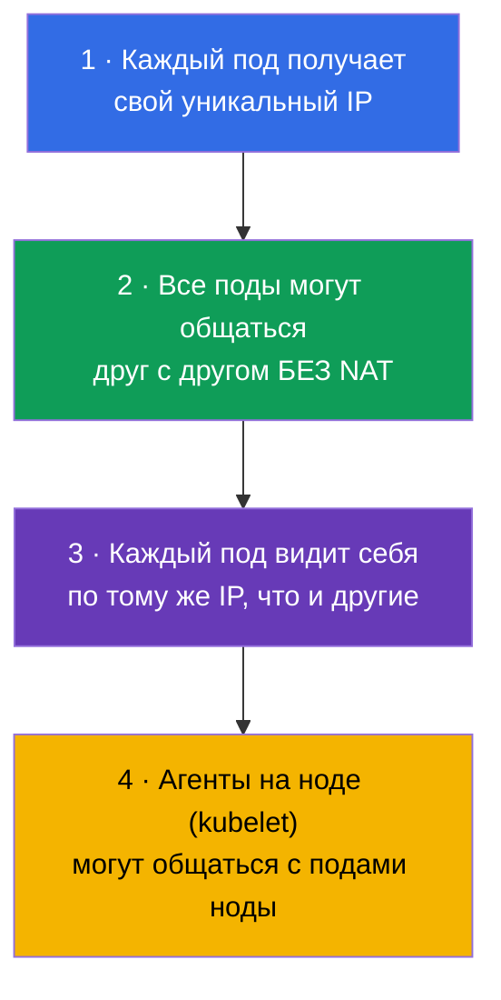
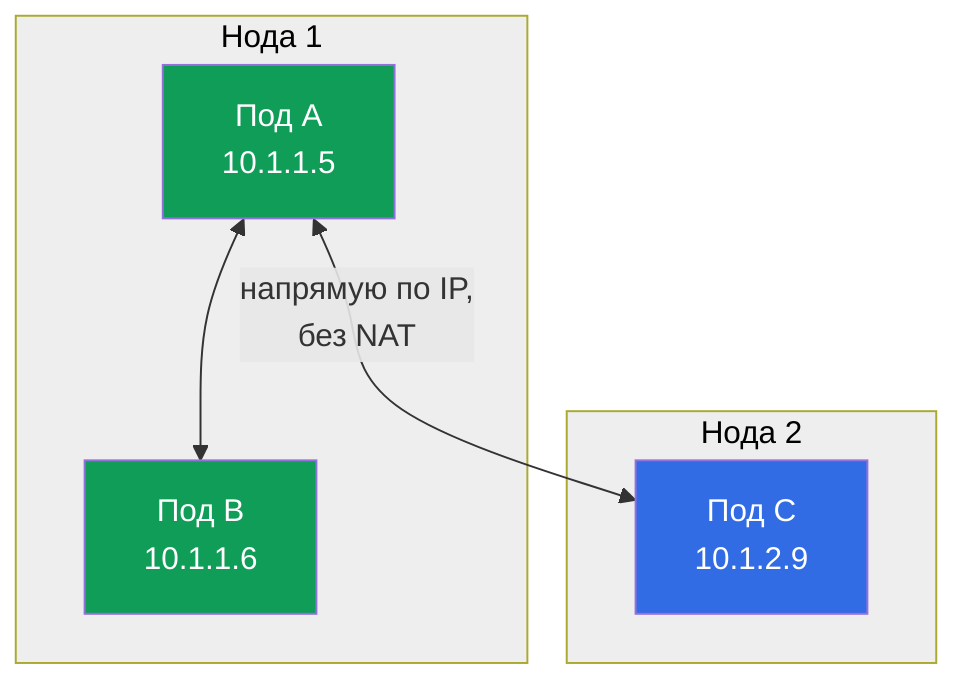
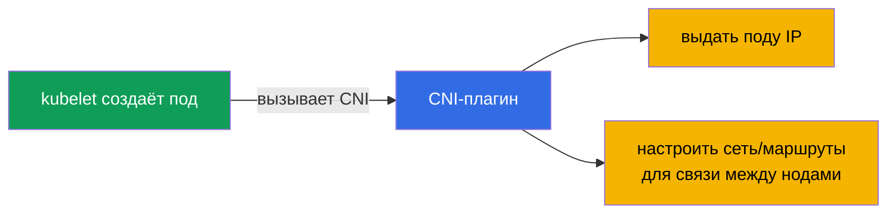
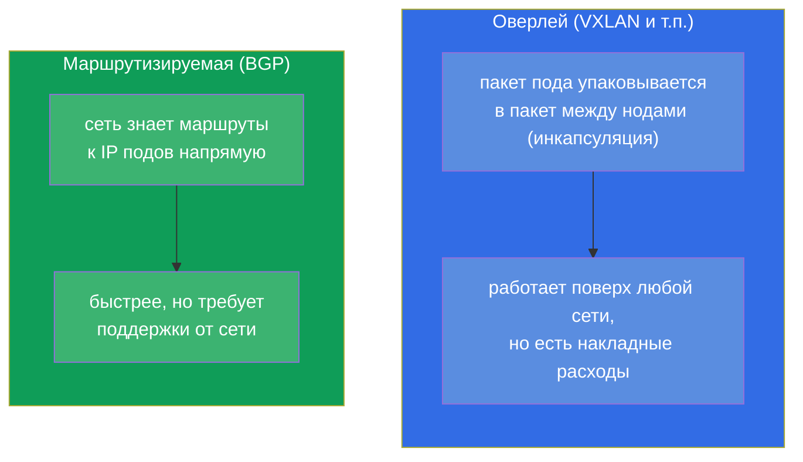
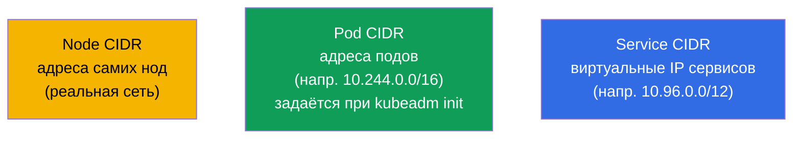
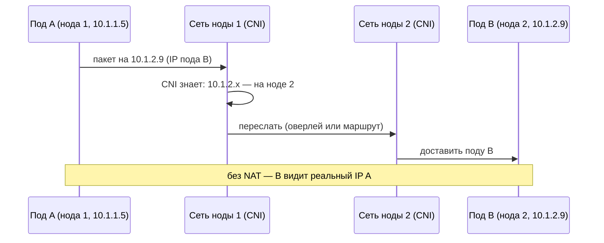
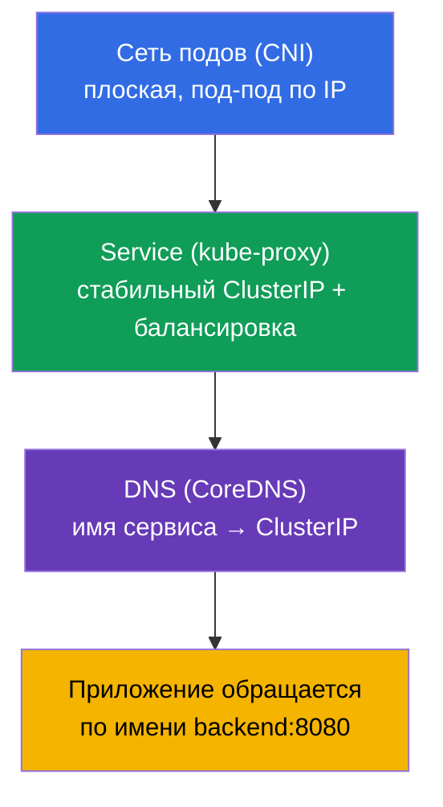

# Глава 30. Сетевая модель Kubernetes, сеть подов и CNI

> **Что дальше.** Начинаем часть 7 - сети. Мы уже пользовались Service и DNS (глава 7), но
> не разбирали, как вообще устроена сеть в кластере: как поды получают IP, как общаются
> между нодами, кто это обеспечивает. Это фундамент домена Services & Networking обоих
> экзаменов и, что важнее, - основа сетевого troubleshooting (глава 46). Разберём
> четыре правила сетевой модели Kubernetes, роль CNI и как всё складывается.

## 30.1. Четыре правила сетевой модели Kubernetes

Kubernetes не реализует сеть сам - он задаёт **требования (модель)**, которым должна
удовлетворять любая реализация. Модель проста и держится на четырёх правилах:

Главное следствие: **плоская сеть**. Любой под может обратиться к любому другому поду по
его IP напрямую, без NAT, независимо от того, на какой ноде они находятся. С точки зрения
подов вся сеть кластера - одно плоское пространство адресов.

## 30.2. Кто реализует модель: CNI

Раз Kubernetes только задаёт требования, кто-то должен их выполнить. Это делает
**CNI-плагин (Container Network Interface)** - плагин сети, который при создании пода
выдаёт ему IP и настраивает маршрутизацию, чтобы поды видели друг друга через ноды.

Популярные CNI-плагины (их надо знать по названиям):

| CNI | Особенность |
|-----|-------------|
| **Calico** | популярный, поддерживает NetworkPolicy, может без оверлея (BGP) |
| **Cilium** | на eBPF, высокая производительность, богатые политики, может заменять kube-proxy |
| **Flannel** | простой, оверлейная сеть (VXLAN), без развитых политик |
| **Weave Net** | простой, с шифрованием (менее актуален) |

Без установленного CNI ноды остаются `NotReady`, а поды - `Pending`/`ContainerCreating`:
сеть подов не настроена. Это частая причина «кластер не поднимается после kubeadm init»
(глава 35).

## 30.3. Оверлейные и маршрутизируемые сети (кратко)

CNI реализуют связь между нодами двумя основными подходами:

- **Оверлей** (Flannel VXLAN, Calico в режиме оверлея): пакеты подов инкапсулируются в
  пакеты между нодами. Работает поверх любой сети, но добавляет накладные расходы.
- **Маршрутизируемая** (Calico BGP, Cilium): сеть сама знает маршруты к подовым IP, без
  инкапсуляции - быстрее, но нужна поддержка со стороны сетевой инфраструктуры.

Для экзамена глубоко в это не углубляемся - достаточно понимать, что оба подхода
существуют и почему.

## 30.4. Диапазоны адресов: поды, сервисы, ноды

В кластере есть несколько независимых адресных пространств - их нельзя путать:

| Диапазон | Что адресует | Пример |
|----------|--------------|--------|
| **Node CIDR** | IP самих нод (реальная сеть/VPC) | 192.168.0.0/24 |
| **Pod CIDR** (`podSubnet`) | IP подов | 10.244.0.0/16 |
| **Service CIDR** (`serviceSubnet`) | виртуальные ClusterIP сервисов | 10.96.0.0/12 |

Pod CIDR задаётся при инициализации кластера (`kubeadm init --pod-network-cidr`, глава 35)
и должен согласовываться с конфигом CNI. Service CIDR - виртуальный: эти IP не
принадлежат никакому интерфейсу, за ними стоит kube-proxy (глава 7).

## 30.5. Как пакет доходит от пода до пода

Соберём модель воедино на примере запроса под-под между нодами:

Именно CNI обеспечивает шаги «CNI знает, где под» и «переслать между нодами». Приложению
это невидимо - оно просто обращается по IP, как в плоской сети.

## 30.6. Service и DNS поверх сети подов (связь с главой 7)

Сеть подов - фундамент, но обращаться по «сырым» IP подов нельзя (они меняются). Поверх
плоской сети работают уже знакомые слои:

Слои складываются: CNI даёт связность подов → kube-proxy даёт стабильные адреса сервисов
→ CoreDNS даёт имена. Приложение работает на верхнем уровне (по имени), а под ним -
разобранная здесь сеть подов. DNS/CoreDNS и Service подробно - в главе 31.

## 30.7. Как это применяют в продакшене

- **Выбор CNI - архитектурное решение.** В проде CNI выбирают по потребностям: нужны
  сетевые политики и производительность - Cilium (eBPF) или Calico; нужна простота -
  Flannel. В управляемых кластерах CNI часто предустановлен (VPC CNI в EKS, где поды
  получают реальные IP из VPC).
- **Планирование CIDR.** Pod/Service CIDR планируют заранее и согласуют с корпоративной
  сетью/VPC, чтобы не пересекались с другими сетями (иначе - конфликты маршрутизации).
  Слишком маленький Pod CIDR ограничивает число подов - частая ошибка при росте кластера.
- **eBPF и отказ от kube-proxy.** Современные кластеры всё чаще ставят Cilium в режиме
  замены kube-proxy: балансировка сервисов идёт через eBPF в ядре - быстрее и лучше
  масштабируется, чем iptables.
- **NetworkPolicy требует поддержки CNI.** Сетевые политики (глава 34) работают, только
  если CNI их поддерживает (Calico, Cilium - да; голый Flannel - нет). Это учитывают при
  выборе CNI, если нужна сегментация трафика.
- **Сетевые проблемы = частые инциденты.** «Под не видит другой под/сервис» в проде часто
  упирается в CNI (не установлен/сломан), конфликт CIDR или ноды NotReady из-за сети.
  Понимание модели - основа их разбора.

## 30.8. Мини-глоссарий

- **Сетевая модель Kubernetes** - требования к сети: свой IP у пода, связь без NAT,
  плоская сеть.
- **Плоская сеть** - любой под видит любой по IP напрямую, без NAT.
- **CNI (Container Network Interface)** - плагин, реализующий сеть подов (IP + маршруты).
- **Calico / Cilium / Flannel** - популярные CNI-плагины.
- **Оверлей** - сеть с инкапсуляцией пакетов между нодами (VXLAN).
- **Маршрутизируемая сеть** - сеть, знающая маршруты к подам напрямую (BGP).
- **Pod CIDR / Service CIDR** - диапазоны адресов подов / виртуальных IP сервисов.
- **eBPF** - технология в ядре Linux, на которой построен Cilium.

## 30.9. Итоги главы

- Kubernetes задаёт сетевую модель (свой IP у каждого пода, связь без NAT, плоская
  сеть), но не реализует её сам.
- Модель реализует CNI-плагин: выдаёт подам IP и настраивает связь между нодами; без CNI
  ноды NotReady, поды не стартуют.
- Популярные CNI: Calico, Cilium (eBPF), Flannel; различаются политиками,
  производительностью, сложностью.
- Связь между нодами - оверлей (инкапсуляция, VXLAN) или маршрутизация (BGP/eBPF).
- Три адресных пространства: Node CIDR (ноды), Pod CIDR (поды), Service CIDR (виртуальные
  IP сервисов) - не путать.
- Поверх плоской сети подов работают Service (kube-proxy, стабильные IP) и DNS (CoreDNS,
  имена) - глава 31.

## 30.10. Как это пригодится: на экзамене и в реальной работе

**На экзамене.** Прямых заданий «настрой CNI» немного, но понимание модели критично для
troubleshooting (30% CKA): «поды Pending / нода NotReady» часто = нет CNI; «под не видит
другой» = сетевая проблема. При установке кластера (глава 35) правильный `--pod-network-
cidr` и установка CNI - обязательный шаг.

**В реальной работе.** Выбор и настройка CNI - фундаментальное решение для кластера
(политики, производительность, интеграция с VPC). Планирование CIDR предотвращает
конфликты и нехватку адресов при росте. Понимание плоской сети и роли CNI - основа разбора
любых сетевых инцидентов.

## 30.11. Вопросы для самопроверки

1. Сформулируйте ключевые правила сетевой модели Kubernetes. Что такое «плоская сеть»?
2. Кто реализует сетевую модель и что делает CNI при создании пода?
3. Что произойдёт с нодами и подами, если CNI не установлен?
4. Чем оверлейная сеть отличается от маршрутизируемой?
5. Назовите три адресных пространства кластера и что каждое адресует.
6. Как складываются слои: сеть подов, Service, DNS?
7. Почему NetworkPolicy может не работать при некоторых CNI?

## Практика

Мы разобрали сеть подов - фундамент. В главе 31 поднимемся на уровень Service и DNS:
разберём CoreDNS и то, как имена превращаются в адреса. Сетевые темы отрабатываются в
лабах по сети и troubleshooting.

🧪 Лаба 123 (установка CNI с нуля + низкоуровневая сеть): [tasks/cka/labs/123](../../labs/123/README_RU.MD)

---
[Оглавление](../README_RU.md) · [Глава 29](../29/ru.md) · [Глава 31](../31/ru.md)
