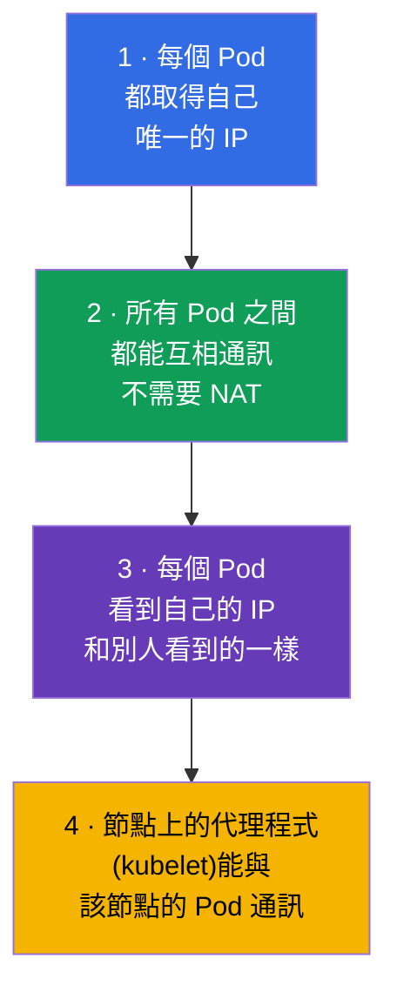
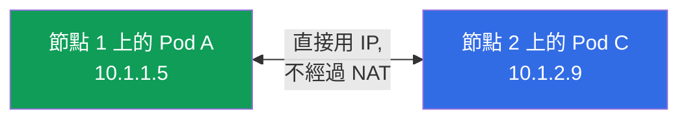
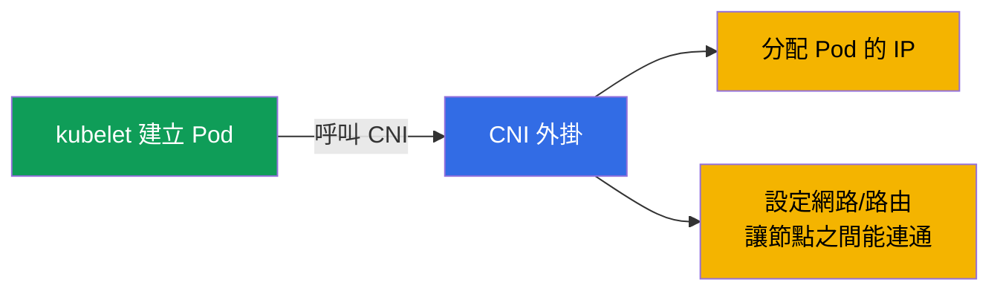
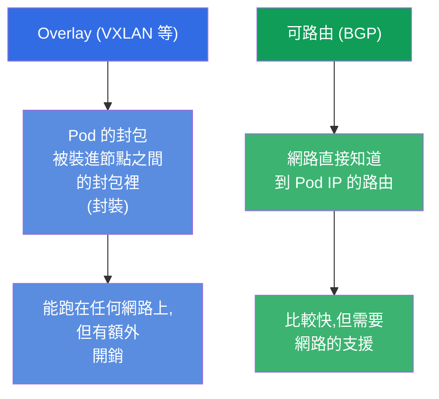
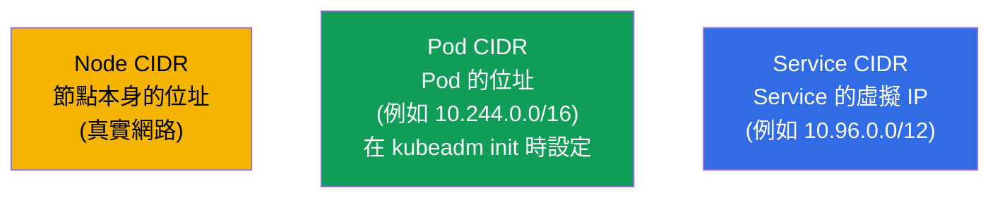
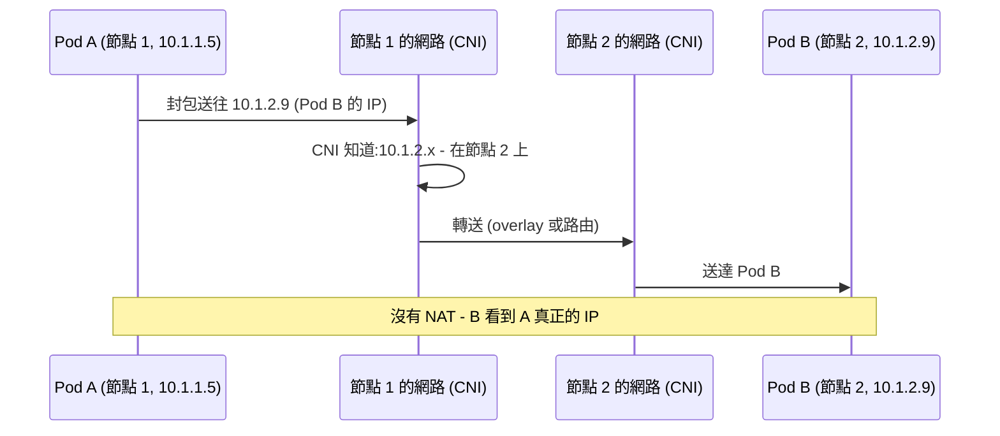
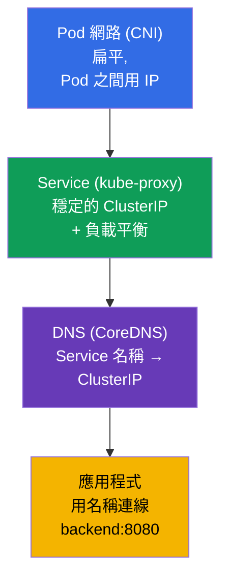

[Русская версия](ru.md) · [Eng version](README.md) · [Versión en español](es.md) · [Version française](fr.md) · [Deutsche Version](de.md) · [ქართული ვერსია](ge.md) · [日本語版](jp.md)

# 第 30 章。Kubernetes 網路模型、Pod 網路與 CNI

> **接下來是什麼。** 我們開始第 7 部分 - 網路。我們已經用過 Service 與 DNS(第 7 章),
> 但還沒討論叢集裡的網路到底是怎麼構成的:Pod 怎麼取得 IP、跨節點之間怎麼通訊、由誰
> 提供這些。這是兩個考試 Services & Networking 領域的基礎,而更重要的是 - 它是網路
> troubleshooting(第 46 章)的根基。我們會看 Kubernetes 網路模型的四條規則、CNI 的
> 角色,以及這一切怎麼組合起來。

## 30.1. Kubernetes 網路模型的四條規則

Kubernetes 自己不實作網路 - 它訂出任何實作都必須滿足的 **要求(模型)**。這個模型很
簡單,建立在四條規則上:

最主要的結論是:**扁平網路**。任何 Pod 都可以直接用 IP 連到任何其他 Pod,不經過 NAT,
而且不管它們在哪一個節點上。從 Pod 的角度看,整個叢集網路就是一片扁平的位址空間。

## 30.2. 誰來實作這個模型:CNI

既然 Kubernetes 只訂出要求,那就得有人來滿足它們。做這件事的是
**CNI 外掛 (Container Network Interface)** - 網路外掛,它在建立 Pod 時分配 IP 並設定
路由,讓 Pod 能跨節點看到彼此。

常見的 CNI 外掛(名字要知道):

| CNI | 特點 |
|-----|-------------|
| **Calico** | 很流行,支援 NetworkPolicy,可以不用 overlay(BGP) |
| **Cilium** | 基於 eBPF,效能高、政策功能豐富,可以取代 kube-proxy |
| **Flannel** | 簡單,overlay 網路(VXLAN),沒有進階政策 |
| **Weave Net** | 簡單,支援加密(現在比較少用) |
| **AWS VPC CNI** | Pod 取得 VPC 的真實 IP(透過 ENI),沒有 overlay;EKS 的預設 |
| **Azure CNI** | Pod 取得 VNet 網路的 IP,與 Azure 網路原生整合 |
| **GKE (Dataplane V2)** | Google 基於 Cilium/eBPF 的受管 CNI |

> **雲端(受管)CNI。** 在受管叢集(EKS、AKS、GKE)裡,供應商通常會裝自己的 CNI。最有
> 代表性的例子是 **AWS VPC CNI**(`amazon-vpc-cni-k8s`),EKS 預設就用它:它不做
> overlay,而是把 **VPC 子網路裡真正的 IP 位址** 分給 Pod,把這些位址掛到執行實例的網路
> 介面(ENI)上。好處是 - Pod 在 VPC 裡就像一台普通主機,不需要封裝就能運作(比較快),
> 而且直接跟 Security Groups、VPC 路由與 flow logs 相容。代價是:
>
> - **Pod 會消耗 VPC 的位址** - 叢集一大就真的可能撞上子網路 IP 不夠(CIDR 要事先
>   規劃);
> - **每個節點上的 Pod 密度** 受 ENI 數量與每個實例的 IP 數限制(取決於 EC2 機型);
>   prefix delegation 模式可以緩解這點,它會給 ENI 分配 /28 的區塊。
>
> 考試(CKA/CKS)不一定要知道這些,但在實際使用 EKS 時,CNI 的選擇與設定是最早要做的
> 架構決策之一。EKS 的 NetworkPolicy 有很長一段時間 VPC CNI 本身並不支援,所以人們常常
> 再加上 Calico,或是開啟內建的網路政策支援。

沒有安裝 CNI 的話,節點會一直是 `NotReady`,而 Pod 則是 `Pending`/`ContainerCreating`:
Pod 網路沒有設定好。這是「kubeadm init 之後叢集起不來」的常見原因(第 35 章)。

## 30.3. Overlay 與可路由網路(簡述)

CNI 主要用兩種方式實作節點之間的連通:

- **Overlay**(Flannel VXLAN、Calico 的 overlay 模式):Pod 的封包被封裝進節點之間的
  封包。能跑在任何網路上,但會增加額外開銷。
- **可路由**(Calico BGP、Cilium):網路本身就知道到 Pod IP 的路由,不做封裝 - 比較快,
  但需要網路基礎架構的支援。

考試不用深入這部分 - 知道兩種方式都存在、以及為什麼存在就夠了。

## 30.4. 位址範圍:Pod、Service、節點

叢集裡有幾個互相獨立的位址空間 - 不能混在一起:

| 範圍 | 用來定址什麼 | 例子 |
|----------|--------------|-------|
| **Node CIDR** | 節點本身的 IP(真實網路/VPC) | 192.168.0.0/24 |
| **Pod CIDR**(`podSubnet`) | Pod 的 IP | 10.244.0.0/16 |
| **Service CIDR**(`serviceSubnet`) | Service 的虛擬 ClusterIP | 10.96.0.0/12 |

Pod CIDR 在初始化叢集時設定(`kubeadm init --pod-network-cidr`,第 35 章),而且必須跟
CNI 的設定一致。Service CIDR 是虛擬的:這些 IP 不屬於任何介面,背後是 kube-proxy
(第 7 章)。

## 30.5. 封包怎麼從一個 Pod 送到另一個 Pod

用跨節點的 Pod 對 Pod 請求把整個模型組起來看:

「CNI 知道 Pod 在哪裡」與「在節點之間轉送」這兩步,正是由 CNI 提供的。對應用程式來說
這是看不見的 - 它只是照著 IP 去連,就像在一片扁平網路裡一樣。

## 30.6. Service 與 DNS 建立在 Pod 網路之上(與第 7 章的關聯)

Pod 網路是地基,但不能直接用 Pod 的「原始」IP 去連(它們會變)。在扁平網路之上,是我們
已經熟悉的那些層:

這些層層疊起來:CNI 提供 Pod 的連通性 → kube-proxy 提供穩定的 Service 位址 →
CoreDNS 提供名稱。應用程式工作在最上層(用名稱),而它底下就是這裡講的 Pod 網路。
DNS/CoreDNS 與 Service 的細節 - 在第 31 章。

## 30.7. 這在生產環境中如何應用

- **選 CNI 是架構決策。** 生產環境按需求選 CNI:需要網路政策與效能 - Cilium(eBPF)
  或 Calico;需要簡單 - Flannel。在受管叢集裡 CNI 常常已經預先裝好(EKS 的 VPC CNI,
  Pod 會取得 VPC 的真實 IP)。
- **CIDR 規劃。** Pod/Service CIDR 要事先規劃,並跟企業網路/VPC 對齊,避免跟其他網路
  重疊(否則會有路由衝突)。Pod CIDR 開太小會限制 Pod 數量 - 叢集成長時常見的錯誤。
- **eBPF 與拋棄 kube-proxy。** 現代叢集越來越常把 Cilium 裝在取代 kube-proxy 的模式:
  Service 的負載平衡走核心裡的 eBPF - 比 iptables 更快、擴展性更好。
- **NetworkPolicy 需要 CNI 支援。** 網路政策(第 34 章)只有在 CNI 支援時才有效
  (Calico、Cilium - 有;純 Flannel - 沒有)。如果需要流量分段,選 CNI 時就要考慮這點。
- **網路問題 = 常見事故。** 生產環境裡「Pod 看不到另一個 Pod/Service」常常就是卡在 CNI
  (沒裝好/壞了)、CIDR 衝突,或節點因為網路而 NotReady。理解這個模型是排查它們的基礎。

## 30.8. 小詞彙表

- **Kubernetes 網路模型** - 對網路的要求:Pod 有自己的 IP、通訊不經過 NAT、扁平網路。
- **扁平網路** - 任何 Pod 都能直接用 IP 看到任何 Pod,不經過 NAT。
- **CNI (Container Network Interface)** - 實作 Pod 網路的外掛(IP + 路由)。
- **Calico / Cilium / Flannel** - 常見的 CNI 外掛。
- **Overlay** - 節點之間帶封包封裝的網路(VXLAN)。
- **可路由網路** - 直接知道到 Pod 路由的網路(BGP)。
- **Pod CIDR / Service CIDR** - Pod 的位址範圍 / Service 虛擬 IP 的位址範圍。
- **eBPF** - Linux 核心裡的技術,Cilium 建立在它之上。

## 30.9. 本章總結

- Kubernetes 訂出網路模型(每個 Pod 有自己的 IP、通訊不經過 NAT、扁平網路),但自己不
  實作它。
- 實作這個模型的是 CNI 外掛:它分配 Pod 的 IP 並設定節點之間的連通;沒有 CNI,節點會
  NotReady,Pod 起不來。
- 常見的 CNI:Calico、Cilium(eBPF)、Flannel;差別在政策、效能與複雜度。
- 節點之間的連通 - overlay(封裝、VXLAN)或路由(BGP/eBPF)。
- 三個位址空間:Node CIDR(節點)、Pod CIDR(Pod)、Service CIDR(Service 的虛擬
  IP)- 不要搞混。
- 在扁平的 Pod 網路之上跑的是 Service(kube-proxy,穩定的 IP)與 DNS(CoreDNS,
  名稱)- 第 31 章。

## 30.10. 這些知識用在哪:考試與實際工作

**在考試上。** 直接考「設定 CNI」的題目不多,但理解這個模型對 troubleshooting(CKA 的
30%)很關鍵:「Pod Pending / 節點 NotReady」常常就是沒有 CNI;「Pod 看不到另一個」就是
網路問題。安裝叢集時(第 35 章),正確的 `--pod-network-cidr` 與安裝 CNI 是必要步驟。

**在實際工作中。** 選擇與設定 CNI 是叢集的根本決策(政策、效能、與 VPC 的整合)。
CIDR 的規劃能避免衝突,以及叢集成長時位址不夠用。理解扁平網路與 CNI 的角色,是排查任何
網路事故的基礎。

## 30.11. 自我檢查問題

1. 說出 Kubernetes 網路模型的關鍵規則。什麼是「扁平網路」?
2. 誰實作網路模型,CNI 在建立 Pod 時做什麼?
3. 如果沒有安裝 CNI,節點與 Pod 會發生什麼事?
4. Overlay 網路跟可路由網路差在哪裡?
5. 說出叢集的三個位址空間,以及每個各自定址什麼。
6. Pod 網路、Service、DNS 這些層是怎麼疊起來的?
7. 為什麼某些 CNI 下 NetworkPolicy 可能沒有作用?

## 實踐

我們講完了 Pod 網路 - 地基。第 31 章會往上走到 Service 與 DNS 這一層:看 CoreDNS,以及
名稱怎麼變成位址。網路主題會在網路與 troubleshooting 的實驗裡練習。

🧪 實驗 123(從零安裝 CNI + 低階網路):[tasks/cka/labs/123](../../labs/123/README_TW.MD)

---
[目錄](../README_TW.md) · [第 29 章](../29/tw.md) · [第 31 章](../31/tw.md)
