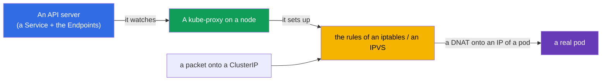
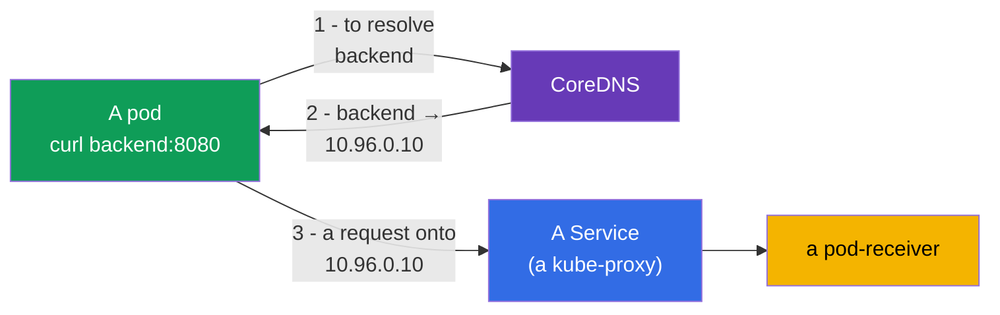
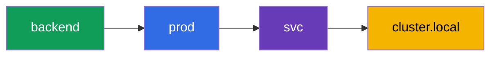
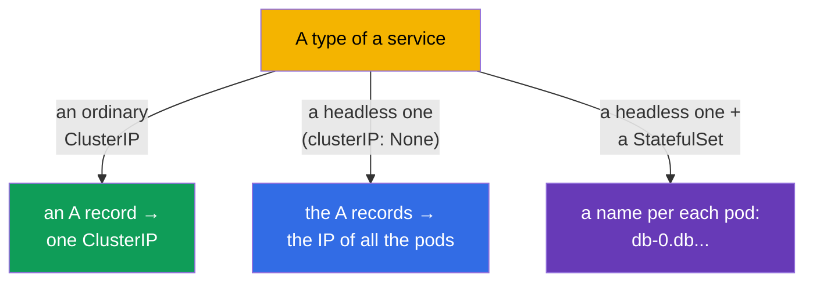
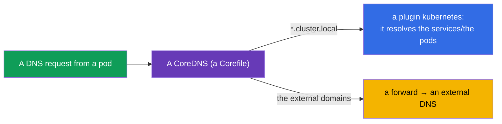
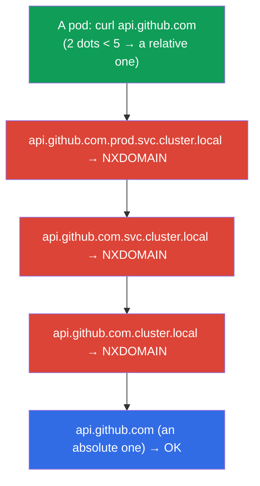
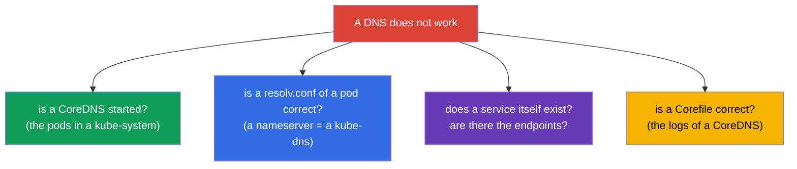

[Русская версия](ru.md) · [Versión en español](es.md) · [Version française](fr.md) · [Deutsche Version](de.md) · [ქართული ვერსია](ge.md) · [繁體中文版](tw.md) · [日本語版](jp.md)

# Chapter 31. A Service from the inside, a DNS and a CoreDNS

> **What comes next.** In the chapter 7 we found out, what a Service is and its types. In the chapter 30 we considered
> a network of the pods. Now let us look deeper: how a kube-proxy actually implements a Service
> (iptables/IPVS) and how a DNS in a cluster works through a **CoreDNS** - from a name of a service up to an
> IP. This is the domain Services & Networking of the both exams and a frequent theme of a troubleshooting
> (the chapter 46): "a DNS does not resolve" and "a service does not answer" are the classical incidents.

## 31.1. How a kube-proxy implements a Service

Let us recall from the chapter 7: a ClusterIP is a virtual one, it does not belong to any interface. For a
turning of the appeals to this IP into the real pods there answers a **kube-proxy** on each node.
It watches over the services and the Endpoints and it sets up the rules of a kernel.



A kube-proxy works in one of the modes:

| A mode | How it works | A scalability |
|-------|--------------|------------------|
| **iptables** (by default) | the chains of the rules of an iptables, a DNAT onto a random pod | it is worse upon the thousands of the services (a linear search) |
| **IPVS** | a kernel balancer L4, the hash tables | it is better on the big clusters, there are more algorithms |
| **eBPF** (a Cilium, without a kube-proxy) | a balancing in a kernel through an eBPF | the highest one |

A key thing: a balancing here is **L4** (by the connections), a kube-proxy does not understand an HTTP. For an
L7 routing an Ingress (the chapter 32) or a Gateway API (the chapter 33) is needed.

> **A kube-proxy does not let a traffic through itself.** It is important to repeat this (see also the chapter 2):
> a kube-proxy is a "control plane" for the rules of the services on a node, and not a "data plane". It only
> **sets up the rules of a kernel** (iptables/IPVS), and a packet itself from a client to a pod goes
> **directly through a kernel**, bypassing a process of a kube-proxy. On a diagram above this is seen: an arrow
> `a packet → the rules → a pod` does not pass through a node of a kube-proxy.
>
> From here there is a practical consequence: **a restart or an update of a kube-proxy does not interrupt a
> traffic.** While a process is being restarted, the rules already set up in a kernel remain on a place
> and they continue to serve the existing and the new connections. Temporarily only an **update** of the rules
> "freezes" - the new Service/Endpoints will not appear and the deleted ones will not be removed, until
> a kube-proxy rises again. Therefore an upgrade of a kube-proxy (a DaemonSet) is a regular
> operation without a downtime for a traffic of the services.

> **A balancing happens on a node-sender.** When a pod turns to a service by a
> ClusterIP, a choice of a concrete backend pod (a DNAT) is made by the rules of a kernel **on the same node,
> where a pod-sender is started** - because a kube-proxy has set up the identical rules on
> each node. That is, a decision "into which of the pods of a service this connection will go"
> is taken locally, still before a packet has left a node. After a substitution of an address a packet
> goes **directly** by a network of the pods to a chosen backend - either on the same node, or on
> another one, without an intermediate "proxy hop".
>
> The practical consequences:
>
> - there is no single point, through which a whole traffic of a service passes, - a balancing
>   is distributed by the nodes-sources, therefore it is scaled well;
> - a choice of a backend goes **on a level of a connection** (L4): all the packets of one TCP connection
>   will get into one and the same pod, and a new connection can go away into another one;
> - by default (`externalTrafficPolicy`/`internalTrafficPolicy: Cluster`) a pod-receiver
>   can turn out to be on any node; this is normal thanks to a flat network of the pods (the chapter 30).

## 31.2. What for a DNS in a cluster is needed

To turn to the services by a ClusterIP is inconvenient and fragile (an IP can change upon a
recreation of a service). Therefore each Service has a stable **DNS name**, and it is
resolved by a built-in DNS server of a cluster - a **CoreDNS**.



A CoreDNS is a Deployment in a `kube-system` (we saw it on a map of the components, the chapter 2),
in front of which there stands a Service `kube-dns`. A kubelet writes this DNS server to the pods into
`/etc/resolv.conf`, therefore any DNS requests of a pod go into a CoreDNS.

## 31.3. A format of the DNS names of the services

A full DNS name of a service (FQDN) is built by a strict template - one has to know it:

```
<service>.<namespace>.svc.<cluster-domain>
backend.prod.svc.cluster.local
```



In a practice a full name is written rarely - a shortening works depending on that, from where we
turn:

| From where we turn | How to turn |
|-------------------|----------------|
| the same namespace | `backend` |
| another namespace | `backend.prod` |
| from anywhere (FQDN) | `backend.prod.svc.cluster.local` |

This works thanks to the `search` domains in a `/etc/resolv.conf` of a pod: a short name
is completed up to a full one automatically.

## 31.4. A DNS for the pods and for the headless services

The records are made not only for the services:

- An **ordinary Service** → an A record onto a ClusterIP (one name → one virtual IP).
- A **headless service** (`clusterIP: None`, the chapter 7) → the A records onto the **IP of all the pods** (a name
  → a list of the real IP). This way a client sees the separate pods.
- A **pod of a StatefulSet** through a headless service → a stable name of each pod:
  `<pod>.<service>.<namespace>.svc.cluster.local` (for example,
  `db-0.db.default.svc.cluster.local`, the chapter 11).



## 31.5. A setting up of a CoreDNS: a Corefile

A CoreDNS is configured through a **Corefile**, which lies in a ConfigMap `coredns` in a
`kube-system`. A typical Corefile:

```
.:53 {
    errors
    health
    kubernetes cluster.local in-addr.arpa ip6.arpa {   # it serves a domain of a cluster
       pods insecure
       fallthrough in-addr.arpa ip6.arpa
    }
    forward . /etc/resolv.conf      # the external domains - to an upstream DNS
    cache 30
    loop
    reload
}
```



The changes into a cluster DNS (for example, to add a forwarding of a certain domain onto a
corporate DNS) are made by an editing of this ConfigMap:

```bash
kubectl get configmap coredns -n kube-system -o yaml
kubectl edit configmap coredns -n kube-system
kubectl rollout restart deployment coredns -n kube-system   # to apply
```

## 31.6. A dnsPolicy of a pod

How a pod gets the DNS settings is set by a `dnsPolicy`:

| dnsPolicy | A behaviour |
|-----------|-----------|
| `ClusterFirst` (by default) | the cluster names → a CoreDNS, the external ones → an upstream DNS |
| `Default` | it inherits a DNS of a node (it does not use a CoreDNS for the cluster names) |
| `None` | a fully custom DNS through a `dnsConfig` |
| `ClusterFirstWithHostNet` | as a ClusterFirst, but for the pods with a hostNetwork |

Almost always a `ClusterFirst` works - a pod resolves both the intra-cluster names (through a
CoreDNS), and the external ones (through a forward). To change a `dnsPolicy` is needed rarely.

## 31.7. An ndots:5 and the search domains: a hidden reason of a slow DNS

We saw (31.3), that the short names are completed through the `search` domains. This is managed by
an option **`ndots`** in a `/etc/resolv.conf` of a pod. A kubelet writes such a file to the pods:

```text
nameserver 10.96.0.10
search prod.svc.cluster.local svc.cluster.local cluster.local
options ndots:5
```

**What an `ndots:5` means.** If in a requested name there are **less than 5 dots**, a resolver at first
considers a name a relative one and by a turn it substitutes each search domain; only when all the
attempts have returned an NXDOMAIN, it tries a name as an absolute one (as it is).

For the cluster names this is convenient: a `backend` (0 dots) is quickly completed up to a
`backend.prod.svc.cluster.local`. But for the **external** names this is expensive.



An `api.github.com` has 2 dots (< 5), therefore at first there go away **three useless requests** with
the search suffixes and only a fourth one is a real one. And since a resolver usually asks both an
A, and an AAAA (IPv4 and IPv6), a number of the requests **doubles** - up to 8 instead of 2. On a loaded
service with the thousands of the outgoing appeals this is a noticeable delay and a superfluous load onto a CoreDNS.

**How this is fixed:**

| A method | How | When |
|-------|-----|-------|
| **An FQDN with a dot at the end** | `api.github.com.` (a trailing dot = an absolute name) | a quick fix in a code/a config of an application |
| **A name with ≥ 5 dots** | it already does not pass through a search | it is natural for the long FQDN |
| **To lower an `ndots` for a pod** | `dnsConfig.options: ndots=1..2` | an application goes mainly into the external domains |
| **A NodeLocal DNSCache** | a local cache on a node (31.9) | it lowers a price of the misses on a whole cluster |

A lowering of an `ndots` on a level of a pod is set through a `dnsConfig` (it works with any `dnsPolicy`):

```yaml
apiVersion: v1
kind: Pod
metadata:
  name: web
spec:
  dnsConfig:
    options:
    - name: ndots
      value: "2"                   # less superfluous attempts for the external names
  containers:
  - name: web
    image: nginx
```

> **A compromise.** A too small `ndots` (for example, 1) speeds up the external requests, but it
> breaks the appeals to the services from **another** namespace by a short `backend.prod` (2
> dots are already considered an absolute name and a search will not be substituted). Therefore usually one takes
> `2`, or one leaves a default `5` and fixes the problematic external names by an FQDN with a dot at the end.

To check the settings of a pod:

```bash
kubectl exec <pod> -- cat /etc/resolv.conf       # the search domains and the options ndots
```

## 31.8. A debugging of a DNS

"A DNS does not resolve" is a frequent incident. An order of a check:

```bash
# To check a resolving from the inside of a pod
kubectl exec -it <pod> -- nslookup backend
kubectl exec -it <pod> -- nslookup backend.prod.svc.cluster.local

# To check a /etc/resolv.conf of a pod (which DNS, which search domains)
kubectl exec <pod> -- cat /etc/resolv.conf

# Is a CoreDNS alive
kubectl get pods -n kube-system -l k8s-app=kube-dns
kubectl logs -n kube-system -l k8s-app=kube-dns

# Is there a service itself and its endpoints (the chapter 7)
kubectl get svc backend
kubectl get endpoints backend
```



A typical trap: a name is resolved, but an `nslookup` returns an empty thing → there is a service, but the
Endpoints are empty (a selector did not match / the pods are not ready, the chapter 7). That is, a problem is not in a DNS,
but in a link of a service with the pods.

## 31.9. How this is applied in the production

- **A CoreDNS is a critical component.** A connectivity of all the services depends on it. Its fall
  or an overload (many requests, a narrow limit) is a serious incident: the applications stop
  finding each other. Therefore a CoreDNS is monitored and it is given a reserve of the resources, often
  it is scaled by a number of the nodes.
- **A DNS cache and a performance.** On the big clusters one puts a **NodeLocal DNSCache**
  (a DaemonSet with a local DNS cache on each node), in order to lower a load onto a CoreDNS and
  the delays of a resolving - a frequent optimization.
- **An IPVS for the big clusters.** Upon the thousands of the services an iptables mode of a kube-proxy
  slows down (a linear search of the rules); in a prod one passes over onto an IPVS or onto a Cilium (eBPF).
- **A custom forwarding of the domains.** Through a Corefile one sets up a forward of the corporate
  domains onto an internal DNS, the stub domains, a split-horizon - so that the pods would resolve also the external
  corporate names.
- **The DNS problems are a top of the reasons of the incidents.** An "application does not see a dependency" very often
  turns out to be a DNS (an overloaded CoreDNS, an incorrect resolv.conf, the empty Endpoints).
  An understanding of a chain a name→a CoreDNS→a Service→the Endpoints saves the hours of an analysis.

## 31.10. A mini glossary

- **A kube-proxy** - it implements a Service on a node through an iptables/an IPVS (a balancing L4).
- **The iptables / IPVS modes** - the ways of an implementation of the services; an IPVS is scaled better.
- **A CoreDNS** - a DNS server of a cluster (a Deployment in a kube-system behind a Service kube-dns).
- **An FQDN of a service** - `<service>.<namespace>.svc.cluster.local`.
- **The search domains** - the suffixes in a resolv.conf, completing the short names.
- **An ndots** - a threshold of the dots in a name: less than it a name is at first tried with the search suffixes
  (by default `ndots:5`, from here there are the superfluous requests for the external names).
- **A dnsConfig** - a pinpoint setting up of a DNS of a pod (incl. the `options ndots`), it works upon any dnsPolicy.
- **A Corefile** - a configuration of a CoreDNS (in a ConfigMap `coredns`).
- **A dnsPolicy** - how a pod gets a DNS (a ClusterFirst and the others).
- **A NodeLocal DNSCache** - a local DNS cache on each node.

## 31.11. The summary of the chapter

- A kube-proxy implements a Service on each node through an iptables (by default) or an IPVS
  (it is better for the big clusters); a balancing is L4, without an understanding of an HTTP.
- The DNS names of the services are resolved by a CoreDNS - a Deployment in a kube-system behind a Service kube-dns;
  to the pods it is written in a resolv.conf.
- An FQDN: `<service>.<namespace>.svc.cluster.local`; from the same namespace a
  short name is enough (thanks to the search domains).
- The records are made for the services (an A onto a ClusterIP), a headless one (an A onto the IP of all the pods) and the pods
  of a StatefulSet (a stable name of each one).
- A CoreDNS is set up through a Corefile (a ConfigMap `coredns`): a plugin kubernetes for a
  domain of a cluster, a forward for the external ones.
- An `ndots:5` in a resolv.conf of a pod makes the external names (few dots) at first search through the
  search domains - the superfluous NXDOMAIN requests and the delays; one fixes it by an FQDN with a dot at the end,
  a `dnsConfig` with a smaller `ndots` or a NodeLocal DNSCache.
- A debugging of a DNS: an nslookup from the inside, a resolv.conf, a liveness of a CoreDNS, a presence of a service and of the
  Endpoints (an empty Endpoints ≠ a problem of a DNS).

## 31.12. How this will come in handy: on the exam and in the real work

**On the exam.** "Set up/fix a CoreDNS", "why does a pod not resolve a service", "turn to a
service from another namespace" are the typical tasks. One needs to know a format of an FQDN, where a
Corefile lies, and to be able to debug through an nslookup/a resolv.conf/the endpoints. This is a core of a network
troubleshooting (30% of the CKA).

**In the real work.** A CoreDNS is a critical component for a connectivity; an understanding of its
configuration and of a debugging directly influences an analysis of the incidents "a service is not found". A choice
of a mode of a kube-proxy (IPVS/eBPF) and a NodeLocal DNSCache are the optimizations for the big clusters.
A DNS is one of the most frequent reasons of the network problems in a prod.

## 31.13. Self-check questions

1. How does a kube-proxy turn an appeal to a ClusterIP into a traffic to a pod? On which level does it
   balance?
2. By what is an IPVS mode better than an iptables and when is this important?
3. What is a CoreDNS, where does it work and how do the pods find out about it?
4. Write down an FQDN of a service `web` in a namespace `shop`. How to turn to it from the same
   namespace?
5. By what do the DNS records of a headless service differ from an ordinary one?
6. Where and how is a CoreDNS set up? How to apply the changes?
7. What does an `ndots:5` in a resolv.conf of a pod mean and why because of it are the external names resolved
   more slowly? How to fix this?
8. How to debug "a pod does not resolve a service" and why is an empty Endpoints not a problem of a
   DNS?

## Practice

We have considered the internals of the services and of a DNS. In the chapter 32 we will rise onto an L7 - an Ingress and
the Ingress controllers, giving a routing by the hosts and the paths. A CoreDNS and a kube-proxy
are drilled in the labs on a network and a troubleshooting.

🧪 Lab 125 (a DNS and a CoreDNS: the A records, a headless one, an ndots/a dnsConfig, a Corefile): [tasks/cka/labs/125](../../labs/125/README.MD)

🧪 Lab 118 (incl. a fixing of a CoreDNS): [tasks/cka/labs/118](../../labs/118/README.MD)

🎮 Killercoda (in a browser, no setup): [Test DNS Resolution](https://killercoda.com/chadmcrowell/course/ckad/dns-resolution) · [Modify Cluster DNS](https://killercoda.com/chadmcrowell/course/cka/modify-cluster-dns) · [Resolve Service IP from Pod](https://killercoda.com/chadmcrowell/course/cka/communicate-with-svc) · [Create a Headless Service](https://killercoda.com/chadmcrowell/course/ckad/headless-service)

---
[Contents](../README.md) · [Chapter 30](../30/README.md) · [Chapter 32](../32/README.md)
