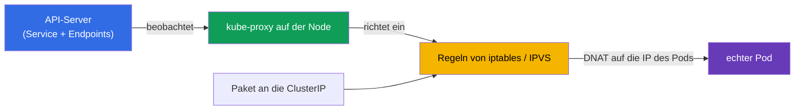
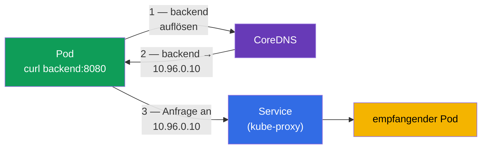
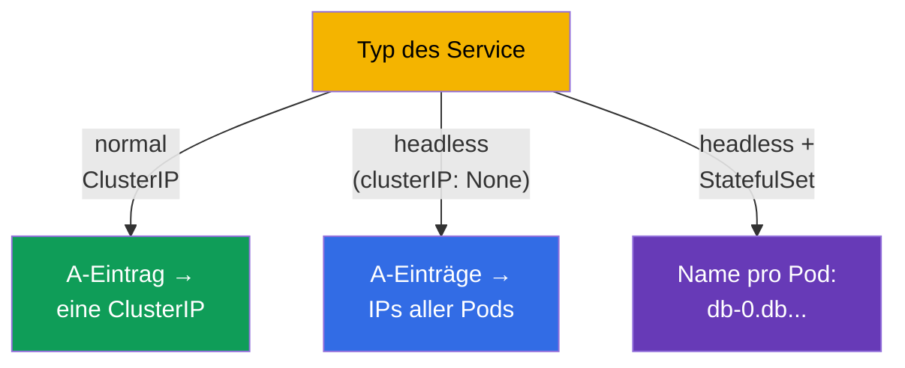
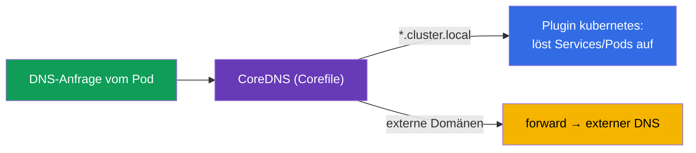
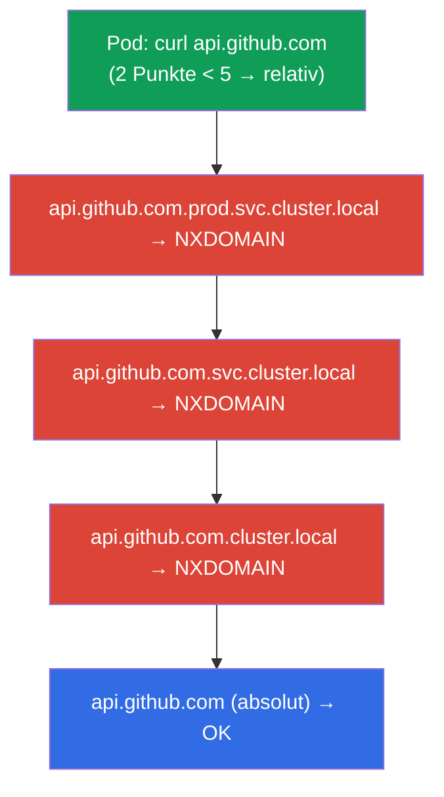
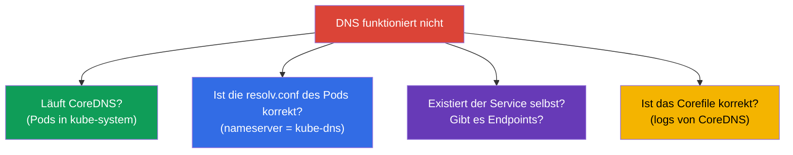

[Русская версия](ru.md) · [Eng version](README.md) · [Versión en español](es.md) · [Version française](fr.md) · [ქართული ვერსია](ge.md) · [繁體中文版](tw.md) · [日本語版](jp.md)

# Kapitel 31. Service von innen, DNS und CoreDNS

> **Was kommt.** In Kapitel 7 haben wir erfahren, was ein Service ist und welche Typen es
> gibt. In Kapitel 30 haben wir das Pod-Netz behandelt. Jetzt schauen wir tiefer: wie
> kube-proxy den Service tatsächlich umsetzt (iptables/IPVS) und wie DNS im Cluster über
> **CoreDNS** funktioniert - vom Namen des Service bis zur IP. Das ist die Domäne Services &
> Networking beider Prüfungen und ein häufiges Thema beim Troubleshooting (Kapitel 46): „DNS
> löst nicht auf“ und „der Service antwortet nicht“ sind klassische Incidents.

## 31.1. Wie kube-proxy den Service umsetzt

Erinnern wir uns an Kapitel 7: ClusterIP ist virtuell, sie gehört keiner Schnittstelle. Für
die Umwandlung von Anfragen an diese IP in echte Pods ist **kube-proxy** auf jeder Node
zuständig. Es beobachtet Services und Endpoints und richtet die Regeln im Kernel ein.



kube-proxy arbeitet in einem von mehreren Modi:

| Modus | Wie es arbeitet | Skalierbarkeit |
|-------|--------------|------------------|
| **iptables** (Standard) | Regelketten von iptables, DNAT auf einen zufälligen Pod | schlechter bei tausenden Services (linearer Durchlauf) |
| **IPVS** | Lastverteiler im Kernel auf L4, Hash-Tabellen | besser bei großen Clustern, mehr Algorithmen |
| **eBPF** (Cilium, ohne kube-proxy) | Lastverteilung im Kernel über eBPF | die höchste |

Der Kernpunkt: die Lastverteilung ist hier **L4** (nach Verbindungen), kube-proxy versteht
kein HTTP. Für Routing auf L7 braucht man Ingress (Kapitel 32) oder Gateway API (Kapitel 33).

> **kube-proxy leitet den Traffic nicht durch sich selbst.** Das ist wichtig zu wiederholen
> (siehe auch Kapitel 2): kube-proxy ist die „Control Plane“ für die Regeln der Services auf
> der Node, nicht die „Data Plane“. Es **richtet nur die Regeln im Kernel ein**
> (iptables/IPVS), das Paket selbst geht vom Client zum Pod aber **direkt durch den Kernel**,
> am Prozess kube-proxy vorbei. Im Diagramm oben ist das zu sehen: der Pfeil
> `Paket → Regeln → Pod` läuft nicht durch den Knoten kube-proxy.
>
> Daraus folgt praktisch: **ein Neustart oder Update von kube-proxy unterbricht den Traffic
> nicht.** Während der Prozess neu startet, bleiben die im Kernel bereits eingerichteten
> Regeln an ihrem Platz und bedienen bestehende und neue Verbindungen weiter. Vorübergehend
> „erstarrt“ nur die **Aktualisierung** der Regeln - neue Service/Endpoints erscheinen nicht
> und gelöschte werden nicht entfernt, solange kube-proxy nicht wieder läuft. Deshalb ist das
> Upgrade von kube-proxy (DaemonSet) eine reguläre Operation ohne Downtime für den Traffic der
> Services.

> **Die Lastverteilung passiert auf der sendenden Node.** Wenn ein Pod einen Service über die
> ClusterIP anspricht, treffen die Auswahl des konkreten Backend-Pods (DNAT) die Regeln im
> Kernel **auf derselben Node, auf der der sendende Pod läuft** - weil kube-proxy auf jeder
> Node dieselben Regeln eingerichtet hat. Die Entscheidung „in welchen Pod des Service diese
> Verbindung geht“ wird also lokal getroffen, noch bevor das Paket die Node verlassen hat.
> Nach dem Austausch der Adresse geht das Paket **direkt** über das Pod-Netz zum gewählten
> Backend - sei es auf derselben Node oder auf einer anderen, ohne zwischengeschalteten
> „Proxy-Hop“.
>
> Praktische Folgen:
>
> - es gibt keinen einzelnen Punkt, durch den der gesamte Traffic des Service läuft - die
>   Lastverteilung ist über die Quell-Nodes verteilt und skaliert deshalb gut;
> - die Auswahl des Backends erfolgt **auf Ebene der Verbindung** (L4): alle Pakete einer
>   TCP-Verbindung landen in einem und demselben Pod, eine neue Verbindung kann aber in einen
>   anderen gehen;
> - standardmäßig (`externalTrafficPolicy`/`internalTrafficPolicy: Cluster`) kann der
>   empfangende Pod auf einer beliebigen Node liegen; das ist normal dank des flachen
>   Pod-Netzes (Kapitel 30).

## 31.2. Warum man DNS im Cluster braucht

Services über die ClusterIP anzusprechen ist unbequem und fragil (die IP kann sich beim
Neuanlegen des Service ändern). Deshalb hat jeder Service einen stabilen **DNS-Namen**, und
aufgelöst wird er vom eingebauten DNS-Server des Clusters - **CoreDNS**.



CoreDNS ist ein Deployment in `kube-system` (wir haben es in der Karte der Komponenten
gesehen, Kapitel 2), vor dem der Service `kube-dns` steht. kubelet schreibt den Pods diesen
DNS-Server in die `/etc/resolv.conf`, deshalb gehen alle DNS-Anfragen eines Pods an CoreDNS.

## 31.3. Format der DNS-Namen von Services

Der vollständige DNS-Name eines Service (FQDN) wird nach einem strikten Muster gebildet - das
muss man kennen:

```
<service>.<namespace>.svc.<cluster-domain>
backend.prod.svc.cluster.local
```


In der Praxis schreibt man den vollen Namen selten - es funktioniert eine Kurzform, je nachdem,
woher man zugreift:

| Woher wir zugreifen | Wie ansprechen |
|-------------------|----------------|
| dasselbe Namespace | `backend` |
| ein anderes Namespace | `backend.prod` |
| von überall (FQDN) | `backend.prod.svc.cluster.local` |

Das funktioniert dank der `search`-Domänen in der `/etc/resolv.conf` des Pods: der kurze Name
wird automatisch zum vollen ergänzt.

## 31.4. DNS für Pods und Headless-Services

Einträge werden nicht nur für Services angelegt:

- **Normaler Service** → A-Eintrag auf die ClusterIP (ein Name → eine virtuelle IP).
- **Headless-Service** (`clusterIP: None`, Kapitel 7) → A-Einträge auf die **IPs aller Pods**
  (Name → Liste echter IPs). So sieht der Client die einzelnen Pods.
- **Pod eines StatefulSet** über einen Headless-Service → stabiler Name für jeden Pod:
  `<pod>.<service>.<namespace>.svc.cluster.local` (zum Beispiel
  `db-0.db.default.svc.cluster.local`, Kapitel 11).



## 31.5. Konfiguration von CoreDNS: Corefile

CoreDNS wird über das **Corefile** konfiguriert, das in der ConfigMap `coredns` in
`kube-system` liegt. Ein typisches Corefile:

```
.:53 {
    errors
    health
    kubernetes cluster.local in-addr.arpa ip6.arpa {   # bedient die Domäne des Clusters
       pods insecure
       fallthrough in-addr.arpa ip6.arpa
    }
    forward . /etc/resolv.conf      # externe Domänen — an den vorgelagerten DNS
    cache 30
    loop
    reload
}
```



Änderungen am Cluster-DNS (zum Beispiel die Weiterleitung einer bestimmten Domäne an den
Unternehmens-DNS hinzufügen) nimmt man durch Bearbeiten dieser ConfigMap vor:

```bash
kubectl get configmap coredns -n kube-system -o yaml
kubectl edit configmap coredns -n kube-system
kubectl rollout restart deployment coredns -n kube-system   # anwenden
```

## 31.6. dnsPolicy des Pods

Wie ein Pod seine DNS-Einstellungen erhält, legt `dnsPolicy` fest:

| dnsPolicy | Verhalten |
|-----------|-----------|
| `ClusterFirst` (Standard) | Cluster-Namen → CoreDNS, externe → vorgelagerter DNS |
| `Default` | erbt den DNS der Node (nutzt CoreDNS nicht für Cluster-Namen) |
| `None` | vollständig eigener DNS über `dnsConfig` |
| `ClusterFirstWithHostNet` | wie ClusterFirst, aber für Pods mit hostNetwork |

Fast immer passt `ClusterFirst` - der Pod löst sowohl clusterinterne Namen (über CoreDNS) als
auch externe (über forward) auf. `dnsPolicy` muss man selten ändern.

## 31.7. ndots:5 und search-Domänen: die versteckte Ursache für langsames DNS

Wir haben gesehen (31.3), dass kurze Namen über die `search`-Domänen ergänzt werden. Gesteuert
wird das von der Option **`ndots`** in der `/etc/resolv.conf` des Pods. kubelet schreibt den
Pods eine solche Datei:

```text
nameserver 10.96.0.10
search prod.svc.cluster.local svc.cluster.local cluster.local
options ndots:5
```

**Was `ndots:5` bedeutet.** Wenn der angefragte Name **weniger als 5 Punkte** hat, betrachtet
der Resolver den Namen zuerst als relativ und setzt der Reihe nach jede search-Domäne ein; erst
wenn alle Versuche NXDOMAIN zurückgegeben haben, probiert er den Namen als absoluten (so wie er
ist).

Für Cluster-Namen ist das bequem: `backend` (0 Punkte) wird schnell zu
`backend.prod.svc.cluster.local` ergänzt. Für **externe** Namen ist das aber teuer.



`api.github.com` hat 2 Punkte (< 5), deshalb gehen zuerst **drei nutzlose Anfragen** mit den
search-Suffixen hinaus und erst die vierte ist die echte. Und da der Resolver üblicherweise
sowohl A als auch AAAA fragt (IPv4 und IPv6), **verdoppelt** sich die Zahl der Anfragen - auf 8
statt 2. Bei einem belasteten Service mit tausenden ausgehenden Anfragen ist das eine merkbare
Verzögerung und zusätzliche Last für CoreDNS.

**Wie man es behebt:**

| Ansatz | Wie | Wann |
|-------|-----|------|
| **FQDN mit Punkt am Ende** | `api.github.com.` (abschließender Punkt = absoluter Name) | schneller Fix im Code/in der Konfiguration der Anwendung |
| **Name mit ≥ 5 Punkten** | läuft schon nicht mehr über search | natürlich bei langen FQDN |
| **`ndots` für den Pod senken** | `dnsConfig.options: ndots=1..2` | die Anwendung geht überwiegend in externe Domänen |
| **NodeLocal DNSCache** | lokaler Cache auf der Node (31.9) | senkt den Preis der Fehlversuche im gesamten Cluster |

Das Senken von `ndots` auf Ebene des Pods gibt man über `dnsConfig` an (funktioniert mit jeder
`dnsPolicy`):

```yaml
apiVersion: v1
kind: Pod
metadata:
  name: web
spec:
  dnsConfig:
    options:
    - name: ndots
      value: "2"                   # weniger unnötige Versuche für externe Namen
  containers:
  - name: web
    image: nginx
```

> **Kompromiss.** Ein zu kleines `ndots` (zum Beispiel 1) beschleunigt externe Anfragen, bricht
> aber den Zugriff auf Services aus einem **anderen** Namespace über das kurze `backend.prod`
> (2 Punkte gelten dann schon als absoluter Name und search wird nicht eingesetzt). Deshalb
> nimmt man üblicherweise `2` oder lässt den Standard `5` und korrigiert die problematischen
> externen Namen als FQDN mit Punkt am Ende.

Die Einstellungen des Pods prüfen:

```bash
kubectl exec <pod> -- cat /etc/resolv.conf       # search-Domänen und options ndots
```

## 31.8. Debugging von DNS

„DNS löst nicht auf“ ist ein häufiger Incident. Reihenfolge der Prüfung:

```bash
# Auflösung von innerhalb des Pods prüfen
kubectl exec -it <pod> -- nslookup backend
kubectl exec -it <pod> -- nslookup backend.prod.svc.cluster.local

# /etc/resolv.conf des Pods prüfen (welcher DNS, welche search-Domänen)
kubectl exec <pod> -- cat /etc/resolv.conf

# Lebt CoreDNS
kubectl get pods -n kube-system -l k8s-app=kube-dns
kubectl logs -n kube-system -l k8s-app=kube-dns

# Gibt es den Service selbst und seine Endpoints (Kapitel 7)
kubectl get svc backend
kubectl get endpoints backend
```



Eine typische Falle: der Name löst auf, aber `nslookup` gibt nichts zurück → der Service
existiert, die Endpoints sind aber leer (der Selektor passt nicht / die Pods sind nicht ready,
Kapitel 7). Das Problem liegt also nicht im DNS, sondern in der Verbindung des Service mit den
Pods.

## 31.9. Wie man das in der Produktion anwendet

- **CoreDNS ist eine kritische Komponente.** Von ihm hängt die Konnektivität aller Services ab.
  Sein Ausfall oder seine Überlast (viele Anfragen, enges Limit) ist ein schwerwiegender
  Incident: die Anwendungen finden einander nicht mehr. Deshalb überwacht man CoreDNS und gibt
  ihm Reserven an Ressourcen, oft skaliert man ihn nach der Zahl der Nodes.
- **DNS-Cache und Performance.** In großen Clustern setzt man **NodeLocal DNSCache** ein (ein
  DaemonSet mit lokalem DNS-Cache auf jeder Node), um die Last auf CoreDNS und die Latenzen der
  Auflösung zu senken - eine häufige Optimierung.
- **IPVS für große Cluster.** Bei tausenden Services wird der iptables-Modus von kube-proxy
  langsamer (linearer Durchlauf der Regeln); in der Produktion geht man auf IPVS oder auf Cilium
  (eBPF) über.
- **Eigene Weiterleitung von Domänen.** Über das Corefile richtet man forward von
  Unternehmensdomänen an den internen DNS ein, Stub-Domänen, Split-Horizon - damit die Pods auch
  externe Unternehmensnamen auflösen.
- **DNS-Probleme sind unter den Top-Ursachen von Incidents.** „Die Anwendung sieht ihre
  Abhängigkeit nicht“ entpuppt sich sehr oft als DNS (überlasteter CoreDNS, falsche resolv.conf,
  leere Endpoints). Das Verständnis der Kette Name→CoreDNS→Service→Endpoints spart Stunden der
  Analyse.

## 31.10. Mini-Glossar

- **kube-proxy** - setzt den Service auf der Node über iptables/IPVS um (Lastverteilung auf L4).
- **Modi iptables / IPVS** - Wege der Umsetzung von Services; IPVS skaliert besser.
- **CoreDNS** - DNS-Server des Clusters (Deployment in kube-system hinter dem Service kube-dns).
- **FQDN eines Service** - `<service>.<namespace>.svc.cluster.local`.
- **search-Domänen** - Suffixe in der resolv.conf, die kurze Namen ergänzen.
- **ndots** - Schwelle an Punkten im Namen: darunter wird der Name zuerst mit den
  search-Suffixen probiert (standardmäßig `ndots:5`, daher die unnötigen Anfragen für externe
  Namen).
- **dnsConfig** - punktuelle Einstellung des DNS eines Pods (u. a. `options ndots`), funktioniert bei jeder dnsPolicy.
- **Corefile** - Konfiguration von CoreDNS (in der ConfigMap `coredns`).
- **dnsPolicy** - wie ein Pod seinen DNS erhält (ClusterFirst u. a.).
- **NodeLocal DNSCache** - lokaler DNS-Cache auf jeder Node.

## 31.11. Zusammenfassung des Kapitels

- kube-proxy setzt den Service auf jeder Node über iptables (Standard) oder IPVS um (besser für
  große Cluster); Lastverteilung auf L4, ohne Verständnis von HTTP.
- Die DNS-Namen der Services löst CoreDNS auf - ein Deployment in kube-system hinter dem Service
  kube-dns; den Pods ist er in der resolv.conf eingetragen.
- FQDN: `<service>.<namespace>.svc.cluster.local`; aus demselben Namespace genügt der kurze Name
  (dank der search-Domänen).
- Einträge werden angelegt für Services (A auf die ClusterIP), headless (A auf die IPs aller
  Pods) und Pods eines StatefulSet (stabiler Name für jeden).
- CoreDNS wird über das Corefile konfiguriert (ConfigMap `coredns`): das Plugin kubernetes für
  die Domäne des Clusters, forward für externe.
- `ndots:5` in der resolv.conf des Pods zwingt externe Namen (wenige Punkte), zuerst die
  search-Domänen durchzuprobieren - unnötige NXDOMAIN-Anfragen und Verzögerungen; man behebt es
  mit FQDN mit Punkt am Ende, `dnsConfig` mit kleinerem `ndots` oder NodeLocal DNSCache.
- Debugging von DNS: nslookup von innen, resolv.conf, Lebendigkeit von CoreDNS, Existenz des
  Service und der Endpoints (leere Endpoints ≠ Problem des DNS).

## 31.12. Wofür das nützlich ist: in der Prüfung und in der echten Arbeit

**In der Prüfung.** „Richte CoreDNS ein/repariere es“, „warum löst der Pod den Service nicht
auf“, „sprich einen Service aus einem anderen Namespace an“ sind typische Aufgaben. Man muss das
Format des FQDN kennen, wissen, wo das Corefile liegt, und über nslookup/resolv.conf/endpoints
debuggen können. Das ist der Kern des Netzwerk-Troubleshootings (30 % CKA).

**In der echten Arbeit.** CoreDNS ist eine für die Konnektivität kritische Komponente; das
Verständnis seiner Konfiguration und seines Debuggings wirkt direkt auf die Analyse von
Incidents „der Service wird nicht gefunden“. Die Wahl des Modus von kube-proxy (IPVS/eBPF) und
NodeLocal DNSCache sind Optimierungen für große Cluster. DNS ist eine der häufigsten Ursachen
für Netzwerkprobleme in der Produktion.

## 31.13. Fragen zur Selbstüberprüfung

1. Wie verwandelt kube-proxy eine Anfrage an die ClusterIP in Traffic zum Pod? Auf welcher Ebene
   verteilt es die Last?
2. Wodurch ist der Modus IPVS besser als iptables und wann ist das wichtig?
3. Was ist CoreDNS, wo läuft er und wie erfahren die Pods von ihm?
4. Schreiben Sie den FQDN des Service `web` im Namespace `shop` auf. Wie spricht man ihn aus
   demselben Namespace an?
5. Wodurch unterscheiden sich die DNS-Einträge eines Headless-Service von einem normalen?
6. Wo und wie wird CoreDNS konfiguriert? Wie wendet man die Änderungen an?
7. Was bedeutet `ndots:5` in der resolv.conf des Pods und warum werden externe Namen dadurch
   langsamer aufgelöst? Wie behebt man das?
8. Wie debuggt man „der Pod löst den Service nicht auf“ und warum sind leere Endpoints kein
   Problem des DNS?

## Praxis

Wir haben die Innereien der Services und des DNS behandelt. In Kapitel 32 steigen wir auf L7 -
Ingress und Ingress-Controller, die Routing nach Hosts und Pfaden geben. CoreDNS und kube-proxy
werden in den Labs zu Netz und Troubleshooting geübt.

🧪 Lab 125 (DNS und CoreDNS: A-Einträge, headless, ndots/dnsConfig, Corefile): [tasks/cka/labs/125](../../labs/125/README_DE.MD)

🧪 Lab 118 (u. a. Reparatur von CoreDNS): [tasks/cka/labs/118](../../labs/118/README_DE.MD)

---
[Inhalt](../README_DE.md) · [Kapitel 30](../30/de.md) · [Kapitel 32](../32/de.md)
