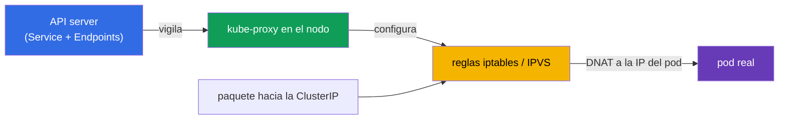
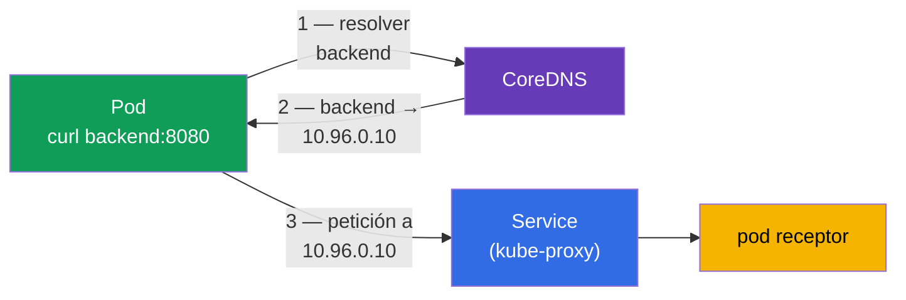
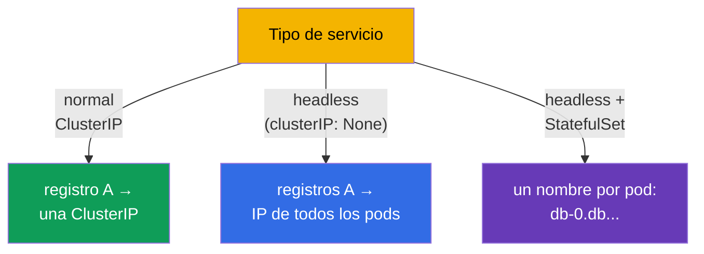
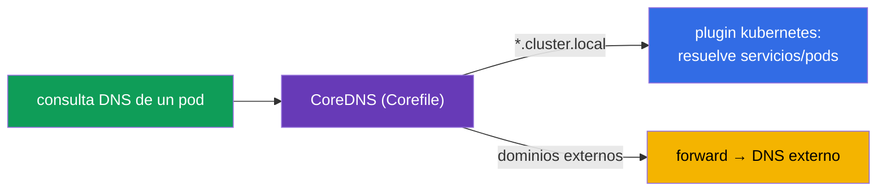
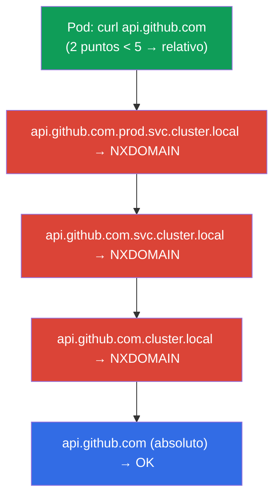
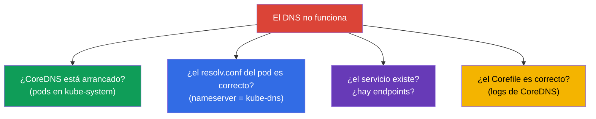

[Русская версия](ru.md) · [Eng version](README.md) · [Version française](fr.md) · [Deutsche Version](de.md) · [ქართული ვერსია](ge.md)

# Capítulo 31. Service por dentro, DNS y CoreDNS

> **Qué viene ahora.** En el capítulo 7 vimos qué es un Service y sus tipos. En el capítulo 30
> repasamos la red de pods. Ahora miraremos más adentro: cómo implementa realmente kube-proxy el
> Service (iptables/IPVS) y cómo funciona el DNS del clúster mediante **CoreDNS** - del nombre
> del servicio a la IP. Es el dominio Services & Networking de ambos exámenes y un tema
> frecuente de troubleshooting (capítulo 46): «el DNS no resuelve» y «el servicio no responde»
> son incidentes clásicos.

## 31.1. Cómo implementa kube-proxy el Service

Recordemos del capítulo 7: la ClusterIP es virtual, no pertenece a ninguna interfaz. De convertir
las peticiones a esa IP en pods reales se encarga **kube-proxy** en cada nodo. Vigila los
servicios y los Endpoints y configura las reglas del kernel.



kube-proxy funciona en uno de estos modos:

| Modo | Cómo funciona | Escalabilidad |
|-------|--------------|------------------|
| **iptables** (por defecto) | cadenas de reglas iptables, DNAT a un pod aleatorio | peor con miles de servicios (recorrido lineal) |
| **IPVS** | balanceador L4 del kernel, tablas hash | mejor en clústeres grandes, más algoritmos |
| **eBPF** (Cilium, sin kube-proxy) | balanceo en el kernel mediante eBPF | la más alta |

Lo clave: aquí el balanceo es **L4** (por conexiones), kube-proxy no entiende HTTP. Para el
enrutado L7 hace falta Ingress (capítulo 32) o Gateway API (capítulo 33).

> **kube-proxy no hace pasar el tráfico por sí mismo.** Conviene repetirlo (véase también el
> capítulo 2): kube-proxy es el «control plane» de las reglas de los servicios en el nodo, no el
> «data plane». Solo **configura las reglas del kernel** (iptables/IPVS), mientras que el paquete
> del cliente al pod va **directamente por el kernel**, sin pasar por el proceso kube-proxy. En el
> diagrama anterior se ve: la flecha `paquete → reglas → pod` no pasa por el nodo kube-proxy.
>
> De ahí una consecuencia práctica: **reiniciar o actualizar kube-proxy no interrumpe el
> tráfico.** Mientras el proceso se reinicia, las reglas ya configuradas en el kernel siguen en su
> sitio y continúan sirviendo las conexiones existentes y las nuevas. Lo único que se «congela»
> temporalmente es la **actualización** de las reglas - los nuevos Service/Endpoints no
> aparecerán y los eliminados no se quitarán hasta que kube-proxy vuelva a levantarse. Por eso
> actualizar kube-proxy (DaemonSet) es una operación rutinaria sin downtime para el tráfico de los
> servicios.

> **El balanceo ocurre en el nodo emisor.** Cuando un pod se dirige a un servicio por su
> ClusterIP, la elección del pod backend concreto (DNAT) la hacen las reglas del kernel **en el
> mismo nodo donde corre el pod emisor** - porque kube-proxy configuró reglas idénticas en cada
> nodo. Es decir, la decisión de «a qué pod del servicio irá esta conexión» se toma localmente,
> antes incluso de que el paquete abandone el nodo. Tras la sustitución de la dirección, el
> paquete va **directamente** por la red de pods al backend elegido - esté en ese mismo nodo o en
> otro, sin un «salto de proxy» intermedio.
>
> Consecuencias prácticas:
>
> - no hay un punto único por el que pase todo el tráfico del servicio - el balanceo está
>   distribuido entre los nodos de origen, por eso escala bien;
> - la elección del backend se hace **a nivel de conexión** (L4): todos los paquetes de una misma
>   conexión TCP caerán en el mismo pod, mientras que una conexión nueva puede ir a otro;
> - por defecto (`externalTrafficPolicy`/`internalTrafficPolicy: Cluster`) el pod receptor puede
>   estar en cualquier nodo; es normal gracias a la red plana de pods (capítulo 30).

## 31.2. Para qué hace falta DNS en el clúster

Dirigirse a los servicios por ClusterIP es incómodo y frágil (la IP puede cambiar al recrear el
servicio). Por eso cada Service tiene un **nombre DNS** estable, y lo resuelve el servidor DNS
integrado del clúster: **CoreDNS**.



CoreDNS es un Deployment en `kube-system` (lo vimos en el mapa de componentes, capítulo 2), con
el Service `kube-dns` por delante. kubelet escribe ese servidor DNS en el `/etc/resolv.conf` de
los pods, por eso cualquier consulta DNS de un pod va a CoreDNS.

## 31.3. Formato de los nombres DNS de los servicios

El nombre DNS completo de un servicio (FQDN) se construye con una plantilla estricta - hay que
conocerla:

```
<service>.<namespace>.svc.<cluster-domain>
backend.prod.svc.cluster.local
```


En la práctica el nombre completo se escribe pocas veces - funciona la forma abreviada según
desde dónde nos dirijamos:

| Desde dónde nos dirigimos | Cómo dirigirse |
|-------------------|----------------|
| el mismo namespace | `backend` |
| otro namespace | `backend.prod` |
| desde cualquier sitio (FQDN) | `backend.prod.svc.cluster.local` |

Esto funciona gracias a los dominios `search` del `/etc/resolv.conf` del pod: el nombre corto se
completa hasta el nombre completo automáticamente.

## 31.4. DNS para pods y servicios headless

No solo se crean registros para los servicios:

- **Service normal** → registro A a la ClusterIP (un nombre → una IP virtual).
- **Servicio headless** (`clusterIP: None`, capítulo 7) → registros A a las **IP de todos los
  pods** (nombre → lista de IP reales). Así el cliente ve los pods individuales.
- **Pod de un StatefulSet** mediante un servicio headless → un nombre estable para cada pod:
  `<pod>.<service>.<namespace>.svc.cluster.local` (por ejemplo,
  `db-0.db.default.svc.cluster.local`, capítulo 11).



## 31.5. Configurar CoreDNS: el Corefile

CoreDNS se configura mediante el **Corefile**, que está en el ConfigMap `coredns` del namespace
`kube-system`. Un Corefile típico:

```
.:53 {
    errors
    health
    kubernetes cluster.local in-addr.arpa ip6.arpa {   # sirve el dominio del clúster
       pods insecure
       fallthrough in-addr.arpa ip6.arpa
    }
    forward . /etc/resolv.conf      # dominios externos — al DNS superior
    cache 30
    loop
    reload
}
```



Los cambios en el DNS del clúster (por ejemplo, añadir el reenvío de un dominio concreto al DNS
corporativo) se hacen editando ese ConfigMap:

```bash
kubectl get configmap coredns -n kube-system -o yaml
kubectl edit configmap coredns -n kube-system
kubectl rollout restart deployment coredns -n kube-system   # aplicar
```

## 31.6. El dnsPolicy del pod

Cómo recibe el pod la configuración DNS lo define `dnsPolicy`:

| dnsPolicy | Comportamiento |
|-----------|-----------|
| `ClusterFirst` (por defecto) | nombres del clúster → CoreDNS, externos → DNS superior |
| `Default` | hereda el DNS del nodo (no usa CoreDNS para los nombres del clúster) |
| `None` | DNS totalmente personalizado mediante `dnsConfig` |
| `ClusterFirstWithHostNet` | como ClusterFirst, pero para pods con hostNetwork |

Casi siempre sirve `ClusterFirst` - el pod resuelve tanto los nombres internos del clúster
(mediante CoreDNS) como los externos (mediante forward). Cambiar `dnsPolicy` hace falta pocas
veces.

## 31.7. ndots:5 y los dominios search: la causa oculta de un DNS lento

Ya vimos (31.3) que los nombres cortos se completan mediante los dominios `search`. Eso lo
gobierna la opción **`ndots`** del `/etc/resolv.conf` del pod. kubelet escribe a los pods un
fichero así:

```text
nameserver 10.96.0.10
search prod.svc.cluster.local svc.cluster.local cluster.local
options ndots:5
```

**Qué significa `ndots:5`.** Si el nombre consultado tiene **menos de 5 puntos**, el resolver
primero considera el nombre relativo y va sustituyendo cada dominio search por turno; solo cuando
todos los intentos han devuelto NXDOMAIN prueba el nombre como absoluto (tal cual).

Para los nombres del clúster resulta cómodo: `backend` (0 puntos) se completa rápido hasta
`backend.prod.svc.cluster.local`. Pero para los nombres **externos** sale caro.



`api.github.com` tiene 2 puntos (< 5), por eso primero salen **tres consultas inútiles** con los
sufijos search y solo la cuarta es la de verdad. Y como el resolver normalmente pregunta tanto A
como AAAA (IPv4 e IPv6), el número de consultas **se duplica** - hasta 8 en lugar de 2. En un
servicio cargado con miles de peticiones salientes eso supone una latencia apreciable y una carga
extra sobre CoreDNS.

**Cómo se arregla:**

| Técnica | Cómo | Cuándo |
|-------|-----|-------|
| **FQDN con punto final** | `api.github.com.` (el punto final = nombre absoluto) | arreglo rápido en el código/configuración de la aplicación |
| **Nombre con ≥ 5 puntos** | ya no pasa por search | natural para FQDN largos |
| **Bajar `ndots` para el pod** | `dnsConfig.options: ndots=1..2` | la aplicación va sobre todo a dominios externos |
| **NodeLocal DNSCache** | caché local en el nodo (31.9) | reduce el coste de los fallos en todo el clúster |

Bajar `ndots` a nivel de pod se hace mediante `dnsConfig` (funciona con cualquier `dnsPolicy`):

```yaml
apiVersion: v1
kind: Pod
metadata:
  name: web
spec:
  dnsConfig:
    options:
    - name: ndots
      value: "2"                   # menos intentos inútiles para nombres externos
  containers:
  - name: web
    image: nginx
```

> **Compromiso.** Un `ndots` demasiado pequeño (por ejemplo, 1) acelera las consultas externas,
> pero rompe las llamadas a servicios de **otro** namespace por el nombre corto `backend.prod` (2
> puntos ya se consideran nombre absoluto y search no se aplicará). Por eso normalmente se toma
> `2`, o se deja el valor por defecto `5` y se corrigen los nombres externos problemáticos con
> FQDN con punto final.

Comprobar la configuración del pod:

```bash
kubectl exec <pod> -- cat /etc/resolv.conf       # dominios search y options ndots
```

## 31.8. Depuración de DNS

«El DNS no resuelve» es un incidente frecuente. Orden de comprobación:

```bash
# Comprobar la resolución desde dentro del pod
kubectl exec -it <pod> -- nslookup backend
kubectl exec -it <pod> -- nslookup backend.prod.svc.cluster.local

# Comprobar el /etc/resolv.conf del pod (qué DNS, qué dominios search)
kubectl exec <pod> -- cat /etc/resolv.conf

# ¿Está vivo CoreDNS?
kubectl get pods -n kube-system -l k8s-app=kube-dns
kubectl logs -n kube-system -l k8s-app=kube-dns

# ¿Existe el servicio y tiene endpoints? (capítulo 7)
kubectl get svc backend
kubectl get endpoints backend
```



Una trampa típica: el nombre resuelve, pero `nslookup` devuelve vacío → el servicio existe, pero
los Endpoints están vacíos (el selector no coincide / los pods no están listos, capítulo 7). Es
decir, el problema no está en el DNS, sino en el enlace entre el servicio y los pods.

## 31.9. Cómo se aplica esto en producción

- **CoreDNS es un componente crítico.** De él depende la conectividad de todos los servicios. Su
  caída o sobrecarga (muchas consultas, límites estrechos) es un incidente serio: las aplicaciones
  dejan de encontrarse entre sí. Por eso CoreDNS se monitoriza y se le da holgura de recursos, y a
  menudo se escala según el número de nodos.
- **Caché DNS y rendimiento.** En clústeres grandes se instala **NodeLocal DNSCache** (un
  DaemonSet con caché DNS local en cada nodo) para reducir la carga sobre CoreDNS y las latencias
  de resolución - es una optimización habitual.
- **IPVS para clústeres grandes.** Con miles de servicios el modo iptables de kube-proxy se
  ralentiza (recorrido lineal de reglas); en producción se pasa a IPVS o a Cilium (eBPF).
- **Reenvío de dominios personalizado.** Mediante el Corefile se configura el forward de dominios
  corporativos al DNS interno, dominios stub, split-horizon - para que los pods resuelvan también
  los nombres corporativos externos.
- **Los problemas de DNS están entre las causas top de incidentes.** «La aplicación no ve su
  dependencia» resulta ser muy a menudo DNS (CoreDNS sobrecargado, resolv.conf incorrecto,
  Endpoints vacíos). Entender la cadena nombre→CoreDNS→Service→Endpoints ahorra horas de análisis.

## 31.10. Mini-glosario

- **kube-proxy** - implementa el Service en el nodo mediante iptables/IPVS (balanceo L4).
- **modos iptables / IPVS** - formas de implementar los servicios; IPVS escala mejor.
- **CoreDNS** - el servidor DNS del clúster (Deployment en kube-system detrás del Service kube-dns).
- **FQDN del servicio** - `<service>.<namespace>.svc.cluster.local`.
- **dominios search** - sufijos del resolv.conf que completan los nombres cortos.
- **ndots** - umbral de puntos en el nombre: por debajo de él el nombre se prueba primero con los
  sufijos search (por defecto `ndots:5`, de ahí las consultas de más para los nombres externos).
- **dnsConfig** - ajuste puntual del DNS del pod (incluidas las `options ndots`), funciona con cualquier dnsPolicy.
- **Corefile** - la configuración de CoreDNS (en el ConfigMap `coredns`).
- **dnsPolicy** - cómo recibe el pod el DNS (ClusterFirst y otros).
- **NodeLocal DNSCache** - caché DNS local en cada nodo.

## 31.11. Resumen del capítulo

- kube-proxy implementa el Service en cada nodo mediante iptables (por defecto) o IPVS (mejor para
  clústeres grandes); balanceo L4, sin entender HTTP.
- Los nombres DNS de los servicios los resuelve CoreDNS - un Deployment en kube-system detrás del
  Service kube-dns; a los pods se les escribe en el resolv.conf.
- FQDN: `<service>.<namespace>.svc.cluster.local`; desde el mismo namespace basta el nombre corto
  (gracias a los dominios search).
- Se crean registros para los servicios (A a la ClusterIP), los headless (A a las IP de todos los
  pods) y los pods de StatefulSet (un nombre estable para cada uno).
- CoreDNS se configura mediante el Corefile (ConfigMap `coredns`): el plugin kubernetes para el
  dominio del clúster, forward para los externos.
- El `ndots:5` del resolv.conf del pod obliga a los nombres externos (con pocos puntos) a recorrer
  primero los dominios search - consultas NXDOMAIN de más y latencias; se arregla con FQDN con
  punto final, `dnsConfig` con un `ndots` menor o NodeLocal DNSCache.
- Depuración de DNS: nslookup desde dentro, resolv.conf, si CoreDNS está vivo, si existen el
  servicio y los Endpoints (Endpoints vacíos ≠ problema de DNS).

## 31.12. Para qué te servirá: en el examen y en el trabajo real

**En el examen.** «Configura/arregla CoreDNS», «por qué un pod no resuelve un servicio»,
«dirígete a un servicio de otro namespace» son tareas típicas. Hay que conocer el formato del
FQDN, dónde está el Corefile, y saber depurar con nslookup/resolv.conf/endpoints. Es el núcleo del
troubleshooting de red (30% del CKA).

**En el trabajo real.** CoreDNS es un componente crítico para la conectividad; entender su
configuración y su depuración influye directamente en el análisis de los incidentes de «el
servicio no se encuentra». La elección del modo de kube-proxy (IPVS/eBPF) y NodeLocal DNSCache son
optimizaciones para clústeres grandes. El DNS es una de las causas más frecuentes de problemas de
red en producción.

## 31.13. Preguntas de autoevaluación

1. ¿Cómo convierte kube-proxy una petición a una ClusterIP en tráfico hacia un pod? ¿A qué nivel
   balancea?
2. ¿En qué es mejor el modo IPVS que iptables y cuándo importa?
3. ¿Qué es CoreDNS, dónde funciona y cómo se enteran los pods de él?
4. Escribe el FQDN del servicio `web` en el namespace `shop`. ¿Cómo dirigirse a él desde el mismo
   namespace?
5. ¿En qué se diferencian los registros DNS de un servicio headless de los de uno normal?
6. ¿Dónde y cómo se configura CoreDNS? ¿Cómo se aplican los cambios?
7. ¿Qué significa `ndots:5` en el resolv.conf del pod y por qué a causa de él los nombres externos
   se resuelven más despacio? ¿Cómo se corrige?
8. ¿Cómo depurar «un pod no resuelve un servicio» y por qué unos Endpoints vacíos no son un
   problema de DNS?

## Práctica

Hemos visto las tripas de los servicios y el DNS. En el capítulo 32 subiremos a L7 - Ingress y los
controladores Ingress, que dan enrutado por hosts y rutas. CoreDNS y kube-proxy se practican en
los laboratorios de red y troubleshooting.

🧪 Laboratorio 125 (DNS y CoreDNS: registros A, headless, ndots/dnsConfig, Corefile): [tasks/cka/labs/125](../../labs/125/README_ES.MD)

🧪 Laboratorio 118 (incluida la reparación de CoreDNS): [tasks/cka/labs/118](../../labs/118/README_ES.MD)

---
[Índice](../README_ES.md) · [Capítulo 30](../30/es.md) · [Capítulo 32](../32/es.md)
