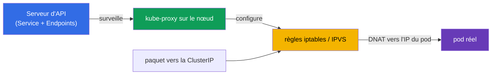
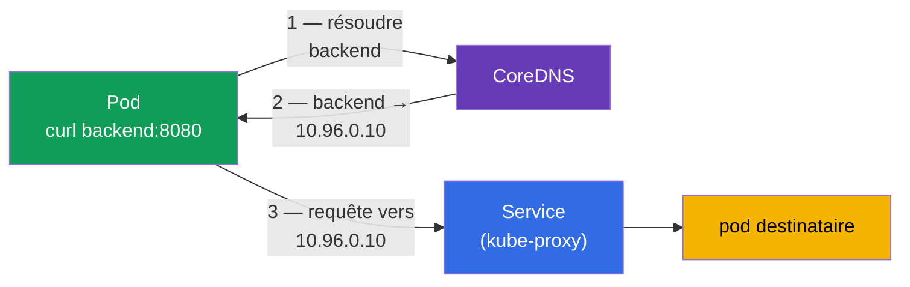
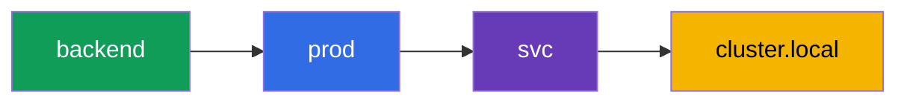
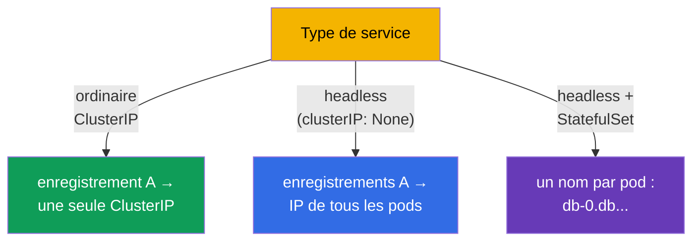
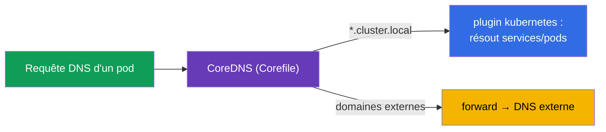
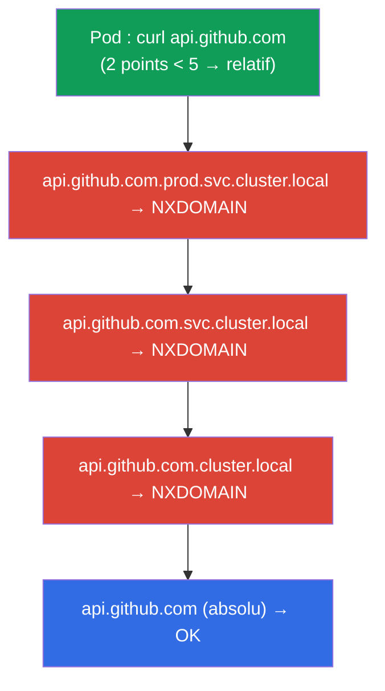
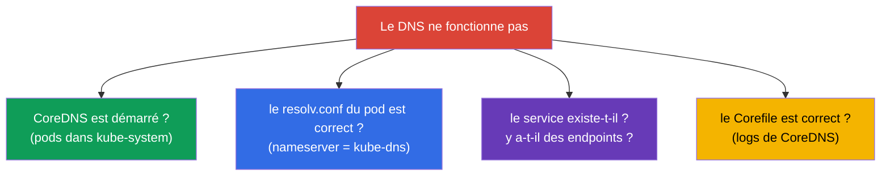

[Русская версия](ru.md) · [Eng version](README.md) · [Versión en español](es.md) · [Deutsche Version](de.md) · [ქართული ვერსია](ge.md) · [繁體中文版](tw.md) · [日本語版](jp.md)

# Chapitre 31. Le Service de l'intérieur, le DNS et CoreDNS

> **Ce qui suit.** Au chapitre 7, nous avons appris ce qu'est un Service et quels sont ses types. Au
> chapitre 30, nous avons vu le réseau des pods. Maintenant, regardons plus profond : comment
> kube-proxy implémente réellement les Service (iptables/IPVS) et comment fonctionne le DNS dans le
> cluster via **CoreDNS** - du nom du service jusqu'à l'IP. C'est le domaine Services & Networking
> des deux examens et un sujet fréquent de troubleshooting (chapitre 46) : « le DNS ne résout pas »
> et « le service ne répond pas » sont des incidents classiques.

## 31.1. Comment kube-proxy implémente un Service

Rappelons le chapitre 7 : la ClusterIP est virtuelle, elle n'appartient à aucune interface. C'est
**kube-proxy**, sur chaque nœud, qui transforme les appels vers cette IP en trafic vers de vrais
pods. Il surveille les Service et les Endpoints et configure les règles du noyau.



kube-proxy fonctionne dans l'un de ces modes :

| Mode | Comment ça marche | Scalabilité |
|-------|--------------|------------------|
| **iptables** (par défaut) | des chaînes de règles iptables, DNAT vers un pod aléatoire | moins bon avec des milliers de services (parcours linéaire) |
| **IPVS** | équilibreur L4 du noyau, tables de hachage | meilleur sur les grands clusters, plus d'algorithmes |
| **eBPF** (Cilium, sans kube-proxy) | répartition de charge dans le noyau via eBPF | la plus élevée |

L'essentiel : ici la répartition de charge est **L4** (par connexions), kube-proxy ne comprend pas
HTTP. Pour un routage L7, il faut un Ingress (chapitre 32) ou le Gateway API (chapitre 33).

> **kube-proxy ne fait pas passer le trafic par lui-même.** C'est important à répéter (voir aussi le
> chapitre 2) : kube-proxy est le « control plane » des règles des services sur le nœud, pas le
> « data plane ». Il **configure seulement les règles du noyau** (iptables/IPVS), tandis que le
> paquet du client vers le pod passe **directement par le noyau**, sans traverser le processus
> kube-proxy. On le voit sur le schéma ci-dessus : la flèche `paquet → règles → pod` ne passe pas par
> le nœud kube-proxy.
>
> D'où une conséquence pratique : **le redémarrage ou la mise à jour de kube-proxy n'interrompt pas
> le trafic.** Pendant que le processus redémarre, les règles déjà configurées dans le noyau restent
> en place et continuent de servir les connexions existantes et nouvelles. Seule la **mise à jour**
> des règles est temporairement « gelée » - les nouveaux Service/Endpoints n'apparaîtront pas et les
> supprimés ne disparaîtront pas tant que kube-proxy n'est pas relancé. C'est pourquoi la mise à
> niveau de kube-proxy (DaemonSet) est une opération de routine, sans interruption du trafic des
> services.

> **La répartition de charge a lieu sur le nœud émetteur.** Quand un pod s'adresse à un service par
> sa ClusterIP, le choix du pod backend concret (DNAT) est fait par les règles du noyau **sur le nœud
> même où tourne le pod émetteur** - parce que kube-proxy a configuré les mêmes règles sur chaque
> nœud. Autrement dit, la décision « dans lequel des pods du service ira cette connexion » est prise
> localement, avant même que le paquet ne quitte le nœud. Après la substitution d'adresse, le paquet
> part **directement** par le réseau des pods vers le backend choisi - qu'il soit sur le même nœud ou
> sur un autre, sans « saut proxy » intermédiaire.
>
> Conséquences pratiques :
>
> - il n'y a pas de point unique par lequel passe tout le trafic du service - la répartition est
>   distribuée sur les nœuds sources, ce qui scale bien ;
> - le choix du backend se fait **au niveau de la connexion** (L4) : tous les paquets d'une même
>   connexion TCP arriveront dans le même pod, alors qu'une nouvelle connexion peut partir ailleurs ;
> - par défaut (`externalTrafficPolicy`/`internalTrafficPolicy: Cluster`), le pod destinataire peut
>   se trouver sur n'importe quel nœud ; c'est normal grâce au réseau plat des pods (chapitre 30).

## 31.2. Pourquoi le DNS est nécessaire dans le cluster

S'adresser aux services par ClusterIP est peu pratique et fragile (l'IP peut changer si le service
est recréé). C'est pourquoi chaque Service possède un **nom DNS** stable, résolu par le serveur DNS
intégré du cluster - **CoreDNS**.



CoreDNS est un Deployment dans `kube-system` (nous l'avons vu sur la carte des composants, chapitre
2), devant lequel se trouve le Service `kube-dns`. kubelet inscrit ce serveur DNS aux pods dans
`/etc/resolv.conf`, donc toutes les requêtes DNS d'un pod vont vers CoreDNS.

## 31.3. Le format des noms DNS des services

Le nom DNS complet d'un service (FQDN) suit un modèle strict - il faut le connaître :

```
<service>.<namespace>.svc.<cluster-domain>
backend.prod.svc.cluster.local
```



En pratique, on écrit rarement le nom complet - une forme abrégée fonctionne, selon l'endroit d'où
l'on s'adresse :

| D'où l'on s'adresse | Comment s'adresser |
|-------------------|----------------|
| le même namespace | `backend` |
| un autre namespace | `backend.prod` |
| de n'importe où (FQDN) | `backend.prod.svc.cluster.local` |

Cela fonctionne grâce aux domaines `search` dans le `/etc/resolv.conf` du pod : le nom court est
complété automatiquement en nom complet.

## 31.4. Le DNS pour les pods et les services headless

Des enregistrements sont créés non seulement pour les services :

- **Service ordinaire** → un enregistrement A vers la ClusterIP (un nom → une IP virtuelle).
- **Service headless** (`clusterIP: None`, chapitre 7) → des enregistrements A vers les **IP de tous
  les pods** (nom → liste d'IP réelles). Ainsi le client voit les pods individuellement.
- **Pod d'un StatefulSet** via un service headless → un nom stable pour chaque pod :
  `<pod>.<service>.<namespace>.svc.cluster.local` (par exemple,
  `db-0.db.default.svc.cluster.local`, chapitre 11).



## 31.5. Configurer CoreDNS : le Corefile

CoreDNS se configure via le **Corefile**, qui se trouve dans la ConfigMap `coredns` du namespace
`kube-system`. Un Corefile typique :

```
.:53 {
    errors
    health
    kubernetes cluster.local in-addr.arpa ip6.arpa {   # sert le domaine du cluster
       pods insecure
       fallthrough in-addr.arpa ip6.arpa
    }
    forward . /etc/resolv.conf      # domaines externes — vers le DNS amont
    cache 30
    loop
    reload
}
```



Les modifications du DNS du cluster (par exemple, ajouter la transmission d'un domaine donné vers le
DNS d'entreprise) se font en éditant cette ConfigMap :

```bash
kubectl get configmap coredns -n kube-system -o yaml
kubectl edit configmap coredns -n kube-system
kubectl rollout restart deployment coredns -n kube-system   # appliquer
```

## 31.6. Le dnsPolicy du pod

La façon dont un pod reçoit ses paramètres DNS est définie par `dnsPolicy` :

| dnsPolicy | Comportement |
|-----------|-----------|
| `ClusterFirst` (par défaut) | noms du cluster → CoreDNS, externes → DNS amont |
| `Default` | hérite du DNS du nœud (n'utilise pas CoreDNS pour les noms du cluster) |
| `None` | DNS entièrement personnalisé via `dnsConfig` |
| `ClusterFirstWithHostNet` | comme ClusterFirst, mais pour les pods avec hostNetwork |

Presque toujours, `ClusterFirst` convient - le pod résout à la fois les noms internes au cluster (via
CoreDNS) et les noms externes (via forward). Changer `dnsPolicy` est rarement nécessaire.

## 31.7. ndots:5 et les domaines search : la cause cachée d'un DNS lent

Nous avons vu (31.3) que les noms courts sont complétés via les domaines `search`. Cela est piloté
par l'option **`ndots`** dans le `/etc/resolv.conf` du pod. kubelet écrit aux pods un fichier de ce
type :

```text
nameserver 10.96.0.10
search prod.svc.cluster.local svc.cluster.local cluster.local
options ndots:5
```

**Ce que signifie `ndots:5`.** Si le nom demandé contient **moins de 5 points**, le résolveur
considère d'abord le nom comme relatif et ajoute tour à tour chaque domaine search ; seulement quand
toutes les tentatives ont renvoyé NXDOMAIN, il essaie le nom comme absolu (tel quel).

Pour les noms du cluster, c'est pratique : `backend` (0 point) est rapidement complété en
`backend.prod.svc.cluster.local`. Mais pour les noms **externes**, cela coûte cher.



`api.github.com` a 2 points (< 5), donc **trois requêtes inutiles** partent d'abord avec les suffixes
search et seule la quatrième est la vraie. Et comme le résolveur demande d'ordinaire à la fois A et
AAAA (IPv4 et IPv6), le nombre de requêtes **double** - jusqu'à 8 au lieu de 2. Sur un service chargé
avec des milliers d'appels sortants, cela représente une latence notable et une charge superflue sur
CoreDNS.

**Comment on corrige :**

| Technique | Comment | Quand |
|-------|-----|-------|
| **FQDN avec un point final** | `api.github.com.` (point final = nom absolu) | correctif rapide dans le code/la config de l'application |
| **Nom avec ≥ 5 points** | ne passe plus par search | naturel pour les FQDN longs |
| **Baisser `ndots` pour le pod** | `dnsConfig.options: ndots=1..2` | l'application s'adresse surtout à des domaines externes |
| **NodeLocal DNSCache** | un cache local sur le nœud (31.9) | réduit le coût des échecs sur tout le cluster |

L'abaissement de `ndots` au niveau du pod se règle via `dnsConfig` (fonctionne avec n'importe quel
`dnsPolicy`) :

```yaml
apiVersion: v1
kind: Pod
metadata:
  name: web
spec:
  dnsConfig:
    options:
    - name: ndots
      value: "2"                   # moins de tentatives inutiles pour les noms externes
  containers:
  - name: web
    image: nginx
```

> **Compromis.** Un `ndots` trop petit (par exemple, 1) accélère les requêtes externes, mais casse
> les appels aux services d'un **autre** namespace par le nom court `backend.prod` (2 points sont
> déjà considérés comme un nom absolu et search ne sera pas appliqué). C'est pourquoi on prend
> d'ordinaire `2`, ou bien on laisse la valeur par défaut `5` et on corrige les noms externes
> problématiques en FQDN avec un point final.

Vérifier les paramètres du pod :

```bash
kubectl exec <pod> -- cat /etc/resolv.conf       # domaines search et options ndots
```

## 31.8. Déboguer le DNS

« Le DNS ne résout pas » est un incident fréquent. Ordre de vérification :

```bash
# Vérifier la résolution depuis l'intérieur du pod
kubectl exec -it <pod> -- nslookup backend
kubectl exec -it <pod> -- nslookup backend.prod.svc.cluster.local

# Vérifier le /etc/resolv.conf du pod (quel DNS, quels domaines search)
kubectl exec <pod> -- cat /etc/resolv.conf

# CoreDNS est-il vivant
kubectl get pods -n kube-system -l k8s-app=kube-dns
kubectl logs -n kube-system -l k8s-app=kube-dns

# Le service lui-même et ses endpoints existent-ils (chapitre 7)
kubectl get svc backend
kubectl get endpoints backend
```



Piège typique : le nom se résout, mais `nslookup` ne renvoie rien → le service existe, mais les
Endpoints sont vides (le sélecteur ne correspond pas / les pods ne sont pas prêts, chapitre 7).
Autrement dit, le problème n'est pas dans le DNS, mais dans la liaison entre le service et les pods.

## 31.9. Comment cela s'applique en production

- **CoreDNS est un composant critique.** La connectivité de tous les services en dépend. Sa chute ou
  sa surcharge (beaucoup de requêtes, une limite trop serrée) est un incident sérieux : les
  applications ne se trouvent plus les unes les autres. C'est pourquoi on surveille CoreDNS et on lui
  laisse une marge de ressources, souvent en le mettant à l'échelle selon le nombre de nœuds.
- **Cache DNS et performances.** Sur les grands clusters, on installe **NodeLocal DNSCache** (un
  DaemonSet avec un cache DNS local sur chaque nœud), pour réduire la charge sur CoreDNS et les
  latences de résolution - une optimisation fréquente.
- **IPVS pour les grands clusters.** Avec des milliers de services, le mode iptables de kube-proxy
  ralentit (parcours linéaire des règles) ; en prod, on passe à IPVS ou à Cilium (eBPF).
- **Transmission de domaines personnalisée.** Via le Corefile, on configure le forward des domaines
  d'entreprise vers le DNS interne, des stub-domaines, du split-horizon - pour que les pods résolvent
  aussi les noms externes de l'entreprise.
- **Les problèmes DNS sont dans le top des causes d'incidents.** « L'application ne voit pas sa
  dépendance » se ramène très souvent au DNS (CoreDNS surchargé, resolv.conf incorrect, Endpoints
  vides). Comprendre la chaîne nom→CoreDNS→Service→Endpoints fait gagner des heures d'analyse.

## 31.10. Mini-glossaire

- **kube-proxy** - implémente les Service sur le nœud via iptables/IPVS (répartition de charge L4).
- **modes iptables / IPVS** - les manières d'implémenter les services ; IPVS scale mieux.
- **CoreDNS** - le serveur DNS du cluster (un Deployment dans kube-system derrière le Service
  kube-dns).
- **FQDN d'un service** - `<service>.<namespace>.svc.cluster.local`.
- **domaines search** - les suffixes dans resolv.conf qui complètent les noms courts.
- **ndots** - le seuil de points dans un nom : en dessous, le nom est d'abord essayé avec les suffixes
  search (par défaut `ndots:5`, d'où les requêtes superflues pour les noms externes).
- **dnsConfig** - le réglage fin du DNS d'un pod (y compris `options ndots`), fonctionne avec n'importe quel dnsPolicy.
- **Corefile** - la configuration de CoreDNS (dans la ConfigMap `coredns`).
- **dnsPolicy** - comment un pod reçoit son DNS (ClusterFirst, etc.).
- **NodeLocal DNSCache** - un cache DNS local sur chaque nœud.

## 31.11. Bilan du chapitre

- kube-proxy implémente les Service sur chaque nœud via iptables (par défaut) ou IPVS (meilleur pour
  les grands clusters) ; répartition de charge L4, sans comprendre HTTP.
- Les noms DNS des services sont résolus par CoreDNS - un Deployment dans kube-system derrière le
  Service kube-dns ; il est inscrit aux pods dans resolv.conf.
- FQDN : `<service>.<namespace>.svc.cluster.local` ; depuis le même namespace, le nom court suffit
  (grâce aux domaines search).
- Des enregistrements sont créés pour les services (A vers la ClusterIP), les headless (A vers les IP
  de tous les pods) et les pods de StatefulSet (un nom stable pour chacun).
- CoreDNS se configure via le Corefile (ConfigMap `coredns`) : le plugin kubernetes pour le domaine du
  cluster, forward pour les externes.
- `ndots:5` dans le resolv.conf du pod force les noms externes (peu de points) à parcourir d'abord les
  domaines search - des requêtes NXDOMAIN superflues et des latences ; on corrige avec un FQDN à point
  final, un `dnsConfig` avec un `ndots` plus petit ou NodeLocal DNSCache.
- Débogage DNS : nslookup depuis l'intérieur, resolv.conf, vitalité de CoreDNS, existence du service
  et des Endpoints (des Endpoints vides ≠ un problème de DNS).

## 31.12. À quoi cela sert : à l'examen et dans le travail réel

**À l'examen.** « Configure/répare CoreDNS », « pourquoi le pod ne résout pas le service »,
« adresse-toi à un service d'un autre namespace » sont des exercices types. Il faut connaître le
format du FQDN, savoir où se trouve le Corefile et savoir déboguer avec
nslookup/resolv.conf/endpoints. C'est le cœur du troubleshooting réseau (30 % du CKA).

**Dans le travail réel.** CoreDNS est un composant critique pour la connectivité ; comprendre sa
configuration et son débogage influe directement sur l'analyse des incidents « le service est
introuvable ». Le choix du mode de kube-proxy (IPVS/eBPF) et NodeLocal DNSCache sont des optimisations
pour les grands clusters. Le DNS est l'une des causes les plus fréquentes de problèmes réseau en prod.

## 31.13. Questions d'auto-évaluation

1. Comment kube-proxy transforme-t-il un appel vers une ClusterIP en trafic vers un pod ? À quel
   niveau répartit-il la charge ?
2. En quoi le mode IPVS est-il meilleur qu'iptables et quand cela compte-t-il ?
3. Qu'est-ce que CoreDNS, où fonctionne-t-il et comment les pods en sont-ils informés ?
4. Écrivez le FQDN du service `web` dans le namespace `shop`. Comment s'y adresser depuis le même
   namespace ?
5. En quoi les enregistrements DNS d'un service headless diffèrent-ils de ceux d'un service ordinaire ?
6. Où et comment CoreDNS se configure-t-il ? Comment appliquer les modifications ?
7. Que signifie `ndots:5` dans le resolv.conf d'un pod et pourquoi les noms externes se résolvent-ils
   plus lentement à cause de lui ? Comment y remédier ?
8. Comment déboguer « le pod ne résout pas le service » et pourquoi des Endpoints vides ne sont-ils
   pas un problème de DNS ?

## Pratique

Nous avons vu les entrailles des services et du DNS. Au chapitre 32, nous monterons au niveau L7 -
Ingress et les contrôleurs Ingress, qui apportent le routage par hôtes et par chemins. CoreDNS et
kube-proxy se travaillent dans les TP sur le réseau et le troubleshooting.

🧪 TP 125 (DNS et CoreDNS : enregistrements A, headless, ndots/dnsConfig, Corefile) : [tasks/cka/labs/125](../../labs/125/README_FR.MD)

🧪 TP 118 (y compris la réparation de CoreDNS) : [tasks/cka/labs/118](../../labs/118/README_FR.MD)

🎮 Killercoda (dans le navigateur, sans installation) : [Test DNS Resolution](https://killercoda.com/chadmcrowell/course/ckad/dns-resolution) · [Modify Cluster DNS](https://killercoda.com/chadmcrowell/course/cka/modify-cluster-dns) · [Resolve Service IP from Pod](https://killercoda.com/chadmcrowell/course/cka/communicate-with-svc) · [Create a Headless Service](https://killercoda.com/chadmcrowell/course/ckad/headless-service)

---
[Sommaire](../README_FR.md) · [Chapitre 30](../30/fr.md) · [Chapitre 32](../32/fr.md)
