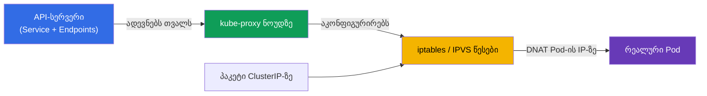
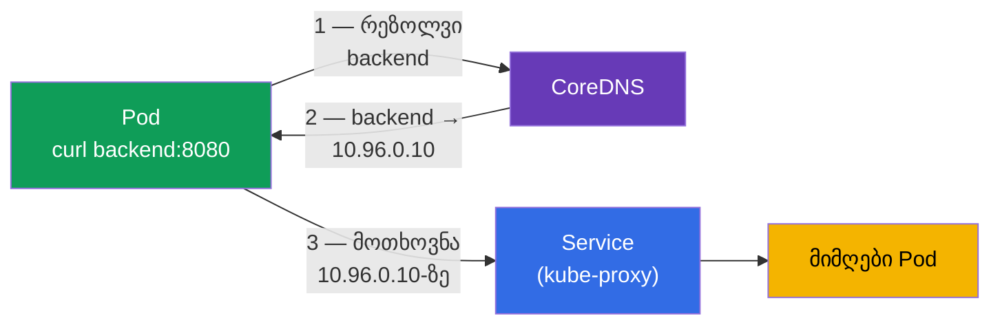
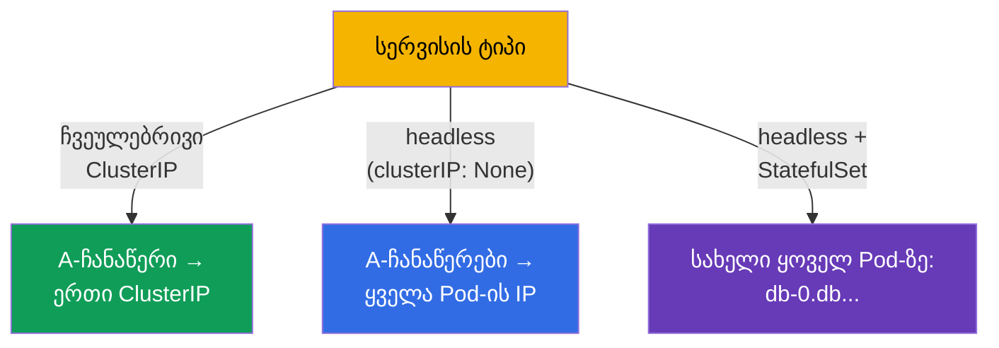
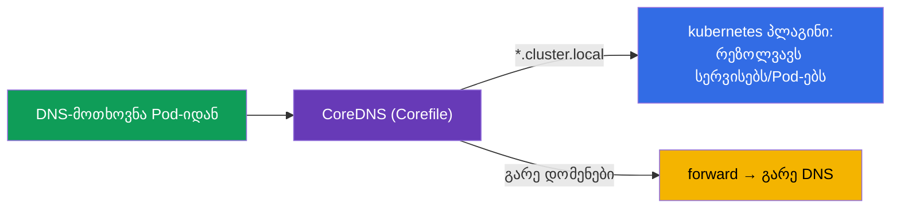
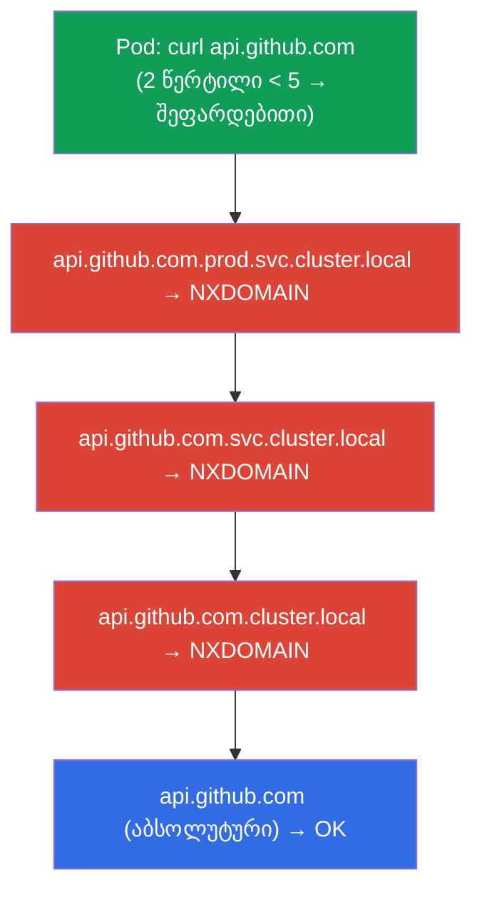
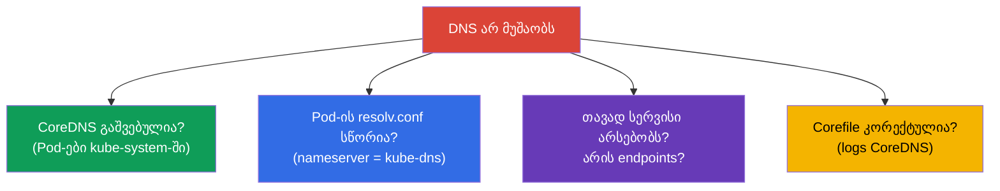

[Русская версия](ru.md) · [Eng version](README.md) · [Versión en español](es.md) · [Version française](fr.md) · [Deutsche Version](de.md) · [繁體中文版](tw.md) · [日本語版](jp.md)

# თავი 31. Service შიგნიდან, DNS და CoreDNS

> **რა იქნება შემდეგ.** თავ 7-ში გავიგეთ, რა არის Service და მისი ტიპები. თავ 30-ში გავარჩიეთ
> Pod-ების ქსელი. ახლა უფრო ღრმად ჩავიხედავთ: როგორ ახორციელებს kube-proxy სინამდვილეში Service-ს
> (iptables/IPVS) და როგორ მუშაობს DNS კლასტერში **CoreDNS**-ის გავლით - სერვისის სახელიდან
> IP-მდე. ეს ორივე გამოცდის დომენი Services & Networking-ია და troubleshooting-ის ხშირი თემა
> (თავი 46): „DNS არ რეზოლვდება“ და „სერვისი არ პასუხობს“ - კლასიკური ინციდენტებია.

## 31.1. როგორ ახორციელებს kube-proxy Service-ს

გავიხსენოთ თავი 7: ClusterIP - ვირტუალურია, არ ეკუთვნის არცერთ ინტერფეისს. ამ IP-ზე მიმართვების
რეალურ Pod-ებად გადაქცევაზე პასუხისმგებელია **kube-proxy** ყოველ ნოუდზე.
ის ადევნებს თვალს სერვისებსა და Endpoints-ს და აკონფიგურირებს ბირთვის წესებს.



kube-proxy მუშაობს ერთ-ერთ რეჟიმში:

| რეჟიმი | როგორ მუშაობს | მასშტაბირებადობა |
|-------|--------------|------------------|
| **iptables** (ნაგულისხმევად) | iptables-ის წესების ჯაჭვები, DNAT შემთხვევით Pod-ზე | უარესი ათასობით სერვისზე (წრფივი გადარჩევა) |
| **IPVS** | ბირთვისეული L4 დამბალანსებელი, ჰეშ-ცხრილები | უკეთესი დიდ კლასტერებზე, მეტი ალგორითმი |
| **eBPF** (Cilium, kube-proxy-ს გარეშე) | დაბალანსება ბირთვში eBPF-ის გავლით | ყველაზე მაღალი |

მთავარი: დაბალანსება აქ **L4**-ია (კავშირების მიხედვით), kube-proxy HTTP-ს არ ესმის.
L7-მარშრუტიზაციისთვის საჭიროა Ingress (თავი 32) ან Gateway API (თავი 33).

> **kube-proxy ტრაფიკს თავის თავში არ ატარებს.** ეს მნიშვნელოვანია გავიმეოროთ (იხ. ასევე თავი 2):
> kube-proxy - „control plane“-ია ნოუდზე სერვისების წესებისთვის, და არა „data plane“. ის მხოლოდ
> **აკონფიგურირებს ბირთვის წესებს** (iptables/IPVS), ხოლო თავად პაკეტი კლიენტიდან Pod-მდე მიდის
> **პირდაპირ ბირთვის გავლით**, kube-proxy-ს პროცესის გვერდის ავლით. ზემოთ დიაგრამაზე ეს ჩანს: ისარი
> `პაკეტი → წესები → Pod` არ გადის kube-proxy-ს კვანძში.
>
> აქედან პრაქტიკული შედეგი: **kube-proxy-ს გადატვირთვა ან განახლება ტრაფიკს არ წყვეტს.**
> სანამ პროცესი გადაიტვირთება, ბირთვში უკვე დაკონფიგურირებული წესები ადგილზე რჩება
> და აგრძელებს არსებული და ახალი კავშირების მომსახურებას. დროებით „ჩერდება“ მხოლოდ
> წესების **განახლება** - ახალი Service/Endpoints არ გამოჩნდება და წაშლილები არ მოიხსნება, სანამ
> kube-proxy ხელახლა არ აიწევს. ამიტომ kube-proxy-ს (DaemonSet) აპგრეიდი - შტატური
> ოპერაციაა, სერვისების ტრაფიკისთვის დაუნტაიმის გარეშე.

> **დაბალანსება ხდება გამგზავნ ნოუდზე.** როცა Pod მიმართავს სერვისს ClusterIP-თი,
> კონკრეტული ბექენდ-Pod-ის არჩევას (DNAT) აკეთებს ბირთვის წესები **იმავე ნოუდზე,
> სადაც გამგზავნი Pod არის გაშვებული** - იმიტომ რომ kube-proxy-მ ერთნაირი წესები დააკონფიგურირა
> ყოველ ნოუდზე. ანუ გადაწყვეტილება „სერვისის რომელ Pod-ში წავა ეს კავშირი“
> მიიღება ლოკალურად, ჯერ კიდევ მანამ, სანამ პაკეტი ნოუდს დატოვებს. მისამართის ჩანაცვლების შემდეგ პაკეტი
> მიდის **პირდაპირ** Pod-ების ქსელით არჩეულ ბექენდამდე - იმავე ნოუდზეც და
> სხვაზეც, შუალედური „პროქსი-ჰოპის“ გარეშე.
>
> პრაქტიკული შედეგები:
>
> - არ არის ერთი წერტილი, რომლის გავლითაც სერვისის მთელი ტრაფიკი მიდის, - დაბალანსება
>   განაწილებულია წყარო-ნოუდებზე, ამიტომ კარგად მასშტაბირდება;
> - ბექენდის არჩევა მიდის **კავშირის დონეზე** (L4): ერთი TCP-კავშირის ყველა პაკეტი
>   ერთსა და იმავე Pod-ში მოხვდება, ხოლო ახალი კავშირი შეიძლება სხვაში წავიდეს;
> - ნაგულისხმევად (`externalTrafficPolicy`/`internalTrafficPolicy: Cluster`) მიმღები Pod
>   შეიძლება ნებისმიერ ნოუდზე აღმოჩნდეს; ეს ნორმალურია Pod-ების ბრტყელი ქსელის წყალობით (თავი 30).

## 31.2. რისთვის არის საჭირო DNS კლასტერში

სერვისებთან ClusterIP-თი მიმართვა მოუხერხებელი და მყიფეა (IP შეიძლება შეიცვალოს სერვისის
ხელახლა შექმნისას). ამიტომ ყოველ Service-ს აქვს სტაბილური **DNS-სახელი**, ხოლო
მას რეზოლვავს კლასტერის ჩაშენებული DNS-სერვერი - **CoreDNS**.



CoreDNS - ეს Deployment-ია `kube-system`-ში (მას ვნახეთ კომპონენტების რუკაზე, თავი 2),
რომლის წინ დგას Service `kube-dns`. kubelet Pod-ებს უწერს ამ DNS-სერვერს
`/etc/resolv.conf`-ში, ამიტომ Pod-ის ნებისმიერი DNS-მოთხოვნა CoreDNS-ში მიდის.

## 31.3. სერვისების DNS-სახელების ფორმატი

სერვისის სრული DNS-სახელი (FQDN) აიგება მკაცრი შაბლონით - ის უნდა იცოდეთ:

```
<service>.<namespace>.svc.<cluster-domain>
backend.prod.svc.cluster.local
```


პრაქტიკაში სრულ სახელს იშვიათად წერენ - მუშაობს შემოკლება იმის მიხედვით, საიდან
ვმიმართავთ:

| საიდან ვმიმართავთ | როგორ მივმართოთ |
|-------------------|----------------|
| იმავე namespace | `backend` |
| სხვა namespace | `backend.prod` |
| საიდანაც გინდა (FQDN) | `backend.prod.svc.cluster.local` |

ეს მუშაობს Pod-ის `/etc/resolv.conf`-ში `search`-დომენების წყალობით: მოკლე სახელი
ავტომატურად სრულამდე ივსება.

## 31.4. DNS Pod-ებისთვის და headless-სერვისებისთვის

ჩანაწერები იწერება არა მხოლოდ სერვისებისთვის:

- **ჩვეულებრივი Service** → A-ჩანაწერი ClusterIP-ზე (ერთი სახელი → ერთი ვირტუალური IP).
- **Headless-სერვისი** (`clusterIP: None`, თავი 7) → A-ჩანაწერები **ყველა Pod-ის IP-ზე** (სახელი
  → რეალური IP-ების სია). ასე კლიენტი ხედავს ცალკეულ Pod-ებს.
- **StatefulSet-ის Pod** headless-სერვისის გავლით → ყოველი Pod-ის სტაბილური სახელი:
  `<pod>.<service>.<namespace>.svc.cluster.local` (მაგალითად,
  `db-0.db.default.svc.cluster.local`, თავი 11).



## 31.5. CoreDNS-ის კონფიგურაცია: Corefile

CoreDNS კონფიგურირდება **Corefile**-ის გავლით, რომელიც ConfigMap `coredns`-ში დევს
`kube-system`-ში. ტიპური Corefile:

```
.:53 {
    errors
    health
    kubernetes cluster.local in-addr.arpa ip6.arpa {   # ემსახურება კლასტერის დომენს
       pods insecure
       fallthrough in-addr.arpa ip6.arpa
    }
    forward . /etc/resolv.conf      # გარე დომენები — ზემდგომ DNS-ს
    cache 30
    loop
    reload
}
```



კლასტერულ DNS-ში ცვლილებებს (მაგალითად, გარკვეული დომენის კორპორაციულ DNS-ზე გადაგზავნის
დამატება) ამ ConfigMap-ის რედაქტირებით შეიტანენ:

```bash
kubectl get configmap coredns -n kube-system -o yaml
kubectl edit configmap coredns -n kube-system
kubectl rollout restart deployment coredns -n kube-system   # გამოყენება
```

## 31.6. Pod-ის dnsPolicy

როგორ იღებს Pod DNS-პარამეტრებს, განსაზღვრავს `dnsPolicy`:

| dnsPolicy | ქცევა |
|-----------|-------|
| `ClusterFirst` (ნაგულისხმევად) | კლასტერული სახელები → CoreDNS, გარე → ზემდგომი DNS |
| `Default` | იმკვიდრებს ნოუდის DNS-ს (კლასტერული სახელებისთვის CoreDNS-ს არ იყენებს) |
| `None` | სრულად კასტომური DNS `dnsConfig`-ის გავლით |
| `ClusterFirstWithHostNet` | როგორც ClusterFirst, მაგრამ hostNetwork-იანი Pod-ებისთვის |

თითქმის ყოველთვის მუშაობს `ClusterFirst` - Pod რეზოლვავს კლასტერშიდა სახელებსაც (CoreDNS-ის
გავლით) და გარესაც (forward-ის გავლით). `dnsPolicy`-ს შეცვლა იშვიათად სჭირდება.

## 31.7. ndots:5 და search-დომენები: ნელი DNS-ის დაფარული მიზეზი

ვნახეთ (31.3), რომ მოკლე სახელები `search`-დომენებით ივსება. ამას მართავს
ოპცია **`ndots`** Pod-ის `/etc/resolv.conf`-ში. kubelet Pod-ებს ასეთ ფაილს უწერს:

```text
nameserver 10.96.0.10
search prod.svc.cluster.local svc.cluster.local cluster.local
options ndots:5
```

**რას ნიშნავს `ndots:5`.** თუ მოთხოვნილ სახელში **5 წერტილზე ნაკლებია**, რეზოლვერი თავიდან
სახელს შეფარდებითად თვლის და რიგრიგობით ანაცვლებს ყოველ search-დომენს; მხოლოდ მაშინ, როცა ყველა
მცდელობამ NXDOMAIN დააბრუნა, ის სახელს აბსოლუტურად (როგორც არის) ცდის.

კლასტერული სახელებისთვის ეს მოსახერხებელია: `backend` (0 წერტილი) სწრაფად ივსება
`backend.prod.svc.cluster.local`-მდე. მაგრამ **გარე** სახელებისთვის ეს ძვირია.



`api.github.com`-ს აქვს 2 წერტილი (< 5), ამიტომ თავიდან მიდის **სამი უსარგებლო მოთხოვნა**
search-სუფიქსებით და მხოლოდ მეოთხე - ნამდვილი. და რაკი რეზოლვერი ჩვეულებრივ კითხავს
A-ს და AAAA-ს ორივეს (IPv4 და IPv6), მოთხოვნების რიცხვი **ორმაგდება** - 8-მდე 2-ის ნაცვლად. დატვირთულ
სერვისზე ათასობით გამავალი მიმართვით ეს შესამჩნევი შეყოვნება და CoreDNS-ზე ზედმეტი დატვირთვაა.

**როგორ ასწორებენ:**

| ხერხი | როგორ | როდის |
|-------|-----|-------|
| **FQDN ბოლოში წერტილით** | `api.github.com.` (დამასრულებელი წერტილი = აბსოლუტური სახელი) | სწრაფი ფიქსი აპლიკაციის კოდში/კონფიგში |
| **სახელი ≥ 5 წერტილით** | search-ს უკვე არ გადის | ბუნებრივია გრძელი FQDN-ებისთვის |
| **`ndots`-ის დაწევა Pod-ისთვის** | `dnsConfig.options: ndots=1..2` | აპლიკაცია ძირითადად გარე დომენებში დადის |
| **NodeLocal DNSCache** | ლოკალური კეში ნოუდზე (31.9) | ამცირებს აცილებების ფასს მთელ კლასტერზე |

`ndots`-ის დაწევა Pod-ის დონეზე `dnsConfig`-ით ისმება (მუშაობს ნებისმიერ `dnsPolicy`-სთან):

```yaml
apiVersion: v1
kind: Pod
metadata:
  name: web
spec:
  dnsConfig:
    options:
    - name: ndots
      value: "2"                   # ნაკლები ზედმეტი მცდელობა გარე სახელებისთვის
  containers:
  - name: web
    image: nginx
```

> **კომპრომისი.** ძალიან მცირე `ndots` (მაგალითად, 1) აჩქარებს გარე მოთხოვნებს, მაგრამ
> ტეხს **სხვა** namespace-იდან სერვისებთან მიმართვას მოკლე `backend.prod`-ით (2
> წერტილი უკვე აბსოლუტურ სახელად ითვლება და search არ ჩაანაცვლებს). ამიტომ ჩვეულებრივ იღებენ
> `2`-ს, ან ტოვებენ ნაგულისხმევ `5`-ს და პრობლემურ გარე სახელებს ასწორებენ FQDN-ით ბოლოში წერტილით.

Pod-ის პარამეტრების შემოწმება:

```bash
kubectl exec <pod> -- cat /etc/resolv.conf       # search-დომენები და options ndots
```

## 31.8. DNS-ის გამართვა

„DNS არ რეზოლვდება“ - ხშირი ინციდენტია. შემოწმების რიგი:

```bash
# რეზოლვინგის შემოწმება Pod-ის შიგნიდან
kubectl exec -it <pod> -- nslookup backend
kubectl exec -it <pod> -- nslookup backend.prod.svc.cluster.local

# Pod-ის /etc/resolv.conf-ის შემოწმება (რომელი DNS, რომელი search-დომენები)
kubectl exec <pod> -- cat /etc/resolv.conf

# ცოცხალია CoreDNS?
kubectl get pods -n kube-system -l k8s-app=kube-dns
kubectl logs -n kube-system -l k8s-app=kube-dns

# არსებობს თავად სერვისი და მისი endpoints (თავი 7)
kubectl get svc backend
kubectl get endpoints backend
```



ტიპური ხაფანგი: სახელი რეზოლვდება, მაგრამ `nslookup` ცარიელს აბრუნებს → სერვისი არის, მაგრამ
Endpoints ცარიელია (სელექტორი არ დაემთხვა / Pod-ები არ არის მზად, თავი 7). ანუ პრობლემა არ არის DNS-ში,
არამედ სერვისის Pod-ებთან შეკვრაშია.

## 31.9. როგორ იყენებენ ამას პროდაქშენში

- **CoreDNS - კრიტიკული კომპონენტია.** მასზეა დამოკიდებული ყველა სერვისის დაკავშირებადობა. მისი დაცემა
  ან გადატვირთვა (ბევრი მოთხოვნა, ვიწრო ლიმიტი) - სერიოზული ინციდენტია: აპლიკაციები წყვეტენ
  ერთმანეთის პოვნას. ამიტომ CoreDNS-ს მონიტორინგს უწევენ და რესურსების მარაგს აძლევენ, ხშირად
  ნოუდების რაოდენობის მიხედვით მასშტაბირებენ.
- **DNS-კეში და წარმადობა.** დიდ კლასტერებზე აყენებენ **NodeLocal DNSCache**-ს
  (DaemonSet ლოკალური DNS-კეშით ყოველ ნოუდზე), რომ შეამცირონ დატვირთვა CoreDNS-ზე და
  რეზოლვინგის შეყოვნებები - ხშირი ოპტიმიზაციაა.
- **IPVS დიდი კლასტერებისთვის.** ათასობით სერვისის დროს kube-proxy-ს iptables-რეჟიმი
  ნელდება (წესების წრფივი გადარჩევა); პროდში გადადიან IPVS-ზე ან Cilium-ზე (eBPF).
- **დომენების კასტომური გადაგზავნა.** Corefile-ის გავლით აკონფიგურირებენ კორპორაციული დომენების
  forward-ს შიდა DNS-ზე, stub-დომენებს, split-horizon-ს - რომ Pod-ები რეზოლვავდნენ გარე
  კორპორაციულ სახელებსაც.
- **DNS-პრობლემები - ინციდენტების მიზეზების ტოპშია.** „აპლიკაცია არ ხედავს დამოკიდებულებას“ ძალიან ხშირად
  DNS აღმოჩნდება (გადატვირთული CoreDNS, არასწორი resolv.conf, ცარიელი Endpoints).
  ჯაჭვის სახელი→CoreDNS→Service→Endpoints გაგება საათებს ზოგავს გარჩევაზე.

## 31.10. მინი-ლექსიკონი

- **kube-proxy** - ახორციელებს Service-ს ნოუდზე iptables/IPVS-ის გავლით (L4 დაბალანსება).
- **iptables / IPVS რეჟიმები** - სერვისების რეალიზაციის ხერხები; IPVS უკეთ მასშტაბირდება.
- **CoreDNS** - კლასტერის DNS-სერვერი (Deployment kube-system-ში Service kube-dns-ის უკან).
- **სერვისის FQDN** - `<service>.<namespace>.svc.cluster.local`.
- **search-დომენები** - სუფიქსები resolv.conf-ში, რომლებიც ავსებენ მოკლე სახელებს.
- **ndots** - წერტილების ზღვარი სახელში: მასზე ნაკლების დროს სახელი თავიდან იცდება search-სუფიქსებით
  (ნაგულისხმევად `ndots:5`, აქედან ზედმეტი მოთხოვნები გარე სახელებისთვის).
- **dnsConfig** - Pod-ის DNS-ის წერტილოვანი კონფიგურაცია (მათ შორის `options ndots`), მუშაობს ნებისმიერ dnsPolicy-სთან.
- **Corefile** - CoreDNS-ის კონფიგურაცია (ConfigMap `coredns`-ში).
- **dnsPolicy** - როგორ იღებს Pod DNS-ს (ClusterFirst და სხვ.).
- **NodeLocal DNSCache** - ლოკალური DNS-კეში ყოველ ნოუდზე.

## 31.11. თავის შეჯამება

- kube-proxy ახორციელებს Service-ს ყოველ ნოუდზე iptables-ის (ნაგულისხმევად) ან IPVS-ის გავლით
  (უკეთესი დიდი კლასტერებისთვის); დაბალანსება L4, HTTP-ის გაგების გარეშე.
- სერვისების DNS-სახელებს რეზოლვავს CoreDNS - Deployment kube-system-ში Service kube-dns-ის უკან;
  Pod-ებს ის resolv.conf-ში აწერია.
- FQDN: `<service>.<namespace>.svc.cluster.local`; იმავე namespace-იდან საკმარისია
  მოკლე სახელი (search-დომენების წყალობით).
- ჩანაწერები იწერება სერვისებისთვის (A ClusterIP-ზე), headless-ისთვის (A ყველა Pod-ის IP-ზე) და
  StatefulSet-ის Pod-ებისთვის (თითოეულის სტაბილური სახელი).
- CoreDNS კონფიგურირდება Corefile-ის გავლით (ConfigMap `coredns`): kubernetes პლაგინი
  კლასტერის დომენისთვის, forward გარესთვის.
- `ndots:5` Pod-ის resolv.conf-ში აიძულებს გარე სახელებს (ცოტა წერტილი) თავიდან გადაარჩიოს
  search-დომენები - ზედმეტი NXDOMAIN-მოთხოვნები და შეყოვნებები; ასწორებენ FQDN-ით ბოლოში წერტილით,
  `dnsConfig`-ით ნაკლები `ndots`-ით ან NodeLocal DNSCache-ით.
- DNS-ის გამართვა: nslookup შიგნიდან, resolv.conf, CoreDNS-ის სიცოცხლე, სერვისისა და
  Endpoints-ის არსებობა (ცარიელი Endpoints ≠ DNS-ის პრობლემა).

## 31.12. როგორ გამოგადგებათ: გამოცდაზე და რეალურ სამუშაოში

**გამოცდაზე.** „დააკონფიგურირე/შეაკეთე CoreDNS“, „რატომ არ რეზოლვავს Pod სერვისს“, „მიმართე
სერვისს სხვა namespace-იდან“ - ტიპური დავალებებია. საჭიროა იცოდეთ FQDN-ის ფორმატი, სად დევს
Corefile, და შეგეძლოთ გამართვა nslookup/resolv.conf/endpoints-ის გავლით. ეს ქსელური
troubleshooting-ის ბირთვია (CKA-ს 30%).

**რეალურ სამუშაოში.** CoreDNS - დაკავშირებადობისთვის კრიტიკული კომპონენტია; მისი კონფიგურაციისა
და გამართვის გაგება პირდაპირ მოქმედებს ინციდენტების „სერვისი არ იძებნება“ გარჩევაზე. kube-proxy-ს
რეჟიმის არჩევა (IPVS/eBPF) და NodeLocal DNSCache - ოპტიმიზაციებია დიდი კლასტერებისთვის.
DNS - პროდში ქსელური პრობლემების ერთ-ერთი ყველაზე ხშირი მიზეზია.

## 31.13. თვითშემოწმების კითხვები

1. როგორ აქცევს kube-proxy ClusterIP-ზე მიმართვას Pod-ისკენ ტრაფიკად? რომელ დონეზე
   აბალანსებს?
2. რით არის IPVS რეჟიმი iptables-ზე უკეთესი და როდის არის ეს მნიშვნელოვანი?
3. რა არის CoreDNS, სად მუშაობს და როგორ იგებენ Pod-ები მის შესახებ?
4. ჩაწერეთ სერვის `web`-ის FQDN namespace `shop`-ში. როგორ მივმართოთ მას იმავე
   namespace-იდან?
5. რით განსხვავდება headless-სერვისის DNS-ჩანაწერები ჩვეულებრივისგან?
6. სად და როგორ კონფიგურირდება CoreDNS? როგორ გამოვიყენოთ ცვლილებები?
7. რას ნიშნავს `ndots:5` Pod-ის resolv.conf-ში და რატომ რეზოლვდება მისი გამო გარე სახელები
   უფრო ნელა? როგორ გამოვასწოროთ ეს?
8. როგორ გავმართოთ „Pod არ რეზოლვავს სერვისს“ და რატომ არ არის ცარიელი Endpoints
   DNS-ის პრობლემა?

## პრაქტიკა

გავარჩიეთ სერვისების შიგთავსი და DNS. თავ 32-ში ავიწევთ L7-ზე - Ingress და
Ingress-კონტროლერები, რომლებიც იძლევიან მარშრუტიზაციას ჰოსტებისა და გზების მიხედვით. CoreDNS და kube-proxy
მუშავდება ქსელისა და troubleshooting-ის ლაბებში.

🧪 ლაბი 125 (DNS და CoreDNS: A-ჩანაწერები, headless, ndots/dnsConfig, Corefile): [tasks/cka/labs/125](../../labs/125/README_GE.MD)

🧪 ლაბი 118 (მათ შორის CoreDNS-ის შეკეთება): [tasks/cka/labs/118](../../labs/118/README_GE.MD)

🎮 Killercoda (ბრაუზერში, ინსტალაციის გარეშე): [Test DNS Resolution](https://killercoda.com/chadmcrowell/course/ckad/dns-resolution) · [Modify Cluster DNS](https://killercoda.com/chadmcrowell/course/cka/modify-cluster-dns) · [Resolve Service IP from Pod](https://killercoda.com/chadmcrowell/course/cka/communicate-with-svc) · [Create a Headless Service](https://killercoda.com/chadmcrowell/course/ckad/headless-service)

---
[სარჩევი](../README_GE.md) · [თავი 30](../30/ge.md) · [თავი 32](../32/ge.md)
