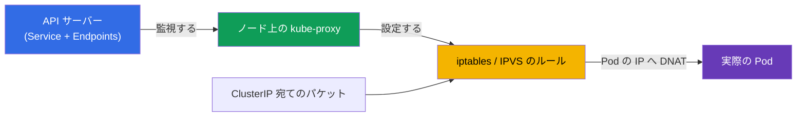
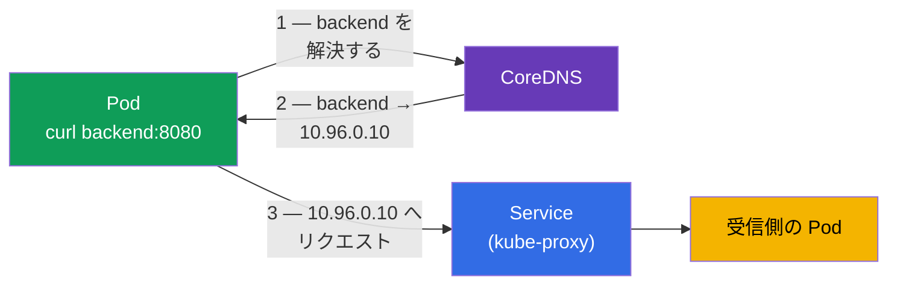
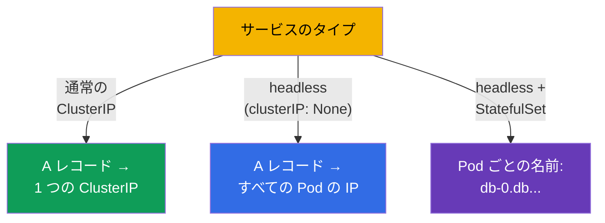
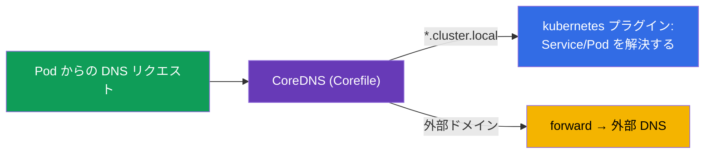
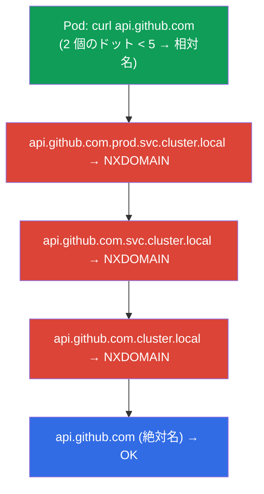
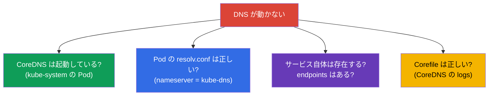

[Русская версия](ru.md) · [Eng version](README.md) · [Versión en español](es.md) · [Version française](fr.md) · [Deutsche Version](de.md) · [ქართული ვერსია](ge.md) · [繁體中文版](tw.md)

# 第 31 章。Service の内部、DNS と CoreDNS

> **次は何か。** 第 7 章では Service とは何か、そのタイプを学びました。第 30 章では
> Pod のネットワークを分解しました。ここではもっと深く覗き込みます：kube-proxy が実際に
> どうやって Service を実現しているのか (iptables/IPVS)、そしてクラスタの DNS が
> **CoreDNS** を通じてどう動くのか - サービス名から IP まで。これは両方の試験の
> Services & Networking 領域であり、troubleshooting（第 46 章）の定番テーマでもあります：
> 「DNS が解決できない」「サービスが応答しない」は典型的なインシデントです。

## 31.1. kube-proxy はどうやって Service を実現するか

第 7 章を思い出しましょう：ClusterIP は仮想的なもので、どのインターフェイスにも属して
いません。この IP へのアクセスを実際の Pod へ変換する責任を持つのが、各ノードの
**kube-proxy** です。それは Service と Endpoints を監視し、カーネルのルールを設定します。



kube-proxy は次のいずれかのモードで動作します：

| モード | どう動くか | スケーラビリティ |
|-------|--------------|------------------|
| **iptables**（デフォルト） | iptables のルールチェイン、ランダムな Pod へ DNAT | 数千の Service では劣る（線形探索） |
| **IPVS** | カーネルの L4 ロードバランサー、ハッシュテーブル | 大きなクラスタで有利、アルゴリズムも多い |
| **eBPF**（Cilium、kube-proxy なし） | eBPF によるカーネル内での負荷分散 | もっとも高い |

重要な点：ここでの負荷分散は **L4**（コネクション単位）で、kube-proxy は HTTP を
理解しません。L7 のルーティングには Ingress（第 32 章）または Gateway API（第 33 章）が
必要です。

> **kube-proxy は自分自身を通してトラフィックを流さない。** これは繰り返しておくべき
> 重要な点です（第 2 章も参照）：kube-proxy はノード上の Service のルールに対する
> 「control plane」であり、「data plane」ではありません。それは **カーネルのルールを設定
> するだけ**（iptables/IPVS）で、クライアントから Pod へのパケット自体は kube-proxy の
> プロセスを通らず **カーネルを直接** 通っていきます。上の図でもそれが見えます：
> `パケット → ルール → Pod` という矢印は kube-proxy のノードを通っていません。
>
> ここから実務的な帰結が出てきます：**kube-proxy の再起動や更新はトラフィックを
> 中断しません。** プロセスが再起動している間も、カーネルに設定済みのルールはその場に
> 残り、既存のコネクションと新しいコネクションを引き続き処理します。一時的に「止まる」のは
> ルールの **更新** だけです - kube-proxy が再び立ち上がるまで、新しい Service/Endpoints は
> 現れず、削除されたものも消えません。ですから kube-proxy（DaemonSet）のアップグレードは、
> サービスのトラフィックにダウンタイムを起こさない通常運用の作業です。

> **負荷分散は送信側のノードで起こる。** Pod が ClusterIP でサービスへアクセスするとき、
> 具体的なバックエンド Pod の選択 (DNAT) を行うのは **送信元の Pod が動いているのと同じ
> ノード** のカーネルのルールです - kube-proxy が各ノードに同じルールを設定しているから
> です。つまり「このコネクションはサービスのどの Pod へ行くのか」という判断は、パケットが
> ノードを離れる前にローカルで下されます。アドレスが差し替えられたあと、パケットは選ばれた
> バックエンドへ Pod ネットワークを通って **直接** 進みます - 同じノードでも別のノードでも、
> 途中の「プロキシホップ」なしで。
>
> 実務的な帰結：
>
> - サービスのトラフィック全体が通る単一の点は存在しません - 負荷分散は送信元ノードに
>   分散されるので、よくスケールします；
> - バックエンドの選択は **コネクション単位** (L4) です：1 つの TCP コネクションの
>   すべてのパケットは同じ Pod に入り、新しいコネクションは別の Pod へ行くことがあります；
> - デフォルト (`externalTrafficPolicy`/`internalTrafficPolicy: Cluster`) では受信側の
>   Pod はどのノードにあっても構いません。フラットな Pod ネットワーク（第 30 章）の
>   おかげで、これは正常です。

## 31.2. クラスタに DNS が必要な理由

ClusterIP でサービスにアクセスするのは不便で壊れやすいです（サービスを作り直すと IP が
変わることがあります）。ですから各 Service には安定した **DNS 名** があり、それを解決
するのがクラスタ内蔵の DNS サーバー - **CoreDNS** です。



CoreDNS は `kube-system` にある Deployment で（コンポーネントのマップで見ました、
第 2 章）、その前に Service `kube-dns` が立っています。kubelet は Pod の
`/etc/resolv.conf` にこの DNS サーバーを書き込むので、Pod のあらゆる DNS リクエストは
CoreDNS へ向かいます。

## 31.3. サービスの DNS 名の形式

サービスの完全な DNS 名 (FQDN) は厳密なテンプレートで組み立てられます - これは覚えて
おく必要があります：

```
<service>.<namespace>.svc.<cluster-domain>
backend.prod.svc.cluster.local
```


実務では完全な名前を書くことはまれです - どこからアクセスするかに応じて短縮形が
使えます：

| どこからアクセスするか | どう書くか |
|-------------------|----------------|
| 同じ namespace | `backend` |
| 別の namespace | `backend.prod` |
| どこからでも (FQDN) | `backend.prod.svc.cluster.local` |

これは Pod の `/etc/resolv.conf` にある `search` ドメインのおかげで動きます：短い名前が
自動的に完全な名前まで補完されます。

## 31.4. Pod と headless サービスの DNS

レコードが作られるのはサービスだけではありません：

- **通常の Service** → ClusterIP への A レコード（1 つの名前 → 1 つの仮想 IP）。
- **headless サービス** (`clusterIP: None`、第 7 章) → **すべての Pod の IP** への
  A レコード（名前 → 実際の IP のリスト）。こうしてクライアントは個々の Pod を見られます。
- **StatefulSet の Pod** を headless サービス経由で → 各 Pod の安定した名前：
  `<pod>.<service>.<namespace>.svc.cluster.local`（たとえば
  `db-0.db.default.svc.cluster.local`、第 11 章）。



## 31.5. CoreDNS の設定：Corefile

CoreDNS は **Corefile** で設定します。それは `kube-system` の ConfigMap `coredns` に
置かれています。典型的な Corefile：

```
.:53 {
    errors
    health
    kubernetes cluster.local in-addr.arpa ip6.arpa {   # クラスタのドメインを担当する
       pods insecure
       fallthrough in-addr.arpa ip6.arpa
    }
    forward . /etc/resolv.conf      # 外部ドメインは — 上位の DNS へ
    cache 30
    loop
    reload
}
```



クラスタの DNS への変更（たとえば特定のドメインを社内 DNS へ転送する）は、この
ConfigMap を編集して行います：

```bash
kubectl get configmap coredns -n kube-system -o yaml
kubectl edit configmap coredns -n kube-system
kubectl rollout restart deployment coredns -n kube-system   # 適用する
```

## 31.6. Pod の dnsPolicy

Pod がどうやって DNS の設定を受け取るかは `dnsPolicy` が決めます：

| dnsPolicy | 挙動 |
|-----------|-----------|
| `ClusterFirst`（デフォルト） | クラスタ内の名前 → CoreDNS、外部 → 上位の DNS |
| `Default` | ノードの DNS を継承する（クラスタ内の名前に CoreDNS を使わない） |
| `None` | `dnsConfig` による完全にカスタムな DNS |
| `ClusterFirstWithHostNet` | ClusterFirst と同じだが hostNetwork の Pod 用 |

ほぼ常に `ClusterFirst` で足ります - Pod はクラスタ内の名前も（CoreDNS 経由で）、外部の
名前も（forward 経由で）解決できます。`dnsPolicy` を変える必要はまれです。

## 31.7. ndots:5 と search ドメイン：DNS が遅い隠れた原因

短い名前が `search` ドメインで補完されることを見ました (31.3)。これを制御するのが Pod の
`/etc/resolv.conf` にある **`ndots`** オプションです。kubelet は Pod にこんなファイルを
書き込みます：

```text
nameserver 10.96.0.10
search prod.svc.cluster.local svc.cluster.local cluster.local
options ndots:5
```

**`ndots:5` の意味。** 問い合わせる名前のドットが **5 個未満** の場合、リゾルバはまず
その名前を相対名とみなし、search ドメインを順番に付けていきます。すべての試行が
NXDOMAIN を返したときにだけ、名前を絶対名として（そのまま）試します。

クラスタ内の名前にはこれが便利です：`backend`（ドット 0 個）はすばやく
`backend.prod.svc.cluster.local` まで補完されます。しかし **外部** の名前にはコストが
高くつきます。



`api.github.com` はドットが 2 個 (< 5) なので、まず search サフィックス付きの
**3 回の無駄なリクエスト** が飛び、4 回目でようやく本当のリクエストになります。しかも
リゾルバは通常 A と AAAA の両方（IPv4 と IPv6）を尋ねるので、リクエスト数は **倍** に
なります - 2 回のはずが 8 回です。数千の外向きアクセスがある負荷の高いサービスでは、
これは目に見える遅延であり、CoreDNS への余計な負荷になります。

**どう直すか：**

| 手法 | どうやるか | いつ使うか |
|-------|-----|-------|
| **末尾にドットを付けた FQDN** | `api.github.com.`（末尾のドット = 絶対名） | アプリのコード/設定での手早い修正 |
| **ドットが 5 個以上の名前** | もう search を通らない | 長い FQDN では自然にそうなる |
| **Pod の `ndots` を下げる** | `dnsConfig.options: ndots=1..2` | アプリが主に外部ドメインへアクセスする |
| **NodeLocal DNSCache** | ノード上のローカルキャッシュ (31.9) | クラスタ全体でミスのコストを下げる |

Pod のレベルでの `ndots` の引き下げは `dnsConfig` で指定します（どの `dnsPolicy` でも
動きます）：

```yaml
apiVersion: v1
kind: Pod
metadata:
  name: web
spec:
  dnsConfig:
    options:
    - name: ndots
      value: "2"                   # 外部名への無駄な試行を減らす
  containers:
  - name: web
    image: nginx
```

> **トレードオフ。** `ndots` が小さすぎると（たとえば 1）外部へのリクエストは速く
> なりますが、**別の** namespace のサービスへ短い `backend.prod` でアクセスするのが
> 壊れます（2 個のドットはもう絶対名とみなされ、search が付きません）。ですから通常は
> `2` を取るか、デフォルトの `5` のままにして、問題になる外部名を末尾ドット付きの FQDN に
> 直します。

Pod の設定を確認する：

```bash
kubectl exec <pod> -- cat /etc/resolv.conf       # search ドメインと options ndots
```

## 31.8. DNS のデバッグ

「DNS が解決できない」はよくあるインシデントです。確認の順番：

```bash
# Pod の内側から解決を確認する
kubectl exec -it <pod> -- nslookup backend
kubectl exec -it <pod> -- nslookup backend.prod.svc.cluster.local

# Pod の /etc/resolv.conf を確認する（どの DNS か、どの search ドメインか）
kubectl exec <pod> -- cat /etc/resolv.conf

# CoreDNS は生きているか
kubectl get pods -n kube-system -l k8s-app=kube-dns
kubectl logs -n kube-system -l k8s-app=kube-dns

# サービス自体とその endpoints はあるか（第 7 章）
kubectl get svc backend
kubectl get endpoints backend
```



典型的な罠：名前は解決されるのに `nslookup` が空を返す → サービスはあるが Endpoints が
空です（セレクタが一致していない / Pod が Ready でない、第 7 章）。つまり問題は DNS では
なく、サービスと Pod の結び付けにあります。

## 31.9. 本番環境でこれをどう使うか

- **CoreDNS は重要なコンポーネント。** すべてのサービスの接続性がそれに依存します。その
  停止や過負荷（リクエストが多い、リミットが狭い）は深刻なインシデントです：アプリケーション
  どうしが互いを見つけられなくなります。ですから CoreDNS は監視し、リソースに余裕を持たせ、
  ノード数に応じてスケールさせることが多いです。
- **DNS キャッシュと性能。** 大きなクラスタでは **NodeLocal DNSCache**（各ノードに
  ローカル DNS キャッシュを置く DaemonSet）を入れて、CoreDNS への負荷と解決の遅延を
  下げます - よくある最適化です。
- **大きなクラスタには IPVS。** 数千の Service があると kube-proxy の iptables モードは
  遅くなります（ルールの線形探索）。本番では IPVS または Cilium (eBPF) へ移ります。
- **ドメインのカスタム転送。** Corefile で社内ドメインの forward、stub ドメイン、
  split-horizon を設定して、Pod が社内の外部名も解決できるようにします。
- **DNS の問題はインシデント原因のトップ。** 「アプリが依存先を見つけられない」は非常に
  しばしば DNS が原因です（過負荷の CoreDNS、誤った resolv.conf、空の Endpoints）。
  名前→CoreDNS→Service→Endpoints という連鎖を理解していれば、調査の時間を何時間も節約できます。

## 31.10. ミニ用語集

- **kube-proxy** - ノード上で iptables/IPVS を通じて Service を実現する（L4 の負荷分散）。
- **iptables / IPVS モード** - Service の実現方式。IPVS のほうがよくスケールする。
- **CoreDNS** - クラスタの DNS サーバー（Service kube-dns の後ろ、kube-system の Deployment）。
- **サービスの FQDN** - `<service>.<namespace>.svc.cluster.local`。
- **search ドメイン** - resolv.conf にあるサフィックスで、短い名前を補完する。
- **ndots** - 名前のドット数のしきい値：これより少ないと、名前はまず search サフィックス付きで
  試される（デフォルトは `ndots:5`、これが外部名への余計なリクエストの元）。
- **dnsConfig** - Pod の DNS のピンポイントな設定（`options ndots` も含む）。どの dnsPolicy でも動く。
- **Corefile** - CoreDNS の設定（ConfigMap `coredns` の中）。
- **dnsPolicy** - Pod がどうやって DNS を受け取るか（ClusterFirst など）。
- **NodeLocal DNSCache** - 各ノード上のローカル DNS キャッシュ。

## 31.11. 本章のまとめ

- kube-proxy は各ノードで iptables（デフォルト）または IPVS（大きなクラスタに向く）を
  通じて Service を実現します。負荷分散は L4 で、HTTP は理解しません。
- サービスの DNS 名を解決するのは CoreDNS - Service kube-dns の後ろにある kube-system の
  Deployment です。Pod の resolv.conf にそれが書かれます。
- FQDN：`<service>.<namespace>.svc.cluster.local`。同じ namespace からは短い名前で
  足ります（search ドメインのおかげ）。
- レコードは Service（ClusterIP への A）、headless（すべての Pod の IP への A）、
  StatefulSet の Pod（各 Pod の安定した名前）に対して作られます。
- CoreDNS は Corefile（ConfigMap `coredns`）で設定します：クラスタのドメインには
  kubernetes プラグイン、外部には forward。
- Pod の resolv.conf の `ndots:5` は、外部の名前（ドットが少ない）に対してまず search
  ドメインを順に試させます - 余計な NXDOMAIN リクエストと遅延です。末尾ドット付きの FQDN、
  `ndots` を小さくした `dnsConfig`、または NodeLocal DNSCache で直します。
- DNS のデバッグ：内側からの nslookup、resolv.conf、CoreDNS の生存、サービスと
  Endpoints の存在（空の Endpoints ≠ DNS の問題）。

## 31.12. これがどう役に立つか：試験と実際の仕事で

**試験では。** 「CoreDNS を設定せよ/直せ」「なぜ Pod がサービスを解決できないのか」
「別の namespace のサービスへアクセスせよ」は定番の問題です。FQDN の形式、Corefile が
どこにあるかを知り、nslookup/resolv.conf/endpoints でデバッグできる必要があります。これは
ネットワークの troubleshooting の中核です（CKA の 30%）。

**実際の仕事では。** CoreDNS は接続性にとって重要なコンポーネントです。その設定と
デバッグの理解は「サービスが見つからない」というインシデントの調査に直接影響します。
kube-proxy のモードの選択 (IPVS/eBPF) と NodeLocal DNSCache は大きなクラスタ向けの
最適化です。DNS は本番のネットワーク問題でもっとも多い原因のひとつです。

## 31.13. 自己チェックの質問

1. kube-proxy は ClusterIP へのアクセスをどうやって Pod へのトラフィックに変えますか？
   どのレイヤーで負荷分散しますか？
2. IPVS モードは iptables よりどこが優れていて、それはいつ重要になりますか？
3. CoreDNS とは何で、どこで動き、Pod はどうやってそれを知りますか？
4. namespace `shop` のサービス `web` の FQDN を書いてください。同じ namespace からは
   どうアクセスしますか？
5. headless サービスの DNS レコードは通常のサービスとどう違いますか？
6. CoreDNS はどこで、どうやって設定しますか？変更はどうやって適用しますか？
7. Pod の resolv.conf の `ndots:5` は何を意味し、なぜそれで外部の名前の解決が遅く
   なるのですか？どう直しますか？
8. 「Pod がサービスを解決できない」をどうデバッグしますか。そしてなぜ空の Endpoints は
   DNS の問題ではないのですか？

## 演習

Service の内部と DNS を分解しました。第 32 章では L7 へ上がります - ホストとパスによる
ルーティングを与えてくれる Ingress と Ingress コントローラです。CoreDNS と kube-proxy は
ネットワークと troubleshooting のラボで練習します。

🧪 ラボ 125（DNS と CoreDNS：A レコード、headless、ndots/dnsConfig、Corefile）：[tasks/cka/labs/125](../../labs/125/README_JP.MD)

🧪 ラボ 118（CoreDNS の修復を含む）：[tasks/cka/labs/118](../../labs/118/README_JP.MD)

🎮 Killercoda（ブラウザ内、セットアップ不要）：[Test DNS Resolution](https://killercoda.com/chadmcrowell/course/ckad/dns-resolution) · [Modify Cluster DNS](https://killercoda.com/chadmcrowell/course/cka/modify-cluster-dns) · [Resolve Service IP from Pod](https://killercoda.com/chadmcrowell/course/cka/communicate-with-svc) · [Create a Headless Service](https://killercoda.com/chadmcrowell/course/ckad/headless-service)

---
[目次](../README_JP.md) · [第 30 章](../30/jp.md) · [第 32 章](../32/jp.md)
