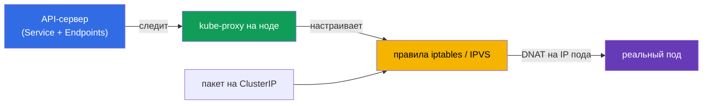
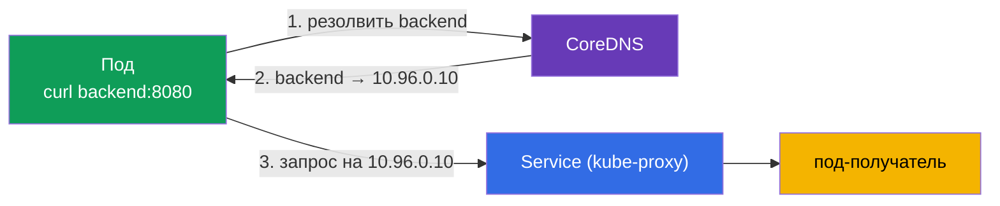
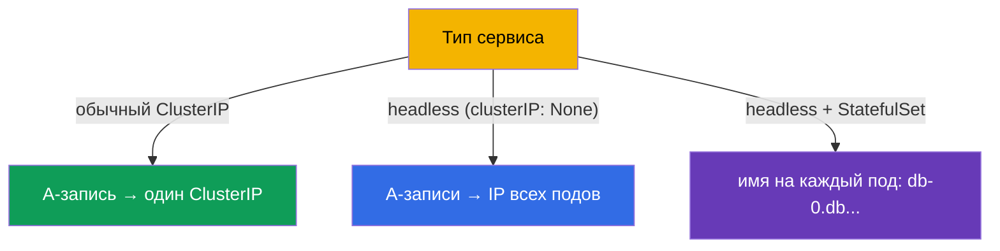
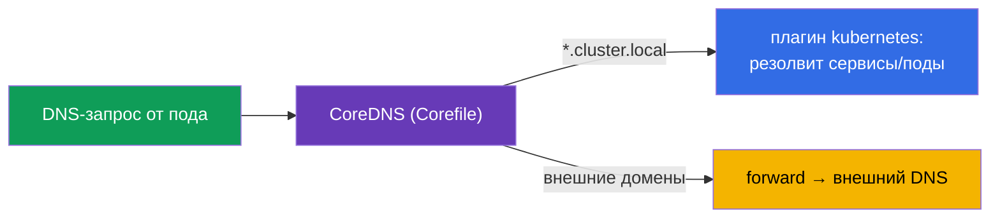
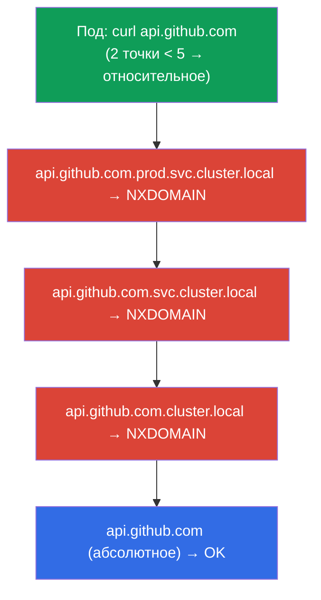
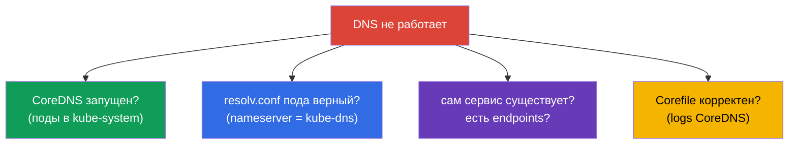

# Глава 31. Service изнутри, DNS и CoreDNS

> **Что дальше.** В главе 7 мы узнали, что такое Service и его типы. В главе 30 разобрали
> сеть подов. Теперь заглянем глубже: как kube-proxy на самом деле реализует Service
> (iptables/IPVS) и как работает DNS в кластере через **CoreDNS** - от имени сервиса до
> IP. Это домен Services & Networking обоих экзаменов и частая тема troubleshooting
> (глава 46): «DNS не резолвится» и «сервис не отвечает» - классические инциденты.

## 31.1. Как kube-proxy реализует Service

Вспомним из главы 7: ClusterIP - виртуальный, не принадлежит никакому интерфейсу. За
превращение обращений к этому IP в реальные поды отвечает **kube-proxy** на каждой ноде.
Он следит за сервисами и Endpoints и настраивает правила ядра.



kube-proxy работает в одном из режимов:

| Режим | Как работает | Масштабируемость |
|-------|--------------|------------------|
| **iptables** (по умолчанию) | цепочки правил iptables, DNAT на случайный под | хуже на тысячах сервисов (линейный перебор) |
| **IPVS** | ядровый балансировщик L4, хеш-таблицы | лучше на больших кластерах, больше алгоритмов |
| **eBPF** (Cilium, без kube-proxy) | балансировка в ядре через eBPF | самая высокая |

Ключевое: балансировка тут **L4** (по соединениям), kube-proxy не понимает HTTP. Для
L7-маршрутизации нужен Ingress (глава 32) или Gateway API (глава 33).

## 31.2. Зачем нужен DNS в кластере

Обращаться к сервисам по ClusterIP неудобно и хрупко (IP может смениться при
пересоздании сервиса). Поэтому у каждого Service есть стабильное **DNS-имя**, а
резолвит его встроенный DNS-сервер кластера - **CoreDNS**.



CoreDNS - это Deployment в `kube-system` (мы видели его в карте компонентов, глава 2),
перед которым стоит Service `kube-dns`. kubelet прописывает подам этот DNS-сервер в
`/etc/resolv.conf`, поэтому любые DNS-запросы пода идут в CoreDNS.

## 31.3. Формат DNS-имён сервисов

Полное DNS-имя сервиса (FQDN) строится по строгому шаблону - его надо знать:

```
<service>.<namespace>.svc.<cluster-domain>
backend.prod.svc.cluster.local
```


На практике полное имя пишут редко - работает сокращение в зависимости от того, откуда
обращаемся:

| Откуда обращаемся | Как обращаться |
|-------------------|----------------|
| тот же namespace | `backend` |
| другой namespace | `backend.prod` |
| откуда угодно (FQDN) | `backend.prod.svc.cluster.local` |

Это работает благодаря `search`-доменам в `/etc/resolv.conf` пода: короткое имя
достраивается до полного автоматически.

## 31.4. DNS для подов и headless-сервисов

Записи заводятся не только для сервисов:

- **Обычный Service** → A-запись на ClusterIP (одно имя → один виртуальный IP).
- **Headless-сервис** (`clusterIP: None`, глава 7) → A-записи на **IP всех подов** (имя
  → список реальных IP). Так клиент видит отдельные поды.
- **Под StatefulSet** через headless-сервис → стабильное имя каждого пода:
  `<pod>.<service>.<namespace>.svc.cluster.local` (например,
  `db-0.db.default.svc.cluster.local`, глава 11).



## 31.5. Настройка CoreDNS: Corefile

CoreDNS конфигурируется через **Corefile**, который лежит в ConfigMap `coredns` в
`kube-system`. Типичный Corefile:

```
.:53 {
    errors
    health
    kubernetes cluster.local in-addr.arpa ip6.arpa {   # обслуживает домен кластера
       pods insecure
       fallthrough in-addr.arpa ip6.arpa
    }
    forward . /etc/resolv.conf      # внешние домены — вышестоящему DNS
    cache 30
    loop
    reload
}
```



Изменения в кластерные DNS (например, добавить пересылку определённого домена на
корпоративный DNS) вносят правкой этого ConfigMap:

```bash
kubectl get configmap coredns -n kube-system -o yaml
kubectl edit configmap coredns -n kube-system
kubectl rollout restart deployment coredns -n kube-system   # применить
```

## 31.6. dnsPolicy пода

Как под получает DNS-настройки, задаёт `dnsPolicy`:

| dnsPolicy | Поведение |
|-----------|-----------|
| `ClusterFirst` (по умолчанию) | кластерные имена → CoreDNS, внешние → вышестоящий DNS |
| `Default` | наследует DNS ноды (не использует CoreDNS для кластерных имён) |
| `None` | полностью кастомный DNS через `dnsConfig` |
| `ClusterFirstWithHostNet` | как ClusterFirst, но для подов с hostNetwork |

Почти всегда работает `ClusterFirst` - под резолвит и внутрикластерные имена (через
CoreDNS), и внешние (через forward). Менять `dnsPolicy` нужно редко.

## 31.7. ndots:5 и search-домены: скрытая причина медленного DNS

Мы видели (31.3), что короткие имена достраиваются через `search`-домены. Управляет этим
опция **`ndots`** в `/etc/resolv.conf` пода. kubelet прописывает подам такой файл:

```text
nameserver 10.96.0.10
search prod.svc.cluster.local svc.cluster.local cluster.local
options ndots:5
```

**Что значит `ndots:5`.** Если в запрашиваемом имени **меньше 5 точек**, резолвер сначала
считает имя относительным и по очереди подставляет каждый search-домен; только когда все
попытки вернули NXDOMAIN, он пробует имя как абсолютное (как есть).

Для кластерных имён это удобно: `backend` (0 точек) быстро достраивается до
`backend.prod.svc.cluster.local`. Но для **внешних** имён это дорого.



`api.github.com` имеет 2 точки (< 5), поэтому сначала уходят **три бесполезных запроса** с
search-суффиксами и лишь четвёртый - настоящий. А так как резолвер обычно спрашивает и
A, и AAAA (IPv4 и IPv6), число запросов **удваивается** - до 8 вместо 2. На нагруженном
сервисе с тысячами исходящих обращений это заметная задержка и лишняя нагрузка на CoreDNS.

**Как чинят:**

| Приём | Как | Когда |
|-------|-----|-------|
| **FQDN с точкой в конце** | `api.github.com.` (завершающая точка = абсолютное имя) | быстрый фикс в коде/конфиге приложения |
| **Имя с ≥ 5 точками** | уже не проходит через search | естественно для длинных FQDN |
| **Понизить `ndots` для пода** | `dnsConfig.options: ndots=1..2` | приложение ходит в основном во внешние домены |
| **NodeLocal DNSCache** | локальный кеш на ноде (31.9) | снижает цену промахов на всём кластере |

Понижение `ndots` на уровне пода задают через `dnsConfig` (работает с любым `dnsPolicy`):

```yaml
apiVersion: v1
kind: Pod
metadata: {name: web}
spec:
  dnsConfig:
    options:
    - {name: ndots, value: "2"}    # меньше лишних попыток для внешних имён
  containers:
  - {name: web, image: nginx}
```

> **Компромисс.** Слишком маленький `ndots` (например, 1) ускоряет внешние запросы, но
> ломает обращения к сервисам из **другого** namespace по короткому `backend.prod` (2
> точки уже считаются абсолютным именем и search не подставится). Поэтому обычно берут
> `2`, либо оставляют дефолт `5` и правят проблемные внешние имена FQDN с точкой в конце.

Проверить настройки пода:

```bash
kubectl exec <pod> -- cat /etc/resolv.conf       # search-домены и options ndots
```

## 31.8. Отладка DNS

«DNS не резолвится» - частый инцидент. Порядок проверки:

```bash
# Проверить резолвинг изнутри пода
kubectl exec -it <pod> -- nslookup backend
kubectl exec -it <pod> -- nslookup backend.prod.svc.cluster.local

# Проверить /etc/resolv.conf пода (какой DNS, какие search-домены)
kubectl exec <pod> -- cat /etc/resolv.conf

# Жив ли CoreDNS
kubectl get pods -n kube-system -l k8s-app=kube-dns
kubectl logs -n kube-system -l k8s-app=kube-dns

# Есть ли сам сервис и его endpoints (глава 7)
kubectl get svc backend
kubectl get endpoints backend
```



Типичная ловушка: имя резолвится, но `nslookup` возвращает пусто → сервис есть, но
Endpoints пуст (селектор не совпал / поды не готовы, глава 7). То есть проблема не в DNS,
а в связке сервиса с подами.

## 31.9. Как это применяют в продакшене

- **CoreDNS - критичный компонент.** От него зависит связность всех сервисов. Его падение
  или перегрузка (много запросов, узкий лимит) - серьёзный инцидент: приложения перестают
  находить друг друга. Поэтому CoreDNS мониторят и дают ему запас ресоурсов, часто
  масштабируют по числу нод.
- **DNS-кеш и производительность.** На больших кластерах ставят **NodeLocal DNSCache**
  (DaemonSet с локальным DNS-кешем на каждой ноде), чтобы снизить нагрузку на CoreDNS и
  задержки резолвинга - частая оптимизация.
- **IPVS для больших кластеров.** При тысячах сервисов iptables-режим kube-proxy
  замедляется (линейный перебор правил); в проде переходят на IPVS или на Cilium (eBPF).
- **Кастомная пересылка доменов.** Через Corefile настраивают forward корпоративных
  доменов на внутренний DNS, stub-домены, split-horizon - чтобы поды резолвили и внешние
  корпоративные имена.
- **DNS-проблемы - топ причин инцидентов.** «Приложение не видит зависимость» очень часто
  оказывается DNS (перегруженный CoreDNS, неверный resolv.conf, пустые Endpoints).
  Понимание цепочки имя→CoreDNS→Service→Endpoints экономит часы разбора.

## 31.10. Мини-глоссарий

- **kube-proxy** - реализует Service на ноде через iptables/IPVS (балансировка L4).
- **iptables / IPVS режимы** - способы реализации сервисов; IPVS лучше масштабируется.
- **CoreDNS** - DNS-сервер кластера (Deployment в kube-system за Service kube-dns).
- **FQDN сервиса** - `<service>.<namespace>.svc.cluster.local`.
- **search-домены** - суффиксы в resolv.conf, достраивающие короткие имена.
- **ndots** - порог точек в имени: меньше него имя сначала пробуется с search-суффиксами
  (по умолчанию `ndots:5`, отсюда лишние запросы для внешних имён).
- **dnsConfig** - точечная настройка DNS пода (в т.ч. `options ndots`), работает при любом dnsPolicy.
- **Corefile** - конфигурация CoreDNS (в ConfigMap `coredns`).
- **dnsPolicy** - как под получает DNS (ClusterFirst и др.).
- **NodeLocal DNSCache** - локальный DNS-кеш на каждой ноде.

## 31.11. Итоги главы

- kube-proxy реализует Service на каждой ноде через iptables (по умолчанию) или IPVS
  (лучше для больших кластеров); балансировка L4, без понимания HTTP.
- DNS-имена сервисов резолвит CoreDNS - Deployment в kube-system за Service kube-dns;
  подам он прописан в resolv.conf.
- FQDN: `<service>.<namespace>.svc.cluster.local`; из того же namespace достаточно
  короткого имени (благодаря search-доменам).
- Записи заводятся для сервисов (A на ClusterIP), headless (A на IP всех подов) и подов
  StatefulSet (стабильное имя каждого).
- CoreDNS настраивается через Corefile (ConfigMap `coredns`): плагин kubernetes для
  домена кластера, forward для внешних.
- `ndots:5` в resolv.conf пода заставляет внешние имена (мало точек) сначала перебирать
  search-домены - лишние NXDOMAIN-запросы и задержки; чинят FQDN с точкой в конце,
  `dnsConfig` с меньшим `ndots` или NodeLocal DNSCache.
- Отладка DNS: nslookup изнутри, resolv.conf, живость CoreDNS, наличие сервиса и
  Endpoints (пустой Endpoints ≠ проблема DNS).

## 31.12. Как это пригодится: на экзамене и в реальной работе

**На экзамене.** «Настрой/почини CoreDNS», «почему под не резолвит сервис», «обратись к
сервису из другого namespace» - типовые задания. Нужно знать формат FQDN, где лежит
Corefile, и уметь отлаживать через nslookup/resolv.conf/endpoints. Это ядро сетевого
troubleshooting (30% CKA).

**В реальной работе.** CoreDNS - критичный для связности компонент; понимание его
конфигурации и отладки напрямую влияет на разбор инцидентов «сервис не находится». Выбор
режима kube-proxy (IPVS/eBPF) и NodeLocal DNSCache - оптимизации для больших кластеров.
DNS - одна из самых частых причин сетевых проблем в проде.

## 31.13. Вопросы для самопроверки

1. Как kube-proxy превращает обращение к ClusterIP в трафик к поду? На каком уровне
   балансирует?
2. Чем режим IPVS лучше iptables и когда это важно?
3. Что такое CoreDNS, где он работает и как поды узнают о нём?
4. Запишите FQDN сервиса `web` в namespace `shop`. Как обратиться к нему из того же
   namespace?
5. Чем DNS-записи headless-сервиса отличаются от обычного?
6. Где и как настраивается CoreDNS? Как применить изменения?
7. Что означает `ndots:5` в resolv.conf пода и почему из-за него внешние имена резолвятся
   медленнее? Как это исправить?
8. Как отлаживать «под не резолвит сервис» и почему пустой Endpoints - это не проблема
   DNS?

## Практика

Мы разобрали внутренности сервисов и DNS. В главе 32 поднимемся на L7 - Ingress и
Ingress-контроллеры, дающие маршрутизацию по хостам и путям. CoreDNS и kube-proxy
отрабатываются в лабах по сети и troubleshooting.

🧪 Лаба 125 (DNS и CoreDNS: A-записи, headless, ndots/dnsConfig, Corefile): [tasks/cka/labs/125](../../labs/125/README_RU.MD)

🧪 Лаба 118 (в т.ч. починка CoreDNS): [tasks/cka/labs/118](../../labs/118/README_RU.MD)

---
[Оглавление](../README_RU.md) · [Глава 30](../30/ru.md) · [Глава 32](../32/ru.md)
