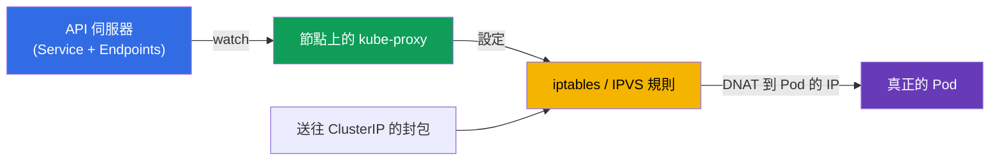
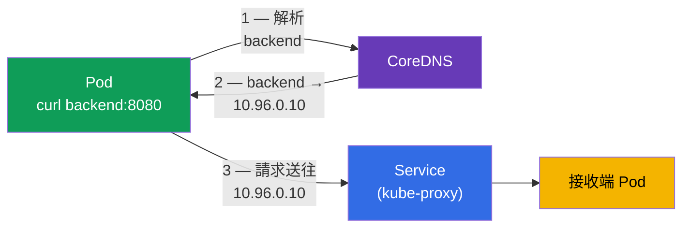
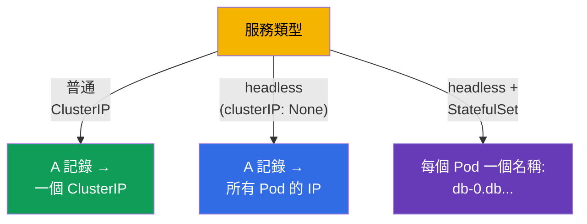
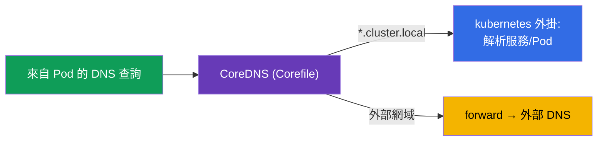
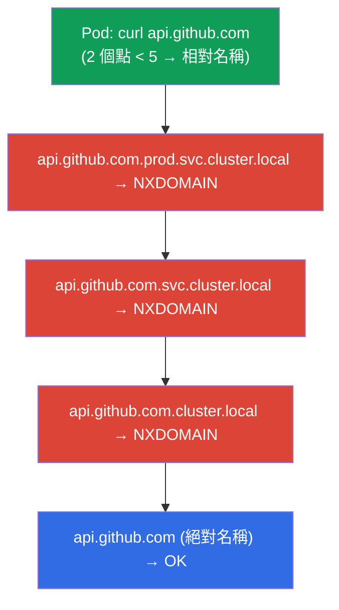
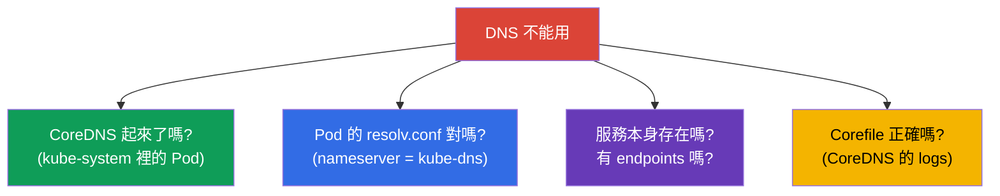

[Русская версия](ru.md) · [Eng version](README.md) · [Versión en español](es.md) · [Version française](fr.md) · [Deutsche Version](de.md) · [ქართული ვერსია](ge.md) · [日本語版](jp.md)

# 第 31 章。Service 的內部運作、DNS 與 CoreDNS

> **接下來是什麼。** 在第 7 章我們認識了什麼是 Service 以及它的類型。在第 30 章拆解了
> Pod 網路。現在往更深處看:kube-proxy 實際上是怎麼實作 Service 的
> (iptables/IPVS),以及叢集裡的 DNS 怎麼透過 **CoreDNS** 運作 - 從服務名稱到
> IP。這屬於兩場考試的 Services & Networking 領域,也是 troubleshooting
> (第 46 章)的常見主題:「DNS 解不出來」與「服務沒有回應」是經典的事故。

## 31.1. kube-proxy 如何實作 Service

回想第 7 章:ClusterIP 是虛擬的,不屬於任何介面。把對這個 IP 的連線轉成真正的 Pod,是
每個節點上的 **kube-proxy** 負責的事。它 watch Service 與 Endpoints,並設定核心規則。



kube-proxy 會以其中一種模式運作:

| 模式 | 如何運作 | 可擴展性 |
|-------|--------------|------------------|
| **iptables** (預設) | iptables 規則鏈,DNAT 到隨機的 Pod | 在數千個服務時較差(線性掃過規則) |
| **IPVS** | 核心層的 L4 負載平衡器,雜湊表 | 大叢集表現更好,演算法也更多 |
| **eBPF** (Cilium,不用 kube-proxy) | 在核心中透過 eBPF 做負載平衡 | 最高 |

關鍵在於:這裡的負載平衡是 **L4**(依連線),kube-proxy 看不懂 HTTP。要做 L7 路由就需要
Ingress(第 32 章)或 Gateway API(第 33 章)。

> **kube-proxy 不讓流量穿過自己。** 這點值得再說一次(也可參考第 2 章):kube-proxy 是
> 節點上服務規則的「control plane」,而不是「data plane」。它只 **設定核心規則**
> (iptables/IPVS),而封包從用戶端到 Pod 是 **直接經由核心** 走的,不會經過
> kube-proxy 這個行程。上面的圖就看得出來:`封包 → 規則 → Pod` 這條箭頭並沒有穿過
> kube-proxy 這個節點。
>
> 由此得到一個實務結論:**重新啟動或升級 kube-proxy 不會中斷流量。** 在行程重啟的那段
> 時間,已經設進核心的規則還留在原地,繼續服務既有以及新的連線。暫時「凍結」的只有規則
> 的 **更新** - 在 kube-proxy 重新起來之前,新的 Service/Endpoints 不會出現,被刪掉的
> 也不會被移除。所以升級 kube-proxy(DaemonSet)是一項不會讓服務流量停機的常規操作。

> **負載平衡發生在發送端的節點上。** 當一個 Pod 透過 ClusterIP 連到服務時,選出具體後端
> Pod(DNAT)這件事是由 **執行發送端 Pod 的那個節點** 上的核心規則完成的 - 因為
> kube-proxy 在每個節點都設了一模一樣的規則。也就是說,「這條連線會進到服務的哪一個
> Pod」是在本地決定的,而且是在封包還沒離開節點之前就決定了。位址被換掉之後,封包就
> **直接** 沿著 Pod 網路走到選中的後端 - 不管它在同一個節點還是在另一個節點,都不會有
> 中間的「proxy hop」。
>
> 實務上的結論:
>
> - 不存在一個所有服務流量都要穿過的單一點 - 負載平衡被分散到各個來源節點上,因此擴展
>   性很好;
> - 後端的選擇是在 **連線層級**(L4)進行:同一個 TCP 連線的所有封包都會落到同一個
>   Pod,而新的連線可能會去到另一個;
> - 在預設情況下(`externalTrafficPolicy`/`internalTrafficPolicy: Cluster`),接收端
>   Pod 可能落在任何節點上;因為 Pod 網路是扁平的(第 30 章),這是正常的。

## 31.2. 叢集裡為什麼需要 DNS

用 ClusterIP 連服務既不方便又脆弱(重建服務時 IP 可能會變)。所以每個 Service 都有一個
穩定的 **DNS 名稱**,由叢集內建的 DNS 伺服器 - **CoreDNS** - 來解析它。



CoreDNS 是 `kube-system` 裡的一個 Deployment(我們在元件地圖裡看過它,第 2 章),它前面
擺著 Service `kube-dns`。kubelet 會把這個 DNS 伺服器寫進 Pod 的
`/etc/resolv.conf`,所以 Pod 的任何 DNS 查詢都會送到 CoreDNS。

## 31.3. 服務 DNS 名稱的格式

服務的完整 DNS 名稱(FQDN)是照著嚴格的樣板組成的 - 這是必須知道的:

```
<service>.<namespace>.svc.<cluster-domain>
backend.prod.svc.cluster.local
```


實務上很少寫完整名稱 - 依照從哪裡連過去,可以用縮寫:

| 從哪裡連 | 怎麼連 |
|-------------------|----------------|
| 同一個 namespace | `backend` |
| 另一個 namespace | `backend.prod` |
| 任何地方(FQDN) | `backend.prod.svc.cluster.local` |

這要感謝 Pod 的 `/etc/resolv.conf` 裡的 `search` 網域:短名稱會自動被補成完整名稱。

## 31.4. Pod 與 headless 服務的 DNS

不只服務會有記錄:

- **普通的 Service** → 指向 ClusterIP 的 A 記錄(一個名稱 → 一個虛擬 IP)。
- **headless 服務**(`clusterIP: None`,第 7 章)→ 指向 **所有 Pod 的 IP** 的 A 記錄
  (名稱 → 一串真實 IP)。這樣用戶端就看得到個別的 Pod。
- **StatefulSet 的 Pod** 透過 headless 服務 → 每個 Pod 都有穩定的名稱:
  `<pod>.<service>.<namespace>.svc.cluster.local`(例如
  `db-0.db.default.svc.cluster.local`,第 11 章)。



## 31.5. 設定 CoreDNS:Corefile

CoreDNS 是透過 **Corefile** 設定的,它放在 `kube-system` 的 ConfigMap `coredns`
裡。典型的 Corefile:

```
.:53 {
    errors
    health
    kubernetes cluster.local in-addr.arpa ip6.arpa {   # 服務叢集網域
       pods insecure
       fallthrough in-addr.arpa ip6.arpa
    }
    forward . /etc/resolv.conf      # 外部網域 — 交給上游 DNS
    cache 30
    loop
    reload
}
```



要改叢集 DNS(例如把某個特定網域轉送到企業內部 DNS),就是去編輯這個 ConfigMap:

```bash
kubectl get configmap coredns -n kube-system -o yaml
kubectl edit configmap coredns -n kube-system
kubectl rollout restart deployment coredns -n kube-system   # 套用
```

## 31.6. Pod 的 dnsPolicy

Pod 怎麼取得 DNS 設定,是由 `dnsPolicy` 決定的:

| dnsPolicy | 行為 |
|-----------|-----------|
| `ClusterFirst` (預設) | 叢集名稱 → CoreDNS,外部名稱 → 上游 DNS |
| `Default` | 繼承節點的 DNS(叢集名稱不走 CoreDNS) |
| `None` | 透過 `dnsConfig` 完全自訂 DNS |
| `ClusterFirstWithHostNet` | 跟 ClusterFirst 一樣,但用於 hostNetwork 的 Pod |

幾乎都是用 `ClusterFirst` - Pod 既能解析叢集內部名稱(透過 CoreDNS),也能解析外部名稱
(透過 forward)。需要改 `dnsPolicy` 的情況很少。

## 31.7. ndots:5 與 search 網域:DNS 變慢的隱藏原因

我們看過(31.3),短名稱會透過 `search` 網域被補完。控制這件事的是 Pod
`/etc/resolv.conf` 裡的 **`ndots`** 選項。kubelet 寫進 Pod 的檔案長這樣:

```text
nameserver 10.96.0.10
search prod.svc.cluster.local svc.cluster.local cluster.local
options ndots:5
```

**`ndots:5` 是什麼意思。** 如果要查的名稱裡 **少於 5 個點**,解析器會先把它當成相對名稱,
依序把每一個 search 網域接上去;只有當所有嘗試都回 NXDOMAIN,它才會把名稱當成絕對名稱
(原樣)來試。

對叢集名稱來說這很方便:`backend`(0 個點)會很快被補成
`backend.prod.svc.cluster.local`。但對 **外部** 名稱來說,代價就很高了。



`api.github.com` 有 2 個點(< 5),所以會先發出 **三個沒用的查詢** 帶著 search 後綴,只有
第四個才是真的。而因為解析器通常會同時問 A 與 AAAA(IPv4 與 IPv6),查詢數量還會
**加倍** - 變成 8 個而不是 2 個。在一個有數千條對外連線的高負載服務上,這就是明顯的延遲
以及 CoreDNS 的額外負擔。

**怎麼修:**

| 手法 | 怎麼做 | 什麼時候用 |
|-------|-----|-------|
| **結尾帶點的 FQDN** | `api.github.com.`(結尾的點 = 絕對名稱) | 在應用程式程式碼/設定裡的快速修法 |
| **有 ≥ 5 個點的名稱** | 本來就不會走 search | 對長 FQDN 來說很自然 |
| **把 Pod 的 `ndots` 調低** | `dnsConfig.options: ndots=1..2` | 應用程式主要是往外部網域跑 |
| **NodeLocal DNSCache** | 節點上的本地快取(31.9) | 降低整個叢集的 miss 成本 |

在 Pod 層級調低 `ndots` 是透過 `dnsConfig` 設定的(任何 `dnsPolicy` 都適用):

```yaml
apiVersion: v1
kind: Pod
metadata:
  name: web
spec:
  dnsConfig:
    options:
    - name: ndots
      value: "2"                   # 外部名稱少一些多餘的嘗試
  containers:
  - name: web
    image: nginx
```

> **取捨。** `ndots` 太小(例如 1)會讓外部查詢變快,但會弄壞用短名稱 `backend.prod`
> 連到 **另一個** namespace 服務的情況(2 個點就已經被當成絕對名稱,search 不會被接
> 上)。所以通常會取 `2`,或者保留預設的 `5`,然後把有問題的外部名稱改成結尾帶點的 FQDN。

檢查 Pod 的設定:

```bash
kubectl exec <pod> -- cat /etc/resolv.conf       # search 網域與 options ndots
```

## 31.8. DNS 除錯

「DNS 解不出來」是常見的事故。檢查順序:

```bash
# 從 Pod 內部檢查解析
kubectl exec -it <pod> -- nslookup backend
kubectl exec -it <pod> -- nslookup backend.prod.svc.cluster.local

# 檢查 Pod 的 /etc/resolv.conf (哪個 DNS,哪些 search 網域)
kubectl exec <pod> -- cat /etc/resolv.conf

# CoreDNS 還活著嗎
kubectl get pods -n kube-system -l k8s-app=kube-dns
kubectl logs -n kube-system -l k8s-app=kube-dns

# 服務本身以及它的 endpoints 存在嗎 (第 7 章)
kubectl get svc backend
kubectl get endpoints backend
```



典型的陷阱:名稱解得出來,但 `nslookup` 回傳空的 → 服務存在,但 Endpoints 是空的
(selector 沒對上 / Pod 沒有 ready,第 7 章)。也就是說問題不在 DNS,而在服務與 Pod 的
連結上。

## 31.9. 這在生產環境中如何應用

- **CoreDNS 是關鍵元件。** 所有服務之間的連通性都依賴它。它掛掉或過載(查詢太多、limit
  太小)是嚴重的事故:應用程式會找不到彼此。所以大家會監控 CoreDNS 並給它足夠的資源餘
  裕,而且常常依節點數量來擴充。
- **DNS 快取與效能。** 大叢集會裝 **NodeLocal DNSCache**(在每個節點上跑一個帶本地 DNS
  快取的 DaemonSet),用來降低 CoreDNS 的負載與解析延遲 - 這是很常見的優化。
- **大叢集用 IPVS。** 服務有數千個時,kube-proxy 的 iptables 模式會變慢(線性掃過規
  則);生產環境會轉到 IPVS 或 Cilium(eBPF)。
- **自訂網域轉送。** 透過 Corefile 設定把企業網域 forward 到內部 DNS、stub 網域、
  split-horizon - 讓 Pod 也能解析外部的企業名稱。
- **DNS 問題是事故原因的前幾名。** 「應用程式看不到它的依賴」很常最後查出來是 DNS
  (CoreDNS 過載、resolv.conf 不對、Endpoints 是空的)。理解
  名稱→CoreDNS→Service→Endpoints 這條鏈,能省下好幾個小時的排查。

## 31.10. 小詞彙表

- **kube-proxy** - 在節點上透過 iptables/IPVS 實作 Service(L4 負載平衡)。
- **iptables / IPVS 模式** - 實作服務的兩種方式;IPVS 的擴展性更好。
- **CoreDNS** - 叢集的 DNS 伺服器(kube-system 裡的 Deployment,前面是 Service kube-dns)。
- **服務的 FQDN** - `<service>.<namespace>.svc.cluster.local`。
- **search 網域** - resolv.conf 裡的後綴,用來補完短名稱。
- **ndots** - 名稱中點數的門檻:比它少的名稱會先帶著 search 後綴嘗試
  (預設是 `ndots:5`,外部名稱的多餘查詢就是從這來的)。
- **dnsConfig** - Pod DNS 的細部設定(包含 `options ndots`),在任何 dnsPolicy 下都有效。
- **Corefile** - CoreDNS 的設定(在 ConfigMap `coredns` 裡)。
- **dnsPolicy** - Pod 怎麼取得 DNS(ClusterFirst 等等)。
- **NodeLocal DNSCache** - 每個節點上的本地 DNS 快取。

## 31.11. 本章總結

- kube-proxy 在每個節點上透過 iptables(預設)或 IPVS(大叢集比較好)實作
  Service;負載平衡是 L4,看不懂 HTTP。
- 服務的 DNS 名稱由 CoreDNS 解析 - 它是 kube-system 裡的 Deployment,前面是 Service
  kube-dns;它被寫進 Pod 的 resolv.conf。
- FQDN:`<service>.<namespace>.svc.cluster.local`;在同一個 namespace 內只要短名稱就夠了
  (多虧 search 網域)。
- 記錄會為服務(A 指向 ClusterIP)、headless(A 指向所有 Pod 的 IP)以及 StatefulSet 的
  Pod(每一個都有穩定名稱)建立。
- CoreDNS 透過 Corefile(ConfigMap `coredns`)設定:kubernetes 外掛負責叢集網域,
  forward 負責外部。
- Pod resolv.conf 裡的 `ndots:5` 會讓外部名稱(點很少)先去輪過 search 網域 - 產生多餘的
  NXDOMAIN 查詢與延遲;修法是結尾帶點的 FQDN、用 `dnsConfig` 把 `ndots` 調小,或者
  NodeLocal DNSCache。
- DNS 除錯:從內部 nslookup、resolv.conf、CoreDNS 是否活著、服務與 Endpoints 是否存在
  (Endpoints 是空的 ≠ DNS 有問題)。

## 31.12. 這些知識用在哪:考試與實際工作

**在考試上。** 「設定/修好 CoreDNS」、「為什麼 Pod 解不出服務」、「從另一個 namespace 連到
服務」都是典型題目。需要知道 FQDN 的格式、Corefile 放在哪裡,以及會用
nslookup/resolv.conf/endpoints 來除錯。這是網路 troubleshooting 的核心(CKA 的 30%)。

**在實際工作中。** CoreDNS 是對連通性至關重要的元件;理解它的設定與除錯,直接影響
「服務找不到」這類事故的排查。kube-proxy 模式的選擇(IPVS/eBPF)與 NodeLocal DNSCache 是
給大叢集的優化。DNS 是生產環境網路問題最常見的原因之一。

## 31.13. 自我檢查問題

1. kube-proxy 怎麼把對 ClusterIP 的連線變成到 Pod 的流量?它在哪一層做負載平衡?
2. IPVS 模式比 iptables 好在哪裡,什麼時候這件事很重要?
3. CoreDNS 是什麼,它跑在哪裡,Pod 又是怎麼知道它的?
4. 寫出 namespace `shop` 裡服務 `web` 的 FQDN。從同一個 namespace 要怎麼連到它?
5. headless 服務的 DNS 記錄跟普通服務有什麼不同?
6. CoreDNS 在哪裡、怎麼設定?怎麼讓變更生效?
7. Pod resolv.conf 裡的 `ndots:5` 是什麼意思,為什麼它會讓外部名稱解析變慢?怎麼修?
8. 「Pod 解不出服務」要怎麼除錯,為什麼 Endpoints 是空的並不是 DNS 的問題?

## 實踐

我們拆解了服務的內部運作與 DNS。在第 32 章我們會往上走到 L7 - Ingress 與 Ingress
控制器,它們提供依主機與路徑的路由。CoreDNS 與 kube-proxy 會在網路與 troubleshooting 的
實驗裡練到。

🧪 實驗 125(DNS 與 CoreDNS:A 記錄、headless、ndots/dnsConfig、Corefile):[tasks/cka/labs/125](../../labs/125/README_TW.MD)

🧪 實驗 118(其中包含修好 CoreDNS):[tasks/cka/labs/118](../../labs/118/README_TW.MD)

🎮 Killercoda（在瀏覽器中，無需安裝）：[Test DNS Resolution](https://killercoda.com/chadmcrowell/course/ckad/dns-resolution) · [Modify Cluster DNS](https://killercoda.com/chadmcrowell/course/cka/modify-cluster-dns) · [Resolve Service IP from Pod](https://killercoda.com/chadmcrowell/course/cka/communicate-with-svc) · [Create a Headless Service](https://killercoda.com/chadmcrowell/course/ckad/headless-service)

---
[目錄](../README_TW.md) · [第 30 章](../30/tw.md) · [第 32 章](../32/tw.md)
