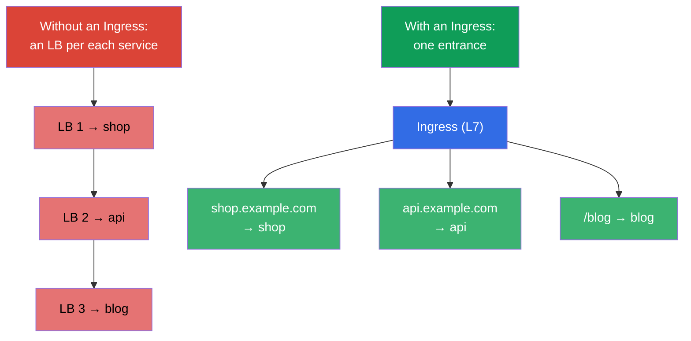
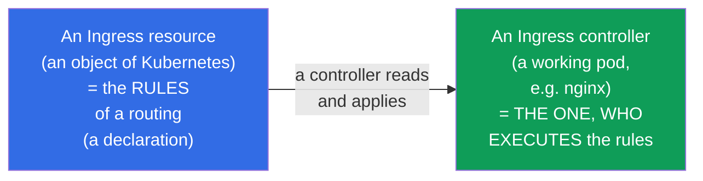
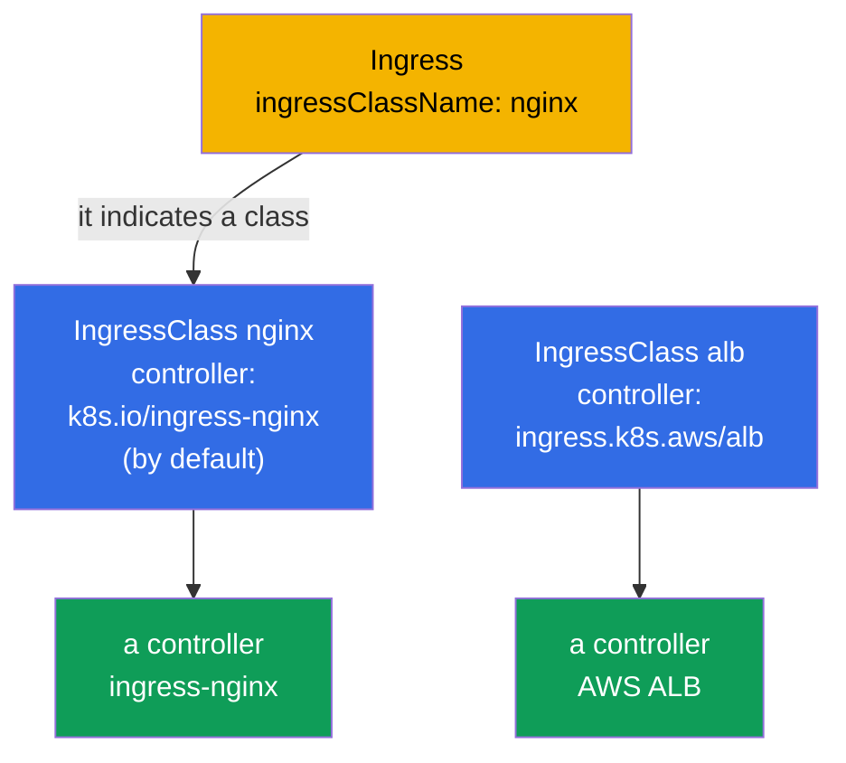
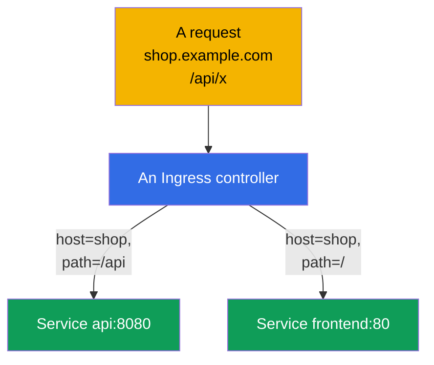
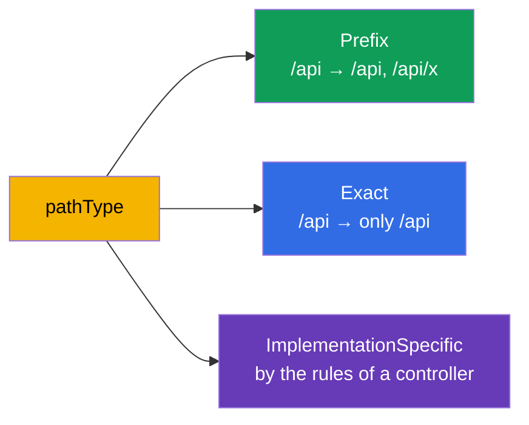
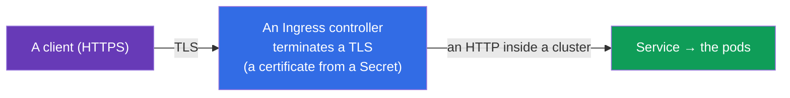
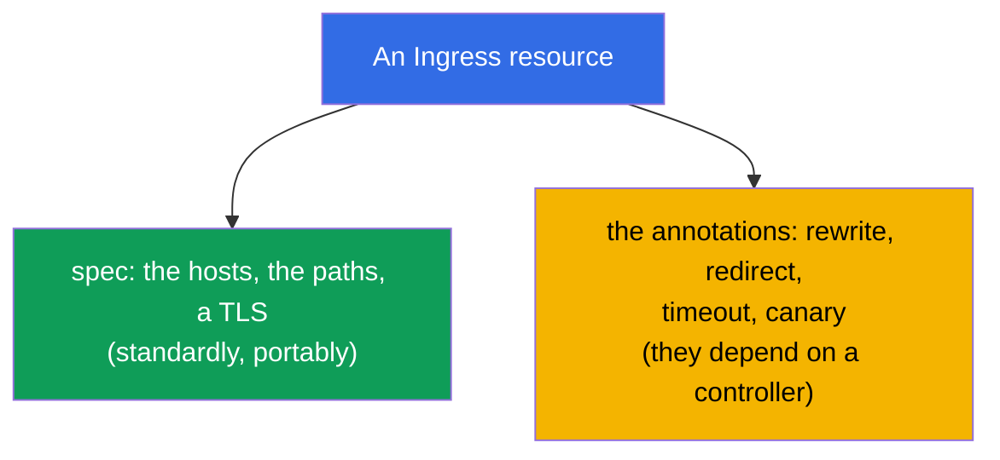

[Русская версия](ru.md) · [Versión en español](es.md) · [Version française](fr.md) · [Deutsche Version](de.md) · [ქართული ვერსია](ge.md) · [繁體中文版](tw.md) · [日本語版](jp.md)

# Chapter 32. An Ingress and the Ingress controllers

> **What comes next.** A Service of a type NodePort/LoadBalancer (the chapter 7) exposes outside one
> service per one port/address - on the dozens of the services this is expensive and inconvenient. An **Ingress**
> solves this on a level L7: one entrance, and further a routing by the hosts and the paths onto the different
> services, plus a TLS. This is the domain Services & Networking of the both exams. Let us consider a link
> an Ingress resource + an Ingress controller, the rules of a routing and a TLS.

## 32.1. A problem: how to let a traffic from the outside in economically

If each service is exposed through a LoadBalancer, we will get a cloud balancer (and a
bill) per each service. One entrance is needed, which itself will figure out, to which service a request
is intended - by a name of a host and by a path.



An Ingress works on an **L7** (HTTP/HTTPS): it understands the hosts, the paths, the headers - in contrast to
an L4 balancing of a Service (the chapter 7).

## 32.2. The two parts: an Ingress resource and an Ingress controller

This is a key difference, which is often confused. An Ingress consists of the two things:



- An **Ingress resource** is only a **declaration** of the rules ("a host shop.example.com → a service
  shop"). By itself it does nothing.
- An **Ingress controller** is a really working application in a cluster (nginx, Traefik,
  HAProxy, a cloud ALB controller), which reads the Ingress resources and sets up a
  corresponding routing.

> **The most important moment.** An Ingress resource without an installed controller **does not work** -
> there is simply nobody to execute the rules. In a cluster (kubeadm, minikube) an Ingress controller has to
> be installed separately; in the managed clusters usually they also put it themselves. This is a frequent
> reason of "I created an Ingress, and it does not answer".

## 32.3. The popular Ingress controllers

| A controller | A peculiarity |
|-----------|-------------|
| **ingress-nginx** | the most widespread one, on a base of nginx, the rich annotations |
| **Traefik** | an autoconfiguration, it is convenient for a dynamics |
| **HAProxy** | a performant one |
| **AWS ALB Controller** | it creates a cloud ALB under an Ingress (in an EKS) |
| **The cloud specific ones** | the GKE/AKS controllers |

Between the controllers there delimits an **IngressClass** - an object, indicating, which
controller serves a given Ingress (`ingressClassName` in a resource). Let us consider it
separately.

## 32.4. An IngressClass: which controller serves an Ingress

In a cluster there can work **several** Ingress controllers at once (for example, an ingress-nginx
for the internal services and a cloud ALB for the public ones). In order that each controller would understand,
which Ingress resources are **its own**, and which are the alien ones, there is an object **IngressClass**. An Ingress resource
refers to it by a field `spec.ingressClassName`.

```yaml
apiVersion: networking.k8s.io/v1
kind: IngressClass
metadata:
  name: nginx
  annotations:
    ingressclass.kubernetes.io/is-default-class: "true"   # a class by default
spec:
  controller: k8s.io/ingress-nginx      # an identifier of an implementation of a controller
```



To look, which classes there are in a cluster and which of them is a default one:

```bash
# a list of the classes and of their controllers
kubectl get ingressclass
# NAME    CONTROLLER              PARAMETERS   AGE
# nginx   k8s.io/ingress-nginx    <none>       10d

# which class is marked as a default one (by an annotation is-default-class)
kubectl get ingressclass -o jsonpath='{range .items[*]}{.metadata.name}{"\t"}{.metadata.annotations.ingressclass\.kubernetes\.io/is-default-class}{"\n"}{end}'

# the details of a concrete class (controller, the parameters)
kubectl describe ingressclass nginx

# which class the existing Ingress really use
kubectl get ingress -A -o custom-columns=NS:.metadata.namespace,NAME:.metadata.name,CLASS:.spec.ingressClassName
```

What is important to know:

- **`spec.controller`** is an immutable identifier of an implementation (for example,
  `k8s.io/ingress-nginx`), which a controller itself has "staked out". You choose a class by its
  **name** (`nginx`), and a controller serves all the Ingress with this class.
- **An IngressClass is a cluster-scoped** object (it is not tied to a namespace, the chapter 6), and the
  Ingress resources are namespaced and they refer to a class from any namespace.
- **A class by default.** An annotation `ingressclass.kubernetes.io/is-default-class: "true"`
  makes a class a default one: an Ingress **without** an `ingressClassName` will then get to it.
  A default class must be a single one - otherwise you will get an error/an ambiguity.
- **If there is no class and there is no default one either** - an Ingress remains "nobody's": not a single
  controller will pick it up, and it silently does not work. This is one of the frequent reasons of "I created
  an Ingress, and it does not answer".
- **An obsolete annotation.** Earlier a class was set by an annotation
  `kubernetes.io/ingress.class` right on an Ingress. In a `networking.k8s.io/v1` a field
  `ingressClassName` has replaced it; some controllers still understand an old annotation for the sake of
  a compatibility, but in the new manifests they use a field.

## 32.5. A manifest of an Ingress: a routing by the hosts and the paths

```yaml
apiVersion: networking.k8s.io/v1
kind: Ingress
metadata:
  name: shop
  annotations:
    nginx.ingress.kubernetes.io/rewrite-target: /
spec:
  ingressClassName: nginx        # which controller serves
  rules:
  - host: shop.example.com       # a routing by a host
    http:
      paths:
      - path: /api               # and by a path
        pathType: Prefix
        backend:
          service:
            name: api
            port:
              number: 8080
      - path: /
        pathType: Prefix
        backend:
          service:
            name: frontend
            port:
              number: 80
```



An Ingress routes onto a **Service** (and not directly onto the pods) - that is, it is built over
everything, that we considered in the chapters 7 and 31.

## 32.6. A pathType: how the paths are matched

A field `pathType` defines a way of a comparison of a path - a frequent subtlety:

| pathType | How it matches |
|----------|------------------|
| `Prefix` | by the segments of a path: `/api` will match with `/api`, `/api/x`, but not with `/apixyz` |
| `Exact` | an exact match of a path as a whole |
| `ImplementationSpecific` | at a discretion of a controller (often as a regex) |



## 32.7. A TLS in an Ingress

An Ingress is able to terminate an HTTPS: to decrypt a TLS on an entrance, further into a cluster a traffic
goes by an HTTP. A certificate and a key are taken from a Secret of a type `kubernetes.io/tls` (the chapter 19).

```yaml
spec:
  tls:
  - hosts:
    - shop.example.com
    secretName: shop-tls          # a Secret with a tls.crt and a tls.key
  rules:
  - host: shop.example.com
    http:
      paths: [...]
```



The certificates are created manually (`kubectl create secret tls`) or automatically through a
**cert-manager** - an operator, which issues and renews the certificates (for example, from
Let's Encrypt). In a prod it is almost always a cert-manager.

## 32.8. The annotations: a fine tuning of a controller

A basic Ingress resource describes only the hosts/the paths/a TLS. Everything else (a rewrite,
the redirects, the timeouts, a rate limit, a canary) is set up by the **annotations**, specific for a
controller:

```yaml
metadata:
  annotations:
    nginx.ingress.kubernetes.io/rewrite-target: /
    nginx.ingress.kubernetes.io/ssl-redirect: "true"
    nginx.ingress.kubernetes.io/proxy-read-timeout: "60"
```



A minus of the annotations: they are **not portable** between the controllers and they "inflate" a resource. Exactly
this problem is solved by a Gateway API (the chapter 33), where such settings become the fields of
the objects, and not the annotation strings.

## 32.9. How this is applied in the production

- **An Ingress is a standard entrance for an HTTP(S).** In a prod outside they expose one
  Ingress controller (behind one LoadBalancer), and the dozens of the services are routed through the
  Ingress resources by the hosts/the paths. This is sharply cheaper, than an LB per each service.
- **A cert-manager for a TLS.** The certificates are not created by hands - they are automatically issued and
  renewed by a cert-manager (Let's Encrypt/an internal CA). A manual renewal of the certificates is
  a source of the incidents "a certificate has expired".
- **An Ingress controller has to be installed and served.** This is a separate component with its own
  resources, updates and monitoring. In the managed clusters often they put an
  ingress-nginx or a cloud ALB controller.
- **The annotations breed an incompatibility.** A rich setting up through the annotations of nginx is convenient,
  but it ties to a concrete controller. An industry gradually passes over onto a Gateway API
  (the chapter 33) for the sake of a portability and a separation of the roles.
- **A frequent incident is an Ingress without a controller or without the Endpoints.** "An Ingress does not answer"
  = either a controller is not installed, or a service behind it is without the ready pods (an empty Endpoints,
  the chapter 7), or an incorrect `ingressClassName`.

## 32.10. A mini glossary

- **An Ingress resource** - a declaration of the rules of an L7 routing (the hosts, the paths, a TLS).
- **An Ingress controller** - an application, executing the Ingress rules (nginx, Traefik, ALB).
- **An IngressClass** - which controller serves a given Ingress (`ingressClassName`).
- **A pathType** - a way of a matching of a path: Prefix / Exact / ImplementationSpecific.
- **A TLS termination** - a decryption of an HTTPS on an Ingress; a certificate from a Secret of a type tls.
- **A cert-manager** - an operator of an automatic issuing and renewal of the certificates.
- **The annotations of an Ingress** - the settings, specific for a controller (rewrite, timeout and the others).

## 32.11. The summary of the chapter

- An Ingress gives one entrance for many services with an L7 routing by the hosts/the paths and a TLS -
  it is cheaper and more flexible, than a LoadBalancer per each service.
- An Ingress = a resource (the rules, a declaration) + a controller (it executes the rules); without
  an installed controller a resource does not work.
- The controllers: ingress-nginx, Traefik, HAProxy, the cloud ones (ALB); they are delimited through an
  IngressClass.
- A routing is by a host and a path; a `pathType` (Prefix/Exact/ImplementationSpecific)
  sets a matching; a backend is a Service.
- A TLS is terminated on an Ingress by a certificate from a Secret of a type tls; in a prod it is issued by
  a cert-manager.
- The fine settings are through the annotations, but they are not portable between the controllers (this
  problem is solved by a Gateway API, the chapter 33).

## 32.12. How this will come in handy: on the exam and in the real work

**On the exam.** "Create an Ingress with a routing by a host/a path", "set up a TLS for an
Ingress", "why does an Ingress not answer" are the typical tasks. One needs to write an Ingress resource with a
correct `pathType`, `ingressClassName`, a TLS section and to remember, that a working
controller and a non-empty Endpoints behind a service are needed.

**In the real work.** An Ingress is a standard and an economical way to let an HTTP(S) traffic into a
cluster. A link with a cert-manager automates a TLS. An understanding of "a resource vs a controller" and of a role
of the annotations is a base of a setting up of an entrance and of an analysis of the incidents "a service is unavailable from the outside".

## 32.13. Self-check questions

1. What for is an Ingress needed, if there is a Service of a type LoadBalancer?
2. What is a difference between an Ingress resource and an Ingress controller? What will be without a
   controller?
3. What is an IngressClass and what for is it needed?
4. By what do the pathType Prefix and Exact differ?
5. How does an Ingress terminate a TLS and from where does it take a certificate?
6. What for are the annotations of an Ingress needed and what is their minus?
7. Name the frequent reasons of "an Ingress does not answer".

## Practice

We have considered a classical Ingress. In the chapter 33 there is its successor, a Gateway API: a more flexible and
a portable way of a routing, which has entered a programme of the CKA. An Ingress is drilled in the labs
on a network.

🧪 Lab 120 (incl. a drill on an Ingress): [tasks/cka/labs/120](../../labs/120/README.MD)

🎮 Killercoda (in a browser, no setup): [Install Ingress Controller](https://killercoda.com/chadmcrowell/course/ckad/ingress-controller) · [Ingress Host-Based Routing](https://killercoda.com/chadmcrowell/course/ckad/ingress-host-routing) · [Ingress with TLS](https://killercoda.com/chadmcrowell/course/ckad/ingress-tls) · [Create Ingress Resource](https://killercoda.com/chadmcrowell/course/cka/create-ingress)

---
[Contents](../README.md) · [Chapter 31](../31/README.md) · [Chapter 33](../33/README.md)
