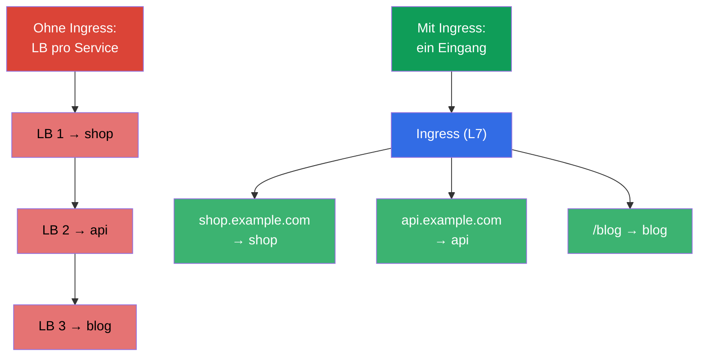
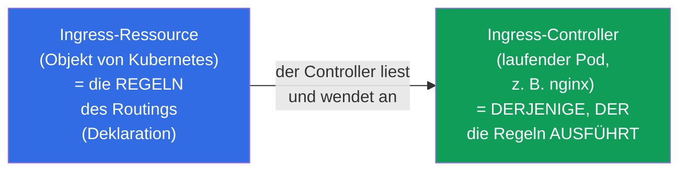
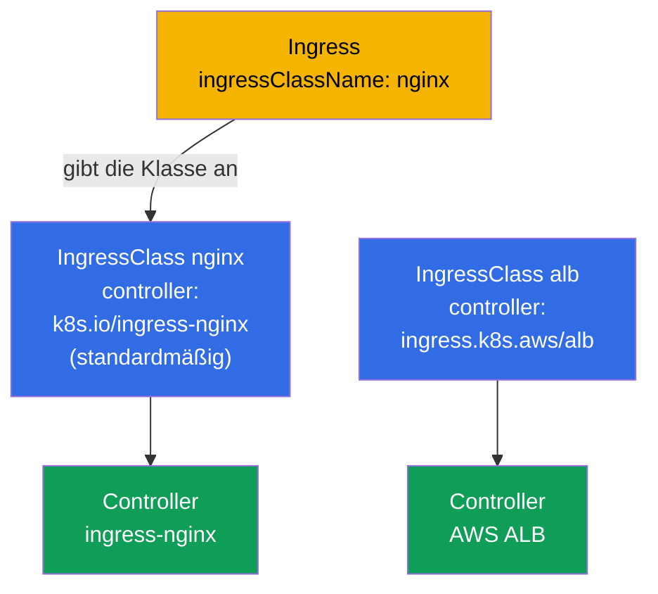
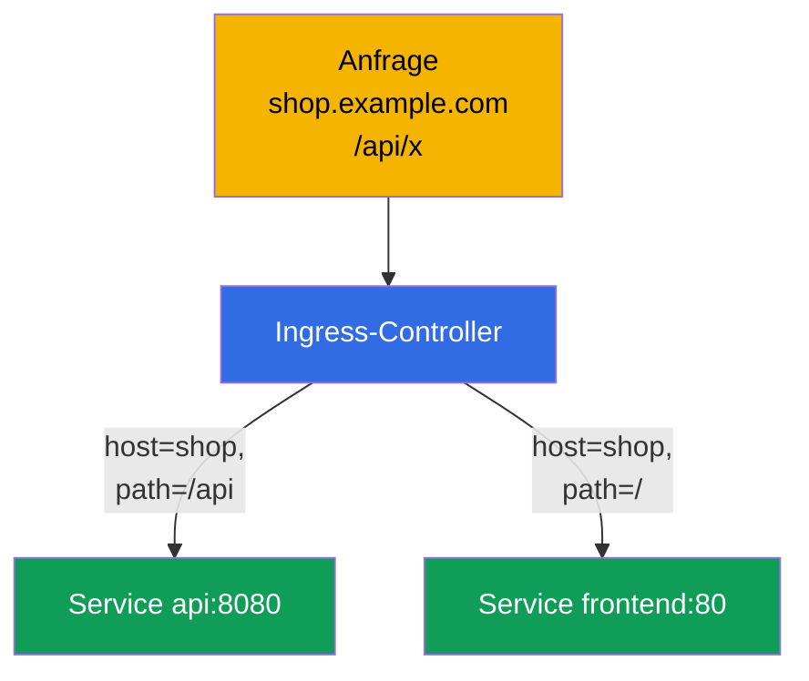
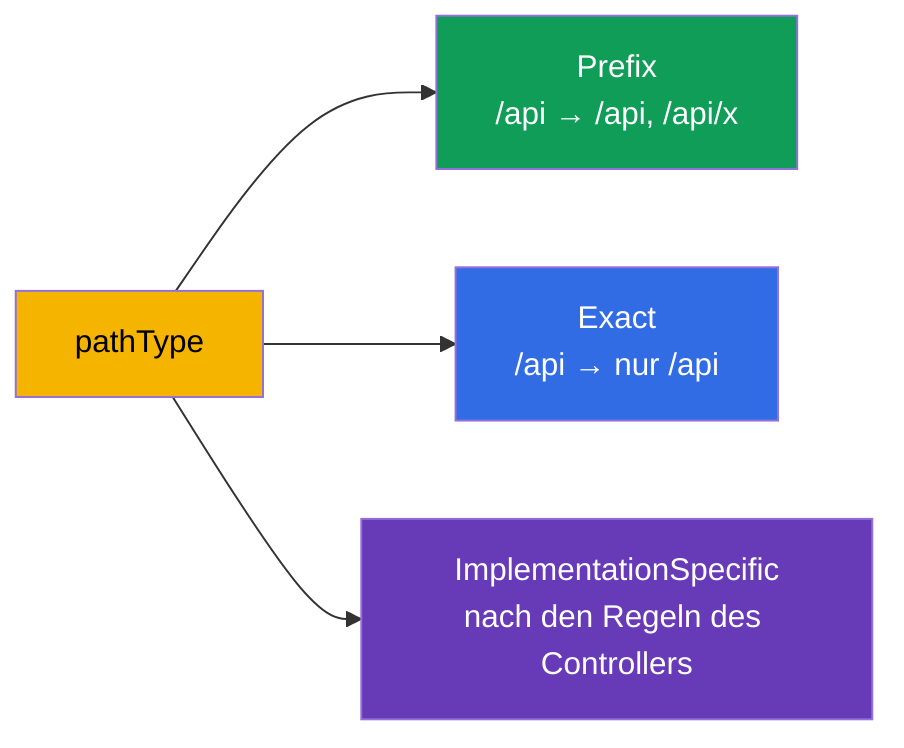
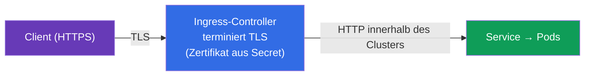
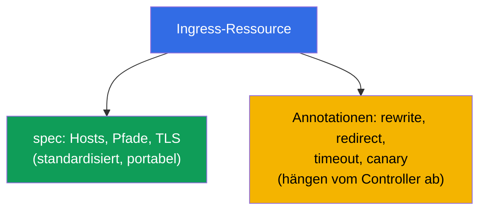

[Русская версия](ru.md) · [Eng version](README.md) · [Versión en español](es.md) · [Version française](fr.md) · [ქართული ვერსია](ge.md) · [繁體中文版](tw.md) · [日本語版](jp.md)

# Kapitel 32. Ingress und Ingress-Controller

> **Was kommt.** Ein Service vom Typ NodePort/LoadBalancer (Kapitel 7) stellt nach außen
> einen Service auf einen Port/eine Adresse bereit - bei Dutzenden Services ist das teuer
> und unbequem. **Ingress** löst das auf Ebene L7: ein Eingang und dahinter Routing nach
> Hosts und Pfaden auf verschiedene Services, plus TLS. Das ist die Domäne Services &
> Networking beider Prüfungen. Wir behandeln das Gespann Ingress-Ressource +
> Ingress-Controller, die Routing-Regeln und TLS.

## 32.1. Das Problem: wie man Traffic von außen sparsam hereinlässt

Wenn man jeden Service über einen LoadBalancer bereitstellt, bekommt man einen
Cloud-Lastverteiler (und eine Rechnung) pro Service. Man braucht **einen Eingang**, der
selbst herausfindet, für welchen Service eine Anfrage gedacht ist - nach Hostname und Pfad.



Ingress arbeitet auf **L7** (HTTP/HTTPS): es versteht Hosts, Pfade, Header - anders als die
L4-Lastverteilung des Service (Kapitel 7).

## 32.2. Zwei Teile: Ingress-Ressource und Ingress-Controller

Das ist der zentrale Unterschied, der oft verwechselt wird. Ingress besteht aus zwei Dingen:



- **Die Ingress-Ressource** ist nur eine **Deklaration** von Regeln („Host shop.example.com
  → Service shop“). Für sich allein tut sie nichts.
- **Der Ingress-Controller** ist eine tatsächlich laufende Anwendung im Cluster (nginx,
  Traefik, HAProxy, ein Cloud-ALB-Controller), die die Ingress-Ressourcen liest und das
  entsprechende Routing einrichtet.

> **Der wichtigste Punkt.** Eine Ingress-Ressource ohne installierten Controller
> **funktioniert nicht** - es gibt einfach niemanden, der die Regeln ausführt. Im Cluster
> (kubeadm, minikube) muss man den Ingress-Controller separat installieren; in verwalteten
> Clustern stellt man ihn üblicherweise auch selbst. Das ist eine häufige Ursache für „ich
> habe einen Ingress erstellt, aber er antwortet nicht“.

## 32.3. Verbreitete Ingress-Controller

| Controller | Besonderheit |
|-----------|-------------|
| **ingress-nginx** | der verbreitetste, auf Basis von nginx, reiche Annotationen |
| **Traefik** | Autokonfiguration, bequem für Dynamik |
| **HAProxy** | performant |
| **AWS ALB Controller** | erzeugt einen Cloud-ALB unter dem Ingress (in EKS) |
| **Cloud-spezifische** | GKE/AKS-Controller |

Zwischen den Controllern grenzt die **IngressClass** ab - ein Objekt, das angibt, welcher
Controller den jeweiligen Ingress bedient (`ingressClassName` in der Ressource). Wir
behandeln sie gesondert.

## 32.4. IngressClass: welcher Controller den Ingress bedient

Im Cluster können **mehrere** Ingress-Controller gleichzeitig laufen (zum Beispiel
ingress-nginx für interne Services und ein Cloud-ALB für öffentliche). Damit jeder
Controller versteht, welche Ingress-Ressourcen **seine** sind und welche fremd, gibt es das
Objekt **IngressClass**. Die Ingress-Ressource verweist über das Feld
`spec.ingressClassName` darauf.

```yaml
apiVersion: networking.k8s.io/v1
kind: IngressClass
metadata:
  name: nginx
  annotations:
    ingressclass.kubernetes.io/is-default-class: "true"   # Standardklasse
spec:
  controller: k8s.io/ingress-nginx      # Kennung der Implementierung des Controllers
```



Nachsehen, welche Klassen es im Cluster gibt und welche davon die Standardklasse ist:

```bash
# Liste der Klassen und ihrer Controller
kubectl get ingressclass
# NAME    CONTROLLER              PARAMETERS   AGE
# nginx   k8s.io/ingress-nginx    <none>       10d

# welche Klasse als Standard markiert ist (über die Annotation is-default-class)
kubectl get ingressclass -o jsonpath='{range .items[*]}{.metadata.name}{"\t"}{.metadata.annotations.ingressclass\.kubernetes\.io/is-default-class}{"\n"}{end}'

# Details einer konkreten Klasse (controller, Parameter)
kubectl describe ingressclass nginx

# welche Klasse die bestehenden Ingress tatsächlich nutzen
kubectl get ingress -A -o custom-columns=NS:.metadata.namespace,NAME:.metadata.name,CLASS:.spec.ingressClassName
```

Was wichtig zu wissen ist:

- **`spec.controller`** - eine unveränderliche Kennung der Implementierung (zum Beispiel
  `k8s.io/ingress-nginx`), die der Controller selbst „belegt“ hat. Sie wählen die Klasse
  über ihren **Namen** (`nginx`), und der Controller bedient alle Ingress mit dieser Klasse.
- **IngressClass ist ein cluster-scoped** Objekt (nicht an ein Namespace gebunden,
  Kapitel 6), die Ingress-Ressourcen dagegen sind namespaced und verweisen aus jedem
  beliebigen Namespace auf die Klasse.
- **Standardklasse.** Die Annotation `ingressclass.kubernetes.io/is-default-class: "true"`
  macht eine Klasse zur Standardklasse: ein Ingress **ohne** `ingressClassName` landet dann
  bei ihr. Es darf nur eine Standardklasse geben - sonst bekommen Sie einen
  Fehler/Uneindeutigkeit.
- **Wenn es die Klasse nicht gibt und auch keine Standardklasse** - bleibt der Ingress
  „niemandes“: kein einziger Controller nimmt ihn auf, und er funktioniert stillschweigend
  nicht. Das ist eine der häufigen Ursachen für „ich habe einen Ingress erstellt, aber er
  antwortet nicht“.
- **Veraltete Annotation.** Früher gab man die Klasse über die Annotation
  `kubernetes.io/ingress.class` direkt am Ingress an. In `networking.k8s.io/v1` hat das Feld
  `ingressClassName` sie ersetzt; die alte Annotation verstehen manche Controller der
  Kompatibilität zuliebe noch, in neuen Manifesten nutzt man aber das Feld.

## 32.5. Manifest des Ingress: Routing nach Hosts und Pfaden

```yaml
apiVersion: networking.k8s.io/v1
kind: Ingress
metadata:
  name: shop
  annotations:
    nginx.ingress.kubernetes.io/rewrite-target: /
spec:
  ingressClassName: nginx        # welcher Controller bedient
  rules:
  - host: shop.example.com       # Routing nach Host
    http:
      paths:
      - path: /api               # und nach Pfad
        pathType: Prefix
        backend:
          service:
            name: api
            port:
              number: 8080
      - path: /
        pathType: Prefix
        backend:
          service:
            name: frontend
            port:
              number: 80
```



Ingress routet auf einen **Service** (nicht direkt auf die Pods) - es setzt also auf allem
auf, was wir in den Kapiteln 7 und 31 behandelt haben.

## 32.6. pathType: wie die Pfade abgeglichen werden

Das Feld `pathType` bestimmt die Art des Pfadvergleichs - eine häufige Feinheit:

| pathType | Wie es abgleicht |
|----------|------------------|
| `Prefix` | nach Pfadsegmenten: `/api` passt auf `/api`, `/api/x`, aber nicht auf `/apixyz` |
| `Exact` | exakte Übereinstimmung des gesamten Pfads |
| `ImplementationSpecific` | nach Ermessen des Controllers (oft wie regex) |



## 32.7. TLS im Ingress

Ingress kann HTTPS terminieren: TLS am Eingang entschlüsseln, weiter in den Cluster geht der
Traffic per HTTP. Zertifikat und Schlüssel werden aus einem Secret vom Typ
`kubernetes.io/tls` genommen (Kapitel 19).

```yaml
spec:
  tls:
  - hosts:
    - shop.example.com
    secretName: shop-tls          # Secret mit tls.crt und tls.key
  rules:
  - host: shop.example.com
    http:
      paths: [...]
```



Zertifikate erstellt man manuell (`kubectl create secret tls`) oder automatisch über
**cert-manager** - einen Operator, der Zertifikate ausstellt und erneuert (zum Beispiel von
Let's Encrypt). In der Produktion fast immer cert-manager.

## 32.8. Annotationen: Feinjustierung des Controllers

Die Basis-Ingress-Ressource beschreibt nur Hosts/Pfade/TLS. Alles Übrige (rewrite,
Redirects, Timeouts, rate limit, canary) wird über **Annotationen** eingestellt, die
spezifisch für den Controller sind:

```yaml
metadata:
  annotations:
    nginx.ingress.kubernetes.io/rewrite-target: /
    nginx.ingress.kubernetes.io/ssl-redirect: "true"
    nginx.ingress.kubernetes.io/proxy-read-timeout: "60"
```



Der Nachteil der Annotationen: sie sind **nicht portabel** zwischen Controllern und
„blähen“ die Ressource auf. Genau dieses Problem löst Gateway API (Kapitel 33), wo solche
Einstellungen zu Feldern von Objekten werden und nicht zu Annotationszeichenketten.

## 32.9. Wie man das in der Produktion anwendet

- **Ingress ist der Standardeingang für HTTP(S).** In der Produktion stellt man nach außen
  einen Ingress-Controller bereit (hinter einem LoadBalancer) und routet Dutzende Services
  über Ingress-Ressourcen nach Hosts/Pfaden. Das ist deutlich günstiger als ein LB pro
  Service.
- **cert-manager für TLS.** Zertifikate erstellt man nicht von Hand - sie werden automatisch
  von cert-manager ausgestellt und erneuert (Let's Encrypt/interne CA). Manuelles Erneuern
  von Zertifikaten ist eine Quelle von Incidents „Zertifikat abgelaufen“.
- **Den Ingress-Controller muss man installieren und betreiben.** Das ist eine eigene
  Komponente mit eigenen Ressourcen, Updates und Monitoring. In verwalteten Clustern stellt
  man oft ingress-nginx oder einen Cloud-ALB-Controller.
- **Annotationen erzeugen Inkompatibilität.** Die reiche Einstellung über nginx-Annotationen
  ist bequem, bindet aber an einen konkreten Controller. Die Branche geht allmählich auf
  Gateway API (Kapitel 33) über, der Portabilität und der Rollentrennung zuliebe.
- **Ein häufiger Incident - Ingress ohne Controller oder ohne Endpoints.** „Der Ingress
  antwortet nicht“ = entweder ist der Controller nicht installiert, oder der Service dahinter
  hat keine bereiten Pods (leere Endpoints, Kapitel 7), oder der `ingressClassName` ist falsch.

## 32.10. Mini-Glossar

- **Ingress-Ressource** - Deklaration der Regeln des L7-Routings (Hosts, Pfade, TLS).
- **Ingress-Controller** - Anwendung, die die Ingress-Regeln ausführt (nginx, Traefik, ALB).
- **IngressClass** - welcher Controller den jeweiligen Ingress bedient (`ingressClassName`).
- **pathType** - Art des Pfadabgleichs: Prefix / Exact / ImplementationSpecific.
- **TLS termination** - Entschlüsselung von HTTPS am Ingress; Zertifikat aus einem Secret vom Typ tls.
- **cert-manager** - Operator zum automatischen Ausstellen und Erneuern von Zertifikaten.
- **Annotationen des Ingress** - Einstellungen, die spezifisch für den Controller sind (rewrite, timeout u. a.).

## 32.11. Zusammenfassung des Kapitels

- Ingress gibt einen Eingang für viele Services mit L7-Routing nach Hosts/Pfaden und TLS -
  günstiger und flexibler als ein LoadBalancer pro Service.
- Ingress = Ressource (Regeln, Deklaration) + Controller (führt die Regeln aus); ohne
  installierten Controller funktioniert die Ressource nicht.
- Controller: ingress-nginx, Traefik, HAProxy, Cloud-Controller (ALB); abgegrenzt werden sie
  über die IngressClass.
- Routing - nach host und path; `pathType` (Prefix/Exact/ImplementationSpecific) legt den
  Abgleich fest; das backend ist ein Service.
- TLS wird am Ingress über ein Zertifikat aus einem Secret vom Typ tls terminiert; in der
  Produktion stellt es cert-manager aus.
- Feineinstellungen - über Annotationen, die aber nicht portabel zwischen Controllern sind
  (dieses Problem löst Gateway API, Kapitel 33).

## 32.12. Wofür das nützlich ist: in der Prüfung und in der echten Arbeit

**In der Prüfung.** „Erstelle einen Ingress mit Routing nach host/path“, „richte TLS für den
Ingress ein“, „warum antwortet der Ingress nicht“ sind typische Aufgaben. Man muss eine
Ingress-Ressource mit korrektem `pathType`, `ingressClassName` und TLS-Abschnitt schreiben
können und daran denken, dass ein laufender Controller und nicht leere Endpoints hinter dem
Service nötig sind.

**In der echten Arbeit.** Ingress ist der standardmäßige und sparsame Weg, HTTP(S)-Traffic in
den Cluster hereinzulassen. Das Gespann mit cert-manager automatisiert TLS. Das Verständnis
von „Ressource vs Controller“ und der Rolle der Annotationen ist die Grundlage für die
Einrichtung des Eingangs und die Analyse von Incidents „der Service ist von außen nicht
erreichbar“.

## 32.13. Fragen zur Selbstüberprüfung

1. Wozu braucht man Ingress, wenn es einen Service vom Typ LoadBalancer gibt?
2. Was ist der Unterschied zwischen der Ingress-Ressource und dem Ingress-Controller? Was
   passiert ohne Controller?
3. Was ist eine IngressClass und wozu braucht man sie?
4. Wodurch unterscheiden sich die pathType Prefix und Exact?
5. Wie terminiert Ingress TLS und woher nimmt es das Zertifikat?
6. Wozu braucht man die Annotationen des Ingress und was ist ihr Nachteil?
7. Nennen Sie häufige Ursachen für „der Ingress antwortet nicht“.

## Praxis

Wir haben den klassischen Ingress behandelt. In Kapitel 33 kommt sein Nachfolger, Gateway
API: ein flexiblerer und portablerer Weg des Routings, der ins Programm des CKA aufgenommen
wurde. Ingress wird in den Labs zum Netz geübt.

🧪 Lab 120 (u. a. Drill zu Ingress): [tasks/cka/labs/120](../../labs/120/README_DE.MD)

---
[Inhalt](../README_DE.md) · [Kapitel 31](../31/de.md) · [Kapitel 33](../33/de.md)
