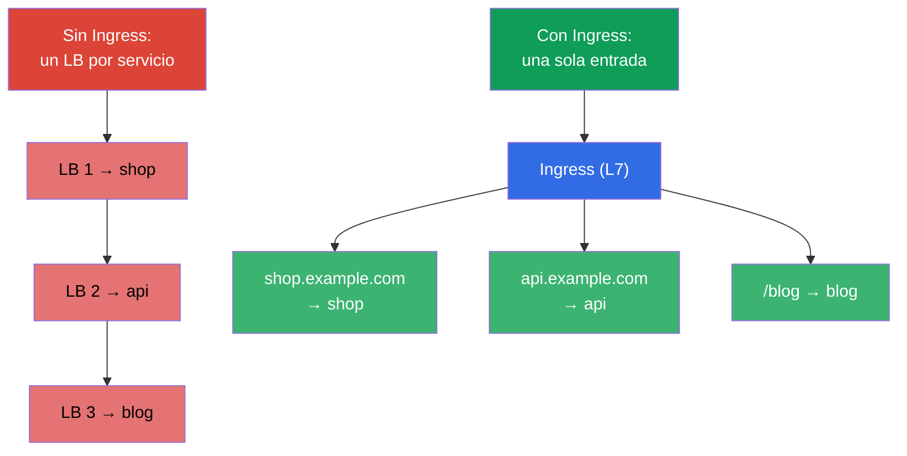
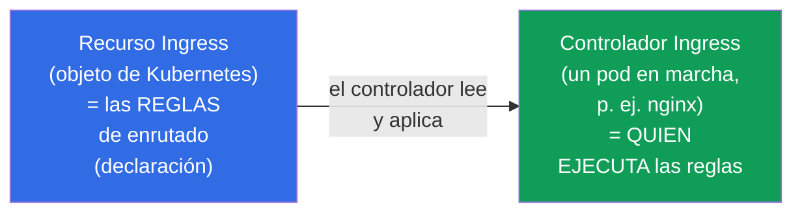
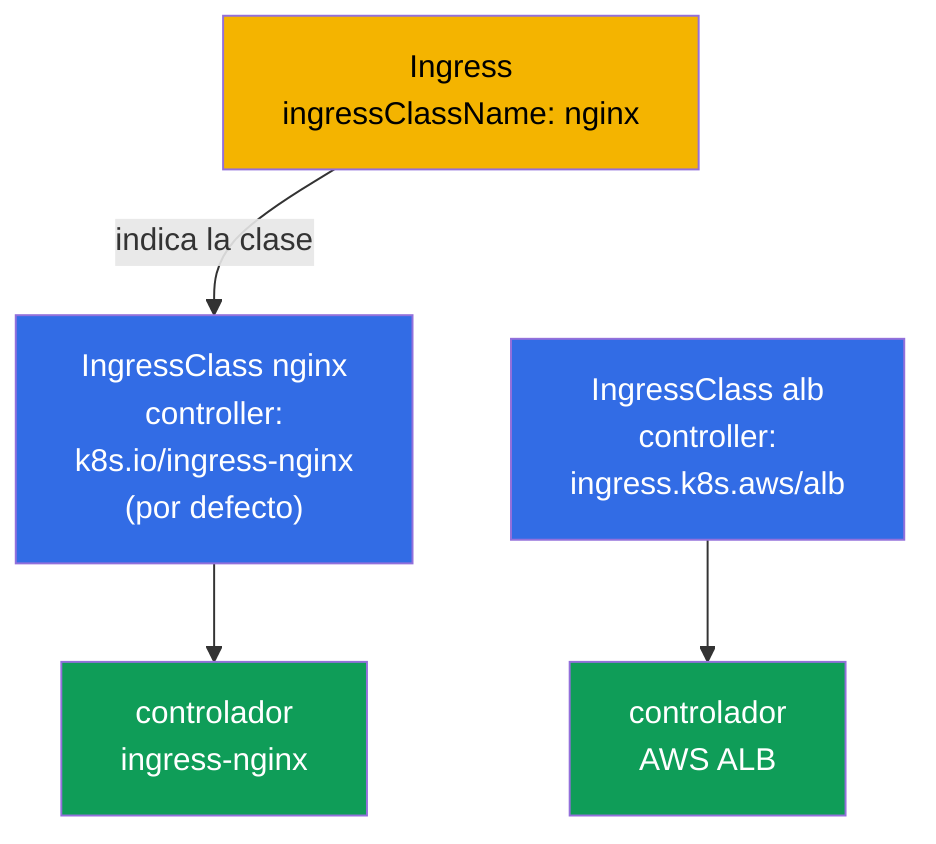
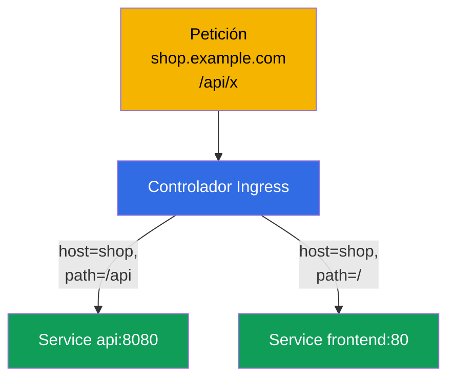
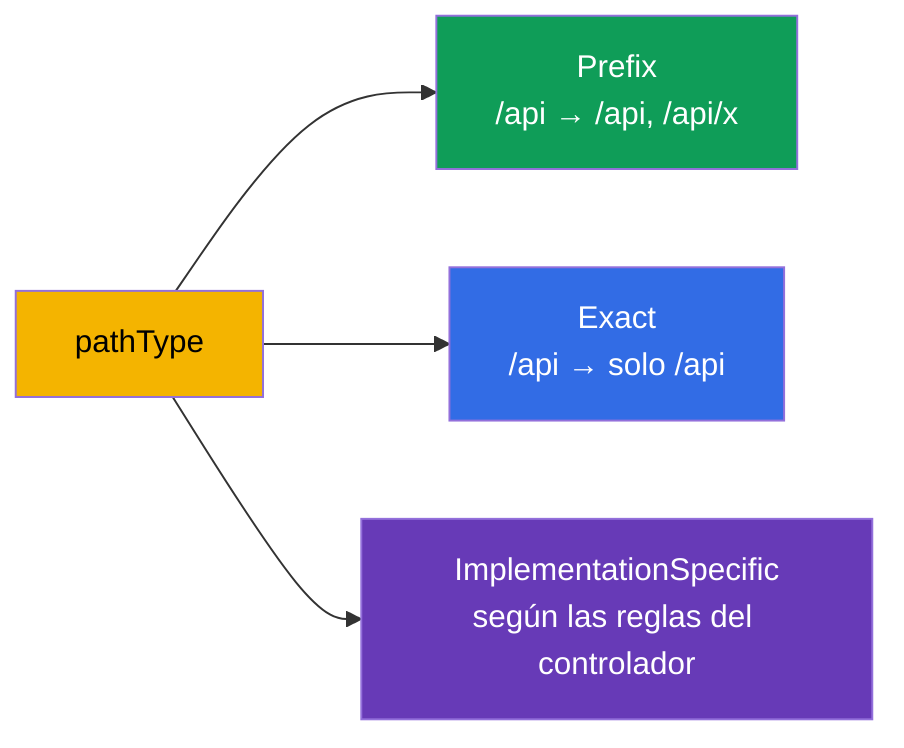
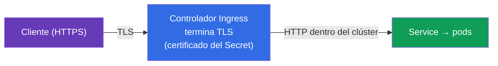
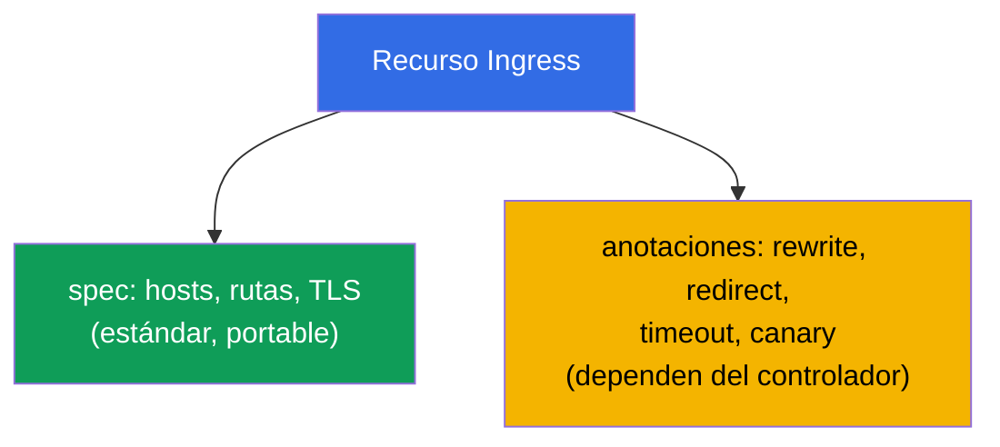

[Русская версия](ru.md) · [Eng version](README.md) · [Version française](fr.md) · [Deutsche Version](de.md) · [ქართული ვერსია](ge.md)

# Capítulo 32. Ingress y controladores Ingress

> **Qué viene ahora.** Un Service de tipo NodePort/LoadBalancer (capítulo 7) expone hacia fuera un
> servicio por puerto/dirección - con decenas de servicios eso resulta caro e incómodo. **Ingress**
> lo resuelve a nivel L7: una única entrada y, a partir de ahí, enrutado por hosts y rutas hacia
> distintos servicios, más TLS. Es el dominio Services & Networking de ambos exámenes. Veremos el
> tándem recurso Ingress + controlador Ingress, las reglas de enrutado y TLS.

## 32.1. El problema: cómo dejar entrar tráfico desde fuera de forma económica

Si exponemos cada servicio mediante LoadBalancer, tendremos un balanceador de la nube (y su
factura) por cada servicio. Hace falta **una sola entrada** que decida por sí misma a qué servicio
va destinada la petición - según el nombre del host y la ruta.



Ingress funciona en **L7** (HTTP/HTTPS): entiende hosts, rutas y cabeceras - a diferencia del
balanceo L4 del Service (capítulo 7).

## 32.2. Dos partes: el recurso Ingress y el controlador Ingress

Es la distinción clave que a menudo se confunde. Ingress consta de dos cosas:



- **El recurso Ingress** es solo una **declaración** de reglas («el host shop.example.com → el
  servicio shop»). Por sí mismo no hace nada.
- **El controlador Ingress** es una aplicación que corre de verdad en el clúster (nginx, Traefik,
  HAProxy, un controlador ALB de la nube) y que lee los recursos Ingress y configura el enrutado
  correspondiente.

> **El punto más importante.** Un recurso Ingress sin controlador instalado **no funciona** - no
> hay nadie que ejecute las reglas. En un clúster (kubeadm, minikube) el controlador Ingress hay
> que instalarlo aparte; en los clústeres gestionados también suele instalarse a mano. Es una causa
> frecuente del «creé un Ingress y no responde».

## 32.3. Controladores Ingress populares

| Controlador | Particularidad |
|-----------|-------------|
| **ingress-nginx** | el más extendido, basado en nginx, anotaciones muy ricas |
| **Traefik** | autoconfiguración, cómodo para entornos dinámicos |
| **HAProxy** | de alto rendimiento |
| **AWS ALB Controller** | crea un ALB de la nube para el Ingress (en EKS) |
| **Específicos de la nube** | controladores de GKE/AKS |

Entre controladores hace la separación **IngressClass** - un objeto que indica
qué controlador atiende un Ingress dado (`ingressClassName` en el recurso). Lo
veremos aparte.

## 32.4. IngressClass: qué controlador atiende el Ingress

En un clúster pueden funcionar **varios** controladores Ingress a la vez (por ejemplo,
ingress-nginx para los servicios internos y un ALB de la nube para los públicos). Para que cada
controlador sepa qué recursos Ingress son **suyos** y cuáles ajenos existe el objeto
**IngressClass**. El recurso Ingress lo referencia con el campo `spec.ingressClassName`.

```yaml
apiVersion: networking.k8s.io/v1
kind: IngressClass
metadata:
  name: nginx
  annotations:
    ingressclass.kubernetes.io/is-default-class: "true"   # clase por defecto
spec:
  controller: k8s.io/ingress-nginx      # identificador de la implementación del controlador
```



Ver qué clases hay en el clúster y cuál es la de por defecto:

```bash
# lista de clases y sus controladores
kubectl get ingressclass
# NAME    CONTROLLER              PARAMETERS   AGE
# nginx   k8s.io/ingress-nginx    <none>       10d

# qué clase está marcada como la de por defecto (por la anotación is-default-class)
kubectl get ingressclass -o jsonpath='{range .items[*]}{.metadata.name}{"\t"}{.metadata.annotations.ingressclass\.kubernetes\.io/is-default-class}{"\n"}{end}'

# detalles de una clase concreta (controller, parámetros)
kubectl describe ingressclass nginx

# qué clase usan realmente los Ingress existentes
kubectl get ingress -A -o custom-columns=NS:.metadata.namespace,NAME:.metadata.name,CLASS:.spec.ingressClassName
```

Lo que hay que saber:

- **`spec.controller`** - identificador inmutable de la implementación (por ejemplo,
  `k8s.io/ingress-nginx`) que el propio controlador ha «reclamado». Tú eliges la clase por su
  **nombre** (`nginx`), y el controlador atiende todos los Ingress con esa clase.
- **IngressClass es un objeto cluster-scoped** (no está ligado a un namespace, capítulo 6),
  mientras que los recursos Ingress son namespaced y referencian la clase desde cualquier namespace.
- **Clase por defecto.** La anotación `ingressclass.kubernetes.io/is-default-class: "true"` hace
  que la clase sea la de por defecto: un Ingress **sin** `ingressClassName` irá entonces a ella.
  La clase por defecto debe ser única - si no, tendrás un error o una ambigüedad.
- **Si no hay clase y tampoco una por defecto**, el Ingress se queda «sin dueño»: ningún
  controlador lo recoge y, en silencio, no funciona. Es una de las causas frecuentes del «creé un
  Ingress y no responde».
- **Anotación obsoleta.** Antes la clase se indicaba con la anotación
  `kubernetes.io/ingress.class` directamente en el Ingress. En `networking.k8s.io/v1` la sustituyó
  el campo `ingressClassName`; algunos controladores aún entienden la anotación antigua por
  compatibilidad, pero en los manifiestos nuevos se usa el campo.

## 32.5. El manifiesto Ingress: enrutado por hosts y rutas

```yaml
apiVersion: networking.k8s.io/v1
kind: Ingress
metadata:
  name: shop
  annotations:
    nginx.ingress.kubernetes.io/rewrite-target: /
spec:
  ingressClassName: nginx        # qué controlador lo atiende
  rules:
  - host: shop.example.com       # enrutado por host
    http:
      paths:
      - path: /api               # y por ruta
        pathType: Prefix
        backend:
          service:
            name: api
            port:
              number: 8080
      - path: /
        pathType: Prefix
        backend:
          service:
            name: frontend
            port:
              number: 80
```



Ingress enruta hacia un **Service** (no directamente hacia los pods) - es decir, se apoya sobre
todo lo que vimos en los capítulos 7 y 31.

## 32.6. pathType: cómo se comparan las rutas

El campo `pathType` define la forma de comparar la ruta - una sutileza frecuente:

| pathType | Cómo compara |
|----------|------------------|
| `Prefix` | por segmentos de la ruta: `/api` coincide con `/api`, `/api/x`, pero no con `/apixyz` |
| `Exact` | coincidencia exacta de la ruta completa |
| `ImplementationSpecific` | a criterio del controlador (a menudo como regex) |



## 32.7. TLS en Ingress

Ingress puede terminar HTTPS: descifra TLS en la entrada y, hacia dentro del clúster, el tráfico va
por HTTP. El certificado y la clave se toman de un Secret de tipo `kubernetes.io/tls` (capítulo 19).

```yaml
spec:
  tls:
  - hosts:
    - shop.example.com
    secretName: shop-tls          # Secret con tls.crt y tls.key
  rules:
  - host: shop.example.com
    http:
      paths: [...]
```



Los certificados se crean a mano (`kubectl create secret tls`) o automáticamente mediante
**cert-manager** - un operador que emite y renueva certificados (por ejemplo, de Let's Encrypt). En
producción casi siempre cert-manager.

## 32.8. Anotaciones: ajuste fino del controlador

El recurso Ingress básico describe solo hosts/rutas/TLS. Todo lo demás (rewrite,
redirecciones, timeouts, rate limit, canary) se configura con **anotaciones**
específicas del controlador:

```yaml
metadata:
  annotations:
    nginx.ingress.kubernetes.io/rewrite-target: /
    nginx.ingress.kubernetes.io/ssl-redirect: "true"
    nginx.ingress.kubernetes.io/proxy-read-timeout: "60"
```



La desventaja de las anotaciones: **no son portables** entre controladores e «inflan» el recurso.
Justo ese problema lo resuelve Gateway API (capítulo 33), donde esos ajustes pasan a ser campos de
objetos en lugar de cadenas en anotaciones.

## 32.9. Cómo se aplica esto en producción

- **Ingress es la entrada estándar para HTTP(S).** En producción se expone hacia fuera un único
  controlador Ingress (detrás de un solo LoadBalancer) y decenas de servicios se enrutan mediante
  recursos Ingress por hosts/rutas. Sale muchísimo más barato que un LB por servicio.
- **cert-manager para TLS.** Los certificados no se crean a mano - los emite y renueva
  automáticamente cert-manager (Let's Encrypt/una CA interna). La renovación manual de certificados
  es una fuente de incidentes del tipo «el certificado ha caducado».
- **El controlador Ingress hay que instalarlo y mantenerlo.** Es un componente aparte con sus
  propios recursos, actualizaciones y monitorización. En los clústeres gestionados a menudo se
  instala ingress-nginx o un controlador ALB de la nube.
- **Las anotaciones multiplican la incompatibilidad.** La configuración rica mediante anotaciones de
  nginx es cómoda, pero te ata a un controlador concreto. La industria va pasando poco a poco a
  Gateway API (capítulo 33) por portabilidad y separación de roles.
- **Un incidente frecuente: Ingress sin controlador o sin Endpoints.** «El Ingress no responde» =
  o no hay controlador instalado, o el servicio de detrás no tiene pods listos (Endpoints vacío,
  capítulo 7), o el `ingressClassName` es incorrecto.

## 32.10. Mini-glosario

- **recurso Ingress** - declaración de reglas de enrutado L7 (hosts, rutas, TLS).
- **controlador Ingress** - aplicación que ejecuta las reglas de Ingress (nginx, Traefik, ALB).
- **IngressClass** - qué controlador atiende un Ingress dado (`ingressClassName`).
- **pathType** - forma de comparar la ruta: Prefix / Exact / ImplementationSpecific.
- **TLS termination** - descifrado de HTTPS en el Ingress; certificado de un Secret de tipo tls.
- **cert-manager** - operador de emisión y renovación automática de certificados.
- **anotaciones de Ingress** - ajustes específicos del controlador (rewrite, timeout y otros).

## 32.11. Resumen del capítulo

- Ingress da una única entrada para muchos servicios con enrutado L7 por hosts/rutas y TLS - más
  barato y flexible que un LoadBalancer por servicio.
- Ingress = recurso (reglas, declaración) + controlador (ejecuta las reglas); sin un controlador
  instalado el recurso no funciona.
- Controladores: ingress-nginx, Traefik, HAProxy, los de la nube (ALB); se separan mediante
  IngressClass.
- El enrutado es por host y path; `pathType` (Prefix/Exact/ImplementationSpecific) define la
  comparación; el backend es un Service.
- TLS se termina en el Ingress con el certificado de un Secret de tipo tls; en producción lo emite
  cert-manager.
- Los ajustes finos van por anotaciones, pero no son portables entre controladores (ese problema lo
  resuelve Gateway API, capítulo 33).

## 32.12. Para qué te servirá: en el examen y en el trabajo real

**En el examen.** «Crea un Ingress con enrutado por host/path», «configura TLS para un Ingress»,
«por qué el Ingress no responde» son tareas típicas. Hay que escribir el recurso Ingress con el
`pathType` correcto, el `ingressClassName`, la sección TLS, y recordar que hace falta un controlador
en marcha y un Endpoints no vacío detrás del servicio.

**En el trabajo real.** Ingress es la forma estándar y económica de dejar entrar tráfico HTTP(S) en el clúster.
El tándem con cert-manager automatiza TLS. Entender «recurso vs controlador» y el papel de las anotaciones es
la base para configurar la entrada y analizar incidentes de «el servicio no está accesible desde fuera».

## 32.13. Preguntas de autoevaluación

1. ¿Para qué hace falta Ingress si existe el Service de tipo LoadBalancer?
2. ¿Cuál es la diferencia entre el recurso Ingress y el controlador Ingress? ¿Qué pasa sin
   controlador?
3. ¿Qué es IngressClass y para qué hace falta?
4. ¿En qué se diferencian los pathType Prefix y Exact?
5. ¿Cómo termina Ingress el TLS y de dónde toma el certificado?
6. ¿Para qué hacen falta las anotaciones de Ingress y cuál es su desventaja?
7. Enumera las causas frecuentes del «el Ingress no responde».

## Práctica

Hemos visto el Ingress clásico. En el capítulo 33 viene su sucesor, Gateway API: una forma de
enrutado más flexible y portable, que ha entrado en el programa del CKA. Ingress se practica en los
laboratorios de red.

🧪 Laboratorio 120 (incluido el drill de Ingress): [tasks/cka/labs/120](../../labs/120/README_ES.MD)

---
[Índice](../README_ES.md) · [Capítulo 31](../31/es.md) · [Capítulo 33](../33/es.md)
