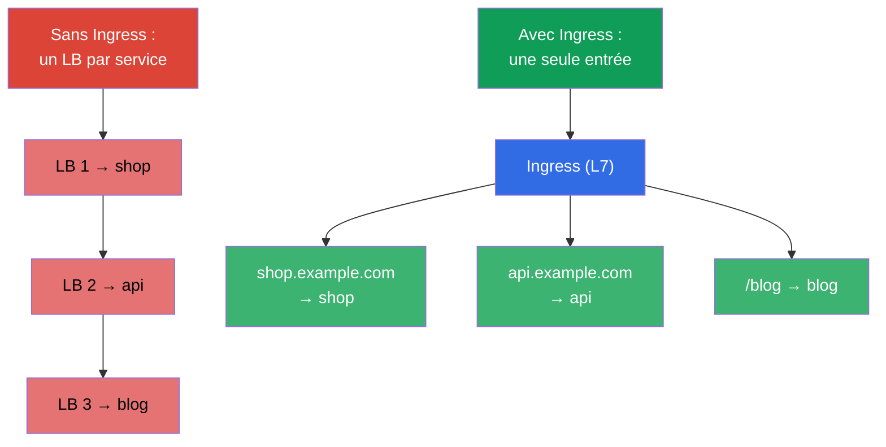
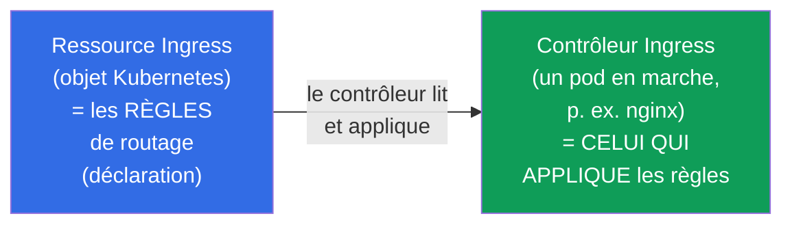
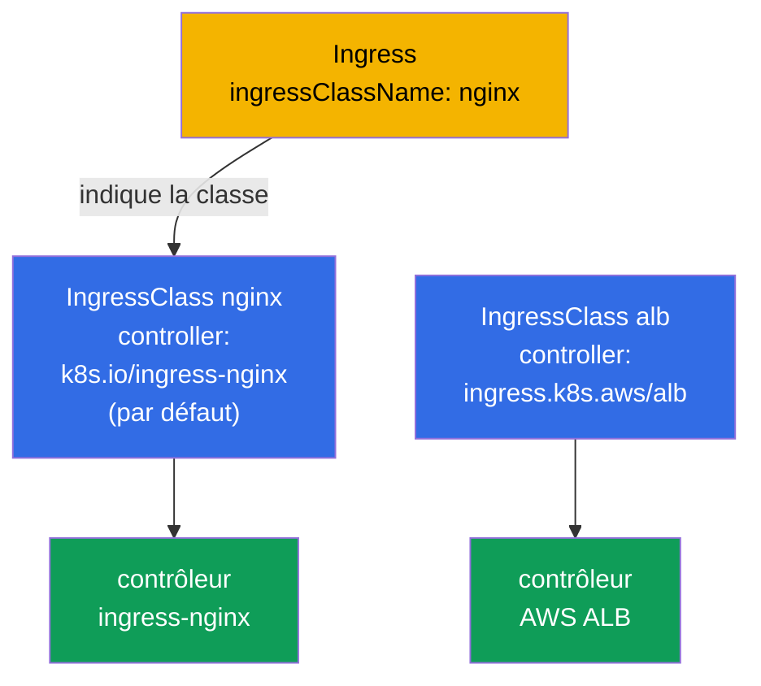
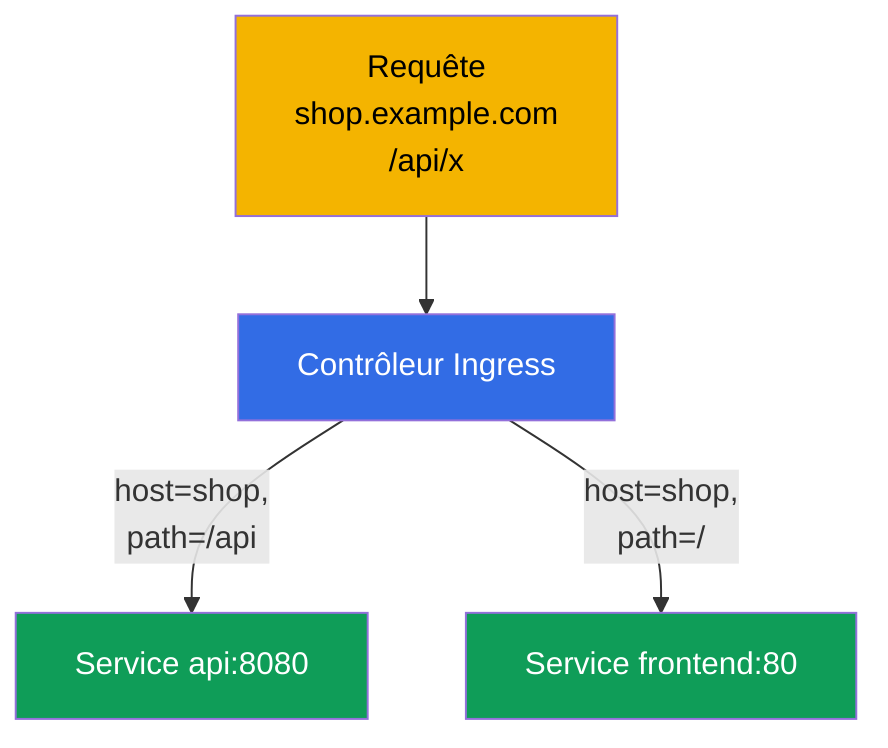
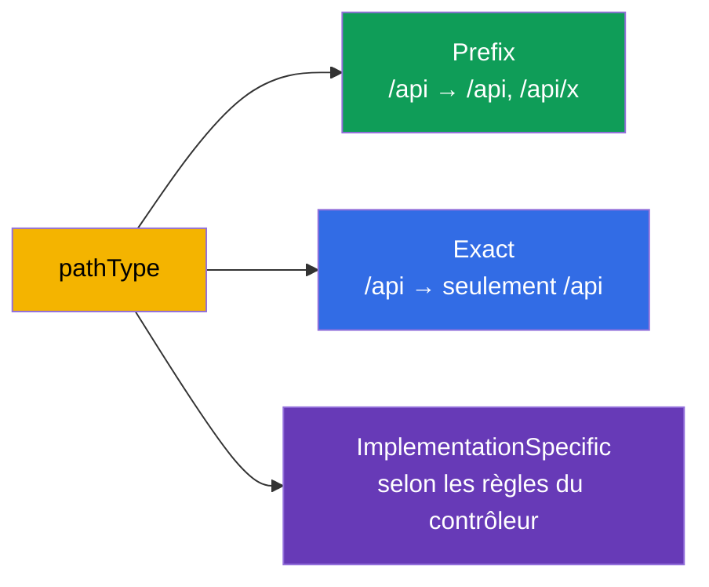
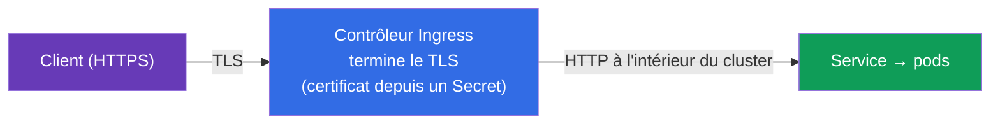
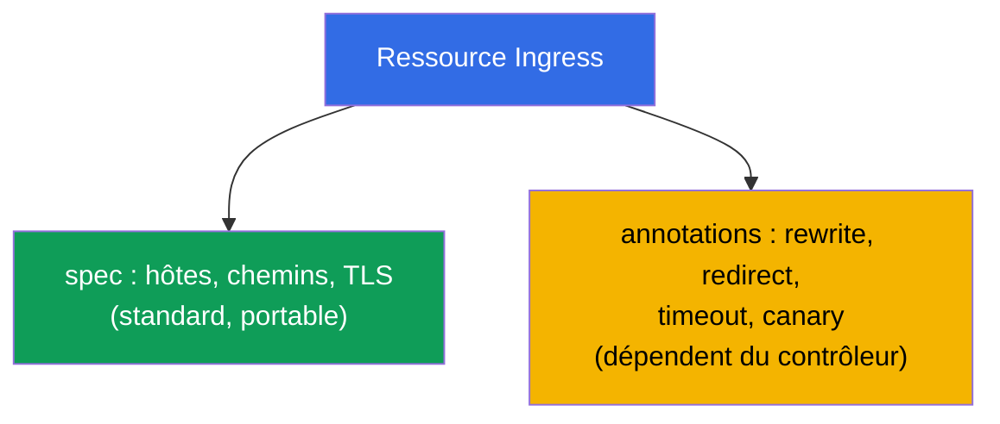

[Русская версия](ru.md) · [Eng version](README.md) · [Versión en español](es.md) · [Deutsche Version](de.md) · [ქართული ვერსია](ge.md) · [繁體中文版](tw.md) · [日本語版](jp.md)

# Chapitre 32. Ingress et contrôleurs Ingress

> **Ce qui suit.** Un Service de type NodePort/LoadBalancer (chapitre 7) expose vers l'extérieur un
> seul service sur un port/une adresse - avec des dizaines de services, cela devient coûteux et peu
> pratique. **Ingress** résout cela au niveau L7 : une seule entrée, puis un routage par hôtes et par
> chemins vers différents services, plus le TLS. C'est le domaine Services & Networking des deux
> examens. Voyons le duo ressource Ingress + contrôleur Ingress, les règles de routage et le TLS.

## 32.1. Le problème : comment faire entrer le trafic externe à moindre coût

Si l'on expose chaque service via un LoadBalancer, on obtient un équilibreur cloud (et une facture)
par service. Il faut **une seule entrée** qui détermine elle-même à quel service la requête est
destinée - d'après le nom d'hôte et le chemin.



Ingress travaille en **L7** (HTTP/HTTPS) : il comprend les hôtes, les chemins, les en-têtes - à la
différence de l'équilibrage L4 d'un Service (chapitre 7).

## 32.2. Deux parties : la ressource Ingress et le contrôleur Ingress

C'est la distinction clé, souvent confondue. Ingress se compose de deux choses :



- **La ressource Ingress** n'est qu'une **déclaration** de règles (« hôte shop.example.com → service
  shop »). En elle-même, elle ne fait rien.
- **Le contrôleur Ingress** est une application réellement en marche dans le cluster (nginx, Traefik,
  HAProxy, un contrôleur ALB cloud) qui lit les ressources Ingress et configure le routage
  correspondant.

> **Le point le plus important.** Une ressource Ingress sans contrôleur installé **ne fonctionne pas** -
> il n'y a simplement personne pour appliquer les règles. Dans un cluster (kubeadm, minikube), le
> contrôleur Ingress doit être installé séparément ; dans les clusters managés, on l'installe aussi
> généralement soi-même. C'est une cause fréquente du « j'ai créé un Ingress et il ne répond pas ».

## 32.3. Les contrôleurs Ingress populaires

| Contrôleur | Particularité |
|-----------|-------------|
| **ingress-nginx** | le plus répandu, basé sur nginx, annotations riches |
| **Traefik** | autoconfiguration, pratique pour les environnements dynamiques |
| **HAProxy** | performant |
| **AWS ALB Controller** | crée un ALB cloud pour l'Ingress (dans EKS) |
| **Spécifiques au cloud** | contrôleurs GKE/AKS |

C'est **IngressClass** qui départage les contrôleurs - un objet qui indique quel contrôleur sert un
Ingress donné (`ingressClassName` dans la ressource). Voyons-le à part.

## 32.4. IngressClass : quel contrôleur sert l'Ingress

Dans un cluster, **plusieurs** contrôleurs Ingress peuvent fonctionner en même temps (par exemple,
ingress-nginx pour les services internes et un ALB cloud pour les publics). Pour que chaque
contrôleur sache quelles ressources Ingress sont **les siennes** et lesquelles ne le sont pas, il
existe l'objet **IngressClass**. La ressource Ingress y fait référence par le champ
`spec.ingressClassName`.

```yaml
apiVersion: networking.k8s.io/v1
kind: IngressClass
metadata:
  name: nginx
  annotations:
    ingressclass.kubernetes.io/is-default-class: "true"   # classe par défaut
spec:
  controller: k8s.io/ingress-nginx      # identifiant de l'implémentation du contrôleur
```



Voir quelles classes existent dans le cluster et laquelle est celle par défaut :

```bash
# liste des classes et de leurs contrôleurs
kubectl get ingressclass
# NAME    CONTROLLER              PARAMETERS   AGE
# nginx   k8s.io/ingress-nginx    <none>       10d

# quelle classe est marquée comme par défaut (par l'annotation is-default-class)
kubectl get ingressclass -o jsonpath='{range .items[*]}{.metadata.name}{"\t"}{.metadata.annotations.ingressclass\.kubernetes\.io/is-default-class}{"\n"}{end}'

# détails d'une classe précise (controller, paramètres)
kubectl describe ingressclass nginx

# quelle classe utilisent réellement les Ingress existants
kubectl get ingress -A -o custom-columns=NS:.metadata.namespace,NAME:.metadata.name,CLASS:.spec.ingressClassName
```

Ce qu'il faut savoir :

- **`spec.controller`** - l'identifiant immuable de l'implémentation (par exemple,
  `k8s.io/ingress-nginx`), que le contrôleur lui-même a « réservé ». Vous choisissez la classe par son
  **nom** (`nginx`), et le contrôleur sert tous les Ingress portant cette classe.
- **IngressClass est un objet cluster-scoped** (non lié à un namespace, chapitre 6), tandis que les
  ressources Ingress sont namespaced et référencent la classe depuis n'importe quel namespace.
- **La classe par défaut.** L'annotation `ingressclass.kubernetes.io/is-default-class: "true"` rend
  une classe par défaut : un Ingress **sans** `ingressClassName` lui sera alors attribué. Il ne doit
  y avoir qu'une seule classe par défaut - sinon vous obtenez une erreur/une ambiguïté.
- **S'il n'y a pas de classe et pas non plus de classe par défaut** - l'Ingress reste « orphelin » :
  aucun contrôleur ne le prend en charge et il ne fonctionne pas, silencieusement. C'est l'une des
  causes fréquentes du « j'ai créé un Ingress et il ne répond pas ».
- **Annotation obsolète.** Avant, on définissait la classe par l'annotation
  `kubernetes.io/ingress.class` directement sur l'Ingress. Dans `networking.k8s.io/v1`, elle a été
  remplacée par le champ `ingressClassName` ; certains contrôleurs comprennent encore l'ancienne
  annotation par compatibilité, mais dans les nouveaux manifestes on utilise le champ.

## 32.5. Le manifeste Ingress : routage par hôtes et par chemins

```yaml
apiVersion: networking.k8s.io/v1
kind: Ingress
metadata:
  name: shop
  annotations:
    nginx.ingress.kubernetes.io/rewrite-target: /
spec:
  ingressClassName: nginx        # quel contrôleur sert cet Ingress
  rules:
  - host: shop.example.com       # routage par hôte
    http:
      paths:
      - path: /api               # et par chemin
        pathType: Prefix
        backend:
          service:
            name: api
            port:
              number: 8080
      - path: /
        pathType: Prefix
        backend:
          service:
            name: frontend
            port:
              number: 80
```



Ingress route vers un **Service** (et non directement vers les pods) - il se superpose donc à tout ce
que nous avons vu aux chapitres 7 et 31.

## 32.6. pathType : comment les chemins sont comparés

Le champ `pathType` définit la façon de comparer le chemin - une subtilité fréquente :

| pathType | Comment il compare |
|----------|------------------|
| `Prefix` | par segments du chemin : `/api` correspond à `/api`, `/api/x`, mais pas à `/apixyz` |
| `Exact` | correspondance exacte du chemin entier |
| `ImplementationSpecific` | à la discrétion du contrôleur (souvent comme une regex) |



## 32.7. Le TLS dans Ingress

Ingress sait terminer le HTTPS : déchiffrer le TLS à l'entrée, puis le trafic circule en HTTP dans le
cluster. Le certificat et la clé proviennent d'un Secret de type `kubernetes.io/tls` (chapitre 19).

```yaml
spec:
  tls:
  - hosts:
    - shop.example.com
    secretName: shop-tls          # Secret avec tls.crt et tls.key
  rules:
  - host: shop.example.com
    http:
      paths: [...]
```



Les certificats sont créés à la main (`kubectl create secret tls`) ou automatiquement via
**cert-manager** - un opérateur qui émet et renouvelle les certificats (par exemple, de Let's
Encrypt). En prod, c'est presque toujours cert-manager.

## 32.8. Les annotations : le réglage fin du contrôleur

La ressource Ingress de base ne décrit que les hôtes/chemins/TLS. Tout le reste (rewrite,
redirections, timeouts, rate limit, canary) se configure par des **annotations** spécifiques au
contrôleur :

```yaml
metadata:
  annotations:
    nginx.ingress.kubernetes.io/rewrite-target: /
    nginx.ingress.kubernetes.io/ssl-redirect: "true"
    nginx.ingress.kubernetes.io/proxy-read-timeout: "60"
```



L'inconvénient des annotations : elles ne sont **pas portables** entre contrôleurs et « gonflent » la
ressource. C'est exactement ce problème que résout le Gateway API (chapitre 33), où de tels réglages
deviennent des champs d'objets au lieu de chaînes d'annotations.

## 32.9. Comment cela s'applique en production

- **Ingress est l'entrée standard pour le HTTP(S).** En prod, on expose vers l'extérieur un seul
  contrôleur Ingress (derrière un unique LoadBalancer), et l'on route des dizaines de services via des
  ressources Ingress par hôtes/chemins. C'est nettement moins cher qu'un LB par service.
- **cert-manager pour le TLS.** Les certificats ne sont pas créés à la main - cert-manager les émet et
  les renouvelle automatiquement (Let's Encrypt/CA interne). Le renouvellement manuel des certificats
  est une source d'incidents « certificat expiré ».
- **Le contrôleur Ingress doit être installé et maintenu.** C'est un composant à part, avec ses
  propres ressources, mises à jour et supervision. Dans les clusters managés, on installe souvent
  ingress-nginx ou un contrôleur ALB cloud.
- **Les annotations engendrent de l'incompatibilité.** La configuration riche via les annotations
  nginx est pratique, mais elle attache à un contrôleur précis. L'industrie migre progressivement vers
  le Gateway API (chapitre 33) pour la portabilité et la séparation des rôles.
- **Incident fréquent : un Ingress sans contrôleur ou sans Endpoints.** « L'Ingress ne répond pas »
  = soit le contrôleur n'est pas installé, soit le service derrière lui n'a pas de pods prêts
  (Endpoints vide, chapitre 7), soit le `ingressClassName` est incorrect.

## 32.10. Mini-glossaire

- **ressource Ingress** - la déclaration des règles de routage L7 (hôtes, chemins, TLS).
- **contrôleur Ingress** - l'application qui applique les règles Ingress (nginx, Traefik, ALB).
- **IngressClass** - quel contrôleur sert un Ingress donné (`ingressClassName`).
- **pathType** - la façon de comparer le chemin : Prefix / Exact / ImplementationSpecific.
- **TLS termination** - le déchiffrement du HTTPS sur l'Ingress ; certificat depuis un Secret de type tls.
- **cert-manager** - l'opérateur d'émission et de renouvellement automatiques des certificats.
- **annotations Ingress** - des réglages spécifiques au contrôleur (rewrite, timeout, etc.).

## 32.11. Bilan du chapitre

- Ingress offre une entrée unique pour de nombreux services, avec un routage L7 par hôtes/chemins et
  du TLS - moins cher et plus souple qu'un LoadBalancer par service.
- Ingress = la ressource (les règles, la déclaration) + le contrôleur (qui applique les règles) ; sans
  contrôleur installé, la ressource ne fonctionne pas.
- Contrôleurs : ingress-nginx, Traefik, HAProxy, cloud (ALB) ; ils se départagent via IngressClass.
- Le routage se fait par host et path ; `pathType` (Prefix/Exact/ImplementationSpecific) définit la
  comparaison ; le backend est un Service.
- Le TLS est terminé sur l'Ingress avec un certificat depuis un Secret de type tls ; en prod, c'est
  cert-manager qui l'émet.
- Les réglages fins passent par les annotations, mais elles ne sont pas portables entre contrôleurs
  (c'est ce problème que résout le Gateway API, chapitre 33).

## 32.12. À quoi cela sert : à l'examen et dans le travail réel

**À l'examen.** « Crée un Ingress avec un routage par host/path », « configure le TLS pour un
Ingress », « pourquoi l'Ingress ne répond pas » sont des exercices types. Il faut écrire une ressource
Ingress avec le bon `pathType`, le bon `ingressClassName`, la section TLS, et se souvenir qu'il faut un
contrôleur en marche et un Endpoints non vide derrière le service.

**Dans le travail réel.** Ingress est la façon standard et économique de faire entrer le trafic
HTTP(S) dans le cluster. Le duo avec cert-manager automatise le TLS. Comprendre « ressource vs
contrôleur » et le rôle des annotations est la base de la configuration de l'entrée et de l'analyse des
incidents « le service est inaccessible depuis l'extérieur ».

## 32.13. Questions d'auto-évaluation

1. À quoi sert Ingress, s'il existe déjà le Service de type LoadBalancer ?
2. Quelle est la différence entre la ressource Ingress et le contrôleur Ingress ? Que se passe-t-il
   sans contrôleur ?
3. Qu'est-ce qu'IngressClass et à quoi sert-il ?
4. En quoi les pathType Prefix et Exact diffèrent-ils ?
5. Comment Ingress termine-t-il le TLS et d'où prend-il le certificat ?
6. À quoi servent les annotations Ingress et quel est leur inconvénient ?
7. Citez les causes fréquentes du « l'Ingress ne répond pas ».

## Pratique

Nous avons vu l'Ingress classique. Au chapitre 33 vient son successeur, le Gateway API : une façon de
router plus souple et plus portable, entrée au programme du CKA. Ingress se travaille dans les TP sur
le réseau.

🧪 TP 120 (y compris un drill sur Ingress) : [tasks/cka/labs/120](../../labs/120/README_FR.MD)

🎮 Killercoda (dans le navigateur, sans installation) : [Install Ingress Controller](https://killercoda.com/chadmcrowell/course/ckad/ingress-controller) · [Ingress Host-Based Routing](https://killercoda.com/chadmcrowell/course/ckad/ingress-host-routing) · [Ingress with TLS](https://killercoda.com/chadmcrowell/course/ckad/ingress-tls) · [Create Ingress Resource](https://killercoda.com/chadmcrowell/course/cka/create-ingress)

---
[Sommaire](../README_FR.md) · [Chapitre 31](../31/fr.md) · [Chapitre 33](../33/fr.md)
