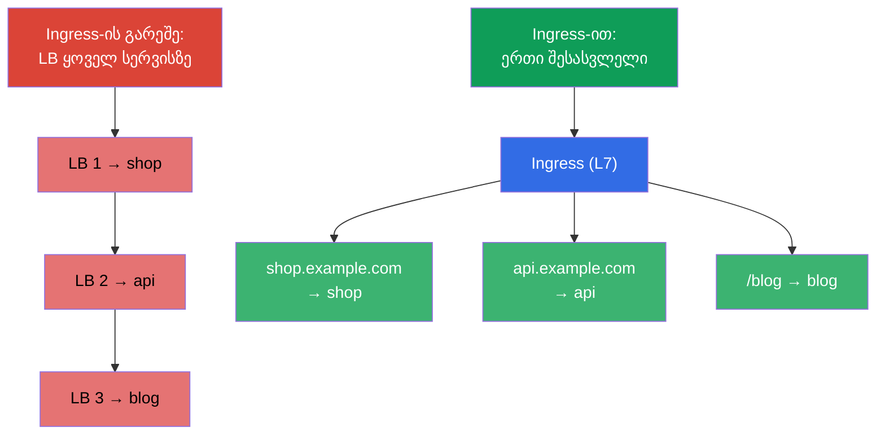
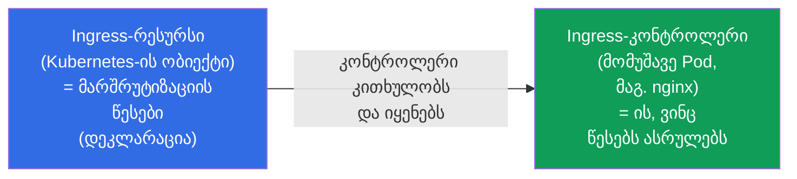
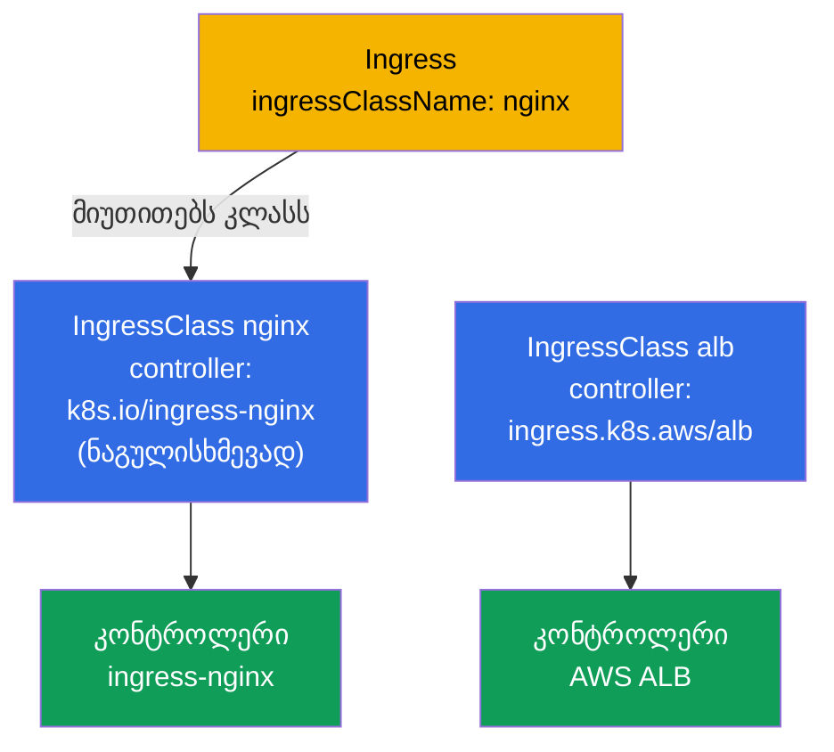
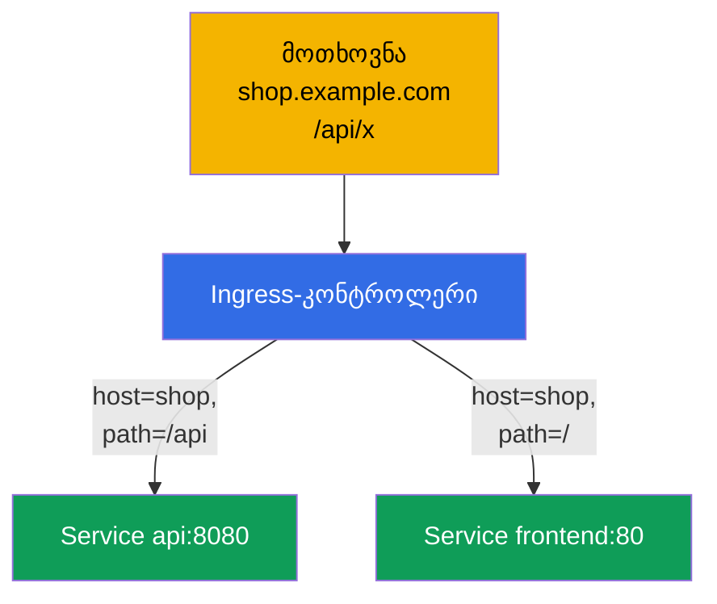
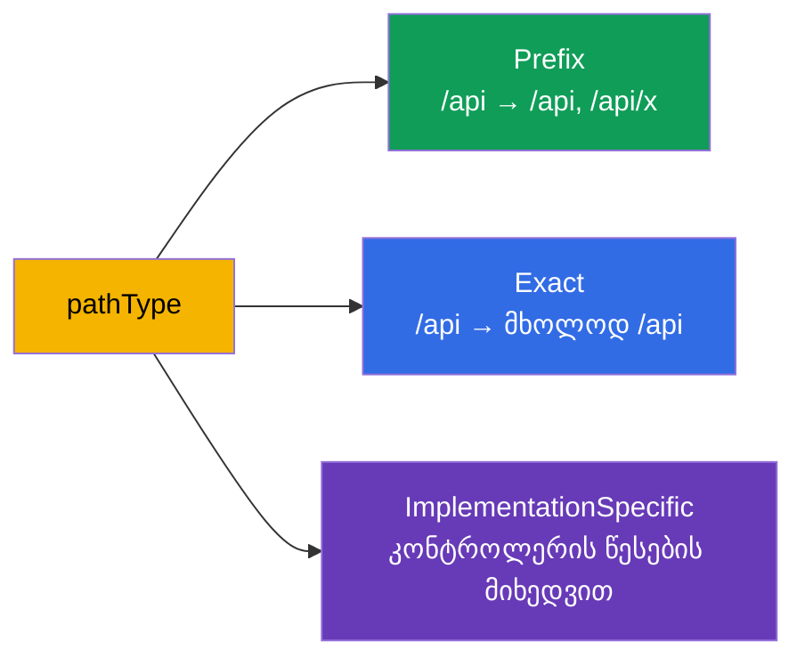
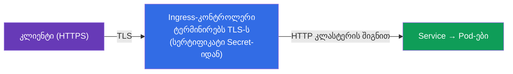
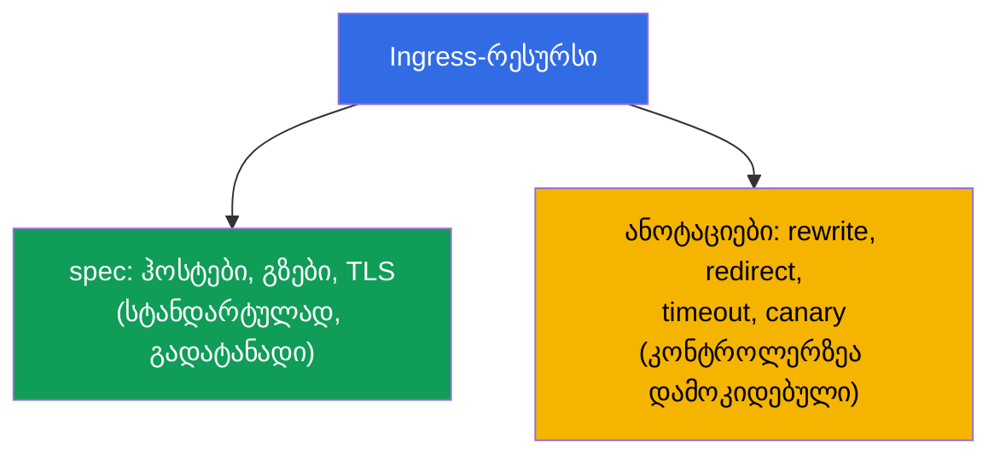

[Русская версия](ru.md) · [Eng version](README.md) · [Versión en español](es.md) · [Version française](fr.md) · [Deutsche Version](de.md) · [繁體中文版](tw.md) · [日本語版](jp.md)

# თავი 32. Ingress და Ingress-კონტროლერები

> **რა იქნება შემდეგ.** NodePort/LoadBalancer ტიპის Service (თავი 7) გარეთ გამოაქვს ერთი
> სერვისი ერთ პორტზე/მისამართზე - ათეულობით სერვისზე ეს ძვირი და მოუხერხებელია. **Ingress**
> ამას L7 დონეზე წყვეტს: ერთი შესასვლელი, ხოლო შემდეგ მარშრუტიზაცია ჰოსტებისა და გზების მიხედვით სხვადასხვა
> სერვისზე, პლუს TLS. ეს ორივე გამოცდის დომენი Services & Networking-ია. გავარჩევთ კონსტრუქციას
> Ingress-რესურსი + Ingress-კონტროლერი, მარშრუტიზაციის წესებსა და TLS-ს.

## 32.1. პრობლემა: როგორ ვუშვათ ტრაფიკი გარედან ეკონომიურად

თუ ყოველ სერვისს LoadBalancer-ით გამოვიტანთ, მივიღებთ თითო ღრუბლოვან დამბალანსებელს (და
ანგარიშს) ყოველ სერვისზე. საჭიროა **ერთი შესასვლელი**, რომელიც თავად გაარკვევს, რომელი სერვისისთვისაა
განკუთვნილი მოთხოვნა - ჰოსტის სახელისა და გზის მიხედვით.



Ingress მუშაობს **L7**-ზე (HTTP/HTTPS): ესმის ჰოსტები, გზები, ჰედერები - განსხვავებით
Service-ის L4-დაბალანსებისგან (თავი 7).

## 32.2. ორი ნაწილი: Ingress-რესურსი და Ingress-კონტროლერი

ეს არის საკვანძო განსხვავება, რომელსაც ხშირად ურევენ. Ingress ორი რაღაცისგან შედგება:



- **Ingress-რესურსი** - ეს მხოლოდ წესების **დეკლარაციაა** („ჰოსტი shop.example.com → სერვისი
  shop“). თავისთავად ის არაფერს არ აკეთებს.
- **Ingress-კონტროლერი** - ეს რეალურად მომუშავე აპლიკაციაა კლასტერში (nginx, Traefik,
  HAProxy, ღრუბლოვანი ALB-კონტროლერი), რომელიც კითხულობს Ingress-რესურსებს და აკონფიგურირებს
  შესაბამის მარშრუტიზაციას.

> **უმნიშვნელოვანესი მომენტი.** Ingress-რესურსი დაყენებული კონტროლერის გარეშე **არ მუშაობს** -
> წესების შესრულება უბრალოდ არავის აქვს დაკისრებული. კლასტერში (kubeadm, minikube) Ingress-კონტროლერი
> ცალკე უნდა დააყენოთ; მართვად კლასტერებშიც მას ჩვეულებრივ თავად აყენებენ. ეს ხშირი
> მიზეზია იმის, რომ „შევქმენი Ingress, მაგრამ ის არ პასუხობს“.

## 32.3. პოპულარული Ingress-კონტროლერები

| კონტროლერი | თავისებურება |
|-----------|-------------|
| **ingress-nginx** | ყველაზე გავრცელებული, nginx-ის ბაზაზე, მდიდარი ანოტაციები |
| **Traefik** | ავტოკონფიგურაცია, მოსახერხებელია დინამიკისთვის |
| **HAProxy** | წარმადი |
| **AWS ALB Controller** | ქმნის ღრუბლოვან ALB-ს Ingress-ის ქვეშ (EKS-ში) |
| **Cloud-სპეციფიკური** | GKE/AKS-კონტროლერები |

კონტროლერებს შორის ზღვარს ავლებს **IngressClass** - ობიექტი, რომელიც მიუთითებს, რომელი
კონტროლერი ემსახურება მოცემულ Ingress-ს (`ingressClassName` რესურსში). ცალკე გავარჩევთ მას.

## 32.4. IngressClass: რომელი კონტროლერი ემსახურება Ingress-ს

კლასტერში შეიძლება ერთდროულად მუშაობდეს **რამდენიმე** Ingress-კონტროლერი (მაგალითად, ingress-nginx
შიდა სერვისებისთვის და ღრუბლოვანი ALB საჯაროებისთვის). იმისთვის, რომ ყოველ კონტროლერს ესმოდეს,
რომელი Ingress-რესურსებია **მისი**, და რომელი სხვისი, არსებობს ობიექტი **IngressClass**. Ingress-რესურსი
მას მიმართავს ველით `spec.ingressClassName`.

```yaml
apiVersion: networking.k8s.io/v1
kind: IngressClass
metadata:
  name: nginx
  annotations:
    ingressclass.kubernetes.io/is-default-class: "true"   # ნაგულისხმევი კლასი
spec:
  controller: k8s.io/ingress-nginx      # კონტროლერის რეალიზაციის იდენტიფიკატორი
```



ვნახოთ, რომელი კლასები არსებობს კლასტერში და რომელია მათგან ნაგულისხმევი:

```bash
# კლასების და მათი კონტროლერების სია
kubectl get ingressclass
# NAME    CONTROLLER              PARAMETERS   AGE
# nginx   k8s.io/ingress-nginx    <none>       10d

# რომელი კლასი აღნიშნულია ნაგულისხმევად (is-default-class ანოტაციით)
kubectl get ingressclass -o jsonpath='{range .items[*]}{.metadata.name}{"\t"}{.metadata.annotations.ingressclass\.kubernetes\.io/is-default-class}{"\n"}{end}'

# კონკრეტული კლასის დეტალები (controller, პარამეტრები)
kubectl describe ingressclass nginx

# რომელ კლასს იყენებენ რეალურად არსებული Ingress-ები
kubectl get ingress -A -o custom-columns=NS:.metadata.namespace,NAME:.metadata.name,CLASS:.spec.ingressClassName
```

რა არის მნიშვნელოვანი ვიცოდეთ:

- **`spec.controller`** - რეალიზაციის უცვლელი იდენტიფიკატორი (მაგალითად,
  `k8s.io/ingress-nginx`), რომელიც თავად კონტროლერმა „დაიმაგრა“. თქვენ ირჩევთ კლასს მისი
  **სახელით** (`nginx`), ხოლო კონტროლერი ემსახურება ყველა Ingress-ს ამ კლასით.
- **IngressClass - cluster-scoped** ობიექტია (არ არის მიბმული namespace-ზე, თავი 6), ხოლო
  Ingress-რესურსები - namespaced და მიმართავენ კლასს ნებისმიერი namespace-იდან.
- **ნაგულისხმევი კლასი.** ანოტაცია `ingressclass.kubernetes.io/is-default-class: "true"`
  კლასს ნაგულისხმევად აქცევს: Ingress **`ingressClassName`-ის გარეშე** მაშინ მასთან მოხვდება.
  ნაგულისხმევი კლასი ერთი უნდა იყოს - სხვა შემთხვევაში მიიღებთ შეცდომას/ორაზროვნებას.
- **თუ კლასი არ არის და ნაგულისხმევიც არ არის** - Ingress რჩება „უპატრონოდ“: არცერთი
  კონტროლერი მას არ აიღებს, და ის ჩუმად არ მუშაობს. ეს ერთ-ერთი ხშირი მიზეზია იმის, რომ „შევქმენი
  Ingress, მაგრამ ის არ პასუხობს“.
- **მოძველებული ანოტაცია.** ადრე კლასს ანოტაციით `kubernetes.io/ingress.class`
  პირდაპირ Ingress-ზე უთითებდნენ. `networking.k8s.io/v1`-ში ის შეცვალა
  ველმა `ingressClassName`; ძველ ანოტაციას ზოგი კონტროლერი ჯერ კიდევ ესმის თავსებადობის
  გულისთვის, მაგრამ ახალ მანიფესტებში ველს იყენებენ.

## 32.5. Ingress-ის მანიფესტი: მარშრუტიზაცია ჰოსტებისა და გზების მიხედვით

```yaml
apiVersion: networking.k8s.io/v1
kind: Ingress
metadata:
  name: shop
  annotations:
    nginx.ingress.kubernetes.io/rewrite-target: /
spec:
  ingressClassName: nginx        # რომელი კონტროლერი ემსახურება
  rules:
  - host: shop.example.com       # მარშრუტიზაცია ჰოსტის მიხედვით
    http:
      paths:
      - path: /api               # და გზის მიხედვით
        pathType: Prefix
        backend:
          service:
            name: api
            port:
              number: 8080
      - path: /
        pathType: Prefix
        backend:
          service:
            name: frontend
            port:
              number: 80
```



Ingress მარშრუტიზაციას აკეთებს **Service**-ზე (და არა პირდაპირ Pod-ებზე) - ანუ ის აშენდება ყველაფრის
ზემოთ, რაც თავებში 7 და 31 გავარჩიეთ.

## 32.6. pathType: როგორ ხდება გზების შედარება

ველი `pathType` განსაზღვრავს გზის შედარების ხერხს - ხშირი დეტალია:

| pathType | როგორ ადარებს |
|----------|------------------|
| `Prefix` | გზის სეგმენტების მიხედვით: `/api` დაემთხვევა `/api`-ს, `/api/x`-ს, მაგრამ არა `/apixyz`-ს |
| `Exact` | გზის ზუსტი დამთხვევა მთლიანად |
| `ImplementationSpecific` | კონტროლერის შეხედულებისამებრ (ხშირად როგორც regex) |



## 32.7. TLS Ingress-ში

Ingress-ს შეუძლია HTTPS-ის ტერმინირება: TLS-ის გაშიფვრა შესასვლელზე, შემდეგ კლასტერში ტრაფიკი
HTTP-თი მიდის. სერტიფიკატი და გასაღები აიღება `kubernetes.io/tls` ტიპის Secret-იდან (თავი 19).

```yaml
spec:
  tls:
  - hosts:
    - shop.example.com
    secretName: shop-tls          # Secret tls.crt-ით და tls.key-ით
  rules:
  - host: shop.example.com
    http:
      paths: [...]
```



სერტიფიკატებს ხელით ქმნიან (`kubectl create secret tls`) ან ავტომატურად
**cert-manager**-ის გავლით - ოპერატორი, რომელიც უშვებს და აახლებს სერტიფიკატებს (მაგალითად,
Let's Encrypt-ისგან). პროდში თითქმის ყოველთვის cert-manager.

## 32.8. ანოტაციები: კონტროლერის ზუსტი კონფიგურაცია

ბაზური Ingress-რესურსი აღწერს მხოლოდ ჰოსტებს/გზებს/TLS-ს. ყველაფერი დანარჩენი (rewrite,
რედირექტები, ტაიმაუტები, rate limit, canary) კონფიგურირდება **ანოტაციებით**, რომლებიც
კონტროლერისთვის სპეციფიკურია:

```yaml
metadata:
  annotations:
    nginx.ingress.kubernetes.io/rewrite-target: /
    nginx.ingress.kubernetes.io/ssl-redirect: "true"
    nginx.ingress.kubernetes.io/proxy-read-timeout: "60"
```



ანოტაციების მინუსი: ისინი **გადაუტანადია** კონტროლერებს შორის და „ბერავს“ რესურსს. ზუსტად
ამ პრობლემას წყვეტს Gateway API (თავი 33), სადაც ასეთი პარამეტრები ხდება ობიექტების
ველები და არა ანოტაცია-სტრიქონები.

## 32.9. როგორ იყენებენ ამას პროდაქშენში

- **Ingress - სტანდარტული შესასვლელია HTTP(S)-ისთვის.** პროდში გარეთ გამოაქვთ ერთი
  Ingress-კონტროლერი (ერთი LoadBalancer-ის უკან), ხოლო ათეულობით სერვისს მარშრუტიზებენ
  Ingress-რესურსების გავლით ჰოსტების/გზების მიხედვით. ეს მკვეთრად უფრო იაფია, ვიდრე LB ყოველ სერვისზე.
- **cert-manager TLS-ისთვის.** სერტიფიკატებს ხელით არ ქმნიან - მათ ავტომატურად უშვებს და
  აახლებს cert-manager (Let's Encrypt/შიდა CA). სერტიფიკატების ხელით განახლება -
  ინციდენტების წყაროა „სერტიფიკატს ვადა გაუვიდა“.
- **Ingress-კონტროლერი უნდა დააყენოთ და მოამსახუროთ.** ეს ცალკე კომპონენტია საკუთარი
  რესურსებით, განახლებებითა და მონიტორინგით. მართვად კლასტერებში ხშირად აყენებენ
  ingress-nginx-ს ან ღრუბლოვან ALB-კონტროლერს.
- **ანოტაციები ამრავლებს შეუთავსებლობას.** nginx-ის ანოტაციებით მდიდარი კონფიგურაცია მოსახერხებელია,
  მაგრამ კონკრეტულ კონტროლერზე გვამაგრებს. ინდუსტრია თანდათან გადადის Gateway API-ზე
  (თავი 33) გადატანადობისა და როლების გამიჯვნის გულისთვის.
- **ხშირი ინციდენტი - Ingress კონტროლერის ან Endpoints-ის გარეშე.** „Ingress არ პასუხობს“
  = ან კონტროლერი არ არის დაყენებული, ან მის უკან სერვისი მზა Pod-ების გარეშეა (ცარიელი Endpoints,
  თავი 7), ან არასწორია `ingressClassName`.

## 32.10. მინი-ლექსიკონი

- **Ingress-რესურსი** - L7-მარშრუტიზაციის წესების დეკლარაცია (ჰოსტები, გზები, TLS).
- **Ingress-კონტროლერი** - აპლიკაცია, რომელიც ასრულებს Ingress-წესებს (nginx, Traefik, ALB).
- **IngressClass** - რომელი კონტროლერი ემსახურება მოცემულ Ingress-ს (`ingressClassName`).
- **pathType** - გზის შედარების ხერხი: Prefix / Exact / ImplementationSpecific.
- **TLS termination** - HTTPS-ის გაშიფვრა Ingress-ზე; სერტიფიკატი tls ტიპის Secret-იდან.
- **cert-manager** - სერტიფიკატების ავტომატური გამოშვებისა და განახლების ოპერატორი.
- **Ingress-ის ანოტაციები** - კონტროლერისთვის სპეციფიკური პარამეტრები (rewrite, timeout და სხვ.).

## 32.11. თავის შეჯამება

- Ingress იძლევა ერთ შესასვლელს ბევრი სერვისისთვის L7-მარშრუტიზაციით ჰოსტების/გზების მიხედვით და TLS-ით -
  უფრო იაფი და მოქნილია, ვიდრე LoadBalancer ყოველ სერვისზე.
- Ingress = რესურსი (წესები, დეკლარაცია) + კონტროლერი (ასრულებს წესებს); დაყენებული
  კონტროლერის გარეშე რესურსი არ მუშაობს.
- კონტროლერები: ingress-nginx, Traefik, HAProxy, ღრუბლოვანი (ALB); ზღვარი ავლებული აქვთ
  IngressClass-ის გავლით.
- მარშრუტიზაცია - host-ისა და path-ის მიხედვით; `pathType` (Prefix/Exact/ImplementationSpecific)
  განსაზღვრავს შედარებას; backend - ეს Service-ია.
- TLS ტერმინირდება Ingress-ზე tls ტიპის Secret-იდან სერტიფიკატით; პროდში მას უშვებს
  cert-manager.
- ზუსტი პარამეტრები - ანოტაციების გავლით, მაგრამ ისინი გადაუტანადია კონტროლერებს შორის (ამ
  პრობლემას წყვეტს Gateway API, თავი 33).

## 32.12. როგორ გამოგადგებათ: გამოცდაზე და რეალურ სამუშაოში

**გამოცდაზე.** „შექმენი Ingress host/path-ის მიხედვით მარშრუტიზაციით“, „დააკონფიგურირე TLS
Ingress-ისთვის“, „რატომ არ პასუხობს Ingress“ - ტიპური დავალებებია. საჭიროა დაწეროთ Ingress-რესურსი
სწორი `pathType`-ით, `ingressClassName`-ით, TLS-სექციით და გაიხსენოთ, რომ საჭიროა მომუშავე
კონტროლერი და არაცარიელი Endpoints სერვისის უკან.

**რეალურ სამუშაოში.** Ingress - სტანდარტული და ეკონომიური ხერხია HTTP(S)-ტრაფიკის კლასტერში
შესაშვებად. cert-manager-თან კონსტრუქცია ავტომატიზებს TLS-ს. „რესურსი vs კონტროლერის“ და ანოტაციების
როლის გაგება - შესასვლელის კონფიგურაციისა და ინციდენტების „სერვისი გარედან მიუწვდომელია“ გარჩევის საფუძველია.

## 32.13. თვითშემოწმების კითხვები

1. რისთვის არის საჭირო Ingress, თუ არსებობს LoadBalancer ტიპის Service?
2. რა განსხვავებაა Ingress-რესურსსა და Ingress-კონტროლერს შორის? რა მოხდება
   კონტროლერის გარეშე?
3. რა არის IngressClass და რისთვის არის საჭირო?
4. რით განსხვავდება pathType Prefix და Exact?
5. როგორ ტერმინირებს Ingress TLS-ს და საიდან იღებს სერტიფიკატს?
6. რისთვის არის საჭირო Ingress-ის ანოტაციები და რაშია მათი მინუსი?
7. დაასახელეთ „Ingress არ პასუხობს“-ის ხშირი მიზეზები.

## პრაქტიკა

გავარჩიეთ კლასიკური Ingress. თავ 33-ში - მისი მემკვიდრე, Gateway API: უფრო მოქნილი და
გადატანადი მარშრუტიზაციის ხერხი, რომელიც CKA-ს პროგრამაში შევიდა. Ingress მუშავდება ქსელის
ლაბებში.

🧪 ლაბი 120 (მათ შორის დრილი Ingress-ზე): [tasks/cka/labs/120](../../labs/120/README_GE.MD)

---
[სარჩევი](../README_GE.md) · [თავი 31](../31/ge.md) · [თავი 33](../33/ge.md)

