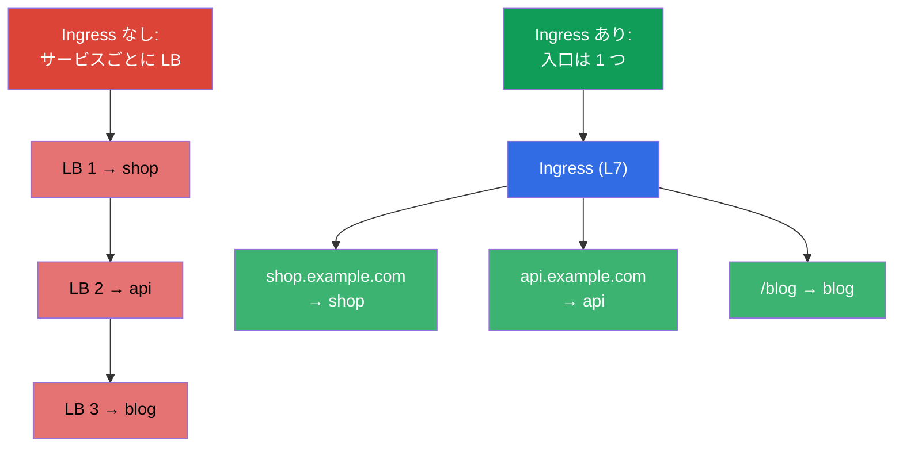
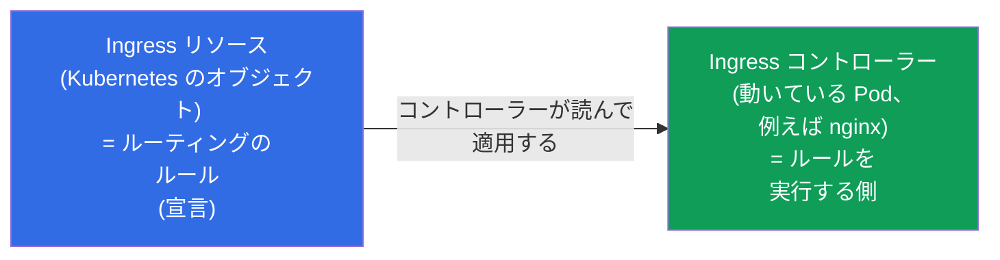
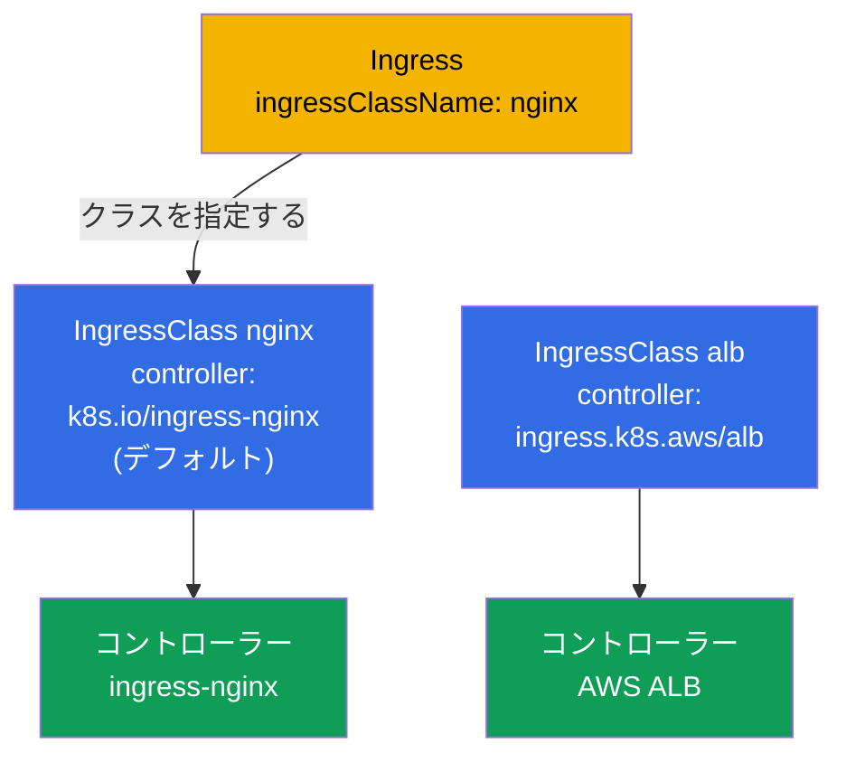
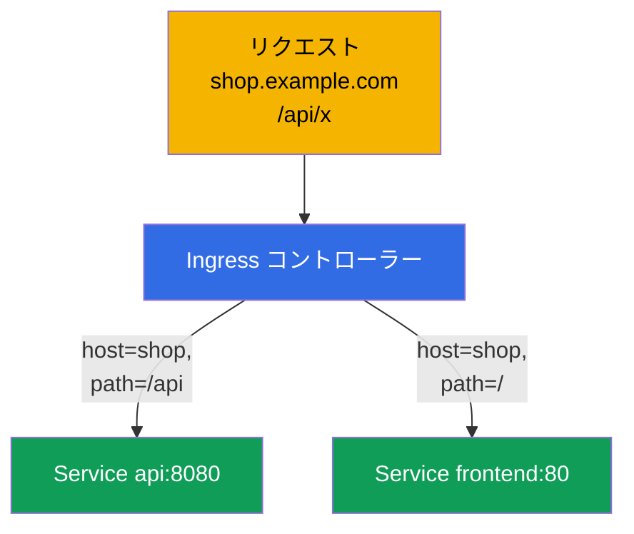
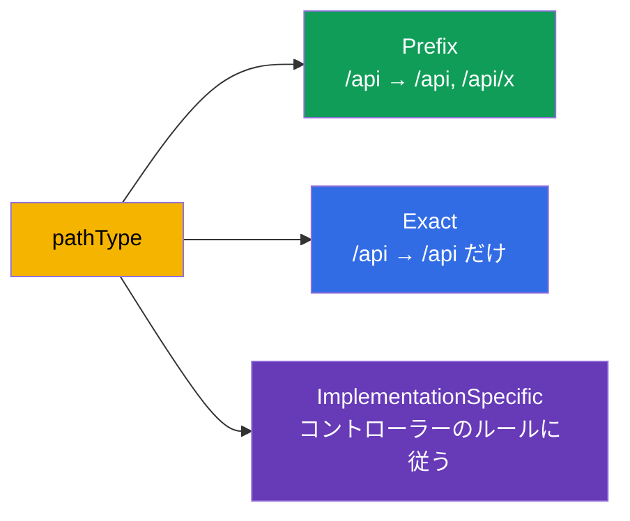
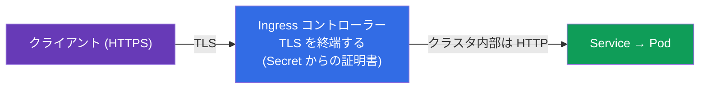
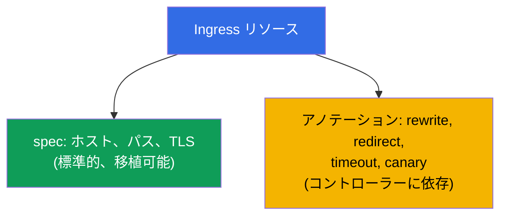

[Русская версия](ru.md) · [Eng version](README.md) · [Versión en español](es.md) · [Version française](fr.md) · [Deutsche Version](de.md) · [ქართული ვერსია](ge.md) · [繁體中文版](tw.md)

# 第 32 章。Ingress と Ingress コントローラー

> **次は何か。** NodePort/LoadBalancer タイプの Service（第 7 章）は、1 つのポート/
> アドレスにつき 1 つのサービスを外へ出します - サービスが数十個あると、これは高価で
> 不便です。**Ingress** はこれを L7 のレベルで解決します：入口は 1 つ、その先はホストと
> パスによって別々のサービスへルーティングし、さらに TLS も扱えます。これは両方の試験の
> Services & Networking 領域です。Ingress リソース + Ingress コントローラーの組み合わせ、
> ルーティングのルール、TLS を見ていきましょう。

## 32.1. 課題：外からのトラフィックをどう安く通すか

サービスごとに LoadBalancer で公開すると、サービス 1 つにつきクラウドのバランサー（と
請求書）が 1 つずつ増えていきます。必要なのは、リクエストがどのサービス宛てなのかを
ホスト名とパスから自分で判断してくれる **1 つの入口** です。



Ingress は **L7**（HTTP/HTTPS）で動きます：Service の L4 バランシング（第 7 章）とは違い、
ホスト、パス、ヘッダーを理解します。

## 32.2. 2 つの部分：Ingress リソースと Ingress コントローラー

これはよく混同される、鍵となる区別です。Ingress は 2 つのものから成り立っています：



- **Ingress リソース** - これはルールの **宣言** にすぎません（「ホスト shop.example.com →
  サービス shop」）。それ自体は何もしません。
- **Ingress コントローラー** - これはクラスタの中で実際に動いているアプリケーション
  (nginx、Traefik、HAProxy、クラウドの ALB コントローラー) で、Ingress リソースを読んで
  対応するルーティングを設定します。

> **もっとも重要な点。** コントローラーがインストールされていない Ingress リソースは
> **動きません** - ルールを実行する者が誰もいないからです。自分で作ったクラスタ (kubeadm、
> minikube) では Ingress コントローラーを別途インストールする必要があります。マネージド
> クラスタでも通常は自分で入れます。これが「Ingress を作ったのに応答しない」のよくある
> 原因です。

## 32.3. よく使われる Ingress コントローラー

| コントローラー | 特徴 |
|-----------|-------------|
| **ingress-nginx** | もっとも普及している、nginx ベース、豊富なアノテーション |
| **Traefik** | 自動設定、動的な環境に便利 |
| **HAProxy** | 高性能 |
| **AWS ALB Controller** | Ingress に対してクラウドの ALB を作る（EKS で） |
| **クラウド固有のもの** | GKE/AKS のコントローラー |

コントローラーの間を切り分けるのが **IngressClass** です - どのコントローラーがこの
Ingress を担当するかを示すオブジェクトで、リソースの `ingressClassName` で指定します。
これは別に見ていきましょう。

## 32.4. IngressClass：どのコントローラーが Ingress を担当するか

クラスタでは **複数** の Ingress コントローラーが同時に動くことがあります（例えば内部
サービス用の ingress-nginx と、公開用のクラウド ALB）。それぞれのコントローラーが、
どの Ingress リソースが **自分のもの** で、どれが他人のものかを理解できるように、
**IngressClass** というオブジェクトがあります。Ingress リソースは `spec.ingressClassName`
フィールドでそれを参照します。

```yaml
apiVersion: networking.k8s.io/v1
kind: IngressClass
metadata:
  name: nginx
  annotations:
    ingressclass.kubernetes.io/is-default-class: "true"   # デフォルトのクラス
spec:
  controller: k8s.io/ingress-nginx      # コントローラー実装の識別子
```



クラスタにどんなクラスがあり、どれがデフォルトかを見るには：

```bash
# クラスとそのコントローラーの一覧
kubectl get ingressclass
# NAME    CONTROLLER              PARAMETERS   AGE
# nginx   k8s.io/ingress-nginx    <none>       10d

# どのクラスがデフォルトとして印を付けられているか (is-default-class アノテーションで)
kubectl get ingressclass -o jsonpath='{range .items[*]}{.metadata.name}{"\t"}{.metadata.annotations.ingressclass\.kubernetes\.io/is-default-class}{"\n"}{end}'

# 特定のクラスの詳細 (controller、パラメータ)
kubectl describe ingressclass nginx

# 既存の Ingress が実際にどのクラスを使っているか
kubectl get ingress -A -o custom-columns=NS:.metadata.namespace,NAME:.metadata.name,CLASS:.spec.ingressClassName
```

知っておくべきこと：

- **`spec.controller`** - 実装の変更不可な識別子（例えば `k8s.io/ingress-nginx`）で、
  コントローラー自身が「先に押さえた」ものです。あなたはクラスをその **名前** (`nginx`)
  で選び、コントローラーはそのクラスを持つすべての Ingress を担当します。
- **IngressClass は cluster-scoped** なオブジェクト（namespace に紐づかない、第 6 章）で、
  Ingress リソースは namespaced で、どの namespace からでもクラスを参照します。
- **デフォルトのクラス。** アノテーション `ingressclass.kubernetes.io/is-default-class: "true"`
  はクラスをデフォルトにします：`ingressClassName` の **ない** Ingress はそこへ渡ります。
  デフォルトのクラスは 1 つだけであるべきです - そうでないとエラー/曖昧さが生じます。
- **クラスもデフォルトも無い場合** - Ingress は「誰のものでもない」状態のままです：
  どのコントローラーも拾わず、黙って動きません。これが「Ingress を作ったのに応答しない」
  のよくある原因の 1 つです。
- **古いアノテーション。** 以前はクラスを Ingress に直接 `kubernetes.io/ingress.class`
  アノテーションで指定していました。`networking.k8s.io/v1` ではそれが `ingressClassName`
  フィールドに置き換わりました。古いアノテーションを互換性のためにまだ理解する
  コントローラーもありますが、新しいマニフェストではフィールドを使います。

## 32.5. Ingress のマニフェスト：ホストとパスによるルーティング

```yaml
apiVersion: networking.k8s.io/v1
kind: Ingress
metadata:
  name: shop
  annotations:
    nginx.ingress.kubernetes.io/rewrite-target: /
spec:
  ingressClassName: nginx        # どのコントローラーが担当するか
  rules:
  - host: shop.example.com       # ホストによるルーティング
    http:
      paths:
      - path: /api               # そしてパスによるルーティング
        pathType: Prefix
        backend:
          service:
            name: api
            port:
              number: 8080
      - path: /
        pathType: Prefix
        backend:
          service:
            name: frontend
            port:
              number: 80
```



Ingress は **Service** へルーティングします（Pod へ直接ではありません）- つまり第 7 章と
第 31 章で見てきたすべての上に積み上がっています。

## 32.6. pathType：パスはどう照合されるか

`pathType` フィールドはパスの比較方法を決めます - よくある細かい落とし穴です：

| pathType | どう照合するか |
|----------|------------------|
| `Prefix` | パスのセグメント単位：`/api` は `/api`、`/api/x` に一致するが `/apixyz` には一致しない |
| `Exact` | パス全体の完全一致 |
| `ImplementationSpecific` | コントローラーの判断に任される（しばしば regex のように） |



## 32.7. Ingress における TLS

Ingress は HTTPS を終端できます：入口で TLS を復号し、その先クラスタの中のトラフィックは
HTTP で流れます。証明書と鍵は `kubernetes.io/tls` タイプの Secret（第 19 章）から取られます。

```yaml
spec:
  tls:
  - hosts:
    - shop.example.com
    secretName: shop-tls          # tls.crt と tls.key を持つ Secret
  rules:
  - host: shop.example.com
    http:
      paths: [...]
```



証明書は手で作る (`kubectl create secret tls`) か、**cert-manager** を通して自動的に作ります -
これは証明書を発行し更新するオペレーターです（例えば Let's Encrypt から）。本番では
ほぼ常に cert-manager です。

## 32.8. アノテーション：コントローラーの細かい設定

基本の Ingress リソースが記述するのはホスト/パス/TLS だけです。それ以外のすべて (rewrite、
リダイレクト、タイムアウト、rate limit、canary) は、コントローラー固有の
**アノテーション** で設定します：

```yaml
metadata:
  annotations:
    nginx.ingress.kubernetes.io/rewrite-target: /
    nginx.ingress.kubernetes.io/ssl-redirect: "true"
    nginx.ingress.kubernetes.io/proxy-read-timeout: "60"
```



アノテーションの弱点：コントローラーの間で **移植できず**、リソースを「膨らませます」。
まさにこの問題を解決するのが Gateway API（第 33 章）で、そこではこうした設定が
アノテーションの文字列ではなくオブジェクトのフィールドになります。

## 32.9. 本番環境でこれをどう使うか

- **Ingress は HTTP(S) の標準的な入口。** 本番では外向きに Ingress コントローラーを
  1 つだけ出し（1 つの LoadBalancer の後ろに）、数十のサービスは Ingress リソースで
  ホスト/パスによってルーティングします。これはサービスごとに LB を持つよりずっと安いです。
- **TLS には cert-manager。** 証明書は手で作らず、cert-manager が自動的に発行し更新します
  (Let's Encrypt/社内 CA)。証明書の手動更新は「証明書が期限切れ」というインシデントの
  発生源です。
- **Ingress コントローラーは設置して運用する必要がある。** これは独自のリソース、更新、
  監視を持つ別のコンポーネントです。マネージドクラスタでは ingress-nginx か、クラウドの
  ALB コントローラーを入れることが多いです。
- **アノテーションは非互換を生む。** nginx のアノテーションによる豊富な設定は便利ですが、
  特定のコントローラーに縛られます。業界は移植性と役割分担のために、少しずつ Gateway API
  （第 33 章）へ移りつつあります。
- **よくあるインシデント - コントローラーの無い Ingress、または Endpoints の無い Ingress。**
  「Ingress が応答しない」= コントローラーがインストールされていないか、その後ろの
  サービスに準備できた Pod が無いか（Endpoints が空、第 7 章）、あるいは
  `ingressClassName` が間違っています。

## 32.10. ミニ用語集

- **Ingress リソース** - L7 ルーティングのルール（ホスト、パス、TLS）の宣言。
- **Ingress コントローラー** - Ingress のルールを実行するアプリケーション (nginx、Traefik、ALB)。
- **IngressClass** - どのコントローラーがこの Ingress を担当するか (`ingressClassName`)。
- **pathType** - パスの照合方法：Prefix / Exact / ImplementationSpecific。
- **TLS termination** - Ingress での HTTPS の復号。証明書は tls タイプの Secret から。
- **cert-manager** - 証明書の自動発行と更新を行うオペレーター。
- **Ingress のアノテーション** - コントローラー固有の設定 (rewrite、timeout など)。

## 32.11. 本章のまとめ

- Ingress は多くのサービスに対して 1 つの入口を与え、ホスト/パスによる L7 ルーティングと
  TLS を提供します - サービスごとの LoadBalancer より安く、柔軟です。
- Ingress = リソース（ルール、宣言）+ コントローラー（ルールを実行する）。コントローラーが
  インストールされていなければリソースは動きません。
- コントローラー：ingress-nginx、Traefik、HAProxy、クラウドのもの (ALB)。IngressClass で
  切り分けられます。
- ルーティングは host と path によって行われ、`pathType` (Prefix/Exact/ImplementationSpecific)
  が照合方法を決めます。backend は Service です。
- TLS は tls タイプの Secret からの証明書で Ingress で終端されます。本番ではそれを
  cert-manager が発行します。
- 細かい設定はアノテーションで行いますが、コントローラーの間で移植できません（この
  問題を解決するのが Gateway API、第 33 章）。

## 32.12. これがどう役に立つか：試験と実際の仕事で

**試験では。** 「host/path によるルーティングを持つ Ingress を作れ」「Ingress に TLS を
設定せよ」「なぜ Ingress が応答しないのか」は典型的な問題です。正しい `pathType`、
`ingressClassName`、TLS セクションを持つ Ingress リソースを書けること、そして動いている
コントローラーとサービスの後ろの空でない Endpoints が必要だと覚えていることが求められます。

**実際の仕事では。** Ingress はクラスタへ HTTP(S) トラフィックを通す標準的で経済的な
方法です。cert-manager との組み合わせは TLS を自動化します。「リソース vs コントローラー」の
理解とアノテーションの役割は、入口の設定と「サービスが外から見えない」というインシデントの
調査の土台です。

## 32.13. 自己チェックの質問

1. LoadBalancer タイプの Service があるのに、なぜ Ingress が必要なのですか？
2. Ingress リソースと Ingress コントローラーの違いは何ですか？コントローラーが無いと
   どうなりますか？
3. IngressClass とは何で、何のために必要なのですか？
4. pathType の Prefix と Exact はどう違いますか？
5. Ingress はどのように TLS を終端し、証明書はどこから取るのですか？
6. Ingress のアノテーションは何のために必要で、その弱点は何ですか？
7. 「Ingress が応答しない」のよくある原因を挙げてください。

## 演習

古典的な Ingress を見てきました。第 33 章ではその後継である Gateway API を扱います：
より柔軟で移植性の高いルーティングの方法で、CKA の出題範囲に入りました。Ingress は
ネットワーク関連のラボで練習します。

🧪 ラボ 120（Ingress のドリルも含む）: [tasks/cka/labs/120](../../labs/120/README_JP.MD)

---
[目次](../README_JP.md) · [第 31 章](../31/jp.md) · [第 33 章](../33/jp.md)
