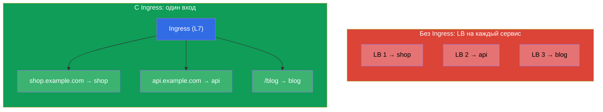
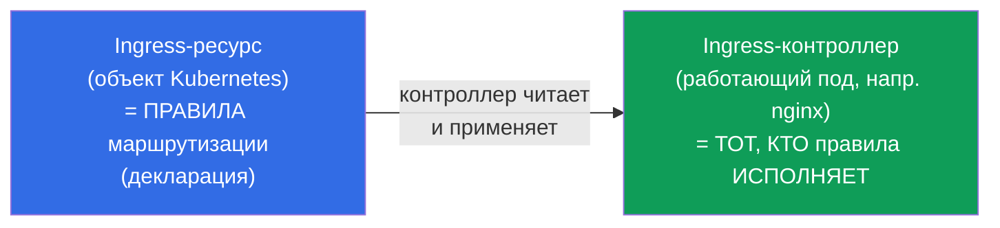
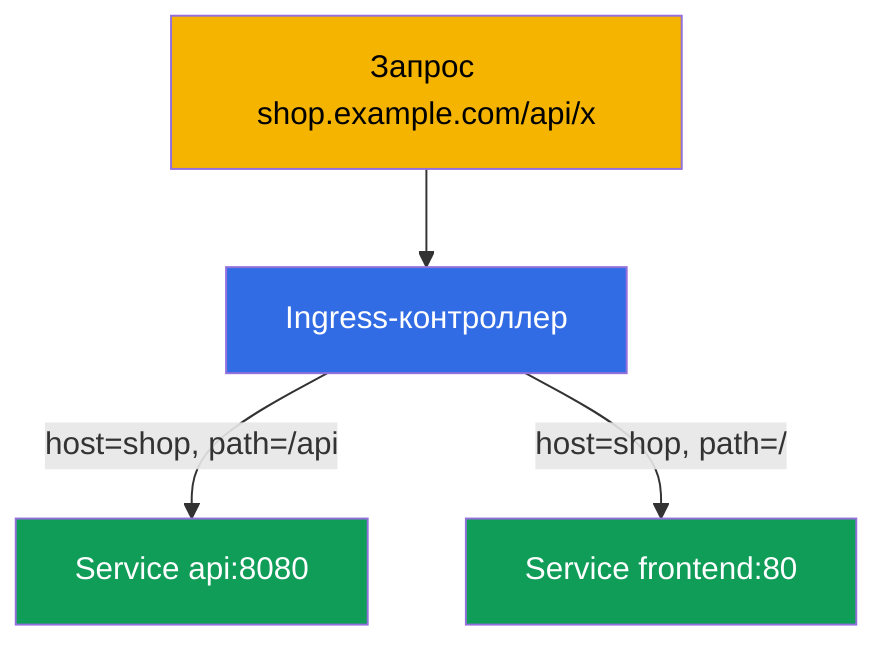
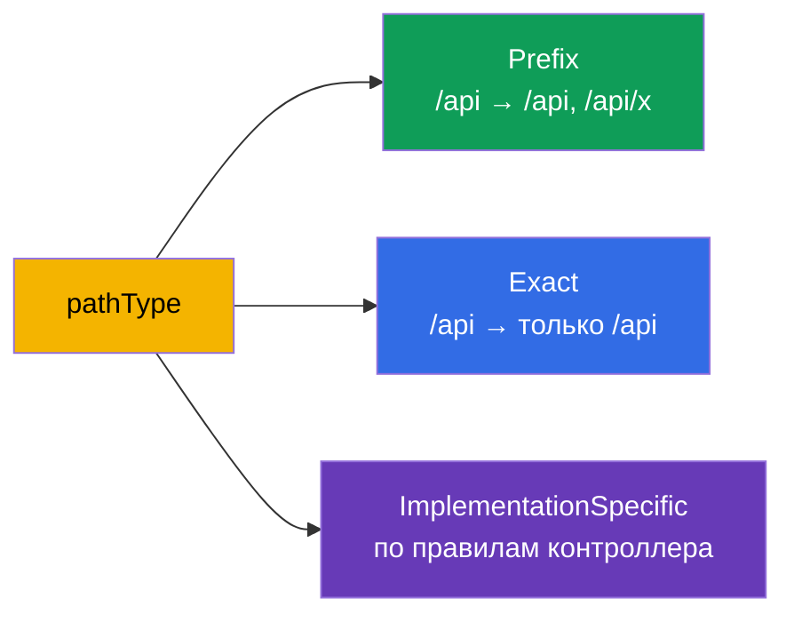
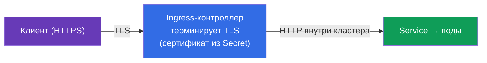
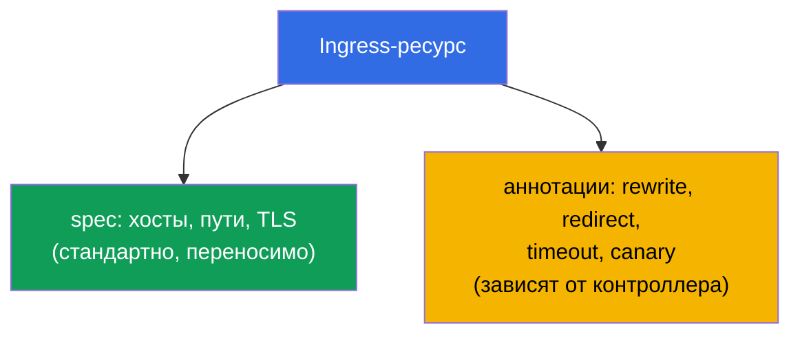

# Глава 32. Ingress и Ingress-контроллеры

> **Что дальше.** Service типа NodePort/LoadBalancer (глава 7) выставляет наружу один
> сервис на один порт/адрес - на десятках сервисов это дорого и неудобно. **Ingress**
> решает это на уровне L7: один вход, а дальше маршрутизация по хостам и путям на разные
> сервисы, плюс TLS. Это домен Services & Networking обоих экзаменов. Разберём связку
> Ingress-ресурс + Ingress-контроллер, правила маршрутизации и TLS.

## 32.1. Проблема: как экономно пускать трафик снаружи

Если каждый сервис выставлять через LoadBalancer, получим по облачному балансировщику (и
счёту) на каждый сервис. Нужен **один вход**, который сам разберёт, какому сервису
предназначен запрос - по имени хоста и пути.



Ingress работает на **L7** (HTTP/HTTPS): понимает хосты, пути, заголовки - в отличие от
L4-балансировки Service (глава 7).

## 32.2. Две части: Ingress-ресурс и Ingress-контроллер

Это ключевое различие, которое часто путают. Ingress состоит из двух вещей:



- **Ingress-ресурс** - это только **декларация** правил («хост shop.example.com → сервис
  shop»). Сам по себе он ничего не делает.
- **Ingress-контроллер** - это реально работающее приложение в кластере (nginx, Traefik,
  HAProxy, облачный ALB-контроллер), которое читает Ingress-ресурсы и настраивает
  соответствующую маршрутизацию.

> **Важнейший момент.** Ingress-ресурс без установленного контроллера **не работает** -
> правила просто некому исполнять. В кластере (kubeadm, minikube) Ingress-контроллер надо
> установить отдельно; в управляемых кластерах его тоже обычно ставят сами. Это частая
> причина «создал Ingress, а он не отвечает».

## 32.3. Популярные Ingress-контроллеры

| Контроллер | Особенность |
|-----------|-------------|
| **ingress-nginx** | самый распространённый, на базе nginx, богатые аннотации |
| **Traefik** | автоконфигурация, удобен для динамики |
| **HAProxy** | производительный |
| **AWS ALB Controller** | создаёт облачный ALB под Ingress (в EKS) |
| **Cloud-специфичные** | GKE/AKS-контроллеры |

Между контроллерами разграничивает **IngressClass** - объект, указывающий, какой
контроллер обслуживает данный Ingress (`ingressClassName` в ресурсе).

## 32.4. Манифест Ingress: маршрутизация по хостам и путям

```yaml
apiVersion: networking.k8s.io/v1
kind: Ingress
metadata:
  name: shop
  annotations:
    nginx.ingress.kubernetes.io/rewrite-target: /
spec:
  ingressClassName: nginx        # какой контроллер обслуживает
  rules:
  - host: shop.example.com       # маршрутизация по хосту
    http:
      paths:
      - path: /api               # и по пути
        pathType: Prefix
        backend:
          service:
            name: api
            port:
              number: 8080
      - path: /
        pathType: Prefix
        backend:
          service:
            name: frontend
            port:
              number: 80
```



Ingress маршрутизирует на **Service** (не напрямую на поды) - то есть надстраивается над
всем, что мы разбирали в главах 7 и 31.

## 32.5. pathType: как сопоставляются пути

Поле `pathType` определяет способ сравнения пути - частая тонкость:

| pathType | Как сопоставляет |
|----------|------------------|
| `Prefix` | по сегментам пути: `/api` совпадёт с `/api`, `/api/x`, но не `/apixyz` |
| `Exact` | точное совпадение пути целиком |
| `ImplementationSpecific` | на усмотрение контроллера (часто как regex) |



## 32.6. TLS в Ingress

Ingress умеет терминировать HTTPS: расшифровывать TLS на входе, дальше в кластер трафик
идёт по HTTP. Сертификат и ключ берутся из Secret типа `kubernetes.io/tls` (глава 19).

```yaml
spec:
  tls:
  - hosts:
    - shop.example.com
    secretName: shop-tls          # Secret с tls.crt и tls.key
  rules:
  - host: shop.example.com
    http:
      paths: [...]
```



Сертификаты создают вручную (`kubectl create secret tls`) или автоматически через
**cert-manager** - оператор, который выпускает и продлевает сертификаты (например, от
Let's Encrypt). В проде почти всегда cert-manager.

## 32.7. Аннотации: тонкая настройка контроллера

Базовый Ingress-ресурс описывает только хосты/пути/TLS. Всё остальное (rewrite,
редиректы, таймауты, rate limit, canary) настраивается **аннотациями**, специфичными для
контроллера:

```yaml
metadata:
  annotations:
    nginx.ingress.kubernetes.io/rewrite-target: /
    nginx.ingress.kubernetes.io/ssl-redirect: "true"
    nginx.ingress.kubernetes.io/proxy-read-timeout: "60"
```



Минус аннотаций: они **непереносимы** между контроллерами и «раздувают» ресурс. Именно
эту проблему решает Gateway API (глава 33), где такие настройки становятся полями
объектов, а не строками-аннотациями.

## 32.8. Как это применяют в продакшене

- **Ingress - стандартный вход для HTTP(S).** В проде наружу выставляют один
  Ingress-контроллер (за одним LoadBalancer), а десятки сервисов маршрутизируют через
  Ingress-ресурсы по хостам/путям. Это резко дешевле, чем LB на каждый сервис.
- **cert-manager для TLS.** Сертификаты не создают руками - их автоматически выпускает и
  продлевает cert-manager (Let's Encrypt/внутренний CA). Ручное обновление сертификатов -
  источник инцидентов «истёк сертификат».
- **Ingress-контроллер надо ставить и обслуживать.** Это отдельный компонент со своими
  ресурсами, обновлениями и мониторингом. В управляемых кластерах часто ставят
  ingress-nginx или облачный ALB-контроллер.
- **Аннотации плодят несовместимость.** Богатая настройка через аннотации nginx удобна,
  но привязывает к конкретному контроллеру. Индустрия постепенно переходит на Gateway API
  (глава 33) ради переносимости и разделения ролей.
- **Частый инцидент - Ingress без контроллера или без Endpoints.** «Ingress не отвечает»
  = либо не установлен контроллер, либо сервис за ним без готовых подов (пустой Endpoints,
  глава 7), либо неверный `ingressClassName`.

## 32.9. Мини-глоссарий

- **Ingress-ресурс** - декларация правил L7-маршрутизации (хосты, пути, TLS).
- **Ingress-контроллер** - приложение, исполняющее Ingress-правила (nginx, Traefik, ALB).
- **IngressClass** - какой контроллер обслуживает данный Ingress (`ingressClassName`).
- **pathType** - способ сопоставления пути: Prefix / Exact / ImplementationSpecific.
- **TLS termination** - расшифровка HTTPS на Ingress; сертификат из Secret типа tls.
- **cert-manager** - оператор автоматического выпуска и продления сертификатов.
- **аннотации Ingress** - настройки, специфичные для контроллера (rewrite, timeout и др.).

## 32.10. Итоги главы

- Ingress даёт один вход для многих сервисов с L7-маршрутизацией по хостам/путям и TLS -
  дешевле и гибче, чем LoadBalancer на каждый сервис.
- Ingress = ресурс (правила, декларация) + контроллер (исполняет правила); без
  установленного контроллера ресурс не работает.
- Контроллеры: ingress-nginx, Traefik, HAProxy, облачные (ALB); разграничиваются через
  IngressClass.
- Маршрутизация - по host и path; `pathType` (Prefix/Exact/ImplementationSpecific)
  задаёт сопоставление; backend - это Service.
- TLS терминируется на Ingress по сертификату из Secret типа tls; в проде его выпускает
  cert-manager.
- Тонкие настройки - через аннотации, но они непереносимы между контроллерами (эту
  проблему решает Gateway API, глава 33).

## 32.11. Как это пригодится: на экзамене и в реальной работе

**На экзамене.** «Создай Ingress с маршрутизацией по host/path», «настрой TLS для
Ingress», «почему Ingress не отвечает» - типовые задания. Нужно писать Ingress-ресурс с
правильным `pathType`, `ingressClassName`, TLS-секцией и помнить, что нужен работающий
контроллер и непустой Endpoints за сервисом.

**В реальной работе.** Ingress - стандартный и экономный способ пускать HTTP(S)-трафик в
кластер. Связка с cert-manager автоматизирует TLS. Понимание «ресурс vs контроллер» и роли
аннотаций - основа настройки входа и разбора инцидентов «сервис недоступен снаружи».

## 32.12. Вопросы для самопроверки

1. Зачем нужен Ingress, если есть Service типа LoadBalancer?
2. В чём разница между Ingress-ресурсом и Ingress-контроллером? Что будет без
   контроллера?
3. Что такое IngressClass и зачем он нужен?
4. Чем отличаются pathType Prefix и Exact?
5. Как Ingress терминирует TLS и откуда берёт сертификат?
6. Зачем нужны аннотации Ingress и в чём их минус?
7. Назовите частые причины «Ingress не отвечает».

## Практика

Мы разобрали классический Ingress. В главе 33 - его преемник, Gateway API: более гибкий и
переносимый способ маршрутизации, вошедший в программу CKA. Ingress отрабатывается в лабах
по сети.

🧪 Лаба 120 (в т.ч. дрилл на Ingress): [tasks/cka/labs/120](../../labs/120/README_RU.MD)

---
[Оглавление](../README_RU.md) · [Глава 31](../31/ru.md) · [Глава 33](../33/ru.md)
