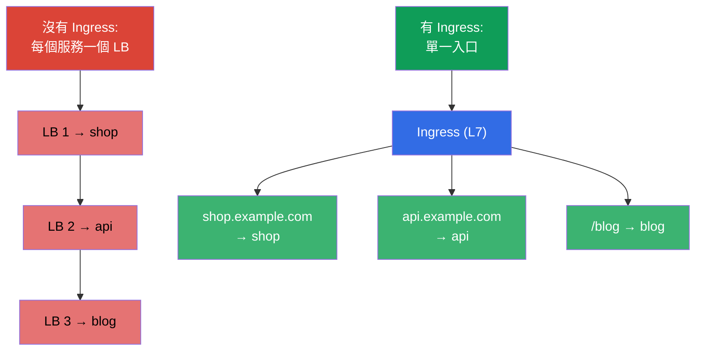
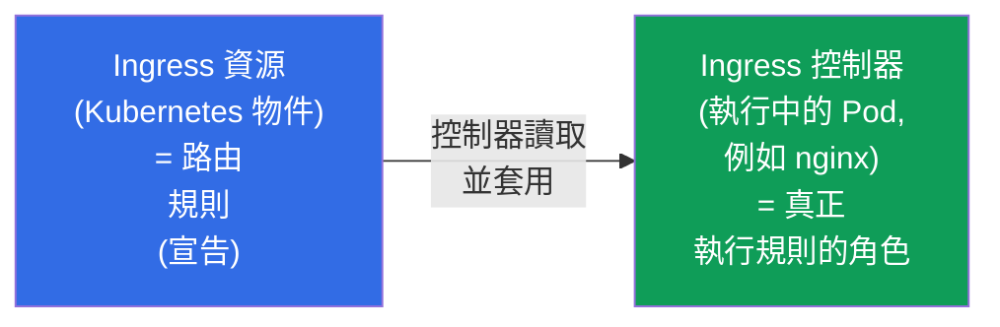
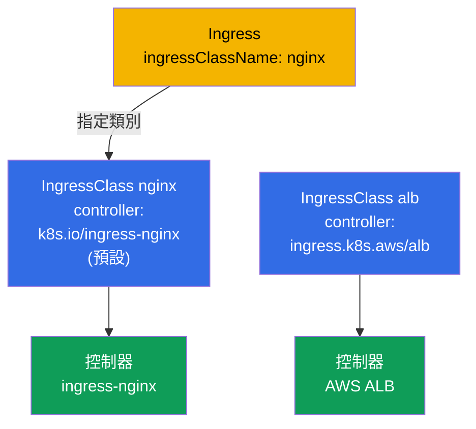
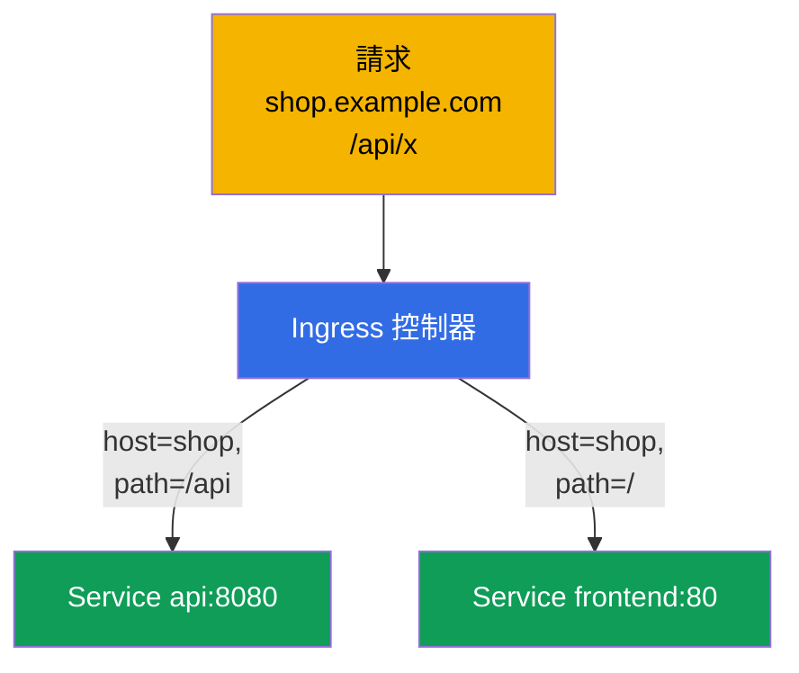
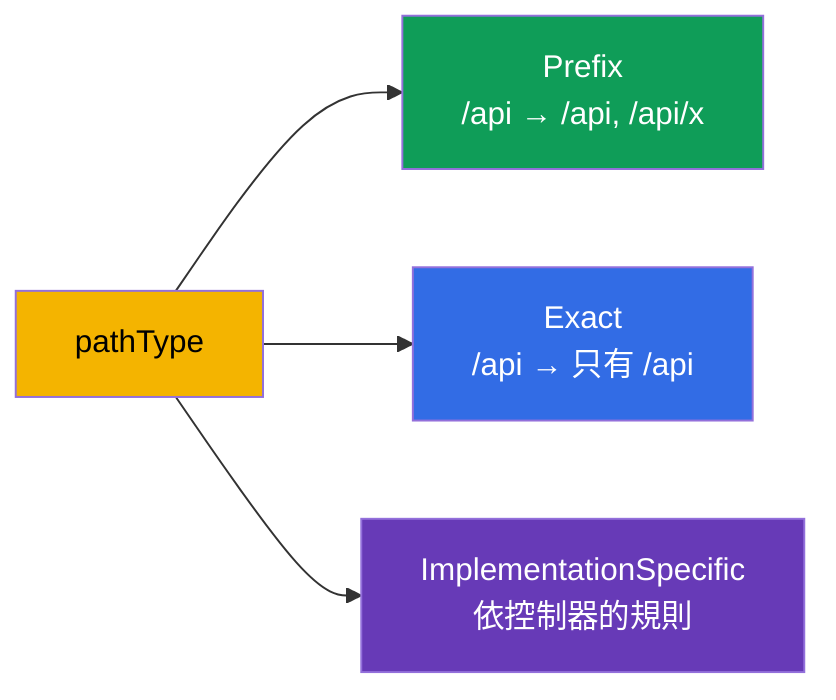
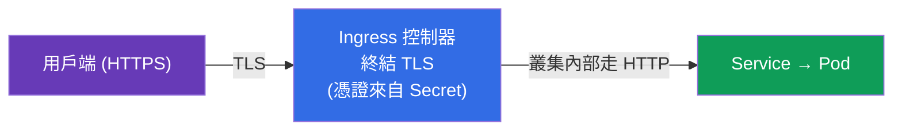
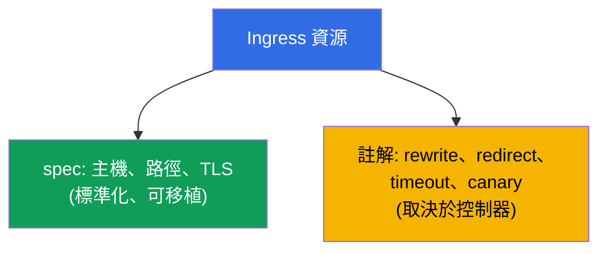

[Русская версия](ru.md) · [Eng version](README.md) · [Versión en español](es.md) · [Version française](fr.md) · [Deutsche Version](de.md) · [ქართული ვერსია](ge.md) · [日本語版](jp.md)

# 第 32 章。Ingress 與 Ingress 控制器

> **接下來是什麼。** NodePort/LoadBalancer 類型的 Service(第 7 章)對外暴露時,一個
> 服務就要一個埠/位址 - 服務數量到了數十個,這既昂貴又不方便。**Ingress** 在 L7 層
> 解決這個問題:一個入口,之後依主機名稱與路徑把流量路由到不同的服務,再加上 TLS。
> 這是兩場考試 Services & Networking 領域的內容。我們來拆解 Ingress 資源 + Ingress
> 控制器這一組搭配、路由規則以及 TLS。

## 32.1. 問題:如何省錢地把外部流量放進來

如果每個服務都用 LoadBalancer 暴露,那每個服務都會對應一個雲端負載平衡器(以及一張
帳單)。我們需要**一個入口**,由它自己判斷請求要送給哪個服務 - 依主機名稱與路徑判斷。



Ingress 工作在 **L7**(HTTP/HTTPS):它理解主機、路徑、標頭 - 這和 Service 的 L4
負載平衡(第 7 章)不同。

## 32.2. 兩個部分:Ingress 資源與 Ingress 控制器

這是最關鍵、也最常被搞混的區別。Ingress 由兩樣東西組成:



- **Ingress 資源** 只是規則的**宣告**(「主機 shop.example.com → 服務 shop」)。它本身
  什麼事都不做。
- **Ingress 控制器** 是叢集中真正執行的應用程式(nginx、Traefik、HAProxy、雲端的
  ALB 控制器),它讀取 Ingress 資源並設定對應的路由。

> **最重要的一點。** 沒有安裝控制器的 Ingress 資源**不會生效** - 規則根本沒有人執行。
> 在自建叢集(kubeadm、minikube)裡,Ingress 控制器必須另外安裝;在託管叢集中通常也
> 得自己裝。這就是「我建了 Ingress,但它沒反應」的常見原因。

## 32.3. 常見的 Ingress 控制器

| 控制器 | 特點 |
|-----------|-------------|
| **ingress-nginx** | 最普及,基於 nginx,註解功能豐富 |
| **Traefik** | 自動設定,適合動態環境 |
| **HAProxy** | 效能好 |
| **AWS ALB Controller** | 為 Ingress 建立雲端 ALB(在 EKS 中) |
| **雲端專屬** | GKE/AKS 的控制器 |

控制器之間用 **IngressClass** 區分 - 這個物件指出哪個控制器負責這個 Ingress(資源中的
`ingressClassName`)。我們單獨來看它。

## 32.4. IngressClass:哪個控制器負責這個 Ingress

叢集裡可以同時運行**多個** Ingress 控制器(例如 ingress-nginx 給內部服務,雲端 ALB 給
公開服務)。為了讓每個控制器知道哪些 Ingress 資源是**自己的**、哪些不是,就有了
**IngressClass** 物件。Ingress 資源透過 `spec.ingressClassName` 欄位引用它。

```yaml
apiVersion: networking.k8s.io/v1
kind: IngressClass
metadata:
  name: nginx
  annotations:
    ingressclass.kubernetes.io/is-default-class: "true"   # 預設類別
spec:
  controller: k8s.io/ingress-nginx      # 控制器實作的識別字
```



查看叢集裡有哪些類別、哪一個是預設:

```bash
# 類別清單與它們的控制器
kubectl get ingressclass
# NAME    CONTROLLER              PARAMETERS   AGE
# nginx   k8s.io/ingress-nginx    <none>       10d

# 哪個類別被標記為預設(依 is-default-class 註解)
kubectl get ingressclass -o jsonpath='{range .items[*]}{.metadata.name}{"\t"}{.metadata.annotations.ingressclass\.kubernetes\.io/is-default-class}{"\n"}{end}'

# 特定類別的細節(controller、參數)
kubectl describe ingressclass nginx

# 現有的 Ingress 實際使用哪個類別
kubectl get ingress -A -o custom-columns=NS:.metadata.namespace,NAME:.metadata.name,CLASS:.spec.ingressClassName
```

需要知道的重點:

- **`spec.controller`** - 不可變更的實作識別字(例如 `k8s.io/ingress-nginx`),由控制器
  自己「佔下」。你是用類別的**名稱**(`nginx`)來選擇,而控制器會服務所有帶這個類別的
  Ingress。
- **IngressClass 是 cluster-scoped** 物件(不屬於任何 namespace,第 6 章),而 Ingress
  資源是 namespaced,可以從任何 namespace 引用這個類別。
- **預設類別。** 註解 `ingressclass.kubernetes.io/is-default-class: "true"` 讓類別成為
  預設:**沒有**指定 `ingressClassName` 的 Ingress 就會落到它手上。預設類別只該有一個
  - 否則會出現錯誤/歧義。
- **如果類別不存在、也沒有預設類別** - Ingress 就變成「沒人管的」:沒有任何控制器會接
  手它,它就默默地不會生效。這也是「我建了 Ingress,但它沒反應」的常見原因之一。
- **已淘汰的註解。** 以前類別是直接用 Ingress 上的 `kubernetes.io/ingress.class` 註解
  指定。在 `networking.k8s.io/v1` 中它已被 `ingressClassName` 欄位取代;為了相容性,
  有些控制器還看得懂舊註解,但新的 manifest 都使用該欄位。

## 32.5. Ingress manifest:依主機與路徑路由

```yaml
apiVersion: networking.k8s.io/v1
kind: Ingress
metadata:
  name: shop
  annotations:
    nginx.ingress.kubernetes.io/rewrite-target: /
spec:
  ingressClassName: nginx        # 由哪個控制器負責
  rules:
  - host: shop.example.com       # 依主機路由
    http:
      paths:
      - path: /api               # 也依路徑
        pathType: Prefix
        backend:
          service:
            name: api
            port:
              number: 8080
      - path: /
        pathType: Prefix
        backend:
          service:
            name: frontend
            port:
              number: 80
```



Ingress 路由的目標是 **Service**(不是直接指向 Pod)- 也就是說,它建立在我們在第 7 章
與第 31 章討論過的一切之上。

## 32.6. pathType:路徑如何比對

`pathType` 欄位決定路徑的比對方式 - 這是常見的細節陷阱:

| pathType | 如何比對 |
|----------|------------------|
| `Prefix` | 依路徑分段比對:`/api` 會匹配 `/api`、`/api/x`,但不匹配 `/apixyz` |
| `Exact` | 整個路徑完全相符 |
| `ImplementationSpecific` | 由控制器決定(常常當成 regex) |



## 32.7. Ingress 中的 TLS

Ingress 可以終結 HTTPS:在入口處解密 TLS,之後在叢集內部流量走 HTTP。憑證與私鑰取自
`kubernetes.io/tls` 類型的 Secret(第 19 章)。

```yaml
spec:
  tls:
  - hosts:
    - shop.example.com
    secretName: shop-tls          # 含 tls.crt 與 tls.key 的 Secret
  rules:
  - host: shop.example.com
    http:
      paths: [...]
```



憑證可以手動建立(`kubectl create secret tls`),也可以透過 **cert-manager** 自動處理 -
這個 operator 會簽發並續期憑證(例如來自 Let's Encrypt)。在生產環境幾乎都用
cert-manager。

## 32.8. 註解:控制器的細部調整

基本的 Ingress 資源只描述主機/路徑/TLS。其他一切(rewrite、重新導向、逾時、rate
limit、canary)都透過控制器專屬的**註解**來設定:

```yaml
metadata:
  annotations:
    nginx.ingress.kubernetes.io/rewrite-target: /
    nginx.ingress.kubernetes.io/ssl-redirect: "true"
    nginx.ingress.kubernetes.io/proxy-read-timeout: "60"
```



註解的缺點:它們在不同控制器之間**不可移植**,而且讓資源「膨脹」。Gateway API
(第 33 章)正是要解決這個問題,在那裡這類設定變成物件的欄位,而不是註解字串。

## 32.9. 生產環境怎麼用

- **Ingress 是 HTTP(S) 的標準入口。** 生產環境對外只暴露一個 Ingress 控制器(後面接一個
  LoadBalancer),數十個服務則透過 Ingress 資源依主機/路徑路由。這比每個服務一個 LB
  便宜得多。
- **用 cert-manager 管 TLS。** 憑證不靠手動建立 - 由 cert-manager 自動簽發與續期
  (Let's Encrypt/內部 CA)。手動更新憑證正是「憑證過期」這類事故的來源。
- **Ingress 控制器需要安裝與維運。** 它是獨立的元件,有自己的資源、升級與監控。在託管
  叢集裡常見的做法是裝 ingress-nginx 或雲端的 ALB 控制器。
- **註解會帶來不相容。** nginx 透過註解提供的豐富設定很方便,但也把你綁在特定控制器
  上。業界正逐步轉向 Gateway API(第 33 章),以取得可移植性與角色分離。
- **常見事故 - Ingress 沒有控制器或沒有 Endpoints。** 「Ingress 沒反應」= 要嘛沒安裝
  控制器,要嘛它後面的服務沒有就緒的 Pod(Endpoints 為空,第 7 章),要嘛
  `ingressClassName` 寫錯了。

## 32.10. 迷你詞彙表

- **Ingress 資源** - L7 路由規則的宣告(主機、路徑、TLS)。
- **Ingress 控制器** - 執行 Ingress 規則的應用程式(nginx、Traefik、ALB)。
- **IngressClass** - 哪個控制器負責這個 Ingress(`ingressClassName`)。
- **pathType** - 路徑的比對方式:Prefix / Exact / ImplementationSpecific。
- **TLS termination** - 在 Ingress 上解密 HTTPS;憑證來自 tls 類型的 Secret。
- **cert-manager** - 自動簽發與續期憑證的 operator。
- **Ingress 註解** - 控制器專屬的設定(rewrite、timeout 等)。

## 32.11. 本章總結

- Ingress 為多個服務提供單一入口,支援依主機/路徑的 L7 路由與 TLS - 比每個服務一個
  LoadBalancer 更便宜也更靈活。
- Ingress = 資源(規則、宣告)+ 控制器(執行規則);沒有安裝控制器,資源就不會生效。
- 控制器有:ingress-nginx、Traefik、HAProxy、雲端的(ALB);彼此透過 IngressClass 區分。
- 路由依 host 與 path;`pathType`(Prefix/Exact/ImplementationSpecific)決定比對方式;
  backend 是 Service。
- TLS 在 Ingress 上依 tls 類型 Secret 中的憑證終結;生產環境由 cert-manager 簽發。
- 細部調整靠註解,但它們在不同控制器之間不可移植(這個問題由 Gateway API 解決,
  第 33 章)。

## 32.12. 這些知識有什麼用:考試與實際工作

**在考試中。** 「建立一個依 host/path 路由的 Ingress」、「為 Ingress 設定 TLS」、
「為什麼 Ingress 沒反應」都是典型題目。你要能寫出帶正確 `pathType`、`ingressClassName`
與 TLS 區段的 Ingress 資源,並記得需要一個運行中的控制器,以及服務後面不能是空的
Endpoints。

**在實際工作中。** Ingress 是把 HTTP(S) 流量放進叢集的標準且省錢的方式。搭配
cert-manager 可以自動化 TLS。理解「資源 vs 控制器」以及註解的角色,是設定入口與排查
「服務從外部無法訪問」事故的基礎。

## 32.13. 自我檢查問題

1. 既然有 LoadBalancer 類型的 Service,為什麼還需要 Ingress?
2. Ingress 資源與 Ingress 控制器有什麼差別?沒有控制器會發生什麼事?
3. IngressClass 是什麼,為什麼需要它?
4. pathType 的 Prefix 與 Exact 有什麼不同?
5. Ingress 如何終結 TLS,憑證從哪裡來?
6. 為什麼需要 Ingress 註解,它們的缺點是什麼?
7. 說出「Ingress 沒反應」的常見原因。

## 實踐

我們拆解了經典的 Ingress。第 33 章 - 它的後繼者 Gateway API:更靈活、更可移植的路由
方式,已經納入 CKA 考綱。Ingress 會在網路相關的實驗中操練。

🧪 實驗 120(其中包含 Ingress 的操練):[tasks/cka/labs/120](../../labs/120/README_TW.MD)

🎮 Killercoda（在瀏覽器中，無需安裝）：[Install Ingress Controller](https://killercoda.com/chadmcrowell/course/ckad/ingress-controller) · [Ingress Host-Based Routing](https://killercoda.com/chadmcrowell/course/ckad/ingress-host-routing) · [Ingress with TLS](https://killercoda.com/chadmcrowell/course/ckad/ingress-tls) · [Create Ingress Resource](https://killercoda.com/chadmcrowell/course/cka/create-ingress)

---
[目錄](../README_TW.md) · [第 31 章](../31/tw.md) · [第 33 章](../33/tw.md)
