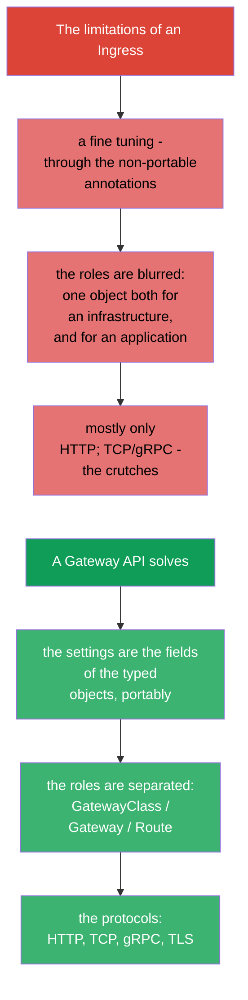
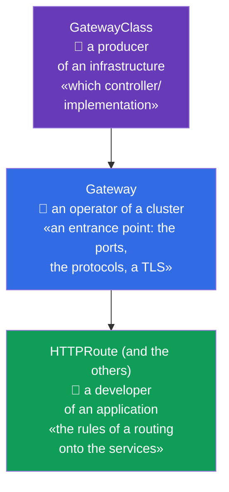
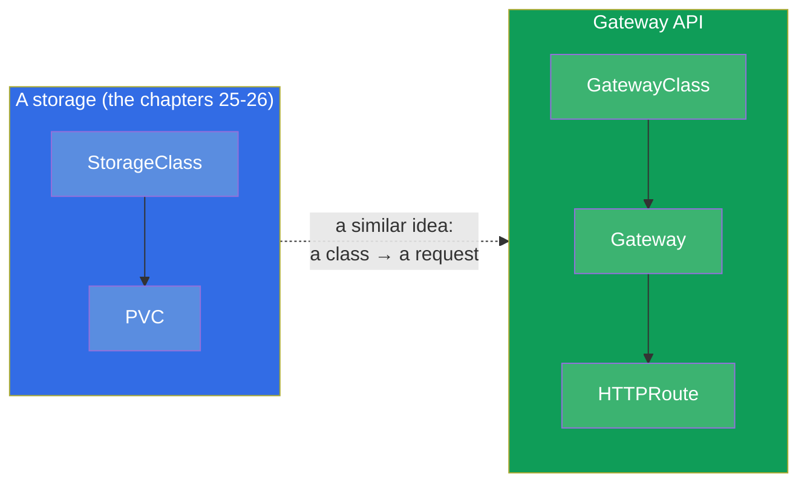
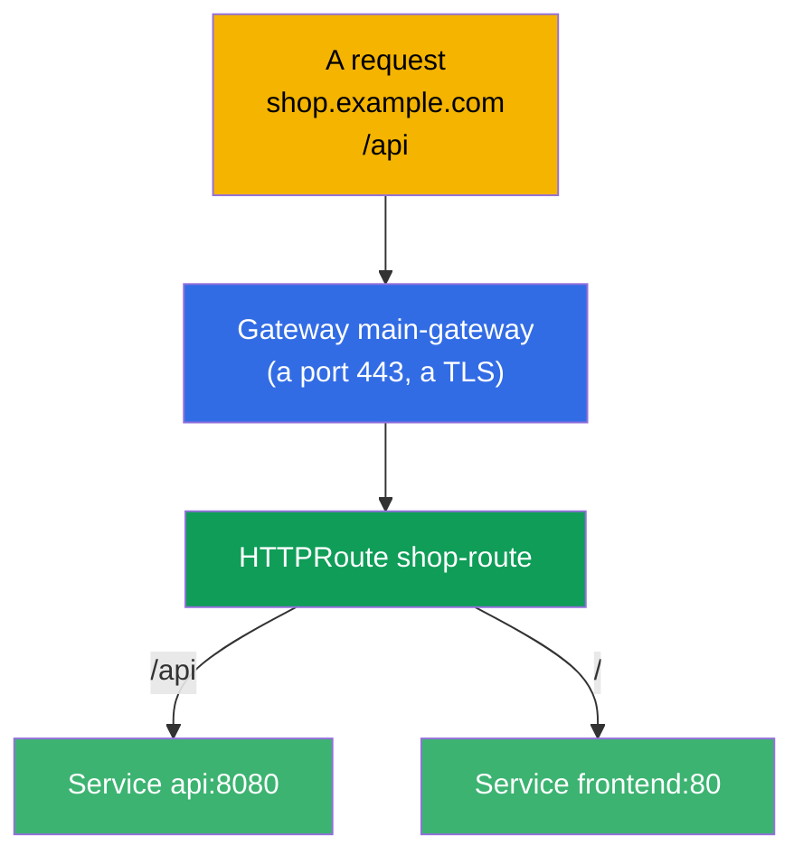
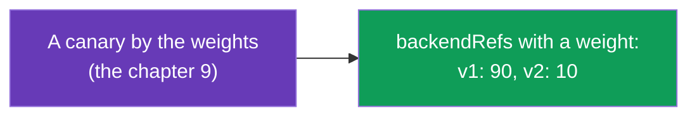
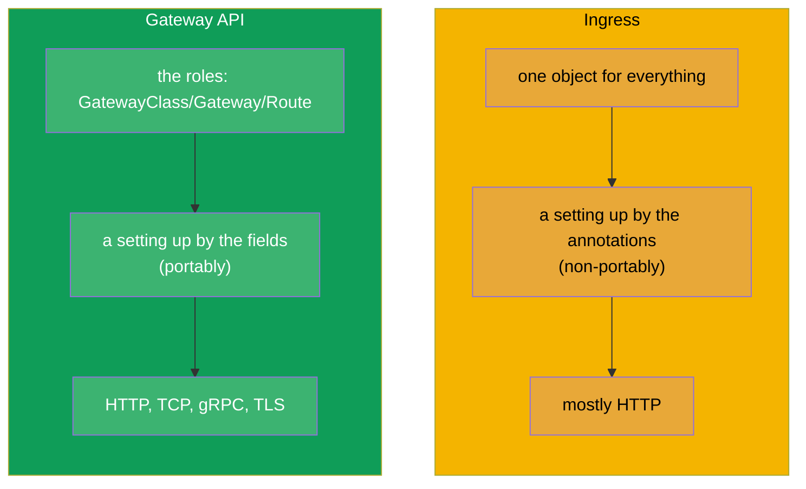
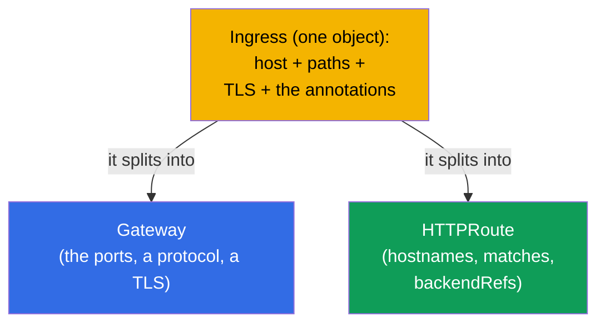
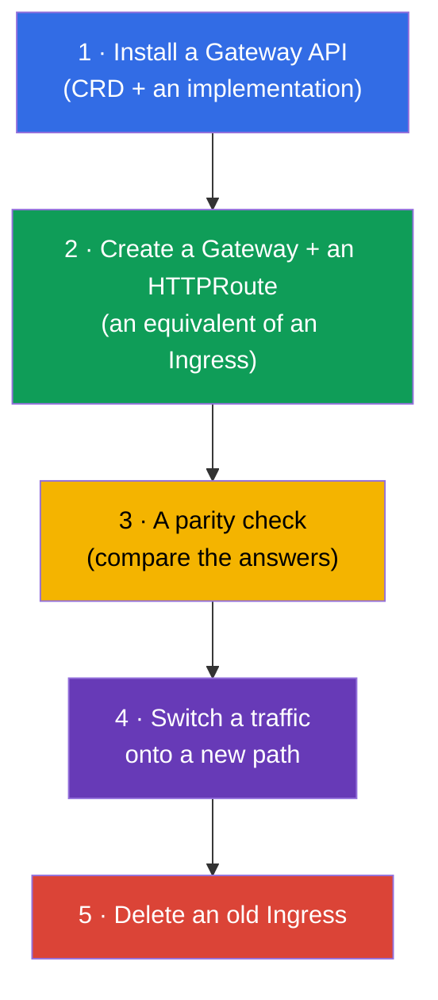

[Русская версия](ru.md) · [Versión en español](es.md) · [Version française](fr.md) · [Deutsche Version](de.md) · [ქართული ვერსია](ge.md)

# Chapter 33. A Gateway API

> **What comes next.** An Ingress (the chapter 32) is simple, but it has a limit: a fine tuning goes through
> the non-portable annotations, and the roles (who owns an entrance, who owns the routes) are blurred.
> A **Gateway API** is a new, a more expressive standard of a routing, which has entered the
> actual programme of the **CKA** (the domain Services & Networking). It has not replaced an Ingress
> instantly, but a future is behind it. Let us consider its model out of the three roles and the objects and compare it with
> an Ingress.

## 33.1. What for is a Gateway API needed

An Ingress has three systemic limitations, which a Gateway API eliminates:



A main idea is a **separation of a responsibility by the roles** and an **expressiveness through the
typed objects** instead of the annotation strings.

## 33.2. The three roles and the three objects

A Gateway API is built around the three roles, to each of them there corresponds its own object. This is its
central conception.



| An object | Who owns it | What it describes |
|--------|-------------|---------------|
| **GatewayClass** | a producer/a platform | an implementation (which controller), as a StorageClass for a network |
| **Gateway** | an operator of a cluster | an entrance point: the listeners (the ports, the protocols, a TLS) |
| **HTTPRoute** (and TCPRoute, gRPCRoute) | a developer of an application | the rules of a routing onto the services |

A sense of a separation: a platform team owns a Gateway (an entrance and a TLS), and the teams of the
applications themselves manage their own HTTPRoute, without touching a common entrance and without hindering each other.
With an Ingress all this was in one object.

## 33.3. An analogy with that, what we already know

In order to fold the roles in a head, the analogies from a course are useful:



A GatewayClass is similar to a StorageClass (the chapter 26): it describes an implementation, which a
platform provides. And a Gateway is a concrete deployed entrance point of this implementation.

## 33.4. An example: a Gateway + an HTTPRoute

A **Gateway** (an operator of a cluster) is an entrance point:

```yaml
apiVersion: gateway.networking.k8s.io/v1
kind: Gateway
metadata:
  name: main-gateway
spec:
  gatewayClassName: nginx           # which implementation (GatewayClass)
  listeners:
  - name: https
    protocol: HTTPS
    port: 443
    tls:
      mode: Terminate
      certificateRefs:
      - kind: Secret
        name: shop-tls
    hostname: "*.example.com"
```

An **HTTPRoute** (a developer of an application) is the rules of a routing, it refers to a Gateway:

```yaml
apiVersion: gateway.networking.k8s.io/v1
kind: HTTPRoute
metadata:
  name: shop-route
spec:
  parentRefs:
  - name: main-gateway              # to which Gateway it is bound
  hostnames:
  - "shop.example.com"
  rules:
  - matches:
    - path:
        type: PathPrefix
        value: /api
    backendRefs:
    - name: api
      port: 8080
  - matches:
    - path:
        type: PathPrefix
        value: /
    backendRefs:
    - name: frontend
      port: 80
```



## 33.5. What a Gateway API is able to do out of a box

That, what in an Ingress demanded the annotations, in a Gateway API are the fields of the objects (portably between
the implementations):

| A possibility | In a Gateway API |
|-------------|---------------|
| a routing by a path/a host/the headers | the fields `matches` in an HTTPRoute |
| a distribution by the weights (a canary) | `weight` in `backendRefs` |
| a rewriting/the redirects | `filters` (URLRewrite, RequestRedirect) |
| a change of the headers | `filters` (RequestHeaderModifier) |
| a TCP, gRPC, TLS routing | TCPRoute, gRPCRoute, TLSRoute |
| a separation of the rights onto the routes | the separate Route in a namespace of the teams |



For example, a canary (the chapter 9) in a Gateway API is done directly by the weights of `backendRefs`, and not by a
number of the replicas or by the annotations - it is cleaner and more precise.

## 33.6. An Ingress against a Gateway API



| | Ingress | Gateway API |
|---|---------|-------------|
| A model | one object | the roles: GatewayClass / Gateway / Route |
| A fine tuning | the annotations (non-portably) | the fields of the objects (portably) |
| The protocols | mostly HTTP(S) | HTTP, TCP, gRPC, TLS |
| A separation of the roles | no | yes (a platform vs an application) |
| A maturity | it is stable for a long time, it is ubiquitous | it is stable, it is gaining a spread |

A Gateway API does not cancel an Ingress instantly - an Ingress will still be met for a long time. But the new
clusters and the advanced scenarios more and more often go through a Gateway API. Many implementations (incl.
Istio - a course ICA) support a Gateway API.

## 33.7. A migration from an Ingress onto a Gateway API

Since a Gateway API is a direction, into which a routing moves, a most important
practical skill (and a theme of an exam) is **to transfer an existing Ingress onto a Gateway API**.
A key idea: one `Ingress` splits into **two objects** - a `Gateway` (an entrance point:
the ports, the protocols, a TLS) and an `HTTPRoute` (the rules: the hosts, the paths, the backends).



### A correspondence of the fields Ingress → Gateway API

| Ingress | Gateway API |
|---------|-------------|
| `ingressClassName` | `Gateway.spec.gatewayClassName` |
| `rules[].host` | `HTTPRoute.spec.hostnames` |
| `rules[].http.paths[].path` (+ `pathType`) | `HTTPRoute.rules[].matches[].path` (`type: PathPrefix/Exact`) |
| `backend.service.name/port` | `HTTPRoute.rules[].backendRefs[].name/port` |
| `tls[]` (secret) | `Gateway.listeners[].tls.certificateRefs` |
| an annotation `rewrite-target` | `HTTPRoute` `filters` → `URLRewrite` |
| an annotation `ssl-redirect` | `Gateway`/`HTTPRoute` `filters` → `RequestRedirect` (HTTPS) |
| the `canary-*` annotations | `backendRefs[].weight` (the chapter 9) |

### An example: it was (an Ingress) → it became (a Gateway + an HTTPRoute)

An initial Ingress:

```yaml
apiVersion: networking.k8s.io/v1
kind: Ingress
metadata:
  name: shop
  annotations:
    nginx.ingress.kubernetes.io/rewrite-target: /
spec:
  ingressClassName: nginx
  rules:
  - host: shop.local
    http:
      paths:
      - path: /api
        pathType: Prefix
        backend:
          service:
            name: api
            port:
              number: 8080
```

An equivalent on a Gateway API is a `Gateway` + an `HTTPRoute`:

```yaml
apiVersion: gateway.networking.k8s.io/v1
kind: Gateway
metadata:
  name: shop-gw
spec:
  gatewayClassName: nginx
  listeners:
  - name: http
    protocol: HTTP
    port: 80
    hostname: "shop.local"
---
apiVersion: gateway.networking.k8s.io/v1
kind: HTTPRoute
metadata:
  name: shop-route
spec:
  parentRefs:
  - name: shop-gw
  hostnames: ["shop.local"]
  rules:
  - matches:
    - path:
        type: PathPrefix
        value: /api
    filters:
    - type: URLRewrite
      urlRewrite:
        path:
          type: ReplacePrefixMatch
          replacePrefixMatch: /       # = rewrite-target: /
    backendRefs:
    - name: api
      port: 8080
```

### A tool ingress2gateway

To rewrite by hands is not obligatory - a utility **ingress2gateway** (a project
kubernetes-sigs) reads the existing `Ingress` and generates the resources of a Gateway API:

```bash
ingress2gateway print --providers ingress-nginx -A > gwapi.yaml
```

The important reservations (the same ones, as at any migration - see a course ICA, a chapter about an ingress→istio):

- an output is a **draft**: the specific annotations of nginx (rewrite, canary, auth, snippet)
  are transferred partially or in no way, they are corrected by hands;
- a **review** and a **parity check** (the same request into an old Ingress and into a new
  Gateway, compare the answers) are obligatory before a switching of a traffic;
- a migration is done **in parallel**: an old Ingress is not deleted, until a new path is not
  validated, - as also at a zero-downtime switching.

### An order of a safe migration



## 33.8. How this is applied in the production

- **A separation of the roles a platform/the teams.** A main value in a prod: a platform team
  owns a Gateway (an entrance, a TLS, the ports), and the product teams themselves manage their own
  HTTPRoute in their own namespace, without touching a common entrance. This removes a bottleneck, when everybody
  edited one Ingress.
- **A portability.** The rules of a Gateway API are not tied onto the annotations of a concrete controller,
  therefore a change of an implementation (nginx → Istio → a cloud one) passes less painfully, than with
  the Ingress annotations.
- **A single mechanism for an L4 and an L7.** A TCPRoute/gRPCRoute/TLSRoute give in a prod one
  coordinated way of a routing not only of an HTTP, but also of a TCP/gRPC - without the "crutches" of
  an Ingress.
- **A migration is a gradual one.** In a prod a Gateway API and an Ingress often coexist: the new
  services are started through a Gateway API, the old ones remain on an Ingress until a planned transfer
  (the tools like an ingress2gateway help to convert).
- **An implementation is needed all the same.** As also an Ingress controller, a Gateway API demands an
  installed implementation (nginx gateway, Istio, Cilium, the cloud ones) - by itself an object
  does not work.

## 33.9. A mini glossary

- **A Gateway API** - a modern standard of a routing of a traffic in Kubernetes.
- **A GatewayClass** - an implementation (a controller) of a Gateway API, an analogue of a StorageClass.
- **A Gateway** - an entrance point: the listeners (the ports, the protocols, a TLS); an operator of a cluster owns it.
- **An HTTPRoute** - the rules of an HTTP routing onto the services; a developer owns it.
- **A TCPRoute / gRPCRoute / TLSRoute** - a routing for the other protocols.
- **parentRefs** - a binding of a Route to a Gateway.
- **backendRefs** - the target services (with the weights for a canary).
- **filters** - the transformations (rewrite, redirect, the headers).
- **A migration of an Ingress → a Gateway API** - a splitting of one Ingress into a Gateway (an entrance) +
  an HTTPRoute (the rules).
- **An ingress2gateway** - a utility of an autoconversion of an Ingress into the resources of a Gateway API (it gives
  a draft, it demands a review).

## 33.10. The summary of the chapter

- A Gateway API is a new standard of a routing, solving the limitations of an Ingress: the non-portable
  annotations, the blurred roles, a weak support of a non-HTTP.
- The three roles/objects: a GatewayClass (an implementation, as a StorageClass), a Gateway (an entrance: the ports,
  the protocols, a TLS - an operator of a cluster), an HTTPRoute (the rules - a developer).
- A separation of the roles is a main idea: a platform owns an entrance, the teams own their own routes.
- The fine settings (a canary by the weights, a rewrite, the headers) are the fields of the objects, and not the annotations;
  an HTTP, TCP, gRPC, TLS are supported.
- An Ingress is not replaced instantly; a Gateway API is gaining a spread, many implementations
  (including Istio) support it.
- As also an Ingress, it demands an installed implementation.
- A migration of an Ingress → a Gateway API: one Ingress splits into a `Gateway` (an entrance: the ports,
  a protocol, a TLS) + an `HTTPRoute` (hostnames, matches, backendRefs); the annotations pass over into
  `filters`/`weight`. A utility `ingress2gateway` gives a draft; they transfer in parallel with a
  parity check, an old Ingress is deleted the last.

## 33.11. How this will come in handy: on the exam and in the real work

**On the exam (CKA).** A Gateway API has entered the actual programme of the CKA. The tasks are expected
"create a Gateway and an HTTPRoute for a routing", **"migrate an existing Ingress onto a
Gateway API"** (to split into a Gateway + an HTTPRoute, to transfer a host/path/backend and a rewrite),
an understanding of the roles GatewayClass/Gateway/Route and of a link parentRefs/backendRefs. It is useful to be able
to match the fields of an Ingress and of a Gateway API.

**In the real work.** A Gateway API is a direction, into which a routing in
Kubernetes moves: a separation of the roles a platform/the teams, a portability, a single mechanism for the different
protocols. An understanding of its model prepares for the modern clusters and simplifies a migration from
an Ingress.

## 33.12. Self-check questions

1. Which limitations of an Ingress does a Gateway API eliminate?
2. Name the three objects of a Gateway API and an owner role of each one.
3. By what is a GatewayClass similar to a StorageClass?
4. How is an HTTPRoute bound to a Gateway and how does it indicate the target services?
5. How to make a canary distribution of a traffic in a Gateway API?
6. By what is a setting up in a Gateway API more portable, than the annotations of an Ingress?
7. Does a Gateway API replace an Ingress right now? What is needed, in order that it would work?
8. How to migrate an `Ingress` onto a Gateway API: into which objects does it split and how
   do a host/path/backend/TLS/rewrite correlate?
9. What does an `ingress2gateway` do and why can its output not be applied without a check?

## Practice

We have considered a modern routing and a migration from an Ingress. In the chapter 34 we will close a part 7
with a theme NetworkPolicy - how to limit, which pod can communicate with which one. A Gateway API,
an Ingress and their migration are drilled in the lab on a network (110).

🧪 Lab 110: [tasks/cka/labs/110](../../labs/110/README.MD)

---
[Contents](../README.md) · [Chapter 32](../32/README.md) · [Chapter 34](../34/README.md)
