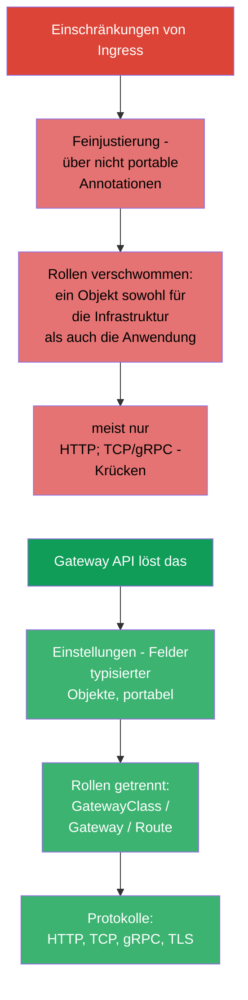
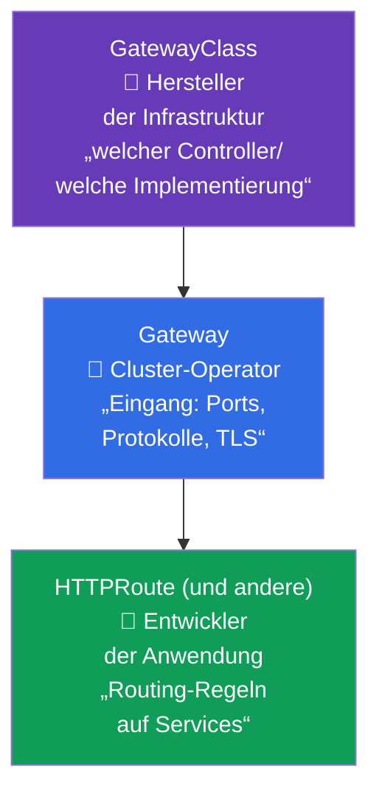
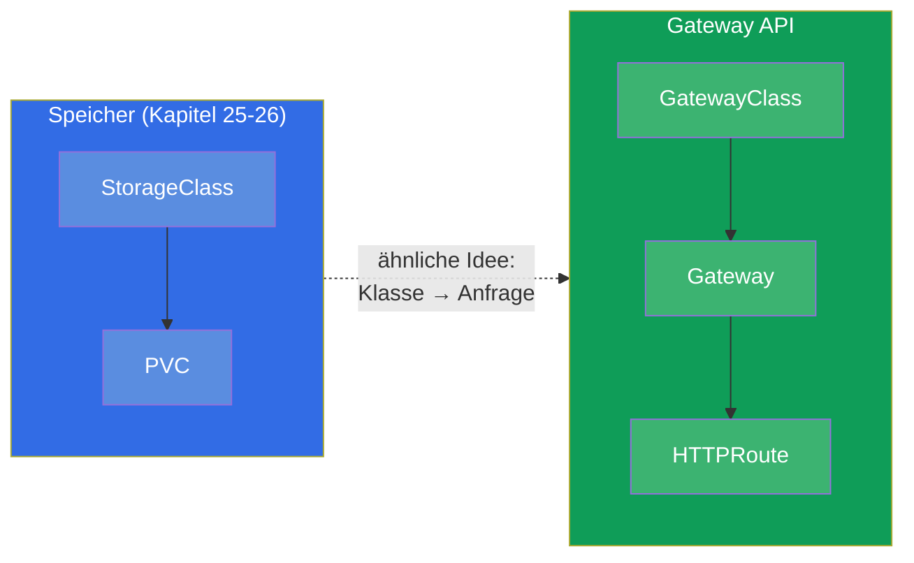
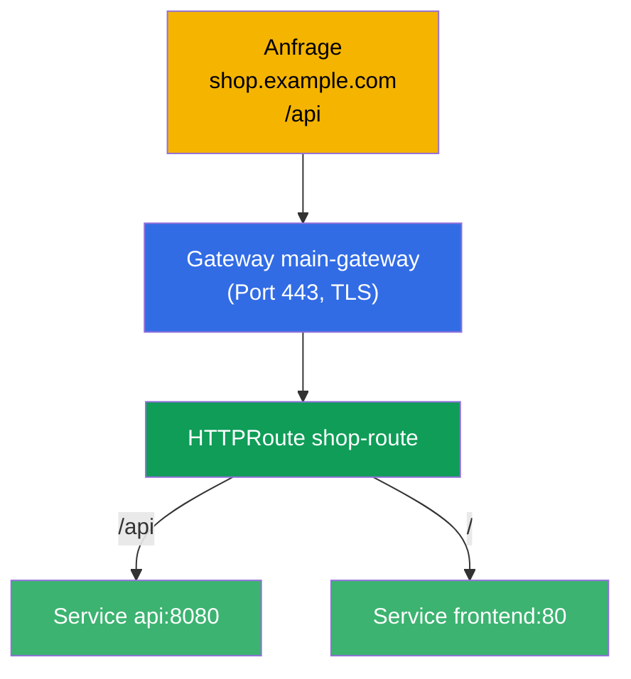
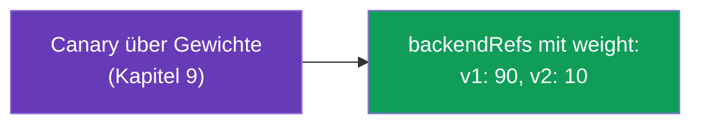
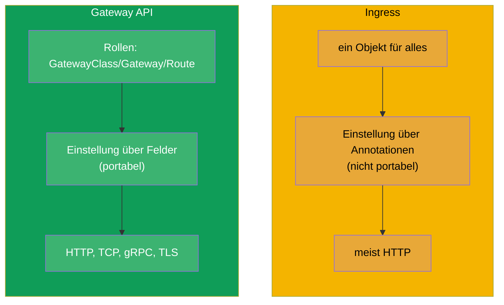
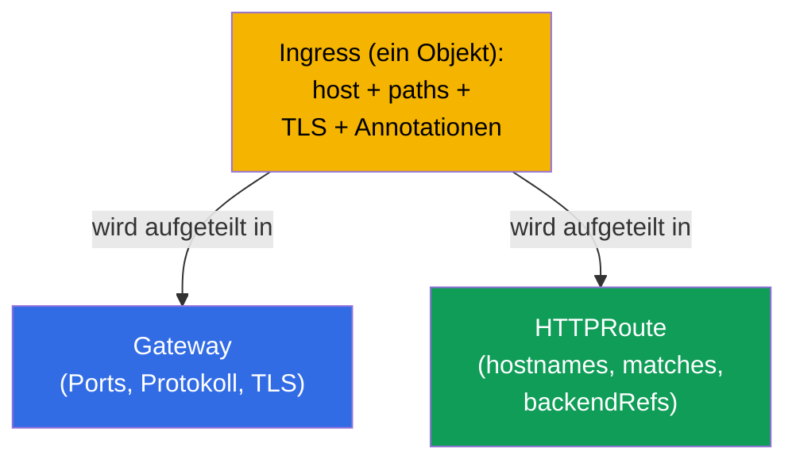
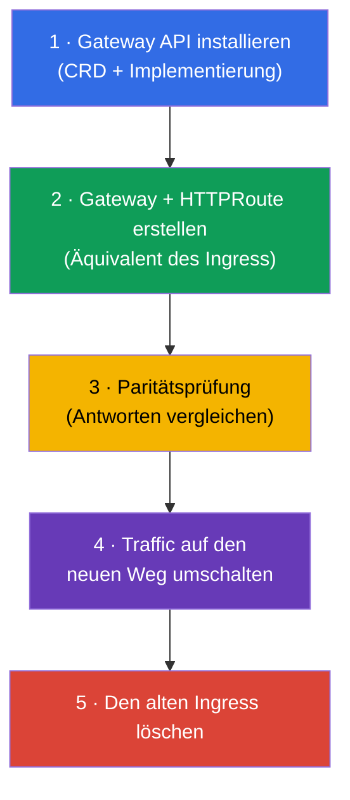

[Русская версия](ru.md) · [Eng version](README.md) · [Versión en español](es.md) · [Version française](fr.md) · [ქართული ვერსია](ge.md) · [繁體中文版](tw.md) · [日本語版](jp.md)

# Kapitel 33. Gateway API

> **Was kommt.** Ingress (Kapitel 32) ist einfach, hat aber eine Grenze: die Feinjustierung
> läuft über nicht portable Annotationen, und die Rollen (wer den Eingang besitzt, wer die
> Routen) sind verschwommen. **Gateway API** ist der neue, ausdrucksstärkere Standard des
> Routings, der ins aktuelle Programm des **CKA** aufgenommen wurde (Domäne Services &
> Networking). Er hat Ingress nicht sofort ersetzt, aber ihm gehört die Zukunft. Wir
> behandeln sein Modell aus drei Rollen und Objekten und vergleichen es mit Ingress.

## 33.1. Wozu man Gateway API braucht

Ingress hat drei systemische Einschränkungen, die Gateway API beseitigt:



Die Hauptidee ist die **Trennung der Verantwortung nach Rollen** und die **Ausdruckskraft
über typisierte Objekte** anstelle von Annotationszeichenketten.

## 33.2. Drei Rollen und drei Objekte

Gateway API ist um drei Rollen herum aufgebaut, jeder von ihnen entspricht ein eigenes
Objekt. Das ist sein zentrales Konzept.



| Objekt | Wer besitzt es | Was es beschreibt |
|--------|-------------|---------------|
| **GatewayClass** | Hersteller/Plattform | Implementierung (welcher Controller), wie StorageClass fürs Netz |
| **Gateway** | Cluster-Operator | Eingang: Listener (Ports, Protokolle, TLS) |
| **HTTPRoute** (und TCPRoute, gRPCRoute) | Entwickler der Anwendung | Routing-Regeln auf Services |

Sinn der Trennung: das Plattform-Team besitzt das Gateway (Eingang und TLS), und die
Anwendungsteams verwalten ihre HTTPRoute selbst, ohne den gemeinsamen Eingang anzufassen und
ohne sich gegenseitig zu behindern. Mit Ingress war all das in einem Objekt.

## 33.3. Analogie zu dem, was wir schon kennen

Um die Rollen im Kopf zu ordnen, helfen Analogien aus dem Kurs:



GatewayClass ist StorageClass ähnlich (Kapitel 26): sie beschreibt die von der Plattform
bereitgestellte Implementierung. Das Gateway ist ein konkreter ausgerollter Eingang davon.

## 33.4. Beispiel: Gateway + HTTPRoute

**Gateway** (Cluster-Operator) - der Eingang:

```yaml
apiVersion: gateway.networking.k8s.io/v1
kind: Gateway
metadata:
  name: main-gateway
spec:
  gatewayClassName: nginx           # welche Implementierung (GatewayClass)
  listeners:
  - name: https
    protocol: HTTPS
    port: 443
    tls:
      mode: Terminate
      certificateRefs:
      - kind: Secret
        name: shop-tls
    hostname: "*.example.com"
```

**HTTPRoute** (Entwickler der Anwendung) - die Routing-Regeln, verweist auf das Gateway:

```yaml
apiVersion: gateway.networking.k8s.io/v1
kind: HTTPRoute
metadata:
  name: shop-route
spec:
  parentRefs:
  - name: main-gateway              # an welches Gateway gebunden
  hostnames:
  - "shop.example.com"
  rules:
  - matches:
    - path:
        type: PathPrefix
        value: /api
    backendRefs:
    - name: api
      port: 8080
  - matches:
    - path:
        type: PathPrefix
        value: /
    backendRefs:
    - name: frontend
      port: 80
```



## 33.5. Was Gateway API von Haus aus kann

Was in Ingress Annotationen brauchte, sind in Gateway API Felder von Objekten (portabel
zwischen den Implementierungen):

| Möglichkeit | In Gateway API |
|-------------|---------------|
| Routing nach Pfad/Host/Headern | Felder `matches` in HTTPRoute |
| Verteilung nach Gewichten (canary) | `weight` in `backendRefs` |
| Rewrites/Redirects | `filters` (URLRewrite, RequestRedirect) |
| Änderung von Headern | `filters` (RequestHeaderModifier) |
| TCP-, gRPC-, TLS-Routing | TCPRoute, gRPCRoute, TLSRoute |
| Trennung der Rechte auf Routen | eigene Route in den Namespaces der Teams |



Zum Beispiel wird canary (Kapitel 9) in Gateway API direkt über die Gewichte von
`backendRefs` gemacht, nicht über Replica-Zahlen oder Annotationen - sauberer und genauer.

## 33.6. Ingress gegen Gateway API



| | Ingress | Gateway API |
|---|---------|-------------|
| Modell | ein Objekt | Rollen: GatewayClass / Gateway / Route |
| Feinjustierung | Annotationen (nicht portabel) | Felder von Objekten (portabel) |
| Protokolle | meist HTTP(S) | HTTP, TCP, gRPC, TLS |
| Rollentrennung | nein | ja (Plattform vs Anwendung) |
| Reifegrad | lange stabil, allgegenwärtig | stabil, gewinnt Verbreitung |

Gateway API schafft Ingress nicht sofort ab - Ingress wird noch lange vorkommen. Aber neue
Cluster und fortgeschrittene Szenarien gehen immer häufiger über Gateway API. Viele
Implementierungen (u. a. Istio - Kurs ICA) unterstützen Gateway API.

## 33.7. Migration von Ingress auf Gateway API

Da Gateway API die Richtung ist, in die sich das Routing bewegt, ist die wichtigste
praktische Fähigkeit (und ein Prüfungsthema) - **einen bestehenden Ingress auf Gateway API zu
übertragen**. Kernidee: ein `Ingress` wird in **zwei Objekte** aufgeteilt - `Gateway`
(Eingang: Ports, Protokolle, TLS) und `HTTPRoute` (Regeln: Hosts, Pfade, Backends).



### Entsprechung der Felder Ingress → Gateway API

| Ingress | Gateway API |
|---------|-------------|
| `ingressClassName` | `Gateway.spec.gatewayClassName` |
| `rules[].host` | `HTTPRoute.spec.hostnames` |
| `rules[].http.paths[].path` (+ `pathType`) | `HTTPRoute.rules[].matches[].path` (`type: PathPrefix/Exact`) |
| `backend.service.name/port` | `HTTPRoute.rules[].backendRefs[].name/port` |
| `tls[]` (secret) | `Gateway.listeners[].tls.certificateRefs` |
| Annotation `rewrite-target` | `HTTPRoute` `filters` → `URLRewrite` |
| Annotation `ssl-redirect` | `Gateway`/`HTTPRoute` `filters` → `RequestRedirect` (HTTPS) |
| `canary-*`-Annotationen | `backendRefs[].weight` (Kapitel 9) |

### Beispiel: vorher (Ingress) → nachher (Gateway + HTTPRoute)

Der ursprüngliche Ingress:

```yaml
apiVersion: networking.k8s.io/v1
kind: Ingress
metadata:
  name: shop
  annotations:
    nginx.ingress.kubernetes.io/rewrite-target: /
spec:
  ingressClassName: nginx
  rules:
  - host: shop.local
    http:
      paths:
      - path: /api
        pathType: Prefix
        backend:
          service:
            name: api
            port:
              number: 8080
```

Das Äquivalent in Gateway API - `Gateway` + `HTTPRoute`:

```yaml
apiVersion: gateway.networking.k8s.io/v1
kind: Gateway
metadata:
  name: shop-gw
spec:
  gatewayClassName: nginx
  listeners:
  - name: http
    protocol: HTTP
    port: 80
    hostname: "shop.local"
---
apiVersion: gateway.networking.k8s.io/v1
kind: HTTPRoute
metadata:
  name: shop-route
spec:
  parentRefs:
  - name: shop-gw
  hostnames: ["shop.local"]
  rules:
  - matches:
    - path:
        type: PathPrefix
        value: /api
    filters:
    - type: URLRewrite
      urlRewrite:
        path:
          type: ReplacePrefixMatch
          replacePrefixMatch: /       # = rewrite-target: /
    backendRefs:
    - name: api
      port: 8080
```

### Das Werkzeug ingress2gateway

Man muss nicht von Hand umschreiben - das Tool **ingress2gateway** (Projekt
kubernetes-sigs) liest bestehende `Ingress` und generiert Ressourcen von Gateway API:

```bash
ingress2gateway print --providers ingress-nginx -A > gwapi.yaml
```

Wichtige Vorbehalte (wie bei jeder Migration - siehe Kurs ICA, Kapitel zu ingress→istio):

- die Ausgabe ist ein **Entwurf**: spezifische nginx-Annotationen (rewrite, canary, auth,
  snippet) werden teilweise oder gar nicht übertragen, sie werden von Hand nachgezogen;
- **Review** und **Paritätsprüfung** (die gleiche Anfrage an den alten Ingress und an das
  neue Gateway, Antworten vergleichen) sind vor dem Umschalten des Traffics Pflicht;
- die Migration macht man **parallel**: den alten Ingress löscht man nicht, solange der neue
  Weg nicht validiert ist, - genau wie beim Umschalten ohne Downtime.

### Reihenfolge einer sicheren Migration



## 33.8. Wie man das in der Produktion anwendet

- **Rollentrennung Plattform/Teams.** Der Hauptwert in der Produktion: das Plattform-Team
  besitzt das Gateway (Eingang, TLS, Ports), und die Produktteams verwalten ihre HTTPRoute
  selbst in ihren Namespaces, ohne den gemeinsamen Eingang anzufassen. Das beseitigt den
  Engpass, wenn alle einen einzigen Ingress bearbeiteten.
- **Portabilität.** Die Regeln von Gateway API hängen nicht an den Annotationen eines
  konkreten Controllers, deshalb verläuft ein Wechsel der Implementierung (nginx → Istio →
  Cloud) weniger schmerzhaft als mit Ingress-Annotationen.
- **Ein einheitlicher Mechanismus für L4 und L7.** TCPRoute/gRPCRoute/TLSRoute geben in der
  Produktion einen konsistenten Weg des Routings nicht nur für HTTP, sondern auch für
  TCP/gRPC - ohne die „Krücken“ von Ingress.
- **Migration schrittweise.** In der Produktion existieren Gateway API und Ingress oft
  nebeneinander: neue Services legt man über Gateway API an, alte bleiben auf Ingress bis zur
  planmäßigen Übertragung (Werkzeuge wie ingress2gateway helfen beim Konvertieren).
- **Eine Implementierung ist trotzdem nötig.** Wie ein Ingress-Controller erfordert Gateway
  API eine installierte Implementierung (nginx gateway, Istio, Cilium, Cloud-Varianten) - das
  Objekt allein funktioniert nicht.

## 33.9. Mini-Glossar

- **Gateway API** - moderner Standard für das Routing von Traffic in Kubernetes.
- **GatewayClass** - Implementierung (Controller) von Gateway API, Analogon zu StorageClass.
- **Gateway** - Eingang: Listener (Ports, Protokolle, TLS); besitzt der Cluster-Operator.
- **HTTPRoute** - Regeln des HTTP-Routings auf Services; besitzt der Entwickler.
- **TCPRoute / gRPCRoute / TLSRoute** - Routing für andere Protokolle.
- **parentRefs** - Bindung einer Route an ein Gateway.
- **backendRefs** - Ziel-Services (mit Gewichten für canary).
- **filters** - Transformationen (rewrite, redirect, Header).
- **Migration Ingress → Gateway API** - Aufteilung eines Ingress in Gateway (Eingang) +
  HTTPRoute (Regeln).
- **ingress2gateway** - Tool zur automatischen Konvertierung von Ingress in Ressourcen von
  Gateway API (liefert einen Entwurf, erfordert Review).

## 33.10. Zusammenfassung des Kapitels

- Gateway API ist der neue Standard des Routings, der die Einschränkungen von Ingress löst:
  nicht portable Annotationen, verschwommene Rollen, schwache Unterstützung von nicht-HTTP.
- Drei Rollen/Objekte: GatewayClass (Implementierung, wie StorageClass), Gateway (Eingang:
  Ports, Protokolle, TLS - Cluster-Operator), HTTPRoute (Regeln - Entwickler).
- Die Rollentrennung ist die Hauptidee: die Plattform besitzt den Eingang, die Teams die Routen.
- Feineinstellungen (canary über Gewichte, rewrite, Header) sind Felder von Objekten und
  keine Annotationen; unterstützt werden HTTP, TCP, gRPC, TLS.
- Ingress ist nicht sofort ersetzt; Gateway API gewinnt Verbreitung, viele Implementierungen
  (einschließlich Istio) unterstützen es.
- Wie Ingress erfordert es eine installierte Implementierung.
- Migration Ingress → Gateway API: ein Ingress wird in `Gateway` (Eingang: Ports, Protokoll,
  TLS) + `HTTPRoute` (hostnames, matches, backendRefs) aufgeteilt; Annotationen gehen in
  `filters`/`weight` über. Das Tool `ingress2gateway` liefert einen Entwurf; übertragen wird
  parallel mit Paritätsprüfung, den alten Ingress löscht man zuletzt.

## 33.11. Wofür das nützlich ist: in der Prüfung und in der echten Arbeit

**In der Prüfung (CKA).** Gateway API ist ins aktuelle CKA-Programm aufgenommen worden.
Zu erwarten: Aufgaben „erstelle ein Gateway und eine HTTPRoute für das Routing“,
**„migriere einen bestehenden Ingress auf Gateway API“** (Aufteilen in Gateway + HTTPRoute,
host/path/backend und rewrite übertragen), Verständnis der Rollen GatewayClass/Gateway/Route
und der Verbindung parentRefs/backendRefs sowie das Zuordnen der Felder beider Modelle.

**In der echten Arbeit.** Gateway API ist die Richtung, in die sich das Routing in Kubernetes
bewegt: Rollentrennung Plattform/Teams, Portabilität, ein einheitlicher Mechanismus für
verschiedene Protokolle. Das Verständnis seines Modells bereitet auf moderne Cluster vor und
erleichtert die Migration von Ingress.

## 33.12. Fragen zur Selbstüberprüfung

1. Welche Einschränkungen von Ingress beseitigt Gateway API?
2. Nennen Sie die drei Objekte von Gateway API und die Besitzer-Rolle jedes einzelnen.
3. Worin ist GatewayClass StorageClass ähnlich?
4. Wie wird eine HTTPRoute an ein Gateway gebunden und wie gibt sie die Ziel-Services an?
5. Wie macht man in Gateway API eine canary-Verteilung des Traffics?
6. Wodurch ist die Einstellung in Gateway API portabler als die Annotationen von Ingress?
7. Ersetzt Gateway API Ingress schon jetzt? Was ist nötig, damit es funktioniert?
8. Wie migriert man einen `Ingress` auf Gateway API: in welche Objekte wird er aufgeteilt und
   wie verhalten sich host/path/backend/TLS/rewrite dazu?
9. Was macht `ingress2gateway` und warum darf man seine Ausgabe nicht ungeprüft anwenden?

## Praxis

Wir haben das moderne Routing und die Migration von Ingress behandelt. In Kapitel 34
schließen wir Teil 7 mit NetworkPolicy ab - wie man einschränkt, welcher Pod mit welchem
kommunizieren darf. Gateway API, Ingress und ihre Migration werden im Lab zum Netz (110) geübt.

🧪 Lab 110: [tasks/cka/labs/110](../../labs/110/README_DE.MD)

---
[Inhalt](../README_DE.md) · [Kapitel 32](../32/de.md) · [Kapitel 34](../34/de.md)
