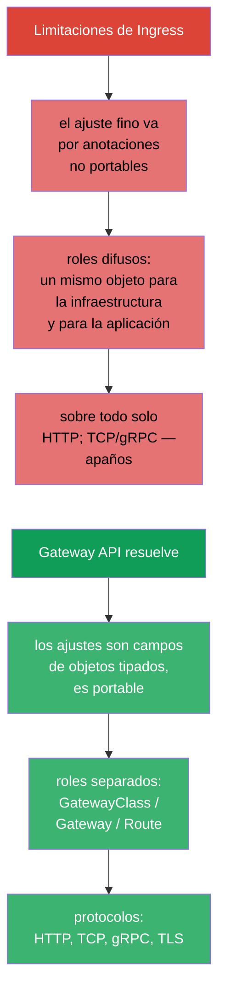
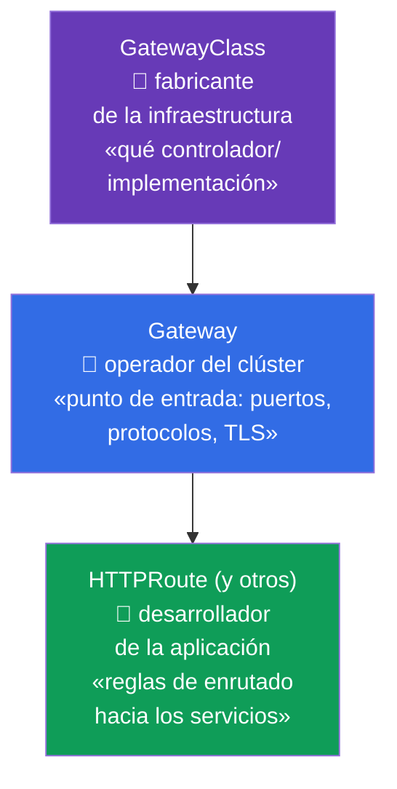
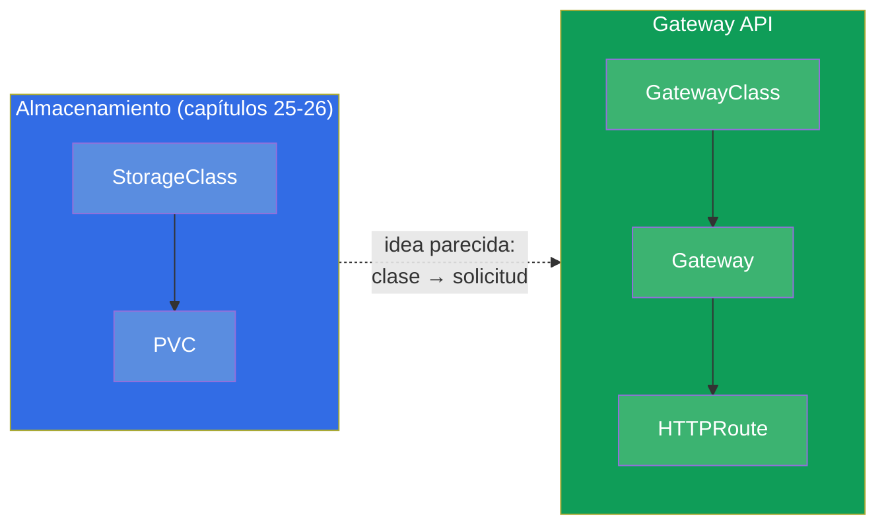
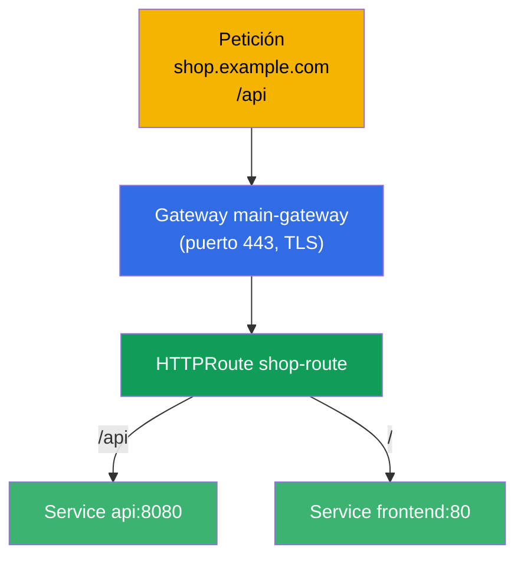
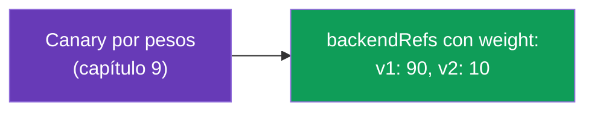
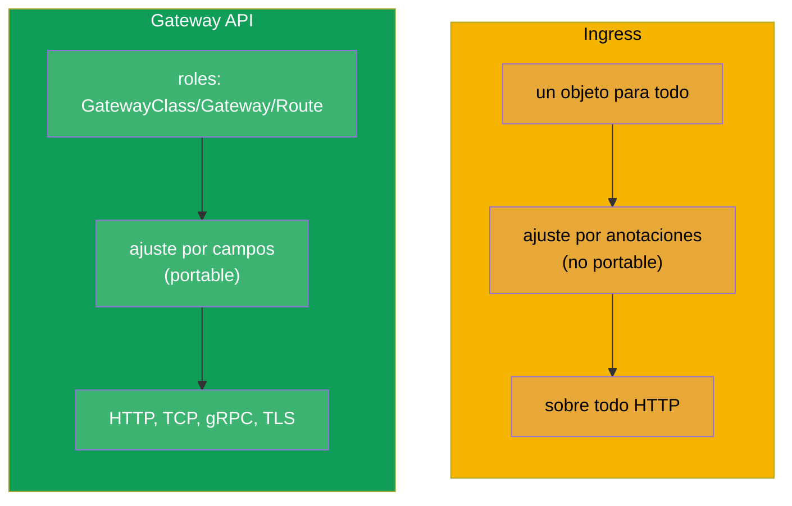
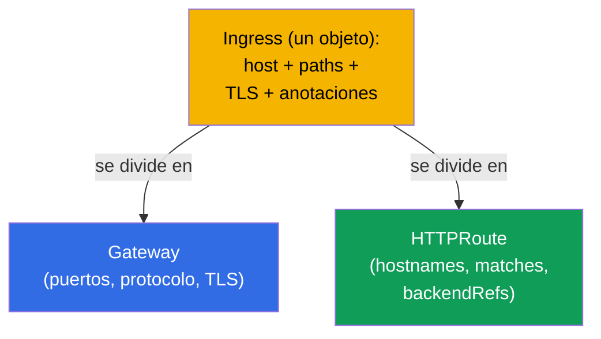
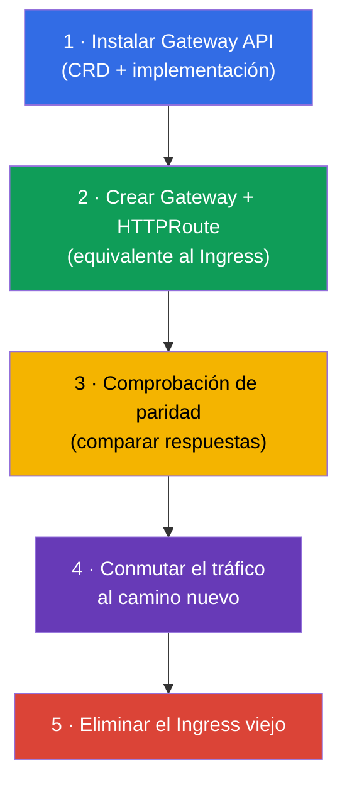

[Русская версия](ru.md) · [Eng version](README.md) · [Version française](fr.md) · [Deutsche Version](de.md) · [ქართული ვერსია](ge.md) · [繁體中文版](tw.md) · [日本語版](jp.md)

# Capítulo 33. Gateway API

> **Qué viene ahora.** Ingress (capítulo 32) es sencillo, pero tiene un techo: el ajuste fino pasa
> por anotaciones no portables y los roles (quién es dueño de la entrada, quién de las rutas) están
> difusos.
> **Gateway API** es el estándar de enrutado nuevo y más expresivo, que ha entrado en el
> programa actual del **CKA** (dominio Services & Networking). No ha reemplazado a Ingress de
> inmediato, pero el futuro es suyo. Veremos su modelo de tres roles y objetos y lo compararemos con
> Ingress.

## 33.1. Para qué hace falta Gateway API

Ingress tiene tres limitaciones sistémicas que Gateway API elimina:



La idea principal es la **separación de responsabilidades por roles** y la **expresividad mediante
objetos tipados** en lugar de cadenas en anotaciones.

## 33.2. Tres roles y tres objetos

Gateway API se construye alrededor de tres roles, y a cada uno le corresponde su propio objeto. Es
su concepto central.



| Objeto | Quién es su dueño | Qué describe |
|--------|-------------|---------------|
| **GatewayClass** | fabricante/plataforma | la implementación (qué controlador), como un StorageClass para la red |
| **Gateway** | operador del clúster | punto de entrada: listeners (puertos, protocolos, TLS) |
| **HTTPRoute** (y TCPRoute, gRPCRoute) | desarrollador de la aplicación | reglas de enrutado hacia los servicios |

El sentido de la separación: el equipo de plataforma es dueño del Gateway (la entrada y el TLS),
mientras que los equipos de aplicación gestionan por su cuenta sus HTTPRoute, sin tocar la entrada
común y sin estorbarse entre ellos. Con Ingress todo eso estaba en un único objeto.

## 33.3. Analogía con lo que ya conocemos

Para asentar los roles en la cabeza son útiles las analogías del curso:



GatewayClass se parece a StorageClass (capítulo 26): describe la implementación que proporciona la
plataforma. Y el Gateway es un punto de entrada concreto ya desplegado de esa implementación.

## 33.4. Ejemplo: Gateway + HTTPRoute

**Gateway** (operador del clúster) - el punto de entrada:

```yaml
apiVersion: gateway.networking.k8s.io/v1
kind: Gateway
metadata:
  name: main-gateway
spec:
  gatewayClassName: nginx           # qué implementación (GatewayClass)
  listeners:
  - name: https
    protocol: HTTPS
    port: 443
    tls:
      mode: Terminate
      certificateRefs:
      - kind: Secret
        name: shop-tls
    hostname: "*.example.com"
```

**HTTPRoute** (desarrollador de la aplicación) - las reglas de enrutado, referencia al Gateway:

```yaml
apiVersion: gateway.networking.k8s.io/v1
kind: HTTPRoute
metadata:
  name: shop-route
spec:
  parentRefs:
  - name: main-gateway              # a qué Gateway está vinculado
  hostnames:
  - "shop.example.com"
  rules:
  - matches:
    - path:
        type: PathPrefix
        value: /api
    backendRefs:
    - name: api
      port: 8080
  - matches:
    - path:
        type: PathPrefix
        value: /
    backendRefs:
    - name: frontend
      port: 80
```



## 33.5. Qué sabe hacer Gateway API de serie

Lo que en Ingress requería anotaciones, en Gateway API son campos de objetos (portables entre
implementaciones):

| Capacidad | En Gateway API |
|-------------|---------------|
| enrutado por ruta/host/cabeceras | campos `matches` en HTTPRoute |
| reparto por pesos (canary) | `weight` en `backendRefs` |
| reescrituras/redirecciones | `filters` (URLRewrite, RequestRedirect) |
| modificación de cabeceras | `filters` (RequestHeaderModifier) |
| enrutado TCP, gRPC, TLS | TCPRoute, gRPCRoute, TLSRoute |
| separación de permisos sobre las rutas | Route separados en los namespace de los equipos |



Por ejemplo, canary (capítulo 9) en Gateway API se hace directamente con pesos de `backendRefs`, y
no con el número de réplicas ni con anotaciones - más limpio y más preciso.

## 33.6. Ingress frente a Gateway API



| | Ingress | Gateway API |
|---|---------|-------------|
| Modelo | un solo objeto | roles: GatewayClass / Gateway / Route |
| Ajuste fino | anotaciones (no portable) | campos de objetos (portable) |
| Protocolos | sobre todo HTTP(S) | HTTP, TCP, gRPC, TLS |
| Separación de roles | no | sí (plataforma vs aplicación) |
| Madurez | estable desde hace mucho, omnipresente | estable, ganando difusión |

Gateway API no anula Ingress de inmediato - Ingress se seguirá encontrando durante mucho tiempo.
Pero los clústeres nuevos y los escenarios avanzados van cada vez más por Gateway API. Muchas
implementaciones (entre ellas Istio - curso ICA) soportan Gateway API.

## 33.7. Migración de Ingress a Gateway API

Puesto que Gateway API es la dirección hacia la que se mueve el enrutado, la habilidad práctica más
importante (y tema de examen) es **pasar un Ingress existente a Gateway API**.
La idea clave: un `Ingress` se divide en **dos objetos** - `Gateway` (punto de entrada: puertos,
protocolos, TLS) y `HTTPRoute` (reglas: hosts, rutas, backends).



### Correspondencia de campos Ingress → Gateway API

| Ingress | Gateway API |
|---------|-------------|
| `ingressClassName` | `Gateway.spec.gatewayClassName` |
| `rules[].host` | `HTTPRoute.spec.hostnames` |
| `rules[].http.paths[].path` (+ `pathType`) | `HTTPRoute.rules[].matches[].path` (`type: PathPrefix/Exact`) |
| `backend.service.name/port` | `HTTPRoute.rules[].backendRefs[].name/port` |
| `tls[]` (secret) | `Gateway.listeners[].tls.certificateRefs` |
| anotación `rewrite-target` | `HTTPRoute` `filters` → `URLRewrite` |
| anotación `ssl-redirect` | `Gateway`/`HTTPRoute` `filters` → `RequestRedirect` (HTTPS) |
| anotaciones `canary-*` | `backendRefs[].weight` (capítulo 9) |

### Ejemplo: antes (Ingress) → después (Gateway + HTTPRoute)

El Ingress de partida:

```yaml
apiVersion: networking.k8s.io/v1
kind: Ingress
metadata:
  name: shop
  annotations:
    nginx.ingress.kubernetes.io/rewrite-target: /
spec:
  ingressClassName: nginx
  rules:
  - host: shop.local
    http:
      paths:
      - path: /api
        pathType: Prefix
        backend:
          service:
            name: api
            port:
              number: 8080
```

El equivalente en Gateway API - `Gateway` + `HTTPRoute`:

```yaml
apiVersion: gateway.networking.k8s.io/v1
kind: Gateway
metadata:
  name: shop-gw
spec:
  gatewayClassName: nginx
  listeners:
  - name: http
    protocol: HTTP
    port: 80
    hostname: "shop.local"
---
apiVersion: gateway.networking.k8s.io/v1
kind: HTTPRoute
metadata:
  name: shop-route
spec:
  parentRefs:
  - name: shop-gw
  hostnames: ["shop.local"]
  rules:
  - matches:
    - path:
        type: PathPrefix
        value: /api
    filters:
    - type: URLRewrite
      urlRewrite:
        path:
          type: ReplacePrefixMatch
          replacePrefixMatch: /       # = rewrite-target: /
    backendRefs:
    - name: api
      port: 8080
```

### La herramienta ingress2gateway

No hace falta reescribirlo a mano - la utilidad **ingress2gateway** (proyecto
kubernetes-sigs) lee los `Ingress` existentes y genera recursos de Gateway API:

```bash
ingress2gateway print --providers ingress-nginx -A > gwapi.yaml
```

Advertencias importantes (las mismas que en cualquier migración - ver el curso ICA, el capítulo
sobre ingress→istio):

- la salida es un **borrador**: las anotaciones específicas de nginx (rewrite, canary, auth,
  snippet) se trasladan parcialmente o no se trasladan, y se corrigen a mano;
- son obligatorias la **revisión** y la **comprobación de paridad** (la misma petición al Ingress
  viejo y al Gateway nuevo, comparar las respuestas) antes de conmutar el tráfico;
- la migración se hace **en paralelo**: el Ingress viejo no se elimina hasta que el camino nuevo
  esté validado, igual que en una conmutación zero-downtime.

### Orden de una migración segura



## 33.8. Cómo se aplica esto en producción

- **Separación de roles plataforma/equipos.** El valor principal en producción: el equipo de
  plataforma es dueño del Gateway (entrada, TLS, puertos), y los equipos de producto gestionan por su
  cuenta sus HTTPRoute en sus namespace, sin tocar la entrada común. Eso quita el cuello de botella
  de cuando todos editaban un único Ingress.
- **Portabilidad.** Las reglas de Gateway API no están atadas a las anotaciones de un controlador
  concreto, así que cambiar de implementación (nginx → Istio → la de la nube) resulta menos doloroso
  que con las anotaciones de Ingress.
- **Un mecanismo único para L4 y L7.** TCPRoute/gRPCRoute/TLSRoute dan en producción una forma
  coherente de enrutar no solo HTTP, sino también TCP/gRPC - sin los «apaños» de
  Ingress.
- **Migración gradual.** En producción Gateway API e Ingress conviven a menudo: los servicios nuevos
  se dan de alta mediante Gateway API y los viejos se quedan en Ingress hasta el traslado planificado
  (herramientas como ingress2gateway ayudan a convertir).
- **La implementación hace falta igualmente.** Igual que un controlador Ingress, Gateway API
  requiere una implementación instalada (nginx gateway, Istio, Cilium, las de la nube) - el objeto
  por sí solo no funciona.

## 33.9. Mini-glosario

- **Gateway API** - estándar moderno de enrutado de tráfico en Kubernetes.
- **GatewayClass** - la implementación (controlador) de Gateway API, análogo de StorageClass.
- **Gateway** - punto de entrada: listeners (puertos, protocolos, TLS); su dueño es el operador del clúster.
- **HTTPRoute** - reglas de enrutado HTTP hacia los servicios; su dueño es el desarrollador.
- **TCPRoute / gRPCRoute / TLSRoute** - enrutado para otros protocolos.
- **parentRefs** - vinculación de un Route a un Gateway.
- **backendRefs** - servicios de destino (con pesos para canary).
- **filters** - transformaciones (rewrite, redirect, cabeceras).
- **Migración Ingress → Gateway API** - división de un Ingress en Gateway (entrada) +
  HTTPRoute (reglas).
- **ingress2gateway** - utilidad de conversión automática de Ingress a recursos de Gateway API (da
  un borrador, requiere revisión).

## 33.10. Resumen del capítulo

- Gateway API es el nuevo estándar de enrutado, que resuelve las limitaciones de Ingress:
  anotaciones no portables, roles difusos, soporte débil de lo que no es HTTP.
- Tres roles/objetos: GatewayClass (la implementación, como StorageClass), Gateway (entrada: puertos,
  protocolos, TLS - operador del clúster), HTTPRoute (reglas - desarrollador).
- La separación de roles es la idea principal: la plataforma es dueña de la entrada, los equipos de sus propias rutas.
- Los ajustes finos (canary por pesos, rewrite, cabeceras) son campos de objetos, y no anotaciones;
  se soportan HTTP, TCP, gRPC, TLS.
- Ingress no está reemplazado de inmediato; Gateway API gana difusión y muchas implementaciones
  (incluida Istio) lo soportan.
- Igual que Ingress, requiere una implementación instalada.
- Migración Ingress → Gateway API: un Ingress se divide en `Gateway` (entrada: puertos,
  protocolo, TLS) + `HTTPRoute` (hostnames, matches, backendRefs); las anotaciones pasan a
  `filters`/`weight`. La utilidad `ingress2gateway` da un borrador; se traslada en paralelo con
  comprobación de paridad, y el Ingress viejo se elimina en último lugar.

## 33.11. Para qué te servirá: en el examen y en el trabajo real

**En el examen (CKA).** Gateway API ha entrado en el programa actual del CKA. Se esperan tareas del
tipo «crea un Gateway y un HTTPRoute para el enrutado», **«migra un Ingress existente a
Gateway API»** (dividirlo en Gateway + HTTPRoute, trasladar host/path/backend y el rewrite),
comprensión de los roles GatewayClass/Gateway/Route y del tándem parentRefs/backendRefs. Es útil
saber emparejar los campos de Ingress y de Gateway API.

**En el trabajo real.** Gateway API es la dirección hacia la que se mueve el enrutado en
Kubernetes: separación de roles plataforma/equipos, portabilidad, un mecanismo único para distintos
protocolos. Entender su modelo te prepara para los clústeres modernos y simplifica la migración desde
Ingress.

## 33.12. Preguntas de autoevaluación

1. ¿Qué limitaciones de Ingress elimina Gateway API?
2. Nombra los tres objetos de Gateway API y el rol dueño de cada uno.
3. ¿En qué se parece GatewayClass a StorageClass?
4. ¿Cómo se vincula un HTTPRoute a un Gateway e indica los servicios de destino?
5. ¿Cómo se hace un reparto de tráfico canary en Gateway API?
6. ¿Por qué el ajuste en Gateway API es más portable que las anotaciones de Ingress?
7. ¿Reemplaza Gateway API a Ingress ahora mismo? ¿Qué hace falta para que funcione?
8. ¿Cómo migrar un `Ingress` a Gateway API: en qué objetos se divide y cómo se
   corresponden host/path/backend/TLS/rewrite?
9. ¿Qué hace `ingress2gateway` y por qué su salida no se puede aplicar sin revisión?

## Práctica

Hemos visto el enrutado moderno y la migración desde Ingress. En el capítulo 34 cerraremos la parte 7
con el tema NetworkPolicy - cómo limitar qué pod puede hablar con cuál. Gateway API,
Ingress y su migración se practican en el laboratorio de red (110).

🧪 Laboratorio 110: [tasks/cka/labs/110](../../labs/110/README_ES.MD)

---
[Índice](../README_ES.md) · [Capítulo 32](../32/es.md) · [Capítulo 34](../34/es.md)
