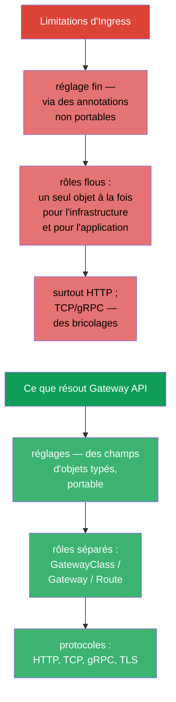
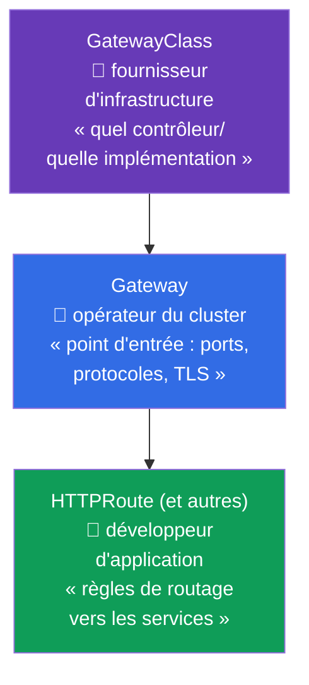
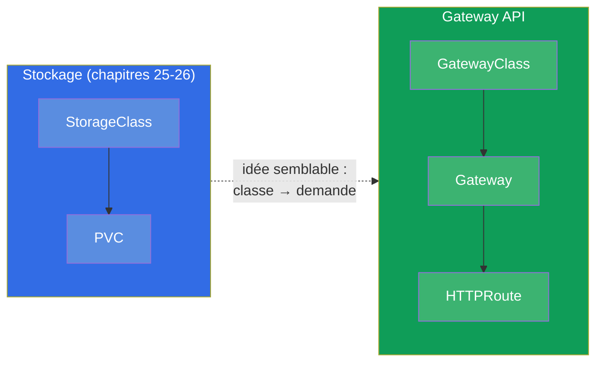
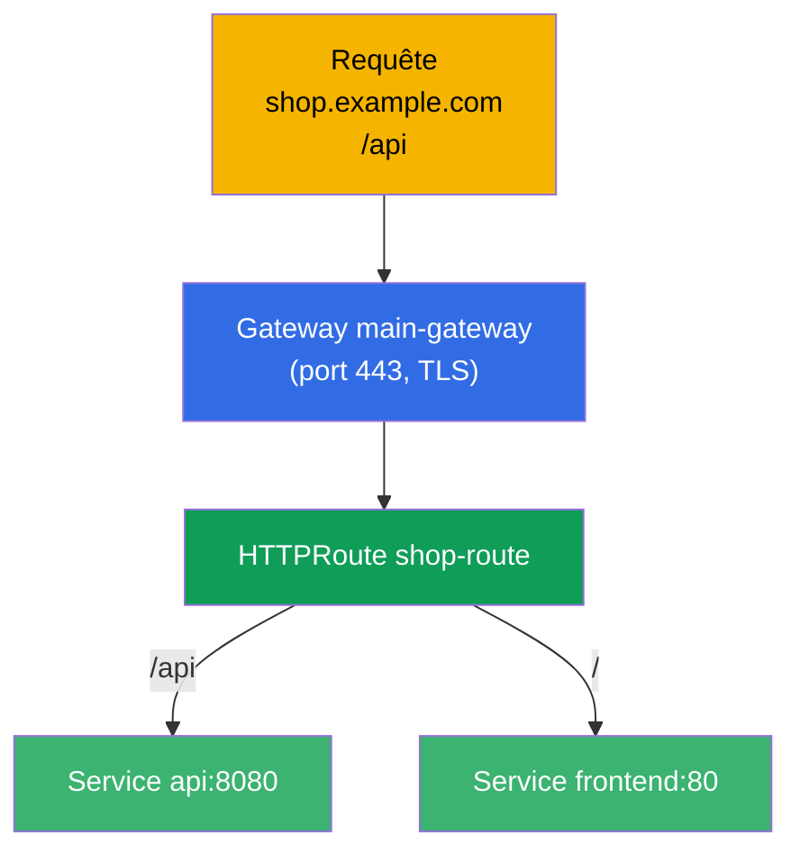
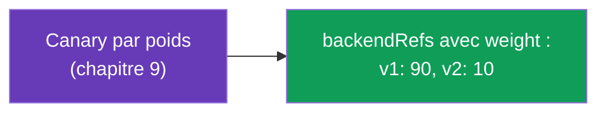
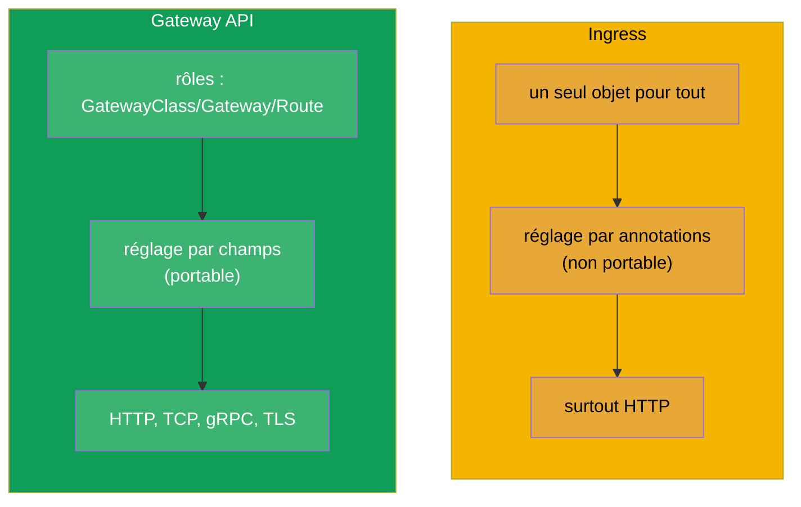
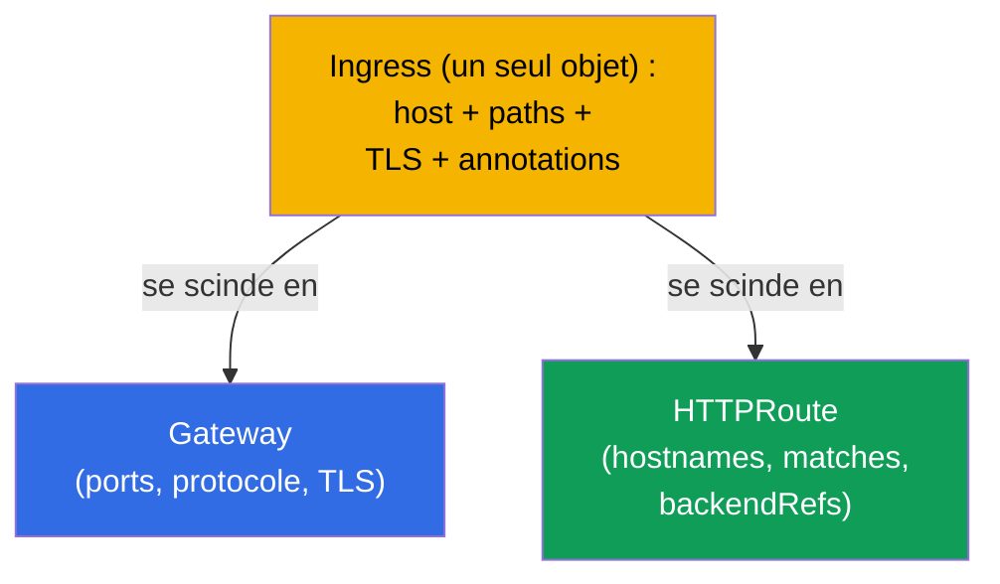
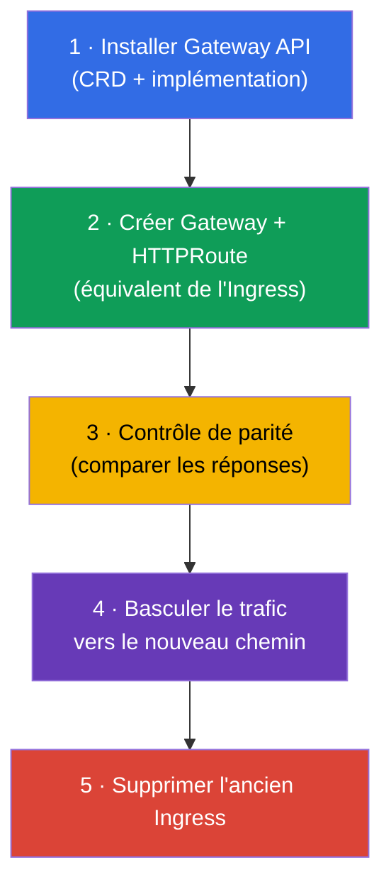

[Русская версия](ru.md) · [Eng version](README.md) · [Versión en español](es.md) · [Deutsche Version](de.md) · [ქართული ვერსია](ge.md)

# Chapitre 33. Gateway API

> **Ce qui suit.** Ingress (chapitre 32) est simple, mais il a sa limite : le réglage fin passe par
> des annotations non portables, et les rôles (qui possède l'entrée, qui possède les routes) sont
> flous. **Gateway API** est le nouveau standard de routage, plus expressif, qui est entré au
> programme actuel du **CKA** (domaine Services & Networking). Il n'a pas remplacé Ingress d'un
> coup, mais l'avenir lui appartient. Voyons son modèle à trois rôles et trois objets, et
> comparons-le à Ingress.

## 33.1. À quoi sert Gateway API

Ingress a trois limitations systémiques que Gateway API supprime :



L'idée principale est la **séparation des responsabilités par rôles** et l'**expressivité via des
objets typés** au lieu de chaînes d'annotations.

## 33.2. Trois rôles et trois objets

Gateway API s'articule autour de trois rôles, chacun ayant son objet dédié. C'est là son
concept central.



| Objet | Qui le possède | Ce qu'il décrit |
|--------|-------------|---------------|
| **GatewayClass** | fournisseur/plateforme | l'implémentation (quel contrôleur), comme StorageClass pour le réseau |
| **Gateway** | opérateur du cluster | le point d'entrée : les listeners (ports, protocoles, TLS) |
| **HTTPRoute** (et TCPRoute, gRPCRoute) | développeur d'application | les règles de routage vers les services |

Le sens de cette séparation : l'équipe plateforme possède le Gateway (l'entrée et le TLS), tandis
que les équipes applicatives gèrent elles-mêmes leurs HTTPRoute, sans toucher à l'entrée commune ni
se gêner mutuellement. Avec Ingress, tout cela tenait dans un seul objet.

## 33.3. Une analogie avec ce que nous connaissons déjà

Pour bien ranger les rôles dans sa tête, des analogies du cours sont utiles :



GatewayClass ressemble à StorageClass (chapitre 26) : il décrit l'implémentation fournie par la
plateforme. Et Gateway est un point d'entrée concret, déployé, de cette implémentation.

## 33.4. Exemple : Gateway + HTTPRoute

**Gateway** (opérateur du cluster) - le point d'entrée :

```yaml
apiVersion: gateway.networking.k8s.io/v1
kind: Gateway
metadata:
  name: main-gateway
spec:
  gatewayClassName: nginx           # quelle implémentation (GatewayClass)
  listeners:
  - name: https
    protocol: HTTPS
    port: 443
    tls:
      mode: Terminate
      certificateRefs:
      - kind: Secret
        name: shop-tls
    hostname: "*.example.com"
```

**HTTPRoute** (développeur d'application) - les règles de routage, il référence le Gateway :

```yaml
apiVersion: gateway.networking.k8s.io/v1
kind: HTTPRoute
metadata:
  name: shop-route
spec:
  parentRefs:
  - name: main-gateway              # à quel Gateway il est rattaché
  hostnames:
  - "shop.example.com"
  rules:
  - matches:
    - path:
        type: PathPrefix
        value: /api
    backendRefs:
    - name: api
      port: 8080
  - matches:
    - path:
        type: PathPrefix
        value: /
    backendRefs:
    - name: frontend
      port: 80
```



## 33.5. Ce que Gateway API sait faire nativement

Ce qui, dans Ingress, exigeait des annotations devient dans Gateway API des champs d'objets
(portables entre implémentations) :

| Fonctionnalité | Dans Gateway API |
|-------------|---------------|
| routage par chemin/hôte/en-têtes | les champs `matches` de HTTPRoute |
| répartition par poids (canary) | `weight` dans `backendRefs` |
| réécritures/redirections | `filters` (URLRewrite, RequestRedirect) |
| modification des en-têtes | `filters` (RequestHeaderModifier) |
| routage TCP, gRPC, TLS | TCPRoute, gRPCRoute, TLSRoute |
| séparation des droits sur les routes | des Route distinctes dans le namespace des équipes |



Par exemple, le canary (chapitre 9) se fait dans Gateway API directement par les poids de `backendRefs`,
et non par le nombre de réplicas ou par des annotations - c'est plus propre et plus précis.

## 33.6. Ingress face à Gateway API



| | Ingress | Gateway API |
|---|---------|-------------|
| Modèle | un seul objet | rôles : GatewayClass / Gateway / Route |
| Réglage fin | annotations (non portable) | champs d'objets (portable) |
| Protocoles | surtout HTTP(S) | HTTP, TCP, gRPC, TLS |
| Séparation des rôles | non | oui (plateforme vs application) |
| Maturité | stable depuis longtemps, omniprésent | stable, adoption croissante |

Gateway API n'annule pas Ingress d'un coup - on rencontrera Ingress encore longtemps. Mais les
nouveaux clusters et les scénarios avancés passent de plus en plus par Gateway API. De nombreuses
implémentations (dont Istio - cours ICA) prennent en charge Gateway API.

## 33.7. Migration d'Ingress vers Gateway API

Puisque Gateway API est la direction que prend le routage, la compétence pratique la plus importante
(et un sujet d'examen) est de **porter un Ingress existant vers Gateway API**. L'idée clé : un seul
`Ingress` se scinde en **deux objets** - `Gateway` (le point d'entrée : ports, protocoles, TLS) et
`HTTPRoute` (les règles : hôtes, chemins, backends).



### Correspondance des champs Ingress → Gateway API

| Ingress | Gateway API |
|---------|-------------|
| `ingressClassName` | `Gateway.spec.gatewayClassName` |
| `rules[].host` | `HTTPRoute.spec.hostnames` |
| `rules[].http.paths[].path` (+ `pathType`) | `HTTPRoute.rules[].matches[].path` (`type: PathPrefix/Exact`) |
| `backend.service.name/port` | `HTTPRoute.rules[].backendRefs[].name/port` |
| `tls[]` (secret) | `Gateway.listeners[].tls.certificateRefs` |
| annotation `rewrite-target` | `HTTPRoute` `filters` → `URLRewrite` |
| annotation `ssl-redirect` | `Gateway`/`HTTPRoute` `filters` → `RequestRedirect` (HTTPS) |
| annotations `canary-*` | `backendRefs[].weight` (chapitre 9) |

### Exemple : avant (Ingress) → après (Gateway + HTTPRoute)

L'Ingress d'origine :

```yaml
apiVersion: networking.k8s.io/v1
kind: Ingress
metadata:
  name: shop
  annotations:
    nginx.ingress.kubernetes.io/rewrite-target: /
spec:
  ingressClassName: nginx
  rules:
  - host: shop.local
    http:
      paths:
      - path: /api
        pathType: Prefix
        backend:
          service:
            name: api
            port:
              number: 8080
```

L'équivalent en Gateway API - `Gateway` + `HTTPRoute` :

```yaml
apiVersion: gateway.networking.k8s.io/v1
kind: Gateway
metadata:
  name: shop-gw
spec:
  gatewayClassName: nginx
  listeners:
  - name: http
    protocol: HTTP
    port: 80
    hostname: "shop.local"
---
apiVersion: gateway.networking.k8s.io/v1
kind: HTTPRoute
metadata:
  name: shop-route
spec:
  parentRefs:
  - name: shop-gw
  hostnames: ["shop.local"]
  rules:
  - matches:
    - path:
        type: PathPrefix
        value: /api
    filters:
    - type: URLRewrite
      urlRewrite:
        path:
          type: ReplacePrefixMatch
          replacePrefixMatch: /       # = rewrite-target: /
    backendRefs:
    - name: api
      port: 8080
```

### L'outil ingress2gateway

Il n'est pas obligatoire de tout réécrire à la main - l'utilitaire **ingress2gateway** (projet
kubernetes-sigs) lit les `Ingress` existants et génère les ressources Gateway API :

```bash
ingress2gateway print --providers ingress-nginx -A > gwapi.yaml
```

Réserves importantes (les mêmes que pour toute migration - voir le cours ICA, le chapitre ingress→istio) :

- la sortie est un **brouillon** : les annotations nginx spécifiques (rewrite, canary, auth, snippet)
  sont portées partiellement ou pas du tout, on les corrige à la main ;
- une **revue** et un **contrôle de parité** (la même requête vers l'ancien Ingress et vers le
  nouveau Gateway, puis comparer les réponses) sont obligatoires avant de basculer le trafic ;
- la migration se fait **en parallèle** : on ne supprime pas l'ancien Ingress tant que le nouveau
  chemin n'est pas validé, - comme pour une bascule zero-downtime.

### Ordre d'une migration sûre



## 33.8. Comment cela s'applique en production

- **Séparation des rôles plateforme/équipes.** La principale valeur en prod : l'équipe plateforme
  possède le Gateway (l'entrée, le TLS, les ports), tandis que les équipes produit gèrent
  elles-mêmes leurs HTTPRoute dans leurs namespaces, sans toucher à l'entrée commune. Cela lève le
  goulot d'étranglement où tout le monde modifiait un unique Ingress.
- **Portabilité.** Les règles Gateway API ne dépendent pas des annotations d'un contrôleur précis,
  donc changer d'implémentation (nginx → Istio → cloud) se fait moins douloureusement qu'avec les
  annotations Ingress.
- **Un mécanisme unique pour L4 et L7.** TCPRoute/gRPCRoute/TLSRoute donnent en prod une façon
  cohérente de router non seulement le HTTP, mais aussi le TCP/gRPC - sans les « bricolages »
  d'Ingress.
- **Migration progressive.** En prod, Gateway API et Ingress coexistent souvent : les nouveaux
  services sont créés via Gateway API, les anciens restent sur Ingress jusqu'au portage planifié
  (des outils comme ingress2gateway aident à convertir).
- **Une implémentation reste nécessaire.** Comme pour un contrôleur Ingress, Gateway API exige une
  implémentation installée (nginx gateway, Istio, Cilium, celles du cloud) - l'objet seul ne
  fonctionne pas.

## 33.9. Mini-glossaire

- **Gateway API** - le standard moderne de routage du trafic dans Kubernetes.
- **GatewayClass** - l'implémentation (le contrôleur) de Gateway API, l'analogue de StorageClass.
- **Gateway** - le point d'entrée : les listeners (ports, protocoles, TLS) ; possédé par l'opérateur du cluster.
- **HTTPRoute** - les règles de routage HTTP vers les services ; possédées par le développeur.
- **TCPRoute / gRPCRoute / TLSRoute** - le routage pour les autres protocoles.
- **parentRefs** - le rattachement d'une Route à un Gateway.
- **backendRefs** - les services cibles (avec des poids pour le canary).
- **filters** - les transformations (rewrite, redirect, en-têtes).
- **Migration Ingress → Gateway API** - la scission d'un Ingress en Gateway (l'entrée) +
  HTTPRoute (les règles).
- **ingress2gateway** - l'utilitaire de conversion automatique d'Ingress en ressources Gateway API
  (il donne un brouillon, une revue est nécessaire).

## 33.10. Bilan du chapitre

- Gateway API est le nouveau standard de routage, qui règle les limitations d'Ingress : annotations
  non portables, rôles flous, faible prise en charge du non-HTTP.
- Trois rôles/objets : GatewayClass (l'implémentation, comme StorageClass), Gateway (l'entrée :
  ports, protocoles, TLS - l'opérateur du cluster), HTTPRoute (les règles - le développeur).
- La séparation des rôles est l'idée principale : la plateforme possède l'entrée, les équipes leurs routes.
- Les réglages fins (canary par poids, rewrite, en-têtes) sont des champs d'objets et non des
  annotations ; HTTP, TCP, gRPC, TLS sont pris en charge.
- Ingress n'est pas remplacé d'un coup ; Gateway API gagne du terrain, de nombreuses implémentations
  (y compris Istio) le prennent en charge.
- Comme Ingress, il exige une implémentation installée.
- Migration Ingress → Gateway API : un Ingress se scinde en `Gateway` (l'entrée : ports, protocole,
  TLS) + `HTTPRoute` (hostnames, matches, backendRefs) ; les annotations deviennent des
  `filters`/`weight`. L'utilitaire `ingress2gateway` donne un brouillon ; on porte en parallèle avec
  un contrôle de parité, l'ancien Ingress est supprimé en dernier.

## 33.11. À quoi cela sert : à l'examen et dans le travail réel

**À l'examen (CKA).** Gateway API est entré au programme actuel du CKA. On attend des exercices du
type « crée un Gateway et un HTTPRoute pour le routage », **« migre un Ingress existant vers
Gateway API »** (le scinder en Gateway + HTTPRoute, porter host/path/backend et le rewrite), la
compréhension des rôles GatewayClass/Gateway/Route et du couple parentRefs/backendRefs. Il est utile
de savoir mettre en correspondance les champs d'Ingress et de Gateway API.

**Dans le travail réel.** Gateway API est la direction que prend le routage dans
Kubernetes : séparation des rôles plateforme/équipes, portabilité, mécanisme unique pour
différents protocoles. Comprendre son modèle prépare aux clusters modernes et simplifie la
migration depuis Ingress.

## 33.12. Questions d'auto-évaluation

1. Quelles limitations d'Ingress Gateway API supprime-t-il ?
2. Citez les trois objets de Gateway API et le rôle qui possède chacun d'eux.
3. En quoi GatewayClass ressemble-t-il à StorageClass ?
4. Comment un HTTPRoute se rattache-t-il à un Gateway et désigne-t-il les services cibles ?
5. Comment réaliser une répartition canary du trafic dans Gateway API ?
6. En quoi la configuration dans Gateway API est-elle plus portable que les annotations Ingress ?
7. Gateway API remplace-t-il Ingress dès maintenant ? Que faut-il pour qu'il fonctionne ?
8. Comment migrer un `Ingress` vers Gateway API : en quels objets se scinde-t-il et comment
   correspondent host/path/backend/TLS/rewrite ?
9. Que fait `ingress2gateway` et pourquoi sa sortie ne peut-elle pas être appliquée sans contrôle ?

## Pratique

Nous avons vu le routage moderne et la migration depuis Ingress. Au chapitre 34, nous refermerons la
partie 7 avec les NetworkPolicy - comment restreindre quel pod peut communiquer avec quel autre.
Gateway API, Ingress et leur migration se travaillent dans le TP sur le réseau (110).

🧪 TP 110 : [tasks/cka/labs/110](../../labs/110/README_FR.MD)

---
[Sommaire](../README_FR.md) · [Chapitre 32](../32/fr.md) · [Chapitre 34](../34/fr.md)
