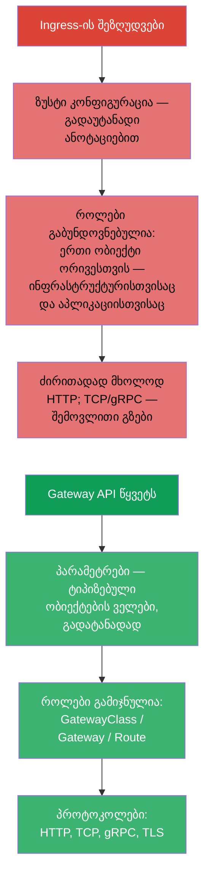
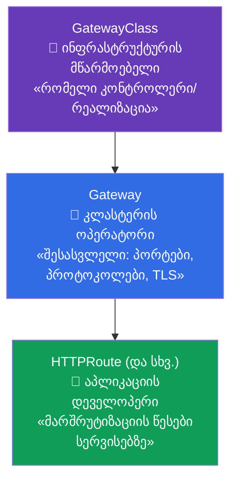
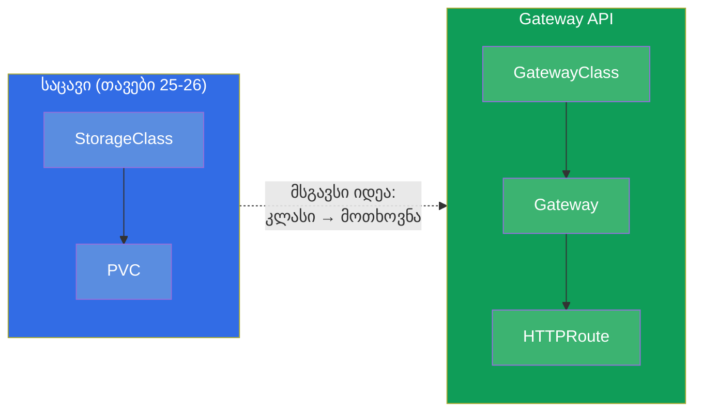
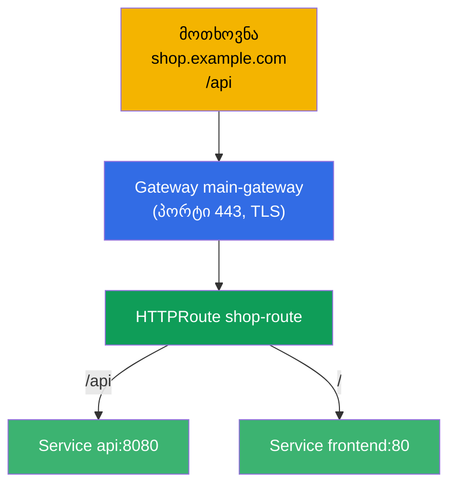
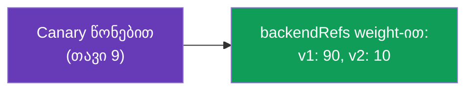
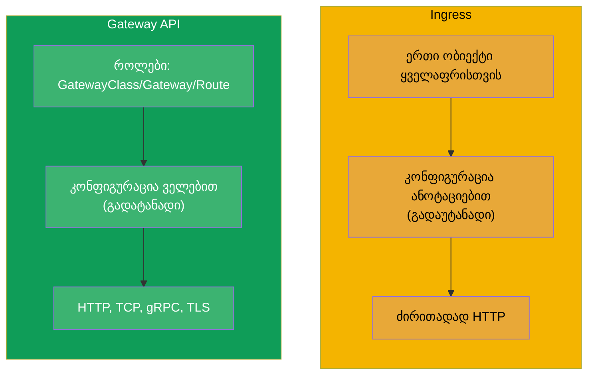
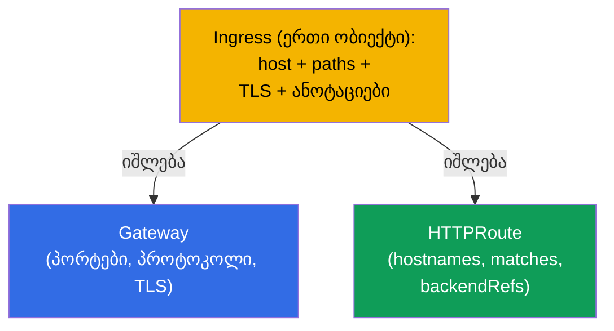
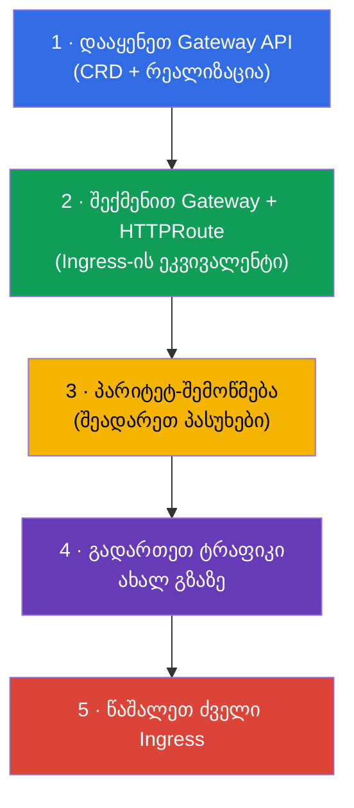

[Русская версия](ru.md) · [Eng version](README.md) · [Versión en español](es.md) · [Version française](fr.md) · [Deutsche Version](de.md) · [繁體中文版](tw.md) · [日本語版](jp.md)

# თავი 33. Gateway API

> **რა იქნება შემდეგ.** Ingress (თავი 32) მარტივია, მაგრამ მას აქვს ზღვარი: ზუსტი კონფიგურაცია
> გადაუტანადი ანოტაციებით ხდება, ხოლო როლები (ვინ ფლობს შესასვლელს, ვინ მარშრუტებს) გაბუნდოვნებულია.
> **Gateway API** - ეს არის ახალი, უფრო გამომსახველი მარშრუტიზაციის სტანდარტი, რომელიც შევიდა
> **CKA**-ს აქტუალურ პროგრამაში (დომენი Services & Networking). მან Ingress მყისიერად არ ჩაანაცვლა,
> მაგრამ მომავალი მას ეკუთვნის. გავარჩევთ მის მოდელს სამი როლისა და ობიექტისგან და შევადარებთ
> Ingress-ს.

## 33.1. რისთვის არის საჭირო Gateway API

Ingress-ს აქვს სამი სისტემური შეზღუდვა, რომლებსაც Gateway API აღმოფხვრის:



მთავარი იდეა - **პასუხისმგებლობის გამიჯვნა როლების მიხედვით** და **გამომსახველობა
ტიპიზებული ობიექტების გავლით** ანოტაცია-სტრიქონების ნაცვლად.

## 33.2. სამი როლი და სამი ობიექტი

Gateway API შენდება სამი როლის გარშემო, ყოველ მათგანს შეესაბამება საკუთარი ობიექტი. ეს არის მისი
ცენტრალური კონცეფცია.



| ობიექტი | ვინ ფლობს | რას აღწერს |
|--------|-------------|---------------|
| **GatewayClass** | მწარმოებელი/პლატფორმა | რეალიზაცია (რომელი კონტროლერი), როგორც StorageClass ქსელისთვის |
| **Gateway** | კლასტერის ოპერატორი | შესასვლელი: მსმენელები (პორტები, პროტოკოლები, TLS) |
| **HTTPRoute** (და TCPRoute, gRPCRoute) | აპლიკაციის დეველოპერი | მარშრუტიზაციის წესები სერვისებზე |

გამიჯვნის აზრი: პლატფორმული გუნდი ფლობს Gateway-ს (შესასვლელს და TLS-ს), ხოლო აპლიკაციების
გუნდები თავად მართავენ საკუთარ HTTPRoute-ებს, საერთო შესასვლელს არ ეხებიან და ერთმანეთს არ უშლიან.
Ingress-თან ეს ყველაფერი ერთ ობიექტში იყო.

## 33.3. ანალოგია იმასთან, რაც უკვე ვიცით

იმისთვის, რომ როლები თავში დავალაგოთ, სასარგებლოა ანალოგიები კურსიდან:



GatewayClass StorageClass-ს (თავი 26) მოგავს: აღწერს რეალიზაციას, რომელსაც პლატფორმა
აწვდის. ხოლო Gateway - ეს ამ რეალიზაციის კონკრეტული გაშლილი შესასვლელია.

## 33.4. მაგალითი: Gateway + HTTPRoute

**Gateway** (კლასტერის ოპერატორი) - შესასვლელი:

```yaml
apiVersion: gateway.networking.k8s.io/v1
kind: Gateway
metadata:
  name: main-gateway
spec:
  gatewayClassName: nginx           # რომელი რეალიზაცია (GatewayClass)
  listeners:
  - name: https
    protocol: HTTPS
    port: 443
    tls:
      mode: Terminate
      certificateRefs:
      - kind: Secret
        name: shop-tls
    hostname: "*.example.com"
```

**HTTPRoute** (აპლიკაციის დეველოპერი) - მარშრუტიზაციის წესები, მიმართავს Gateway-ს:

```yaml
apiVersion: gateway.networking.k8s.io/v1
kind: HTTPRoute
metadata:
  name: shop-route
spec:
  parentRefs:
  - name: main-gateway              # რომელ Gateway-ზეა მიბმული
  hostnames:
  - "shop.example.com"
  rules:
  - matches:
    - path:
        type: PathPrefix
        value: /api
    backendRefs:
    - name: api
      port: 8080
  - matches:
    - path:
        type: PathPrefix
        value: /
    backendRefs:
    - name: frontend
      port: 80
```



## 33.5. რა შეუძლია Gateway API-ს ყუთიდან

ის, რაც Ingress-ში ანოტაციებს მოითხოვდა, Gateway API-ში ობიექტების ველებია (გადატანადია
რეალიზაციებს შორის):

| შესაძლებლობა | Gateway API-ში |
|-------------|---------------|
| მარშრუტიზაცია გზის/ჰოსტის/ჰედერების მიხედვით | ველები `matches` HTTPRoute-ში |
| განაწილება წონების მიხედვით (canary) | `weight` `backendRefs`-ში |
| გადაწერა/რედირექტები | `filters` (URLRewrite, RequestRedirect) |
| ჰედერების შეცვლა | `filters` (RequestHeaderModifier) |
| TCP, gRPC, TLS-მარშრუტიზაცია | TCPRoute, gRPCRoute, TLSRoute |
| მარშრუტებზე უფლებების გამიჯვნა | ცალკე Route გუნდების namespace-ში |



მაგალითად, canary (თავი 9) Gateway API-ში პირდაპირ `backendRefs`-ის წონებით კეთდება და არა
რეპლიკების რაოდენობით ან ანოტაციებით - უფრო სუფთად და ზუსტად.

## 33.6. Ingress Gateway API-ს წინააღმდეგ



| | Ingress | Gateway API |
|---|---------|-------------|
| მოდელი | ერთი ობიექტი | როლები: GatewayClass / Gateway / Route |
| ზუსტი კონფიგურაცია | ანოტაციები (გადაუტანადი) | ობიექტების ველები (გადატანადი) |
| პროტოკოლები | ძირითადად HTTP(S) | HTTP, TCP, gRPC, TLS |
| როლების გამიჯვნა | არა | კი (პლატფორმა vs აპლიკაცია) |
| სიმწიფე | დიდი ხნის სტაბილური, ყველგანაა | სტაბილურია, გავრცელებას იკრებს |

Gateway API Ingress-ს მყისიერად არ აუქმებს - Ingress კიდევ დიდხანს შეგხვდებათ. მაგრამ ახალი
კლასტერები და მოწინავე სცენარები სულ უფრო ხშირად Gateway API-ს გავლით მიდის. მრავალი რეალიზაცია (მათ
შორის Istio - კურსი ICA) Gateway API-ს უჭერს მხარს.

## 33.7. მიგრაცია Ingress-იდან Gateway API-ზე

რაკი Gateway API - ეს მიმართულებაა, რომლისკენაც მარშრუტიზაცია მოძრაობს, უმნიშვნელოვანესი
პრაქტიკული უნარია (და გამოცდის თემა) - **არსებული Ingress-ის გადატანა Gateway API-ზე**.
საკვანძო იდეა: ერთი `Ingress` იშლება **ორ ობიექტად** - `Gateway` (შესასვლელი:
პორტები, პროტოკოლები, TLS) და `HTTPRoute` (წესები: ჰოსტები, გზები, ბექენდები).



### ველების შესაბამისობა Ingress → Gateway API

| Ingress | Gateway API |
|---------|-------------|
| `ingressClassName` | `Gateway.spec.gatewayClassName` |
| `rules[].host` | `HTTPRoute.spec.hostnames` |
| `rules[].http.paths[].path` (+ `pathType`) | `HTTPRoute.rules[].matches[].path` (`type: PathPrefix/Exact`) |
| `backend.service.name/port` | `HTTPRoute.rules[].backendRefs[].name/port` |
| `tls[]` (secret) | `Gateway.listeners[].tls.certificateRefs` |
| ანოტაცია `rewrite-target` | `HTTPRoute` `filters` → `URLRewrite` |
| ანოტაცია `ssl-redirect` | `Gateway`/`HTTPRoute` `filters` → `RequestRedirect` (HTTPS) |
| `canary-*` ანოტაციები | `backendRefs[].weight` (თავი 9) |

### მაგალითი: იყო (Ingress) → გახდა (Gateway + HTTPRoute)

საწყისი Ingress:

```yaml
apiVersion: networking.k8s.io/v1
kind: Ingress
metadata:
  name: shop
  annotations:
    nginx.ingress.kubernetes.io/rewrite-target: /
spec:
  ingressClassName: nginx
  rules:
  - host: shop.local
    http:
      paths:
      - path: /api
        pathType: Prefix
        backend:
          service:
            name: api
            port:
              number: 8080
```

ეკვივალენტი Gateway API-ზე - `Gateway` + `HTTPRoute`:

```yaml
apiVersion: gateway.networking.k8s.io/v1
kind: Gateway
metadata:
  name: shop-gw
spec:
  gatewayClassName: nginx
  listeners:
  - name: http
    protocol: HTTP
    port: 80
    hostname: "shop.local"
---
apiVersion: gateway.networking.k8s.io/v1
kind: HTTPRoute
metadata:
  name: shop-route
spec:
  parentRefs:
  - name: shop-gw
  hostnames: ["shop.local"]
  rules:
  - matches:
    - path:
        type: PathPrefix
        value: /api
    filters:
    - type: URLRewrite
      urlRewrite:
        path:
          type: ReplacePrefixMatch
          replacePrefixMatch: /       # = rewrite-target: /
    backendRefs:
    - name: api
      port: 8080
```

### ინსტრუმენტი ingress2gateway

ხელით გადაწერა სავალდებულო არ არის - უტილიტა **ingress2gateway** (პროექტი
kubernetes-sigs) კითხულობს არსებულ `Ingress`-ებს და გენერირებს Gateway API-ს რესურსებს:

```bash
ingress2gateway print --providers ingress-nginx -A > gwapi.yaml
```

მნიშვნელოვანი დათქმები (იგივე, რაც ნებისმიერი მიგრაციისას - იხ. კურსი ICA, თავი ingress→istio-ზე):

- გამონატანი - **მონახაზია**: nginx-ის სპეციფიკური ანოტაციები (rewrite, canary, auth, snippet)
  ნაწილობრივ ან სულაც არ გადმოდის, მათ ხელით ასწორებენ;
- სავალდებულოა **რევიუ** და **პარიტეტ-შემოწმება** (იგივე მოთხოვნა ძველ Ingress-ში და ახალ
  Gateway-ში, პასუხების შედარება) ტრაფიკის გადართვამდე;
- მიგრაციას **პარალელურად** აკეთებენ: ძველ Ingress-ს არ შლიან, სანამ ახალი გზა არ
  ვალიდირდება, - როგორც zero-downtime გადართვისასაც.

### უსაფრთხო მიგრაციის თანმიმდევრობა



## 33.8. როგორ იყენებენ ამას პროდაქშენში

- **როლების გამიჯვნა პლატფორმა/გუნდები.** მთავარი ღირებულება პროდში: პლატფორმული გუნდი
  ფლობს Gateway-ს (შესასვლელი, TLS, პორტები), ხოლო პროდუქტული გუნდები თავად მართავენ საკუთარ
  HTTPRoute-ებს საკუთარ namespace-ებში, საერთო შესასვლელს არ ეხებიან. ეს ხსნის ვიწრო ადგილს, როცა ყველა
  ერთ Ingress-ს ასწორებდა.
- **გადატანადობა.** Gateway API-ს წესები კონკრეტული კონტროლერის ანოტაციებზე მიბმული არ არის,
  ამიტომ რეალიზაციის შეცვლა (nginx → Istio → ღრუბლოვანი) ნაკლებად მტკივნეულად გადის, ვიდრე
  Ingress-ანოტაციებით.
- **ერთიანი მექანიზმი L4-სა და L7-სთვის.** TCPRoute/gRPCRoute/TLSRoute პროდში იძლევა ერთ
  შეთანხმებულ ხერხს არა მხოლოდ HTTP-ის, არამედ TCP/gRPC-ის მარშრუტიზაციისთვის - Ingress-ის
  „შემოვლითი გზების“ გარეშე.
- **მიგრაცია თანდათანობითია.** პროდში Gateway API და Ingress ხშირად თანაარსებობს: ახალ
  სერვისებს Gateway API-ს გავლით უშვებენ, ძველები Ingress-ზე რჩებიან გეგმიურ გადატანამდე
  (ინსტრუმენტები ingress2gateway-ს მსგავსად კონვერტაციაში ეხმარება).
- **რეალიზაცია მაინც საჭიროა.** Ingress-კონტროლერის მსგავსად, Gateway API მოითხოვს
  დაყენებულ რეალიზაციას (nginx gateway, Istio, Cilium, ღრუბლოვანი) - თავისთავად ობიექტი
  არ მუშაობს.

## 33.9. მინი-ლექსიკონი

- **Gateway API** - Kubernetes-ში ტრაფიკის მარშრუტიზაციის თანამედროვე სტანდარტი.
- **GatewayClass** - Gateway API-ს რეალიზაცია (კონტროლერი), StorageClass-ის ანალოგი.
- **Gateway** - შესასვლელი: მსმენელები (პორტები, პროტოკოლები, TLS); ფლობს კლასტერის ოპერატორი.
- **HTTPRoute** - HTTP-მარშრუტიზაციის წესები სერვისებზე; ფლობს დეველოპერი.
- **TCPRoute / gRPCRoute / TLSRoute** - მარშრუტიზაცია სხვა პროტოკოლებისთვის.
- **parentRefs** - Route-ის მიბმა Gateway-ზე.
- **backendRefs** - სამიზნე სერვისები (წონებით canary-სთვის).
- **filters** - გარდაქმნები (rewrite, redirect, ჰედერები).
- **მიგრაცია Ingress → Gateway API** - ერთი Ingress-ის დაშლა Gateway-ად (შესასვლელი) +
  HTTPRoute-ად (წესები).
- **ingress2gateway** - Ingress-ის Gateway API-ს რესურსებად ავტოკონვერტაციის უტილიტა (იძლევა
  მონახაზს, საჭიროებს რევიუს).

## 33.10. თავის შეჯამება

- Gateway API - მარშრუტიზაციის ახალი სტანდარტი, რომელიც წყვეტს Ingress-ის შეზღუდვებს: გადაუტანადი
  ანოტაციები, გაბუნდოვნებული როლები, არა-HTTP-ის სუსტი მხარდაჭერა.
- სამი როლი/ობიექტი: GatewayClass (რეალიზაცია, როგორც StorageClass), Gateway (შესასვლელი: პორტები,
  პროტოკოლები, TLS - კლასტერის ოპერატორი), HTTPRoute (წესები - დეველოპერი).
- როლების გამიჯვნა - მთავარი იდეაა: პლატფორმა ფლობს შესასვლელს, გუნდები - საკუთარ მარშრუტებს.
- ზუსტი პარამეტრები (canary წონებით, rewrite, ჰედერები) - ობიექტების ველებია და არა ანოტაციები;
  მხარდაჭერილია HTTP, TCP, gRPC, TLS.
- Ingress მყისიერად არ ჩანაცვლდა; Gateway API გავრცელებას იკრებს, მრავალი რეალიზაცია
  (მათ შორის Istio) მას უჭერს მხარს.
- Ingress-ის მსგავსად, მოითხოვს დაყენებულ რეალიზაციას.
- მიგრაცია Ingress → Gateway API: ერთი Ingress იშლება `Gateway`-ად (შესასვლელი: პორტები,
  პროტოკოლი, TLS) + `HTTPRoute`-ად (hostnames, matches, backendRefs); ანოტაციები გადადის
  `filters`/`weight`-ში. უტილიტა `ingress2gateway` იძლევა მონახაზს; გადმოაქვთ პარალელურად
  პარიტეტ-შემოწმებით, ძველ Ingress-ს ბოლოს შლიან.

## 33.11. როგორ გამოგადგებათ: გამოცდაზე და რეალურ სამუშაოში

**გამოცდაზე (CKA).** Gateway API შევიდა CKA-ს აქტუალურ პროგრამაში. მოსალოდნელია დავალებები
„შექმენი Gateway და HTTPRoute მარშრუტიზაციისთვის“, **„მოახდინე არსებული Ingress-ის მიგრაცია
Gateway API-ზე“** (დაშლა Gateway + HTTPRoute-ად, host/path/backend-ისა და rewrite-ის გადატანა),
როლების GatewayClass/Gateway/Route და კავშირის parentRefs/backendRefs გაგება. სასარგებლოა შეძლოთ
Ingress-ისა და Gateway API-ს ველების შეპირისპირება.

**რეალურ სამუშაოში.** Gateway API - მიმართულებაა, რომლისკენაც Kubernetes-ში მარშრუტიზაცია
მოძრაობს: როლების გამიჯვნა პლატფორმა/გუნდები, გადატანადობა, ერთიანი მექანიზმი სხვადასხვა
პროტოკოლისთვის. მისი მოდელის გაგება ამზადებს თანამედროვე კლასტერებისთვის და ამარტივებს მიგრაციას
Ingress-იდან.

## 33.12. თვითშემოწმების კითხვები

1. Ingress-ის რომელ შეზღუდვებს აღმოფხვრის Gateway API?
2. დაასახელეთ Gateway API-ს სამი ობიექტი და თითოეულის მფლობელი-როლი.
3. რით მოგავს GatewayClass StorageClass-ს?
4. როგორ მიებმის HTTPRoute Gateway-ს და როგორ მიუთითებს სამიზნე სერვისებს?
5. როგორ გავაკეთოთ Gateway API-ში ტრაფიკის canary-განაწილება?
6. რით არის Gateway API-ში კონფიგურაცია უფრო გადატანადი, ვიდრე Ingress-ის ანოტაციები?
7. ანაცვლებს თუ არა Gateway API Ingress-ს ახლავე? რა არის საჭირო, რომ ის იმუშაოს?
8. როგორ მოვახდინოთ `Ingress`-ის მიგრაცია Gateway API-ზე: რომელ ობიექტებად იშლება ის და როგორ
   შეესაბამება host/path/backend/TLS/rewrite?
9. რას აკეთებს `ingress2gateway` და რატომ არ შეიძლება მისი გამონატანის შემოწმების გარეშე გამოყენება?

## პრაქტიკა

გავარჩიეთ თანამედროვე მარშრუტიზაცია და მიგრაცია Ingress-იდან. თავ 34-ში დავხურავთ ნაწილ 7-ს
თემით NetworkPolicy - როგორ შევზღუდოთ, რომელი Pod რომელთან შეიძლება ურთიერთობდეს. Gateway API,
Ingress და მათი მიგრაცია მუშავდება ქსელის ლაბში (110).

🧪 ლაბი 110: [tasks/cka/labs/110](../../labs/110/README_GE.MD)

🎮 Killercoda (ბრაუზერში, ინსტალაციის გარეშე): [Create a Gateway and HTTPRoute](https://killercoda.com/chadmcrowell/course/cka/create-gateway-and-route)

---
[სარჩევი](../README_GE.md) · [თავი 32](../32/ge.md) · [თავი 34](../34/ge.md)
