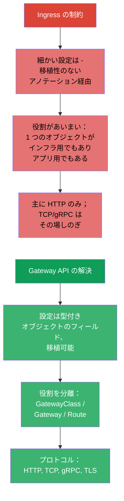
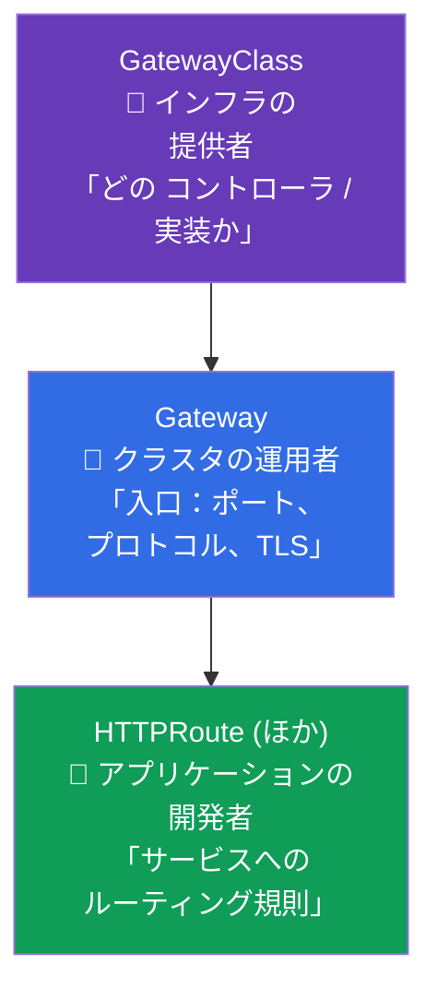
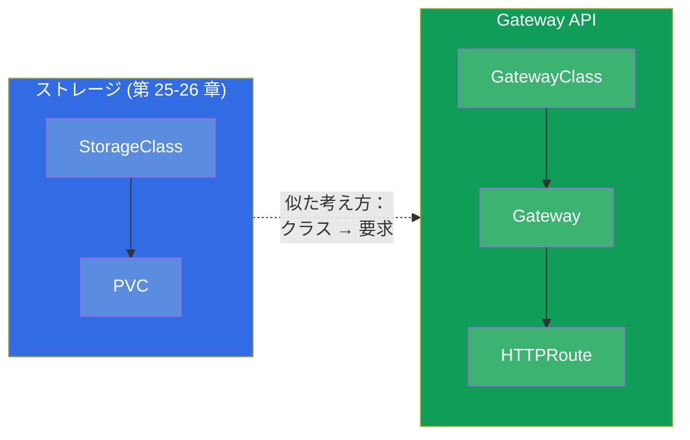
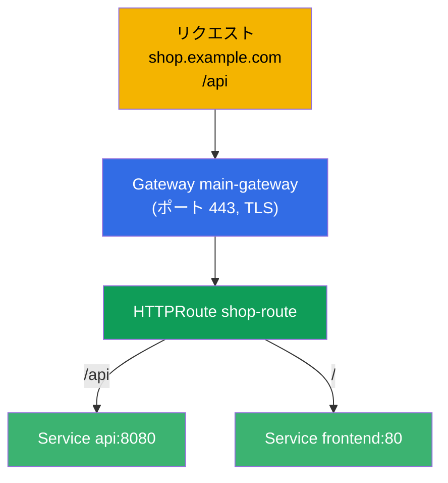
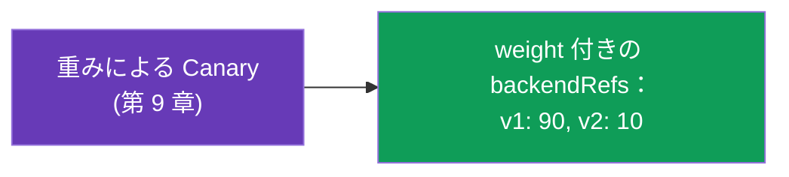
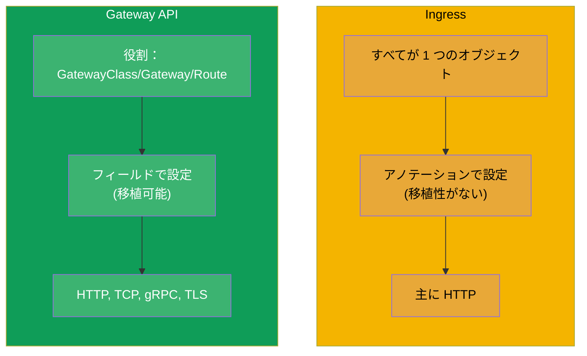
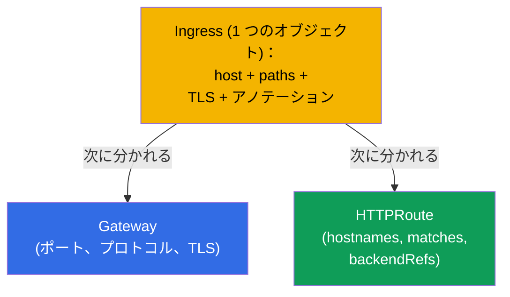
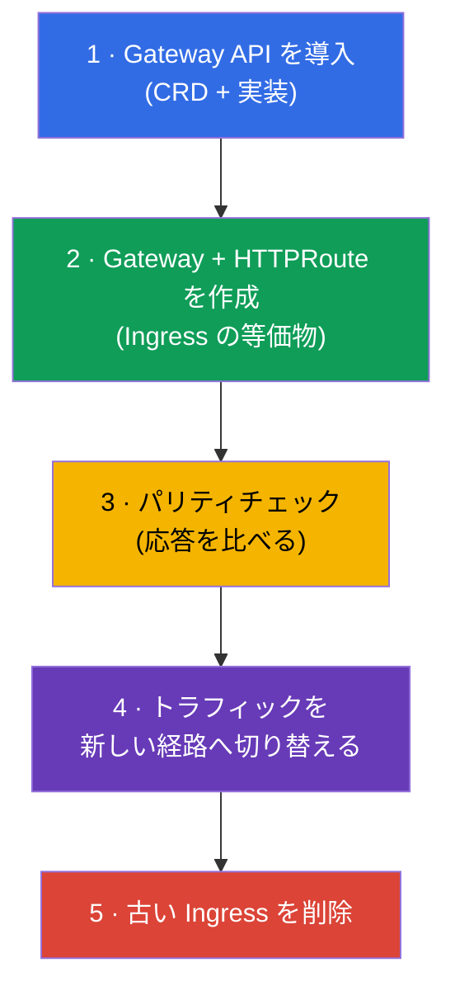

[Русская версия](ru.md) · [Eng version](README.md) · [Versión en español](es.md) · [Version française](fr.md) · [Deutsche Version](de.md) · [ქართული ვერსია](ge.md) · [繁體中文版](tw.md)

# 第 33 章。Gateway API

> **次は何か。** Ingress（第 32 章）は単純ですが、限界があります：細かい設定は移植性の
> ないアノテーション経由になり、役割（誰が入口を所有し、誰がルートを所有するのか）が
> あいまいです。**Gateway API** は、より表現力のある新しいルーティングの標準で、
> **CKA** の現行プログラム（Services & Networking 領域）に入りました。Ingress を
> 即座に置き換えたわけではありませんが、未来はこちらにあります。3 つの役割と
> オブジェクトからなるモデルを分解し、Ingress と比較しましょう。

## 33.1. Gateway API が必要な理由

Ingress には 3 つの体系的な制約があり、Gateway API はそれを解消します：



中心となる考え方は **役割による責任の分離** と、アノテーションの文字列ではなく
**型付きオブジェクトによる表現力** です。

## 33.2. 3 つの役割と 3 つのオブジェクト

Gateway API は 3 つの役割を軸に組み立てられており、それぞれに対応するオブジェクトが
あります。これがこの API の中心的な概念です。



| オブジェクト | 誰が所有するか | 何を記述するか |
|--------|-------------|---------------|
| **GatewayClass** | 提供者/プラットフォーム | 実装（どのコントローラか）。ネットワークにおける StorageClass のようなもの |
| **Gateway** | クラスタの運用者 | 入口：リスナー（ポート、プロトコル、TLS） |
| **HTTPRoute**（および TCPRoute, gRPCRoute） | アプリケーションの開発者 | サービスへのルーティング規則 |

分離の意味：プラットフォームチームが Gateway（入口と TLS）を所有し、アプリケーションの
チームは共通の入口に触れず、互いに邪魔もせずに自分の HTTPRoute を管理します。
Ingress ではこれらすべてが 1 つのオブジェクトの中にありました。

## 33.3. すでに知っているものとの類推

役割を頭の中に収めるには、このコースで出てきた類推が役立ちます：



GatewayClass は StorageClass（第 26 章）に似ています：プラットフォームが提供する実装を
記述します。そして Gateway は、その実装として実際にデプロイされた具体的な入口です。

## 33.4. 例：Gateway + HTTPRoute

**Gateway**（クラスタの運用者）- 入口：

```yaml
apiVersion: gateway.networking.k8s.io/v1
kind: Gateway
metadata:
  name: main-gateway
spec:
  gatewayClassName: nginx           # どの実装か (GatewayClass)
  listeners:
  - name: https
    protocol: HTTPS
    port: 443
    tls:
      mode: Terminate
      certificateRefs:
      - kind: Secret
        name: shop-tls
    hostname: "*.example.com"
```

**HTTPRoute**（アプリケーションの開発者）- ルーティング規則。Gateway を参照します：

```yaml
apiVersion: gateway.networking.k8s.io/v1
kind: HTTPRoute
metadata:
  name: shop-route
spec:
  parentRefs:
  - name: main-gateway              # どの Gateway に紐づくか
  hostnames:
  - "shop.example.com"
  rules:
  - matches:
    - path:
        type: PathPrefix
        value: /api
    backendRefs:
    - name: api
      port: 8080
  - matches:
    - path:
        type: PathPrefix
        value: /
    backendRefs:
    - name: frontend
      port: 80
```



## 33.5. Gateway API が標準で備えているもの

Ingress ではアノテーションが必要だったものが、Gateway API ではオブジェクトのフィールドに
なっています（実装をまたいで移植可能です）：

| 機能 | Gateway API では |
|-------------|---------------|
| パス/ホスト/ヘッダによるルーティング | HTTPRoute の `matches` フィールド |
| 重みによる振り分け (canary) | `backendRefs` の `weight` |
| 書き換え/リダイレクト | `filters` (URLRewrite, RequestRedirect) |
| ヘッダの変更 | `filters` (RequestHeaderModifier) |
| TCP, gRPC, TLS のルーティング | TCPRoute, gRPCRoute, TLSRoute |
| ルートごとの権限分離 | チームの namespace にある個別の Route |



たとえば canary（第 9 章）は、Gateway API ではレプリカ数やアノテーションではなく
`backendRefs` の重みで直接おこないます - よりきれいで正確です。

## 33.6. Ingress と Gateway API の比較



| | Ingress | Gateway API |
|---|---------|-------------|
| モデル | 1 つのオブジェクト | 役割：GatewayClass / Gateway / Route |
| 細かい設定 | アノテーション（移植性がない） | オブジェクトのフィールド（移植可能） |
| プロトコル | 主に HTTP(S) | HTTP, TCP, gRPC, TLS |
| 役割の分離 | なし | あり（プラットフォーム vs アプリケーション） |
| 成熟度 | 古くから安定、どこにでもある | 安定していて、普及が進んでいる |

Gateway API が Ingress を即座に無くすわけではありません - Ingress はこれからも長く
出会うことになります。しかし新しいクラスタや高度なシナリオでは、ますます Gateway API が
選ばれています。多くの実装（Istio - ICA コース - を含む）が Gateway API に対応しています。

## 33.7. Ingress から Gateway API への移行

Gateway API がルーティングの向かっている方向であるからこそ、もっとも重要な実務スキル
（そして試験のテーマ）は **既存の Ingress を Gateway API へ移すこと** です。鍵となる
考え方：1 つの `Ingress` が **2 つのオブジェクト** に分かれます - `Gateway`（入口：
ポート、プロトコル、TLS）と `HTTPRoute`（規則：ホスト、パス、バックエンド）です。



### Ingress → Gateway API のフィールド対応

| Ingress | Gateway API |
|---------|-------------|
| `ingressClassName` | `Gateway.spec.gatewayClassName` |
| `rules[].host` | `HTTPRoute.spec.hostnames` |
| `rules[].http.paths[].path`（+ `pathType`） | `HTTPRoute.rules[].matches[].path`（`type: PathPrefix/Exact`） |
| `backend.service.name/port` | `HTTPRoute.rules[].backendRefs[].name/port` |
| `tls[]`（secret） | `Gateway.listeners[].tls.certificateRefs` |
| アノテーション `rewrite-target` | `HTTPRoute` の `filters` → `URLRewrite` |
| アノテーション `ssl-redirect` | `Gateway`/`HTTPRoute` の `filters` → `RequestRedirect` (HTTPS) |
| `canary-*` アノテーション | `backendRefs[].weight`（第 9 章） |

### 例：以前 (Ingress) → 現在 (Gateway + HTTPRoute)

元の Ingress：

```yaml
apiVersion: networking.k8s.io/v1
kind: Ingress
metadata:
  name: shop
  annotations:
    nginx.ingress.kubernetes.io/rewrite-target: /
spec:
  ingressClassName: nginx
  rules:
  - host: shop.local
    http:
      paths:
      - path: /api
        pathType: Prefix
        backend:
          service:
            name: api
            port:
              number: 8080
```

Gateway API での等価物 - `Gateway` + `HTTPRoute`：

```yaml
apiVersion: gateway.networking.k8s.io/v1
kind: Gateway
metadata:
  name: shop-gw
spec:
  gatewayClassName: nginx
  listeners:
  - name: http
    protocol: HTTP
    port: 80
    hostname: "shop.local"
---
apiVersion: gateway.networking.k8s.io/v1
kind: HTTPRoute
metadata:
  name: shop-route
spec:
  parentRefs:
  - name: shop-gw
  hostnames: ["shop.local"]
  rules:
  - matches:
    - path:
        type: PathPrefix
        value: /api
    filters:
    - type: URLRewrite
      urlRewrite:
        path:
          type: ReplacePrefixMatch
          replacePrefixMatch: /       # = rewrite-target: /
    backendRefs:
    - name: api
      port: 8080
```

### ingress2gateway というツール

手で書き直す必要はありません - **ingress2gateway** ユーティリティ
(kubernetes-sigs のプロジェクト) が既存の `Ingress` を読み取り、Gateway API の
リソースを生成します：

```bash
ingress2gateway print --providers ingress-nginx -A > gwapi.yaml
```

重要な注意点（どの移行でも同じです - ICA コースの ingress→istio の章を参照）：

- 出力は **下書き** です：nginx 固有のアノテーション (rewrite, canary, auth, snippet) は
  部分的にしか、あるいはまったく移されません。それらは手で直します；
- トラフィックを切り替える前に、**レビュー** と **パリティチェック**（同じリクエストを
  古い Ingress と新しい Gateway に投げ、応答を比べる）が必須です；
- 移行は **並行して** おこないます：新しい経路が検証されるまで古い Ingress は削除しません
  - zero-downtime の切り替えと同じです。

### 安全な移行の手順



## 33.8. 本番環境でこれをどう使うか

- **プラットフォーム/チームの役割分離。** 本番でのいちばんの価値：プラットフォームチームが
  Gateway（入口、TLS、ポート）を所有し、プロダクトチームは共通の入口に触れずに、自分の
  namespace で自分の HTTPRoute を管理します。全員が 1 つの Ingress を編集していたときの
  ボトルネックが解消されます。
- **移植性。** Gateway API の規則は特定のコントローラのアノテーションに縛られないので、
  実装の変更 (nginx → Istio → クラウド) が Ingress のアノテーションよりも痛みなく進みます。
- **L4 と L7 の統一された仕組み。** TCPRoute/gRPCRoute/TLSRoute は、HTTP だけでなく
  TCP/gRPC についても、本番で一貫した 1 つのルーティング手段を与えてくれます - Ingress の
  「その場しのぎ」なしで。
- **移行は段階的に。** 本番では Gateway API と Ingress がしばしば共存します：新しい
  サービスは Gateway API で作り、古いものは計画的な移行まで Ingress に残します
  (ingress2gateway のようなツールが変換を助けてくれます)。
- **実装はやはり必要。** Ingress コントローラと同じで、Gateway API にも実装のインストールが
  必要です (nginx gateway, Istio, Cilium, クラウドのもの) - オブジェクトだけでは動きません。

## 33.9. ミニ用語集

- **Gateway API** - Kubernetes におけるトラフィックルーティングの現代的な標準。
- **GatewayClass** - Gateway API の実装（コントローラ）。StorageClass の相当物。
- **Gateway** - 入口：リスナー（ポート、プロトコル、TLS）。クラスタの運用者が所有します。
- **HTTPRoute** - サービスへの HTTP ルーティング規則。開発者が所有します。
- **TCPRoute / gRPCRoute / TLSRoute** - 他のプロトコルのためのルーティング。
- **parentRefs** - Route を Gateway に紐づけるもの。
- **backendRefs** - 対象のサービス（canary 用の重み付き）。
- **filters** - 変換 (rewrite, redirect, ヘッダ)。
- **Ingress → Gateway API の移行** - 1 つの Ingress を Gateway（入口）+
  HTTPRoute（規則）に分けること。
- **ingress2gateway** - Ingress を Gateway API のリソースへ自動変換するユーティリティ
  （下書きを与えるだけで、レビューが必要）。

## 33.10. 本章のまとめ

- Gateway API は新しいルーティングの標準で、Ingress の制約を解決します：移植性のない
  アノテーション、あいまいな役割、HTTP 以外への弱いサポート。
- 3 つの役割/オブジェクト：GatewayClass（実装、StorageClass のようなもの）、Gateway
  （入口：ポート、プロトコル、TLS - クラスタの運用者）、HTTPRoute（規則 - 開発者）。
- 役割の分離が中心的な考え方です：プラットフォームが入口を所有し、チームは自分の
  ルートを所有します。
- 細かい設定（重みによる canary、rewrite、ヘッダ）はアノテーションではなくオブジェクトの
  フィールドです；HTTP, TCP, gRPC, TLS に対応します。
- Ingress が即座に置き換えられるわけではありません；Gateway API は普及が進んでおり、
  多くの実装（Istio を含む）が対応しています。
- Ingress と同じく、実装のインストールが必要です。
- Ingress → Gateway API の移行：1 つの Ingress が `Gateway`（入口：ポート、
  プロトコル、TLS）+ `HTTPRoute`（hostnames, matches, backendRefs）に分かれます；
  アノテーションは `filters`/`weight` へ移ります。`ingress2gateway` ユーティリティは
  下書きを与えます；パリティチェックをしながら並行して移し、古い Ingress は最後に削除します。

## 33.11. これがどう役に立つか：試験と実際の仕事で

**試験では (CKA)。** Gateway API は CKA の現行プログラムに入りました。「ルーティングのために
Gateway と HTTPRoute を作れ」、**「既存の Ingress を Gateway API へ移行せよ」**（Gateway +
HTTPRoute に分け、host/path/backend と rewrite を移す）といった課題、GatewayClass/Gateway/Route
の役割と parentRefs/backendRefs の結びつきの理解が期待されます。Ingress と Gateway API の
フィールドを対応づけられると役に立ちます。

**実際の仕事では。** Gateway API は Kubernetes のルーティングが向かっている方向です：
プラットフォーム/チームの役割分離、移植性、さまざまなプロトコルのための統一された仕組み。
そのモデルを理解しておくことは、現代的なクラスタへの備えになり、Ingress からの移行を
やさしくします。

## 33.12. 自己チェックの質問

1. Gateway API は Ingress のどの制約を解消しますか？
2. Gateway API の 3 つのオブジェクトと、それぞれの所有者の役割を挙げてください。
3. GatewayClass は StorageClass とどこが似ていますか？
4. HTTPRoute はどうやって Gateway に紐づき、対象のサービスを指定しますか？
5. Gateway API でトラフィックの canary 振り分けはどうやりますか？
6. Gateway API の設定は、なぜ Ingress のアノテーションより移植性が高いのですか？
7. Gateway API は今すぐ Ingress を置き換えますか？動かすには何が必要ですか？
8. `Ingress` を Gateway API へ移行するには：どのオブジェクトに分かれ、
   host/path/backend/TLS/rewrite はどう対応しますか？
9. `ingress2gateway` は何をしますか。そしてなぜその出力を検査なしに適用してはいけないのですか？

## 演習

現代的なルーティングと Ingress からの移行を分解しました。第 34 章ではパート 7 を
NetworkPolicy のテーマで締めます - どの Pod がどの Pod と通信できるかをどう制限するか。
Gateway API、Ingress、そしてその移行は、ネットワークのラボ (110) で練習します。

🧪 ラボ 110：[tasks/cka/labs/110](../../labs/110/README_JP.MD)

---
[目次](../README_JP.md) · [第 32 章](../32/jp.md) · [第 34 章](../34/jp.md)
