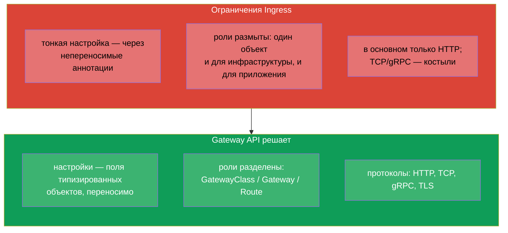
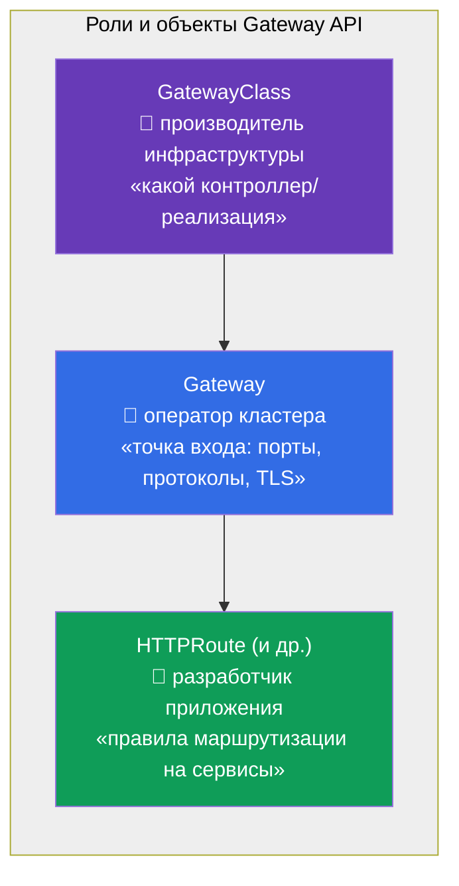
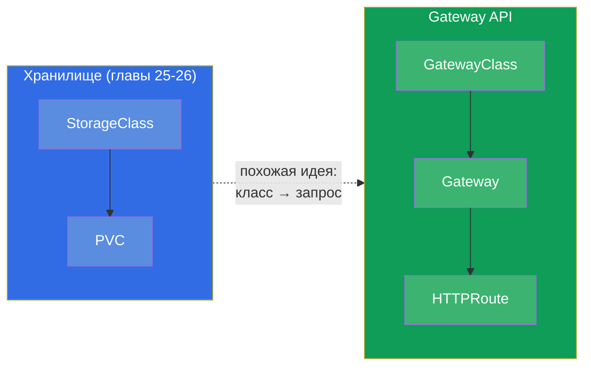
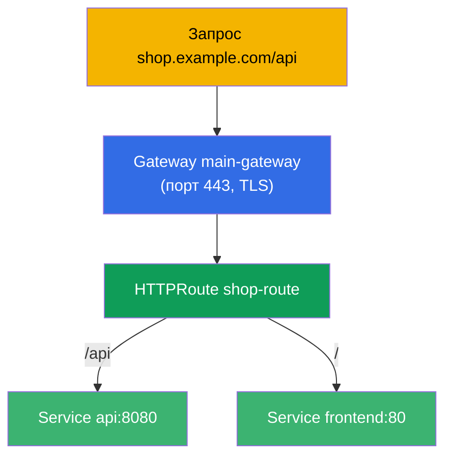
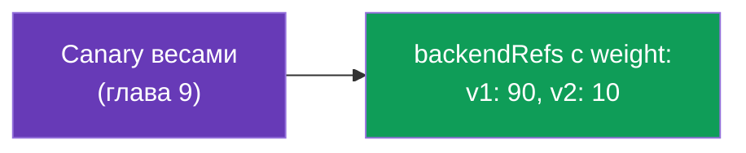
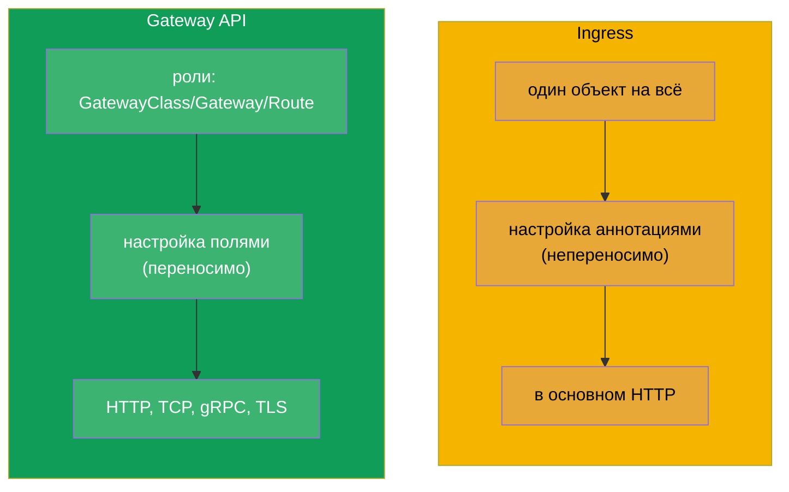
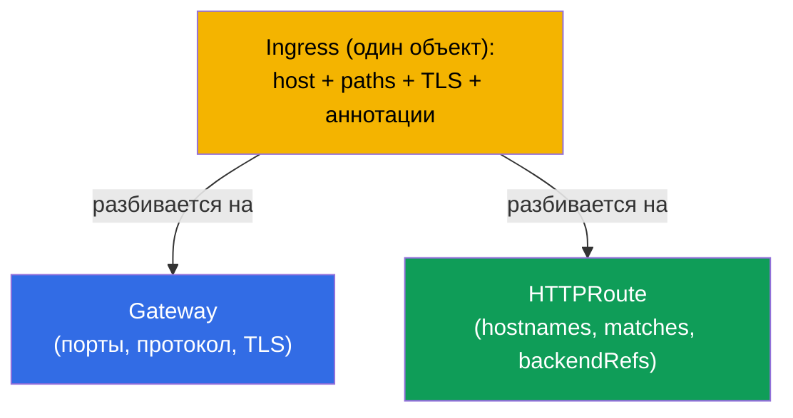
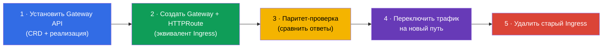

# Глава 33. Gateway API

> **Что дальше.** Ingress (глава 32) прост, но у него предел: тонкая настройка идёт через
> непереносимые аннотации, а роли (кто владеет входом, кто маршрутами) размыты.
> **Gateway API** - это новый, более выразительный стандарт маршрутизации, который вошёл в
> актуальную программу **CKA** (домен Services & Networking). Он не заменил Ingress
> мгновенно, но за ним будущее. Разберём его модель из трёх ролей и объектов и сравним с
> Ingress.

## 33.1. Зачем нужен Gateway API

У Ingress три системных ограничения, которые Gateway API устраняет:



Главная идея - **разделение ответственности по ролям** и **выразительность через
типизированные объекты** вместо строк-аннотаций.

## 33.2. Три роли и три объекта

Gateway API строится вокруг трёх ролей, каждой соответствует свой объект. Это его
центральная концепция.



| Объект | Кто владеет | Что описывает |
|--------|-------------|---------------|
| **GatewayClass** | производитель/платформа | реализация (какой контроллер), как StorageClass для сети |
| **Gateway** | оператор кластера | точка входа: слушатели (порты, протоколы, TLS) |
| **HTTPRoute** (и TCPRoute, gRPCRoute) | разработчик приложения | правила маршрутизации на сервисы |

Смысл разделения: платформенная команда владеет Gateway (входом и TLS), а команды
приложений сами управляют своими HTTPRoute, не трогая общий вход и не мешая друг другу.
С Ingress это всё было в одном объекте.

## 33.3. Аналогия с тем, что уже знаем

Чтобы уложить роли в голове, полезны аналогии из курса:



GatewayClass похож на StorageClass (глава 26): описывает реализацию, которую предоставляет
платформа. А Gateway - это конкретная развёрнутая точка входа этой реализации.

## 33.4. Пример: Gateway + HTTPRoute

**Gateway** (оператор кластера) - точка входа:

```yaml
apiVersion: gateway.networking.k8s.io/v1
kind: Gateway
metadata:
  name: main-gateway
spec:
  gatewayClassName: nginx           # какая реализация (GatewayClass)
  listeners:
  - name: https
    protocol: HTTPS
    port: 443
    tls:
      mode: Terminate
      certificateRefs:
      - kind: Secret
        name: shop-tls
    hostname: "*.example.com"
```

**HTTPRoute** (разработчик приложения) - правила маршрутизации, ссылается на Gateway:

```yaml
apiVersion: gateway.networking.k8s.io/v1
kind: HTTPRoute
metadata:
  name: shop-route
spec:
  parentRefs:
  - name: main-gateway              # к какому Gateway привязан
  hostnames:
  - "shop.example.com"
  rules:
  - matches:
    - path:
        type: PathPrefix
        value: /api
    backendRefs:
    - name: api
      port: 8080
  - matches:
    - path:
        type: PathPrefix
        value: /
    backendRefs:
    - name: frontend
      port: 80
```



## 33.5. Что Gateway API умеет из коробки

То, что в Ingress требовало аннотаций, в Gateway API - это поля объектов (переносимо между
реализациями):

| Возможность | В Gateway API |
|-------------|---------------|
| маршрутизация по пути/хосту/заголовкам | поля `matches` в HTTPRoute |
| распределение по весам (canary) | `weight` в `backendRefs` |
| переписывание/редиректы | `filters` (URLRewrite, RequestRedirect) |
| изменение заголовков | `filters` (RequestHeaderModifier) |
| TCP, gRPC, TLS-маршрутизация | TCPRoute, gRPCRoute, TLSRoute |
| разделение прав на маршруты | отдельные Route в namespace команд |



Например, canary (глава 9) в Gateway API делается напрямую весами `backendRefs`, а не
числом реплик или аннотациями - чище и точнее.

## 33.6. Ingress против Gateway API



| | Ingress | Gateway API |
|---|---------|-------------|
| Модель | один объект | роли: GatewayClass / Gateway / Route |
| Тонкая настройка | аннотации (непереносимо) | поля объектов (переносимо) |
| Протоколы | в основном HTTP(S) | HTTP, TCP, gRPC, TLS |
| Разделение ролей | нет | да (платформа vs приложение) |
| Зрелость | давно стабилен, повсеместен | стабилен, набирает распространение |

Gateway API не отменяет Ingress мгновенно - Ingress ещё долго будет встречаться. Но новые
кластеры и продвинутые сценарии всё чаще идут через Gateway API. Многие реализации (в
т.ч. Istio - курс ICA) поддерживают Gateway API.

## 33.7. Миграция с Ingress на Gateway API

Раз Gateway API - это направление, в которое движется маршрутизация, важнейший
практический навык (и тема экзамена) - **перенести существующий Ingress на Gateway API**.
Ключевая идея: один `Ingress` разбивается на **два объекта** - `Gateway` (точка входа:
порты, протоколы, TLS) и `HTTPRoute` (правила: хосты, пути, бэкенды).



### Соответствие полей Ingress → Gateway API

| Ingress | Gateway API |
|---------|-------------|
| `ingressClassName` | `Gateway.spec.gatewayClassName` |
| `rules[].host` | `HTTPRoute.spec.hostnames` |
| `rules[].http.paths[].path` (+ `pathType`) | `HTTPRoute.rules[].matches[].path` (`type: PathPrefix/Exact`) |
| `backend.service.name/port` | `HTTPRoute.rules[].backendRefs[].name/port` |
| `tls[]` (secret) | `Gateway.listeners[].tls.certificateRefs` |
| аннотация `rewrite-target` | `HTTPRoute` `filters` → `URLRewrite` |
| аннотация `ssl-redirect` | `Gateway`/`HTTPRoute` `filters` → `RequestRedirect` (HTTPS) |
| `canary-*` аннотации | `backendRefs[].weight` (глава 9) |

### Пример: было (Ingress) → стало (Gateway + HTTPRoute)

Исходный Ingress:

```yaml
apiVersion: networking.k8s.io/v1
kind: Ingress
metadata:
  name: shop
  annotations:
    nginx.ingress.kubernetes.io/rewrite-target: /
spec:
  ingressClassName: nginx
  rules:
  - host: shop.local
    http:
      paths:
      - path: /api
        pathType: Prefix
        backend:
          service:
            name: api
            port: {number: 8080}
```

Эквивалент на Gateway API - `Gateway` + `HTTPRoute`:

```yaml
apiVersion: gateway.networking.k8s.io/v1
kind: Gateway
metadata:
  name: shop-gw
spec:
  gatewayClassName: nginx
  listeners:
  - name: http
    protocol: HTTP
    port: 80
    hostname: "shop.local"
---
apiVersion: gateway.networking.k8s.io/v1
kind: HTTPRoute
metadata:
  name: shop-route
spec:
  parentRefs:
  - name: shop-gw
  hostnames: ["shop.local"]
  rules:
  - matches:
    - path:
        type: PathPrefix
        value: /api
    filters:
    - type: URLRewrite
      urlRewrite:
        path:
          type: ReplacePrefixMatch
          replacePrefixMatch: /       # = rewrite-target: /
    backendRefs:
    - name: api
      port: 8080
```

### Инструмент ingress2gateway

Переписывать вручную необязательно - утилита **ingress2gateway** (проект
kubernetes-sigs) читает существующие `Ingress` и генерирует ресурсы Gateway API:

```bash
ingress2gateway print --providers ingress-nginx -A > gwapi.yaml
```

Важные оговорки (те же, что при любой миграции - см. курс ICA, глава про ingress→istio):

- вывод - **черновик**: специфичные аннотации nginx (rewrite, canary, auth, snippet)
  переносятся частично или никак, их доправляют руками;
- обязательны **ревью** и **паритет-проверка** (тот же запрос в старый Ingress и в новый
  Gateway, сравнить ответы) до переключения трафика;
- миграцию делают **параллельно**: старый Ingress не удаляют, пока новый путь не
  провалидирован, - как и при zero-downtime переключении.

### Порядок безопасной миграции



## 33.8. Как это применяют в продакшене

- **Разделение ролей платформа/команды.** Главная ценность в проде: платформенная команда
  владеет Gateway (вход, TLS, порты), а продуктовые команды сами управляют своими
  HTTPRoute в своих namespace, не трогая общий вход. Это снимает узкое место, когда все
  правили один Ingress.
- **Переносимость.** Правила Gateway API не завязаны на аннотации конкретного контроллера,
  поэтому смена реализации (nginx → Istio → облачная) проходит менее болезненно, чем с
  Ingress-аннотациями.
- **Единый механизм для L4 и L7.** TCPRoute/gRPCRoute/TLSRoute дают в проде один
  согласованный способ маршрутизации не только HTTP, но и TCP/gRPC - без «костылей»
  Ingress.
- **Миграция постепенная.** В проде Gateway API и Ingress часто сосуществуют: новые
  сервисы заводят через Gateway API, старые остаются на Ingress до планового переноса
  (инструменты вроде ingress2gateway помогают конвертировать).
- **Реализация всё равно нужна.** Как и Ingress-контроллер, Gateway API требует
  установленной реализации (nginx gateway, Istio, Cilium, облачные) - сам по себе объект
  не работает.

## 33.9. Мини-глоссарий

- **Gateway API** - современный стандарт маршрутизации трафика в Kubernetes.
- **GatewayClass** - реализация (контроллер) Gateway API, аналог StorageClass.
- **Gateway** - точка входа: слушатели (порты, протоколы, TLS); владеет оператор кластера.
- **HTTPRoute** - правила HTTP-маршрутизации на сервисы; владеет разработчик.
- **TCPRoute / gRPCRoute / TLSRoute** - маршрутизация для других протоколов.
- **parentRefs** - привязка Route к Gateway.
- **backendRefs** - целевые сервисы (с весами для canary).
- **filters** - преобразования (rewrite, redirect, заголовки).
- **Миграция Ingress → Gateway API** - разбиение одного Ingress на Gateway (вход) +
  HTTPRoute (правила).
- **ingress2gateway** - утилита автоконвертации Ingress в ресурсы Gateway API (даёт
  черновик, требует ревью).

## 33.10. Итоги главы

- Gateway API - новый стандарт маршрутизации, решающий ограничения Ingress: непереносимые
  аннотации, размытые роли, слабая поддержка не-HTTP.
- Три роли/объекта: GatewayClass (реализация, как StorageClass), Gateway (вход: порты,
  протоколы, TLS - оператор кластера), HTTPRoute (правила - разработчик).
- Разделение ролей - главная идея: платформа владеет входом, команды - своими маршрутами.
- Тонкие настройки (canary весами, rewrite, заголовки) - поля объектов, а не аннотации;
  поддерживаются HTTP, TCP, gRPC, TLS.
- Ingress не заменён мгновенно; Gateway API набирает распространение, многие реализации
  (включая Istio) его поддерживают.
- Как и Ingress, требует установленной реализации.
- Миграция Ingress → Gateway API: один Ingress разбивается на `Gateway` (вход: порты,
  протокол, TLS) + `HTTPRoute` (hostnames, matches, backendRefs); аннотации переходят в
  `filters`/`weight`. Утилита `ingress2gateway` даёт черновик; переносят параллельно с
  паритет-проверкой, старый Ingress удаляют последним.

## 33.11. Как это пригодится: на экзамене и в реальной работе

**На экзамене (CKA).** Gateway API вошёл в актуальную программу CKA. Ожидаются задания
«создай Gateway и HTTPRoute для маршрутизации», **«мигрируй существующий Ingress на
Gateway API»** (разбить на Gateway + HTTPRoute, перенести host/path/backend и rewrite),
понимание ролей GatewayClass/Gateway/Route и связки parentRefs/backendRefs. Полезно уметь
сопоставлять поля Ingress и Gateway API.

**В реальной работе.** Gateway API - направление, в котором движется маршрутизация в
Kubernetes: разделение ролей платформа/команды, переносимость, единый механизм для разных
протоколов. Понимание его модели готовит к современным кластерам и упрощает миграцию с
Ingress.

## 33.12. Вопросы для самопроверки

1. Какие ограничения Ingress устраняет Gateway API?
2. Назовите три объекта Gateway API и роль-владельца каждого.
3. Чем GatewayClass похож на StorageClass?
4. Как HTTPRoute привязывается к Gateway и указывает целевые сервисы?
5. Как в Gateway API сделать canary-распределение трафика?
6. Чем настройка в Gateway API переносимее, чем аннотации Ingress?
7. Заменяет ли Gateway API Ingress прямо сейчас? Что нужно, чтобы он работал?
8. Как мигрировать `Ingress` на Gateway API: на какие объекты он разбивается и как
   соотносятся host/path/backend/TLS/rewrite?
9. Что делает `ingress2gateway` и почему его вывод нельзя применять без проверки?

## Практика

Мы разобрали современную маршрутизацию и миграцию с Ingress. В главе 34 закроем часть 7
темой NetworkPolicy - как ограничивать, какой под с каким может общаться. Gateway API,
Ingress и их миграция отрабатываются в лабе по сети (110).

🧪 Лаба 110: [tasks/cka/labs/110](../../labs/110/README_RU.MD)

---
[Оглавление](../README_RU.md) · [Глава 32](../32/ru.md) · [Глава 34](../34/ru.md)
