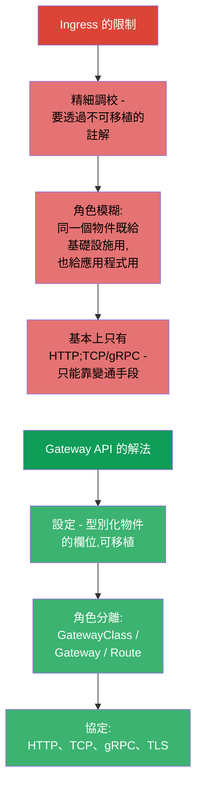
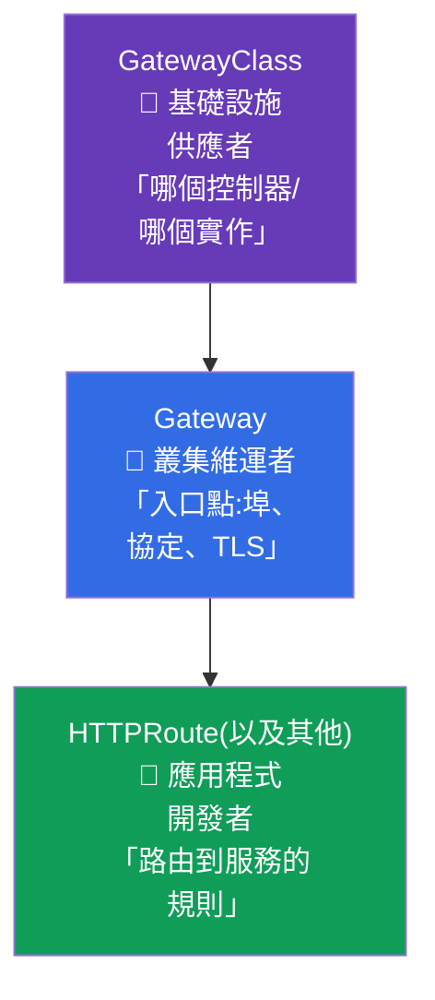
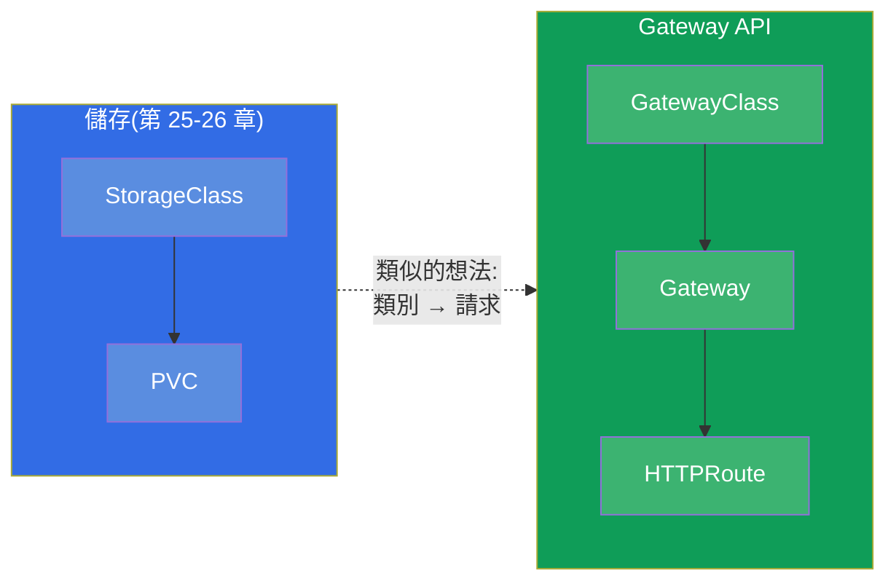
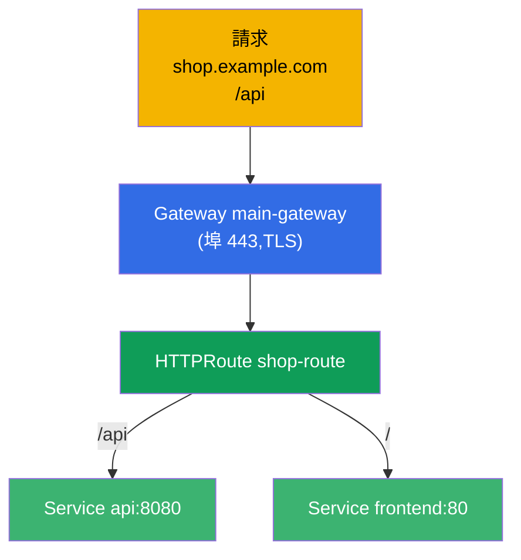
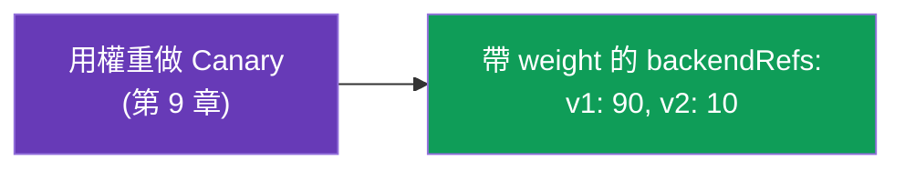
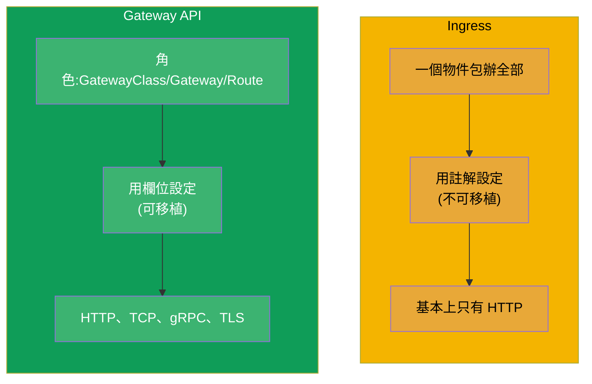
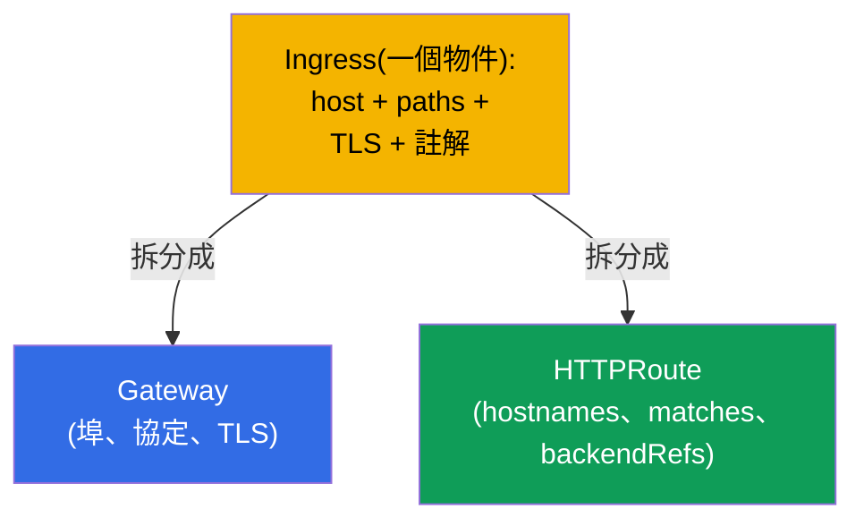
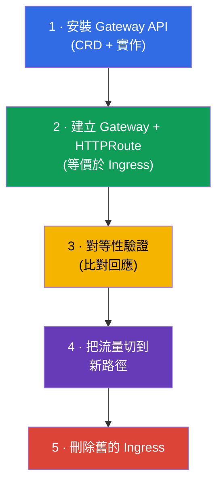

[Русская версия](ru.md) · [Eng version](README.md) · [Versión en español](es.md) · [Version française](fr.md) · [Deutsche Version](de.md) · [ქართული ვერსია](ge.md) · [日本語版](jp.md)

# 第 33 章。Gateway API

> **接下來是什麼。** Ingress(第 32 章)很簡單,但它有極限:精細調校要靠
> 不可移植的註解,而角色(誰擁有入口、誰擁有路由)也很模糊。
> **Gateway API** 是新的、表達力更強的路由標準,它已經進入現行的 **CKA**
> 考試大綱(Services & Networking 領域)。它沒有立刻取代 Ingress,但未來
> 屬於它。我們來拆解它由三種角色與三個物件組成的模型,並與 Ingress 做比較。

## 33.1. 為什麼需要 Gateway API

Ingress 有三個系統性的限制,而 Gateway API 消除了它們:



核心思想是 **依角色分離職責**,以及 **透過型別化物件取得表達力**,而不是靠
註解字串。

## 33.2. 三種角色與三個物件

Gateway API 圍繞三種角色建構,每一種角色都對應一個自己的物件。這是它的
中心概念。



| 物件 | 誰擁有 | 描述什麼 |
|--------|-------------|---------------|
| **GatewayClass** | 供應者/平台 | 實作(哪個控制器),就像網路領域的 StorageClass |
| **Gateway** | 叢集維運者 | 入口點:監聽器(埠、協定、TLS) |
| **HTTPRoute**(以及 TCPRoute、gRPCRoute) | 應用程式開發者 | 路由到服務的規則 |

分離的意義:平台團隊擁有 Gateway(入口與 TLS),而應用團隊自己管理各自的
HTTPRoute,不必動到共用的入口,也不會互相干擾。在 Ingress 裡這些全都塞在
同一個物件中。

## 33.3. 與我們已知事物的類比

要把這些角色記牢,課程裡的類比很有幫助:



GatewayClass 很像 StorageClass(第 26 章):它描述平台所提供的實作。而
Gateway 則是這個實作實際部署出來的具體入口點。

## 33.4. 範例:Gateway + HTTPRoute

**Gateway**(叢集維運者)- 入口點:

```yaml
apiVersion: gateway.networking.k8s.io/v1
kind: Gateway
metadata:
  name: main-gateway
spec:
  gatewayClassName: nginx           # 哪一種實作(GatewayClass)
  listeners:
  - name: https
    protocol: HTTPS
    port: 443
    tls:
      mode: Terminate
      certificateRefs:
      - kind: Secret
        name: shop-tls
    hostname: "*.example.com"
```

**HTTPRoute**(應用程式開發者)- 路由規則,它指向 Gateway:

```yaml
apiVersion: gateway.networking.k8s.io/v1
kind: HTTPRoute
metadata:
  name: shop-route
spec:
  parentRefs:
  - name: main-gateway              # 綁定到哪個 Gateway
  hostnames:
  - "shop.example.com"
  rules:
  - matches:
    - path:
        type: PathPrefix
        value: /api
    backendRefs:
    - name: api
      port: 8080
  - matches:
    - path:
        type: PathPrefix
        value: /
    backendRefs:
    - name: frontend
      port: 80
```



## 33.5. Gateway API 開箱就有的能力

在 Ingress 裡需要註解才能做到的事,在 Gateway API 裡就是物件的欄位(可以在
不同實作之間移植):

| 能力 | 在 Gateway API 中 |
|-------------|---------------|
| 依路徑/主機/標頭路由 | HTTPRoute 中的 `matches` 欄位 |
| 依權重分流(canary) | `backendRefs` 中的 `weight` |
| 重寫/重新導向 | `filters`(URLRewrite、RequestRedirect) |
| 修改標頭 | `filters`(RequestHeaderModifier) |
| TCP、gRPC、TLS 路由 | TCPRoute、gRPCRoute、TLSRoute |
| 路由權限的分離 | 各團隊 namespace 中獨立的 Route |



舉例來說,canary(第 9 章)在 Gateway API 裡是直接用 `backendRefs` 的權重
完成的,而不是靠副本數或註解 - 更乾淨也更精確。

## 33.6. Ingress 對比 Gateway API



| | Ingress | Gateway API |
|---|---------|-------------|
| 模型 | 一個物件 | 角色:GatewayClass / Gateway / Route |
| 精細調校 | 註解(不可移植) | 物件欄位(可移植) |
| 協定 | 基本上只有 HTTP(S) | HTTP、TCP、gRPC、TLS |
| 角色分離 | 沒有 | 有(平台 vs 應用程式) |
| 成熟度 | 早已穩定、無處不在 | 已穩定,正在普及 |

Gateway API 不會立刻讓 Ingress 消失 - Ingress 還會存在很長一段時間。但新的
叢集與進階場景越來越常走 Gateway API。許多實作(其中包括 Istio - ICA 課程)
都支援 Gateway API。

## 33.7. 從 Ingress 遷移到 Gateway API

既然 Gateway API 是路由正在前進的方向,那麼最重要的實務技能(也是考試主題)
就是 **把現有的 Ingress 搬到 Gateway API**。關鍵想法:一個 `Ingress` 會拆成
**兩個物件** - `Gateway`(入口點:埠、協定、TLS)與 `HTTPRoute`(規則:主機、
路徑、後端)。



### Ingress → Gateway API 的欄位對應

| Ingress | Gateway API |
|---------|-------------|
| `ingressClassName` | `Gateway.spec.gatewayClassName` |
| `rules[].host` | `HTTPRoute.spec.hostnames` |
| `rules[].http.paths[].path`(+ `pathType`) | `HTTPRoute.rules[].matches[].path`(`type: PathPrefix/Exact`) |
| `backend.service.name/port` | `HTTPRoute.rules[].backendRefs[].name/port` |
| `tls[]`(secret) | `Gateway.listeners[].tls.certificateRefs` |
| `rewrite-target` 註解 | `HTTPRoute` 的 `filters` → `URLRewrite` |
| `ssl-redirect` 註解 | `Gateway`/`HTTPRoute` 的 `filters` → `RequestRedirect`(HTTPS) |
| `canary-*` 註解 | `backendRefs[].weight`(第 9 章) |

### 範例:原本(Ingress)→ 之後(Gateway + HTTPRoute)

原始的 Ingress:

```yaml
apiVersion: networking.k8s.io/v1
kind: Ingress
metadata:
  name: shop
  annotations:
    nginx.ingress.kubernetes.io/rewrite-target: /
spec:
  ingressClassName: nginx
  rules:
  - host: shop.local
    http:
      paths:
      - path: /api
        pathType: Prefix
        backend:
          service:
            name: api
            port:
              number: 8080
```

在 Gateway API 上的等價寫法 - `Gateway` + `HTTPRoute`:

```yaml
apiVersion: gateway.networking.k8s.io/v1
kind: Gateway
metadata:
  name: shop-gw
spec:
  gatewayClassName: nginx
  listeners:
  - name: http
    protocol: HTTP
    port: 80
    hostname: "shop.local"
---
apiVersion: gateway.networking.k8s.io/v1
kind: HTTPRoute
metadata:
  name: shop-route
spec:
  parentRefs:
  - name: shop-gw
  hostnames: ["shop.local"]
  rules:
  - matches:
    - path:
        type: PathPrefix
        value: /api
    filters:
    - type: URLRewrite
      urlRewrite:
        path:
          type: ReplacePrefixMatch
          replacePrefixMatch: /       # = rewrite-target: /
    backendRefs:
    - name: api
      port: 8080
```

### ingress2gateway 工具

不一定要手工改寫 - **ingress2gateway** 這個工具(kubernetes-sigs 專案)會讀取
現有的 `Ingress` 並產生 Gateway API 資源:

```bash
ingress2gateway print --providers ingress-nginx -A > gwapi.yaml
```

重要的注意事項(與任何遷移一樣 - 參見 ICA 課程中關於 ingress→istio 的章節):

- 輸出只是 **草稿**:nginx 特有的註解(rewrite、canary、auth、snippet)只會被
  部分轉換或完全不轉換,需要人工補齊;
- 在切換流量之前,**審查** 與 **對等性驗證**(同一個請求分別打舊的 Ingress 與
  新的 Gateway,比對回應)是必須的;
- 遷移要 **並行** 進行:在新路徑驗證通過之前不要刪掉舊的 Ingress - 就像做
  zero-downtime 切換時那樣。

### 安全遷移的步驟



## 33.8. 生產環境中怎麼用

- **平台/團隊之間的角色分離。** 在生產環境中最大的價值:平台團隊擁有 Gateway
  (入口、TLS、埠),而產品團隊在自己的 namespace 裡自行管理各自的 HTTPRoute,
  不必動到共用入口。這解掉了「所有人都在改同一個 Ingress」造成的瓶頸。
- **可移植性。** Gateway API 的規則不綁在特定控制器的註解上,因此更換實作
  (nginx → Istio → 雲端託管)會比帶著一堆 Ingress 註解時輕鬆得多。
- **L4 與 L7 使用同一套機制。** TCPRoute/gRPCRoute/TLSRoute 在生產環境提供了
  一致的路由方式,不只針對 HTTP,也涵蓋 TCP/gRPC - 不需要 Ingress 那些
  「變通手段」。
- **遷移是漸進的。** 生產環境裡 Gateway API 與 Ingress 常常並存:新服務用
  Gateway API 建立,舊的留在 Ingress 上直到排定搬遷(像 ingress2gateway 這類
  工具能幫忙轉換)。
- **實作終究還是必要的。** 就像 Ingress 控制器一樣,Gateway API 需要安裝好的
  實作(nginx gateway、Istio、Cilium、雲端託管)- 光有物件本身不會動。

## 33.9. 迷你詞彙表

- **Gateway API** - Kubernetes 中現代化的流量路由標準。
- **GatewayClass** - Gateway API 的實作(控制器),類比於 StorageClass。
- **Gateway** - 入口點:監聽器(埠、協定、TLS);由叢集維運者擁有。
- **HTTPRoute** - 路由 HTTP 到服務的規則;由開發者擁有。
- **TCPRoute / gRPCRoute / TLSRoute** - 其他協定的路由。
- **parentRefs** - 把 Route 綁定到 Gateway。
- **backendRefs** - 目標服務(可帶權重做 canary)。
- **filters** - 轉換處理(rewrite、redirect、標頭)。
- **Ingress → Gateway API 遷移** - 把一個 Ingress 拆成 Gateway(入口)+
  HTTPRoute(規則)。
- **ingress2gateway** - 把 Ingress 自動轉換成 Gateway API 資源的工具(產出是
  草稿,需要審查)。

## 33.10. 本章總結

- Gateway API 是新的路由標準,解決了 Ingress 的限制:不可移植的註解、模糊的
  角色、對非 HTTP 協定支援薄弱。
- 三種角色/物件:GatewayClass(實作,像 StorageClass)、Gateway(入口:埠、
  協定、TLS - 叢集維運者)、HTTPRoute(規則 - 開發者)。
- 角色分離是核心想法:平台擁有入口,各團隊擁有自己的路由。
- 精細設定(用權重做 canary、rewrite、標頭)是物件欄位,而不是註解;支援
  HTTP、TCP、gRPC、TLS。
- Ingress 沒有被立刻取代;Gateway API 正在普及,許多實作(包括 Istio)都支援它。
- 和 Ingress 一樣,它需要安裝好的實作。
- Ingress → Gateway API 遷移:一個 Ingress 拆成 `Gateway`(入口:埠、協定、
  TLS)+ `HTTPRoute`(hostnames、matches、backendRefs);註解則轉到
  `filters`/`weight`。`ingress2gateway` 工具會給出草稿;遷移要並行進行並做
  對等性驗證,舊的 Ingress 最後才刪。

## 33.11. 這些知識的用處:考試與實際工作

**在考試中(CKA)。** Gateway API 已進入現行的 CKA 大綱。可以預期的題目有
「建立 Gateway 與 HTTPRoute 來做路由」、**「把現有的 Ingress 遷移到
Gateway API」**(拆成 Gateway + HTTPRoute,搬移 host/path/backend 與 rewrite),
以及理解 GatewayClass/Gateway/Route 的角色和 parentRefs/backendRefs 的串接。
能對照 Ingress 與 Gateway API 的欄位很有幫助。

**在實際工作中。** Gateway API 是 Kubernetes 路由前進的方向:平台/團隊的角色
分離、可移植性、不同協定的統一機制。理解它的模型能讓你準備好面對現代叢集,
也讓從 Ingress 遷移變得更簡單。

## 33.12. 自我檢查問題

1. Gateway API 消除了 Ingress 的哪些限制?
2. 說出 Gateway API 的三個物件,以及各自的擁有者角色。
3. GatewayClass 與 StorageClass 有什麼相似之處?
4. HTTPRoute 如何綁定到 Gateway,又如何指定目標服務?
5. 在 Gateway API 中怎麼做 canary 流量分配?
6. 為什麼 Gateway API 的設定比 Ingress 的註解更可移植?
7. Gateway API 現在就取代 Ingress 了嗎?要讓它能運作需要什麼?
8. 如何把 `Ingress` 遷移到 Gateway API:它會拆成哪些物件,而
   host/path/backend/TLS/rewrite 如何對應?
9. `ingress2gateway` 做什麼,為什麼它的輸出不能不經檢查就直接套用?

## 實踐

我們拆解了現代化的路由與從 Ingress 的遷移。在第 34 章我們會用 NetworkPolicy
這個主題收尾第 7 部分 - 如何限制哪個 Pod 可以跟哪個 Pod 通訊。Gateway API、
Ingress 與它們的遷移會在網路相關的實驗(110)中操練。

🧪 實驗 110:[tasks/cka/labs/110](../../labs/110/README_TW.MD)

---
[目錄](../README_TW.md) · [第 32 章](../32/tw.md) · [第 34 章](../34/tw.md)
