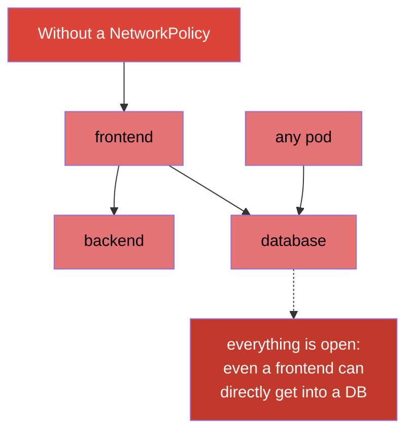
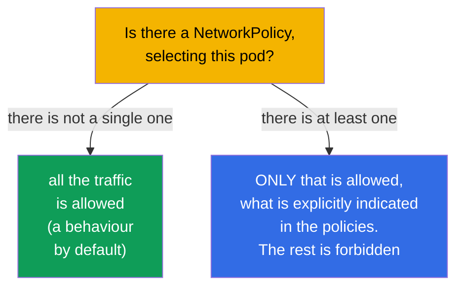
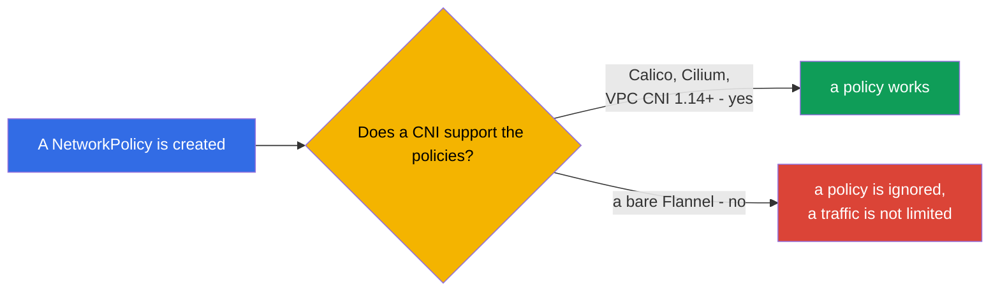
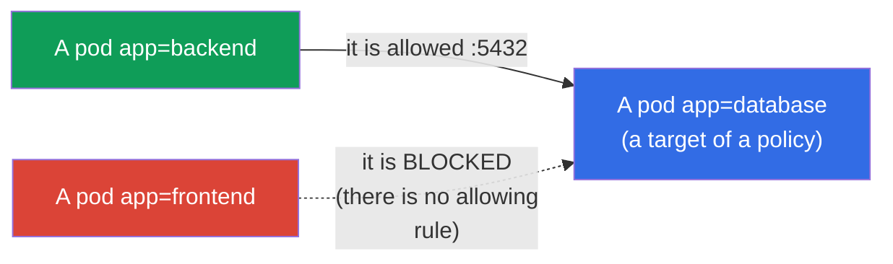
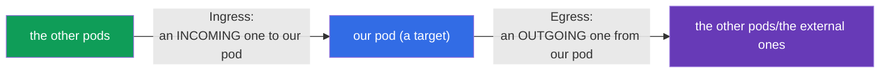
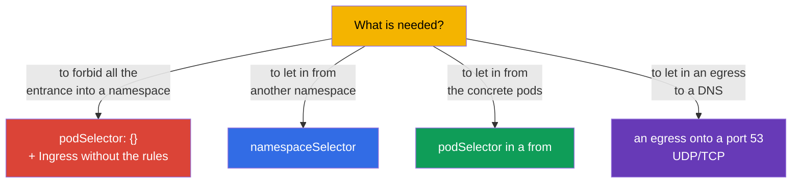

[Русская версия](ru.md) · [Versión en español](es.md) · [Version française](fr.md) · [Deutsche Version](de.md) · [ქართული ვერსია](ge.md) · [繁體中文版](tw.md) · [日本語版](jp.md)

# Chapter 34. NetworkPolicy

> **What comes next.** We are closing a part 7. By default in Kubernetes **any pod can communicate
> with any** (a flat network, the chapter 30). This is convenient, but insecure: a compromise of one
> pod opens an access to all of them. A **NetworkPolicy** is a "firewall of a level of the pods": the rules,
> who can communicate with whom. The theme is in the both exams (Services & Networking) and it is
> a base of a security of a network (it is deepened on the CKS). Let us consider a model, an allow logic and the typical
> patterns.

## 34.1. By default everything is allowed

A starting point, which has to be clearly realized: **without a NetworkPolicy all the traffic between
the pods is allowed** - any pod will reach any other one in a cluster.



A NetworkPolicy allows to limit this: for example, so that only a `backend` could go into a
`database`, but not a `frontend` and not the outside pods. This is an implementation of a principle of the least
privileges on a network level (a segmentation, a microsegmentation).

## 34.2. A key rule: the policies only allow

A most important principle, which distinguishes a NetworkPolicy from the habitual firewalls: **the rules
only allow (allow), there are no forbidding rules**. The logic is such:



- While **not a single** policy is aimed at a pod - everything is allowed to it.
- As soon as **at least one** policy appears, selecting a pod by a certain
  direction (Ingress/Egress), - **only that** is allowed, what is explicitly indicated
  in the policies, all the rest by this direction is blocked.

That is a NetworkPolicy works as a "white list": an addition of a policy switches a pod into a
mode "everything is forbidden, except of the enumerated".

## 34.3. An obligatory condition: a CNI with a support of the policies

As it was noted in the chapter 30, a **CNI plugin** applies a NetworkPolicy. If an installed CNI
does not support them (for example, a bare Flannel), an object NetworkPolicy will be created, but it **will
not act** - a traffic as it went, so it goes.



This is an insidious trap: you think, that you have closed a traffic, but it is open. They always check, that a CNI
is able to do a NetworkPolicy (Calico, Cilium - yes).

> **AWS VPC CNI: earlier no, now yes (with a reservation).** A default CNI in the EKS - an AWS VPC CNI -
> for a long time itself **did not apply** a NetworkPolicy: an object was created, but it did not act, and
> for a segmentation they put a Calico on top. Since a version VPC CNI **1.14** (2023) a
> **built-in** support of a NetworkPolicy has appeared, but it needs to be **explicitly enabled** (a parameter
> `enableNetworkPolicy: true` at an EKS addon or a variable `ENABLE_NETWORK_POLICY` at an
> `aws-node`). By a documentation of AWS for the standard and the admin policies a version VPC CNI
> **1.21.0+** is needed.
>
> The limitations of a native support (also from a documentation of AWS):
>
> - only the **Linux EC2 nodes** - not a Fargate and not a Windows;
> - the policies act for an **IPv4 or an IPv6**, but not for the both at once (the rules of a "not that"
>   version are ignored);
> - they are applied only to a **main interface of a pod** (`eth0`); at the chained plugins
>   (Multus) or at an IPv4 egress of the IPv6 pods the additional interfaces are not covered;
> - an enforcement is optimized for the pods under the controllers (there are the `ownerReferences` -
>   a Deployment, a StatefulSet and so on); for the "single" pods without a controller it can work
>   unstably.
>
> A conclusion for the EKS: the very fact "a default CNI = it does not support" is already incorrect - a support is there,
> but it has to be enabled and one has to keep in mind a version and the enumerated limitations.

## 34.4. A structure of a NetworkPolicy

A policy consists of: whom it selects (`podSelector`), for which direction
(`policyTypes`: Ingress/Egress) and what it allows (the `ingress`/`egress` rules).

```yaml
apiVersion: networking.k8s.io/v1
kind: NetworkPolicy
metadata:
  name: allow-backend-to-db
  namespace: prod
spec:
  podSelector:              # to which pods it is applied (a target of a policy)
    matchLabels:
      app: database
  policyTypes:
  - Ingress                # we regulate an incoming traffic to a database
  ingress:
  - from:                  # ALLOW an incoming one from...
    - podSelector:
        matchLabels:
          app: backend     # ...the pods with a label app=backend
    ports:
    - protocol: TCP
      port: 5432
```



Let us consider the parts:
- `podSelector` - **to which pods** a policy is applied (here - to a `database`);
- `policyTypes` - which directions we regulate (Ingress - an incoming one, Egress - an outgoing one);
- `from`/`to` - **to whom** we allow (by a podSelector, a namespaceSelector or an ipBlock);
- `ports` - on which ports.

## 34.5. An Ingress and an Egress

The two directions, which have not to be confused (this is about the very target pod):



- An **Ingress** - who can address **to** the selected pods.
- An **Egress** - where the selected pods can address **themselves**.

A subtlety: if one indicates `policyTypes: [Ingress]`, but does not set a single `ingress` rule
- this is a **ban of everything incoming** (there are no allowing rules = nothing is allowed). This
is used for a "default deny".

## 34.6. The typical patterns

Several templates, which one has to be able to write. Below there are the full manifests, each one with a link
onto an official documentation.

**1. A default deny of everything incoming into a namespace** (an empty `podSelector` = all the pods).
A doc: [Default deny all ingress traffic](https://kubernetes.io/docs/concepts/services-networking/network-policies/#default-deny-all-ingress-traffic).

```yaml
apiVersion: networking.k8s.io/v1
kind: NetworkPolicy
metadata:
  name: default-deny-ingress
  namespace: prod
spec:
  podSelector: {}          # all the pods of a namespace
  policyTypes:
  - Ingress                # nothing incoming is allowed → everything is blocked
```

**2. To allow a traffic from a certain namespace** (a `namespaceSelector`).
A doc: [Behavior of `to` and `from` selectors](https://kubernetes.io/docs/concepts/services-networking/network-policies/#behavior-of-to-and-from-selectors).

```yaml
apiVersion: networking.k8s.io/v1
kind: NetworkPolicy
metadata:
  name: allow-from-prod-ns
  namespace: prod
spec:
  podSelector:
    matchLabels:
      app: database        # a target - the pods of a database
  policyTypes:
  - Ingress
  ingress:
  - from:
    - namespaceSelector:
        matchLabels:
          env: prod        # to allow from the pods of a namespace with a label env=prod
    ports:
    - protocol: TCP
      port: 5432
```

**3. To allow a traffic from the concrete pods** (a `podSelector` in a `from`).
A doc: [Behavior of `to` and `from` selectors](https://kubernetes.io/docs/concepts/services-networking/network-policies/#behavior-of-to-and-from-selectors).

```yaml
apiVersion: networking.k8s.io/v1
kind: NetworkPolicy
metadata:
  name: allow-backend-to-db
  namespace: prod
spec:
  podSelector:
    matchLabels:
      app: database
  policyTypes:
  - Ingress
  ingress:
  - from:
    - podSelector:
        matchLabels:
          app: backend     # only the pods with a label app=backend
    ports:
    - protocol: TCP
      port: 5432
```

**4. To allow an egress only to a DNS** (a frequent pattern at a default-deny egress).
A doc: [Default deny all egress traffic](https://kubernetes.io/docs/concepts/services-networking/network-policies/#default-deny-all-egress-traffic)
(there is also a warning there, that a default-deny egress tears a DNS).

```yaml
apiVersion: networking.k8s.io/v1
kind: NetworkPolicy
metadata:
  name: allow-dns-egress
  namespace: prod
spec:
  podSelector: {}          # for all the pods of a namespace
  policyTypes:
  - Egress
  egress:
  - to:
    - namespaceSelector: {} # a DNS service lives in a kube-system
    ports:
    - protocol: UDP
      port: 53
    - protocol: TCP
      port: 53
```



> **A trap with a DNS.** If one introduces a default-deny **egress**, the pods will stop resolving the names
> (a DNS is also an egress to a CoreDNS onto a port 53). Therefore at a closing of an egress almost always
> they separately allow a traffic to a DNS - otherwise everything "breaks" inexplicably (the chapter 31).

## 34.7. A podSelector, a namespaceSelector, an ipBlock

The three sources/targets in the `from`/`to` rules:

| A selector | Whom it selects |
|----------|---------------|
| `podSelector` | the pods by the labels (in the same namespace, if a ns is not indicated) |
| `namespaceSelector` | all the pods in a namespace by the labels of a namespace |
| `ipBlock` | a range of the IP (for an external traffic, with the exceptions) |

A subtlety: a `podSelector` and a `namespaceSelector` in one element `from` (without a separation
by a hyphen) work as an **AND** (a pod AND in a needed namespace, AND with a needed label); as the separate
elements of a list - as an **OR**. This is a frequent source of the mistakes at a writing of the policies.

## 34.8. How this is applied in the production

- **A segmentation as a base of a security.** In a prod a NetworkPolicy implements a
  microsegmentation: a DB accepts only from its own backend, a payment service - only from the
  allowed ones, between the teams a traffic is closed. This limits a "horizontal
  spreading" of an attacker at a compromise of one pod.
- **A default-deny as a starting point.** A mature approach: in each namespace first a
  default-deny (an Ingress and an Egress), then the pinpoint allowances. So it is "closed by default",
  and not "open by default".
- **Not to forget a DNS and a service traffic.** At a default-deny egress they obligatorily allow a DNS
  (a port 53) and, if necessary, an access to an API server/to the metrics - otherwise the applications silently
  break. This is a most frequent mistake of an introduction of the policies.
- **A CNI with the policies is obligatory.** In a prod they choose a CNI, supporting a NetworkPolicy
  (Calico, Cilium). A Cilium gives also the L7 policies (by the HTTP paths/methods) on top of the standard
  L3/L4 ones.
- **A testing of the policies.** The policies are checked, that a needed traffic passes, and a superfluous one
  is blocked (by the test pods, `kubectl exec ... curl`). A mistake in a selector easily either
  will close everything, or will leave a hole.

## 34.9. A mini glossary

- **A NetworkPolicy** - the rules, which pod can communicate with which one (a firewall of a level of the pods).
- **An allow logic** - the policies only allow; there is no ban as a separate rule.
- **A podSelector** - to which pods a policy is applied / whom to allow.
- **The policyTypes** - the directions: an Ingress (an incoming one) and/or an Egress (an outgoing one).
- **A namespaceSelector** - a selection of the pods by the labels of a namespace.
- **An ipBlock** - an allowance by a range of the IP (an external traffic).
- **A default deny** - a policy, blocking everything by a direction (there are no allowing rules).
- **A microsegmentation** - a fine delimitation of a traffic between the pods/the services.

## 34.10. The summary of the chapter

- By default all the traffic between the pods is allowed; a NetworkPolicy allows to limit it
  (a segmentation).
- The policies work by an allow logic: while there is no policy - everything is open; at least
  one on a pod/a direction has appeared - only the explicitly indicated one is allowed.
- A CNI applies a NetworkPolicy; without a support (a bare Flannel) the policies do not act.
- A structure: a `podSelector` (a target), the `policyTypes` (Ingress/Egress), the `from`/`to` rules
  (podSelector/namespaceSelector/ipBlock) and the `ports`.
- An empty `podSelector: {}` + a direction without the rules = a default deny for all the pods of a
  namespace.
- At a default-deny egress they obligatorily allow a DNS (a port 53), otherwise everything breaks.
- A `podSelector` and a `namespaceSelector` in one element are an AND, by the separate elements are an OR.

## 34.11. How this will come in handy: on the exam and in the real work

**On the exam.** "Allow a traffic to a pod only from the certain pods/namespace",
"make a default deny", "why has a pod stopped going/resolving after a policy" - the typical
tasks. One needs confidently to write a podSelector/from/to/ports, to understand an allow logic and not
to forget about a DNS at the egress policies.

**In the real work.** A NetworkPolicy is a base instrument of a network security:
a microsegmentation limits a damage from a compromise. An approach "a default-deny + the pinpoint
allowances" is a standard of the mature clusters. An understanding of an allow logic and of a trap with a DNS
prevents both the holes in a security, and the mysterious breaks of a connection.

## 34.12. Self-check questions

1. Which traffic is allowed between the pods by default and what for to limit it?
2. Why do they say, that a NetworkPolicy works by an allow logic? What happens at an
   appearance of a first policy on a pod?
3. Why can a policy "not work" and what is needed for this from a CNI?
4. What do a `podSelector`, the `policyTypes` and the `from`/`to` rules set?
5. How to make a default-deny for everything incoming into a namespace?
6. Why does one need separately to allow a DNS at a closing of an egress?
7. What is a difference between a podSelector and a namespaceSelector in one element `from` and in
   the different ones?

## Practice

At this a part 7 (the services and a network) is finished. Further there is a part 8, an administrator one (CKA):
a device and an installation of a cluster, beginning with a kubeadm (the chapter 35). A NetworkPolicy is drilled
in the labs on a network and a security.

🧪 A lab 120 (incl. a drill on a NetworkPolicy): [tasks/cka/labs/120](../../labs/120/README.MD)

🎮 Killercoda (in a browser, no setup): [Deny All Ingress](https://killercoda.com/chadmcrowell/course/ckad/default-deny-networkpolicy) · [Allow Namespace Traffic](https://killercoda.com/chadmcrowell/course/ckad/allow-namespace-traffic) · [Allow Label-Based Traffic](https://killercoda.com/chadmcrowell/course/ckad/allow-label-traffic) · [Block All Egress](https://killercoda.com/chadmcrowell/course/ckad/block-egress)

---
[Contents](../README.md) · [Chapter 33](../33/README.md) · [Chapter 35](../35/README.md)
