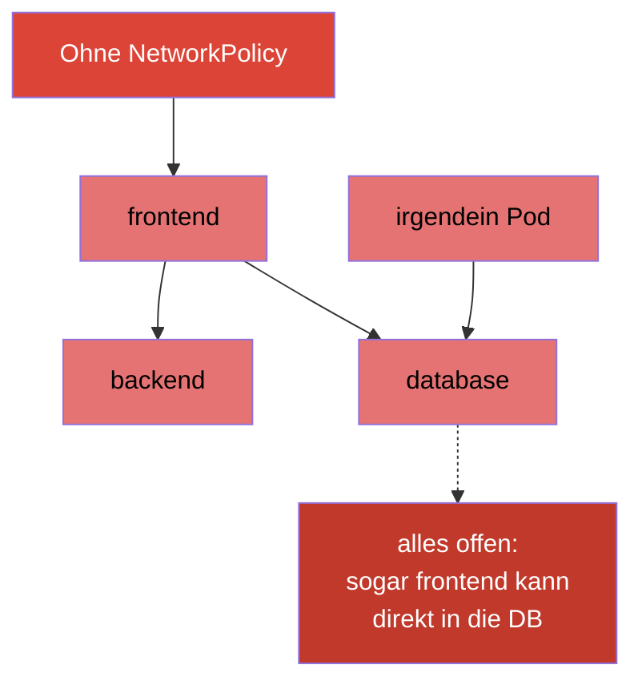
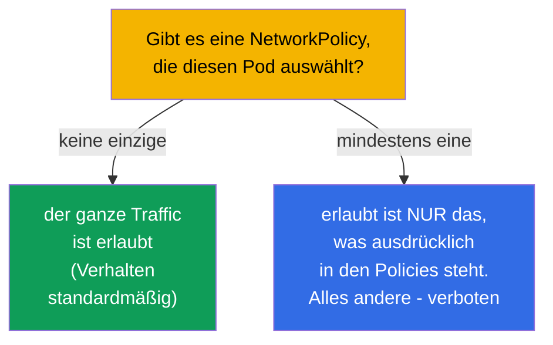
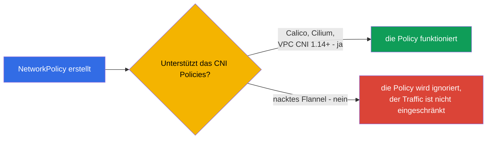
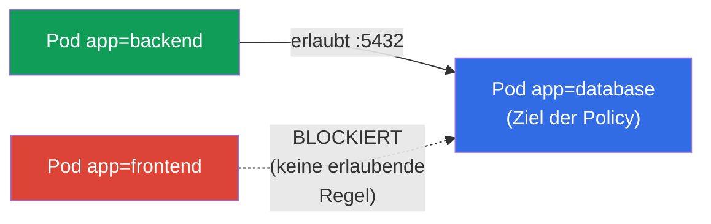
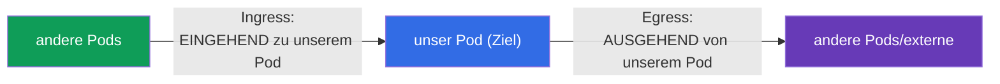
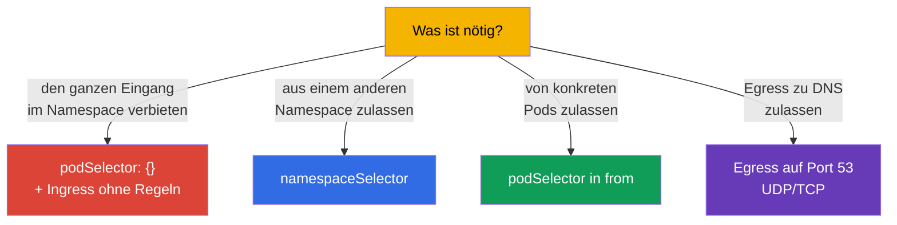

[Русская версия](ru.md) · [Eng version](README.md) · [Versión en español](es.md) · [Version française](fr.md) · [ქართული ვერსია](ge.md) · [繁體中文版](tw.md) · [日本語版](jp.md)

# Kapitel 34. NetworkPolicy

> **Was kommt.** Wir schließen Teil 7 ab. Standardmäßig kann in Kubernetes **jeder Pod mit
> jedem** kommunizieren (flaches Netz, Kapitel 30). Das ist bequem, aber unsicher: die
> Kompromittierung eines Pods öffnet den Zugang zu allen. **NetworkPolicy** ist eine
> „Firewall auf Pod-Ebene“: Regeln, wer mit wem kommunizieren darf. Das Thema ist in beiden
> Prüfungen enthalten (Services & Networking) und bildet die Basis der Netzsicherheit
> (vertieft wird es in CKS). Wir behandeln das Modell, die allow-Logik und die typischen
> Muster.

## 34.1. Standardmäßig ist alles erlaubt

Der Startpunkt, den man sich klar bewusst machen muss: **ohne NetworkPolicy ist der ganze
Traffic zwischen Pods erlaubt** - jeder Pod erreicht jeden anderen im Cluster.



NetworkPolicy erlaubt es, das einzuschränken: zum Beispiel, dass in `database` nur `backend`
gehen darf, aber nicht `frontend` und keine fremden Pods. Das ist die Umsetzung des Prinzips
der minimalen Rechte auf Netzebene (Segmentierung, Mikrosegmentierung).

## 34.2. Zentrale Regel: Policies erlauben nur

Das wichtigste Prinzip, das NetworkPolicy von gewohnten Firewalls unterscheidet: **Regeln
erlauben nur (allow), verbietende Regeln gibt es nicht**. Die Logik ist so:



- Solange auf einen Pod **keine einzige** Policy zielt, ist ihm alles erlaubt.
- Sobald **mindestens eine** Policy erscheint, die den Pod für eine bestimmte Richtung
  auswählt (Ingress/Egress), ist **nur das** erlaubt, was in den Policies ausdrücklich
  angegeben ist, alles Übrige in dieser Richtung wird blockiert.

Das heißt, NetworkPolicy funktioniert wie eine „Whitelist“: das Hinzufügen einer Policy
schaltet den Pod in den Modus „alles verboten außer dem Aufgezählten“.

## 34.3. Pflichtvoraussetzung: ein CNI mit Policy-Unterstützung

Wie in Kapitel 30 angemerkt, setzt NetworkPolicy das **CNI-Plugin** um. Wenn das
installierte CNI sie nicht unterstützt (zum Beispiel nacktes Flannel), wird das Objekt
NetworkPolicy erstellt, aber es **wird nicht wirken** - der Traffic fließt weiter wie
vorher.



Das ist eine tückische Falle: man denkt, man hat den Traffic zugemacht, dabei ist er offen.
Immer wird geprüft, dass das CNI NetworkPolicy beherrscht (Calico, Cilium - ja).

> **AWS VPC CNI: früher nein, jetzt ja (mit Vorbehalt).** Das Standard-CNI in EKS - AWS VPC
> CNI - hat lange NetworkPolicy selbst **nicht umgesetzt**: das Objekt wurde erstellt, wirkte
> aber nicht, und für die Segmentierung setzte man Calico darüber. Ab Version VPC CNI
> **1.14** (2023) gibt es eine **eingebaute** Unterstützung von NetworkPolicy, aber sie muss
> **ausdrücklich eingeschaltet** werden (Parameter `enableNetworkPolicy: true` beim
> EKS-Addon oder die Variable `ENABLE_NETWORK_POLICY` bei `aws-node`). Laut Dokumentation
> von AWS braucht man für Standard- und Admin-Policies die VPC-CNI-Version **1.21.0+**.
>
> Einschränkungen der nativen Unterstützung (ebenfalls aus der Dokumentation von AWS):
>
> - nur **Linux-EC2-Nodes** - nicht Fargate und nicht Windows;
> - Policies wirken für **IPv4 oder IPv6**, aber nicht für beide gleichzeitig (Regeln der
>   „falschen“ Version werden ignoriert);
> - sie werden nur auf das **Hauptinterface des Pods** (`eth0`) angewendet; bei
>   chained-Plugins (Multus) oder IPv4-Egress bei IPv6-Pods werden zusätzliche Interfaces
>   nicht abgedeckt;
> - das Enforcement ist für Pods unter Controllern optimiert (es gibt `ownerReferences` -
>   Deployment, StatefulSet und Ähnliches); für „einzelne“ Pods ohne Controller kann es
>   instabil arbeiten.
>
> Fazit für EKS: die Aussage „Standard-CNI = unterstützt nicht“ ist schon falsch - die
> Unterstützung existiert, aber man muss sie einschalten und die Version sowie die
> aufgezählten Einschränkungen im Kopf behalten.

## 34.4. Struktur einer NetworkPolicy

Eine Policy besteht aus: wen sie auswählt (`podSelector`), für welche Richtung
(`policyTypes`: Ingress/Egress) und was sie erlaubt (`ingress`/`egress`-Regeln).

```yaml
apiVersion: networking.k8s.io/v1
kind: NetworkPolicy
metadata:
  name: allow-backend-to-db
  namespace: prod
spec:
  podSelector:              # auf welche Pods sie angewendet wird (Ziel der Policy)
    matchLabels:
      app: database
  policyTypes:
  - Ingress                # wir regeln den eingehenden Traffic zu database
  ingress:
  - from:                  # ERLAUBEN eingehend von...
    - podSelector:
        matchLabels:
          app: backend     # ...Pods mit dem Label app=backend
    ports:
    - protocol: TCP
      port: 5432
```



Sehen wir die Teile durch:
- `podSelector` - **auf welche Pods** die Policy angewendet wird (hier - auf `database`);
- `policyTypes` - welche Richtungen wir regeln (Ingress - eingehend, Egress - ausgehend);
- `from`/`to` - **wem** wir erlauben (per podSelector, namespaceSelector oder ipBlock);
- `ports` - auf welchen Ports.

## 34.5. Ingress und Egress

Zwei Richtungen, die man nicht verwechseln darf (es geht um den Ziel-Pod selbst):



- **Ingress** - wer sich **an** die ausgewählten Pods wenden darf.
- **Egress** - wohin die ausgewählten Pods sich **selbst** wenden dürfen.

Feinheit: wenn man `policyTypes: [Ingress]` angibt, aber keine einzige `ingress`-Regel setzt
- ist das ein **Verbot des ganzen eingehenden Traffics** (keine erlaubenden Regeln = nichts
ist erlaubt). Das nutzt man für „default deny“.

## 34.6. Typische Muster

Einige Vorlagen, die man schreiben können muss. Unten - vollständige Manifeste, jedes mit
einem Link auf die offizielle Dokumentation.

**1. Default deny des ganzen eingehenden Traffics im Namespace** (leerer `podSelector` = alle
Pods).
Doku: [Default deny all ingress traffic](https://kubernetes.io/docs/concepts/services-networking/network-policies/#default-deny-all-ingress-traffic).

```yaml
apiVersion: networking.k8s.io/v1
kind: NetworkPolicy
metadata:
  name: default-deny-ingress
  namespace: prod
spec:
  podSelector: {}          # alle Pods des Namespace
  policyTypes:
  - Ingress                # eingehend ist nichts erlaubt → alles blockiert
```

**2. Traffic aus einem bestimmten Namespace erlauben** (`namespaceSelector`).
Doku: [Behavior of `to` and `from` selectors](https://kubernetes.io/docs/concepts/services-networking/network-policies/#behavior-of-to-and-from-selectors).

```yaml
apiVersion: networking.k8s.io/v1
kind: NetworkPolicy
metadata:
  name: allow-from-prod-ns
  namespace: prod
spec:
  podSelector:
    matchLabels:
      app: database        # Ziel - die Pods database
  policyTypes:
  - Ingress
  ingress:
  - from:
    - namespaceSelector:
        matchLabels:
          env: prod        # erlauben aus Pods des Namespace mit dem Label env=prod
    ports:
    - protocol: TCP
      port: 5432
```

**3. Traffic von konkreten Pods erlauben** (`podSelector` in `from`).
Doku: [Behavior of `to` and `from` selectors](https://kubernetes.io/docs/concepts/services-networking/network-policies/#behavior-of-to-and-from-selectors).

```yaml
apiVersion: networking.k8s.io/v1
kind: NetworkPolicy
metadata:
  name: allow-backend-to-db
  namespace: prod
spec:
  podSelector:
    matchLabels:
      app: database
  policyTypes:
  - Ingress
  ingress:
  - from:
    - podSelector:
        matchLabels:
          app: backend     # nur Pods mit dem Label app=backend
    ports:
    - protocol: TCP
      port: 5432
```

**4. Egress nur zu DNS erlauben** (häufiges Muster bei default-deny egress).
Doku: [Default deny all egress traffic](https://kubernetes.io/docs/concepts/services-networking/network-policies/#default-deny-all-egress-traffic)
(dort auch die Warnung, dass default-deny egress das DNS zerreißt).

```yaml
apiVersion: networking.k8s.io/v1
kind: NetworkPolicy
metadata:
  name: allow-dns-egress
  namespace: prod
spec:
  podSelector: {}          # für alle Pods des Namespace
  policyTypes:
  - Egress
  egress:
  - to:
    - namespaceSelector: {} # der DNS-Service lebt in kube-system
    ports:
    - protocol: UDP
      port: 53
    - protocol: TCP
      port: 53
```



> **Falle mit DNS.** Wenn man default-deny **egress** einführt, hören die Pods auf,
> Namen aufzulösen (DNS ist auch Egress zu CoreDNS auf Port 53). Deshalb erlaubt man beim Zumachen
> von Egress fast immer separat den Traffic zu DNS - sonst „bricht“ alles unerklärlich
> (Kapitel 31).

## 34.7. podSelector, namespaceSelector, ipBlock

Drei Quellen/Ziele in den Regeln `from`/`to`:

| Selektor | Wen er auswählt |
|----------|---------------|
| `podSelector` | Pods nach Labels (im gleichen Namespace, wenn kein ns angegeben ist) |
| `namespaceSelector` | alle Pods im Namespace nach den Labels des Namespace |
| `ipBlock` | IP-Bereich (für externen Traffic, mit Ausnahmen) |

Feinheit: `podSelector` und `namespaceSelector` in einem Element `from` (ohne Trennung durch
einen Bindestrich) wirken als **UND** (der Pod ist UND im nötigen Namespace UND mit dem
nötigen Label); als getrennte Elemente der Liste - als **ODER**. Das ist eine häufige
Fehlerquelle beim Schreiben von Policies.

## 34.8. Wie man das in der Produktion anwendet

- **Segmentierung als Basis der Sicherheit.** In der Produktion setzt NetworkPolicy die
  Mikrosegmentierung um: die DB nimmt nur von ihrem Backend an, der Zahlungsservice - nur von
  den erlaubten, zwischen den Teams ist der Traffic zu. Das begrenzt die „horizontale
  Ausbreitung“ eines Angreifers bei der Kompromittierung eines Pods.
- **Default-deny als Startpunkt.** Der ausgereifte Ansatz: in jedem Namespace zuerst
  default-deny (Ingress und Egress), dann punktuelle Erlaubnisse. So ist es „standardmäßig
  zu“ und nicht „standardmäßig offen“.
- **DNS und Service-Traffic nicht vergessen.** Bei default-deny egress erlaubt man
  zwingend DNS (Port 53) und, falls nötig, den Zugang zum API-Server/zu Metriken - sonst
  brechen die Anwendungen stillschweigend. Das ist der häufigste Fehler bei der Einführung
  von Policies.
- **Ein CNI mit Policies ist Pflicht.** In der Produktion wählt man ein CNI, das
  NetworkPolicy unterstützt (Calico, Cilium). Cilium gibt zusätzlich noch L7-Policies (nach
  HTTP-Pfaden/-Methoden) über die standardmäßigen L3/L4 hinaus.
- **Testen der Policies.** Man prüft bei Policies, dass der nötige Traffic durchgeht und der
  überflüssige blockiert wird (mit Test-Pods, `kubectl exec ... curl`). Ein Fehler im
  Selektor macht leicht entweder alles zu oder lässt ein Loch.

## 34.9. Mini-Glossar

- **NetworkPolicy** - Regeln, welcher Pod mit welchem kommunizieren darf (Firewall auf
  Pod-Ebene).
- **allow-Logik** - Policies erlauben nur; ein Verbot als eigene Regel gibt es nicht.
- **podSelector** - auf welche Pods die Policy angewendet wird / wen man erlaubt.
- **policyTypes** - Richtungen: Ingress (eingehend) und/oder Egress (ausgehend).
- **namespaceSelector** - Auswahl von Pods nach den Labels des Namespace.
- **ipBlock** - Erlaubnis nach IP-Bereich (externer Traffic).
- **default deny** - Policy, die alles in einer Richtung blockiert (keine erlaubenden Regeln).
- **Mikrosegmentierung** - feine Abgrenzung des Traffics zwischen Pods/Services.

## 34.10. Zusammenfassung des Kapitels

- Standardmäßig ist der ganze Traffic zwischen Pods erlaubt; NetworkPolicy erlaubt es, ihn
  einzuschränken (Segmentierung).
- Policies arbeiten nach der allow-Logik: solange es keine Policy gibt - ist alles offen;
  erscheint mindestens eine für Pod/Richtung - ist nur das ausdrücklich Angegebene erlaubt.
- NetworkPolicy setzt das CNI um; ohne Unterstützung (nacktes Flannel) wirken die Policies
  nicht.
- Struktur: `podSelector` (Ziel), `policyTypes` (Ingress/Egress), Regeln `from`/`to`
  (podSelector/namespaceSelector/ipBlock) und `ports`.
- Leerer `podSelector: {}` + Richtung ohne Regeln = default deny für alle Pods des
  Namespace.
- Bei default-deny egress erlaubt man zwingend DNS (Port 53), sonst bricht alles.
- `podSelector` und `namespaceSelector` in einem Element - UND, als getrennte Elemente -
  ODER.

## 34.11. Wofür das nützlich ist: in der Prüfung und in der echten Arbeit

**In der Prüfung.** „Erlaube den Traffic zu einem Pod nur von bestimmten Pods/Namespaces“,
„mache ein default deny“, „warum geht/resolvt ein Pod nach der Policy nicht mehr“ - typische
Aufgaben. Man muss sicher podSelector/from/to/ports schreiben, die allow-Logik verstehen und
bei Egress-Policies das DNS nicht vergessen.

**In der echten Arbeit.** NetworkPolicy ist das Basiswerkzeug der Netzsicherheit: die
Mikrosegmentierung begrenzt den Schaden aus einer Kompromittierung. Der Ansatz „default-deny
+ punktuelle Erlaubnisse“ ist der Standard ausgereifter Cluster. Das Verständnis der
allow-Logik und der Falle mit DNS verhindert sowohl Löcher in der Sicherheit als auch
rätselhafte Verbindungsabbrüche.

## 34.12. Fragen zur Selbstüberprüfung

1. Welcher Traffic ist zwischen Pods standardmäßig erlaubt und wozu sollte man ihn
   einschränken?
2. Warum sagt man, dass NetworkPolicy nach der allow-Logik arbeitet? Was passiert beim
   Erscheinen der ersten Policy für einen Pod?
3. Warum kann eine Policy „nicht funktionieren“ und was ist dafür vom CNI nötig?
4. Was legen `podSelector`, `policyTypes` und die Regeln `from`/`to` fest?
5. Wie macht man ein default-deny für den ganzen eingehenden Traffic im Namespace?
6. Warum muss man beim Zumachen von Egress das DNS separat erlauben?
7. Worin besteht der Unterschied zwischen podSelector und namespaceSelector in einem Element
   `from` und in verschiedenen?

## Praxis

Damit ist Teil 7 (Services und Netz) abgeschlossen. Weiter - Teil 8, der administrative
(CKA): Aufbau und Installation des Clusters, beginnend mit kubeadm (Kapitel 35).
NetworkPolicy wird in den Labs zu Netz und Sicherheit geübt.

🧪 Lab 120 (u. a. Drill zu NetworkPolicy): [tasks/cka/labs/120](../../labs/120/README_DE.MD)

🎮 Killercoda (im Browser, ohne Installation): [Deny All Ingress](https://killercoda.com/chadmcrowell/course/ckad/default-deny-networkpolicy) · [Allow Namespace Traffic](https://killercoda.com/chadmcrowell/course/ckad/allow-namespace-traffic) · [Allow Label-Based Traffic](https://killercoda.com/chadmcrowell/course/ckad/allow-label-traffic) · [Block All Egress](https://killercoda.com/chadmcrowell/course/ckad/block-egress)

---
[Inhalt](../README_DE.md) · [Kapitel 33](../33/de.md) · [Kapitel 35](../35/de.md)
