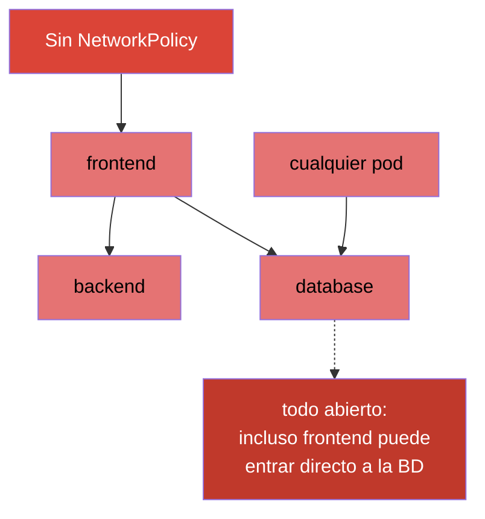
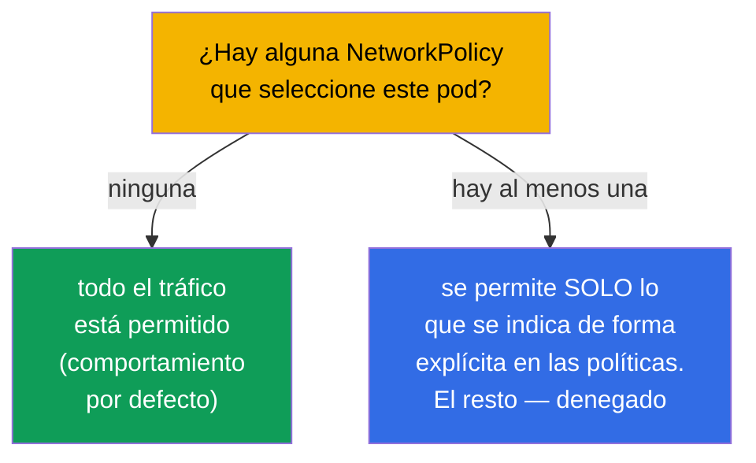
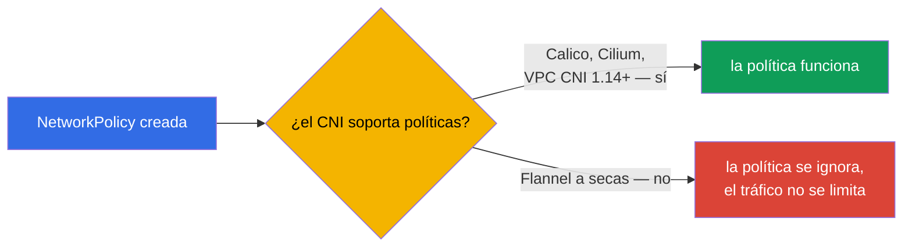
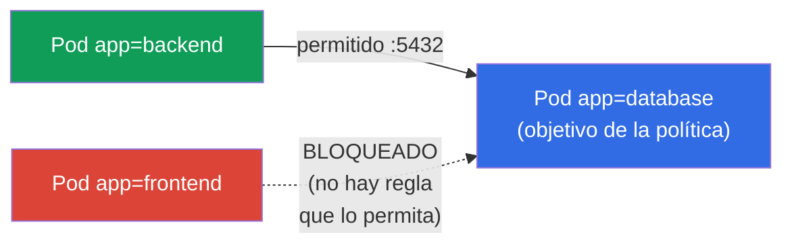
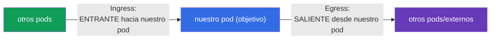
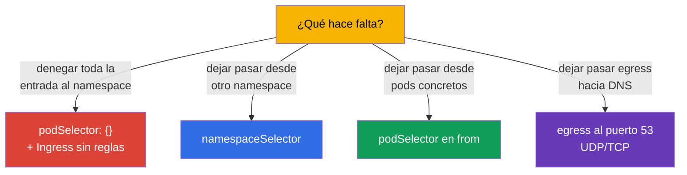

[Русская версия](ru.md) · [Eng version](README.md) · [Version française](fr.md) · [Deutsche Version](de.md) · [ქართული ვერსია](ge.md)

# Capítulo 34. NetworkPolicy

> **Qué viene ahora.** Cerramos la parte 7. Por defecto, en Kubernetes **cualquier pod puede hablar
> con cualquier otro** (red plana, capítulo 30). Es cómodo, pero poco seguro: comprometer un solo
> pod abre el acceso a todos. **NetworkPolicy** es el «firewall a nivel de pods»: reglas sobre
> quién puede hablar con quién. El tema está en ambos exámenes (Services & Networking) y es la
> base de la seguridad de red (se profundiza en el CKS). Veremos el modelo, la lógica de allow y
> los patrones típicos.

## 34.1. Por defecto todo está permitido

El punto de partida que hay que tener muy claro: **sin NetworkPolicy todo el tráfico entre pods
está permitido** - cualquier pod alcanza a cualquier otro del clúster.



NetworkPolicy permite limitarlo: por ejemplo, que a `database` solo pueda ir `backend`, pero no
`frontend` ni pods ajenos. Es la aplicación del principio de mínimo privilegio a nivel de red
(segmentación, microsegmentación).

## 34.2. Regla clave: las políticas solo permiten

El principio más importante, el que distingue NetworkPolicy de los firewalls habituales: **las
reglas solo permiten (allow), no existen reglas de denegación**. La lógica es esta:



- Mientras **ninguna** política apunte al pod - todo le está permitido.
- En cuanto aparece **al menos una** política que selecciona el pod en una dirección concreta
  (Ingress/Egress), se permite **solo aquello** que las políticas indican de forma explícita; todo
  lo demás en esa dirección queda bloqueado.

Es decir, NetworkPolicy funciona como una «lista blanca»: añadir una política pasa el pod al
modo «prohibido todo salvo lo enumerado».

## 34.3. Condición obligatoria: un CNI con soporte de políticas

Como se señalaba en el capítulo 30, NetworkPolicy la aplica el **plugin CNI**. Si el CNI instalado
no las soporta (por ejemplo, Flannel a secas), el objeto NetworkPolicy se creará, pero **no
tendrá efecto** - el tráfico sigue circulando igual.



Es una trampa traicionera: crees que has cerrado el tráfico y está abierto. Siempre se comprueba
que el CNI sepa manejar NetworkPolicy (Calico, Cilium - sí).

> **AWS VPC CNI: antes no, ahora sí (con matices).** El CNI por defecto en EKS - AWS VPC CNI -
> durante mucho tiempo **no aplicaba** por sí mismo NetworkPolicy: el objeto se creaba pero no
> tenía efecto, y para segmentar se instalaba Calico por encima. Desde la versión de VPC CNI
> **1.14** (2023) existe soporte **nativo** de NetworkPolicy, pero hay que **activarlo de forma
> explícita** (parámetro `enableNetworkPolicy: true` del addon de EKS o la variable
> `ENABLE_NETWORK_POLICY` en `aws-node`). Según la documentación de AWS, para las políticas
> estándar y de admin se necesita la versión de VPC CNI **1.21.0+**.
>
> Limitaciones del soporte nativo (también de la documentación de AWS):
>
> - solo **nodos EC2 con Linux** - ni Fargate ni Windows;
> - las políticas actúan para **IPv4 o IPv6**, pero no para ambos a la vez (las reglas de la
>   versión «que no toca» se ignoran);
> - se aplican solo a la **interfaz principal del pod** (`eth0`); con plugins encadenados
>   (Multus) o egress IPv4 en pods IPv6, las interfaces adicionales no quedan cubiertas;
> - el enforcement está optimizado para pods bajo controladores (tienen `ownerReferences` -
>   Deployment, StatefulSet, etc.); para pods «sueltos» sin controlador puede funcionar de forma
>   inestable.
>
> Conclusión para EKS: el propio hecho de «CNI por defecto = no soporta» ya es incorrecto - el
> soporte existe, pero hay que activarlo y tener en mente la versión y las limitaciones listadas.

## 34.4. Estructura de una NetworkPolicy

Una política consta de: a quién selecciona (`podSelector`), para qué dirección (`policyTypes`:
Ingress/Egress) y qué permite (reglas `ingress`/`egress`).

```yaml
apiVersion: networking.k8s.io/v1
kind: NetworkPolicy
metadata:
  name: allow-backend-to-db
  namespace: prod
spec:
  podSelector:              # a qué pods se aplica (objetivo de la política)
    matchLabels:
      app: database
  policyTypes:
  - Ingress                # regulamos el tráfico entrante hacia database
  ingress:
  - from:                  # PERMITIR el entrante desde...
    - podSelector:
        matchLabels:
          app: backend     # ...pods con la etiqueta app=backend
    ports:
    - protocol: TCP
      port: 5432
```



Veamos las partes:
- `podSelector` - **a qué pods** se aplica la política (aquí - a `database`);
- `policyTypes` - qué direcciones regulamos (Ingress - entrante, Egress - saliente);
- `from`/`to` - **a quién** permitimos (por podSelector, namespaceSelector o ipBlock);
- `ports` - en qué puertos.

## 34.5. Ingress y Egress

Dos direcciones que no hay que confundir (van referidas al propio pod objetivo):



- **Ingress** - quién puede dirigirse **a** los pods seleccionados.
- **Egress** - a dónde pueden dirigirse **ellos mismos** los pods seleccionados.

Un matiz: si indicas `policyTypes: [Ingress]` pero no defines ninguna regla `ingress`, eso es una
**denegación de todo lo entrante** (no hay reglas que permitan = nada está permitido). Se usa para
el «default deny».

## 34.6. Patrones típicos

Unas cuantas plantillas que hay que saber escribir. Abajo - manifiestos completos, cada uno con
enlace a la documentación oficial.

**1. Default deny de todo lo entrante en un namespace** (`podSelector` vacío = todos los pods).
Doc: [Default deny all ingress traffic](https://kubernetes.io/docs/concepts/services-networking/network-policies/#default-deny-all-ingress-traffic).

```yaml
apiVersion: networking.k8s.io/v1
kind: NetworkPolicy
metadata:
  name: default-deny-ingress
  namespace: prod
spec:
  podSelector: {}          # todos los pods del namespace
  policyTypes:
  - Ingress                # no se permite nada entrante → todo bloqueado
```

**2. Permitir tráfico desde un namespace concreto** (`namespaceSelector`).
Doc: [Behavior of `to` and `from` selectors](https://kubernetes.io/docs/concepts/services-networking/network-policies/#behavior-of-to-and-from-selectors).

```yaml
apiVersion: networking.k8s.io/v1
kind: NetworkPolicy
metadata:
  name: allow-from-prod-ns
  namespace: prod
spec:
  podSelector:
    matchLabels:
      app: database        # objetivo — los pods database
  policyTypes:
  - Ingress
  ingress:
  - from:
    - namespaceSelector:
        matchLabels:
          env: prod        # permitir desde los pods del namespace con la etiqueta env=prod
    ports:
    - protocol: TCP
      port: 5432
```

**3. Permitir tráfico desde pods concretos** (`podSelector` en `from`).
Doc: [Behavior of `to` and `from` selectors](https://kubernetes.io/docs/concepts/services-networking/network-policies/#behavior-of-to-and-from-selectors).

```yaml
apiVersion: networking.k8s.io/v1
kind: NetworkPolicy
metadata:
  name: allow-backend-to-db
  namespace: prod
spec:
  podSelector:
    matchLabels:
      app: database
  policyTypes:
  - Ingress
  ingress:
  - from:
    - podSelector:
        matchLabels:
          app: backend     # solo los pods con la etiqueta app=backend
    ports:
    - protocol: TCP
      port: 5432
```

**4. Permitir egress solo hacia DNS** (patrón frecuente con default-deny egress).
Doc: [Default deny all egress traffic](https://kubernetes.io/docs/concepts/services-networking/network-policies/#default-deny-all-egress-traffic)
(allí mismo está la advertencia de que el default-deny egress rompe el DNS).

```yaml
apiVersion: networking.k8s.io/v1
kind: NetworkPolicy
metadata:
  name: allow-dns-egress
  namespace: prod
spec:
  podSelector: {}          # para todos los pods del namespace
  policyTypes:
  - Egress
  egress:
  - to:
    - namespaceSelector: {} # el servicio DNS vive en kube-system
    ports:
    - protocol: UDP
      port: 53
    - protocol: TCP
      port: 53
```



> **La trampa del DNS.** Si introduces un default-deny de **egress**, los pods dejarán de resolver nombres
> (el DNS también es egress hacia CoreDNS en el puerto 53). Por eso, al cerrar el egress casi siempre
> se permite aparte el tráfico hacia el DNS - si no, todo «se rompe» sin explicación (capítulo 31).

## 34.7. podSelector, namespaceSelector, ipBlock

Tres orígenes/destinos en las reglas `from`/`to`:

| Selector | A quién selecciona |
|----------|---------------|
| `podSelector` | pods por etiquetas (en el mismo namespace, si no se indica ns) |
| `namespaceSelector` | todos los pods del namespace, por las etiquetas del namespace |
| `ipBlock` | rango de IP (para tráfico externo, con excepciones) |

Un matiz: `podSelector` y `namespaceSelector` dentro de un mismo elemento de `from` (sin separarlos con
guion) funcionan como **Y** (el pod Y en el namespace requerido, Y con la etiqueta requerida); como
elementos separados de la lista - como **O**. Es una fuente frecuente de errores al escribir políticas.

## 34.8. Cómo se aplica esto en producción

- **La segmentación como base de la seguridad.** En producción NetworkPolicy implementa la
  microsegmentación: la BD acepta solo desde su propio backend, el servicio de pagos - solo desde
  los permitidos, entre equipos el tráfico está cerrado. Eso limita la «propagación horizontal»
  del atacante cuando se compromete un pod.
- **Default-deny como punto de partida.** El enfoque maduro: en cada namespace primero
  default-deny (Ingress y Egress) y después permisos puntuales. Así queda «cerrado por defecto»
  y no «abierto por defecto».
- **No olvidar el DNS ni el tráfico de servicio.** Con default-deny egress se permite
  obligatoriamente el DNS (puerto 53) y, si hace falta, el acceso al API server o a las métricas -
  si no, las aplicaciones se rompen en silencio. Es el error más frecuente al implantar políticas.
- **Un CNI con políticas es obligatorio.** En producción se elige un CNI que soporte NetworkPolicy
  (Calico, Cilium). Cilium da además políticas L7 (por rutas/métodos HTTP) por encima de las
  L3/L4 estándar.
- **Pruebas de las políticas.** Las políticas se comprueban viendo que el tráfico necesario pasa y
  el de más se bloquea (con pods de prueba, `kubectl exec ... curl`). Un error en el selector
  fácilmente cierra todo o deja un agujero.

## 34.9. Mini-glosario

- **NetworkPolicy** - reglas de qué pod puede hablar con cuál (firewall a nivel de pods).
- **lógica de allow** - las políticas solo permiten; la denegación como regla aparte no existe.
- **podSelector** - a qué pods se aplica la política / a quién permitir.
- **policyTypes** - direcciones: Ingress (entrante) y/o Egress (saliente).
- **namespaceSelector** - selección de pods por las etiquetas del namespace.
- **ipBlock** - permiso por rango de IP (tráfico externo).
- **default deny** - política que bloquea todo en una dirección (no hay reglas que permitan).
- **microsegmentación** - delimitación fina del tráfico entre pods/servicios.

## 34.10. Resumen del capítulo

- Por defecto todo el tráfico entre pods está permitido; NetworkPolicy permite limitarlo
  (segmentación).
- Las políticas funcionan con lógica de allow: mientras no hay política - todo abierto; en cuanto
  aparece al menos una para el pod/dirección - se permite solo lo indicado explícitamente.
- NetworkPolicy la aplica el CNI; sin soporte (Flannel a secas) las políticas no tienen efecto.
- Estructura: `podSelector` (objetivo), `policyTypes` (Ingress/Egress), reglas `from`/`to`
  (podSelector/namespaceSelector/ipBlock) y `ports`.
- Un `podSelector: {}` vacío + una dirección sin reglas = default deny para todos los pods del
  namespace.
- Con default-deny egress se permite obligatoriamente el DNS (puerto 53); si no, todo se rompe.
- `podSelector` y `namespaceSelector` en un mismo elemento - Y; como elementos separados - O.

## 34.11. Para qué te servirá: en el examen y en el trabajo real

**En el examen.** «Permite el tráfico hacia un pod solo desde ciertos pods/namespace», «haz un
default deny», «por qué el pod dejó de conectar/resolver después de la política» - son tareas
típicas. Hay que escribir con soltura podSelector/from/to/ports, entender la lógica de allow y no
olvidar el DNS en las políticas de egress.

**En el trabajo real.** NetworkPolicy es la herramienta básica de seguridad de red: la
microsegmentación limita el daño de un compromiso. El enfoque «default-deny + permisos puntuales»
es el estándar de los clústeres maduros. Entender la lógica de allow y la trampa del DNS previene
tanto los agujeros de seguridad como los cortes de conectividad misteriosos.

## 34.12. Preguntas de autoevaluación

1. ¿Qué tráfico está permitido entre pods por defecto y para qué limitarlo?
2. ¿Por qué se dice que NetworkPolicy funciona con lógica de allow? ¿Qué ocurre cuando aparece la
   primera política sobre un pod?
3. ¿Por qué una política puede «no funcionar» y qué se necesita del CNI para ello?
4. ¿Qué definen `podSelector`, `policyTypes` y las reglas `from`/`to`?
5. ¿Cómo hacer un default-deny de todo lo entrante en un namespace?
6. ¿Por qué al cerrar el egress hay que permitir el DNS aparte?
7. ¿Cuál es la diferencia entre podSelector y namespaceSelector dentro de un mismo elemento de
   `from` y en elementos distintos?

## Práctica

Con esto queda terminada la parte 7 (servicios y red). A continuación - la parte 8, la de
administración (CKA): la estructura y la instalación del clúster, empezando por kubeadm (capítulo
35). NetworkPolicy se practica en los laboratorios de red y seguridad.

🧪 Laboratorio 120 (incluido el drill de NetworkPolicy): [tasks/cka/labs/120](../../labs/120/README_ES.MD)

---
[Índice](../README_ES.md) · [Capítulo 33](../33/es.md) · [Capítulo 35](../35/es.md)
