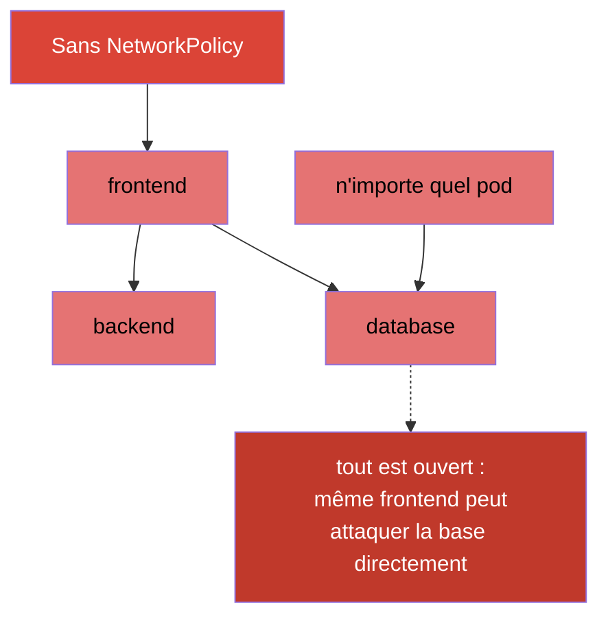
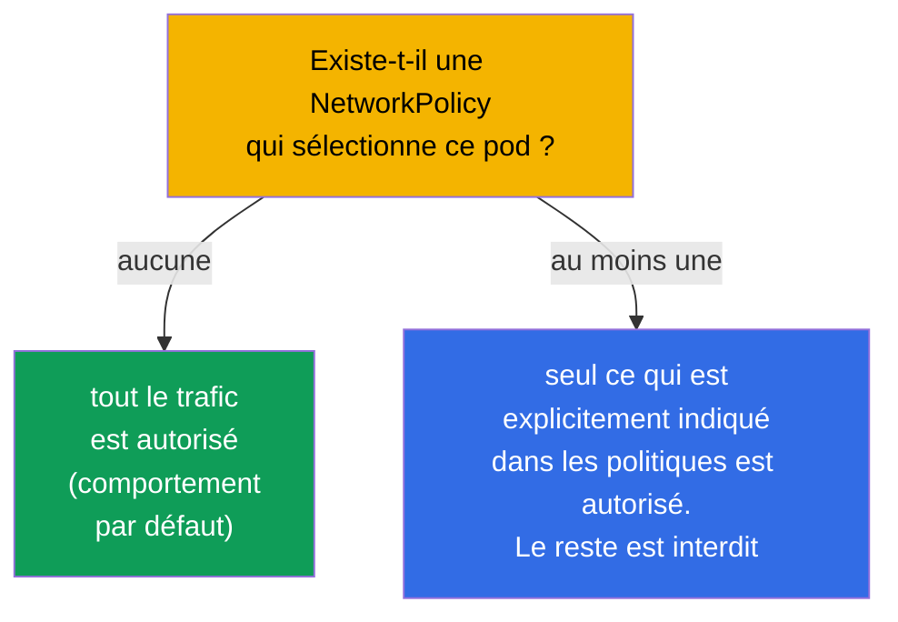
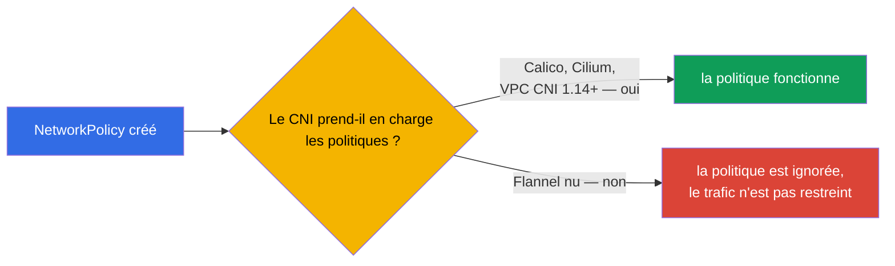
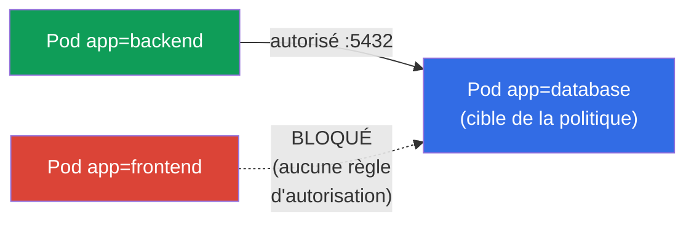
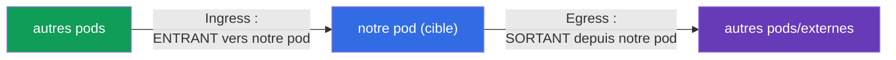
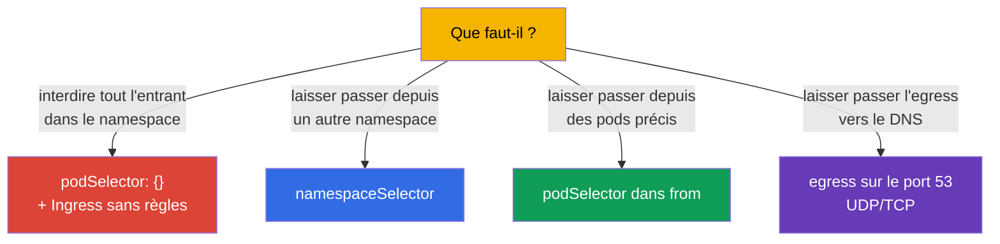

[Русская версия](ru.md) · [Eng version](README.md) · [Versión en español](es.md) · [Deutsche Version](de.md) · [ქართული ვერსია](ge.md) · [繁體中文版](tw.md) · [日本語版](jp.md)

# Chapitre 34. NetworkPolicy

> **Ce qui suit.** Nous refermons la partie 7. Par défaut, dans Kubernetes, **n'importe quel pod
> peut communiquer avec n'importe quel autre** (réseau plat, chapitre 30). C'est pratique, mais
> peu sûr : la compromission d'un seul pod ouvre l'accès à tous. **NetworkPolicy** est le
> « pare-feu au niveau des pods » : des règles qui disent qui peut parler à qui. Le sujet est
> présent aux deux examens (Services & Networking) et constitue la base de la sécurité réseau
> (approfondie au CKS). Voyons le modèle, la logique d'autorisation et les patterns courants.

## 34.1. Par défaut, tout est autorisé

Le point de départ, qu'il faut bien avoir en tête : **sans NetworkPolicy, tout le trafic entre
les pods est autorisé** - n'importe quel pod peut joindre n'importe quel autre dans le cluster.



NetworkPolicy permet de restreindre cela : par exemple, pour que seul `backend` puisse joindre
`database`, mais pas `frontend` ni des pods étrangers. C'est la mise en œuvre du principe du
moindre privilège au niveau réseau (segmentation, microsegmentation).

## 34.2. La règle clé : les politiques ne font qu'autoriser

Le principe essentiel qui distingue NetworkPolicy des pare-feux habituels : **les règles ne font
qu'autoriser (allow), il n'existe pas de règles d'interdiction**. La logique est la suivante :



- Tant qu'**aucune** politique ne cible un pod, tout lui est autorisé.
- Dès qu'apparaît **au moins une** politique qui sélectionne le pod pour une direction donnée
  (Ingress/Egress), **seul ce qui** est explicitement indiqué dans les politiques est autorisé,
  tout le reste dans cette direction est bloqué.

Autrement dit, NetworkPolicy fonctionne comme une « liste blanche » : ajouter une politique fait
passer le pod en mode « tout est interdit sauf ce qui est énuméré ».

## 34.3. Condition obligatoire : un CNI qui prend en charge les politiques

Comme indiqué au chapitre 30, ce sont les **plugins CNI** qui appliquent les NetworkPolicy. Si le
CNI installé ne les prend pas en charge (par exemple Flannel nu), l'objet NetworkPolicy sera créé
mais **n'aura aucun effet** - le trafic continuera de passer comme avant.



C'est un piège sournois : on croit avoir fermé le trafic alors qu'il est ouvert. On vérifie
toujours que le CNI sait faire du NetworkPolicy (Calico, Cilium - oui).

> **AWS VPC CNI : non avant, oui maintenant (avec une réserve).** Le CNI par défaut d'EKS - AWS VPC
> CNI - **n'appliquait pas** lui-même les NetworkPolicy pendant longtemps : l'objet était créé mais
> restait sans effet, et pour la segmentation on installait Calico par-dessus. Depuis la version VPC
> CNI **1.14** (2023), une prise en charge **intégrée** des NetworkPolicy existe, mais il faut
> l'activer **explicitement** (paramètre `enableNetworkPolicy: true` de l'add-on EKS, ou variable
> `ENABLE_NETWORK_POLICY` sur `aws-node`). D'après la documentation AWS, les politiques standard et
> admin nécessitent la version VPC CNI **1.21.0+**.
>
> Limites de la prise en charge native (également d'après la documentation AWS) :
>
> - uniquement les **nœuds EC2 Linux** - ni Fargate, ni Windows ;
> - les politiques s'appliquent en **IPv4 ou IPv6**, mais pas aux deux à la fois (les règles de la
>   « mauvaise » version sont ignorées) ;
> - elles ne s'appliquent qu'à l'**interface principale du pod** (`eth0`) ; avec des plugins chaînés
>   (Multus) ou de l'egress IPv4 pour des pods IPv6, les interfaces supplémentaires ne sont pas
>   couvertes ;
> - l'enforcement est optimisé pour les pods gérés par des contrôleurs (présence d'`ownerReferences` -
>   Deployment, StatefulSet, etc.) ; pour des pods « isolés » sans contrôleur, cela peut être
>   instable.
>
> Conclusion pour EKS : l'affirmation « le CNI par défaut ne prend pas en charge » est désormais
> fausse - la prise en charge existe, mais il faut l'activer et garder en tête la version ainsi que
> les limites énumérées.

## 34.4. Structure d'une NetworkPolicy

Une politique se compose de : qui elle sélectionne (`podSelector`), pour quelle direction
(`policyTypes` : Ingress/Egress) et ce qu'elle autorise (règles `ingress`/`egress`).

```yaml
apiVersion: networking.k8s.io/v1
kind: NetworkPolicy
metadata:
  name: allow-backend-to-db
  namespace: prod
spec:
  podSelector:              # à quels pods elle s'applique (cible de la politique)
    matchLabels:
      app: database
  policyTypes:
  - Ingress                # on régule le trafic entrant vers database
  ingress:
  - from:                  # AUTORISER l'entrant venant de...
    - podSelector:
        matchLabels:
          app: backend     # ...pods portant le label app=backend
    ports:
    - protocol: TCP
      port: 5432
```



Détaillons les parties :
- `podSelector` - **à quels pods** la politique s'applique (ici, à `database`) ;
- `policyTypes` - quelles directions on régule (Ingress - entrant, Egress - sortant) ;
- `from`/`to` - **à qui** on autorise (par podSelector, namespaceSelector ou ipBlock) ;
- `ports` - sur quels ports.

## 34.5. Ingress et Egress

Deux directions qu'il ne faut pas confondre (elles se rapportent au pod-cible lui-même) :



- **Ingress** - qui peut s'adresser **aux** pods sélectionnés.
- **Egress** - où les pods sélectionnés peuvent s'adresser **eux-mêmes**.

Subtilité : si l'on indique `policyTypes: [Ingress]` sans définir aucune règle `ingress`, cela
équivaut à **interdire tout l'entrant** (aucune règle d'autorisation = rien n'est autorisé). C'est
ce qu'on utilise pour le « default deny ».

## 34.6. Patterns courants

Quelques modèles qu'il faut savoir écrire. Ci-dessous, des manifestes complets, chacun avec un lien
vers la documentation officielle.

**1. Default deny de tout l'entrant dans un namespace** (`podSelector` vide = tous les pods).
Doc : [Default deny all ingress traffic](https://kubernetes.io/docs/concepts/services-networking/network-policies/#default-deny-all-ingress-traffic).

```yaml
apiVersion: networking.k8s.io/v1
kind: NetworkPolicy
metadata:
  name: default-deny-ingress
  namespace: prod
spec:
  podSelector: {}          # tous les pods du namespace
  policyTypes:
  - Ingress                # rien n'est autorisé en entrant → tout est bloqué
```

**2. Autoriser le trafic depuis un namespace donné** (`namespaceSelector`).
Doc : [Behavior of `to` and `from` selectors](https://kubernetes.io/docs/concepts/services-networking/network-policies/#behavior-of-to-and-from-selectors).

```yaml
apiVersion: networking.k8s.io/v1
kind: NetworkPolicy
metadata:
  name: allow-from-prod-ns
  namespace: prod
spec:
  podSelector:
    matchLabels:
      app: database        # cible — les pods database
  policyTypes:
  - Ingress
  ingress:
  - from:
    - namespaceSelector:
        matchLabels:
          env: prod        # autoriser depuis les pods du namespace portant le label env=prod
    ports:
    - protocol: TCP
      port: 5432
```

**3. Autoriser le trafic depuis des pods précis** (`podSelector` dans `from`).
Doc : [Behavior of `to` and `from` selectors](https://kubernetes.io/docs/concepts/services-networking/network-policies/#behavior-of-to-and-from-selectors).

```yaml
apiVersion: networking.k8s.io/v1
kind: NetworkPolicy
metadata:
  name: allow-backend-to-db
  namespace: prod
spec:
  podSelector:
    matchLabels:
      app: database
  policyTypes:
  - Ingress
  ingress:
  - from:
    - podSelector:
        matchLabels:
          app: backend     # uniquement les pods portant le label app=backend
    ports:
    - protocol: TCP
      port: 5432
```

**4. Autoriser l'egress uniquement vers le DNS** (pattern fréquent avec un default-deny egress).
Doc : [Default deny all egress traffic](https://kubernetes.io/docs/concepts/services-networking/network-policies/#default-deny-all-egress-traffic)
(on y trouve aussi l'avertissement selon lequel un default-deny egress casse le DNS).

```yaml
apiVersion: networking.k8s.io/v1
kind: NetworkPolicy
metadata:
  name: allow-dns-egress
  namespace: prod
spec:
  podSelector: {}          # pour tous les pods du namespace
  policyTypes:
  - Egress
  egress:
  - to:
    - namespaceSelector: {} # le service DNS vit dans kube-system
    ports:
    - protocol: UDP
      port: 53
    - protocol: TCP
      port: 53
```



> **Le piège du DNS.** Si l'on met en place un default-deny **egress**, les pods cessent de résoudre
> les noms (le DNS est aussi de l'egress vers CoreDNS sur le port 53). C'est pourquoi, en fermant
> l'egress, on autorise presque toujours à part le trafic vers le DNS - sinon tout « casse » de
> façon inexplicable (chapitre 31).

## 34.7. podSelector, namespaceSelector, ipBlock

Trois sources/cibles dans les règles `from`/`to` :

| Sélecteur | Qui il sélectionne |
|----------|---------------|
| `podSelector` | les pods par labels (dans le même namespace, si aucun ns n'est indiqué) |
| `namespaceSelector` | tous les pods d'un namespace, par labels du namespace |
| `ipBlock` | une plage d'IP (pour le trafic externe, avec des exceptions) |

Subtilité : `podSelector` et `namespaceSelector` dans un même élément `from` (sans tiret de
séparation) fonctionnent comme un **ET** (le pod est ET dans le namespace voulu, ET porte le label
voulu) ; en tant qu'éléments distincts de la liste, comme un **OU**. C'est une source d'erreurs
fréquente en écrivant des politiques.

## 34.8. Comment cela s'applique en production

- **La segmentation comme base de la sécurité.** En prod, les NetworkPolicy réalisent la
  microsegmentation : la base n'accepte que son propre backend, le service de paiement seulement les
  appelants autorisés, le trafic entre équipes est fermé. Cela limite la « propagation latérale » de
  l'attaquant lors de la compromission d'un pod.
- **Le default-deny comme point de départ.** L'approche mature : dans chaque namespace, d'abord un
  default-deny (Ingress et Egress), puis des autorisations ciblées. Ainsi, c'est « fermé par
  défaut » et non « ouvert par défaut ».
- **Ne pas oublier le DNS et le trafic de service.** Avec un default-deny egress, on autorise
  obligatoirement le DNS (port 53) et, si nécessaire, l'accès au serveur d'API / aux métriques -
  sinon les applications cassent silencieusement. C'est l'erreur la plus fréquente lors de
  l'introduction des politiques.
- **Un CNI avec politiques est obligatoire.** En prod, on choisit un CNI qui prend en charge
  NetworkPolicy (Calico, Cilium). Cilium apporte en plus des politiques L7 (par chemins/méthodes
  HTTP) au-delà des L3/L4 standard.
- **Tester les politiques.** On vérifie que le trafic nécessaire passe et que le superflu est bloqué
  (avec des pods de test, `kubectl exec ... curl`). Une erreur de sélecteur ferme facilement tout ou
  laisse un trou.

## 34.9. Mini-glossaire

- **NetworkPolicy** - les règles disant quel pod peut communiquer avec quel autre (pare-feu au niveau des pods).
- **logique allow** - les politiques ne font qu'autoriser ; l'interdiction n'existe pas comme règle distincte.
- **podSelector** - à quels pods la politique s'applique / qui autoriser.
- **policyTypes** - les directions : Ingress (entrant) et/ou Egress (sortant).
- **namespaceSelector** - la sélection de pods par labels du namespace.
- **ipBlock** - l'autorisation par plage d'IP (trafic externe).
- **default deny** - une politique qui bloque tout dans une direction (aucune règle d'autorisation).
- **microsegmentation** - une délimitation fine du trafic entre pods/services.

## 34.10. Bilan du chapitre

- Par défaut, tout le trafic entre les pods est autorisé ; NetworkPolicy permet de le restreindre
  (segmentation).
- Les politiques suivent une logique allow : tant qu'il n'y a pas de politique, tout est ouvert ; dès
  qu'il y en a au moins une sur un pod/une direction, seul l'explicitement indiqué est autorisé.
- Ce sont les CNI qui appliquent les NetworkPolicy ; sans prise en charge (Flannel nu), les politiques
  n'ont aucun effet.
- Structure : `podSelector` (la cible), `policyTypes` (Ingress/Egress), les règles `from`/`to`
  (podSelector/namespaceSelector/ipBlock) et `ports`.
- Un `podSelector: {}` vide + une direction sans règles = default deny pour tous les pods du
  namespace.
- Avec un default-deny egress, on autorise obligatoirement le DNS (port 53), sinon tout casse.
- `podSelector` et `namespaceSelector` dans un même élément - ET, en éléments distincts - OU.

## 34.11. À quoi cela sert : à l'examen et dans le travail réel

**À l'examen.** « Autorise le trafic vers un pod uniquement depuis certains pods/namespaces »,
« mets en place un default deny », « pourquoi le pod ne communique/ne résout plus après la
politique » - ce sont des exercices types. Il faut écrire avec assurance podSelector/from/to/ports,
comprendre la logique allow et ne pas oublier le DNS dans les politiques egress.

**Dans le travail réel.** NetworkPolicy est l'outil de base de la sécurité réseau : la
microsegmentation limite les dégâts d'une compromission. L'approche « default-deny + autorisations
ciblées » est le standard des clusters matures. Comprendre la logique allow et le piège du DNS évite
autant les trous de sécurité que les coupures de connexion mystérieuses.

## 34.12. Questions d'auto-évaluation

1. Quel trafic est autorisé entre les pods par défaut et pourquoi le restreindre ?
2. Pourquoi dit-on que NetworkPolicy suit une logique allow ? Que se passe-t-il à l'apparition de la
   première politique sur un pod ?
3. Pourquoi une politique peut-elle « ne pas fonctionner » et qu'exige-t-elle du CNI ?
4. Que définissent `podSelector`, `policyTypes` et les règles `from`/`to` ?
5. Comment mettre en place un default-deny pour tout l'entrant d'un namespace ?
6. Pourquoi faut-il autoriser le DNS à part quand on ferme l'egress ?
7. Quelle est la différence entre podSelector et namespaceSelector dans un même élément `from` et
   dans des éléments différents ?

## Pratique

La partie 7 (services et réseau) s'achève ici. Ensuite - la partie 8, celle de l'administration
(CKA) : l'architecture et l'installation d'un cluster, en commençant par kubeadm (chapitre 35). Les
NetworkPolicy se travaillent dans les TP sur le réseau et la sécurité.

🧪 TP 120 (dont un drill sur NetworkPolicy) : [tasks/cka/labs/120](../../labs/120/README_FR.MD)

---
[Sommaire](../README_FR.md) · [Chapitre 33](../33/fr.md) · [Chapitre 35](../35/fr.md)
