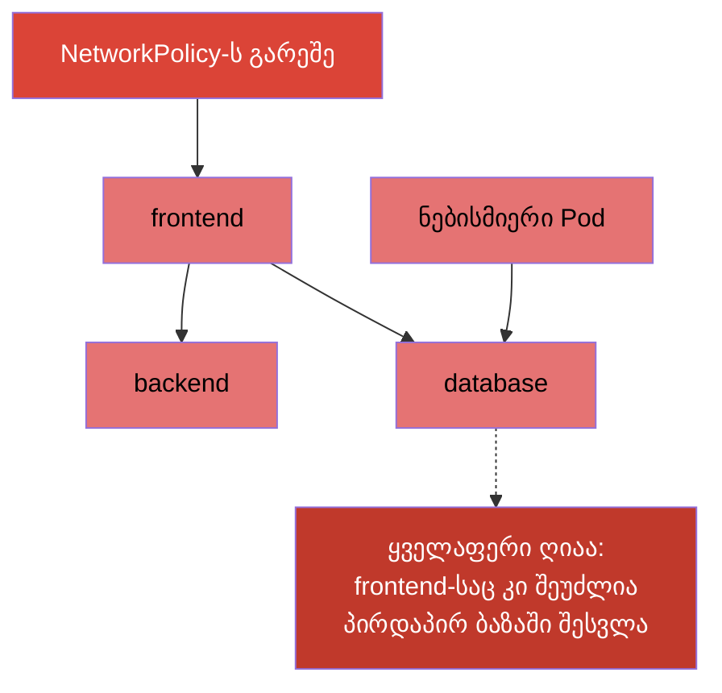
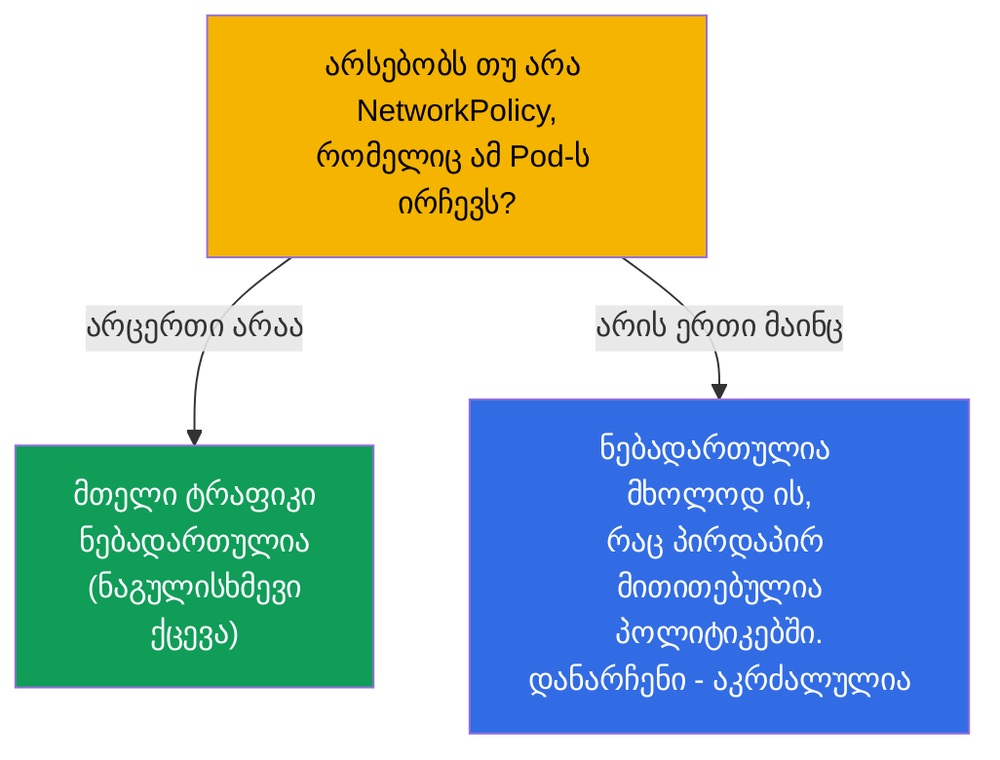
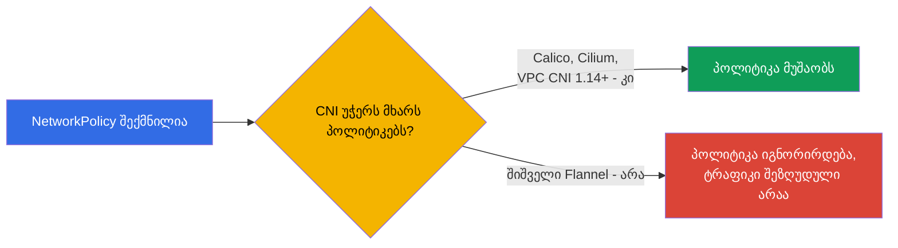
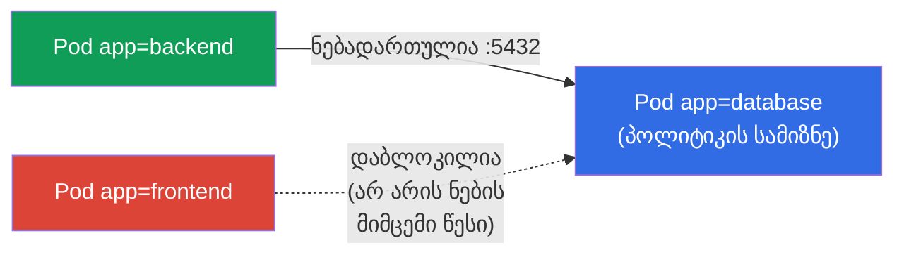
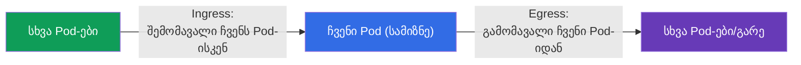
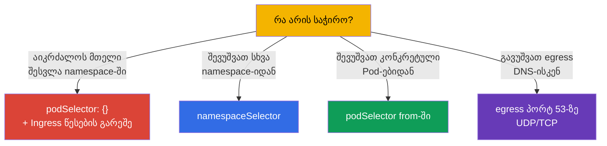

[Русская версия](ru.md) · [Eng version](README.md) · [Versión en español](es.md) · [Version française](fr.md) · [Deutsche Version](de.md) · [繁體中文版](tw.md) · [日本語版](jp.md)

# თავი 34. NetworkPolicy

> **რა იქნება შემდეგ.** ვხურავთ ნაწილ 7-ს. ნაგულისხმევად Kubernetes-ში **ნებისმიერ Pod-ს შეუძლია
> ურთიერთობა ნებისმიერთან** (ბრტყელი ქსელი, თავი 30). ეს მოსახერხებელია, მაგრამ უსაფრთხო არა:
> ერთი Pod-ის კომპრომეტაცია ყველასთან წვდომას ხსნის. **NetworkPolicy** - ეს არის „Pod-ების
> დონის ფაიერვოლი“: წესები, ვის ვისთან შეიძლება ჰქონდეს ურთიერთობა. თემა ორივე გამოცდაშია
> (Services & Networking) და ქსელის უსაფრთხოების საფუძველია (ღრმავდება CKS-ზე). გავარჩევთ
> მოდელს, allow-ლოგიკას და ტიპურ პატერნებს.

## 34.1. ნაგულისხმევად ყველაფერი ნებადართულია

საწყისი წერტილი, რომელიც მკაფიოდ უნდა გავიაზროთ: **NetworkPolicy-ს გარეშე Pod-ებს შორის
მთელი ტრაფიკი ნებადართულია** - ნებისმიერი Pod მიაღწევს კლასტერში ნებისმიერ სხვას.



NetworkPolicy საშუალებას გვაძლევს ეს შევზღუდოთ: მაგალითად, რომ `database`-ში მხოლოდ `backend`
შედიოდეს, და არა `frontend` ან უცხო Pod-ები. ეს არის მინიმალური პრივილეგიების პრინციპის
რეალიზაცია ქსელის დონეზე (სეგმენტაცია, მიკროსეგმენტაცია).

## 34.2. საკვანძო წესი: პოლიტიკები მხოლოდ რთავენ ნებას

უმნიშვნელოვანესი პრინციპი, რომელიც NetworkPolicy-ს ჩვეული ფაიერვოლებისგან განასხვავებს: **წესები
მხოლოდ რთავენ ნებას (allow), ამკრძალავი წესები არ არსებობს**. ლოგიკა ასეთია:



- სანამ Pod-ზე **არცერთი** პოლიტიკა არაა მიმართული - მას ყველაფერი ნებადართული აქვს.
- როგორც კი გაჩნდება **ერთი მაინც** პოლიტიკა, რომელიც Pod-ს გარკვეული მიმართულებით
  (Ingress/Egress) ირჩევს, - ნებადართულია **მხოლოდ ის**, რაც პოლიტიკებში პირდაპირ
  არის მითითებული, ყველაფერი დანარჩენი ამ მიმართულებით იბლოკება.

ანუ NetworkPolicy მუშაობს როგორც „თეთრი სია“: პოლიტიკის დამატება Pod-ს გადაიყვანს
რეჟიმში „აკრძალულია ყველაფერი, ჩამოთვლილის გარდა“.

## 34.3. სავალდებულო პირობა: CNI პოლიტიკების მხარდაჭერით

როგორც თავ 30-ში აღინიშნა, NetworkPolicy-ს იყენებს **CNI-პლაგინი**. თუ დაყენებული CNI
მათ არ უჭერს მხარს (მაგალითად, შიშველი Flannel), NetworkPolicy-ს ობიექტი შეიქმნება, მაგრამ **არ
იმოქმედებს** - ტრაფიკი როგორც მიდიოდა, ისე მიდის.



ეს ცბიერი ხაფანგია: გგონია, ტრაფიკი დაკეტე, სინამდვილეში კი ღიაა. ყოველთვის ამოწმებენ, რომ CNI-ს
NetworkPolicy შეუძლია (Calico, Cilium - კი).

> **AWS VPC CNI: ადრე არა, ახლა კი (დათქმით).** ნაგულისხმევი CNI EKS-ში - AWS VPC CNI -
> დიდი ხნის განმავლობაში თავად **არ იყენებდა** NetworkPolicy-ს: ობიექტი იქმნებოდა, მაგრამ არ მოქმედებდა, და
> სეგმენტაციისთვის ზემოდან Calico-ს დებდნენ. VPC CNI-ს ვერსიიდან **1.14** (2023) გამოჩნდა
> NetworkPolicy-ს **ჩაშენებული** მხარდაჭერა, მაგრამ ის **პირდაპირ უნდა ჩაირთოს** (პარამეტრი
> `enableNetworkPolicy: true` EKS-ადდონთან ან ცვლადი `ENABLE_NETWORK_POLICY` `aws-node`-თან).
> AWS-ის დოკუმენტაციის მიხედვით სტანდარტული და admin-პოლიტიკებისთვის საჭიროა VPC CNI-ს ვერსია
> **1.21.0+**.
>
> ნატიური მხარდაჭერის შეზღუდვები (ასევე AWS-ის დოკუმენტაციიდან):
>
> - მხოლოდ **Linux EC2-ნოუდები** - არა Fargate და არა Windows;
> - პოლიტიკები მოქმედებს **IPv4-სთვის ან IPv6-სთვის**, მაგრამ არა ორივესთვის ერთდროულად („არასწორი“
>   ვერსიის წესები იგნორირდება);
> - გამოიყენება მხოლოდ **Pod-ის ძირითად ინტერფეისზე** (`eth0`); chained-პლაგინებთან
>   (Multus) ან IPv6-Pod-ების IPv4-egress-თან დამატებითი ინტერფეისები არ იფარება;
> - enforcement ოპტიმიზებულია კონტროლერების ქვეშ მყოფი Pod-ებისთვის (აქვთ `ownerReferences` -
>   Deployment, StatefulSet და მისთ.); „მარტოხელა“ Pod-ებისთვის კონტროლერის გარეშე შეიძლება
>   არასტაბილურად იმუშაოს.
>
> დასკვნა EKS-სთვის: თავად ფაქტი „ნაგულისხმევი CNI = არ უჭერს მხარს“ უკვე არასწორია - მხარდაჭერა არის,
> მაგრამ ის უნდა ჩაირთოს და გახსოვდეთ ვერსია და ჩამოთვლილი შეზღუდვები.

## 34.4. NetworkPolicy-ს სტრუქტურა

პოლიტიკა შედგება: ვის ირჩევს (`podSelector`), რომელი მიმართულებისთვის
(`policyTypes`: Ingress/Egress) და რას რთავს ნებას (`ingress`/`egress` წესები).

```yaml
apiVersion: networking.k8s.io/v1
kind: NetworkPolicy
metadata:
  name: allow-backend-to-db
  namespace: prod
spec:
  podSelector:              # რომელ Pod-ებზე გამოიყენება (პოლიტიკის სამიზნე)
    matchLabels:
      app: database
  policyTypes:
  - Ingress                # ვარეგულირებთ შემომავალ ტრაფიკს database-ისკენ
  ingress:
  - from:                  # ნება დართე შემომავალს...
    - podSelector:
        matchLabels:
          app: backend     # ...Pod-ებიდან ჭდით app=backend
    ports:
    - protocol: TCP
      port: 5432
```



გავარჩიოთ ნაწილები:
- `podSelector` - **რომელ Pod-ებზე** გამოიყენება პოლიტიკა (აქ - `database`-ზე);
- `policyTypes` - რომელ მიმართულებებს ვარეგულირებთ (Ingress - შემომავალი, Egress - გამომავალი);
- `from`/`to` - **ვის** ვრთავთ ნებას (podSelector-ით, namespaceSelector-ით ან ipBlock-ით);
- `ports` - რომელ პორტებზე.

## 34.5. Ingress და Egress

ორი მიმართულება, რომლებიც არ უნდა აირიოს (ეს თავად Pod-სამიზნეზეა):



- **Ingress** - ვის შეუძლია მიმართოს არჩეულ Pod-ებს.
- **Egress** - სად შეუძლიათ არჩეულ Pod-ებს **თავად** მიმართონ.

ნიუანსი: თუ მიუთითებთ `policyTypes: [Ingress]`, მაგრამ არ დააყენებთ არცერთ `ingress`-წესს
- ეს არის **მთელი შემომავალის აკრძალვა** (არ არის ნების მიმცემი წესები = არაფერია ნებადართული). ამას
იყენებენ „default deny“-სთვის.

## 34.6. ტიპური პატერნები

რამდენიმე შაბლონი, რომელთა დაწერაც უნდა შეგეძლოთ. ქვემოთ - სრული მანიფესტები, თითოეული ბმულით
ოფიციალურ დოკუმენტაციაზე.

**1. Default deny მთელი შემომავალისთვის namespace-ში** (ცარიელი `podSelector` = ყველა Pod).
დოკ: [Default deny all ingress traffic](https://kubernetes.io/docs/concepts/services-networking/network-policies/#default-deny-all-ingress-traffic).

```yaml
apiVersion: networking.k8s.io/v1
kind: NetworkPolicy
metadata:
  name: default-deny-ingress
  namespace: prod
spec:
  podSelector: {}          # namespace-ის ყველა Pod
  policyTypes:
  - Ingress                # შემომავალიდან არაფერია ნებადართული → ყველაფერი დაბლოკილია
```

**2. ნება დართო ტრაფიკს გარკვეული namespace-იდან** (`namespaceSelector`).
დოკ: [Behavior of `to` and `from` selectors](https://kubernetes.io/docs/concepts/services-networking/network-policies/#behavior-of-to-and-from-selectors).

```yaml
apiVersion: networking.k8s.io/v1
kind: NetworkPolicy
metadata:
  name: allow-from-prod-ns
  namespace: prod
spec:
  podSelector:
    matchLabels:
      app: database        # სამიზნე — database-ის Pod-ები
  policyTypes:
  - Ingress
  ingress:
  - from:
    - namespaceSelector:
        matchLabels:
          env: prod        # ნება დართე namespace-ის Pod-ებიდან ჭდით env=prod
    ports:
    - protocol: TCP
      port: 5432
```

**3. ნება დართო ტრაფიკს კონკრეტული Pod-ებიდან** (`podSelector` `from`-ში).
დოკ: [Behavior of `to` and `from` selectors](https://kubernetes.io/docs/concepts/services-networking/network-policies/#behavior-of-to-and-from-selectors).

```yaml
apiVersion: networking.k8s.io/v1
kind: NetworkPolicy
metadata:
  name: allow-backend-to-db
  namespace: prod
spec:
  podSelector:
    matchLabels:
      app: database
  policyTypes:
  - Ingress
  ingress:
  - from:
    - podSelector:
        matchLabels:
          app: backend     # მხოლოდ Pod-ები ჭდით app=backend
    ports:
    - protocol: TCP
      port: 5432
```

**4. ნება დართო egress-ს მხოლოდ DNS-ისკენ** (ხშირი პატერნი default-deny egress-ის დროს).
დოკ: [Default deny all egress traffic](https://kubernetes.io/docs/concepts/services-networking/network-policies/#default-deny-all-egress-traffic)
(იმავე ადგილას გაფრთხილება, რომ default-deny egress DNS-ს წყვეტს).

```yaml
apiVersion: networking.k8s.io/v1
kind: NetworkPolicy
metadata:
  name: allow-dns-egress
  namespace: prod
spec:
  podSelector: {}          # namespace-ის ყველა Pod-ისთვის
  policyTypes:
  - Egress
  egress:
  - to:
    - namespaceSelector: {} # DNS-სერვისი kube-system-ში ცხოვრობს
    ports:
    - protocol: UDP
      port: 53
    - protocol: TCP
      port: 53
```



> **ხაფანგი DNS-თან.** თუ შემოიღებთ default-deny **egress**-ს, Pod-ები შეწყვეტენ სახელების რეზოლვს
> (DNS - ესეც egress-ია CoreDNS-ისკენ პორტ 53-ზე). ამიტომ egress-ის დახურვისას თითქმის ყოველთვის
> ცალკე რთავენ ნებას DNS-ისკენ ტრაფიკს - თორემ ყველაფერი აუხსნელად „იშლება“ (თავი 31).

## 34.7. podSelector, namespaceSelector, ipBlock

სამი წყარო/სამიზნე წესებში `from`/`to`:

| სელექტორი | ვის ირჩევს |
|----------|---------------|
| `podSelector` | Pod-ებს ჭდეების მიხედვით (იმავე namespace-ში, თუ ns მითითებული არაა) |
| `namespaceSelector` | ყველა Pod-ს namespace-ში namespace-ის ჭდეების მიხედვით |
| `ipBlock` | IP-ს დიაპაზონს (გარე ტრაფიკისთვის, გამონაკლისებით) |

ნიუანსი: `podSelector` და `namespaceSelector` ერთ ელემენტში `from` (დეფისით გაყოფის
გარეშე) მუშაობს როგორც **და** (Pod არის საჭირო namespace-ში და საჭირო ჭდით); ცალკე
სიის ელემენტებად - როგორც **ან**. ეს პოლიტიკების წერისას შეცდომების ხშირი წყაროა.

## 34.8. როგორ იყენებენ ამას პროდაქშენში

- **სეგმენტაცია როგორც უსაფრთხოების საფუძველი.** პროდში NetworkPolicy-თ რეალიზდება
  მიკროსეგმენტაცია: ბაზა იღებს მხოლოდ საკუთარი ბექენდისგან, გადახდის სერვისი - მხოლოდ
  ნებადართულებისგან, გუნდებს შორის ტრაფიკი დაკეტილია. ეს ზღუდავს შემტევის „ჰორიზონტალურ
  გავრცელებას“ ერთი Pod-ის კომპრომეტაციისას.
- **Default-deny როგორც ამოსავალი წერტილი.** მოწიფული მიდგომა: ყოველ namespace-ში პირველად
  default-deny (Ingress და Egress), შემდეგ წვეროვანი ნებები. ასე „ნაგულისხმევად დაკეტილია“,
  და არა „ნაგულისხმევად ღიაა“.
- **არ დაგავიწყდეთ DNS და სამსახურებრივი ტრაფიკი.** default-deny egress-ის დროს აუცილებლად რთავენ DNS-ს
  (პორტი 53) და, საჭიროებისას, წვდომას API-სერვერზე/მეტრიკებზე - თორემ აპლიკაციები ჩუმად
  იშლება. ეს პოლიტიკების დანერგვის ყველაზე ხშირი შეცდომაა.
- **CNI პოლიტიკებით - სავალდებულოა.** პროდში ირჩევენ CNI-ს, რომელიც NetworkPolicy-ს უჭერს მხარს
  (Calico, Cilium). Cilium იძლევა კიდევ L7-პოლიტიკებს (HTTP-გზების/მეთოდების მიხედვით) სტანდარტული
  L3/L4-ის ზემოთ.
- **პოლიტიკების ტესტირება.** პოლიტიკებს ამოწმებენ, რომ საჭირო ტრაფიკი გადის, ხოლო ზედმეტი
  იბლოკება (სატესტო Pod-ებით, `kubectl exec ... curl`). სელექტორში შეცდომა ადვილად ან
  ყველაფერს დაკეტავს, ან ხვრელს დატოვებს.

## 34.9. მინი-ლექსიკონი

- **NetworkPolicy** - წესები, რომელ Pod-ს რომელთან შეიძლება ჰქონდეს ურთიერთობა (Pod-ების დონის ფაიერვოლი).
- **allow-ლოგიკა** - პოლიტიკები მხოლოდ რთავენ ნებას; ცალკე წესად აკრძალვა არ არსებობს.
- **podSelector** - რომელ Pod-ებზე გამოიყენება პოლიტიკა / ვის დავრთოთ ნება.
- **policyTypes** - მიმართულებები: Ingress (შემომავალი) და/ან Egress (გამომავალი).
- **namespaceSelector** - Pod-ების არჩევა namespace-ის ჭდეების მიხედვით.
- **ipBlock** - ნება IP-ს დიაპაზონის მიხედვით (გარე ტრაფიკი).
- **default deny** - პოლიტიკა, რომელიც მიმართულების მიხედვით ყველაფერს ბლოკავს (არ არის ნების მიმცემი წესები).
- **მიკროსეგმენტაცია** - ტრაფიკის წვრილი გამიჯვნა Pod-ებს/სერვისებს შორის.

## 34.10. თავის შეჯამება

- ნაგულისხმევად Pod-ებს შორის მთელი ტრაფიკი ნებადართულია; NetworkPolicy საშუალებას იძლევა ის შეიზღუდოს
  (სეგმენტაცია).
- პოლიტიკები მუშაობს allow-ლოგიკით: სანამ პოლიტიკა არაა - ყველაფერი ღიაა; გაჩნდა ერთი მაინც
  Pod-ზე/მიმართულებაზე - ნებადართულია მხოლოდ პირდაპირ მითითებული.
- NetworkPolicy-ს იყენებს CNI; მხარდაჭერის გარეშე (შიშველი Flannel) პოლიტიკები არ მოქმედებს.
- სტრუქტურა: `podSelector` (სამიზნე), `policyTypes` (Ingress/Egress), წესები `from`/`to`
  (podSelector/namespaceSelector/ipBlock) და `ports`.
- ცარიელი `podSelector: {}` + მიმართულება წესების გარეშე = default deny namespace-ის ყველა
  Pod-ისთვის.
- default-deny egress-ის დროს აუცილებლად რთავენ DNS-ს (პორტი 53), თორემ ყველაფერი იშლება.
- `podSelector` და `namespaceSelector` ერთ ელემენტში - და, ცალკე ელემენტებად - ან.

## 34.11. როგორ გამოგადგებათ: გამოცდაზე და რეალურ სამუშაოში

**გამოცდაზე.** „დაართე ნება ტრაფიკს Pod-ისკენ მხოლოდ გარკვეული Pod-ებიდან/namespace-იდან“,
„გააკეთე default deny“, „რატომ შეწყვიტა Pod-მა სიარული/რეზოლვი პოლიტიკის შემდეგ“ - ტიპური
დავალებებია. საჭიროა თავდაჯერებულად წეროთ podSelector/from/to/ports, გესმოდეთ allow-ლოგიკა და არ
დაგავიწყდეთ DNS egress-პოლიტიკების დროს.

**რეალურ სამუშაოში.** NetworkPolicy - ქსელის უსაფრთხოების საბაზისო ინსტრუმენტია:
მიკროსეგმენტაცია ზღუდავს კომპრომეტაციისგან მიღებულ ზარალს. მიდგომა „default-deny + წვეროვანი
ნებები“ - მოწიფული კლასტერების სტანდარტია. allow-ლოგიკისა და DNS-თან ხაფანგის გაგება
აღკვეთს როგორც უსაფრთხოების ხვრელებს, ისე კავშირის იდუმალ წყვეტებს.

## 34.12. თვითშემოწმების კითხვები

1. რომელი ტრაფიკია ნებადართული Pod-ებს შორის ნაგულისხმევად და რისთვის უნდა შევზღუდოთ ის?
2. რატომ ამბობენ, რომ NetworkPolicy allow-ლოგიკით მუშაობს? რა ხდება Pod-ზე პირველი პოლიტიკის
   გაჩენისას?
3. რატომ შეიძლება პოლიტიკა „არ მუშაობდეს“ და რა არის ამისთვის საჭირო CNI-სგან?
4. რას აყენებენ `podSelector`, `policyTypes` და წესები `from`/`to`?
5. როგორ გავაკეთოთ default-deny namespace-ში მთელი შემომავალისთვის?
6. რატომ არის საჭირო egress-ის დახურვისას ცალკე DNS-ის ნება?
7. რა განსხვავებაა podSelector-სა და namespaceSelector-ს შორის ერთ ელემენტში `from` და
   სხვადასხვაში?

## პრაქტიკა

ამით ნაწილი 7 (სერვისები და ქსელი) დასრულებულია. შემდეგ - ნაწილი 8, ადმინისტრატორული (CKA):
კლასტერის მოწყობა და დაყენება, kubeadm-იდან დაწყებული (თავი 35). NetworkPolicy მუშავდება
ქსელისა და უსაფრთხოების ლაბებში.

🧪 ლაბი 120 (მათ შორის დრილი NetworkPolicy-ზე): [tasks/cka/labs/120](../../labs/120/README_GE.MD)

---
[სარჩევი](../README_GE.md) · [თავი 33](../33/ge.md) · [თავი 35](../35/ge.md)
