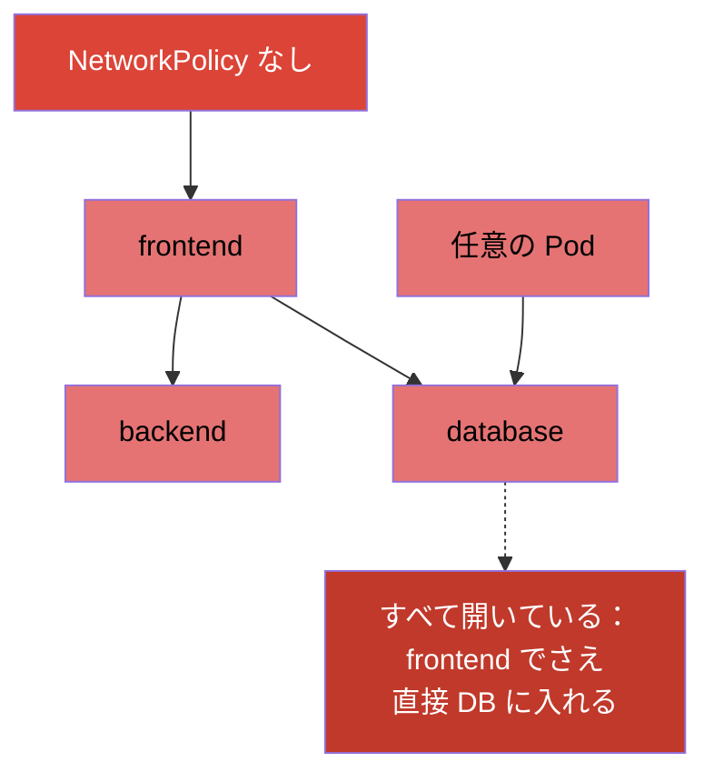
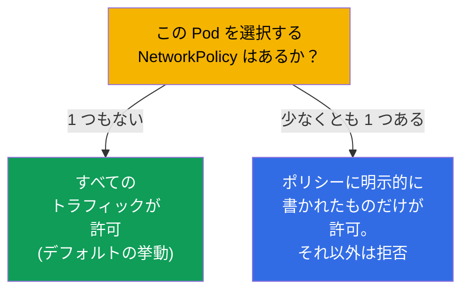
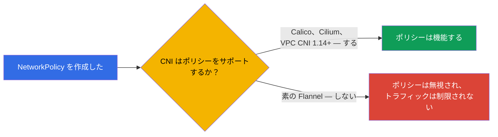
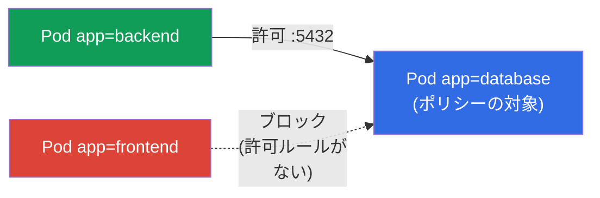
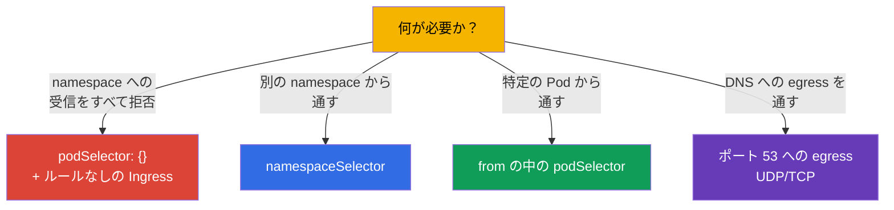

[Русская версия](ru.md) · [Eng version](README.md) · [Versión en español](es.md) · [Version française](fr.md) · [Deutsche Version](de.md) · [ქართული ვერსია](ge.md) · [繁體中文版](tw.md)

# 第 34 章。NetworkPolicy

> **次に来るもの。** パート 7 を締めます。Kubernetes ではデフォルトで **どの Pod も
> どの Pod とでも通信できます**（フラットなネットワーク、第 30 章）。これは便利ですが
> 安全ではありません：1 つの Pod が侵害されると、すべてへの道が開きます。
> **NetworkPolicy** とは「Pod レベルの firewall」です：誰が誰と通信できるかのルールです。
> このテーマは両方の試験に含まれ (Services & Networking)、ネットワークセキュリティの
> 土台になります（CKS でさらに深掘りされます）。モデル、allow ロジック、典型的な
> パターンを見ていきましょう。

## 34.1. デフォルトではすべて許可

はっきり自覚しておくべき出発点：**NetworkPolicy がなければ Pod 間のトラフィックは
すべて許可** されます - どの Pod もクラスタ内の他のどの Pod にも到達できます。



NetworkPolicy はこれを制限できます：たとえば `database` へは `backend` だけが行けて、
`frontend` や無関係な Pod は行けないようにします。これはネットワークレベルでの最小権限の
原則の実装です（セグメンテーション、マイクロセグメンテーション）。

## 34.2. 鍵となるルール：ポリシーは許可するだけ

NetworkPolicy を通常の firewall と分ける最重要の原則：**ルールは許可 (allow) するだけで、
拒否のルールは存在しません**。ロジックはこうです：



- Pod を対象にする **ポリシーが 1 つもない** あいだは、その Pod にはすべてが許可されます。
- ある方向 (Ingress/Egress) について Pod を選択するポリシーが **少なくとも 1 つ** 現れた
  瞬間から、ポリシーに明示的に書かれた **ものだけ** が許可され、その方向のそれ以外は
  すべてブロックされます。

つまり NetworkPolicy は「ホワイトリスト」として動きます：ポリシーを追加すると、その Pod は
「列挙されたもの以外はすべて拒否」というモードに切り替わります。

## 34.3. 必須条件：ポリシーをサポートする CNI

第 30 章で触れたとおり、NetworkPolicy を適用するのは **CNI プラグイン** です。入っている
CNI がそれをサポートしていない場合（たとえば素の Flannel）、NetworkPolicy オブジェクトは
作成されますが **効果を持ちません** - トラフィックは今までどおり流れます。



これは陰険な罠です：トラフィックを閉じたつもりでいて、実は開いています。CNI が
NetworkPolicy を扱えることは必ず確認します（Calico、Cilium - 扱えます）。

> **AWS VPC CNI：以前は不可、今は可（ただし条件付き）。** EKS のデフォルト CNI である
> AWS VPC CNI は、長いあいだ自身では NetworkPolicy を **適用しませんでした**：
> オブジェクトは作られても効かず、セグメンテーションのために上から Calico を入れて
> いました。VPC CNI **1.14**（2023 年）から NetworkPolicy の **組み込み** サポートが
> 登場しましたが、**明示的に有効化** する必要があります（EKS アドオンのパラメータ
> `enableNetworkPolicy: true`、または `aws-node` の環境変数 `ENABLE_NETWORK_POLICY`）。
> AWS のドキュメントによれば、標準ポリシーと admin ポリシーには VPC CNI **1.21.0+** が
> 必要です。
>
> ネイティブサポートの制限（これも AWS のドキュメントより）：
>
> - **Linux の EC2 ノード** のみ - Fargate も Windows も不可;
> - ポリシーは **IPv4 または IPv6** に対して効きますが、両方同時には効きません（「別の」
>   バージョンのルールは無視されます）;
> - Pod の **メインインターフェース** (`eth0`) にのみ適用されます；chained プラグイン
>   (Multus) や IPv6 Pod の IPv4 egress では、追加のインターフェースはカバーされません;
> - enforcement はコントローラ配下の Pod（`ownerReferences` があるもの - Deployment、
>   StatefulSet など）向けに最適化されています；コントローラのない「単独」の Pod では
>   不安定に動くことがあります。
>
> EKS についての結論：「デフォルト CNI = サポートしない」という事実自体がすでに正しく
> ありません - サポートはあります。ただし有効化する必要があり、バージョンと列挙した
> 制限を頭に入れておく必要があります。

## 34.4. NetworkPolicy の構造

ポリシーは次のものからなります：誰を選択するか (`podSelector`)、どの方向についてか
(`policyTypes`：Ingress/Egress)、そして何を許可するか (`ingress`/`egress` ルール)。

```yaml
apiVersion: networking.k8s.io/v1
kind: NetworkPolicy
metadata:
  name: allow-backend-to-db
  namespace: prod
spec:
  podSelector:              # どの Pod に適用するか (ポリシーの対象)
    matchLabels:
      app: database
  policyTypes:
  - Ingress                # database への受信トラフィックを制御する
  ingress:
  - from:                  # 次からの受信を許可する...
    - podSelector:
        matchLabels:
          app: backend     # ...ラベル app=backend を持つ Pod から
    ports:
    - protocol: TCP
      port: 5432
```



各部分を見ていきましょう：
- `podSelector` - ポリシーを **どの Pod に** 適用するか（ここでは `database` に）;
- `policyTypes` - どの方向を制御するか（Ingress - 受信、Egress - 送信）;
- `from`/`to` - **誰に** 許可するか（podSelector、namespaceSelector または ipBlock で）;
- `ports` - どのポートで。

## 34.5. Ingress と Egress

混同してはいけない 2 つの方向（これは対象となる Pod 自身から見た話です）：


- **Ingress** - 選択された Pod **へ** 誰がアクセスできるか。
- **Egress** - 選択された Pod が **自分から** どこへアクセスできるか。

細かい点：`policyTypes: [Ingress]` と書いて `ingress` ルールを 1 つも定義しないと
- それは **受信をすべて拒否** することになります（許可ルールがない = 何も許可されていない）。
これは「default deny」のために使われます。

## 34.6. 典型的なパターン

書けるようになっておくべきいくつかのテンプレートです。以下は完全なマニフェストで、
それぞれ公式ドキュメントへのリンクを付けてあります。

**1. namespace への受信をすべて default deny**（空の `podSelector` = すべての Pod）。
ドキュメント: [Default deny all ingress traffic](https://kubernetes.io/docs/concepts/services-networking/network-policies/#default-deny-all-ingress-traffic)。

```yaml
apiVersion: networking.k8s.io/v1
kind: NetworkPolicy
metadata:
  name: default-deny-ingress
  namespace: prod
spec:
  podSelector: {}          # namespace のすべての Pod
  policyTypes:
  - Ingress                # 受信は何も許可されていない → すべてブロック
```

**2. 特定の namespace からのトラフィックを許可**（`namespaceSelector`）。
ドキュメント: [Behavior of `to` and `from` selectors](https://kubernetes.io/docs/concepts/services-networking/network-policies/#behavior-of-to-and-from-selectors)。

```yaml
apiVersion: networking.k8s.io/v1
kind: NetworkPolicy
metadata:
  name: allow-from-prod-ns
  namespace: prod
spec:
  podSelector:
    matchLabels:
      app: database        # 対象は database の Pod
  policyTypes:
  - Ingress
  ingress:
  - from:
    - namespaceSelector:
        matchLabels:
          env: prod        # ラベル env=prod を持つ namespace の Pod から許可
    ports:
    - protocol: TCP
      port: 5432
```

**3. 具体的な Pod からのトラフィックを許可**（`from` の中の `podSelector`）。
ドキュメント: [Behavior of `to` and `from` selectors](https://kubernetes.io/docs/concepts/services-networking/network-policies/#behavior-of-to-and-from-selectors)。

```yaml
apiVersion: networking.k8s.io/v1
kind: NetworkPolicy
metadata:
  name: allow-backend-to-db
  namespace: prod
spec:
  podSelector:
    matchLabels:
      app: database
  policyTypes:
  - Ingress
  ingress:
  - from:
    - podSelector:
        matchLabels:
          app: backend     # ラベル app=backend を持つ Pod だけ
    ports:
    - protocol: TCP
      port: 5432
```

**4. egress を DNS だけに許可**（default-deny egress のときの定番パターン）。
ドキュメント: [Default deny all egress traffic](https://kubernetes.io/docs/concepts/services-networking/network-policies/#default-deny-all-egress-traffic)
（同じ場所に、default-deny egress が DNS を壊すという警告があります）。

```yaml
apiVersion: networking.k8s.io/v1
kind: NetworkPolicy
metadata:
  name: allow-dns-egress
  namespace: prod
spec:
  podSelector: {}          # namespace のすべての Pod に対して
  policyTypes:
  - Egress
  egress:
  - to:
    - namespaceSelector: {} # DNS サービスは kube-system にいる
    ports:
    - protocol: UDP
      port: 53
    - protocol: TCP
      port: 53
```



> **DNS の罠。** default-deny **egress** を入れると、Pod は名前を解決できなくなります
> (DNS もポート 53 への CoreDNS 宛ての egress です)。そのため egress を閉じるときは、
> ほぼ常に DNS へのトラフィックを別途許可します - そうしないと、説明のつかない形で
> すべてが「壊れます」（第 31 章）。

## 34.7. podSelector、namespaceSelector、ipBlock

`from`/`to` のルールにおける 3 つの送信元/宛先：

| セレクタ | 誰を選択するか |
|----------|---------------|
| `podSelector` | ラベルによる Pod（ns を指定しなければ同じ namespace 内） |
| `namespaceSelector` | namespace のラベルで選んだ namespace 内のすべての Pod |
| `ipBlock` | IP の範囲（外部トラフィック向け、例外指定あり） |

細かい点：`podSelector` と `namespaceSelector` を 1 つの `from` 要素の中に（ハイフンで
分けずに）書くと **AND** として働きます（目的の namespace にいて、かつ目的のラベルを持つ
Pod）；リストの別々の要素として書くと **OR** になります。これはポリシーを書くときの
よくある間違いの元です。

## 34.8. 本番環境でこれをどう使うか

- **セグメンテーションはセキュリティの土台。** 本番では NetworkPolicy でマイクロ
  セグメンテーションを実装します：DB は自分のバックエンドからのみ受け付け、決済サービスは
  許可されたものからのみ、チーム間のトラフィックは閉じます。これにより、1 つの Pod が
  侵害されたときの攻撃者の「横方向への拡散」を制限できます。
- **出発点としての default-deny。** 成熟したアプローチ：各 namespace でまず default-deny
  (Ingress と Egress) を入れ、その後でピンポイントに許可します。こうすれば「デフォルトで
  閉じている」になり、「デフォルトで開いている」にはなりません。
- **DNS とシステムトラフィックを忘れない。** default-deny egress のときは必ず DNS
  （ポート 53）を許可し、必要なら API サーバー/メトリクスへのアクセスも許可します - さも
  ないとアプリケーションは黙って壊れます。これはポリシー導入でもっとも多い間違いです。
- **ポリシー対応の CNI は必須。** 本番では NetworkPolicy をサポートする CNI を選びます
  (Calico、Cilium)。Cilium は標準の L3/L4 に加えて L7 ポリシー（HTTP のパス/メソッド単位）も
  提供します。
- **ポリシーのテスト。** 必要なトラフィックが通り、余計なものはブロックされることを
  確認します（テスト用の Pod、`kubectl exec ... curl` で）。セレクタのミスは、すべてを
  閉じてしまうか、穴を残すかのどちらかになりやすいです。

## 34.9. ミニ用語集

- **NetworkPolicy** - どの Pod がどの Pod と通信できるかのルール（Pod レベルの firewall）。
- **allow ロジック** - ポリシーは許可するだけ；独立した拒否ルールは存在しない。
- **podSelector** - ポリシーをどの Pod に適用するか / 誰を許可するか。
- **policyTypes** - 方向：Ingress（受信）および/または Egress（送信）。
- **namespaceSelector** - namespace のラベルによる Pod の選択。
- **ipBlock** - IP の範囲による許可（外部トラフィック）。
- **default deny** - ある方向のすべてをブロックするポリシー（許可ルールがない）。
- **マイクロセグメンテーション** - Pod / サービス間のトラフィックの細かい切り分け。

## 34.10. 本章のまとめ

- デフォルトでは Pod 間のトラフィックはすべて許可されます；NetworkPolicy はそれを制限
  できます（セグメンテーション）。
- ポリシーは allow ロジックで動きます：ポリシーがないあいだはすべて開いており、Pod と
  方向について少なくとも 1 つ現れると、明示的に書かれたものだけが許可されます。
- NetworkPolicy を適用するのは CNI です；サポートがなければ（素の Flannel）ポリシーは
  効きません。
- 構造：`podSelector`（対象）、`policyTypes`（Ingress/Egress）、`from`/`to` のルール
  (podSelector/namespaceSelector/ipBlock)、そして `ports`。
- 空の `podSelector: {}` + ルールなしの方向 = その namespace のすべての Pod に対する
  default deny。
- default-deny egress のときは必ず DNS（ポート 53）を許可します。さもないとすべてが壊れます。
- `podSelector` と `namespaceSelector` は 1 つの要素の中なら AND、別々の要素なら OR です。

## 34.11. これがどう役に立つか：試験と実際の仕事で

**試験では。** 「特定の Pod / namespace からだけ Pod へのトラフィックを許可せよ」
「default deny を作れ」「ポリシーの後で Pod が通信/名前解決できなくなったのはなぜか」は
典型的な問題です。podSelector/from/to/ports を自信をもって書け、allow ロジックを理解し、
egress ポリシーでは DNS を忘れないことが必要です。

**実際の仕事では。** NetworkPolicy はネットワークセキュリティの基本ツールです：
マイクロセグメンテーションは侵害による被害を限定します。「default-deny + ピンポイントな
許可」というアプローチは成熟したクラスタの標準です。allow ロジックと DNS の罠を理解して
いれば、セキュリティの穴も、謎の通信断も防げます。

## 34.12. 自己チェックの質問

1. デフォルトで Pod 間ではどのトラフィックが許可されており、なぜそれを制限するのですか？
2. NetworkPolicy が allow ロジックで動くと言われるのはなぜですか？Pod に最初のポリシーが
   現れると何が起きますか？
3. ポリシーが「機能しない」ことがあるのはなぜで、そのために CNI に何が必要ですか？
4. `podSelector`、`policyTypes`、`from`/`to` のルールは何を指定しますか？
5. namespace への受信すべてに対する default-deny はどう作りますか？
6. egress を閉じるとき、なぜ DNS を別途許可する必要があるのですか？
7. `from` の 1 つの要素の中にある podSelector と namespaceSelector と、別々の要素にある
   場合の違いは何ですか？

## 演習

これでパート 7（サービスとネットワーク）は完了です。次は - パート 8、管理者編 (CKA)：
クラスタの構造とインストールで、kubeadm から始めます（第 35 章）。NetworkPolicy は
ネットワークとセキュリティのラボで練習します。

🧪 ラボ 120（NetworkPolicy のドリルを含む）: [tasks/cka/labs/120](../../labs/120/README_JP.MD)

---
[目次](../README_JP.md) · [第 33 章](../33/jp.md) · [第 35 章](../35/jp.md)
