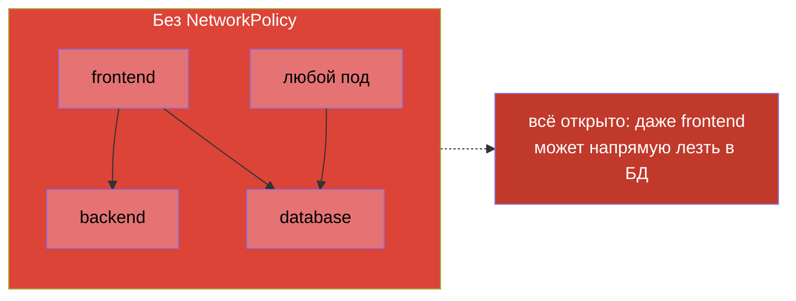
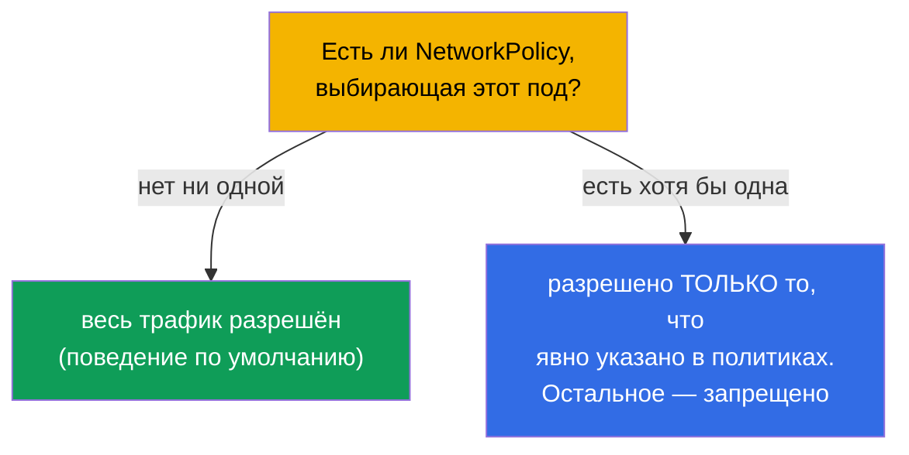
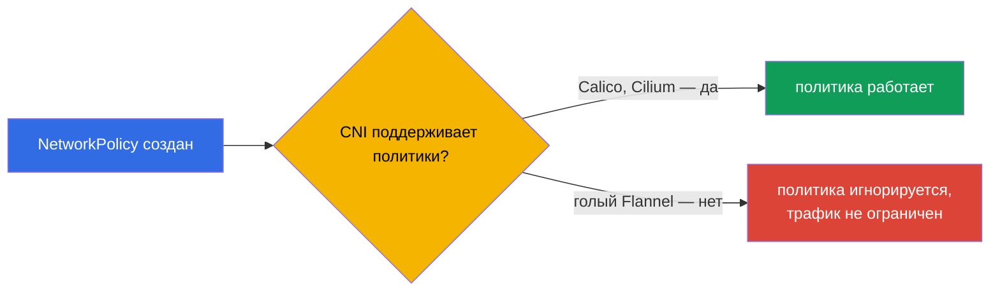
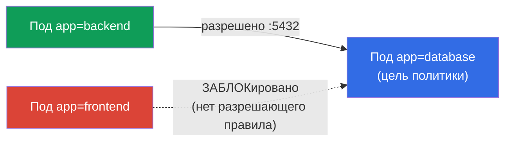
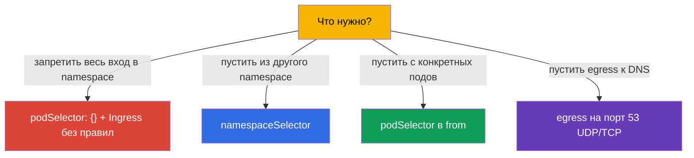

# Глава 34. NetworkPolicy

> **Что дальше.** Закрываем часть 7. По умолчанию в Kubernetes **любой под может общаться
> с любым** (плоская сеть, глава 30). Это удобно, но небезопасно: компрометация одного
> пода открывает доступ ко всем. **NetworkPolicy** - это «файрвол уровня подов»: правила,
> кто с кем может общаться. Тема есть в обоих экзаменах (Services & Networking) и является
> базой безопасности сети (углубляется на CKS). Разберём модель, allow-логику и типовые
> паттерны.

## 34.1. По умолчанию всё разрешено

Стартовая точка, которую надо чётко осознать: **без NetworkPolicy весь трафик между
подами разрешён** - любой под достучится до любого другого в кластере.



NetworkPolicy позволяет это ограничить: например, чтобы в `database` мог ходить только
`backend`, но не `frontend` и не посторонние поды. Это реализация принципа минимальных
привилегий на сетевом уровне (сегментация, микросегментация).

## 34.2. Ключевое правило: политики только разрешают

Важнейший принцип, который отличает NetworkPolicy от привычных файрволов: **правила
только разрешают (allow), запрещающих правил нет**. Логика такая:



- Пока на под **не нацелена ни одна** политика - ему всё разрешено.
- Как только появляется **хотя бы одна** политика, выбирающая под по определённому
  направлению (Ingress/Egress), - разрешается **только то**, что в политиках явно
  указано, всё прочее по этому направлению блокируется.

То есть NetworkPolicy работает как «белый список»: добавление политики переключает под в
режим «запрещено всё, кроме перечисленного».

## 34.3. Обязательное условие: CNI с поддержкой политик

Как отмечалось в главе 30, NetworkPolicy применяет **CNI-плагин**. Если установленный CNI
их не поддерживает (например, голый Flannel), объект NetworkPolicy создастся, но **не
будет действовать** - трафик как шёл, так и идёт.



Это коварная ловушка: думаешь, что закрыл трафик, а он открыт. Всегда проверяют, что CNI
умеет NetworkPolicy (Calico, Cilium - да).

## 34.4. Структура NetworkPolicy

Политика состоит из: кого она выбирает (`podSelector`), для какого направления
(`policyTypes`: Ingress/Egress) и что разрешает (`ingress`/`egress` правила).

```yaml
apiVersion: networking.k8s.io/v1
kind: NetworkPolicy
metadata:
  name: allow-backend-to-db
  namespace: prod
spec:
  podSelector:              # к каким подам применяется (цель политики)
    matchLabels:
      app: database
  policyTypes:
  - Ingress                # регулируем входящий трафик к database
  ingress:
  - from:                  # РАЗРЕШИТЬ входящий от...
    - podSelector:
        matchLabels:
          app: backend     # ...подов с меткой app=backend
    ports:
    - protocol: TCP
      port: 5432
```



Разберём части:
- `podSelector` - **к каким подам** применяется политика (здесь - к `database`);
- `policyTypes` - какие направления регулируем (Ingress - входящий, Egress - исходящий);
- `from`/`to` - **кому** разрешаем (по podSelector, namespaceSelector или ipBlock);
- `ports` - на каких портах.

## 34.5. Ingress и Egress

Два направления, которые надо не путать (это про сам под-цель):


- **Ingress** - кто может обращаться **к** выбранным подам.
- **Egress** - куда выбранные поды могут обращаться **сами**.

Тонкость: если указать `policyTypes: [Ingress]`, но не задать ни одного `ingress`-правила
- это **запрет всего входящего** (нет разрешающих правил = ничего не разрешено). Это
используют для «default deny».

## 34.6. Типовые паттерны

Несколько шаблонов, которые надо уметь писать.

**Default deny всего входящего в namespace** (пустой podSelector = все поды):

```yaml
spec:
  podSelector: {}          # все поды namespace
  policyTypes:
  - Ingress                # входящего не разрешено ничего → всё заблокировано
```

**Разрешить трафик из определённого namespace** (`namespaceSelector`):

```yaml
  ingress:
  - from:
    - namespaceSelector:
        matchLabels:
          env: prod        # разрешить из подов namespace с меткой env=prod
```

**Разрешить egress только к DNS** (частый паттерн при default-deny egress):

```yaml
  egress:
  - to:
    - namespaceSelector: {}
    ports:
    - {protocol: UDP, port: 53}
    - {protocol: TCP, port: 53}
```



> **Ловушка с DNS.** Если ввести default-deny **egress**, поды перестанут резолвить имена
> (DNS - это тоже egress к CoreDNS на порт 53). Поэтому при закрытии egress почти всегда
> отдельно разрешают трафик к DNS - иначе всё «ломается» необъяснимо (глава 31).

## 34.7. podSelector, namespaceSelector, ipBlock

Три источника/цели в правилах `from`/`to`:

| Селектор | Кого выбирает |
|----------|---------------|
| `podSelector` | поды по меткам (в том же namespace, если не указан ns) |
| `namespaceSelector` | все поды в namespace по меткам namespace |
| `ipBlock` | диапазон IP (для внешнего трафика, с исключениями) |

Тонкость: `podSelector` и `namespaceSelector` в одном элементе `from` (без разделения
дефисом) работают как **И** (под И в нужном namespace, И с нужной меткой); как отдельные
элементы списка - как **ИЛИ**. Это частый источник ошибок при написании политик.

## 34.8. Как это применяют в продакшене

- **Сегментация как база безопасности.** В проде NetworkPolicy реализуют
  микросегментацию: БД принимает только от своего бэкенда, платёжный сервис - только от
  разрешённых, между командами трафик закрыт. Это ограничивает «горизонтальное
  распространение» атакующего при компрометации одного пода.
- **Default-deny как отправная точка.** Зрелый подход: в каждом namespace сначала
  default-deny (Ingress и Egress), затем точечные разрешения. Так «по умолчанию закрыто»,
  а не «по умолчанию открыто».
- **Не забыть DNS и служебный трафик.** При default-deny egress обязательно разрешают DNS
  (порт 53) и, при необходимости, доступ к API-серверу/метрикам - иначе приложения молча
  ломаются. Это самая частая ошибка внедрения политик.
- **CNI с политиками - обязателен.** В проде выбирают CNI, поддерживающий NetworkPolicy
  (Calico, Cilium). Cilium даёт ещё и L7-политики (по HTTP-путям/методам) сверх стандартных
  L3/L4.
- **Тестирование политик.** Политики проверяют, что нужный трафик проходит, а лишний
  блокируется (тестовыми подами, `kubectl exec ... curl`). Ошибка в селекторе легко либо
  всё закроет, либо оставит дыру.

## 34.9. Мини-глоссарий

- **NetworkPolicy** - правила, какой под с каким может общаться (файрвол уровня подов).
- **allow-логика** - политики только разрешают; запрета как отдельного правила нет.
- **podSelector** - к каким подам применяется политика / кого разрешить.
- **policyTypes** - направления: Ingress (входящий) и/или Egress (исходящий).
- **namespaceSelector** - выбор подов по меткам namespace.
- **ipBlock** - разрешение по диапазону IP (внешний трафик).
- **default deny** - политика, блокирующая всё по направлению (нет разрешающих правил).
- **микросегментация** - тонкое разграничение трафика между подами/сервисами.

## 34.10. Итоги главы

- По умолчанию весь трафик между подами разрешён; NetworkPolicy позволяет его ограничить
  (сегментация).
- Политики работают по allow-логике: пока политики нет - всё открыто; появилась хотя бы
  одна на под/направление - разрешено только явно указанное.
- NetworkPolicy применяет CNI; без поддержки (голый Flannel) политики не действуют.
- Структура: `podSelector` (цель), `policyTypes` (Ingress/Egress), правила `from`/`to`
  (podSelector/namespaceSelector/ipBlock) и `ports`.
- Пустой `podSelector: {}` + направление без правил = default deny для всех подов
  namespace.
- При default-deny egress обязательно разрешают DNS (порт 53), иначе всё ломается.
- `podSelector` и `namespaceSelector` в одном элементе - И, отдельными элементами - ИЛИ.

## 34.11. Как это пригодится: на экзамене и в реальной работе

**На экзамене.** «Разреши трафик к поду только от определённых подов/namespace»,
«сделай default deny», «почему под перестал ходить/резолвить после политики» - типовые
задания. Нужно уверенно писать podSelector/from/to/ports, понимать allow-логику и не
забывать про DNS при egress-политиках.

**В реальной работе.** NetworkPolicy - базовый инструмент сетевой безопасности:
микросегментация ограничивает ущерб от компрометации. Подход «default-deny + точечные
разрешения» - стандарт зрелых кластеров. Понимание allow-логики и ловушки с DNS
предотвращает как дыры в безопасности, так и загадочные обрывы связи.

## 34.12. Вопросы для самопроверки

1. Какой трафик разрешён между подами по умолчанию и зачем его ограничивать?
2. Почему говорят, что NetworkPolicy работает по allow-логике? Что происходит при
   появлении первой политики на под?
3. Почему политика может «не работать» и что для этого нужно от CNI?
4. Что задают `podSelector`, `policyTypes` и правила `from`/`to`?
5. Как сделать default-deny для всего входящего в namespace?
6. Почему при закрытии egress нужно отдельно разрешать DNS?
7. В чём разница между podSelector и namespaceSelector в одном элементе `from` и в
   разных?

## Практика

На этом часть 7 (сервисы и сеть) завершена. Дальше - часть 8, администраторская (CKA):
устройство и установка кластера, начиная с kubeadm (глава 35). NetworkPolicy отрабатывается
в лабах по сети и безопасности.

🧪 Лаба 120 (в т.ч. дрилл на NetworkPolicy): [tasks/cka/labs/120](../../labs/120/README_RU.MD)

---
[Оглавление](../README_RU.md) · [Глава 33](../33/ru.md) · [Глава 35](../35/ru.md)
