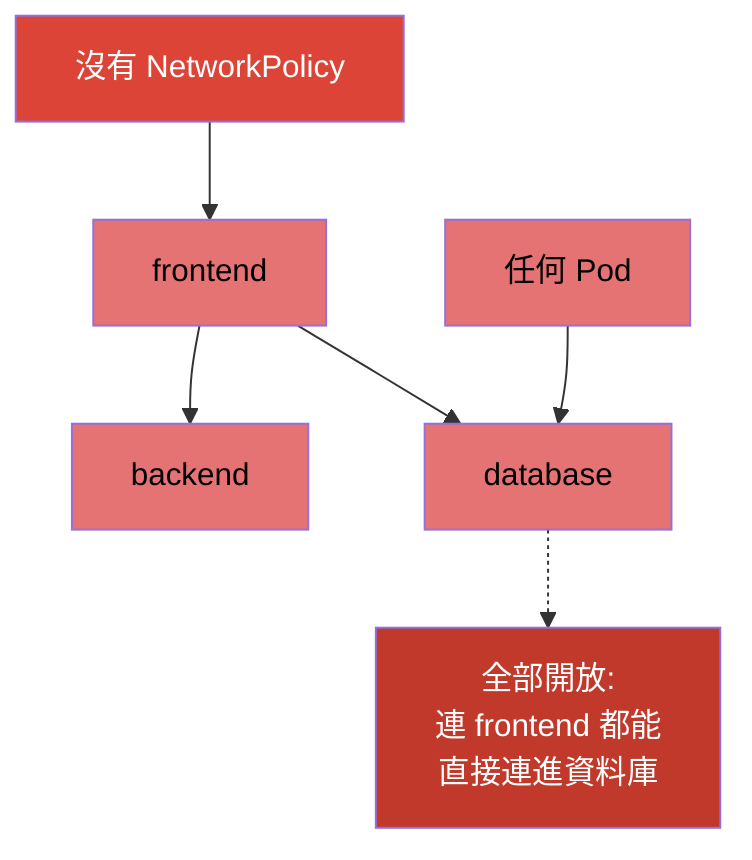
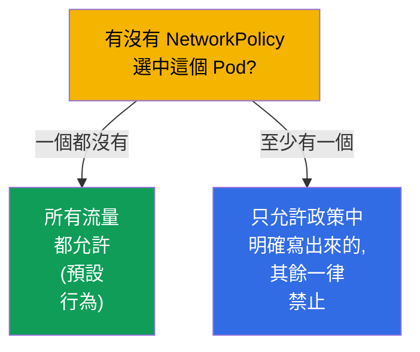
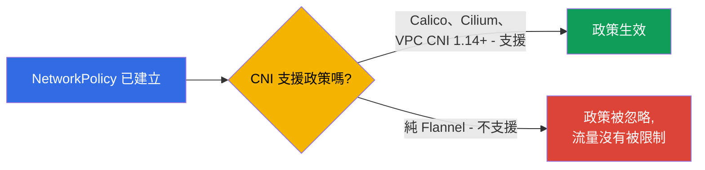
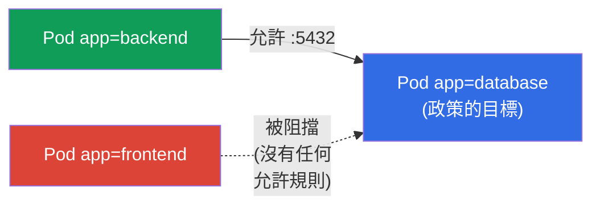
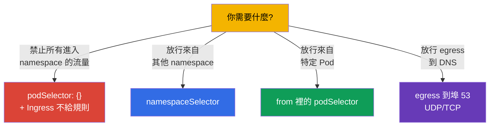

[Русская версия](ru.md) · [Eng version](README.md) · [Versión en español](es.md) · [Version française](fr.md) · [Deutsche Version](de.md) · [ქართული ვერსია](ge.md) · [日本語版](jp.md)

# 第 34 章。NetworkPolicy

> **接下來是什麼。** 我們要結束第 7 部分。在 Kubernetes 裡預設 **任何 Pod 都可以跟任何
> Pod 通訊**(扁平網路,第 30 章)。這很方便,但不安全:只要有一個 Pod 被入侵,就等於
> 打開了通往所有 Pod 的門。**NetworkPolicy** 就是「Pod 層級的防火牆」:規定誰可以跟誰
> 通訊的規則。這個主題在兩張考試裡都有(Services & Networking),而且是網路安全的基礎
> (在 CKS 會更深入)。我們來看它的模型、allow 邏輯,以及常見的樣式。

## 34.1. 預設一切都是允許的

必須清楚認知的起點:**沒有 NetworkPolicy 時,Pod 之間的所有流量都是允許的** - 叢集裡
任何 Pod 都連得到任何其他 Pod。



NetworkPolicy 讓你能把這件事收緊:例如只讓 `backend` 連進 `database`,而 `frontend`
與其他不相關的 Pod 都不行。這就是在網路層面落實最小權限原則(分段、微分段)。

## 34.2. 關鍵規則:政策只會「允許」

NetworkPolicy 跟一般防火牆最大的不同,就是這個原則:**規則只做允許 (allow),沒有拒絕
規則**。邏輯是這樣的:



- 只要 **沒有任何** 政策指向某個 Pod,它就什麼都被允許。
- 一旦出現 **至少一個** 政策,在某個方向(Ingress/Egress)選中這個 Pod,就 **只允許**
  政策裡明確寫出來的內容,該方向的其他流量全部被阻擋。

也就是說,NetworkPolicy 的運作方式是「白名單」:加上一條政策,就把 Pod 切換成「除了列
出來的以外全部禁止」的模式。

## 34.3. 必要條件:支援政策的 CNI

如同第 30 章提到的,NetworkPolicy 是由 **CNI 外掛** 來執行的。如果安裝的 CNI 不支援它們
(例如純 Flannel),NetworkPolicy 物件還是會建立成功,但 **不會生效** - 流量該通的還是
照樣通。



這是個陰險的陷阱:你以為流量已經關上了,其實還開著。所以一定要確認 CNI 真的會處理
NetworkPolicy(Calico、Cilium - 會)。

> **AWS VPC CNI:以前不行,現在行了(但有前提)。** EKS 的預設 CNI - AWS VPC CNI -
> 有很長一段時間自己 **並不執行** NetworkPolicy:物件建得起來但不生效,要做分段就得在
> 上面再裝 Calico。從 VPC CNI **1.14**(2023)開始有了 **內建** 的 NetworkPolicy 支援,
> 但必須 **明確啟用**(EKS addon 的 `enableNetworkPolicy: true` 參數,或 `aws-node` 的
> `ENABLE_NETWORK_POLICY` 環境變數)。依照 AWS 文件,標準政策與 admin 政策需要 VPC CNI
> **1.21.0+**。
>
> 原生支援的限制(同樣出自 AWS 文件):
>
> - 只支援 **Linux EC2 節點** - 不支援 Fargate,也不支援 Windows;
> - 政策對 **IPv4 或 IPv6** 生效,但不能同時兩者(「不是那個」版本的規則會被忽略);
> - 只套用到 **Pod 的主要介面**(`eth0`);使用 chained 外掛(Multus)或 IPv6 Pod 的
>   IPv4-egress 時,額外的介面不會被涵蓋;
> - enforcement 是針對由控制器管理的 Pod 最佳化的(有 `ownerReferences` - Deployment、
>   StatefulSet 等);對沒有控制器的「單獨」Pod 可能不太穩定。
>
> 對 EKS 的結論:「預設 CNI = 不支援」這句話已經不對了 - 支援是有的,但要自己打開,並且
> 要記得版本以及上面列出的那些限制。

## 34.4. NetworkPolicy 的結構

一條政策由這些部分組成:它選中誰(`podSelector`)、針對哪個方向(`policyTypes`:
Ingress/Egress),以及允許什麼(`ingress`/`egress` 規則)。

```yaml
apiVersion: networking.k8s.io/v1
kind: NetworkPolicy
metadata:
  name: allow-backend-to-db
  namespace: prod
spec:
  podSelector:              # 套用到哪些 Pod (政策的目標)
    matchLabels:
      app: database
  policyTypes:
  - Ingress                # 管制進入 database 的入向流量
  ingress:
  - from:                  # 允許入向流量來自...
    - podSelector:
        matchLabels:
          app: backend     # ...帶有 app=backend 標籤的 Pod
    ports:
    - protocol: TCP
      port: 5432
```



各部分拆解:
- `podSelector` - 政策套用 **到哪些 Pod**(這裡是 `database`);
- `policyTypes` - 管制哪些方向(Ingress - 入向,Egress - 出向);
- `from`/`to` - 允許 **給誰**(用 podSelector、namespaceSelector 或 ipBlock);
- `ports` - 在哪些埠上。

## 34.5. Ingress 與 Egress

兩個方向不能搞混(這是相對於政策目標 Pod 本身來說的):


- **Ingress** - 誰可以連 **到** 被選中的 Pod。
- **Egress** - 被選中的 Pod **自己** 可以連到哪裡。

一個細節:如果寫了 `policyTypes: [Ingress]`,卻沒有給任何 `ingress` 規則 - 這就是
**禁止所有入向流量**(沒有允許規則 = 什麼都不允許)。大家就是用這招來做「default deny」。

## 34.6. 常見樣式

有幾個範本一定要會寫。下面是完整的 manifest,每一個都附上官方文件連結。

**1. 對 namespace 內所有入向流量做 default deny**(空的 `podSelector` = 所有 Pod)。
文件:[Default deny all ingress traffic](https://kubernetes.io/docs/concepts/services-networking/network-policies/#default-deny-all-ingress-traffic)。

```yaml
apiVersion: networking.k8s.io/v1
kind: NetworkPolicy
metadata:
  name: default-deny-ingress
  namespace: prod
spec:
  podSelector: {}          # namespace 內所有 Pod
  policyTypes:
  - Ingress                # 入向沒有允許任何東西 → 全部被阻擋
```

**2. 允許來自特定 namespace 的流量**(`namespaceSelector`)。
文件:[Behavior of `to` and `from` selectors](https://kubernetes.io/docs/concepts/services-networking/network-policies/#behavior-of-to-and-from-selectors)。

```yaml
apiVersion: networking.k8s.io/v1
kind: NetworkPolicy
metadata:
  name: allow-from-prod-ns
  namespace: prod
spec:
  podSelector:
    matchLabels:
      app: database        # 目標是 database 的 Pod
  policyTypes:
  - Ingress
  ingress:
  - from:
    - namespaceSelector:
        matchLabels:
          env: prod        # 允許來自帶 env=prod 標籤的 namespace 的 Pod
    ports:
    - protocol: TCP
      port: 5432
```

**3. 允許來自特定 Pod 的流量**(`from` 裡的 `podSelector`)。
文件:[Behavior of `to` and `from` selectors](https://kubernetes.io/docs/concepts/services-networking/network-policies/#behavior-of-to-and-from-selectors)。

```yaml
apiVersion: networking.k8s.io/v1
kind: NetworkPolicy
metadata:
  name: allow-backend-to-db
  namespace: prod
spec:
  podSelector:
    matchLabels:
      app: database
  policyTypes:
  - Ingress
  ingress:
  - from:
    - podSelector:
        matchLabels:
          app: backend     # 只有帶 app=backend 標籤的 Pod
    ports:
    - protocol: TCP
      port: 5432
```

**4. 只允許 egress 到 DNS**(做 default-deny egress 時很常見的樣式)。
文件:[Default deny all egress traffic](https://kubernetes.io/docs/concepts/services-networking/network-policies/#default-deny-all-egress-traffic)
(那裡也警告了 default-deny egress 會弄壞 DNS)。

```yaml
apiVersion: networking.k8s.io/v1
kind: NetworkPolicy
metadata:
  name: allow-dns-egress
  namespace: prod
spec:
  podSelector: {}          # 給 namespace 內所有 Pod
  policyTypes:
  - Egress
  egress:
  - to:
    - namespaceSelector: {} # DNS 服務住在 kube-system
    ports:
    - protocol: UDP
      port: 53
    - protocol: TCP
      port: 53
```



> **DNS 的陷阱。** 如果導入 default-deny **egress**,Pod 就不能解析名稱了(DNS 也是往
> CoreDNS 的埠 53 的 egress)。所以在關掉 egress 時,幾乎一定要單獨允許到 DNS 的流量 -
> 否則一切都會莫名其妙地「壞掉」(第 31 章)。

## 34.7. podSelector、namespaceSelector、ipBlock

`from`/`to` 規則裡有三種來源/目標:

| 選擇器 | 選中誰 |
|----------|---------------|
| `podSelector` | 依標籤選 Pod(沒指定 ns 時就是同一個 namespace 內) |
| `namespaceSelector` | 依 namespace 的標籤選中該 namespace 內所有 Pod |
| `ipBlock` | IP 範圍(給外部流量用,可以帶例外) |

一個細節:`podSelector` 與 `namespaceSelector` 寫在 **同一個** `from` 元素裡(中間不用
連字號分開)時是 **且**(Pod 既在指定的 namespace 裡,又帶著指定的標籤);寫成清單裡的
**不同元素** 時就是 **或**。這是寫政策時很常見的錯誤來源。

## 34.8. 這在生產環境中如何應用

- **分段是安全的基礎。** 在生產環境裡,NetworkPolicy 用來做微分段:資料庫只接受自己
  後端的連線,付款服務只接受被允許的來源,團隊之間的流量互相關閉。這能限制攻擊者在
  某個 Pod 被入侵之後的「橫向擴散」。
- **default-deny 當起點。** 成熟的做法是:每個 namespace 先做 default-deny(Ingress 與
  Egress),再逐項放行。這樣才是「預設關閉」,而不是「預設開放」。
- **不要忘記 DNS 與系統流量。** 做 default-deny egress 時一定要允許 DNS(埠 53),必要
  時也要放行到 API server/metrics 的存取 - 否則應用程式會默默壞掉。這是導入政策時最常
  犯的錯。
- **支援政策的 CNI 是必備的。** 生產環境會挑支援 NetworkPolicy 的 CNI(Calico、
  Cilium)。Cilium 在標準的 L3/L4 之外還提供 L7 政策(依 HTTP 路徑/方法)。
- **測試政策。** 政策要驗證:需要的流量通得過,多餘的被阻擋(用測試 Pod、
  `kubectl exec ... curl`)。選擇器寫錯很容易不是把全部關死,就是留下一個洞。

## 34.9. 小詞彙表

- **NetworkPolicy** - 規定哪個 Pod 可以跟哪個 Pod 通訊的規則(Pod 層級的防火牆)。
- **allow 邏輯** - 政策只做允許;沒有「拒絕」這種獨立規則。
- **podSelector** - 政策套用到哪些 Pod / 允許誰。
- **policyTypes** - 方向:Ingress(入向)和/或 Egress(出向)。
- **namespaceSelector** - 依 namespace 標籤選 Pod。
- **ipBlock** - 依 IP 範圍放行(外部流量)。
- **default deny** - 把某個方向全部阻擋的政策(沒有任何允許規則)。
- **微分段** - 對 Pod/服務之間的流量做細緻的區隔。

## 34.10. 本章總結

- 預設 Pod 之間的所有流量都是允許的;NetworkPolicy 讓你能限制它(分段)。
- 政策採 allow 邏輯:沒有政策時 - 全部開放;只要有一條政策落在某個 Pod/方向上 - 就只
  允許明確寫出來的。
- NetworkPolicy 由 CNI 執行;沒有支援(純 Flannel)時政策不會生效。
- 結構:`podSelector`(目標)、`policyTypes`(Ingress/Egress)、`from`/`to` 規則
  (podSelector/namespaceSelector/ipBlock)以及 `ports`。
- 空的 `podSelector: {}` + 某個方向不給規則 = 對 namespace 內所有 Pod 做 default deny。
- 做 default-deny egress 時一定要允許 DNS(埠 53),否則一切都會壞掉。
- `podSelector` 與 `namespaceSelector` 在同一個元素裡是「且」,分成不同元素是「或」。

## 34.11. 這些知識用在哪:考試與實際工作

**在考試上。** 「只允許特定 Pod/namespace 連到某個 Pod」、「做一個 default deny」、
「為什麼加了政策之後 Pod 就連不出去/解析不了名稱」 - 都是典型題目。要能穩穩寫出
podSelector/from/to/ports,理解 allow 邏輯,而且寫 egress 政策時不要忘記 DNS。

**在實際工作中。** NetworkPolicy 是網路安全的基本工具:微分段能把入侵造成的損害限制
住。「default-deny + 逐項放行」是成熟叢集的標準做法。理解 allow 邏輯與 DNS 陷阱,既能
避免安全漏洞,也能避免那些莫名的連線中斷。

## 34.12. 自我檢查問題

1. 預設 Pod 之間允許什麼樣的流量,為什麼要限制它?
2. 為什麼說 NetworkPolicy 採 allow 邏輯?當第一條政策落到某個 Pod 上時會發生什麼事?
3. 政策為什麼可能「沒有作用」,這件事對 CNI 有什麼要求?
4. `podSelector`、`policyTypes` 以及 `from`/`to` 規則分別設定什麼?
5. 怎麼對 namespace 內所有入向流量做 default-deny?
6. 為什麼關掉 egress 時需要單獨允許 DNS?
7. podSelector 與 namespaceSelector 放在同一個 `from` 元素裡和放在不同元素裡,差別在
   哪裡?

## 實踐

到這裡第 7 部分(服務與網路)就結束了。接下來是第 8 部分,管理員向的內容(CKA):叢集的
架構與安裝,從 kubeadm 開始(第 35 章)。NetworkPolicy 會在網路與安全的實驗裡練習。

🧪 實驗 120(包含 NetworkPolicy 的專項練習):[tasks/cka/labs/120](../../labs/120/README_TW.MD)

🎮 Killercoda（在瀏覽器中，無需安裝）：[Deny All Ingress](https://killercoda.com/chadmcrowell/course/ckad/default-deny-networkpolicy) · [Allow Namespace Traffic](https://killercoda.com/chadmcrowell/course/ckad/allow-namespace-traffic) · [Allow Label-Based Traffic](https://killercoda.com/chadmcrowell/course/ckad/allow-label-traffic) · [Block All Egress](https://killercoda.com/chadmcrowell/course/ckad/block-egress)

---
[目錄](../README_TW.md) · [第 33 章](../33/tw.md) · [第 35 章](../35/tw.md)
