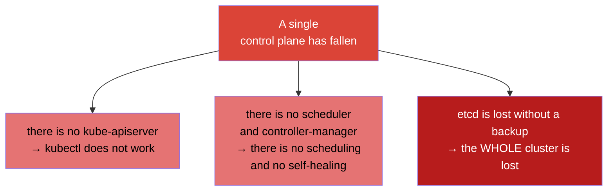
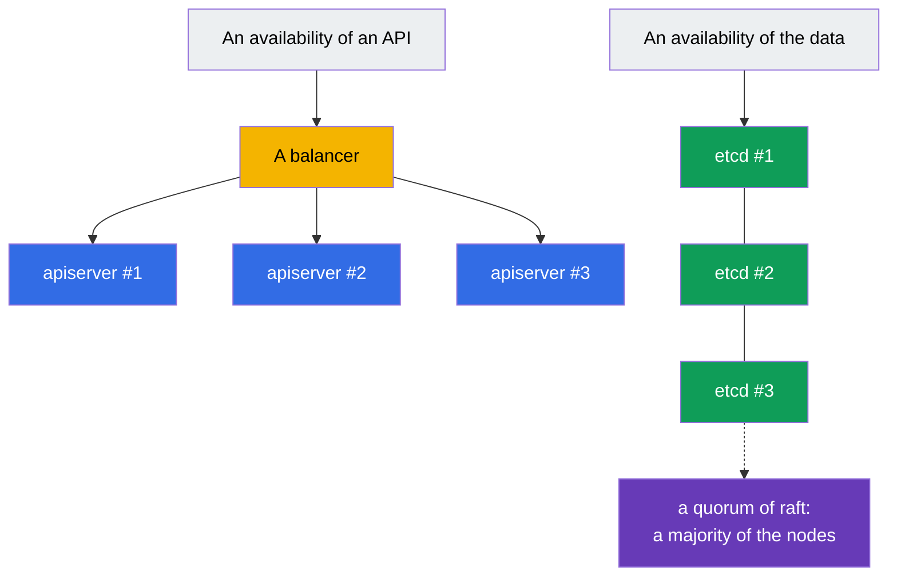
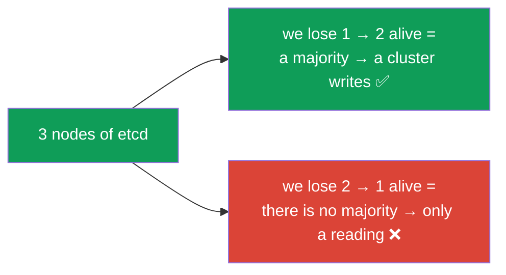
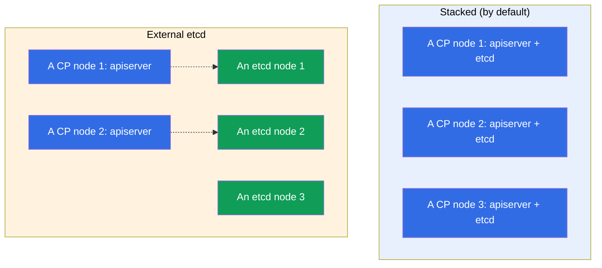
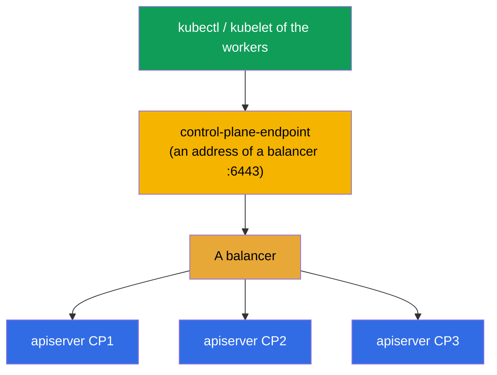
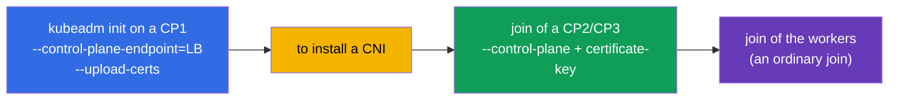

[Русская версия](ru.md) · [Versión en español](es.md) · [Version française](fr.md) · [Deutsche Version](de.md) · [ქართული ვერსია](ge.md)

# Chapter 35A. A high availability (HA): several control plane nodes, the topologies of etcd and a balancer

> 🟦 **A chapter for the CKA** (a domain Cluster Architecture, Installation & Configuration, 25%).
> For the CKAD it is not required.
>
> **What comes next.** In the chapter 35 we have assembled a cluster with a single control plane. This is normal for
> a learning and a dev, but on a prod a single control plane - a **single point of failure**: a node has fallen -
> there is no API, there is no scheduling, and at a loss of its etcd - the whole cluster is lost. We will consider, how
> to make a control plane **fault tolerant**: several control plane nodes behind a
> balancer, a quorum of etcd and two topologies (stacked / external). This leans on the
> chapters 2 (the components), 35 (kubeadm) and 37 (etcd).

## 35A.1. Why a HA control plane is needed

The worker nodes are redundant anyway: a worker has fallen - the pods will move over. But a **control plane** in a base
installation is single, and its failure means:



It is important: the **already launched pods continue to work** even at a dead control plane (kubelet on the
workers holds them). But a cluster can not be managed, nothing is recreated and is not
scaled. A HA removes this single point of failure - it makes several control plane nodes,
so that a failure of one would not drop a management.

## 35A.2. Of what a fault tolerance of a control plane consists

A HA control plane - these are two independent tasks:



- **An availability of an API.** Several instances of a `kube-apiserver` (one per control plane
  node) behind a **balancer**. An apiserver is stateless - the clients go to a single address of a
  balancer, and it throws the requests around the alive instances. A scheduler and a
  controller-manager on every node work in a mode of a **leader election** (one is active,
  the rest are in a hot reserve).
- **An availability of the data.** Several nodes of **etcd**, forming a cluster with a **quorum**
  (raft): a state is replicated, a failure of a minority of the nodes does not stop a cluster.

## 35A.3. A quorum of etcd: why an odd number

etcd uses raft and requires a **majority** of the alive nodes (a quorum) for a writing. Hence -
an odd number of the nodes (3 or 5):

| Nodes of etcd | A quorum (alive ones are needed) | Survives a failure of |
|-----------|----------------------|------------------|
| 1 | 1 | 0 (there is no HA) |
| 3 | 2 | **1** |
| 5 | 3 | **2** |
| 2 | 2 | 0 (worse, than 1!) |
| 4 | 3 | 1 (as 3, but more expensive) |



A key conclusion: an **even number of the nodes does not give a benefit** - 2 nodes survive 0 failures
(worse than one), 4 survive as much, as 3. That is why they take **3** (a standard) or
**5** (for the more critical ones). This is a classical question of a CKA interview.

## 35A.4. Two topologies of etcd: stacked and external

kubeadm supports two schemes of a placement of etcd.

**Stacked etcd** - etcd lives **on the same** control plane nodes (as a static pod, the chapter
15). It is simpler and it is by default at kubeadm.

**External etcd** - etcd is taken out to the **separate** nodes/a cluster, a control plane addresses
it over a network. It is more complex, but it isolates a failure of etcd from a failure of a control plane.



| | **Stacked** | **External** |
|--|-------------|--------------|
| A placement of etcd | on the control plane nodes | on the separate nodes |
| A number of the nodes | less (cheaper) | more (more expensive) |
| An isolation of a failure | a failure of a node = minus an apiserver **and** etcd | a failure of a CP does not touch etcd |
| A complexity | simpler (kubeadm by default) | more complex in a configuration |
| When | a majority of the self-managed clusters | the large/the critical installations |

On the CKA and in a majority of the projects they use **stacked** - a minimum of 3 control plane nodes,
on each its own etcd.

## 35A.5. A balancer and --control-plane-endpoint

The clients (`kubectl`, kubelet of the workers) have to address a control plane by **one
stable address**, and not to a concrete node - otherwise a failure of this node will break everything.
That is why in front of the apiservers they put a **balancer** (L4, a port 6443), and its address
is set to a cluster by a flag `--control-plane-endpoint` at a `kubeadm init`.



> **It is critical.** A `--control-plane-endpoint` is set **at once** at a first `kubeadm init`.
> If a cluster is initialized without it (to a concrete IP of a node), to add a second
> control plane node later is **impossible** without a recreation - an endpoint is sealed into the certificates and
> the kubeconfigs. This is a frequent expensive mistake.

A balancer is outside of Kubernetes: a cloud LB (NLB), or HAProxy/nginx, often with keepalived
and a virtual IP for a fault tolerance of a balancer itself.

## 35A.6. An assembling of a HA cluster through kubeadm

An order extends that, what we did in the chapter 35:



```bash
# 1. To initialize a FIRST control plane through an endpoint of a balancer.
#    --upload-certs puts the certificates of a control plane into a secret (for a join of the other CP).
sudo kubeadm init \
  --control-plane-endpoint "LB_DNS:6443" \
  --upload-certs \
  --pod-network-cidr=192.168.0.0/16

# 2. To install a CNI (otherwise the nodes are NotReady, the chapter 30).

# 3. To join an ADDITIONAL control plane (a kubeadm init has printed two commands):
sudo kubeadm join LB_DNS:6443 \
  --token <...> \
  --discovery-token-ca-cert-hash sha256:<...> \
  --control-plane \
  --certificate-key <a key of the certificates>

# 4. To join the worker nodes by an ordinary join (without a --control-plane).
```

If a `certificate-key` has expired (it lives ~2 hours), a new one is got on a working control plane:

```bash
sudo kubeadm init phase upload-certs --upload-certs   # will print a new certificate-key
sudo kubeadm token create --print-join-command        # a fresh command join
```

A check of a HA:

```bash
kubectl get nodes                                   # several nodes with a role control-plane
kubectl get nodes -l node-role.kubernetes.io/control-plane
# a number of the members of etcd (stacked): they look at an etcdctl member list with the certificates (the chapter 37)
```

## 35A.7. How this is applied in a production

- **A minimum of 3 control plane nodes.** The prod clusters are almost always HA: 3 (or 5) control plane
  nodes in the different availability zones, in order to survive a failure of a node and of a whole zone.
- **etcd in the different zones, but with a look at a latency.** etcd is sensitive to a delay
  of a disk and of a network between the nodes; the zones have to be close (one region), otherwise a quorum slows down.
- **A balancer is redundant too.** A LB itself should not be a point of failure: a cloud LB
  is distributed over the zones, on-prem - HAProxy + keepalived with a virtual IP.
- **The managed clusters (EKS/GKE/AKS) are HA by default.** There a control plane and etcd
  are fault tolerant by the forces of a provider - you pay for this and do not manage etcd directly.
  A manual HA kubeadm is actual for a self-managed/an on-prem (and for the CKA).
- **A `--control-plane-endpoint` from a first day.** Even if you start with one node, but
  plan a growth up to a HA, initialize through an endpoint of a balancer at once - otherwise
  a transition into a HA will require a recreation of a cluster.

## 35A.8. A mini glossary

- **HA (high availability)** - a fault tolerance: a failure of one node does not drop a service.
- **SPOF** - a single point of failure; a HA eliminates it.
- **a quorum** - a majority of the nodes of etcd, needed for a writing (raft); hence an odd number.
- **a leader election** - a choice of an active instance of a scheduler/a controller-manager (the rest are in a reserve).
- **stacked etcd** - etcd on the control plane nodes themselves (by default at kubeadm).
- **external etcd** - etcd on the separate nodes, isolated from a control plane.
- **--control-plane-endpoint** - a stable address of a control plane (a balancer); it is set at an init.
- **--upload-certs / certificate-key** - a mechanism of a transfer of the certificates at a join of the control plane nodes.
- **a balancer (LB)** - distributes the requests to the apiservers; L4, a port 6443.

## 35A.9. The results of a chapter

- A single control plane - a single point of failure: without it there is no management, and without a backup of etcd -
  the whole cluster is lost (the launched pods at this continue to work).
- A HA control plane = an availability of an API (several apiserver behind a balancer, a leader
  election for a scheduler/a CM) + an availability of the data (a cluster of etcd with a quorum).
- etcd requires a quorum (raft): they take an odd number of the nodes (3 or 5); 3 survives 1
  failure, 5 - two; an even number is not profitable.
- Two topologies: stacked (etcd on the control plane nodes, by default) and external (etcd
  separately, isolates a failure, more expensive).
- A balancer in front of the apiservers + a `--control-plane-endpoint` at an init - are obligatory
  for a HA; an endpoint is set at once, otherwise a transition into a HA requires a recreation.
- An assembling: a `kubeadm init --control-plane-endpoint --upload-certs` → a CNI → a join of the other CP
  with a `--control-plane --certificate-key` → a join of the workers.

## 35A.10. How this will come in handy: on an exam and in a real work

**On an exam (CKA).** A full-fledged assembling of a HA on an exam is built rarely (there is little time), but
the concepts are asked and applied: why an odd number of etcd, in what stacked differs from
external, why a `--control-plane-endpoint`, how to join a second control plane. This is
a part of a domain Installation (25%) and of an understanding of an architecture (the chapter 2).

**In a real work.** Any prod cluster is a HA. An understanding of a quorum of etcd, of the topologies, of a
balancer and of a correct `--control-plane-endpoint` from a first day directly determines,
whether a cluster will survive a failure of a node or of a zone. A mistake "we have initialized without an endpoint" - is expensive
and frequent.

## 35A.11. The questions for a self-check

1. What stops working at a failure of a single control plane, and what continues?
2. Of which two parts does a fault tolerance of a control plane consist?
3. Why is a number of the nodes of etcd taken odd? How many failures do 3 and 5 nodes survive?
4. In what does a stacked topology of etcd differ from an external one? The pluses and the minuses of each.
5. Why is a balancer and a `--control-plane-endpoint` needed? Why is it set at once at an init?
6. Describe the steps of an assembling of a HA cluster kubeadm and in what a join of a control plane node differs from a join of a worker.

## Practice

We have considered, how to remove a single point of failure of a control plane. To work out a joining of a
second control plane node and to check a quorum of etcd one can in the lab 124. Further (the chapter 36) -
a safe update of a cluster.

🧪 A lab 124 (a HA control plane): [tasks/cka/labs/124](../../labs/124/README.MD)

---
[Contents](../README.md) · [Chapter 35](../35/README.md) · [Chapter 36](../36/README.md)
