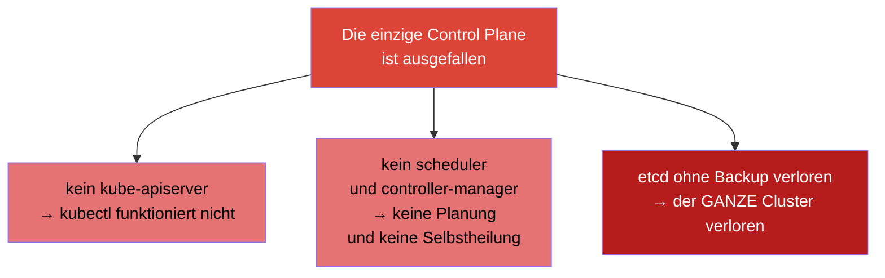
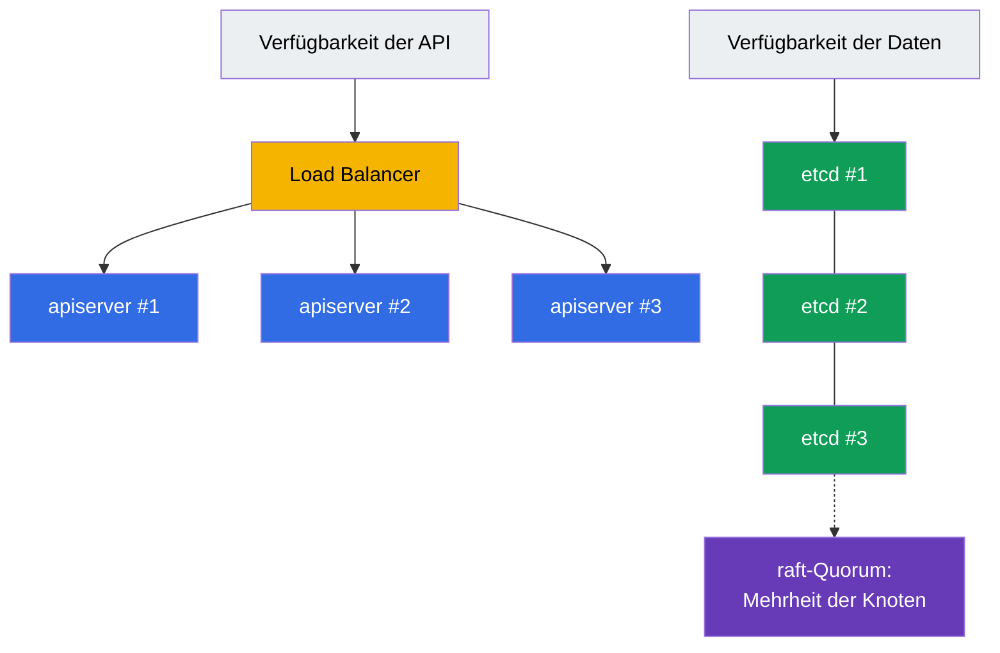
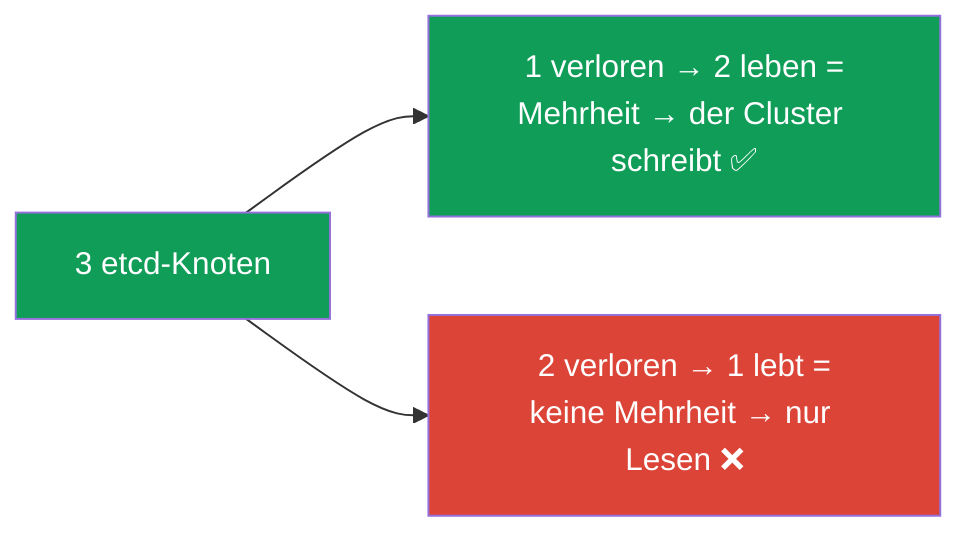
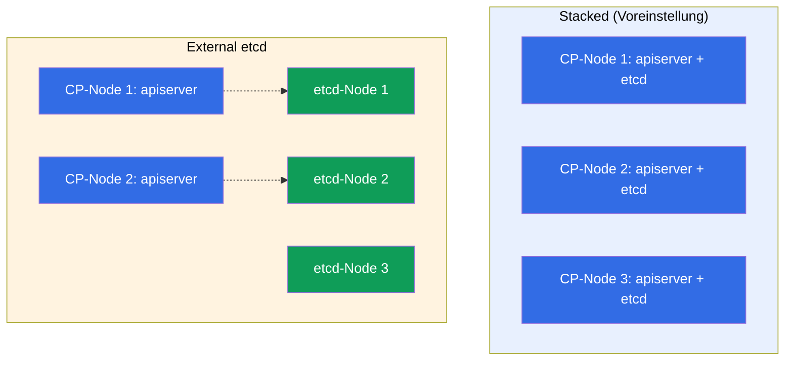
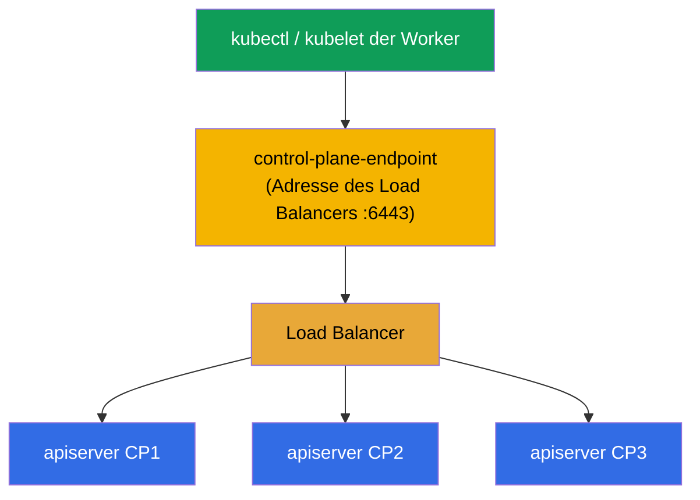
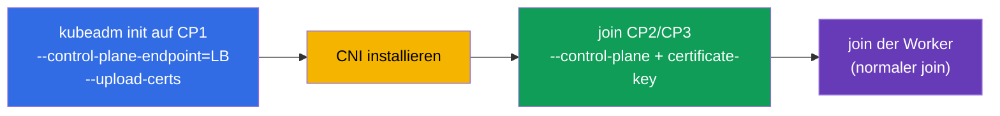

[Русская версия](ru.md) · [Eng version](README.md) · [Versión en español](es.md) · [Version française](fr.md) · [ქართული ვერსია](ge.md)

# Kapitel 35A. Hochverfügbarkeit (HA): mehrere Control-Plane-Nodes, etcd-Topologien und Load Balancer

> 🟦 **Kapitel für CKA** (Domäne Cluster Architecture, Installation & Configuration, 25%).
> Für CKAD nicht erforderlich.
>
> **Was kommt.** In Kapitel 35 haben wir einen Cluster mit einer Control Plane aufgebaut. Für
> das Lernen und dev ist das in Ordnung, aber in der Produktion ist eine einzige Control Plane
> ein **Single Point of Failure**: fällt die Node aus - keine API, keine Planung, und beim
> Verlust ihres etcd ist der ganze Cluster verloren. Wir schauen uns an, wie man die Control
> Plane **ausfallsicher** macht: mehrere Control-Plane-Nodes hinter einem Load Balancer, das
> Quorum von etcd und zwei Topologien (stacked / external). Das baut auf den Kapiteln 2
> (Komponenten), 35 (kubeadm) und 37 (etcd) auf.

## 35A.1. Wozu eine HA Control Plane

Worker-Nodes sind ohnehin redundant: fällt ein Worker aus, ziehen die Pods um. Aber die
**Control Plane** ist in der Basisinstallation einzeln, und ihr Ausfall bedeutet:



Wichtig: **schon laufende Pods arbeiten weiter**, auch bei toter Control Plane (das kubelet
auf den Workern hält sie). Aber der Cluster lässt sich nicht steuern, nichts wird neu erstellt
und nichts skaliert. HA beseitigt diesen Single Point of Failure - es gibt mehrere
Control-Plane-Nodes, damit der Ausfall einer davon die Steuerung nicht umlegt.

## 35A.2. Woraus sich die Ausfallsicherheit der Control Plane zusammensetzt

Eine HA Control Plane sind zwei unabhängige Aufgaben:



- **Verfügbarkeit der API.** Mehrere Instanzen von `kube-apiserver` (eine pro
  Control-Plane-Node) hinter einem **Load Balancer**. Der apiserver ist stateless - die
  Clients gehen auf die eine Adresse des Load Balancers, und er verteilt die Anfragen auf die
  lebenden Instanzen. scheduler und controller-manager arbeiten auf jeder Node im Modus
  **leader election** (einer ist aktiv, die übrigen in heißer Reserve).
- **Verfügbarkeit der Daten.** Mehrere **etcd**-Knoten, die einen Cluster mit **Quorum**
  bilden (raft): der Zustand wird repliziert, der Ausfall einer Minderheit der Knoten hält den
  Cluster nicht an.

## 35A.3. Quorum von etcd: warum eine ungerade Anzahl

etcd nutzt raft und verlangt für Schreibvorgänge die **Mehrheit** der lebenden Knoten (das
Quorum). Daher die ungerade Anzahl von Knoten (3 oder 5):

| etcd-Knoten | Quorum (lebende nötig) | Übersteht Ausfall von |
|-----------|----------------------|------------------|
| 1 | 1 | 0 (kein HA) |
| 3 | 2 | **1** |
| 5 | 3 | **2** |
| 2 | 2 | 0 (schlechter als 1!) |
| 4 | 3 | 1 (wie 3, aber teurer) |



Die zentrale Erkenntnis: **eine gerade Anzahl von Knoten bringt keinen Vorteil** - 2 Knoten
überstehen 0 Ausfälle (schlechter als einer), 4 überstehen genauso viele wie 3. Deshalb nimmt
man **3** (Standard) oder **5** (für kritischere Fälle). Das ist eine klassische Frage im
CKA-Interview.

## 35A.4. Zwei etcd-Topologien: stacked und external

kubeadm unterstützt zwei Schemata für die Platzierung von etcd.

**Stacked etcd** - etcd lebt **auf denselben** Control-Plane-Nodes (als static pod, Kapitel
15). Einfacher und bei kubeadm die Voreinstellung.

**External etcd** - etcd ist auf **separate** Nodes/einen separaten Cluster ausgelagert, die
Control Plane spricht ihn über das Netz an. Aufwendiger, isoliert aber den Ausfall von etcd
vom Ausfall der Control Plane.



| | **Stacked** | **External** |
|--|-------------|--------------|
| Platzierung von etcd | auf den Control-Plane-Nodes | auf separaten Nodes |
| Anzahl der Nodes | weniger (günstiger) | mehr (teurer) |
| Isolation des Ausfalls | Ausfall der Node = minus apiserver **und** etcd | Ausfall der CP berührt etcd nicht |
| Komplexität | einfacher (kubeadm-Voreinstellung) | aufwendiger einzurichten |
| Wann | die meisten self-managed Cluster | große/kritische Installationen |

In der CKA und in den meisten Projekten nutzt man **stacked** - mindestens 3
Control-Plane-Nodes, auf jeder ein eigenes etcd.

## 35A.5. Load Balancer und --control-plane-endpoint

Die Clients (`kubectl`, das kubelet der Worker) müssen die Control Plane über **eine stabile
Adresse** ansprechen und nicht über eine konkrete Node - sonst zerstört der Ausfall dieser
Node alles. Deshalb setzt man vor die apiserver einen **Load Balancer** (L4, Port 6443) und
gibt dem Cluster dessen Adresse mit dem Flag `--control-plane-endpoint` bei `kubeadm init`.



> **Kritisch.** `--control-plane-endpoint` setzt man **sofort** beim ersten `kubeadm init`.
> Wenn Sie den Cluster ohne es initialisieren (auf die IP einer konkreten Node), können Sie
> später **nicht** ohne Neuaufbau eine zweite Control-Plane-Node hinzufügen - der endpoint
> steckt in den Zertifikaten und kubeconfigs. Das ist ein häufiger und teurer Fehler.

Der Load Balancer liegt außerhalb von Kubernetes: ein Cloud-LB (NLB) oder HAProxy/nginx, oft
mit keepalived und einer virtuellen IP für die Ausfallsicherheit des Load Balancers selbst.

## 35A.6. Aufbau eines HA-Clusters mit kubeadm

Die Reihenfolge erweitert das, was wir in Kapitel 35 gemacht haben:



```bash
# 1. Die ERSTE Control Plane über den endpoint des Load Balancers initialisieren.
#    --upload-certs legt die Zertifikate der Control Plane in ein secret (für den join weiterer CP).
sudo kubeadm init \
  --control-plane-endpoint "LB_DNS:6443" \
  --upload-certs \
  --pod-network-cidr=192.168.0.0/16

# 2. CNI installieren (sonst sind die Nodes NotReady, Kapitel 30).

# 3. Eine ZUSÄTZLICHE Control Plane anschließen (kubeadm init hat zwei Befehle ausgegeben):
sudo kubeadm join LB_DNS:6443 \
  --token <...> \
  --discovery-token-ca-cert-hash sha256:<...> \
  --control-plane \
  --certificate-key <Zertifikatsschlüssel>

# 4. Die Worker-Nodes mit dem normalen join anschließen (ohne --control-plane).
```

Wenn der `certificate-key` abgelaufen ist (er lebt ~2 Stunden), holt man sich auf einer
funktionierenden Control Plane einen neuen:

```bash
sudo kubeadm init phase upload-certs --upload-certs   # gibt einen neuen certificate-key aus
sudo kubeadm token create --print-join-command        # frischer join-Befehl
```

Prüfung von HA:

```bash
kubectl get nodes                                   # mehrere Nodes mit der Rolle control-plane
kubectl get nodes -l node-role.kubernetes.io/control-plane
# Anzahl der etcd-Mitglieder (stacked): über etcdctl member list mit Zertifikaten (Kapitel 37)
```

## 35A.7. Wie man das in der Produktion anwendet

- **Mindestens 3 Control-Plane-Nodes.** Prod-Cluster sind fast immer HA: 3 (oder 5)
  Control-Plane-Nodes in verschiedenen Availability Zones, um den Ausfall einer Node und einer
  ganzen Zone zu überstehen.
- **etcd in verschiedenen Zonen, aber mit Blick auf die Latenz.** etcd ist empfindlich
  gegenüber der Latenz von Platte und Netz zwischen den Knoten; die Zonen müssen nah sein (eine
  Region), sonst wird das Quorum langsam.
- **Der Load Balancer ist ebenfalls redundant.** Der LB selbst darf kein Single Point of
  Failure sein: ein Cloud-LB ist über die Zonen verteilt, on-prem nimmt man HAProxy +
  keepalived mit virtueller IP.
- **Managed Cluster (EKS/GKE/AKS) sind standardmäßig HA.** Dort sind Control Plane und etcd
  durch den Provider ausfallsicher - Sie zahlen dafür und verwalten etcd nicht direkt. Manuelles
  HA-kubeadm ist relevant für self-managed/on-prem (und für die CKA).
- **`--control-plane-endpoint` vom ersten Tag an.** Auch wenn Sie mit einer Node starten, aber
  Wachstum zu HA planen, initialisieren Sie sofort über den endpoint des Load Balancers - sonst
  verlangt der Wechsel zu HA einen Neuaufbau des Clusters.

## 35A.8. Mini-Glossar

- **HA (high availability)** - Ausfallsicherheit: der Ausfall eines Knotens legt den Dienst nicht um.
- **SPOF** - Single Point of Failure; HA beseitigt ihn.
- **Quorum** - die Mehrheit der etcd-Knoten, die zum Schreiben nötig ist (raft); daher die ungerade Anzahl.
- **leader election** - Auswahl der aktiven Instanz von scheduler/controller-manager (die übrigen in Reserve).
- **stacked etcd** - etcd auf den Control-Plane-Nodes selbst (kubeadm-Voreinstellung).
- **external etcd** - etcd auf separaten Nodes, isoliert von der Control Plane.
- **--control-plane-endpoint** - stabile Adresse der Control Plane (Load Balancer); wird bei init gesetzt.
- **--upload-certs / certificate-key** - Mechanismus zur Übergabe der Zertifikate beim join von Control-Plane-Nodes.
- **Load Balancer (LB)** - verteilt die Anfragen auf die apiserver; L4, Port 6443.

## 35A.9. Zusammenfassung des Kapitels

- Eine einzige Control Plane ist ein Single Point of Failure: ohne sie gibt es keine Steuerung,
  und ohne etcd-Backup ist der ganze Cluster verloren (die laufenden Pods arbeiten dabei weiter).
- HA Control Plane = Verfügbarkeit der API (mehrere apiserver hinter einem Load Balancer, leader
  election für scheduler/CM) + Verfügbarkeit der Daten (etcd-Cluster mit Quorum).
- etcd verlangt ein Quorum (raft): man nimmt eine ungerade Anzahl von Knoten (3 oder 5); 3
  übersteht 1 Ausfall, 5 - zwei; eine gerade Anzahl bringt nichts.
- Zwei Topologien: stacked (etcd auf den Control-Plane-Nodes, Voreinstellung) und external (etcd
  separat, isoliert den Ausfall, teurer).
- Ein Load Balancer vor den apiserver + `--control-plane-endpoint` bei init sind für HA
  zwingend; den endpoint setzt man sofort, sonst verlangt der Wechsel zu HA einen Neuaufbau.
- Aufbau: `kubeadm init --control-plane-endpoint --upload-certs` → CNI → join der weiteren CP
  mit `--control-plane --certificate-key` → join der Worker.

## 35A.10. Wofür das nützlich ist: in der Prüfung und in der echten Arbeit

**In der Prüfung (CKA).** Einen vollständigen HA-Aufbau baut man in der Prüfung selten (zu wenig
Zeit), aber die Konzepte werden gefragt und angewendet: warum eine ungerade Anzahl von etcd,
wodurch sich stacked von external unterscheidet, wozu `--control-plane-endpoint` dient, wie man
eine zweite Control Plane anschließt. Das ist Teil der Domäne Installation (25%) und des
Architekturverständnisses (Kapitel 2).

**In der echten Arbeit.** Jeder Prod-Cluster ist HA. Das Verständnis des etcd-Quorums, der
Topologien, des Load Balancers und eines korrekten `--control-plane-endpoint` vom ersten Tag an
entscheidet direkt darüber, ob der Cluster den Ausfall einer Node oder einer Zone übersteht. Der
Fehler „ohne endpoint initialisiert“ ist teuer und häufig.

## 35A.11. Fragen zur Selbstüberprüfung

1. Was hört beim Ausfall der einzigen Control Plane auf zu funktionieren und was arbeitet weiter?
2. Aus welchen zwei Teilen setzt sich die Ausfallsicherheit der Control Plane zusammen?
3. Warum nimmt man eine ungerade Anzahl von etcd-Knoten? Wie viele Ausfälle überstehen 3 und 5 Knoten?
4. Wodurch unterscheidet sich die stacked-Topologie von external? Vor- und Nachteile jeder.
5. Wozu dienen der Load Balancer und `--control-plane-endpoint`? Warum setzt man ihn sofort bei init?
6. Beschreiben Sie die Schritte zum Aufbau eines HA-Clusters mit kubeadm und wodurch sich der join einer Control-Plane-Node vom join eines Workers unterscheidet.

## Praxis

Wir haben behandelt, wie man den Single Point of Failure der Control Plane beseitigt. Den
Anschluss einer zweiten Control-Plane-Node üben und das etcd-Quorum prüfen kann man im Lab 124.
Weiter (Kapitel 36) - das sichere Upgrade des Clusters.

🧪 Lab 124 (HA Control Plane): [tasks/cka/labs/124](../../labs/124/README_DE.MD)

---
[Inhalt](../README_DE.md) · [Kapitel 35](../35/de.md) · [Kapitel 36](../36/de.md)
