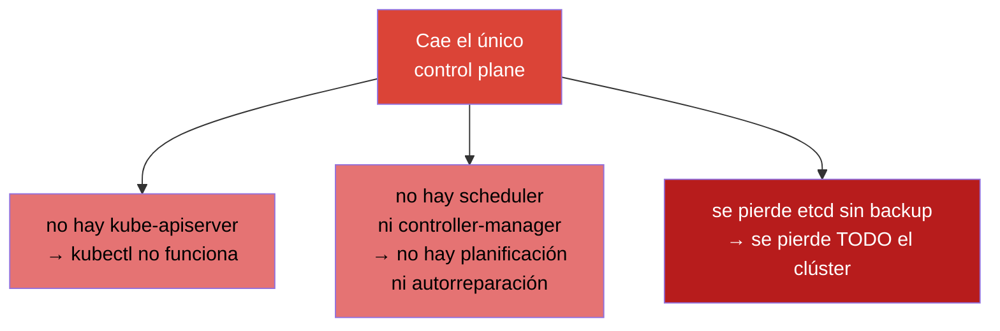
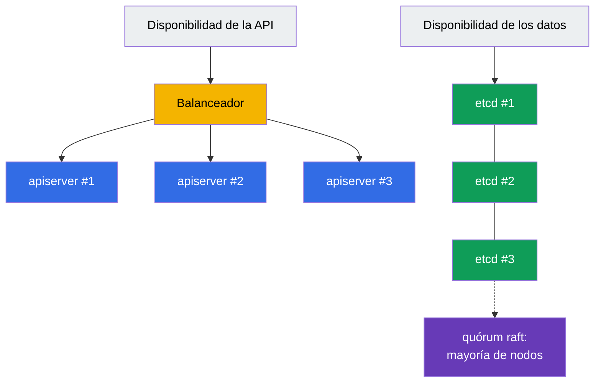
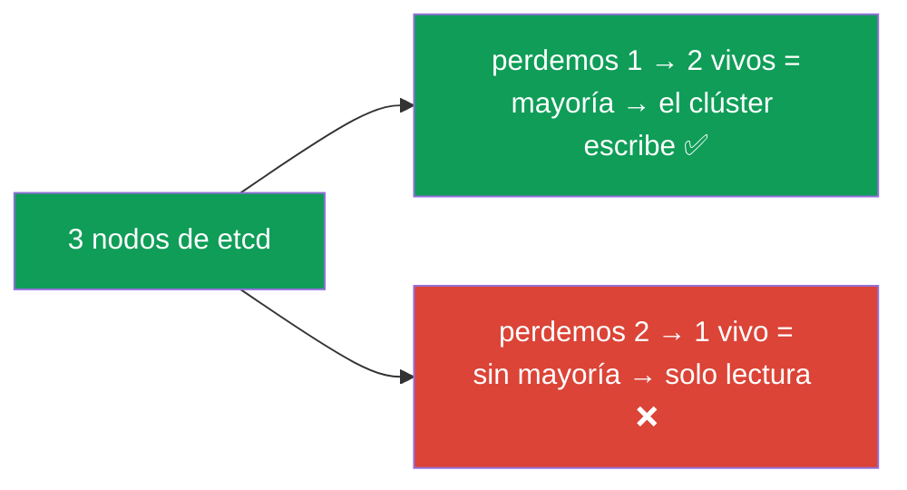
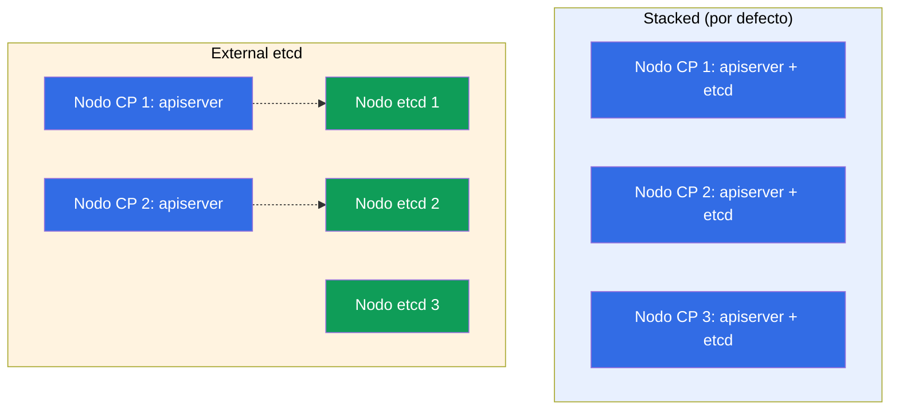
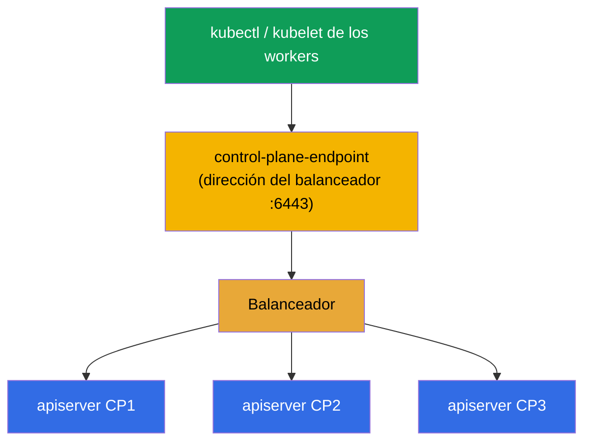
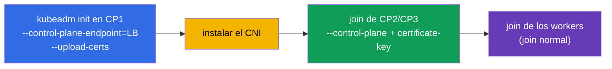

[Русская версия](ru.md) · [Eng version](README.md) · [Version française](fr.md) · [Deutsche Version](de.md) · [ქართული ვერსია](ge.md) · [繁體中文版](tw.md) · [日本語版](jp.md)

# Capítulo 35A. Alta disponibilidad (HA): varios nodos de control plane, topologías de etcd y balanceador

> 🟦 **Capítulo para CKA** (dominio Cluster Architecture, Installation & Configuration, 25%).
> Para CKAD no es necesario.
>
> **Qué viene ahora.** En el capítulo 35 montamos un clúster con un solo control plane. Eso está
> bien para aprender y para dev, pero en producción un único control plane es un **punto único de
> fallo**: si el nodo cae, no hay API, no hay planificación y, si se pierde su etcd, se pierde todo
> el clúster. Veremos cómo hacer el control plane **tolerante a fallos**: varios nodos de control
> plane detrás de un balanceador, el quórum de etcd y dos topologías (stacked / external). Esto se
> apoya en los capítulos 2 (componentes), 35 (kubeadm) y 37 (etcd).

## 35A.1. Para qué sirve un control plane en HA

Los nodos worker ya son redundantes: si cae un worker, los pods se mudan. Pero el **control plane**
en la instalación básica es único, y su caída significa:



Importante: **los pods ya arrancados siguen funcionando** incluso con el control plane muerto (los
mantiene el kubelet en los workers). Pero el clúster no se puede gestionar, nada se recrea ni se
escala. El HA elimina ese punto único de fallo: pone varios nodos de control plane para que la
caída de uno no tumbe la gestión.

## 35A.2. De qué se compone la tolerancia a fallos del control plane

Un control plane en HA son dos tareas independientes:



- **Disponibilidad de la API.** Varias instancias de `kube-apiserver` (una por nodo de control
  plane) detrás de un **balanceador**. El apiserver es stateless: los clientes van a la única
  dirección del balanceador y este reparte las peticiones entre las instancias vivas. El scheduler
  y el controller-manager de cada nodo trabajan en modo **leader election** (uno activo, el resto
  en reserva caliente).
- **Disponibilidad de los datos.** Varios nodos de **etcd** formando un clúster con **quórum**
  (raft): el estado se replica y la caída de una minoría de nodos no detiene el clúster.

## 35A.3. Quórum de etcd: por qué un número impar

etcd usa raft y exige la **mayoría** de nodos vivos (el quórum) para escribir. De ahí sale el
número impar de nodos (3 o 5):

| Nodos de etcd | Quórum (vivos necesarios) | Fallos que sobrevive |
|-----------|----------------------|------------------|
| 1 | 1 | 0 (sin HA) |
| 3 | 2 | **1** |
| 5 | 3 | **2** |
| 2 | 2 | 0 (¡peor que 1!) |
| 4 | 3 | 1 (igual que 3, pero más caro) |



Conclusión clave: **un número par de nodos no aporta ventaja** - 2 nodos sobreviven 0 fallos (peor
que uno), 4 sobreviven los mismos que 3. Por eso se toman **3** (el estándar) o **5** (para casos
más críticos). Es una pregunta clásica de entrevista y del CKA.

## 35A.4. Dos topologías de etcd: stacked y external

kubeadm soporta dos esquemas de ubicación de etcd.

**Stacked etcd** - etcd vive **en los mismos** nodos de control plane (como static pod, capítulo
15). Más simple y es lo que hace kubeadm por defecto.

**External etcd** - etcd se lleva a nodos/clúster **aparte**, y el control plane se dirige a él por
red. Más complejo, pero aísla el fallo de etcd del fallo del control plane.



| | **Stacked** | **External** |
|--|-------------|--------------|
| Ubicación de etcd | en los nodos de control plane | en nodos aparte |
| Número de nodos | menos (más barato) | más (más caro) |
| Aislamiento del fallo | caída del nodo = menos apiserver **y** etcd | la caída del CP no toca etcd |
| Complejidad | más simple (kubeadm por defecto) | más difícil de configurar |
| Cuándo | la mayoría de clústeres self-managed | instalaciones grandes/críticas |

En el CKA y en la mayoría de proyectos se usa **stacked**: mínimo 3 nodos de control plane, cada
uno con su etcd.

## 35A.5. El balanceador y --control-plane-endpoint

Los clientes (`kubectl`, el kubelet de los workers) deben dirigirse al control plane por una **sola
dirección estable**, no a un nodo concreto: si no, la caída de ese nodo rompe todo. Por eso delante
de los apiserver se pone un **balanceador** (L4, puerto 6443), y su dirección se le indica al
clúster con el flag `--control-plane-endpoint` en `kubeadm init`.



> **Crítico.** `--control-plane-endpoint` se define **desde el primer** `kubeadm init`. Si
> inicializa el clúster sin él (apuntando a la IP de un nodo concreto), después **no podrá** añadir
> un segundo nodo de control plane sin recrear el clúster: el endpoint queda grabado en los
> certificados y en los kubeconfig. Es un error frecuente y caro.

El balanceador está fuera de Kubernetes: un LB de la nube (NLB), o HAProxy/nginx, a menudo con
keepalived y una IP virtual para que el propio balanceador sea tolerante a fallos.

## 35A.6. Montar un clúster HA con kubeadm

El orden amplía lo que hicimos en el capítulo 35:



```bash
# 1. Inicializar el PRIMER control plane a través del endpoint del balanceador.
#    --upload-certs guarda los certificados del control plane en un secret (para el join de otros CP).
sudo kubeadm init \
  --control-plane-endpoint "LB_DNS:6443" \
  --upload-certs \
  --pod-network-cidr=192.168.0.0/16

# 2. Instalar el CNI (si no, los nodos quedan NotReady, capítulo 30).

# 3. Unir un control plane ADICIONAL (kubeadm init imprimió dos comandos):
sudo kubeadm join LB_DNS:6443 \
  --token <...> \
  --discovery-token-ca-cert-hash sha256:<...> \
  --control-plane \
  --certificate-key <clave-de-certificados>

# 4. Unir los nodos worker con el join normal (sin --control-plane).
```

Si el `certificate-key` ha caducado (vive ~2 horas), se obtiene uno nuevo en un control plane que
funcione:

```bash
sudo kubeadm init phase upload-certs --upload-certs   # imprimirá un nuevo certificate-key
sudo kubeadm token create --print-join-command        # comando join reciente
```

Comprobación del HA:

```bash
kubectl get nodes                                   # varios nodos con el rol control-plane
kubectl get nodes -l node-role.kubernetes.io/control-plane
# número de miembros de etcd (stacked): se ve con etcdctl member list y los certificados (capítulo 37)
```

## 35A.7. Cómo se aplica esto en producción

- **Mínimo 3 nodos de control plane.** Los clústeres de producción casi siempre son HA: 3 (o 5)
  nodos de control plane en zonas de disponibilidad distintas, para sobrevivir a la caída de un
  nodo y de una zona entera.
- **etcd en zonas distintas, pero mirando la latencia.** etcd es sensible al retardo del disco y de
  la red entre nodos; las zonas deben estar cerca (una misma región), o el quórum se ralentiza.
- **El balanceador también es redundante.** El propio LB no debe ser un punto de fallo: el LB de la
  nube está distribuido por zonas y, on-prem, se usa HAProxy + keepalived con una IP virtual.
- **Los clústeres gestionados (EKS/GKE/AKS) son HA por defecto.** Allí el control plane y etcd son
  tolerantes a fallos por parte del proveedor: usted paga por ello y no gestiona etcd directamente.
  El HA manual con kubeadm sigue siendo relevante para self-managed/on-prem (y para el CKA).
- **`--control-plane-endpoint` desde el primer día.** Incluso si arranca con un solo nodo pero
  planea crecer a HA, inicialice a través del endpoint del balanceador desde el principio: si no,
  pasar a HA exigirá recrear el clúster.

## 35A.8. Mini-glosario

- **HA (high availability)** - tolerancia a fallos: la caída de un nodo no tumba el servicio.
- **SPOF** - punto único de fallo (single point of failure); el HA lo elimina.
- **quórum** - mayoría de nodos de etcd necesaria para escribir (raft); de ahí el número impar.
- **leader election** - elección de la instancia activa del scheduler/controller-manager (el resto en reserva).
- **stacked etcd** - etcd en los propios nodos de control plane (por defecto en kubeadm).
- **external etcd** - etcd en nodos aparte, aislado del control plane.
- **--control-plane-endpoint** - dirección estable del control plane (el balanceador); se define en el init.
- **--upload-certs / certificate-key** - mecanismo de traspaso de los certificados en el join de nodos de control plane.
- **balanceador (LB)** - reparte las peticiones entre los apiserver; L4, puerto 6443.

## 35A.9. Resumen del capítulo

- Un solo control plane es un punto único de fallo: sin él no hay gestión y, sin backup de etcd, se
  pierde todo el clúster (los pods arrancados, mientras tanto, siguen funcionando).
- Control plane en HA = disponibilidad de la API (varios apiserver detrás de un balanceador, leader
  election para scheduler/CM) + disponibilidad de los datos (clúster de etcd con quórum).
- etcd exige quórum (raft): se toma un número impar de nodos (3 o 5); 3 sobrevive a 1 fallo, 5 a
  dos; el número par no conviene.
- Dos topologías: stacked (etcd en los nodos de control plane, por defecto) y external (etcd
  aparte, aísla el fallo, más caro).
- El balanceador delante de los apiserver + `--control-plane-endpoint` en el init son obligatorios
  para el HA; el endpoint se define desde el principio, o pasar a HA exigirá recrear el clúster.
- Montaje: `kubeadm init --control-plane-endpoint --upload-certs` → CNI → join de los otros CP con
  `--control-plane --certificate-key` → join de los workers.

## 35A.10. Para qué sirve esto: en el examen y en el trabajo real

**En el examen (CKA).** Un montaje completo de HA se construye pocas veces en el examen (hay poco
tiempo), pero los conceptos se preguntan y se aplican: por qué un número impar de nodos de etcd, en
qué se diferencia stacked de external, para qué sirve `--control-plane-endpoint`, cómo unir un
segundo control plane. Es parte del dominio Installation (25%) y de entender la arquitectura
(capítulo 2).

**En el trabajo real.** Cualquier clúster de producción es HA. Entender el quórum de etcd, las
topologías, el balanceador y un `--control-plane-endpoint` correcto desde el primer día determina
directamente si el clúster sobrevivirá a la caída de un nodo o de una zona. El error de «lo
inicializamos sin endpoint» es caro y frecuente.

## 35A.11. Preguntas de autocomprobación

1. ¿Qué deja de funcionar cuando cae el único control plane y qué sigue funcionando?
2. ¿De qué dos partes se compone la tolerancia a fallos del control plane?
3. ¿Por qué el número de nodos de etcd se toma impar? ¿A cuántos fallos sobreviven 3 y 5 nodos?
4. ¿En qué se diferencia la topología stacked de etcd de la external? Ventajas e inconvenientes de cada una.
5. ¿Para qué sirven el balanceador y `--control-plane-endpoint`? ¿Por qué se define desde el init?
6. Describa los pasos para montar un clúster HA con kubeadm y en qué se diferencia el join de un nodo de control plane del join de un worker.

## Práctica

Hemos visto cómo eliminar el punto único de fallo del control plane. Practicar la unión de un
segundo nodo de control plane y comprobar el quórum de etcd se puede hacer en el laboratorio 124.
Después (capítulo 36) viene la actualización segura del clúster.

🧪 Laboratorio 124 (control plane en HA): [tasks/cka/labs/124](../../labs/124/README_ES.MD)

---
[Índice](../README_ES.md) · [Capítulo 35](../35/es.md) · [Capítulo 36](../36/es.md)
