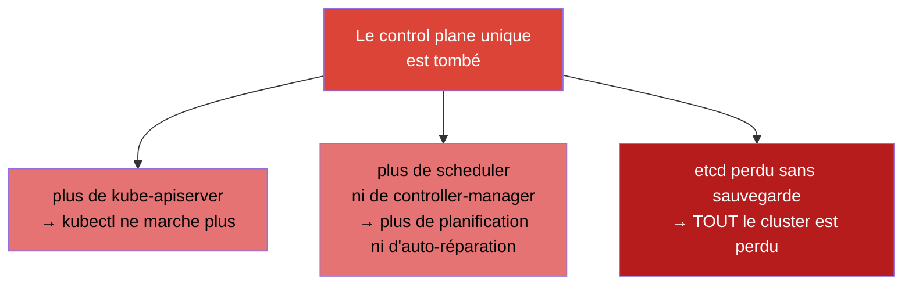
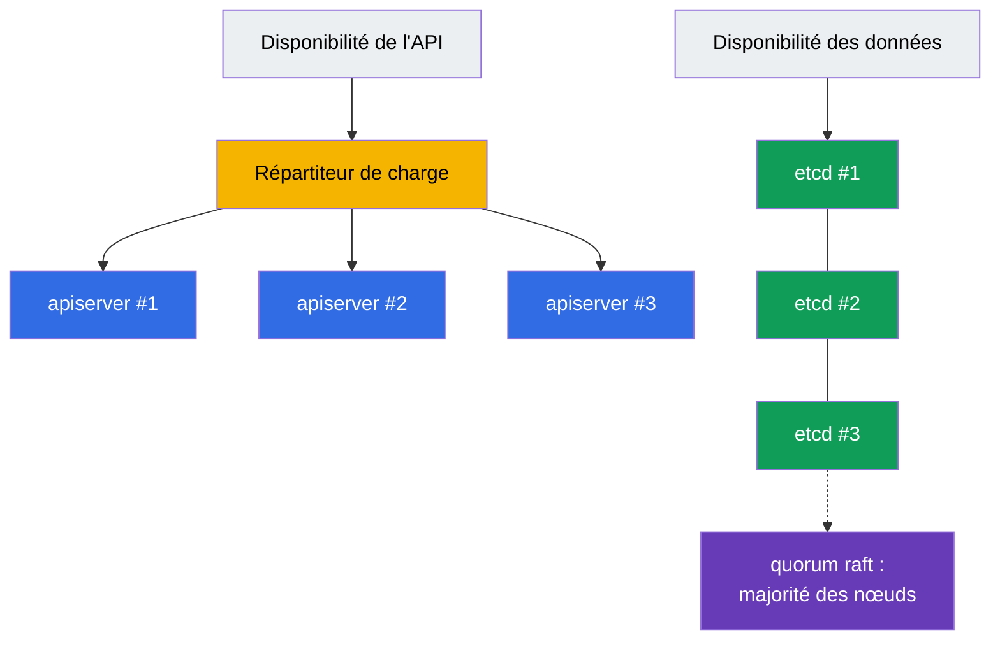
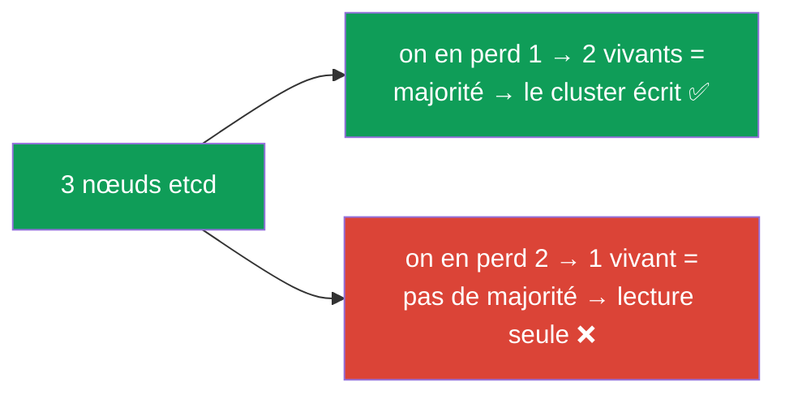
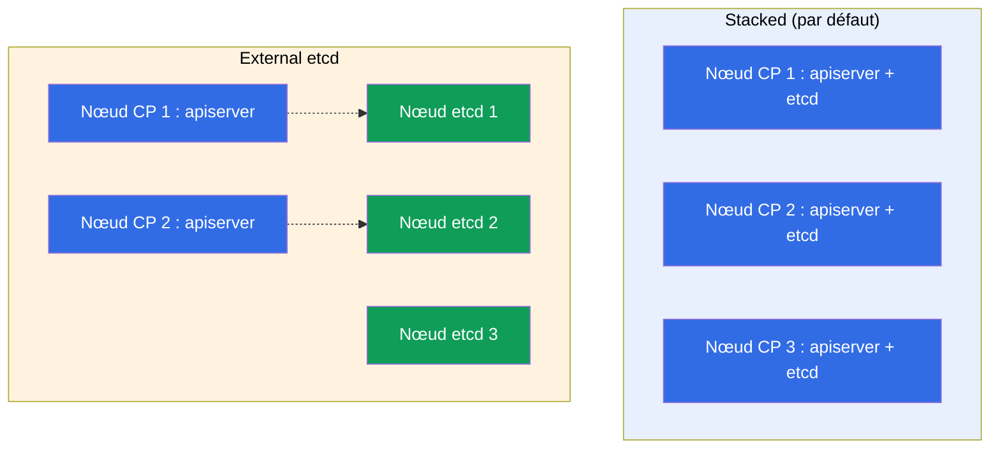
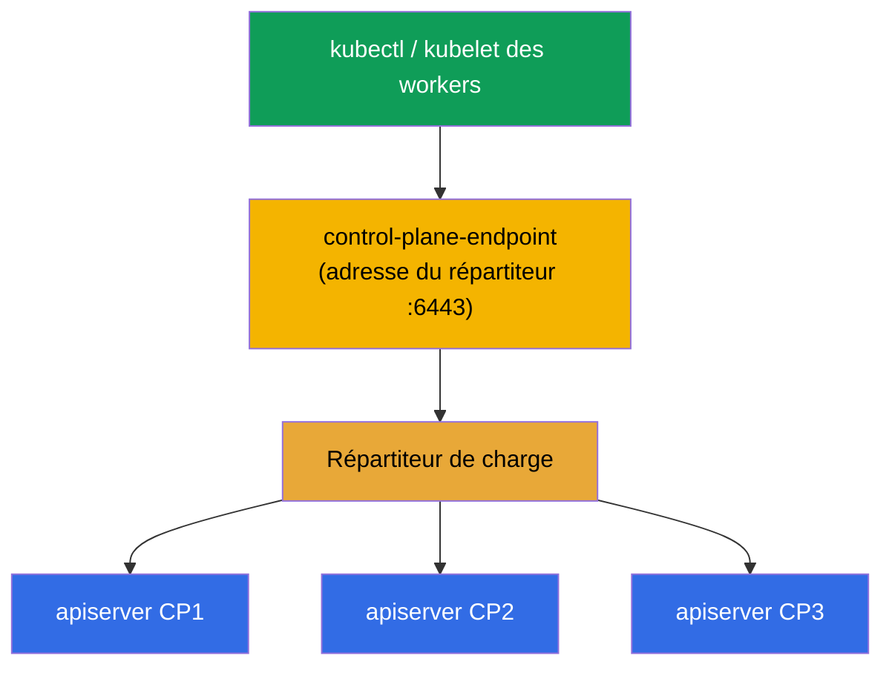
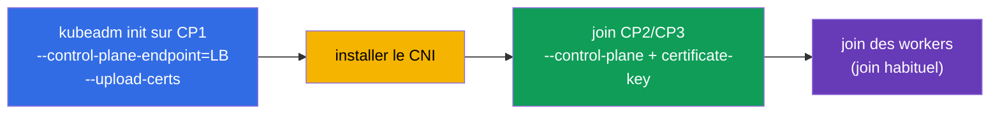

[Русская версия](ru.md) · [Eng version](README.md) · [Versión en español](es.md) · [Deutsche Version](de.md) · [ქართული ვერსია](ge.md)

# Chapitre 35A. Haute disponibilité (HA) : plusieurs nœuds control plane, topologies etcd et répartiteur de charge

> 🟦 **Chapitre pour le CKA** (domaine Cluster Architecture, Installation & Configuration, 25 %).
> Non requis pour le CKAD.
>
> **Ce qui suit.** Au chapitre 35 nous avons monté un cluster avec un seul control plane. C'est
> acceptable pour l'apprentissage et le dev, mais en production un control plane unique est un
> **point de défaillance unique** : le nœud tombe - plus d'API, plus de planification, et si son
> etcd est perdu, c'est tout le cluster qui disparaît. Voyons comment rendre le control plane
> **tolérant aux pannes** : plusieurs nœuds control plane derrière un répartiteur de charge, le
> quorum d'etcd et deux topologies (stacked / external). Cela s'appuie sur les chapitres 2
> (composants), 35 (kubeadm) et 37 (etcd).

## 35A.1. Pourquoi un control plane en HA

Les nœuds worker sont déjà redondants : un worker tombe - les pods déménagent. Mais le **control
plane** en installation de base est unique, et sa panne signifie :



Important : **les pods déjà lancés continuent de fonctionner** même avec un control plane mort
(c'est kubelet qui les maintient sur les workers). Mais le cluster n'est plus pilotable, rien n'est
recréé ni mis à l'échelle. La HA supprime ce point de défaillance unique - elle met en place
plusieurs nœuds control plane, pour que la panne de l'un n'emporte pas le pilotage.

## 35A.2. De quoi se compose la tolérance aux pannes du control plane

Un control plane en HA, ce sont deux problèmes indépendants :



- **Disponibilité de l'API.** Plusieurs instances de `kube-apiserver` (une par nœud control plane)
  derrière un **répartiteur de charge**. L'apiserver est stateless - les clients s'adressent à
  l'adresse unique du répartiteur, qui distribue les requêtes vers les instances vivantes. Le
  scheduler et le controller-manager de chaque nœud fonctionnent en **leader election** (un seul est
  actif, les autres sont en réserve à chaud).
- **Disponibilité des données.** Plusieurs nœuds **etcd** formant un cluster avec **quorum** (raft) :
  l'état est répliqué, la panne d'une minorité de nœuds n'arrête pas le cluster.

## 35A.3. Quorum d'etcd : pourquoi un nombre impair

etcd utilise raft et exige une **majorité** de nœuds vivants (le quorum) pour écrire. D'où le nombre
impair de nœuds (3 ou 5) :

| Nœuds etcd | Quorum (vivants requis) | Pannes tolérées |
|-----------|----------------------|------------------|
| 1 | 1 | 0 (pas de HA) |
| 3 | 2 | **1** |
| 5 | 3 | **2** |
| 2 | 2 | 0 (pire qu'avec 1 !) |
| 4 | 3 | 1 (comme 3, mais plus cher) |



Conclusion clé : **un nombre pair de nœuds n'apporte aucun gain** - 2 nœuds tolèrent 0 panne (pire
qu'un seul), 4 en tolèrent autant que 3. On prend donc **3** (le standard) ou **5** (pour les cas
plus critiques). C'est une question classique d'entretien CKA.

## 35A.4. Deux topologies d'etcd : stacked et external

kubeadm prend en charge deux schémas de placement d'etcd.

**Stacked etcd** - etcd vit **sur les mêmes** nœuds control plane (en static pod, chapitre 15). Plus
simple et par défaut chez kubeadm.

**External etcd** - etcd est déporté sur des nœuds/un cluster **séparés**, le control plane s'y
adresse par le réseau. Plus complexe, mais cela isole la panne d'etcd de celle du control plane.



| | **Stacked** | **External** |
|--|-------------|--------------|
| Placement d'etcd | sur les nœuds control plane | sur des nœuds séparés |
| Nombre de nœuds | moins (moins cher) | plus (plus cher) |
| Isolation des pannes | panne du nœud = perte de l'apiserver **et** d'etcd | la panne d'un CP ne touche pas etcd |
| Complexité | plus simple (défaut de kubeadm) | plus difficile à configurer |
| Quand | la majorité des clusters self-managed | grandes installations / cas critiques |

Au CKA et dans la plupart des projets, on utilise **stacked** - au minimum 3 nœuds control plane,
chacun avec son etcd.

## 35A.5. Le répartiteur de charge et --control-plane-endpoint

Les clients (`kubectl`, les kubelet des workers) doivent s'adresser au control plane via **une seule
adresse stable**, et non un nœud précis - sinon la panne de ce nœud casse tout. On place donc devant
les apiserver un **répartiteur de charge** (L4, port 6443), dont l'adresse est donnée au cluster par
le flag `--control-plane-endpoint` lors du `kubeadm init`.



> **Critique.** `--control-plane-endpoint` se définit **dès** le premier `kubeadm init`. Si le
> cluster est initialisé sans lui (sur l'IP d'un nœud précis), il est **impossible** d'ajouter
> ensuite un deuxième nœud control plane sans recréer le cluster - l'endpoint est inscrit dans les
> certificats et les kubeconfig. C'est une erreur fréquente et coûteuse.

Le répartiteur de charge est hors de Kubernetes : un LB cloud (NLB), ou HAProxy/nginx, souvent avec
keepalived et une IP virtuelle pour la tolérance aux pannes du répartiteur lui-même.

## 35A.6. Monter un cluster HA avec kubeadm

L'ordre étend ce que nous avons fait au chapitre 35 :



```bash
# 1. Initialiser le PREMIER control plane via l'endpoint du répartiteur de charge.
#    --upload-certs place les certificats du control plane dans un secret (pour le join des autres CP).
sudo kubeadm init \
  --control-plane-endpoint "LB_DNS:6443" \
  --upload-certs \
  --pod-network-cidr=192.168.0.0/16

# 2. Installer le CNI (sinon les nœuds restent NotReady, chapitre 30).

# 3. Rattacher un control plane SUPPLÉMENTAIRE (kubeadm init a affiché deux commandes) :
sudo kubeadm join LB_DNS:6443 \
  --token <...> \
  --discovery-token-ca-cert-hash sha256:<...> \
  --control-plane \
  --certificate-key <clé-des-certificats>

# 4. Rattacher les nœuds worker par un join habituel (sans --control-plane).
```

Si la `certificate-key` a expiré (elle vit ~2 heures), on en obtient une nouvelle sur un control
plane opérationnel :

```bash
sudo kubeadm init phase upload-certs --upload-certs   # affichera une nouvelle certificate-key
sudo kubeadm token create --print-join-command        # commande join fraîche
```

Vérification de la HA :

```bash
kubectl get nodes                                   # plusieurs nœuds avec le rôle control-plane
kubectl get nodes -l node-role.kubernetes.io/control-plane
# nombre de membres etcd (stacked) : voir etcdctl member list avec les certificats (chapitre 37)
```

## 35A.7. Comment cela s'applique en production

- **Au minimum 3 nœuds control plane.** Les clusters de prod sont presque toujours en HA : 3 (ou 5)
  nœuds control plane dans des zones de disponibilité différentes, pour survivre à la panne d'un nœud
  comme d'une zone entière.
- **etcd dans plusieurs zones, mais en gardant un œil sur la latence.** etcd est sensible à la
  latence du disque et du réseau entre les nœuds ; les zones doivent être proches (une même région),
  sinon le quorum ralentit.
- **Le répartiteur de charge est aussi redondant.** Le LB lui-même ne doit pas être un point de
  défaillance : un LB cloud est réparti sur les zones, en on-prem on utilise HAProxy + keepalived
  avec une IP virtuelle.
- **Les clusters managés (EKS/GKE/AKS) sont en HA par défaut.** Là, le control plane et etcd sont
  tolérants aux pannes grâce au fournisseur - vous payez pour cela et ne gérez pas etcd directement.
  La HA kubeadm manuelle reste pertinente pour le self-managed/on-prem (et pour le CKA).
- **`--control-plane-endpoint` dès le premier jour.** Même si vous démarrez avec un seul nœud mais
  prévoyez de grandir vers la HA, initialisez tout de suite via l'endpoint du répartiteur de charge -
  sinon le passage en HA demandera de recréer le cluster.

## 35A.8. Mini-glossaire

- **HA (high availability)** - tolérance aux pannes : la panne d'un nœud n'emporte pas le service.
- **SPOF** - point de défaillance unique (single point of failure) ; la HA l'élimine.
- **quorum** - majorité des nœuds etcd, nécessaire pour écrire (raft) ; d'où le nombre impair.
- **leader election** - choix de l'instance active du scheduler/controller-manager (les autres en réserve).
- **stacked etcd** - etcd sur les nœuds control plane eux-mêmes (défaut de kubeadm).
- **external etcd** - etcd sur des nœuds séparés, isolé du control plane.
- **--control-plane-endpoint** - adresse stable du control plane (le répartiteur) ; se définit à l'init.
- **--upload-certs / certificate-key** - le mécanisme de transfert des certificats lors du join des nœuds control plane.
- **répartiteur de charge (LB)** - distribue les requêtes vers les apiserver ; L4, port 6443.

## 35A.9. Bilan du chapitre

- Un control plane unique est un point de défaillance unique : sans lui, plus de pilotage, et sans
  sauvegarde d'etcd, tout le cluster est perdu (les pods lancés continuent cependant de tourner).
- Control plane en HA = disponibilité de l'API (plusieurs apiserver derrière un répartiteur de
  charge, leader election pour le scheduler/CM) + disponibilité des données (cluster etcd avec quorum).
- etcd exige un quorum (raft) : on prend un nombre impair de nœuds (3 ou 5) ; 3 tolère 1 panne, 5 en
  tolère deux ; un nombre pair n'est pas rentable.
- Deux topologies : stacked (etcd sur les nœuds control plane, par défaut) et external (etcd à part,
  isole la panne, plus cher).
- Un répartiteur de charge devant les apiserver + `--control-plane-endpoint` à l'init sont
  obligatoires pour la HA ; l'endpoint se définit tout de suite, sinon le passage en HA exige une
  recréation.
- Montage : `kubeadm init --control-plane-endpoint --upload-certs` → CNI → join des autres CP avec
  `--control-plane --certificate-key` → join des workers.

## 35A.10. À quoi cela sert : à l'examen et dans le travail réel

**À l'examen (CKA).** On construit rarement une HA complète à l'examen (trop peu de temps), mais les
concepts sont demandés et appliqués : pourquoi un nombre impair de nœuds etcd, en quoi stacked diffère
d'external, à quoi sert `--control-plane-endpoint`, comment rattacher un deuxième control plane. Cela
fait partie du domaine Installation (25 %) et de la compréhension de l'architecture (chapitre 2).

**Dans le travail réel.** Tout cluster de prod est en HA. Comprendre le quorum d'etcd, les
topologies, le répartiteur de charge et un `--control-plane-endpoint` correct dès le premier jour
détermine directement si le cluster survivra à la panne d'un nœud ou d'une zone. L'erreur « on a
initialisé sans endpoint » est coûteuse et fréquente.

## 35A.11. Questions d'auto-évaluation

1. Qu'est-ce qui cesse de fonctionner à la panne du control plane unique, et qu'est-ce qui continue ?
2. De quelles deux parties se compose la tolérance aux pannes du control plane ?
3. Pourquoi prend-on un nombre impair de nœuds etcd ? Combien de pannes tolèrent 3 et 5 nœuds ?
4. En quoi la topologie stacked d'etcd diffère-t-elle d'external ? Avantages et inconvénients de chacune.
5. À quoi servent le répartiteur de charge et `--control-plane-endpoint` ? Pourquoi le définit-on dès l'init ?
6. Décrivez les étapes du montage d'un cluster HA avec kubeadm et en quoi le join d'un nœud control plane diffère du join d'un worker.

## Pratique

Nous avons vu comment supprimer le point de défaillance unique du control plane. Le rattachement d'un
deuxième nœud control plane et la vérification du quorum d'etcd se travaillent au TP 124. Ensuite
(chapitre 36) - la mise à jour sécurisée du cluster.

🧪 TP 124 (control plane en HA) : [tasks/cka/labs/124](../../labs/124/README_FR.MD)

---
[Sommaire](../README_FR.md) · [Chapitre 35](../35/fr.md) · [Chapitre 36](../36/fr.md)
