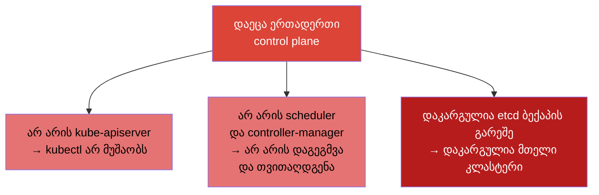
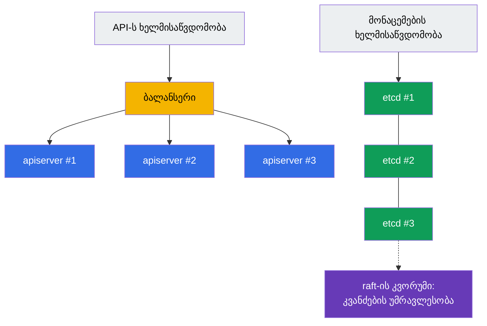
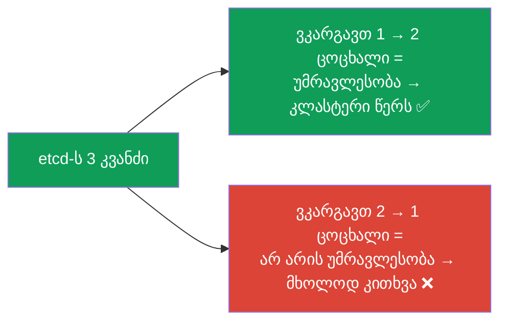
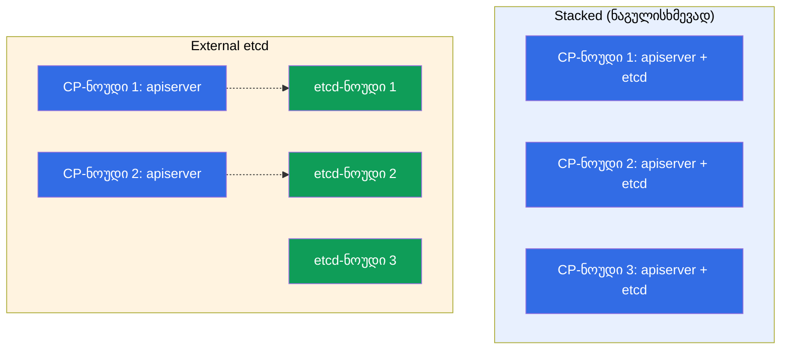
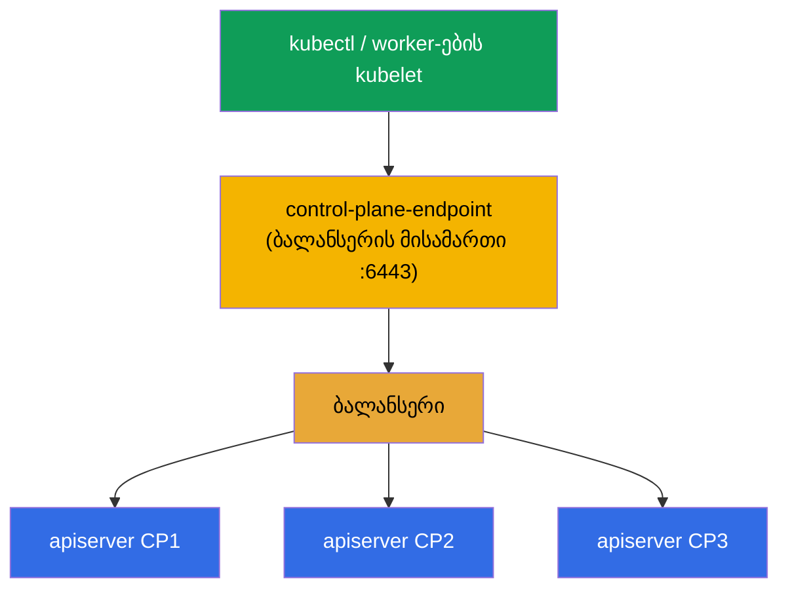

[Русская версия](ru.md) · [Eng version](README.md) · [Versión en español](es.md) · [Version française](fr.md) · [Deutsche Version](de.md) · [繁體中文版](tw.md) · [日本語版](jp.md)

# თავი 35A. მაღალი ხელმისაწვდომობა (HA): რამდენიმე control-plane ნოუდი, etcd-ტოპოლოგიები და ბალანსერი

> 🟦 **თავი CKA-სთვის** (დომენი Cluster Architecture, Installation & Configuration, 25%).
> CKAD-სთვის საჭირო არაა.
>
> **რა იქნება შემდეგ.** თავ 35-ში ავაწყვეთ კლასტერი ერთი control plane-ით. ეს ნორმალურია
> სწავლისა და dev-ისთვის, მაგრამ პროდში ერთი control plane - **მტყუნების ერთადერთი წერტილია**: ნოუდი დაეცა -
> არ არის API, არ არის დაგეგმვა, ხოლო მისი etcd-ს დაკარგვისას - დაკარგულია მთელი კლასტერი. გავარჩევთ, როგორ
> გავხადოთ control plane **უმტყუნებელი**: რამდენიმე control-plane ნოუდი
> ბალანსერის უკან, etcd-ს კვორუმი და ორი ტოპოლოგია (stacked / external). ეს ეყრდნობა
> თავებს 2 (კომპონენტები), 35 (kubeadm) და 37 (etcd).

## 35A.1. რისთვის არის საჭირო HA control plane

worker-ნოუდები ისედაც ჭარბია: worker დაეცა - Pod-ები გადავლენ. მაგრამ **control plane** ბაზისურ
ინსტალაციაში ერთია, და მისი მტყუნება ნიშნავს:



მნიშვნელოვანია: **უკვე გაშვებული Pod-ები აგრძელებენ მუშაობას** მკვდარი control plane-ის დროსაც (მათ
ინახავს kubelet worker-ებზე). მაგრამ კლასტერს ვერ მართავ, არაფერი თავიდან არ იქმნება და არ
მასშტაბირდება. HA აშორებს მტყუნების ამ ერთადერთ წერტილს - აკეთებს რამდენიმე control-plane ნოუდს,
რომ ერთის მტყუნება მართვას არ დააგდოს.

## 35A.2. რისგან იკრიბება control plane-ის უმტყუნებლობა

HA control plane - ეს ორი დამოუკიდებელი ამოცანაა:



- **API-ს ხელმისაწვდომობა.** `kube-apiserver`-ის რამდენიმე ეგზემპლარი (თითო control-plane
  ნოუდზე) **ბალანსერის** უკან. apiserver stateless-ია - კლიენტები მიდიან ბალანსერის ერთიან
  მისამართზე, ხოლო ის მოთხოვნებს ცოცხალ ეგზემპლარებზე ანაწილებს. scheduler და
  controller-manager ყოველ ნოუდზე მუშაობს **leader election** რეჟიმში (აქტიურია ერთი,
  დანარჩენები ცხელ რეზერვშია).
- **მონაცემების ხელმისაწვდომობა.** **etcd**-ს რამდენიმე კვანძი, რომლებიც ქმნიან კლასტერს **კვორუმით**
  (raft): მდგომარეობა რეპლიცირდება, უმცირესობის მტყუნება კლასტერს არ აჩერებს.

## 35A.3. etcd-ს კვორუმი: რატომ კენტი რაოდენობა

etcd იყენებს raft-ს და ჩაწერისთვის მოითხოვს ცოცხალი კვანძების **უმრავლესობას** (კვორუმს). აქედან -
კვანძების კენტი რაოდენობა (3 ან 5):

| etcd-ს კვანძი | კვორუმი (საჭირო ცოცხალი) | უძლებს მტყუნებას |
|-----------|----------------------|------------------|
| 1 | 1 | 0 (არ არის HA) |
| 3 | 2 | **1** |
| 5 | 3 | **2** |
| 2 | 2 | 0 (უარესი, ვიდრე 1!) |
| 4 | 3 | 1 (როგორც 3, მაგრამ უფრო ძვირი) |



საკვანძო დასკვნა: **კვანძების ლუწი რაოდენობა სარგებელს არ იძლევა** - 2 კვანძი უძლებს 0 მტყუნებას
(უარესია ერთზე), 4 უძლებს იმდენს, რამდენსაც 3. ამიტომ იღებენ **3**-ს (სტანდარტი) ან
**5**-ს (უფრო კრიტიკულებისთვის). ეს CKA-გასაუბრების კლასიკური კითხვაა.

## 35A.4. etcd-ს ორი ტოპოლოგია: stacked და external

kubeadm მხარს უჭერს etcd-ს განთავსების ორ სქემას.

**Stacked etcd** - etcd ცხოვრობს **იმავე** control-plane ნოუდებზე (როგორც static pod, თავი
15). უფრო მარტივია და kubeadm-ში ნაგულისხმევია.

**External etcd** - etcd გატანილია **ცალკე** ნოუდებზე/კლასტერზე, control plane მას ქსელით
მიმართავს. უფრო რთულია, მაგრამ etcd-ს მტყუნებას control plane-ის მტყუნებისგან იზოლირებს.



| | **Stacked** | **External** |
|--|-------------|--------------|
| etcd-ს განთავსება | control-plane ნოუდებზე | ცალკე ნოუდებზე |
| ნოუდების რაოდენობა | ნაკლები (უფრო იაფი) | მეტი (უფრო ძვირი) |
| მტყუნების იზოლაცია | ნოუდის მტყუნება = მინუს apiserver **და** etcd | CP-ს მტყუნება etcd-ს არ ეხება |
| სირთულე | უფრო მარტივი (kubeadm-ში ნაგულისხმევი) | უფრო რთული მოწყობაში |
| როდის | self-managed კლასტერების უმრავლესობა | მსხვილი/კრიტიკული ინსტალაციები |

CKA-ზე და პროექტების უმრავლესობაში იყენებენ **stacked**-ს - მინიმუმ 3 control-plane ნოუდი,
თითოეულზე თავისი etcd.

## 35A.5. ბალანსერი და --control-plane-endpoint

კლიენტები (`kubectl`, worker-ების kubelet) control plane-ს უნდა მიმართავდნენ **ერთი
სტაბილური მისამართით**, და არა კონკრეტულ ნოუდს - თორემ ამ ნოუდის მტყუნება ყველაფერს დაამტვრევს.
ამიტომ apiserver-ების წინ აყენებენ **ბალანსერს** (L4, პორტი 6443), ხოლო მის მისამართს
კლასტერს აძლევენ დროშით `--control-plane-endpoint` `kubeadm init`-ის დროს.



> **კრიტიკულია.** `--control-plane-endpoint` მიეთითება **მაშინვე** პირველივე `kubeadm init`-ის დროს.
> თუ კლასტერს მის გარეშე ინიციალიზებთ (ნოუდის კონკრეტულ IP-ზე), მეორე control-plane ნოუდის
> დამატება მერე **ვერ მოხდება** თავიდან შექმნის გარეშე - endpoint სერტიფიკატებსა და
> kubeconfig-ებში არის ჩაშენებული. ეს ხშირი და ძვირი შეცდომაა.

ბალანსერი - Kubernetes-ის გარეთაა: ღრუბლოვანი LB (NLB), ან HAProxy/nginx, ხშირად keepalived-ითა
და ვირტუალური IP-ით თავად ბალანსერის უმტყუნებლობისთვის.

## 35A.6. HA-კლასტერის აწყობა kubeadm-ით

თანმიმდევრობა აფართოებს იმას, რაც თავ 35-ში გავაკეთეთ:


```bash
# 1. ინიციალიზაცია ᲛᲘᲠᲕᲔᲚᲘ control plane-ის ბალანსერის endpoint-ით.
#    --upload-certs დებს control plane-ის სერტიფიკატებს secret-ში (სხვა CP-ების join-ისთვის).
sudo kubeadm init \
  --control-plane-endpoint "LB_DNS:6443" \
  --upload-certs \
  --pod-network-cidr=192.168.0.0/16

# 2. დააყენე CNI (თორემ ნოუდები NotReady, თავი 30).

# 3. მიაერთე ᲓᲐᲛᲐᲢᲔᲑᲘᲗᲘ control plane (kubeadm init-მა ორი ბრძანება დაბეჭდა):
sudo kubeadm join LB_DNS:6443 \
  --token <...> \
  --discovery-token-ca-cert-hash sha256:<...> \
  --control-plane \
  --certificate-key <სერტიფიკატების-გასაღები>

# 4. მიაერთე worker-ნოუდები ჩვეულებრივი join-ით (--control-plane-ის გარეშე).
```

თუ `certificate-key` ამოიწურა (ცოცხლობს ~2 საათი), ახალს იღებენ მუშა control plane-ზე:

```bash
sudo kubeadm init phase upload-certs --upload-certs   # დაბეჭდავს ახალ certificate-key-ს
sudo kubeadm token create --print-join-command        # ახალი join ბრძანება
```

HA-ს შემოწმება:

```bash
kubectl get nodes                                   # რამდენიმე ნოუდი control-plane როლით
kubectl get nodes -l node-role.kubernetes.io/control-plane
# etcd-ს წევრების რაოდენობა (stacked): უყურებენ etcdctl member list-ს სერტიფიკატებით (თავი 37)
```

## 35A.7. როგორ იყენებენ ამას პროდაქშენში

- **მინიმუმ 3 control-plane ნოუდი.** პროდ-კლასტერები თითქმის ყოველთვის HA-ა: 3 (ან 5) control-plane
  ნოუდი სხვადასხვა ხელმისაწვდომობის ზონაში, რომ გაუძლოს ნოუდისა და მთელი ზონის მტყუნებას.
- **etcd სხვადასხვა ზონაში, მაგრამ ლატენტობის გათვალისწინებით.** etcd მგრძნობიარეა დისკისა და
  კვანძებს შორის ქსელის დაყოვნებაზე; ზონები ახლოს უნდა იყოს (ერთი რეგიონი), თორემ კვორუმი შენელდება.
- **ბალანსერიც ჭარბია.** თავად LB არ უნდა იყოს მტყუნების წერტილი: ღრუბლოვანი LB
  ზონებზეა გადანაწილებული, on-prem - HAProxy + keepalived ვირტუალური IP-ით.
- **მართული კლასტერები (EKS/GKE/AKS) HA-ა ნაგულისხმევად.** იქ control plane და etcd
  უმტყუნებელია პროვაიდერის ძალებით - თქვენ ამისთვის იხდით და etcd-ს პირდაპირ არ მართავთ.
  ხელით HA-kubeadm აქტუალურია self-managed/on-prem-ისთვის (და CKA-სთვის).
- **`--control-plane-endpoint` პირველივე დღიდან.** თუნდაც ერთი ნოუდით დაიწყოთ, მაგრამ
  HA-მდე ზრდას გეგმავთ, ინიციალიზაცია მაშინვე ბალანსერის endpoint-ით გააკეთეთ - თორემ
  HA-ზე გადასვლა კლასტერის თავიდან შექმნას მოითხოვს.

## 35A.8. მინი-ლექსიკონი

- **HA (high availability)** - უმტყუნებლობა: ერთი კვანძის მტყუნება სერვისს არ აგდებს.
- **SPOF** - მტყუნების ერთადერთი წერტილი (single point of failure); HA მას აშორებს.
- **კვორუმი** - etcd-ს კვანძების უმრავლესობა, საჭირო ჩაწერისთვის (raft); აქედან კენტი რაოდენობა.
- **leader election** - scheduler/controller-manager-ის აქტიური ეგზემპლარის არჩევა (დანარჩენები რეზერვში).
- **stacked etcd** - etcd თავად control-plane ნოუდებზე (kubeadm-ში ნაგულისხმევი).
- **external etcd** - etcd ცალკე ნოუდებზე, იზოლირებულია control plane-ისგან.
- **--control-plane-endpoint** - control plane-ის სტაბილური მისამართი (ბალანსერი); მიეთითება init-ის დროს.
- **--upload-certs / certificate-key** - სერტიფიკატების გადაცემის მექანიზმი control-plane ნოუდების join-ის დროს.
- **ბალანსერი (LB)** - ანაწილებს მოთხოვნებს apiserver-ებზე; L4, პორტი 6443.

## 35A.9. თავის შეჯამება

- ერთი control plane - მტყუნების ერთადერთი წერტილია: მის გარეშე არ არის მართვა, ხოლო etcd-ს ბექაპის გარეშე -
  დაკარგულია მთელი კლასტერი (გაშვებული Pod-ები ამ დროს აგრძელებენ მუშაობას).
- HA control plane = API-ს ხელმისაწვდომობა (რამდენიმე apiserver ბალანსერის უკან, leader
  election scheduler/CM-ისთვის) + მონაცემების ხელმისაწვდომობა (etcd-ს კლასტერი კვორუმით).
- etcd მოითხოვს კვორუმს (raft): იღებენ კვანძების კენტ რაოდენობას (3 ან 5); 3 უძლებს 1
  მტყუნებას, 5 - ორს; ლუწი რაოდენობა წამგებიანია.
- ორი ტოპოლოგია: stacked (etcd control-plane ნოუდებზე, ნაგულისხმევად) და external (etcd
  ცალკე, იზოლირებს მტყუნებას, უფრო ძვირი).
- ბალანსერი apiserver-ების წინ + `--control-plane-endpoint` init-ის დროს - სავალდებულოა
  HA-სთვის; endpoint მაშინვე მიეთითება, თორემ HA-ზე გადასვლა თავიდან შექმნას მოითხოვს.
- აწყობა: `kubeadm init --control-plane-endpoint --upload-certs` → CNI → სხვა CP-ების join
  `--control-plane --certificate-key`-ით → worker-ების join.

## 35A.10. როგორ გამოგადგებათ: გამოცდაზე და რეალურ სამუშაოში

**გამოცდაზე (CKA).** სრულფასოვან HA-აწყობას გამოცდაზე იშვიათად აშენებენ (დრო ცოტაა), მაგრამ
კონცეფციებს კითხავენ და იყენებენ: რატომ etcd-ს კენტი რაოდენობა, რით განსხვავდება stacked
external-ისგან, რისთვის არის `--control-plane-endpoint`, როგორ მივაერთოთ მეორე control plane. ეს
Installation დომენის (25%) და არქიტექტურის გაგების ნაწილია (თავი 2).

**რეალურ სამუშაოში.** ნებისმიერი პროდ-კლასტერი - HA-ა. etcd-ს კვორუმის, ტოპოლოგიების,
ბალანსერისა და პირველივე დღიდან სწორი `--control-plane-endpoint`-ის გაგება პირდაპირ განსაზღვრავს,
გაუძლებს თუ არა კლასტერი ნოუდის ან ზონის მტყუნებას. შეცდომა „ინიციალიზება endpoint-ის გარეშე“ - ძვირი
და ხშირია.

## 35A.11. თვითშემოწმების კითხვები

1. რა წყვეტს მუშაობას ერთადერთი control plane-ის მტყუნებისას, და რა აგრძელებს?
2. რომელი ორი ნაწილისგან იკრიბება control plane-ის უმტყუნებლობა?
3. რატომ იღებენ etcd-ს კვანძების რაოდენობას კენტს? რამდენ მტყუნებას უძლებს 3 და 5 კვანძი?
4. რით განსხვავდება etcd-ს stacked-ტოპოლოგია external-ისგან? თითოეულის პლიუსები და მინუსები.
5. რისთვის არის საჭირო ბალანსერი და `--control-plane-endpoint`? რატომ მიეთითება ის მაშინვე init-ის დროს?
6. აღწერეთ HA-კლასტერის kubeadm-ით აწყობის ნაბიჯები და რით განსხვავდება control-plane ნოუდის join worker-ის join-ისგან.

## პრაქტიკა

გავარჩიეთ, როგორ მოვაშოროთ control plane-ის მტყუნების ერთადერთი წერტილი. მეორე control-plane ნოუდის
მიერთების გავარჯიშება და etcd-ს კვორუმის შემოწმება შეიძლება ლაბ 124-ში. შემდეგ (თავი 36) -
კლასტერის უსაფრთხო განახლება.

🧪 ლაბი 124 (HA control plane): [tasks/cka/labs/124](../../labs/124/README_GE.MD)

---
[სარჩევი](../README_GE.md) · [თავი 35](../35/ge.md) · [თავი 36](../36/ge.md)
