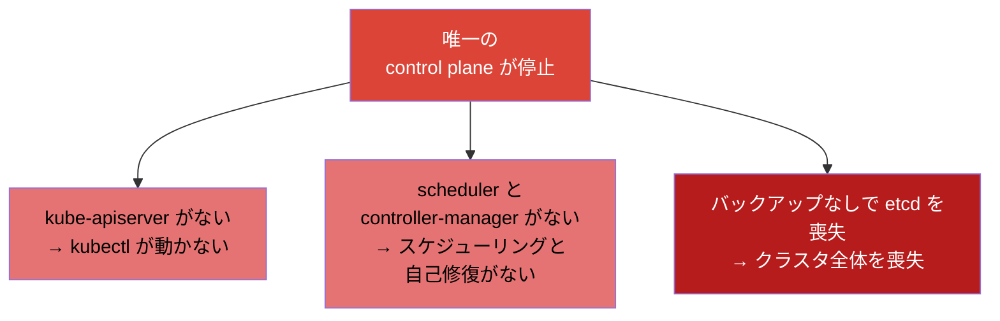
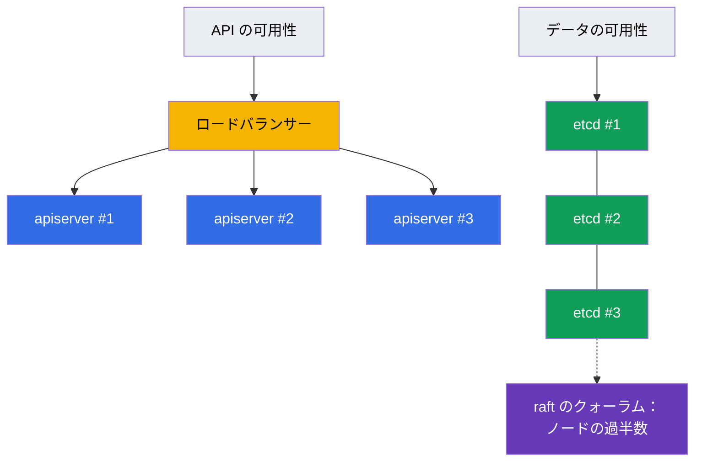
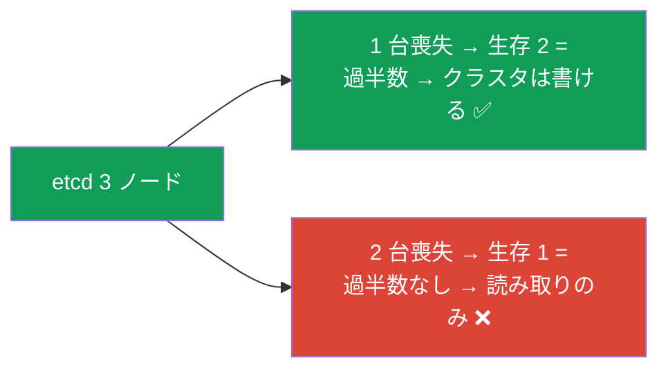
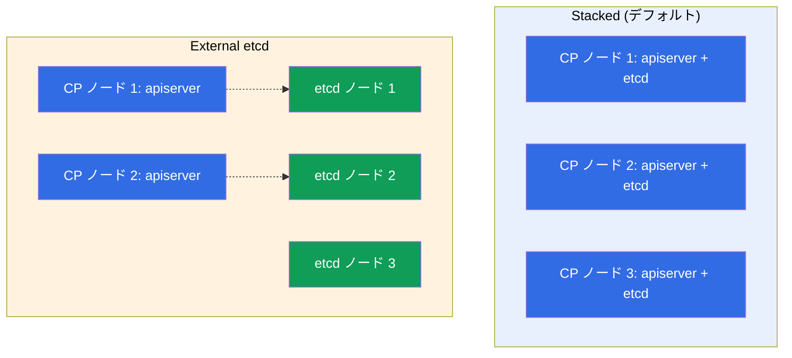
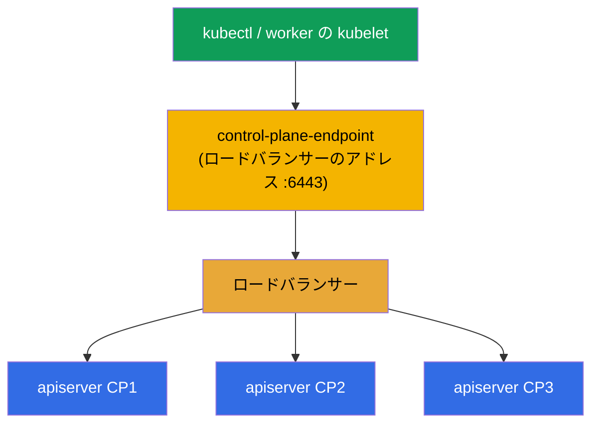
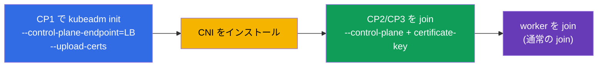

[Русская версия](ru.md) · [Eng version](README.md) · [Versión en español](es.md) · [Version française](fr.md) · [Deutsche Version](de.md) · [ქართული ვერსია](ge.md) · [繁體中文版](tw.md)

# 第 35A 章。高可用性 (HA)：複数の control-plane ノード、etcd のトポロジー、ロードバランサー

> 🟦 **CKA 向けの章**（領域 Cluster Architecture, Installation & Configuration、25%）。
> CKAD では不要です。
>
> **次は何か。** 第 35 章では control plane が 1 つのクラスタを組み立てました。学習や dev
> ではそれで問題ありませんが、本番で control plane が 1 つというのは **単一障害点** です -
> ノードが落ちれば API もスケジューリングもなくなり、その etcd を失えばクラスタ全体が
> 失われます。control plane を **耐障害性のあるもの** にする方法を見ていきましょう：
> ロードバランサーの背後に複数の control-plane ノード、etcd のクォーラム、そして 2 つの
> トポロジー (stacked / external) です。これは第 2 章（コンポーネント）、第 35 章 (kubeadm)、
> 第 37 章 (etcd) の上に立っています。

## 35A.1. HA control plane が必要な理由

worker ノードはもともと冗長です：worker が落ちれば Pod は引っ越します。しかし **control
plane** は基本のインストールでは 1 つで、その障害は次を意味します：



重要：control plane が死んでいても **すでに起動している Pod は動き続けます**（worker 上の
kubelet が保持しています）。しかしクラスタを操作することはできず、何も再作成されず
スケールもされません。HA はこの単一障害点を取り除きます - control-plane ノードを複数に
して、1 台の障害で管理が落ちないようにするのです。

## 35A.2. control plane の耐障害性は何から成り立つか

HA control plane とは、2 つの独立した課題です：



- **API の可用性。** `kube-apiserver` の複数のインスタンス（control-plane ノードごとに
  1 つ）を **ロードバランサー** の背後に置きます。apiserver は stateless なので、
  クライアントはロードバランサーの単一のアドレスへ向かい、バランサーがリクエストを生きて
  いるインスタンスへ振り分けます。各ノードの scheduler と controller-manager は
  **leader election** のモードで動きます（1 つがアクティブ、残りはホットスタンバイ）。
- **データの可用性。** **etcd** の複数のノードが **クォーラム** (raft) を持つクラスタを
  作ります：状態が複製され、少数のノードの障害ではクラスタは止まりません。

## 35A.3. etcd のクォーラム：なぜ奇数なのか

etcd は raft を使い、書き込みには生存ノードの **過半数**（クォーラム）が必要です。だから
こそノード数は奇数（3 または 5）になります：

| etcd のノード数 | クォーラム（必要な生存数） | 耐えられる障害数 |
|-----------|----------------------|------------------|
| 1 | 1 | 0 (HA なし) |
| 3 | 2 | **1** |
| 5 | 3 | **2** |
| 2 | 2 | 0 (1 台より悪い!) |
| 4 | 3 | 1 (3 と同じだがコストは高い) |



重要な結論：**偶数のノード数は得をしません** - 2 ノードは 0 回の障害にしか耐えられず
（1 台より悪い）、4 ノードは 3 ノードと同じ回数しか耐えられません。だから **3**（標準）
または **5**（より重要な場合）を取ります。これは CKA の面接での定番の質問です。

## 35A.4. etcd の 2 つのトポロジー：stacked と external

kubeadm は etcd の配置について 2 つの方式をサポートします。

**Stacked etcd** - etcd は **同じ** control-plane ノード上に住みます（static pod として、
第 15 章）。よりシンプルで、kubeadm のデフォルトです。

**External etcd** - etcd は **別の** ノード/クラスタへ切り出され、control plane はネット
ワーク越しにそこへアクセスします。より複雑ですが、etcd の障害を control plane の障害から
分離します。



| | **Stacked** | **External** |
|--|-------------|--------------|
| etcd の配置 | control-plane ノード上 | 別のノード上 |
| ノード数 | 少ない（安い） | 多い（高い） |
| 障害の分離 | ノードの障害 = apiserver **と** etcd の喪失 | CP の障害は etcd に影響しない |
| 複雑さ | よりシンプル (kubeadm のデフォルト) | 設定がより複雑 |
| いつ使うか | 大半の self-managed クラスタ | 大規模/重要なインストール |

CKA と大半のプロジェクトでは **stacked** を使います - control-plane ノードを最低 3 台、
それぞれに自分の etcd を持たせます。

## 35A.5. ロードバランサーと --control-plane-endpoint

クライアント（`kubectl`、worker の kubelet）は control plane へ、特定のノードではなく
**1 つの安定したアドレス** でアクセスしなければなりません - そうでないとそのノードの障害が
すべてを壊します。そのため apiserver たちの前に **ロードバランサー**（L4、ポート 6443）を
置き、そのアドレスを `kubeadm init` の際にフラグ `--control-plane-endpoint` でクラスタへ
指定します。



> **クリティカル。** `--control-plane-endpoint` は最初の `kubeadm init` の際に **すぐに**
> 指定します。それなしでクラスタを初期化してしまうと（特定のノードの IP に対して）、
> あとから 2 台目の control-plane ノードを追加することは、作り直しなしには **できません** -
> endpoint は証明書と kubeconfig に焼き込まれます。よくある、そして高価なミスです。

ロードバランサーは Kubernetes の外側にあります：クラウドの LB (NLB)、あるいは
HAProxy/nginx で、バランサー自身の耐障害性のために keepalived と仮想 IP をよく併用します。

## 35A.6. kubeadm による HA クラスタの組み立て

手順は第 35 章でやったことを拡張したものです：



```bash
# 1. ロードバランサーの endpoint を通して最初の control plane を初期化する。
#    --upload-certs は control plane の証明書を secret に置く (他の CP の join 用)。
sudo kubeadm init \
  --control-plane-endpoint "LB_DNS:6443" \
  --upload-certs \
  --pod-network-cidr=192.168.0.0/16

# 2. CNI をインストールする (でなければノードは NotReady、第 30 章)。

# 3. 追加の control plane を参加させる (kubeadm init が 2 つのコマンドを表示した):
sudo kubeadm join LB_DNS:6443 \
  --token <...> \
  --discovery-token-ca-cert-hash sha256:<...> \
  --control-plane \
  --certificate-key <証明書のキー>

# 4. worker ノードは通常の join で参加させる (--control-plane なし)。
```

`certificate-key` が期限切れになった場合（寿命は約 2 時間）、新しいものは動いている
control plane 上で取得します：

```bash
sudo kubeadm init phase upload-certs --upload-certs   # 新しい certificate-key を表示する
sudo kubeadm token create --print-join-command        # 新鮮な join コマンド
```

HA の確認：

```bash
kubectl get nodes                                   # control-plane ロールのノードが複数
kubectl get nodes -l node-role.kubernetes.io/control-plane
# etcd のメンバー数 (stacked): 証明書付きの etcdctl member list で見る (第 37 章)
```

## 35A.7. 本番環境でこれをどう使うか

- **control-plane ノードは最低 3 台。** 本番クラスタはほぼ常に HA です：異なるアベイラ
  ビリティゾーンに 3 台（または 5 台）の control-plane ノードを置き、ノードの障害と
  ゾーン全体の障害に耐えられるようにします。
- **etcd は異なるゾーンに、ただしレイテンシに注意。** etcd はディスクとノード間ネット
  ワークの遅延に敏感です。ゾーンは近く（同一リージョン）にあるべきで、でなければ
  クォーラムが遅くなります。
- **ロードバランサーも冗長に。** LB 自身が障害点であってはいけません：クラウドの LB は
  ゾーンをまたいで分散され、オンプレでは HAProxy + keepalived と仮想 IP です。
- **マネージドクラスタ (EKS/GKE/AKS) はデフォルトで HA。** そこでは control plane と etcd
  はプロバイダの手で耐障害性を持ちます - あなたはその対価を払い、etcd を直接管理はしません。
  手動の HA-kubeadm は self-managed/オンプレ（そして CKA）で意味を持ちます。
- **`--control-plane-endpoint` は初日から。** ノード 1 台から始めるとしても HA への成長を
  計画しているなら、最初からロードバランサーの endpoint を通して初期化してください -
  でなければ HA への移行にはクラスタの作り直しが必要になります。

## 35A.8. ミニ用語集

- **HA (high availability)** - 耐障害性：1 つのノードの障害でサービスが落ちないこと。
- **SPOF** - 単一障害点 (single point of failure)。HA がこれを取り除きます。
- **クォーラム** - 書き込みに必要な etcd ノードの過半数 (raft)。だから奇数になります。
- **leader election** - scheduler/controller-manager のアクティブなインスタンスの選出（残りは待機）。
- **stacked etcd** - control-plane ノード自身の上にある etcd (kubeadm のデフォルト)。
- **external etcd** - 別のノード上にあり control plane から分離された etcd。
- **--control-plane-endpoint** - control plane の安定したアドレス（ロードバランサー）。init で指定します。
- **--upload-certs / certificate-key** - control-plane ノードの join の際に証明書を渡す仕組み。
- **ロードバランサー (LB)** - リクエストを apiserver たちへ振り分けるもの。L4、ポート 6443。

## 35A.9. 本章のまとめ

- control plane が 1 つというのは単一障害点です：それがなければ管理はできず、etcd の
  バックアップがなければクラスタ全体が失われます（起動済みの Pod はその間も動き続けます）。
- HA control plane = API の可用性（ロードバランサーの背後の複数の apiserver、
  scheduler/CM の leader election）+ データの可用性（クォーラムを持つ etcd クラスタ）。
- etcd はクォーラムを必要とします (raft)：ノード数は奇数（3 または 5）を取ります。3 は
  1 回の障害に、5 は 2 回に耐えます。偶数は得になりません。
- 2 つのトポロジー：stacked (etcd は control-plane ノード上、デフォルト) と external
  (etcd は別、障害を分離するがコストは高い)。
- apiserver たちの前のロードバランサー + init の際の `--control-plane-endpoint` は HA には
  必須です。endpoint はすぐに指定します。でなければ HA への移行に作り直しが必要です。
- 組み立て：`kubeadm init --control-plane-endpoint --upload-certs` → CNI → 他の CP を
  `--control-plane --certificate-key` で join → worker を join。

## 35A.10. これがどう役に立つか：試験と実際の仕事で

**試験では (CKA)。** 試験で HA の完全な構築をすることは稀です（時間が足りません）が、
概念は問われ、使われます：なぜ etcd は奇数なのか、stacked は external とどう違うのか、
なぜ `--control-plane-endpoint` が必要なのか、2 台目の control plane をどう参加させるのか。
これは Installation 領域 (25%) とアーキテクチャの理解（第 2 章）の一部です。

**実際の仕事では。** どの本番クラスタも HA です。etcd のクォーラム、トポロジー、
ロードバランサー、そして初日からの正しい `--control-plane-endpoint` の理解が、クラスタが
ノードやゾーンの障害を生き延びるかどうかを直接決めます。「endpoint なしで初期化した」
というミスは高価で、よくあるものです。

## 35A.11. 自己チェックの質問

1. 唯一の control plane が障害を起こしたとき、何が動かなくなり、何が動き続けますか？
2. control plane の耐障害性はどの 2 つの部分から成り立ちますか？
3. なぜ etcd のノード数は奇数を取るのですか？3 ノードと 5 ノードは何回の障害に耐えますか？
4. etcd の stacked トポロジーは external とどう違いますか？それぞれの長所と短所は？
5. なぜロードバランサーと `--control-plane-endpoint` が必要なのですか？なぜ init の際にすぐ指定するのですか？
6. kubeadm での HA クラスタ組み立ての手順と、control-plane ノードの join が worker の join とどう違うかを説明してください。

## 演習

control plane の単一障害点をどう取り除くかを見てきました。2 台目の control-plane ノードの
参加を練習し etcd のクォーラムを確認するには、ラボ 124 が使えます。次は（第 36 章）-
クラスタの安全なアップグレードです。

🧪 ラボ 124 (HA control plane): [tasks/cka/labs/124](../../labs/124/README_JP.MD)

---
[目次](../README_JP.md) · [第 35 章](../35/jp.md) · [第 36 章](../36/jp.md)
