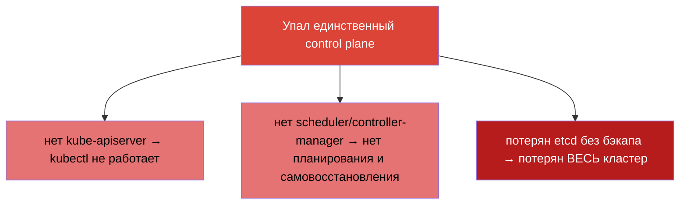
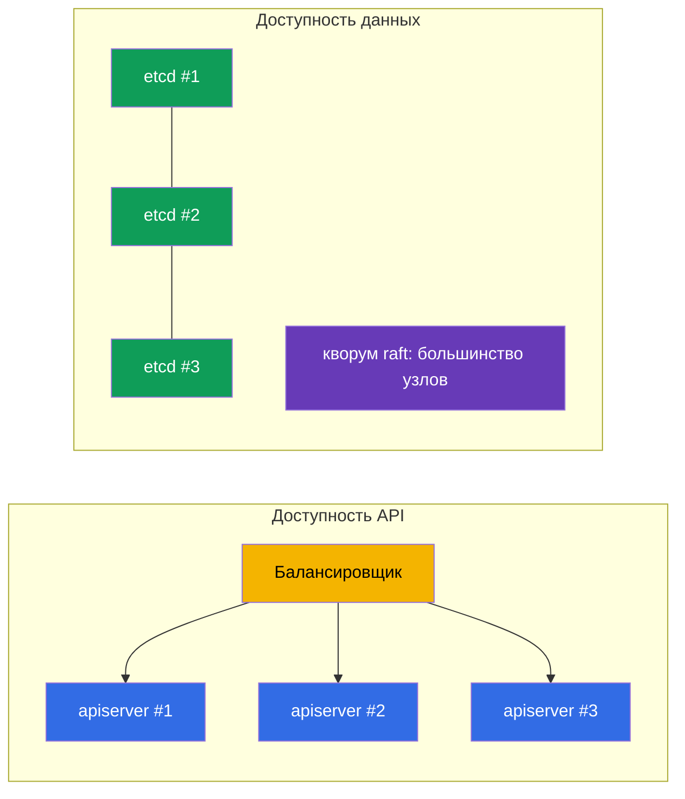
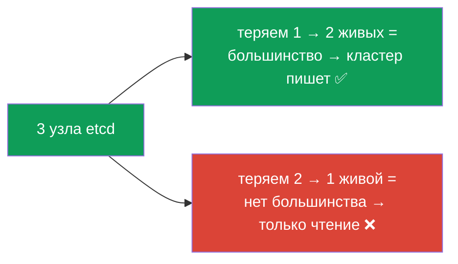
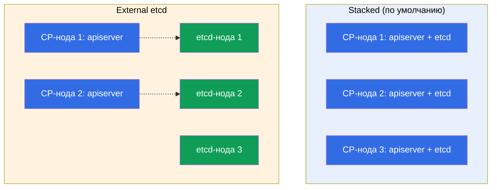
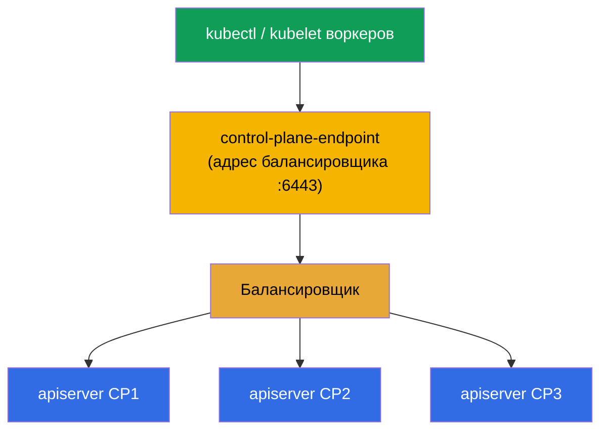

# Глава 35A. Высокая доступность (HA): несколько control-plane нод, etcd-топологии и балансировщик

> 🟦 **Глава для CKA** (домен Cluster Architecture, Installation & Configuration, 25%).
> Для CKAD не требуется.
>
> **Что дальше.** В главе 35 мы собрали кластер с одним control plane. Это нормально для
> обучения и dev, но в проде один control plane - **единая точка отказа**: упала нода -
> нет API, нет планирования, а при потере её etcd - потерян весь кластер. Разберём, как
> сделать control plane **отказоустойчивым**: несколько control-plane нод за
> балансировщиком, кворум etcd и две топологии (stacked / external). Это опирается на
> главы 2 (компоненты), 35 (kubeadm) и 37 (etcd).

## 35A.1. Зачем нужен HA control plane

Worker-ноды и так избыточны: упал воркер - поды переедут. Но **control plane** в базовой
установке один, и его отказ означает:



Важно: **уже запущенные поды продолжают работать** даже при мёртвом control plane (их
держит kubelet на воркерах). Но кластером нельзя управлять, ничего не пересоздаётся и не
масштабируется. HA убирает эту единую точку отказа - делает несколько control-plane нод,
чтобы отказ одной не ронял управление.

## 35A.2. Из чего складывается отказоустойчивость control plane

HA control plane - это две независимые задачи:



- **Доступность API.** Несколько экземпляров `kube-apiserver` (по одному на control-plane
  ноде) за **балансировщиком**. apiserver stateless - клиенты идут на единый адрес
  балансировщика, а он раскидывает запросы на живые экземпляры. scheduler и
  controller-manager на каждой ноде работают в режиме **leader election** (активен один,
  остальные в горячем резерве).
- **Доступность данных.** Несколько узлов **etcd**, образующих кластер с **кворумом**
  (raft): состояние реплицируется, отказ меньшинства узлов не останавливает кластер.

## 35A.3. Кворум etcd: почему нечётное число

etcd использует raft и требует **большинства** живых узлов (кворума) для записи. Отсюда -
нечётное число узлов (3 или 5):

| Узлов etcd | Кворум (нужно живых) | Переживает отказ |
|-----------|----------------------|------------------|
| 1 | 1 | 0 (нет HA) |
| 3 | 2 | **1** |
| 5 | 3 | **2** |
| 2 | 2 | 0 (хуже, чем 1!) |
| 4 | 3 | 1 (как 3, но дороже) |



Ключевой вывод: **чётное число узлов не даёт выгоды** - 2 узла переживают 0 отказов
(хуже одного), 4 переживают столько же, сколько 3. Поэтому берут **3** (стандарт) или
**5** (для более критичных). Это классический вопрос CKA-собеседования.

## 35A.4. Две топологии etcd: stacked и external

kubeadm поддерживает две схемы размещения etcd.

**Stacked etcd** - etcd живёт **на тех же** control-plane нодах (как static pod, глава
15). Проще и по умолчанию у kubeadm.

**External etcd** - etcd вынесен на **отдельные** ноды/кластер, control plane обращается
к нему по сети. Сложнее, но изолирует отказ etcd от отказа control plane.



| | **Stacked** | **External** |
|--|-------------|--------------|
| Размещение etcd | на control-plane нодах | на отдельных нодах |
| Число нод | меньше (дешевле) | больше (дороже) |
| Изоляция отказа | отказ ноды = минус apiserver **и** etcd | отказ CP не трогает etcd |
| Сложность | проще (kubeadm по умолчанию) | сложнее в настройке |
| Когда | большинство self-managed кластеров | крупные/критичные инсталляции |

На CKA и в большинстве проектов используют **stacked** - минимум 3 control-plane ноды,
на каждой свой etcd.

## 35A.5. Балансировщик и --control-plane-endpoint

Клиенты (`kubectl`, kubelet воркеров) должны обращаться к control plane по **одному
стабильному адресу**, а не к конкретной ноде - иначе отказ этой ноды всё сломает.
Поэтому перед apiserver'ами ставят **балансировщик** (L4, порт 6443), а его адрес
задают кластеру флагом `--control-plane-endpoint` при `kubeadm init`.



> **Критично.** `--control-plane-endpoint` задают **сразу** при первом `kubeadm init`.
> Если инициализировать кластер без него (на конкретный IP ноды), добавить вторую
> control-plane ноду потом **нельзя** без пересоздания - endpoint зашит в сертификаты и
> kubeconfig'и. Это частая дорогая ошибка.

Балансировщик - вне Kubernetes: облачный LB (NLB), либо HAProxy/nginx, часто с keepalived
и виртуальным IP для отказоустойчивости самого балансировщика.

## 35A.6. Сборка HA-кластера через kubeadm

Порядок расширяет то, что мы делали в главе 35:


```bash
# 1. Инициализировать ПЕРВЫЙ control plane через endpoint балансировщика.
#    --upload-certs кладёт сертификаты control plane в secret (для join других CP).
sudo kubeadm init \
  --control-plane-endpoint "LB_DNS:6443" \
  --upload-certs \
  --pod-network-cidr=192.168.0.0/16

# 2. Установить CNI (иначе ноды NotReady, глава 30).

# 3. Присоединить ДОПОЛНИТЕЛЬНЫЙ control plane (kubeadm init напечатал две команды):
sudo kubeadm join LB_DNS:6443 \
  --token <...> \
  --discovery-token-ca-cert-hash sha256:<...> \
  --control-plane \
  --certificate-key <ключ-сертификатов>

# 4. Присоединить worker-ноды обычным join (без --control-plane).
```

Если `certificate-key` истёк (живёт ~2 часа), новый получают на рабочем control plane:

```bash
sudo kubeadm init phase upload-certs --upload-certs   # напечатает новый certificate-key
sudo kubeadm token create --print-join-command        # свежая команда join
```

Проверка HA:

```bash
kubectl get nodes                                   # несколько нод с ролью control-plane
kubectl get nodes -l node-role.kubernetes.io/control-plane
# число членов etcd (stacked): смотрят etcdctl member list с сертификатами (глава 37)
```

## 35A.7. Как это применяют в продакшене

- **Минимум 3 control-plane ноды.** Прод-кластеры почти всегда HA: 3 (или 5) control-plane
  нод в разных зонах доступности, чтобы переживать отказ ноды и целой зоны.
- **etcd в разных зонах, но с оглядкой на латентность.** etcd чувствителен к задержке
  диска и сети между узлами; зоны должны быть близко (один регион), иначе кворум тормозит.
- **Балансировщик тоже избыточен.** Сам LB не должен быть точкой отказа: облачный LB
  распределён по зонам, on-prem - HAProxy + keepalived с виртуальным IP.
- **Managed-кластеры (EKS/GKE/AKS) HA по умолчанию.** Там control plane и etcd
  отказоустойчивы силами провайдера - вы платите за это и не управляете etcd напрямую.
  Ручной HA-kubeadm актуален для self-managed/on-prem (и для CKA).
- **`--control-plane-endpoint` с первого дня.** Даже если стартуете с одной ноды, но
  планируете рост до HA, инициализируйте через endpoint балансировщика сразу - иначе
  переход в HA потребует пересоздания кластера.

## 35A.8. Мини-глоссарий

- **HA (high availability)** - отказоустойчивость: отказ одного узла не роняет сервис.
- **SPOF** - единая точка отказа (single point of failure); HA её устраняет.
- **кворум** - большинство узлов etcd, нужное для записи (raft); отсюда нечётное число.
- **leader election** - выбор активного экземпляра scheduler/controller-manager (остальные в резерве).
- **stacked etcd** - etcd на самих control-plane нодах (по умолчанию kubeadm).
- **external etcd** - etcd на отдельных нодах, изолирован от control plane.
- **--control-plane-endpoint** - стабильный адрес control plane (балансировщик); задаётся при init.
- **--upload-certs / certificate-key** - механизм передачи сертификатов при join control-plane нод.
- **балансировщик (LB)** - распределяет запросы на apiserver'ы; L4, порт 6443.

## 35A.9. Итоги главы

- Один control plane - единая точка отказа: без него нет управления, а без бэкапа etcd -
  потерян весь кластер (запущенные поды при этом продолжают работать).
- HA control plane = доступность API (несколько apiserver за балансировщиком, leader
  election для scheduler/CM) + доступность данных (кластер etcd с кворумом).
- etcd требует кворума (raft): берут нечётное число узлов (3 или 5); 3 переживает 1
  отказ, 5 - два; чётное число невыгодно.
- Две топологии: stacked (etcd на control-plane нодах, по умолчанию) и external (etcd
  отдельно, изолирует отказ, дороже).
- Балансировщик перед apiserver'ами + `--control-plane-endpoint` при init - обязательны
  для HA; endpoint задают сразу, иначе переход в HA требует пересоздания.
- Сборка: `kubeadm init --control-plane-endpoint --upload-certs` → CNI → join других CP
  с `--control-plane --certificate-key` → join воркеров.

## 35A.10. Как это пригодится: на экзамене и в реальной работе

**На экзамене (CKA).** Полноценную сборку HA на экзамене строят редко (мало времени), но
концепции спрашивают и применяют: зачем нечётное число etcd, чем stacked отличается от
external, зачем `--control-plane-endpoint`, как присоединить второй control plane. Это
часть домена Installation (25%) и понимания архитектуры (глава 2).

**В реальной работе.** Любой прод-кластер - HA. Понимание кворума etcd, топологий,
балансировщика и правильного `--control-plane-endpoint` с первого дня напрямую определяет,
переживёт ли кластер отказ ноды или зоны. Ошибка «инициализировали без endpoint» - дорогая
и частая.

## 35A.11. Вопросы для самопроверки

1. Что перестаёт работать при отказе единственного control plane, а что продолжает?
2. Из каких двух частей складывается отказоустойчивость control plane?
3. Почему число узлов etcd берут нечётным? Сколько отказов переживают 3 и 5 узлов?
4. Чем stacked-топология etcd отличается от external? Плюсы и минусы каждой.
5. Зачем нужен балансировщик и `--control-plane-endpoint`? Почему его задают сразу при init?
6. Опишите шаги сборки HA-кластера kubeadm и чем join control-plane ноды отличается от join воркера.

## Практика

Мы разобрали, как убрать единую точку отказа control plane. Отработать присоединение
второй control-plane ноды и проверить кворум etcd можно в лабе 124. Дальше (глава 36) -
безопасное обновление кластера.

🧪 Лаба 124 (HA control plane): [tasks/cka/labs/124](../../labs/124/README_RU.MD)

---
[Оглавление](../README_RU.md) · [Глава 35](../35/ru.md) · [Глава 36](../36/ru.md)
