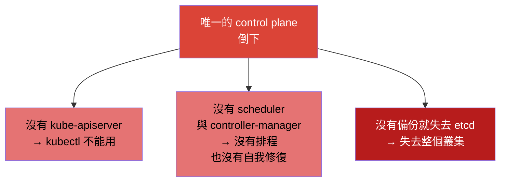
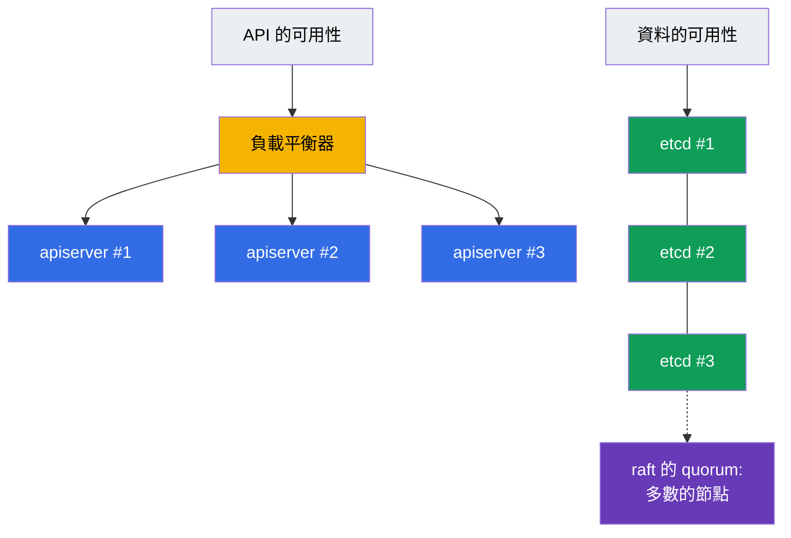
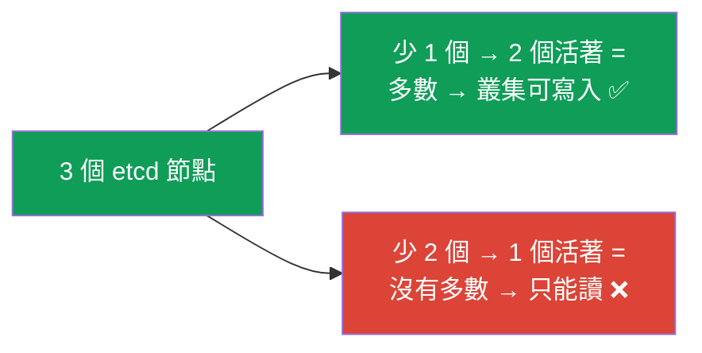
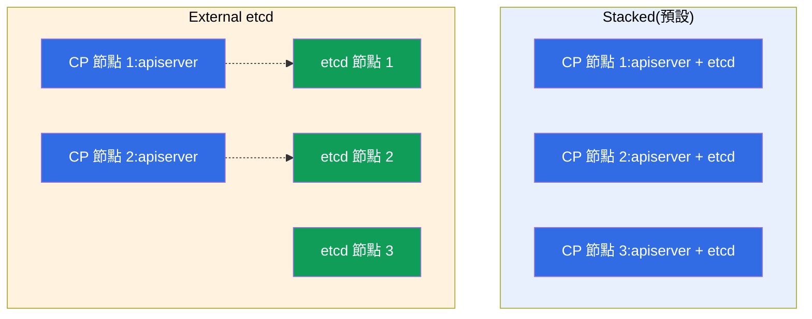
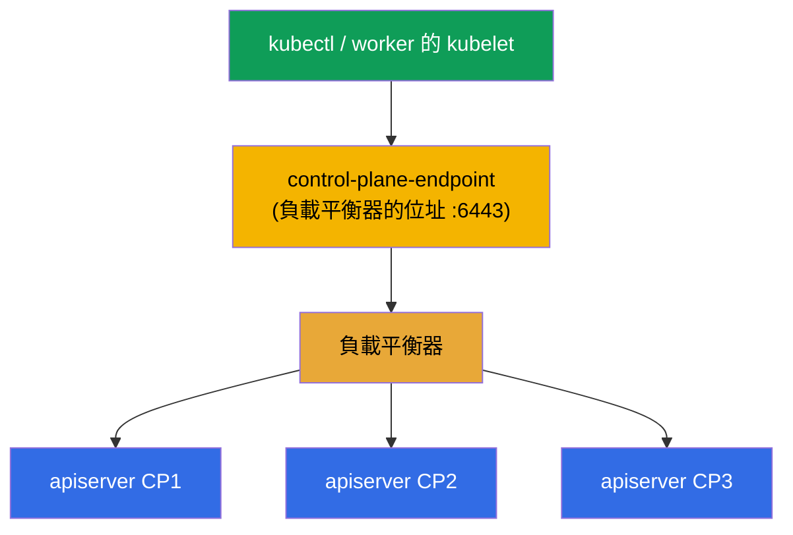
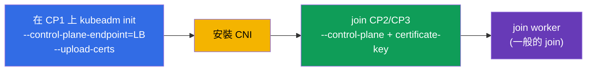

[Русская версия](ru.md) · [Eng version](README.md) · [Versión en español](es.md) · [Version française](fr.md) · [Deutsche Version](de.md) · [ქართული ვერსია](ge.md) · [日本語版](jp.md)

# 第 35A 章。高可用性(HA):多個 control-plane 節點、etcd 拓撲與負載平衡器

> 🟦 **CKA 章節**(領域 Cluster Architecture, Installation & Configuration,25%)。
> CKAD 不需要。
>
> **接下來是什麼。** 在第 35 章我們組出了一個只有單一 control plane 的叢集。用於
> 學習與 dev 沒問題,但在生產環境裡單一 control plane 是**單一故障點**:節點倒了 -
> 就沒有 API、沒有排程,而如果連它的 etcd 也一起遺失,整個叢集就沒了。我們來看怎麼
> 讓 control plane 具備**容錯能力**:負載平衡器後面擺多個 control-plane 節點、
> etcd 的 quorum 以及兩種拓撲(stacked / external)。這建立在第 2 章(元件)、
> 第 35 章(kubeadm)與第 37 章(etcd)之上。

## 35A.1. 為什麼需要 HA control plane

worker 節點本來就是冗餘的:worker 倒了 - Pod 會搬到別處。但基本安裝裡的
**control plane** 只有一個,它的故障意味著:



重要的是:即使 control plane 死掉,**已經在跑的 Pod 仍然繼續運作**(它們由 worker 上
的 kubelet 維持著)。但叢集無法管理,任何東西都不會被重建,也不會擴縮。HA 移除了這個
單一故障點 - 做出多個 control-plane 節點,讓其中一個故障不會弄倒管理面。

## 35A.2. control plane 的容錯由什麼組成

HA control plane 是兩件互相獨立的事情:



- **API 的可用性。** 多個 `kube-apiserver` 實例(每個 control-plane 節點一個)擺在
  **負載平衡器**後面。apiserver 是 stateless 的 - 客戶端連到負載平衡器的單一位址,
  由它把請求分散到活著的實例。每個節點上的 scheduler 與 controller-manager 以
  **leader election** 模式運作(只有一個是 active,其餘處於熱備)。
- **資料的可用性。** 多個 **etcd** 節點組成帶 **quorum**(raft)的叢集:狀態會被
  複製,少數節點故障不會讓叢集停下來。

## 35A.3. etcd 的 quorum:為什麼要奇數

etcd 使用 raft,寫入需要**多數**節點存活(quorum)。因此節點數要取奇數(3 或 5):

| etcd 節點數 | quorum(需要幾個活著) | 可承受的故障數 |
|-----------|----------------------|------------------|
| 1 | 1 | 0(沒有 HA) |
| 3 | 2 | **1** |
| 5 | 3 | **2** |
| 2 | 2 | 0(比 1 個還糟!) |
| 4 | 3 | 1(和 3 一樣,但更貴) |



關鍵結論:**偶數個節點沒有任何好處** - 2 個節點承受 0 次故障(比 1 個更糟),
4 個承受的次數和 3 個一樣。所以大家取 **3**(標準)或 **5**(更關鍵的場景)。
這是 CKA 面試的經典題目。

## 35A.4. etcd 的兩種拓撲:stacked 與 external

kubeadm 支援兩種擺放 etcd 的方案。

**Stacked etcd** - etcd 就住在**同一批** control-plane 節點上(以 static pod 的形式,
第 15 章)。比較簡單,也是 kubeadm 的預設。

**External etcd** - etcd 被搬到**獨立的**節點/叢集上,control plane 透過網路存取它。
比較複雜,但把 etcd 的故障與 control plane 的故障隔離開來。



| | **Stacked** | **External** |
|--|-------------|--------------|
| etcd 的擺放位置 | 在 control-plane 節點上 | 在獨立的節點上 |
| 節點數量 | 較少(較便宜) | 較多(較貴) |
| 故障隔離 | 節點故障 = 同時少掉 apiserver **與** etcd | CP 故障不影響 etcd |
| 複雜度 | 較簡單(kubeadm 預設) | 設定較複雜 |
| 什麼時候用 | 大多數 self-managed 叢集 | 大型/關鍵的安裝場景 |

在 CKA 以及大多數專案裡用的是 **stacked** - 至少 3 個 control-plane 節點,
每個上面都有自己的 etcd。

## 35A.5. 負載平衡器與 --control-plane-endpoint

客戶端(`kubectl`、worker 的 kubelet)必須透過**一個穩定的位址**存取 control plane,
而不是連到某個具體節點 - 否則那個節點一故障就全毀了。因此在 apiserver 前面擺一個
**負載平衡器**(L4,埠 6443),並在 `kubeadm init` 時用 `--control-plane-endpoint`
旗標把它的位址告訴叢集。



> **關鍵。** `--control-plane-endpoint` 要在第一次 `kubeadm init` 時就**馬上**設定。
> 如果初始化叢集時沒有帶它(指向某個節點的具體 IP),之後就**沒辦法**在不重建的情況下
> 加入第二個 control-plane 節點 - endpoint 已經被寫進憑證與各個 kubeconfig 裡了。
> 這是常見而且代價很高的錯誤。

負載平衡器在 Kubernetes 之外:雲端的 LB(NLB),或是 HAProxy/nginx,通常再配上
keepalived 與虛擬 IP,讓負載平衡器本身也具備容錯能力。

## 35A.6. 用 kubeadm 組出 HA 叢集

順序是在第 35 章做過的事情上再擴展:



```bash
# 1. 透過負載平衡器的 endpoint 初始化「第一個」control plane。
#    --upload-certs 會把 control plane 的憑證放進 secret(供其他 CP join 用)。
sudo kubeadm init \
  --control-plane-endpoint "LB_DNS:6443" \
  --upload-certs \
  --pod-network-cidr=192.168.0.0/16

# 2. 安裝 CNI(否則節點是 NotReady,第 30 章)。

# 3. 加入「額外的」control plane(kubeadm init 印出了兩條指令):
sudo kubeadm join LB_DNS:6443 \
  --token <...> \
  --discovery-token-ca-cert-hash sha256:<...> \
  --control-plane \
  --certificate-key <憑證金鑰>

# 4. 用一般的 join 加入 worker 節點(不帶 --control-plane)。
```

如果 `certificate-key` 過期了(存活約 2 小時),就在可用的 control plane 上取得新的:

```bash
sudo kubeadm init phase upload-certs --upload-certs   # 會印出新的 certificate-key
sudo kubeadm token create --print-join-command        # 新鮮的 join 指令
```

檢查 HA:

```bash
kubectl get nodes                                   # 有多個帶 control-plane 角色的節點
kubectl get nodes -l node-role.kubernetes.io/control-plane
# etcd 的成員數(stacked):用帶憑證的 etcdctl member list 看(第 37 章)
```

## 35A.7. 生產環境怎麼用

- **至少 3 個 control-plane 節點。** 生產叢集幾乎總是 HA:3 個(或 5 個)control-plane
  節點分佈在不同的可用區,才能承受節點故障甚至整個可用區故障。
- **etcd 分佈在不同可用區,但要留意延遲。** etcd 對磁碟與節點之間網路的延遲很敏感;
  可用區之間必須夠近(同一個 region),否則 quorum 會變慢。
- **負載平衡器本身也要冗餘。** LB 自己不能是故障點:雲端的 LB 跨可用區分佈,
  on-prem 則用 HAProxy + keepalived 搭配虛擬 IP。
- **受管叢集(EKS/GKE/AKS)預設就是 HA。** 那裡的 control plane 與 etcd 由供應商
  維持容錯 - 你為此付費,而且不直接管理 etcd。手動的 HA-kubeadm 適用於
  self-managed/on-prem(以及 CKA)。
- **`--control-plane-endpoint` 從第一天就要有。** 即使你從單一節點起步,只要打算成長到
  HA,就一開始就透過負載平衡器的 endpoint 初始化 - 否則轉成 HA 會需要重建叢集。

## 35A.8. 迷你詞彙表

- **HA(high availability)** - 容錯能力:單一節點故障不會弄倒服務。
- **SPOF** - 單一故障點(single point of failure);HA 就是要消除它。
- **quorum** - etcd 寫入所需的多數節點(raft);奇數節點數就是由此而來。
- **leader election** - 選出 scheduler/controller-manager 的 active 實例(其餘待命)。
- **stacked etcd** - etcd 就在 control-plane 節點上(kubeadm 預設)。
- **external etcd** - etcd 在獨立的節點上,與 control plane 隔離。
- **--control-plane-endpoint** - control plane 的穩定位址(負載平衡器);在 init 時設定。
- **--upload-certs / certificate-key** - control-plane 節點 join 時傳遞憑證的機制。
- **負載平衡器(LB)** - 把請求分散到各個 apiserver;L4,埠 6443。

## 35A.9. 本章總結

- 單一 control plane 是單一故障點:沒有它就無法管理,而沒有 etcd 備份 - 整個叢集就沒了
  (此時已經在跑的 Pod 仍會繼續運作)。
- HA control plane = API 的可用性(負載平衡器後面多個 apiserver,scheduler/CM 用
  leader election)+ 資料的可用性(帶 quorum 的 etcd 叢集)。
- etcd 需要 quorum(raft):節點數取奇數(3 或 5);3 承受 1 次故障,5 承受兩次;
  偶數並不划算。
- 兩種拓撲:stacked(etcd 在 control-plane 節點上,預設)與 external(etcd 獨立擺放,
  隔離故障,較貴)。
- apiserver 前面的負載平衡器 + init 時的 `--control-plane-endpoint` 是 HA 的必要條件;
  endpoint 要一開始就設定,否則轉成 HA 需要重建。
- 組裝流程:`kubeadm init --control-plane-endpoint --upload-certs` → CNI → 用
  `--control-plane --certificate-key` join 其他 CP → join worker。

## 35A.10. 這些在哪裡用得上:考試與實際工作

**在考試中(CKA)。** 考試裡很少真的從頭組出完整的 HA(時間不夠),但概念會被問到也會
用到:為什麼 etcd 要奇數個、stacked 與 external 差在哪裡、為什麼要
`--control-plane-endpoint`、怎麼加入第二個 control plane。這屬於 Installation 領域
(25%)以及對架構的理解(第 2 章)。

**在實際工作中。** 任何生產叢集都是 HA。理解 etcd 的 quorum、拓撲、負載平衡器以及從
第一天就正確設定 `--control-plane-endpoint`,直接決定了叢集能不能撐過節點或可用區的
故障。「初始化時沒帶 endpoint」這個錯誤代價高昂而且很常見。

## 35A.11. 自我檢查問題

1. 唯一的 control plane 故障時,什麼會停止運作,什麼會繼續運作?
2. control plane 的容錯由哪兩個部分組成?
3. 為什麼 etcd 的節點數要取奇數?3 個和 5 個節點各能承受幾次故障?
4. etcd 的 stacked 拓撲和 external 差在哪裡?各自的優缺點是什麼?
5. 為什麼需要負載平衡器和 `--control-plane-endpoint`?為什麼要在 init 時就設定它?
6. 描述用 kubeadm 組出 HA 叢集的步驟,以及 join control-plane 節點和 join worker 的差別。

## 實踐

我們看過了怎麼移除 control plane 的單一故障點。想練習加入第二個 control-plane 節點
並檢查 etcd 的 quorum,可以到實驗 124。接下來(第 36 章)是安全地升級叢集。

🧪 實驗 124(HA control plane):[tasks/cka/labs/124](../../labs/124/README_TW.MD)

---
[目錄](../README_TW.md) · [第 35 章](../35/tw.md) · [第 36 章](../36/tw.md)
