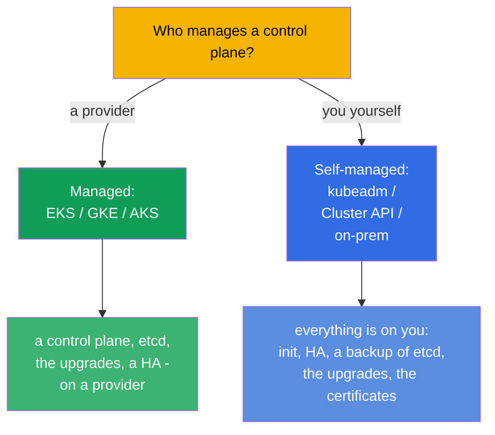
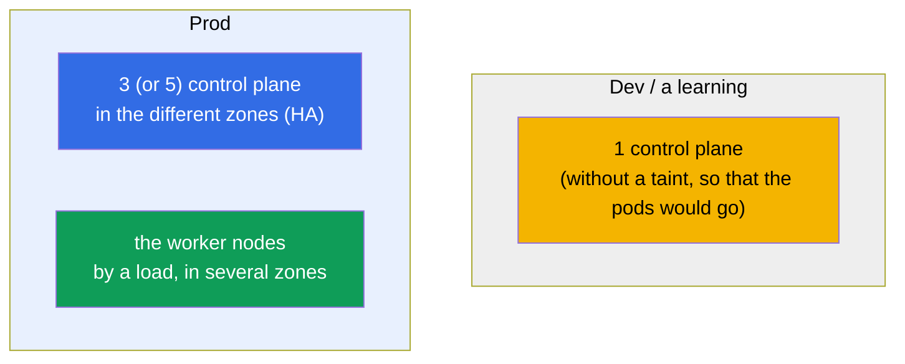
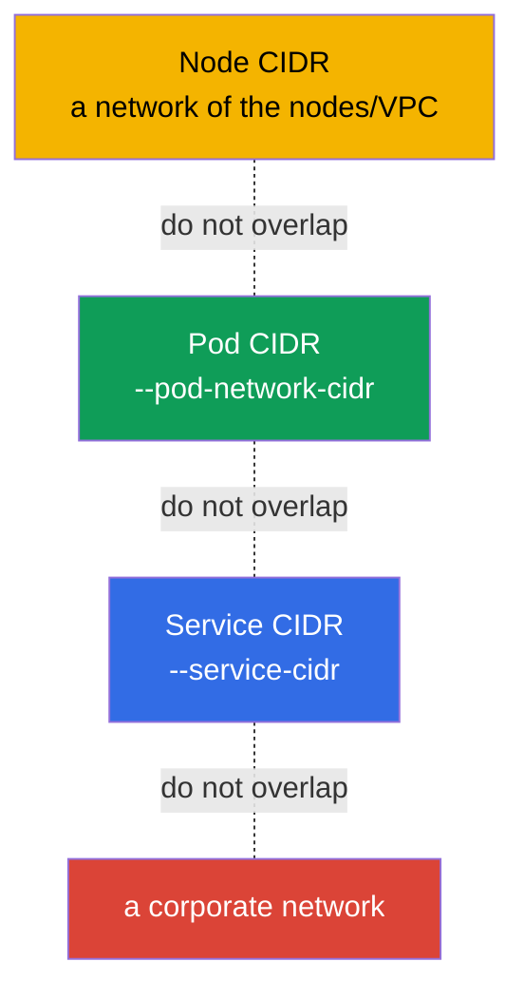
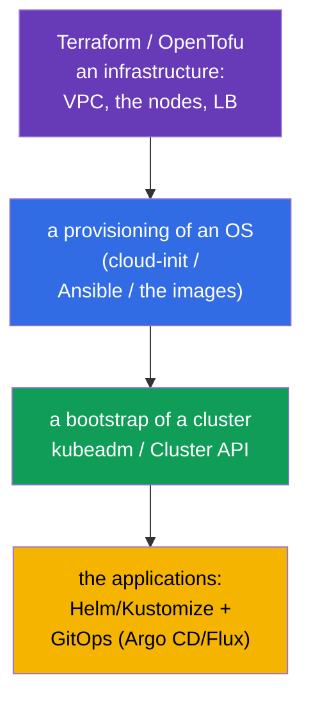

[Русская версия](ru.md) · [Versión en español](es.md) · [Version française](fr.md) · [Deutsche Version](de.md) · [ქართული ვერსია](ge.md)

# Chapter 35B. A designing and a sizing of a cluster: an infrastructure, a topology, IaC

> 🟦 **A chapter for the CKA** (a domain Cluster Architecture, Installation & Configuration, 25%).
> For the CKAD it is not required.
>
> **What comes next.** In the chapters 35 and 35A we have learned to install a cluster and to make it
> fault tolerant. But before an installation a cluster has to be **designed**: where it lives
> (managed or self-managed), how many and which nodes, how to plan the address
> spaces, how to describe all of this by a code (IaC). This is a part of a domain Installation & Configuration
> and a daily work of a platform engineer. It leans on the chapters 0.1 (a network/CIDR), 2
> (an architecture), 35/35A (an installation/a HA).

## 35B.1. Managed or self-managed: a first decision

A first design decision - who maintains a control plane.

| | **Managed (EKS/GKE/AKS)** | **Self-managed (kubeadm/on-prem)** |
|--|---------------------------|-------------------------------------|
| A control plane, etcd | a provider maintains them (HA, a backup) | your responsibility (the chapters 35A, 37) |
| The upgrades of a control plane | by a button/an API | manually (the chapter 36) |
| A control and a customization | are limited | full |
| A cost | a payment for a management | your own hardware/the operational efforts |
| When | a majority of the prod workloads in a cloud | on-prem, the specific requirements, a learning (CKA) |

A rule: in a cloud they take **managed** by default (less of an operational risk); self-managed is
chosen, when a full control, on-prem or the specific installations are needed. The CKA teaches exactly
a self-managed - because there you do everything by hands.

## 35B.2. A topology: how many control plane and worker nodes

A design of a fault tolerance repeats the chapter 35A, but here we look at a cluster as a whole.

- **A control plane:** dev - one; prod - an **odd** number (3/5) in the different availability zones
  (the chapter 35A, a quorum of etcd).
- **The worker nodes:** a number and a size - by the total requests of the workloads + a reserve; they are spread over the
  zones, so that a failure of a zone would not carry away all the replicas (topologySpread/antiAffinity, the chapter 12).
- **The separate pools of the nodes:** for the different profiles (CPU-, memory-, GPU-nodes; spot vs on-demand)
  they set up the different node pools with the labels/taints (the chapters 6, 13).

## 35B.3. A sizing of the nodes: a few big ones or many small ones

One of the key design choices - a size of a node.

| | A few **big** nodes | Many **small** nodes |
|--|----------------------|-------------------------|
| A density/an efficiency | higher (less of an overhead on an OS/kubelet) | lower |
| A radius of a failure | bigger (a node has fallen - many pods) | smaller |
| A limit of the pods per a node | they run into ~110 pods/a node | it is distributed |
| The large pods | fit | may not squeeze in |

A practice: they avoid the extremes. They take into account:
- a **limit of ~110 pods per a node** (by default) - a ceiling of a density;
- the **overhead**: an OS, kubelet, the system DaemonSets eat a part of every node
  (`Allocatable` < `Capacity`, the chapter 14);
- a **radius of a failure**: too big nodes are dangerous - a fall of one touches a lot of a workload.

## 35B.4. A planning of the address spaces (in advance!)

The most frequent irreversible mistake - the ill-considered CIDR. Three non-overlapping spaces
(the chapters 0.1, 30):

- A **Pod CIDR** has to accommodate `max_pods × nodes` with a reserve for a growth - a too small one
  will run into a ceiling at a scaling, and to change it on a live cluster is extremely painful.
- The Node/Pod/Service CIDR **do not overlap** between themselves and with a corporate network (otherwise
  "the pods do not see each other" and the conflicts of the routes).
- They plan **before** an installation and agree with a network team - this is a part of a design, and not
  "we will fix it later".

## 35B.5. An infrastructure as a code (IaC)

The clusters are not created by "the clicks" - they are described by a code for a reproducibility and an audit.

- An **infrastructure** (VPC, the subnets, the nodes, a balancer) - Terraform/OpenTofu (exactly this way
  the labs of a course are arranged).
- A **preparation of an OS** (swap, the modules, containerd, kube*) - cloud-init/Ansible/the ready images
  (the chapter 35), so that the nodes would be identical.
- A **bootstrap of a cluster** - kubeadm (wrapped into an automation) or **Cluster API** (K8s itself
  manages a lifecycle of the clusters declaratively).
- The **applications** - Helm/Kustomize (the chapters 42, 43) through GitOps (Argo CD/Flux): git as
  a single source of a truth.

A principle: everything is reproducible from a code. The manual changes on the nodes - only for a debugging, then
they are returned into a code (otherwise "a drift of a configuration").

## 35B.6. How this is applied in a production

- **Managed by default, self-managed by a necessity.** A majority of the teams take
  EKS/GKE/AKS, in order not to maintain a control plane and etcd; a self-managed - for on-prem,
  a regulatory, an edge and a specific control.
- **A HA and a multi-zonality - are obligatory for a prod.** 3+ control plane and the workers in the different
  zones; the critical workloads are spread by a topologySpread.
- **The node pools for the profiles of the workloads.** The separate pools (CPU/mem/GPU, spot/on-demand) with
  taints/the labels; an autoscaling of the pools by a Cluster Autoscaler/Karpenter (the chapter 16).
- **The CIDR are planned once and with a reserve.** A mistake in a Pod CIDR - an expensive rework; the networks
  are agreed in advance.
- **Everything through IaC + GitOps.** Terraform for an infrastructure, Cluster API/kubeadm for
  the clusters, Argo CD/Flux for the applications - a reproducibility, a review, a rollback, an audit.

## 35B.7. A mini glossary

- **A managed cluster** - a provider maintains a control plane (EKS/GKE/AKS).
- **Self-managed** - you install and maintain a control plane (kubeadm/on-prem).
- **A node pool** - a group of the nodes of one type (a profile, a zone, spot/on-demand).
- **A radius of a failure (blast radius)** - how much of a workload a failure of one element touches.
- **Allocatable** - the resources of a node, available to the pods (a Capacity minus an overhead, the chapter 14).
- **a limit of ~110 pods/a node** - a ceiling of a number of the pods per a node by default.
- **IaC** - an infrastructure as a code (Terraform/OpenTofu, Ansible).
- **Cluster API** - a declarative management of a lifecycle of the clusters.
- **GitOps** - git as a source of a truth for a state of a cluster (Argo CD/Flux).

## 35B.8. The results of a chapter

- A first decision - managed (EKS/GKE/AKS) or self-managed (kubeadm/on-prem): the more is
  on a provider, the less of an operational risk; the CKA - is about a self-managed.
- A topology: dev - one control plane; prod - an odd number (3/5) in the different zones +
  the workers by a load; the separate node pools for the profiles.
- A sizing of the nodes - a balance: the big nodes are denser, but a radius of a failure is bigger; to remember about ~110
  pods/a node and about an overhead (Allocatable).
- The CIDR (Node/Pod/Service) are planned in advance, with a reserve and without the overlaps - this is irreversible
  on a live cluster.
- Everything is described by a code: Terraform (an infra) → cloud-init/Ansible (an OS) → kubeadm/Cluster API
  (a cluster) → Helm/Kustomize + GitOps (the applications).

## 35B.9. How this will come in handy: on an exam and in a real work

**On an exam (CKA).** There are no direct tasks "design a cluster", but an understanding of a topology
(how many control plane, why an odd number), of a sizing and of a planning of the CIDR is needed for
an installation (the chapter 35), a HA (35A) and a troubleshooting of a network. This is a part of a domain Installation (25%).

**In a real work.** A designing - is a half of a success of an operation: a choice of a managed/
a self-managed, a topology and the zones, a sizing of the pools, a planning of the address spaces and IaC/
GitOps determine, whether a cluster will be reliable and reproducible or a "snowflake", which
is scary to touch.

## 35B.10. The questions for a self-check

1. In what does a managed cluster differ from a self-managed one and when is each chosen?
2. How many control plane nodes are needed for a dev and for a prod and why an odd number?
3. What are the pluses and the minuses of the big nodes against the small ones? What is a radius of a failure?
4. Why is it important to plan a Pod CIDR in advance and with a reserve?
5. Of which layers does an IaC stack of a cluster consist (an infra → an OS → a cluster → the applications)?
6. What is a node pool and why to separate the nodes into the pools?

## Practice

We have designed a cluster "on a paper". An assembling of a HA is worked out by the lab 124, an installation from a scratch -
by the lab 116; an infrastructure of all the labs of a course is described as IaC (Terraform/Terragrunt) - one can
look into `tasks/cka/labs/*/`. Further (the chapter 36) - a safe update of a cluster.

🧪 A lab 116 (an installation) · A lab 124 (a HA): [tasks/cka/labs/124](../../labs/124/README.MD)

---
[Contents](../README.md) · [Chapter 35A](../35-2-ha/README.md) · [Chapter 36](../36/README.md)
